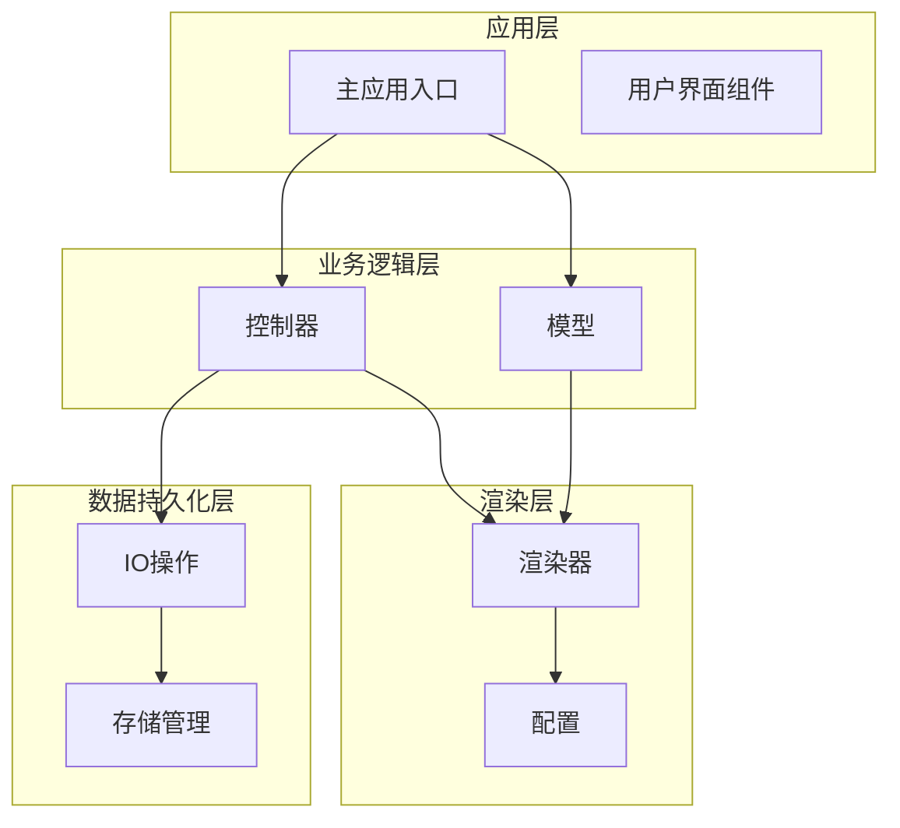
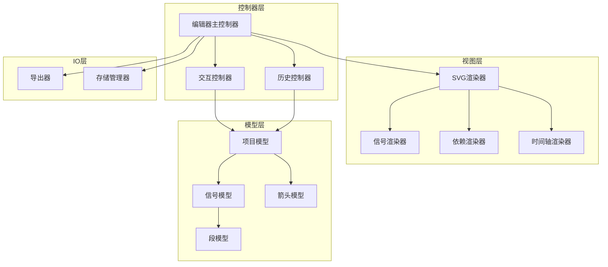
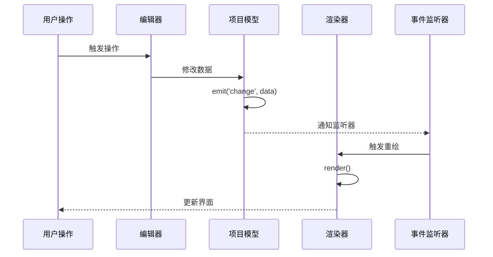
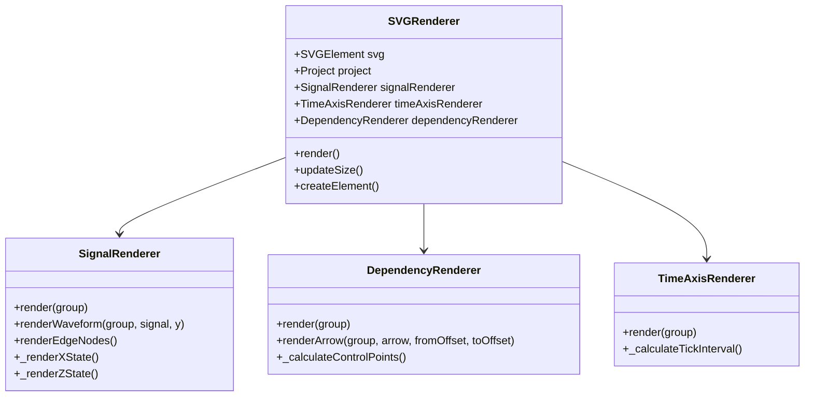
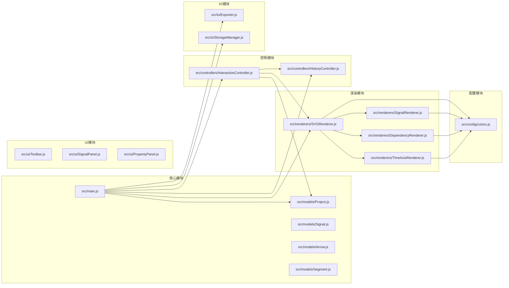

# API参考文档

<cite>
**本文档引用的文件**
- [src/main.js](file://src/main.js)
- [src/models/Project.js](file://src/models/Project.js)
- [src/models/Signal.js](file://src/models/Signal.js)
- [src/models/Arrow.js](file://src/models/Arrow.js)
- [src/models/Segment.js](file://src/models/Segment.js)
- [src/renderers/SVGRenderer.js](file://src/renderers/SVGRenderer.js)
- [src/renderers/SignalRenderer.js](file://src/renderers/SignalRenderer.js)
- [src/renderers/DependencyRenderer.js](file://src/renderers/DependencyRenderer.js)
- [src/renderers/TimeAxisRenderer.js](file://src/renderers/TimeAxisRenderer.js)
- [src/controllers/InteractionController.js](file://src/controllers/InteractionController.js)
- [src/controllers/HistoryController.js](file://src/controllers/HistoryController.js)
- [src/io/Exporter.js](file://src/io/Exporter.js)
- [src/io/StorageManager.js](file://src/io/StorageManager.js)
- [src/ui/Toolbar.js](file://src/ui/Toolbar.js)
- [src/ui/SignalPanel.js](file://src/ui/SignalPanel.js)
- [src/ui/PropertyPanel.js](file://src/ui/PropertyPanel.js)
- [src/config/colors.js](file://src/config/colors.js)
</cite>

## 目录
1. [简介](#简介)
2. [项目结构](#项目结构)
3. [核心组件](#核心组件)
4. [架构概览](#架构概览)
5. [详细组件分析](#详细组件分析)
6. [依赖分析](#依赖分析)
7. [性能考虑](#性能考虑)
8. [故障排除指南](#故障排除指南)
9. [结论](#结论)

## 简介

波形图编辑器是一个基于Web的可视化波形编辑工具，支持创建、编辑和导出数字电路波形图。该系统采用模块化架构，包含模型层、渲染层、控制器层和IO层，提供了完整的波形编辑功能。

## 项目结构

项目采用清晰的分层架构，主要分为以下层次：

**图表来源**
- [src/main.js:1-819](file://src/main.js#L1-L819)
- [src/models/Project.js:1-245](file://src/models/Project.js#L1-L245)
- [src/renderers/SVGRenderer.js:1-547](file://src/renderers/SVGRenderer.js#L1-L547)

**章节来源**
- [src/main.js:1-819](file://src/main.js#L1-L819)
- [src/config/colors.js:1-83](file://src/config/colors.js#L1-L83)

## 核心组件

### WaveformEditor 主类

WaveformEditor是整个应用的核心控制器类，负责协调各个子系统的协作。

**公共方法：**

- `constructor()` - 构造函数，初始化编辑器状态和组件
- `init()` - 异步初始化编辑器，加载项目数据并设置事件监听
- `addSignal(type)` - 添加新信号到项目中
- `addGap()` - 在选中信号中添加分隔符
- `selectSignal(signalId)` - 选中指定信号
- `selectSegment(signalId, segmentIndex)` - 选中指定波形段
- `undo()` - 执行撤销操作
- `redo()` - 执行重做操作
- `render()` - 渲染波形图
- `switchSheet(sheetId)` - 切换工作表
- `addSheet()` - 添加新工作表
- `deleteSheet(sheetId)` - 删除工作表
- `renameSheet(sheetId, name)` - 重命名工作表

**章节来源**
- [src/main.js:21-800](file://src/main.js#L21-L800)

### 项目模型 Project

Project类表示一个完整的波形图项目，包含所有信号、箭头和时间轴信息。

**构造函数参数：**
- `options.id` - 项目唯一标识符
- `options.name` - 项目名称
- `options.timeAxis` - 时间轴配置对象

**公共方法：**

- `addSignal(signal)` - 添加信号到项目
- `removeSignal(signalId)` - 从项目移除信号
- `getSignalById(signalId)` - 根据ID获取信号
- `getSignalIndex(signalId)` - 获取信号索引
- `addArrow(arrow)` - 添加依赖箭头
- `removeArrow(arrowId)` - 移除依赖箭头
- `getArrowById(arrowId)` - 根据ID获取箭头
- `moveSignal(signalId, newIndex)` - 移动信号位置
- `setTimeRange(start, end)` - 设置时间轴范围
- `setTimeScale(scale)` - 设置时间轴缩放
- `getTimeAxisWidth()` - 获取时间轴宽度
- `timeToX(time)` - 时间转换为X坐标
- `xToTime(x)` - X坐标转换为时间
- `toJSON()` - 序列化为JSON对象
- `static fromJSON(json)` - 从JSON创建项目

**事件系统：**
- `on(event, callback)` - 注册事件监听
- `off(event, callback)` - 移除事件监听
- `emit(event, data)` - 触发事件

**章节来源**
- [src/models/Project.js:8-245](file://src/models/Project.js#L8-L245)

### 信号模型 Signal

Signal类表示单个波形信号，包含波形段和相关配置。

**构造函数参数：**
- `options.id` - 信号唯一标识符
- `options.name` - 信号名称
- `options.type` - 信号类型（'signal' | 'clock' | 'bus'）

**公共方法：**

- `addGap(time)` - 添加分隔符
- `removeGap(gapId)` - 移除分隔符
- `addSegment(segmentData)` - 添加波形段（自动合并相邻同值段）
- `setValueAt(startTime, endTime, value, color)` - 设置指定时间范围的电平值
- `getValueAt(time)` - 获取指定时间点的电平值
- `getSegmentIndexAt(time)` - 获取指定时间点的段索引
- `snapToEdge(time, threshold)` - 吸附到最近的跳变沿
- `generateClockSegments(endTime)` - 生成时钟波形段
- `moveEdge(segmentIndex, edge, newTime)` - 移动跳变沿位置
- `clone()` - 克隆信号
- `toJSON()` - 序列化为JSON对象
- `static fromJSON(json)` - 从JSON创建信号

**章节来源**
- [src/models/Signal.js:7-343](file://src/models/Signal.js#L7-L343)

### 波形段模型 Segment

Segment类表示信号的一个电平段。

**构造函数参数：**
- `options.startTime` - 开始时间
- `options.endTime` - 结束时间
- `options.value` - 电平值（0, 1, 'X', 'Z', 或十六进制字符串）

**公共方法：**
- `contains(time)` - 检查时间点是否在此段内
- `overlaps(other)` - 检查是否与另一段重叠
- `clone()` - 克隆此段
- `toJSON()` - 序列化为JSON对象
- `static fromJSON(json)` - 从JSON创建段

**章节来源**
- [src/models/Segment.js:5-94](file://src/models/Segment.js#L5-L94)

### 依赖箭头模型 Arrow

Arrow类表示信号间的依赖关系箭头。

**构造函数参数：**
- `options.fromSignalId` - 起始信号ID
- `options.fromTime` - 起始时间
- `options.toSignalId` - 终点信号ID
- `options.toTime` - 终点时间
- `options.direction` - 方向（'auto' | 'forward' | 'backward'）
- `options.isBidirectional` - 是否为双向箭头

**公共方法：**
- `addLabel(text, offset)` - 添加标签
- `removeLabel(labelId)` - 移除标签
- `getLabelById(labelId)` - 根据ID获取标签
- `toJSON()` - 序列化为JSON对象
- `static fromJSON(json)` - 从JSON创建箭头

**章节来源**
- [src/models/Arrow.js:5-114](file://src/models/Arrow.js#L5-L114)

## 架构概览

系统采用典型的MVC架构模式，结合事件驱动的设计：

**图表来源**
- [src/main.js:21-132](file://src/main.js#L21-L132)
- [src/renderers/SVGRenderer.js:10-547](file://src/renderers/SVGRenderer.js#L10-L547)
- [src/controllers/InteractionController.js:6-800](file://src/controllers/InteractionController.js#L6-L800)

## 详细组件分析

### 事件系统详解

波形图编辑器实现了基于发布-订阅模式的事件系统，支持项目级别的事件通知。

**事件类型：**
- `'change'` - 项目数据发生变化
- `'addSignal'` - 添加信号
- `'removeSignal'` - 移除信号
- `'moveSignal'` - 移动信号
- `'addArrow'` - 添加箭头
- `'removeArrow'` - 移除箭头
- `'timeRange'` - 时间轴范围变化
- `'timeScale'` - 时间轴缩放变化

**事件处理流程：**

**图表来源**
- [src/models/Project.js:177-202](file://src/models/Project.js#L177-L202)
- [src/main.js:230-241](file://src/main.js#L230-L241)

**章节来源**
- [src/models/Project.js:172-202](file://src/models/Project.js#L172-L202)
- [src/main.js:448-629](file://src/main.js#L448-L629)

### 交互控制系统

InteractionController负责处理用户的所有交互操作，包括信号编辑、箭头创建、时间轴操作等。

**主要交互功能：**

1. **信号编辑交互**
   - 边沿拖拽：移动波形段的起始或结束时间
   - 分隔符拖拽：调整信号分隔符位置
   - 信号选择：点击信号名称或波形区域

2. **箭头交互**
   - 箭头创建：Alt键+拖拽创建依赖箭头
   - 箭头编辑：拖拽端点调整箭头位置
   - 标注编辑：拖拽文字标注位置

3. **时间轴操作**
   - 时间轴缩放：拖拽右侧手柄扩展时间轴
   - 边缘滚动：鼠标靠近右侧边缘自动扩展

**章节来源**
- [src/controllers/InteractionController.js:6-800](file://src/controllers/InteractionController.js#L6-L800)

### 渲染系统架构

渲染系统采用分层渲染策略，将复杂的波形渲染分解为多个专门的渲染器。

**渲染器层次结构：**

**图表来源**
- [src/renderers/SVGRenderer.js:10-547](file://src/renderers/SVGRenderer.js#L10-L547)
- [src/renderers/SignalRenderer.js:6-501](file://src/renderers/SignalRenderer.js#L6-L501)
- [src/renderers/DependencyRenderer.js:7-290](file://src/renderers/DependencyRenderer.js#L7-L290)
- [src/renderers/TimeAxisRenderer.js:6-132](file://src/renderers/TimeAxisRenderer.js#L6-L132)

**章节来源**
- [src/renderers/SVGRenderer.js:10-314](file://src/renderers/SVGRenderer.js#L10-L314)
- [src/renderers/SignalRenderer.js:6-501](file://src/renderers/SignalRenderer.js#L6-L501)

### 数据持久化系统

StorageManager提供完整的数据持久化功能，支持多工作表管理和项目导入导出。

**主要功能：**
- 多工作表管理：支持同时管理多个波形图项目
- 数据迁移：从旧格式迁移到新格式
- 项目导入导出：支持.wfp格式文件
- 模板管理：保存和加载项目模板

**章节来源**
- [src/io/StorageManager.js:1-368](file://src/io/StorageManager.js#L1-L368)

### 导出系统

Exporter支持多种格式的波形图导出，满足不同的使用场景。

**支持的导出格式：**
- SVG矢量图形：高质量矢量输出
- PNG位图：适合嵌入文档
- JSON数据：项目数据备份
- 独立HTML：包含完整模板的可执行文件

**章节来源**
- [src/io/Exporter.js:1-298](file://src/io/Exporter.js#L1-L298)

## 依赖分析

系统采用模块化设计，各模块间依赖关系清晰：

**图表来源**
- [src/main.js:4-16](file://src/main.js#L4-L16)
- [src/renderers/SVGRenderer.js:5-8](file://src/renderers/SVGRenderer.js#L5-L8)

**章节来源**
- [src/main.js:4-16](file://src/main.js#L4-L16)

## 性能考虑

### 渲染优化

1. **增量渲染**：只重绘发生变化的部分，避免全量重绘
2. **虚拟DOM**：使用SVG元素的高效更新机制
3. **缓存机制**：缓存计算结果，避免重复计算

### 内存管理

1. **对象池**：复用SVG元素，减少内存分配
2. **垃圾回收**：及时清理事件监听器和DOM引用
3. **数据压缩**：序列化时去除不必要的属性

### 交互响应性

1. **请求动画帧**：使用requestAnimationFrame优化动画
2. **节流防抖**：对频繁触发的操作进行节流处理
3. **异步处理**：耗时操作异步执行，避免阻塞主线程

## 故障排除指南

### 常见问题及解决方案

**问题1：项目加载失败**
- 检查localStorage权限
- 验证项目文件格式
- 查看控制台错误信息

**问题2：渲染异常**
- 确认SVG元素存在
- 检查CSS样式冲突
- 验证数据完整性

**问题3：交互无响应**
- 检查事件监听器绑定
- 验证鼠标事件处理
- 确认z-index层级

**章节来源**
- [src/main.js:73-84](file://src/main.js#L73-L84)
- [src/main.js:90-94](file://src/main.js#L90-L94)

### 错误处理机制

系统实现了完善的错误处理机制：

1. **数据验证**：在关键操作前验证输入参数
2. **异常捕获**：使用try-catch处理潜在异常
3. **降级处理**：出现错误时提供合理的默认行为
4. **用户反馈**：通过控制台和界面提示错误信息

**章节来源**
- [src/models/Segment.js:24-28](file://src/models/Segment.js#L24-L28)
- [src/main.js:738-742](file://src/main.js#L738-L742)

## 结论

波形图编辑器是一个功能完整、架构清晰的Web应用。其模块化设计使得各组件职责明确，易于维护和扩展。事件驱动的架构模式提供了良好的响应性和可扩展性。完善的错误处理和性能优化确保了系统的稳定性和用户体验。

该系统为数字电路设计人员提供了一个强大而易用的波形编辑工具，支持从简单波形创建到复杂依赖关系建模的各种需求。