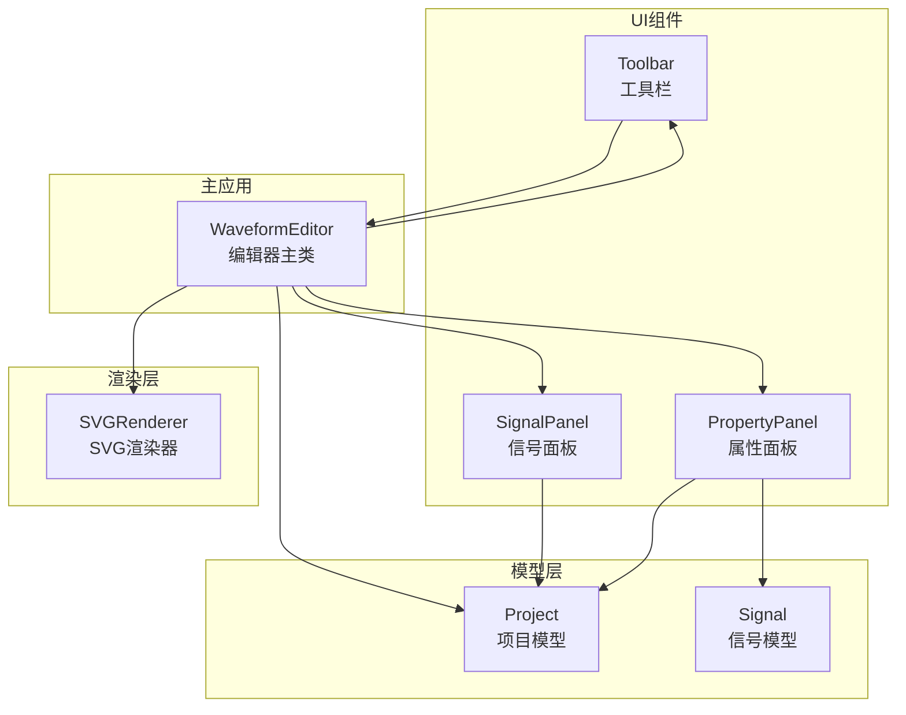
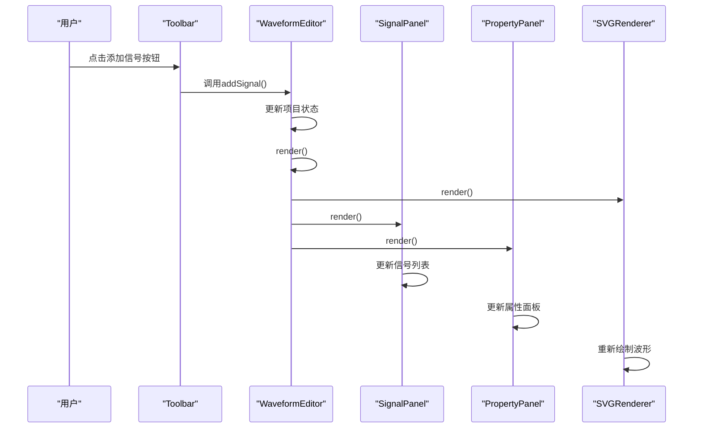
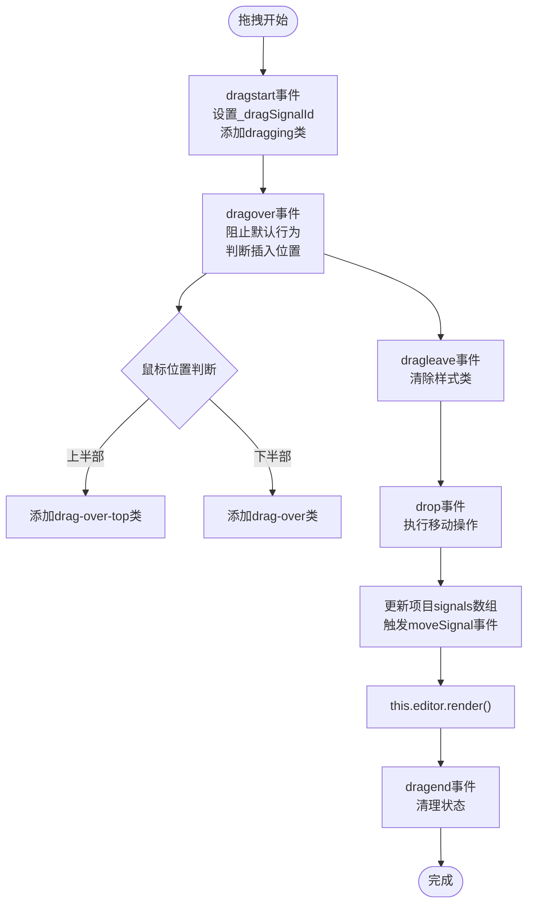
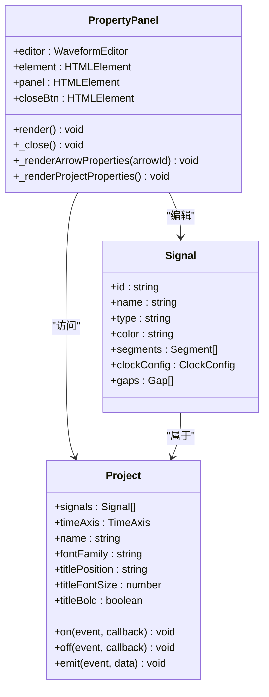
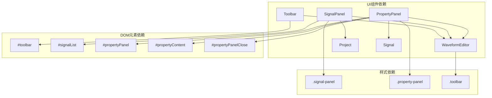

# UI组件API

<cite>
**本文档引用的文件**
- [Toolbar.js](file://src/ui/Toolbar.js)
- [SignalPanel.js](file://src/ui/SignalPanel.js)
- [PropertyPanel.js](file://src/ui/PropertyPanel.js)
- [main.js](file://src/main.js)
- [index.html](file://index.html)
- [main.css](file://styles/main.css)
- [Project.js](file://src/models/Project.js)
- [Signal.js](file://src/models/Signal.js)
</cite>

## 目录
1. [简介](#简介)
2. [项目结构](#项目结构)
3. [核心组件](#核心组件)
4. [架构概览](#架构概览)
5. [详细组件分析](#详细组件分析)
6. [依赖关系分析](#依赖关系分析)
7. [性能考虑](#性能考虑)
8. [故障排除指南](#故障排除指南)
9. [结论](#结论)
10. [附录](#附录)

## 简介
本文件为波形图编辑器的UI组件API文档，重点记录Toolbar工具栏、SignalPanel信号面板、PropertyPanel属性面板等UI组件的API接口。文档涵盖组件的初始化方法、render()渲染方法、事件处理方法，以及组件的配置参数、样式定制和事件回调机制。同时说明组件之间的通信机制和数据绑定方式，并提供UI组件扩展和自定义样式的开发指南。

## 项目结构
UI组件位于src/ui目录下，分别实现工具栏、信号面板和属性面板的功能。这些组件通过WaveformEditor主类进行协调，实现完整的波形图编辑功能。

**图表来源**
- [Toolbar.js:1-6](file://src/ui/Toolbar.js#L1-L6)
- [SignalPanel.js:1-164](file://src/ui/SignalPanel.js#L1-L164)
- [PropertyPanel.js:1-507](file://src/ui/PropertyPanel.js#L1-L507)
- [main.js:21-44](file://src/main.js#L21-L44)

**章节来源**
- [main.js:114-118](file://src/main.js#L114-L118)
- [index.html:10-83](file://index.html#L10-L83)

## 核心组件
UI组件由三个主要类组成：
- Toolbar：提供工具栏功能，包含信号添加、撤销重做、项目操作等按钮
- SignalPanel：管理信号列表的显示、选择、拖拽排序和同步滚动
- PropertyPanel：显示和编辑选中信号或箭头的属性，支持实时更新

每个组件都接收WaveformEditor实例作为构造参数，通过editor对象访问项目状态和触发渲染。

**章节来源**
- [Toolbar.js:1-6](file://src/ui/Toolbar.js#L1-L6)
- [SignalPanel.js:1-8](file://src/ui/SignalPanel.js#L1-L8)
- [PropertyPanel.js:3-12](file://src/ui/PropertyPanel.js#L3-L12)

## 架构概览
UI组件采用松耦合设计，通过WaveformEditor主类进行统一协调。组件间通信基于以下机制：
- 组件通过editor对象访问共享状态
- 事件驱动的数据更新和渲染
- 组件间的协作通过editor的render()方法统一调度

**图表来源**
- [main.js:453-460](file://src/main.js#L453-L460)
- [main.js:763-769](file://src/main.js#L763-L769)

**章节来源**
- [main.js:451-629](file://src/main.js#L451-L629)

## 详细组件分析

### Toolbar工具栏组件API

#### 初始化方法
- 构造函数：`new Toolbar(editor)`
  - 参数：editor - WaveformEditor实例
  - 功能：保存编辑器引用，获取DOM元素

#### 核心属性
- `editor`：WaveformEditor实例引用
- `element`：DOM元素引用（通过ID获取）

#### 事件处理方法
- 通过WaveformEditor的setupEventListeners()方法绑定各类按钮事件
- 支持的交互包括：添加信号、添加时钟、撤销、重做、项目导入导出等

**章节来源**
- [Toolbar.js:1-6](file://src/ui/Toolbar.js#L1-L6)
- [main.js:451-561](file://src/main.js#L451-L561)

### SignalPanel信号面板组件API

#### 初始化方法
- 构造函数：`new SignalPanel(editor)`
  - 参数：editor - WaveformEditor实例
  - 功能：保存编辑器引用，获取DOM元素，初始化拖拽状态

#### 核心属性
- `editor`：WaveformEditor实例引用
- `element`：信号列表容器DOM元素
- `header`：面板头部DOM元素
- `_dragSignalId`：当前拖拽的信号ID
- `_scrollSyncSetup`：滚动同步状态标志

#### 渲染方法
- `render()`：重新渲染信号列表
  - 功能：遍历项目中的信号，生成HTML结构
  - 特性：支持选中状态高亮、拖拽排序、删除按钮

#### 同步方法
- `syncPadding()`：动态计算信号列表的padding-top，确保与SVG波形垂直对齐
- `_setupScrollSync()`：建立信号面板与波形画布的滚动同步

#### 事件处理方法
- `_setupClickHandlers()`：处理信号点击和删除按钮事件
- `_setupDragHandlers()`：处理拖拽排序逻辑
  - 支持拖拽开始、结束、拖拽中、拖拽离开、放置等事件
  - 实现智能插入位置判断（上半部或下半部）

**图表来源**
- [SignalPanel.js:89-163](file://src/ui/SignalPanel.js#L89-L163)

**章节来源**
- [SignalPanel.js:45-163](file://src/ui/SignalPanel.js#L45-L163)

### PropertyPanel属性面板组件API

#### 初始化方法
- 构造函数：`new PropertyPanel(editor)`
  - 参数：editor - WaveformEditor实例
  - 功能：保存编辑器引用，获取DOM元素，绑定关闭按钮事件

#### 核心属性
- `editor`：WaveformEditor实例引用
- `element`：属性内容容器DOM元素
- `panel`：属性面板DOM元素
- `closeBtn`：关闭按钮DOM元素

#### 渲染方法
- `render()`：根据当前选中状态渲染不同类型的属性界面
  - 优先显示箭头属性
  - 其次显示信号属性
  - 最后显示项目设置属性

#### 属性渲染方法
- `_renderArrowProperties(arrowId)`：渲染箭头属性编辑界面
- `_renderProjectProperties()`：渲染项目设置属性界面

#### 关闭方法
- `_close()`：关闭属性面板，重置选中状态

#### 事件处理机制
属性面板通过事件监听器实现双向数据绑定：
- 输入框变更事件：实时更新模型数据
- 下拉框选择事件：切换信号类型
- 颜色选择事件：更新信号颜色
- 按钮点击事件：执行特定操作（如重新生成时钟）

**图表来源**
- [PropertyPanel.js:3-12](file://src/ui/PropertyPanel.js#L3-L12)
- [Signal.js:7-29](file://src/models/Signal.js#L7-L29)
- [Project.js:8-34](file://src/models/Project.js#L8-L34)

**章节来源**
- [PropertyPanel.js:32-237](file://src/ui/PropertyPanel.js#L32-L237)

## 依赖关系分析

### 组件间依赖关系

**图表来源**
- [Toolbar.js:2-5](file://src/ui/Toolbar.js#L2-L5)
- [SignalPanel.js:3-6](file://src/ui/SignalPanel.js#L3-L6)
- [PropertyPanel.js:5-11](file://src/ui/PropertyPanel.js#L5-L11)
- [main.css:24-232](file://styles/main.css#L24-L232)

### 数据流分析
UI组件通过以下路径进行数据传递：
1. 用户交互 → UI组件 → WaveformEditor → 模型层
2. 模型层变更 → 事件通知 → WaveformEditor → UI组件重新渲染
3. UI组件之间通过共享的WaveformEditor实例进行状态同步

**章节来源**
- [main.js:763-769](file://src/main.js#L763-L769)
- [Project.js:177-200](file://src/models/Project.js#L177-L200)

## 性能考虑
- **事件委托优化**：使用事件冒泡机制减少事件监听器数量
- **按需渲染**：只在必要时重新渲染相关组件
- **滚动同步**：通过一次性设置避免频繁的DOM操作
- **拖拽优化**：使用CSS类控制视觉反馈，减少JavaScript计算

## 故障排除指南
- **组件无法初始化**：检查对应的DOM元素是否存在
- **事件无响应**：确认WaveformEditor的setupEventListeners()是否正确调用
- **样式异常**：验证main.css中的相关样式类是否正确应用
- **数据不同步**：检查项目模型的事件机制是否正常工作

**章节来源**
- [main.js:89-94](file://src/main.js#L89-L94)
- [main.js:230-241](file://src/main.js#L230-L241)

## 结论
本UI组件API文档详细记录了Toolbar、SignalPanel、PropertyPanel三个核心组件的接口规范。组件采用模块化设计，通过WaveformEditor主类实现统一协调，实现了良好的可维护性和扩展性。组件间通过事件驱动的方式进行数据交换，确保了状态的一致性。

## 附录

### 组件配置参数
- **Toolbar**：通过WaveformEditor的事件绑定配置
- **SignalPanel**：支持拖拽排序、滚动同步等行为配置
- **PropertyPanel**：支持多种属性编辑模式

### 样式定制指南
- 修改面板宽度：通过CSS变量或直接修改样式类
- 自定义颜色方案：通过CSS变量覆盖默认颜色
- 响应式设计：利用Flexbox布局实现自适应

### 扩展开发指南
- 新增UI组件：遵循现有组件的构造函数和render()方法模式
- 自定义事件处理：通过WaveformEditor的事件系统集成
- 样式扩展：在main.css中添加新的样式类，保持与现有主题一致

**章节来源**
- [main.css:90-232](file://styles/main.css#L90-L232)
- [index.html:11-83](file://index.html#L11-L83)