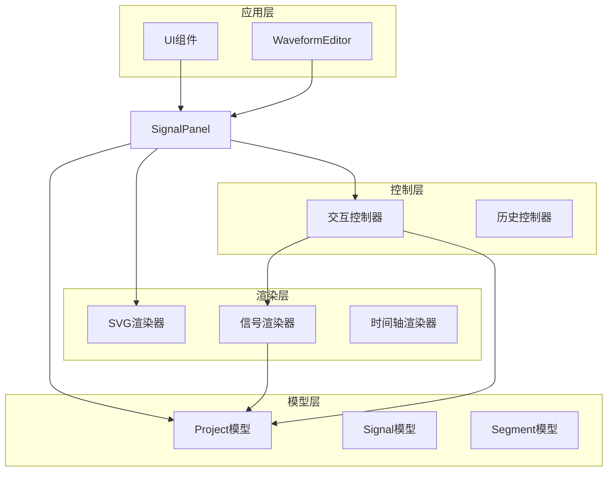
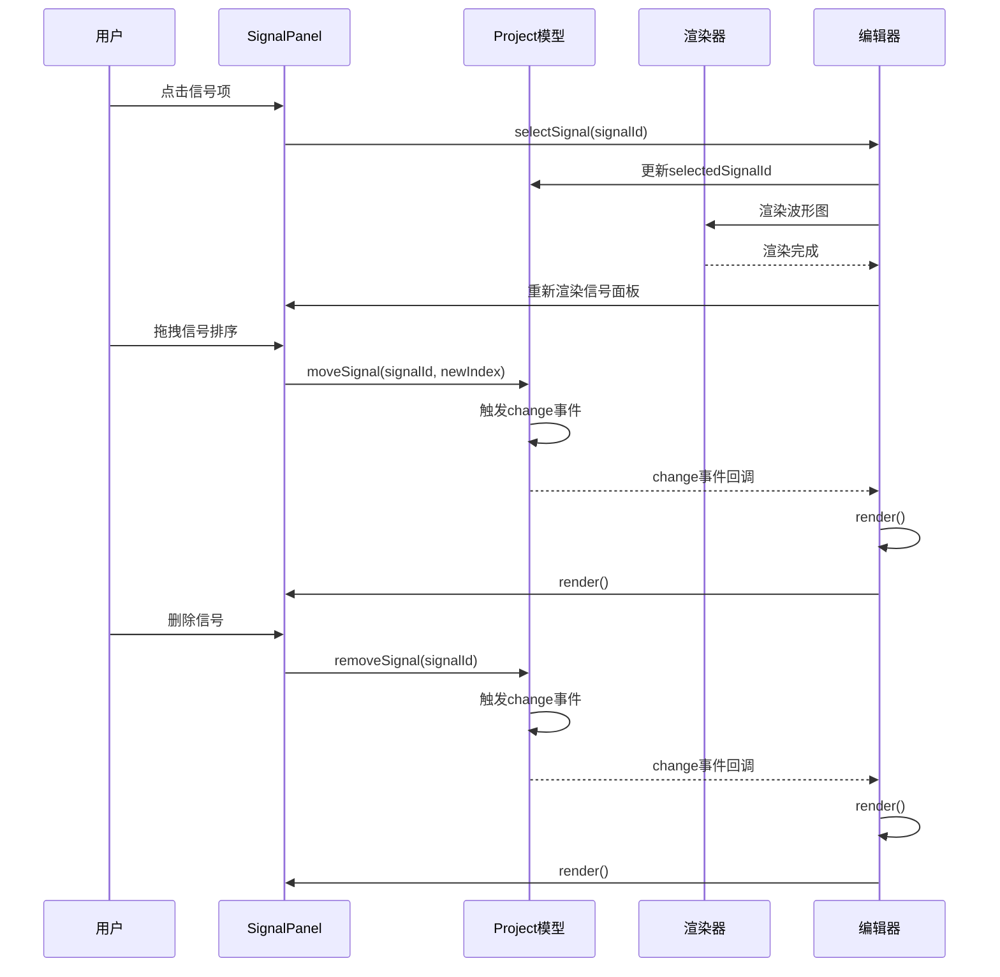
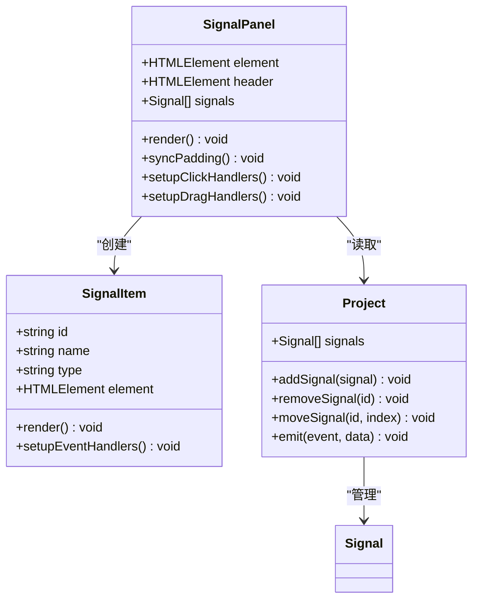
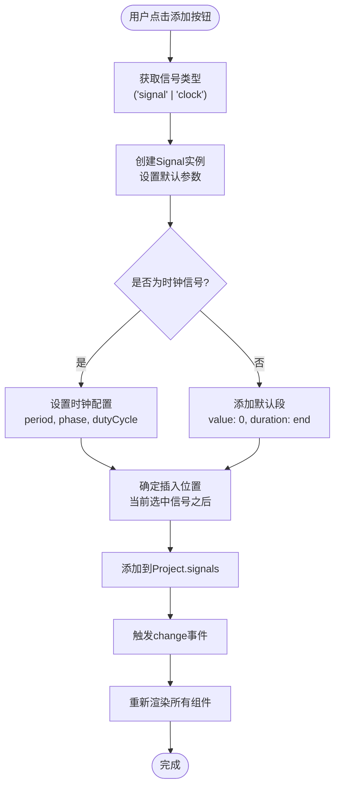
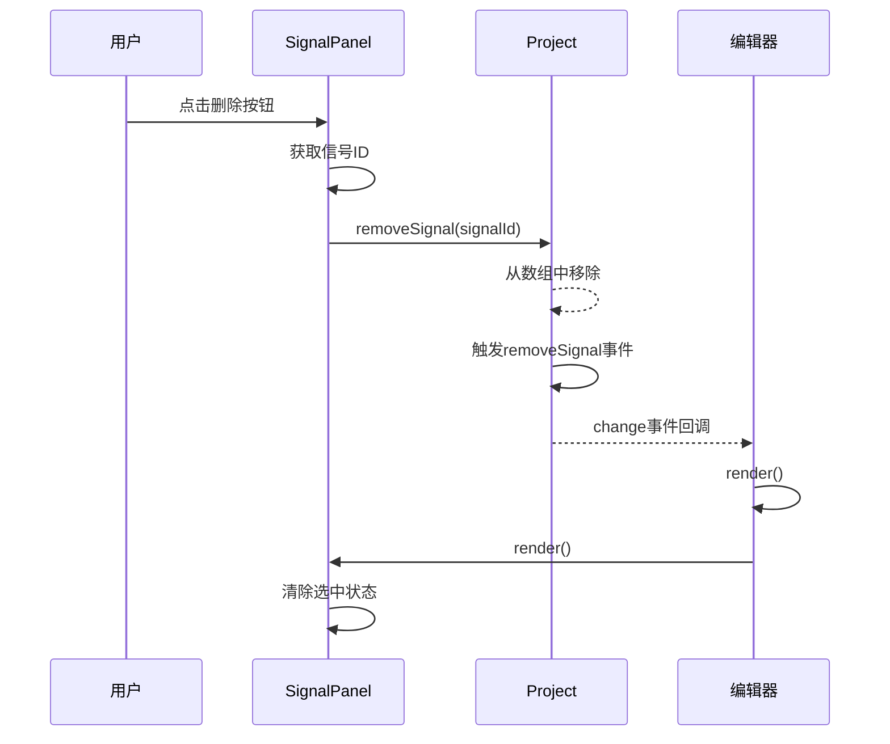
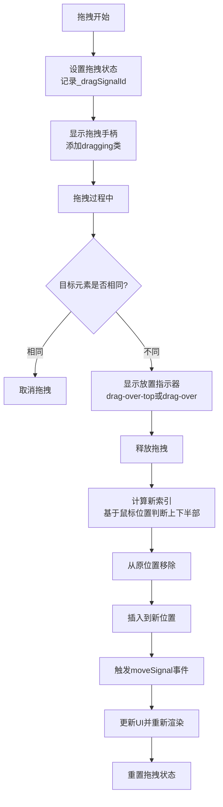
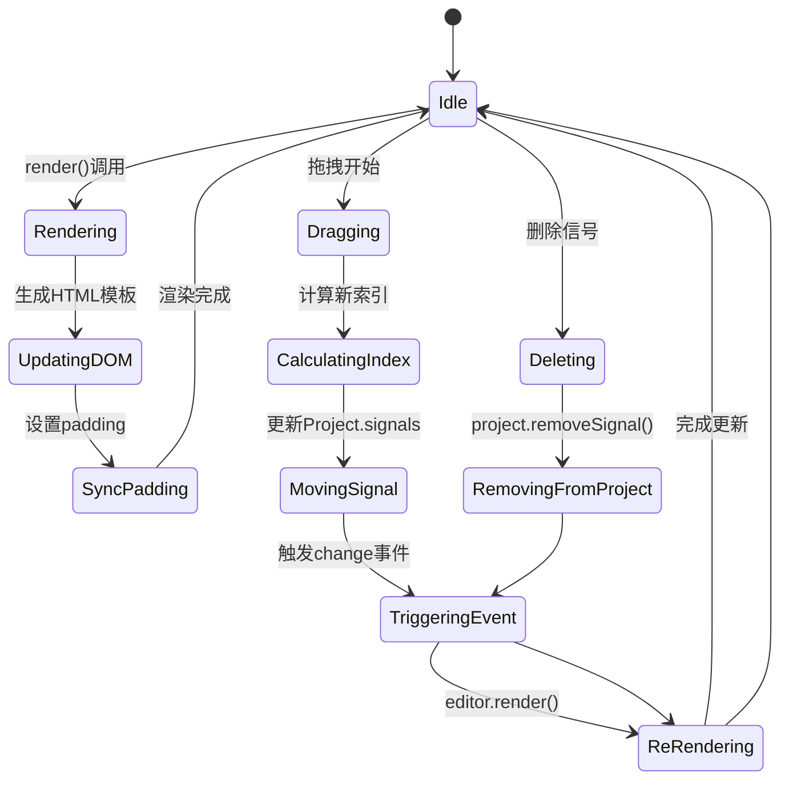
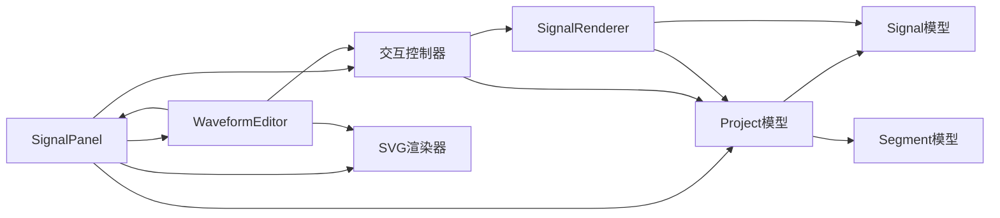

# 信号面板API

<cite>
**本文档引用的文件**
- [src/ui/SignalPanel.js](file://src/ui/SignalPanel.js)
- [src/models/Signal.js](file://src/models/Signal.js)
- [src/models/Project.js](file://src/models/Project.js)
- [src/renderers/SignalRenderer.js](file://src/renderers/SignalRenderer.js)
- [src/controllers/InteractionController.js](file://src/controllers/InteractionController.js)
- [src/main.js](file://src/main.js)
- [src/config/colors.js](file://src/config/colors.js)
- [styles/main.css](file://styles/main.css)
- [index.html](file://index.html)
</cite>

## 目录
1. [简介](#简介)
2. [项目结构](#项目结构)
3. [核心组件](#核心组件)
4. [架构概览](#架构概览)
5. [详细组件分析](#详细组件分析)
6. [依赖关系分析](#依赖关系分析)
7. [性能考虑](#性能考虑)
8. [故障排除指南](#故障排除指南)
9. [结论](#结论)
10. [附录](#附录)

## 简介

SignalPanel信号面板组件是波形图编辑器的核心UI组件之一，负责信号列表的渲染、管理和用户交互。该组件提供了完整的信号生命周期管理功能，包括信号的添加、删除、编辑、拖拽排序等操作，并与Project模型和渲染系统保持实时数据同步。

本组件采用模块化设计，通过事件驱动的方式与编辑器其他部分进行解耦，支持响应式布局和丰富的交互体验。

## 项目结构

波形图编辑器采用清晰的分层架构，SignalPanel位于UI层，与模型层和渲染层协同工作：



**图表来源**
- [src/ui/SignalPanel.js:1-164](file://src/ui/SignalPanel.js#L1-L164)
- [src/models/Project.js:1-245](file://src/models/Project.js#L1-L245)
- [src/renderers/SignalRenderer.js:1-501](file://src/renderers/SignalRenderer.js#L1-L501)

**章节来源**
- [src/ui/SignalPanel.js:1-164](file://src/ui/SignalPanel.js#L1-L164)
- [src/models/Project.js:1-245](file://src/models/Project.js#L1-L245)
- [src/renderers/SignalRenderer.js:1-501](file://src/renderers/SignalRenderer.js#L1-L501)

## 核心组件

### SignalPanel类概述

SignalPanel是信号面板的主要实现类，负责：

- **信号列表渲染**：动态生成信号项DOM结构
- **用户交互处理**：处理点击、拖拽、删除等用户操作
- **滚动同步**：与波形区域保持垂直滚动同步
- **视觉对齐**：确保信号名称与波形显示精确对齐

### 主要属性

| 属性名 | 类型 | 描述 |
|--------|------|------|
| editor | WaveformEditor | 编辑器实例引用 |
| element | HTMLElement | 信号列表容器元素 |
| header | HTMLElement | 信号面板头部元素 |
| _dragSignalId | string | 当前拖拽的信号ID |
| _scrollSyncSetup | boolean | 滚动同步是否已设置 |

### 核心方法

#### 构造函数
```javascript
constructor(editor)
```
初始化SignalPanel实例，设置编辑器引用和DOM元素。

#### 同步内边距
```javascript
syncPadding()
```
动态计算并设置信号列表的paddingTop，使左侧信号名与SVG波形名垂直对齐。

#### 渲染信号列表
```javascript
render()
```
根据Project模型中的signals数组渲染完整的信号列表。

#### 设置滚动同步
```javascript
_setupScrollSync()
```
建立信号面板与波形区域的滚动同步机制。

**章节来源**
- [src/ui/SignalPanel.js:1-164](file://src/ui/SignalPanel.js#L1-L164)

## 架构概览

SignalPanel与整个编辑器系统的交互关系如下：



**图表来源**
- [src/ui/SignalPanel.js:45-164](file://src/ui/SignalPanel.js#L45-L164)
- [src/models/Project.js:47-124](file://src/models/Project.js#L47-L124)
- [src/main.js:763-769](file://src/main.js#L763-L769)

## 详细组件分析

### 信号列表渲染机制

SignalPanel采用模板字符串方式动态生成信号项，每个信号项包含以下元素：



**图表来源**
- [src/ui/SignalPanel.js:45-67](file://src/ui/SignalPanel.js#L45-L67)
- [src/models/Project.js:47-124](file://src/models/Project.js#L47-L124)

#### 渲染流程

1. **数据获取**：从Project.signals获取信号数组
2. **模板生成**：为每个信号生成HTML模板
3. **事件绑定**：设置点击和拖拽事件处理器
4. **UI更新**：将生成的HTML插入到DOM中

#### 事件处理机制

SignalPanel实现了多种事件处理：

| 事件类型 | 处理器 | 功能描述 |
|----------|--------|----------|
| click | `_setupClickHandlers` | 处理信号项点击和删除按钮点击 |
| dragstart/dragend | `_setupDragHandlers` | 处理信号拖拽开始和结束 |
| dragover/drop | `_setupDragHandlers` | 处理信号拖拽放置 |
| scroll | `_setupScrollSync` | 同步信号面板与波形区域滚动 |

**章节来源**
- [src/ui/SignalPanel.js:45-164](file://src/ui/SignalPanel.js#L45-L164)

### 信号管理功能

#### 信号添加操作

通过编辑器的addSignal方法添加新信号：



**图表来源**
- [src/main.js:634-668](file://src/main.js#L634-L668)
- [src/models/Project.js:47-50](file://src/models/Project.js#L47-L50)

#### 信号删除操作

删除信号的完整流程：



**图表来源**
- [src/ui/SignalPanel.js:77-86](file://src/ui/SignalPanel.js#L77-L86)
- [src/models/Project.js:56-62](file://src/models/Project.js#L56-L62)

#### 信号拖拽排序

拖拽排序功能支持在信号列表中重新排列信号顺序：



**图表来源**
- [src/ui/SignalPanel.js:89-162](file://src/ui/SignalPanel.js#L89-L162)

**章节来源**
- [src/ui/SignalPanel.js:45-164](file://src/ui/SignalPanel.js#L45-L164)
- [src/models/Project.js:117-124](file://src/models/Project.js#L117-L124)

### 数据绑定机制

#### 与Project模型的绑定

SignalPanel通过以下方式与Project模型保持数据同步：

1. **直接访问**：在render方法中直接读取`this.editor.project.signals`
2. **事件监听**：通过Project的事件系统接收变更通知
3. **双向更新**：用户操作直接影响Project状态，Project状态变化触发UI更新

#### 信号状态同步



**图表来源**
- [src/ui/SignalPanel.js:45-67](file://src/ui/SignalPanel.js#L45-L67)
- [src/models/Project.js:47-124](file://src/models/Project.js#L47-L124)

**章节来源**
- [src/ui/SignalPanel.js:13-26](file://src/ui/SignalPanel.js#L13-L26)
- [src/models/Project.js:32-202](file://src/models/Project.js#L32-L202)

### 样式定制选项

SignalPanel支持多种样式定制选项：

#### 响应式布局配置

| CSS类 | 功能描述 | 默认值 |
|-------|----------|--------|
| `.signal-panel` | 面板容器 | 宽度200px，最小100px，最大400px |
| `.signal-list` | 信号列表容器 | 弹性布局，溢出自动滚动 |
| `.signal-item` | 单个信号项 | 高50px，圆角4px，悬停效果 |
| `.drag-handle` | 拖拽手柄 | 字体大小14px，颜色#bbb |
| `.panel-resizer` | 面板调整器 | 宽5px，列向调整光标 |

#### 交互状态样式

| 状态类 | 描述 | 效果 |
|--------|------|------|
| `.selected` | 选中信号 | 蓝色背景透明度0.1 |
| `.dragging` | 正在拖拽 | 透明度0.4 |
| `.drag-over` | 放置指示器 | 底部2px蓝色边框 |
| `.drag-over-top` | 上半部放置指示器 | 顶部2px蓝色边框 |

**章节来源**
- [styles/main.css:89-206](file://styles/main.css#L89-L206)

### 事件回调系统

SignalPanel通过Project的事件系统实现松耦合的通信：

#### 事件类型

| 事件名 | 参数 | 触发时机 | 处理逻辑 |
|--------|------|----------|----------|
| `addSignal` | `{signal}` | 添加信号成功 | 重新渲染信号面板 |
| `removeSignal` | `{signalId}` | 删除信号成功 | 清除选中状态并重新渲染 |
| `moveSignal` | `{signalId, newIndex}` | 信号排序变更 | 重新渲染信号面板 |
| `change` | `data` | 任意项目变更 | 触发编辑器整体渲染 |

#### 事件处理流程

```mermaid
flowchart TD
UserAction[用户操作] --> ProjectOperation[Project操作]
ProjectOperation --> EmitEvent[emit('change', data)]
EmitEvent --> ChangeHandler[change事件处理器]
ChangeHandler --> EditorRender[editor.render()]
EditorRender --> SignalPanelRender[signalPanel.render()]
SignalPanelRender --> UpdateUI[更新UI状态]
```

**图表来源**
- [src/models/Project.js:199-202](file://src/models/Project.js#L199-L202)
- [src/main.js:230-241](file://src/main.js#L230-L241)

**章节来源**
- [src/models/Project.js:32-202](file://src/models/Project.js#L32-L202)

## 依赖关系分析

### 组件间依赖关系



**图表来源**
- [src/ui/SignalPanel.js:1-164](file://src/ui/SignalPanel.js#L1-L164)
- [src/models/Project.js:1-245](file://src/models/Project.js#L1-L245)
- [src/renderers/SignalRenderer.js:1-501](file://src/renderers/SignalRenderer.js#L1-L501)

### 外部依赖

| 依赖项 | 版本 | 用途 |
|--------|------|------|
| colors.js | v18 | 颜色配置和渲染常量 |
| SVGRenderer | v40 | 波形图渲染基础 |
| Signal模型 | v21 | 信号数据结构 |
| Segment模型 | v19 | 波形段数据结构 |

**章节来源**
- [src/ui/SignalPanel.js:1-164](file://src/ui/SignalPanel.js#L1-L164)
- [src/renderers/SignalRenderer.js:1-501](file://src/renderers/SignalRenderer.js#L1-L501)

## 性能考虑

### 渲染优化策略

1. **增量更新**：只在必要时重新渲染信号面板
2. **事件委托**：使用事件冒泡减少事件监听器数量
3. **虚拟滚动**：对于大量信号的情况可考虑实现虚拟滚动
4. **防抖处理**：对频繁触发的事件进行防抖处理

### 内存管理

- **事件清理**：在组件销毁时清理所有事件监听器
- **DOM复用**：尽量复用现有的DOM元素而不是频繁创建销毁
- **缓存机制**：缓存计算结果如信号高度、位置信息

### 性能监控

建议在生产环境中添加性能监控：

```javascript
// 示例：性能监控代码
const startTime = performance.now();
this.render();
const endTime = performance.now();
console.log(`SignalPanel.render took ${endTime - startTime} milliseconds`);
```

## 故障排除指南

### 常见问题及解决方案

#### 信号名称不对齐问题

**症状**：信号名称与波形显示不垂直对齐

**原因**：信号面板内边距计算不准确

**解决方案**：
1. 调用`syncPadding()`方法重新计算内边距
2. 检查渲染器配置中的`signalHeight`和`signalGap`设置
3. 确认header元素存在且正确获取高度

#### 拖拽功能失效

**症状**：信号拖拽无响应

**原因**：
1. 拖拽事件监听器未正确绑定
2. `_dragSignalId`状态未正确设置
3. DOM元素结构发生变化

**解决方案**：
1. 检查`_setupDragHandlers()`方法是否正常执行
2. 确认信号项元素包含正确的`data-signal-id`属性
3. 验证拖拽样式类是否正确添加和移除

#### 滚动同步问题

**症状**：信号面板与波形区域滚动不同步

**原因**：
1. 滚动同步事件监听器未设置
2. DOM元素查找失败
3. 事件监听器重复绑定

**解决方案**：
1. 检查`_setupScrollSync()`方法执行情况
2. 确认`.waveform-canvas`元素存在
3. 避免重复设置滚动同步

**章节来源**
- [src/ui/SignalPanel.js:13-43](file://src/ui/SignalPanel.js#L13-L43)
- [src/ui/SignalPanel.js:89-162](file://src/ui/SignalPanel.js#L89-L162)

## 结论

SignalPanel信号面板组件是一个功能完整、设计良好的UI组件，具有以下特点：

1. **模块化设计**：清晰的职责分离和依赖关系
2. **事件驱动**：通过事件系统实现松耦合通信
3. **响应式交互**：支持拖拽、点击、删除等多种用户操作
4. **数据一致性**：与Project模型保持实时同步
5. **可扩展性**：支持样式定制和功能扩展

该组件为波形图编辑器提供了稳定可靠的信号管理界面，是整个编辑器系统的重要组成部分。

## 附录

### API参考

#### SignalPanel类方法

| 方法名 | 参数 | 返回值 | 描述 |
|--------|------|--------|------|
| `constructor` | `editor: WaveformEditor` | `void` | 构造函数 |
| `syncPadding` | `void` | `void` | 同步信号面板内边距 |
| `render` | `void` | `void` | 渲染信号列表 |
| `selectSignal` | `signalId: string` | `void` | 选择信号 |
| `_setupClickHandlers` | `void` | `void` | 设置点击事件处理器 |
| `_setupDragHandlers` | `void` | `void` | 设置拖拽事件处理器 |
| `_setupScrollSync` | `void` | `void` | 设置滚动同步 |

#### 信号类型支持

| 类型 | 描述 | 特殊属性 |
|------|------|----------|
| `signal` | 普通数字信号 | 标准波形渲染 |
| `clock` | 时钟信号 | 自动时钟波形生成 |
| `bus` | 总线信号 | 特殊的总线渲染样式 |

#### 样式定制指南

1. **面板宽度**：通过CSS变量或直接修改`.signal-panel`宽度
2. **信号项样式**：修改`.signal-item`相关样式类
3. **拖拽样式**：调整`.dragging`、`.drag-over`等状态样式
4. **响应式设计**：利用媒体查询适配不同屏幕尺寸