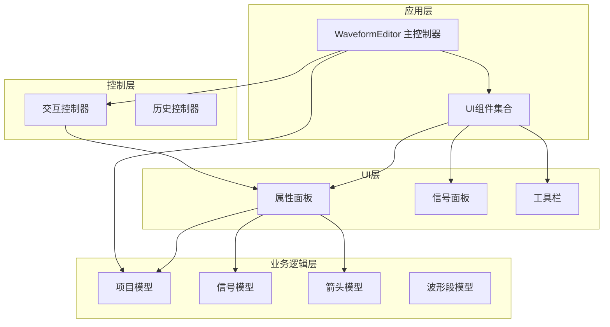
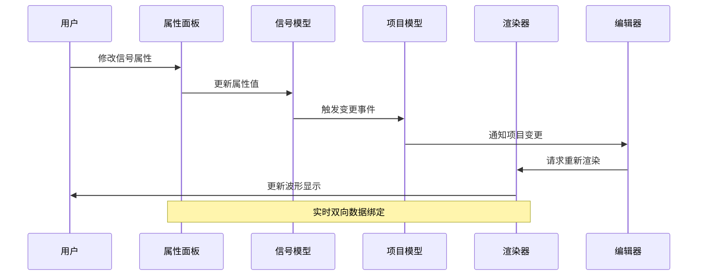
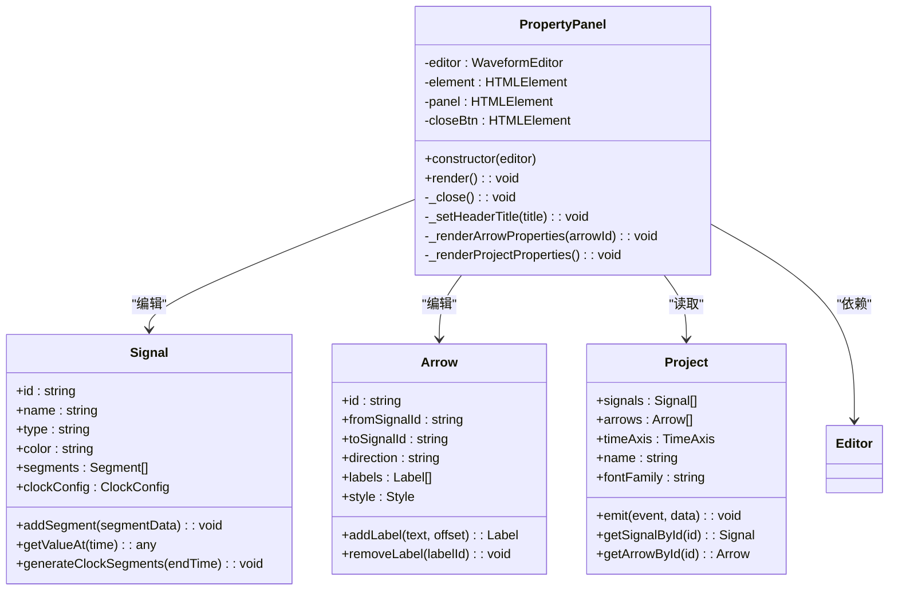
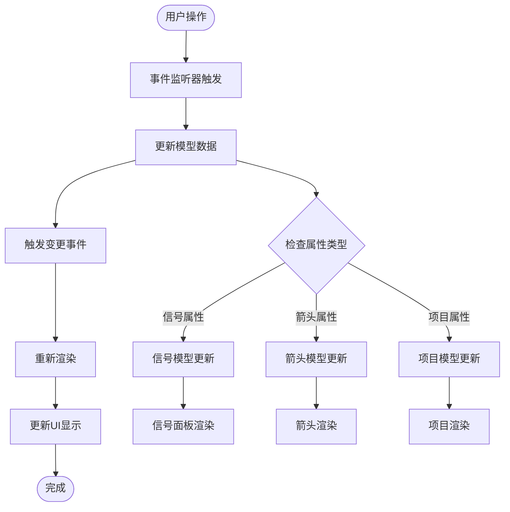
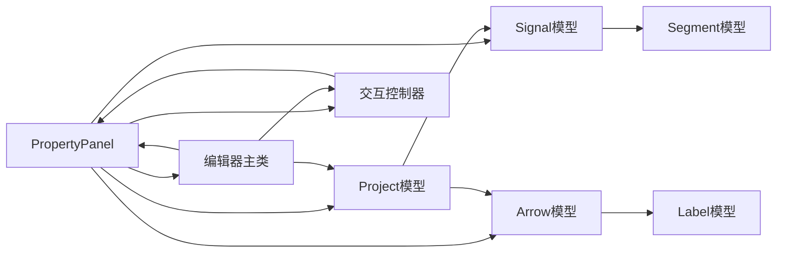

# 属性面板API

<cite>
**本文档引用的文件**
- [PropertyPanel.js](file://src/ui/PropertyPanel.js)
- [Signal.js](file://src/models/Signal.js)
- [Project.js](file://src/models/Project.js)
- [Arrow.js](file://src/models/Arrow.js)
- [InteractionController.js](file://src/controllers/InteractionController.js)
- [main.js](file://src/main.js)
- [SignalPanel.js](file://src/ui/SignalPanel.js)
- [main.css](file://styles/main.css)
</cite>

## 目录
1. [简介](#简介)
2. [项目结构](#项目结构)
3. [核心组件](#核心组件)
4. [架构概览](#架构概览)
5. [详细组件分析](#详细组件分析)
6. [依赖关系分析](#依赖关系分析)
7. [性能考虑](#性能考虑)
8. [故障排除指南](#故障排除指南)
9. [结论](#结论)

## 简介

PropertyPanel属性面板组件是波形图编辑器的核心UI组件之一，负责显示和编辑选中信号的各种属性配置。该组件提供了完整的信号属性管理功能，包括信号名称、类型、颜色等基础属性，以及时钟信号的周期、相位、占空比等高级配置。

## 项目结构

波形图编辑器采用模块化架构设计，PropertyPanel作为UI层组件与业务逻辑层完全分离：

**图表来源**
- [PropertyPanel.js:1-507](file://src/ui/PropertyPanel.js#L1-L507)
- [main.js:21-132](file://src/main.js#L21-L132)

**章节来源**
- [PropertyPanel.js:1-507](file://src/ui/PropertyPanel.js#L1-L507)
- [main.js:1-819](file://src/main.js#L1-L819)

## 核心组件

PropertyPanel组件提供了以下核心功能：

### 初始化方法
- 构造函数接收编辑器实例作为参数
- 初始化DOM元素引用和事件监听器
- 设置面板关闭按钮的点击事件

### 属性显示功能
- 支持三种显示模式：信号属性、箭头属性、项目设置
- 动态渲染对应的属性表单
- 实时更新显示内容

### 属性编辑功能
- 提供信号名称、类型、颜色等基础属性编辑
- 支持时钟信号的周期、相位、占空比配置
- 支持项目级别的字体、标题等全局设置

**章节来源**
- [PropertyPanel.js:3-12](file://src/ui/PropertyPanel.js#L3-L12)
- [PropertyPanel.js:32-237](file://src/ui/PropertyPanel.js#L32-L237)

## 架构概览

PropertyPanel组件遵循MVVM架构模式，与编辑器系统形成松耦合的设计：

**图表来源**
- [PropertyPanel.js:126-132](file://src/ui/PropertyPanel.js#L126-L132)
- [Project.js:199-202](file://src/models/Project.js#L199-L202)

## 详细组件分析

### PropertyPanel 类结构

**图表来源**
- [PropertyPanel.js:3-507](file://src/ui/PropertyPanel.js#L3-L507)
- [Signal.js:7-343](file://src/models/Signal.js#L7-L343)
- [Arrow.js:5-114](file://src/models/Arrow.js#L5-L114)
- [Project.js:8-245](file://src/models/Project.js#L8-L245)

### 信号属性管理

PropertyPanel提供了完整的信号属性管理功能：

#### 基础属性编辑
- **信号名称**: 支持实时编辑，修改后立即更新波形显示
- **信号类型**: 支持普通信号、时钟信号、总线信号三种类型
- **波形颜色**: 支持颜色选择器和重置功能

#### 时钟信号配置
- **时钟周期**: 设置时钟信号的完整周期时间
- **相位偏移**: 设置时钟信号的初始相位
- **占空比**: 设置高电平与低电平的时间比例
- **重新生成**: 基于新配置重新生成时钟波形

#### 时间轴配置
- **开始时间**: 设置波形显示的起始时间
- **结束时间**: 设置波形显示的结束时间
- **缩放比例**: 控制时间轴的缩放程度

**章节来源**
- [PropertyPanel.js:65-124](file://src/ui/PropertyPanel.js#L65-L124)
- [PropertyPanel.js:179-204](file://src/ui/PropertyPanel.js#L179-L204)
- [PropertyPanel.js:206-236](file://src/ui/PropertyPanel.js#L206-L236)

### 箭头属性编辑

PropertyPanel还支持依赖箭头的属性编辑：

#### 箭头属性
- **方向设置**: 支持自动、正向、反向三种方向模式
- **双向箭头**: 可选的双向箭头显示
- **颜色配置**: 支持自定义箭头颜色
- **线宽设置**: 支持细、标准、粗三种线宽
- **线型样式**: 支持实线、虚线、点线样式

#### 文字标注管理
- **多标注支持**: 支持为箭头添加多个文字标注
- **动态添加**: 支持实时添加新的标注
- **标注删除**: 支持删除不需要的标注
- **标注编辑**: 支持实时编辑标注内容

**章节来源**
- [PropertyPanel.js:242-377](file://src/ui/PropertyPanel.js#L242-L377)

### 项目属性设置

PropertyPanel提供项目级别的全局设置：

#### 字体配置
- **字体族**: 支持多种字体族选择
- **标题位置**: 支持顶部或底部显示
- **标题字号**: 支持多种字号选择
- **标题加粗**: 支持标题加粗显示

#### 时间轴设置
- **项目名称**: 支持项目名称的实时编辑
- **时间范围**: 支持开始和结束时间的调整
- **缩放比例**: 支持时间轴缩放的精确控制

**章节来源**
- [PropertyPanel.js:382-506](file://src/ui/PropertyPanel.js#L382-L506)

### 绑定机制和实时更新

PropertyPanel实现了完整的数据绑定机制：

**图表来源**
- [PropertyPanel.js:126-132](file://src/ui/PropertyPanel.js#L126-L132)
- [Project.js:199-202](file://src/models/Project.js#L199-L202)

**章节来源**
- [PropertyPanel.js:14-25](file://src/ui/PropertyPanel.js#L14-L25)
- [InteractionController.js:14-52](file://src/controllers/InteractionController.js#L14-L52)

### 表单验证和错误处理

PropertyPanel采用了渐进式的验证策略：

#### 输入验证
- **数值范围验证**: 对时间轴参数进行范围检查
- **类型转换**: 自动进行数值类型的转换
- **默认值处理**: 对缺失的配置项提供合理的默认值

#### 错误处理
- **异常捕获**: 对DOM操作进行异常捕获
- **状态恢复**: 在错误情况下恢复到安全状态
- **用户反馈**: 通过界面变化提供错误提示

**章节来源**
- [PropertyPanel.js:185-198](file://src/ui/PropertyPanel.js#L185-L198)
- [PropertyPanel.js:476-479](file://src/ui/PropertyPanel.js#L476-L479)

## 依赖关系分析

PropertyPanel组件与其他系统组件的依赖关系：

**图表来源**
- [PropertyPanel.js:1-2](file://src/ui/PropertyPanel.js#L1-L2)
- [Signal.js:5](file://src/models/Signal.js#L5)
- [Arrow.js:5](file://src/models/Arrow.js#L5)
- [Project.js:5-6](file://src/models/Project.js#L5-L6)

**章节来源**
- [PropertyPanel.js:1-2](file://src/ui/PropertyPanel.js#L1-L2)
- [InteractionController.js:6-26](file://src/controllers/InteractionController.js#L6-L26)

## 性能考虑

PropertyPanel在设计时充分考虑了性能优化：

### 渲染优化
- **按需渲染**: 仅在必要时重新渲染属性面板
- **局部更新**: 使用innerHTML进行批量DOM更新
- **事件委托**: 减少事件监听器的数量

### 内存管理
- **事件清理**: 在关闭时清理所有事件监听器
- **DOM复用**: 通过innerHTML复用DOM元素
- **状态同步**: 避免重复的状态更新

### 用户体验
- **实时反馈**: 输入操作立即反映到波形显示
- **无闪烁更新**: 通过高效的DOM操作避免界面闪烁
- **响应式设计**: 支持不同屏幕尺寸的适配

## 故障排除指南

### 常见问题及解决方案

#### 属性面板不显示
- **检查选中状态**: 确认是否有选中的信号或箭头
- **验证DOM元素**: 确认属性面板相关的DOM元素存在
- **检查CSS样式**: 验证属性面板的CSS样式是否正确加载

#### 属性修改无效
- **检查事件绑定**: 确认事件监听器是否正常工作
- **验证数据模型**: 检查信号或箭头模型的数据结构
- **查看控制台错误**: 检查JavaScript控制台是否有错误信息

#### 性能问题
- **减少重绘次数**: 避免频繁的属性面板重建
- **优化事件处理**: 使用防抖技术处理高频事件
- **检查内存泄漏**: 确认事件监听器正确清理

**章节来源**
- [PropertyPanel.js:14-25](file://src/ui/PropertyPanel.js#L14-L25)
- [PropertyPanel.js:32-60](file://src/ui/PropertyPanel.js#L32-L60)

## 结论

PropertyPanel属性面板组件是一个功能完整、设计良好的UI组件，它成功地实现了以下目标：

1. **完整的属性管理**: 支持信号、箭头、项目三类属性的全面管理
2. **实时数据绑定**: 提供流畅的用户体验和即时反馈
3. **模块化设计**: 与业务逻辑层松耦合，便于维护和扩展
4. **性能优化**: 通过多种技术手段确保良好的运行性能
5. **错误处理**: 具备完善的错误处理和恢复机制

该组件为波形图编辑器提供了强大的可视化配置能力，是整个系统的重要组成部分。