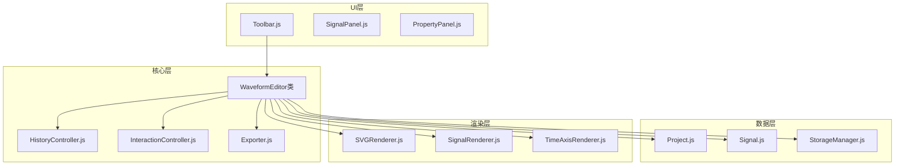
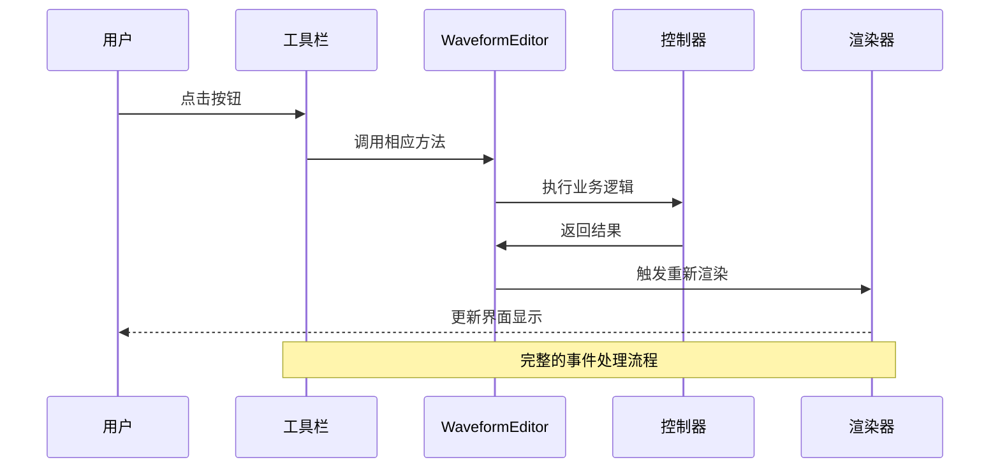
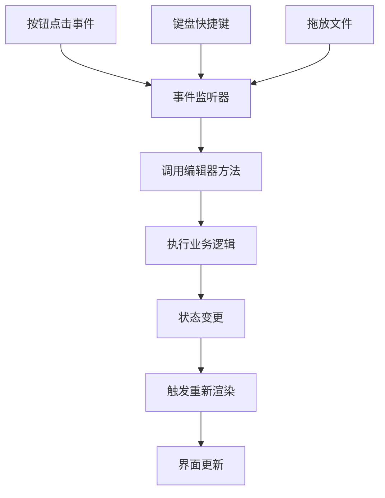
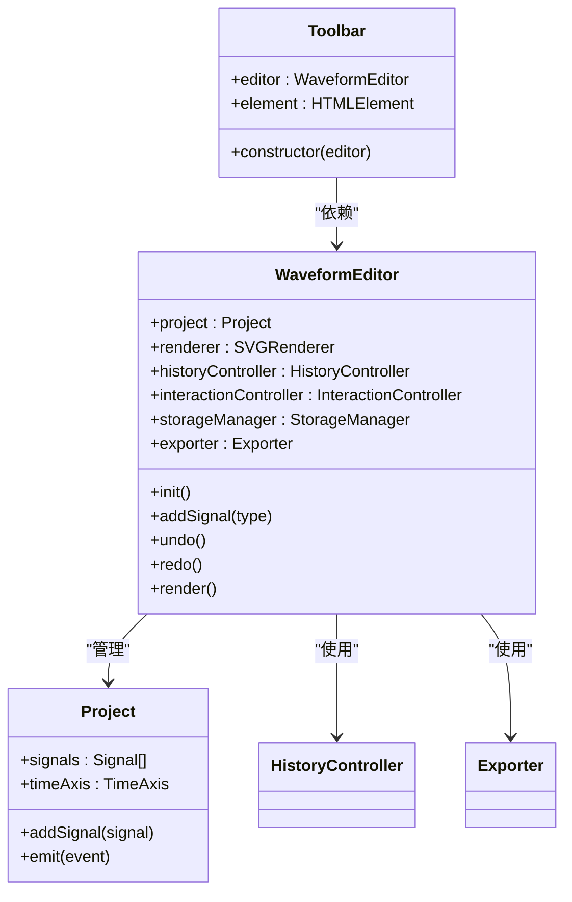

# 工具栏组件API

<cite>
**本文档引用的文件**
- [Toolbar.js](file://src/ui/Toolbar.js)
- [main.js](file://src/main.js)
- [index.html](file://index.html)
- [main.css](file://styles/main.css)
</cite>

## 目录
1. [简介](#简介)
2. [项目结构](#项目结构)
3. [核心组件](#核心组件)
4. [架构概览](#架构概览)
5. [详细组件分析](#详细组件分析)
6. [依赖关系分析](#依赖关系分析)
7. [性能考虑](#性能考虑)
8. [故障排除指南](#故障排除指南)
9. [结论](#结论)

## 简介

本文档详细介绍了波形图编辑器中的Toolbar工具栏组件API。Toolbar作为用户界面的重要组成部分，提供了各种操作按钮，包括信号管理、历史操作、项目管理和导出功能等。该组件通过与WaveformEditor主类的紧密集成，实现了完整的编辑器功能控制。

## 项目结构

工具栏组件位于UI层，采用模块化设计，与其他核心组件协同工作：



**图表来源**
- [Toolbar.js:1-6](file://src/ui/Toolbar.js#L1-L6)
- [main.js:21-44](file://src/main.js#L21-L44)

**章节来源**
- [Toolbar.js:1-6](file://src/ui/Toolbar.js#L1-L6)
- [main.js:12-17](file://src/main.js#L12-L17)

## 核心组件

### Toolbar类概述

Toolbar是波形图编辑器的工具栏组件，负责提供用户界面操作按钮和事件处理。该组件具有以下特点：

- **轻量级设计**：仅包含基本的构造函数和元素引用
- **依赖注入模式**：通过构造函数接收WaveformEditor实例
- **DOM集成**：直接操作页面中的工具栏元素

### 构造函数

```javascript
constructor(editor)
```

**参数说明：**
- `editor` (WaveformEditor): 编辑器实例对象

**功能描述：**
- 存储传入的编辑器实例
- 通过DOM查询获取工具栏元素引用
- 初始化组件状态

**章节来源**
- [Toolbar.js:2-5](file://src/ui/Toolbar.js#L2-L5)

## 架构概览

工具栏组件在整个编辑器架构中扮演着关键角色，连接用户界面与业务逻辑：



**图表来源**
- [main.js:451-629](file://src/main.js#L451-L629)
- [Toolbar.js:1-6](file://src/ui/Toolbar.js#L1-L6)

## 详细组件分析

### 工具栏按钮功能详解

工具栏包含多个功能组，每个组都提供特定的操作能力：

#### 信号管理组
- **添加信号按钮** (`addSignalBtn`): 添加普通信号
- **添加时钟按钮** (`addClockBtn`): 添加时钟信号

#### 历史操作组  
- **撤销按钮** (`undoBtn`): 撤销上一步操作
- **重做按钮** (`redoBtn`): 重做被撤销的操作

#### 项目管理组
- **打开项目按钮** (`openProjectBtn`): 打开现有项目文件
- **保存项目按钮** (`saveProjectBtn`): 保存当前项目
- **导出PNG按钮** (`exportPngBtn`): 导出波形图为PNG图片
- **导出JSON按钮** (`exportJsonBtn`): 导出项目为JSON格式
- **复制图像按钮** (`copyToClipboardBtn`): 将波形图复制到剪贴板
- **保存模板按钮** (`saveTemplateBtn`): 保存当前波形为模板
- **重置模板按钮** (`resetTemplateBtn`): 恢复默认模板
- **导出独立版按钮** (`exportStandaloneBtn`): 导出独立HTML版本

**章节来源**
- [index.html:12-41](file://index.html#L12-L41)
- [main.js:451-560](file://src/main.js#L451-L560)

### 事件处理机制

工具栏按钮的事件处理采用统一的模式，所有事件监听都在WaveformEditor类中集中管理：



**图表来源**
- [main.js:451-629](file://src/main.js#L451-L629)

### 编辑器实例交互

工具栏组件通过以下方式与编辑器实例交互：

#### 方法调用链
1. **按钮点击** → 事件监听器
2. **编辑器方法** → 业务逻辑处理  
3. **状态更新** → 项目数据变更
4. **重新渲染** → 视图更新

#### 关键交互点
- **撤销/重做**：通过HistoryController管理操作历史
- **信号管理**：通过Project模型添加/修改信号
- **项目导入导出**：通过StorageManager处理文件操作
- **波形导出**：通过Exporter处理图像生成

**章节来源**
- [main.js:744-758](file://src/main.js#L744-L758)
- [main.js:634-668](file://src/main.js#L634-L668)

### 样式系统

工具栏采用统一的CSS样式系统，支持主题定制：

#### 核心CSS类
- `.toolbar`: 工具栏容器
- `.toolbar-group`: 按钮分组
- `.toolbar-btn`: 普通按钮
- `.icon-btn`: 图标按钮
- `.active`: 活跃状态样式

#### 主题配置选项
- **颜色系统**: 支持标准蓝色主题
- **尺寸规格**: 固定的按钮尺寸和间距
- **交互反馈**: 悬停效果和激活状态
- **响应式设计**: 自适应不同屏幕尺寸

**章节来源**
- [main.css:24-81](file://styles/main.css#L24-L81)

## 依赖关系分析

工具栏组件的依赖关系相对简单，主要依赖于WaveformEditor实例：



**图表来源**
- [Toolbar.js:1-6](file://src/ui/Toolbar.js#L1-L6)
- [main.js:21-44](file://src/main.js#L21-L44)

### 组件耦合度评估

- **低耦合**: Toolbar只依赖WaveformEditor实例，不直接依赖具体实现细节
- **高内聚**: 所有按钮事件处理集中在WaveformEditor中
- **清晰边界**: UI组件与业务逻辑分离

**章节来源**
- [Toolbar.js:1-6](file://src/ui/Toolbar.js#L1-L6)
- [main.js:12-17](file://src/main.js#L12-L17)

## 性能考虑

### 事件处理优化
- **事件委托**: 使用统一的事件监听器减少内存占用
- **防抖处理**: 窗口大小变化时使用定时器避免频繁重绘
- **异步操作**: 文件操作和网络请求采用Promise处理

### 渲染性能
- **增量更新**: 只更新受影响的DOM元素
- **虚拟滚动**: 大数据集时考虑使用虚拟化技术
- **缓存策略**: 对计算密集型操作进行结果缓存

## 故障排除指南

### 常见问题及解决方案

#### 工具栏按钮无响应
**可能原因：**
- DOM元素未正确加载
- 事件监听器未绑定
- 编辑器实例未初始化

**解决步骤：**
1. 检查HTML中按钮元素是否存在
2. 确认WaveformEditor.init()已执行
3. 验证事件监听器绑定是否成功

#### 按钮样式异常
**可能原因：**
- CSS文件未正确加载
- 样式类名冲突
- 主题配置错误

**解决步骤：**
1. 检查main.css文件路径
2. 验证CSS类名与HTML元素匹配
3. 确认主题变量设置正确

#### 功能操作失败
**可能原因：**
- 编辑器状态异常
- 业务逻辑错误
- 数据持久化失败

**解决步骤：**
1. 查看浏览器控制台错误信息
2. 检查编辑器状态变量
3. 验证数据模型完整性

**章节来源**
- [main.js:809-819](file://src/main.js#L809-L819)
- [main.css:1-551](file://styles/main.css#L1-L551)

## 结论

Toolbar工具栏组件虽然在代码层面实现简洁，但在整个编辑器架构中发挥着至关重要的作用。通过与WaveformEditor的紧密集成和统一的事件处理机制，工具栏为用户提供了直观、高效的操作界面。

### 设计优势
- **模块化设计**: 清晰的职责分离
- **易于扩展**: 支持新增按钮和功能
- **维护友好**: 代码结构简单明了
- **性能优化**: 事件处理和渲染优化

### 改进建议
- **增强类型检查**: 添加TypeScript支持
- **国际化支持**: 多语言文本本地化
- **无障碍访问**: 支持屏幕阅读器
- **测试覆盖**: 增加单元测试和集成测试

该组件为波形图编辑器提供了稳定可靠的基础功能，是用户交互体验的关键组成部分。