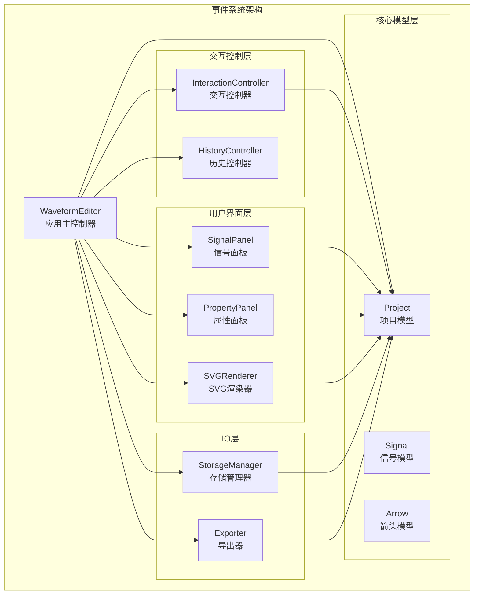
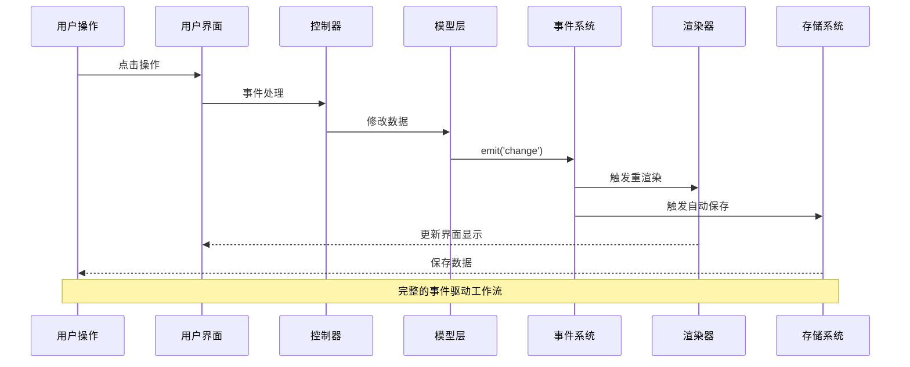
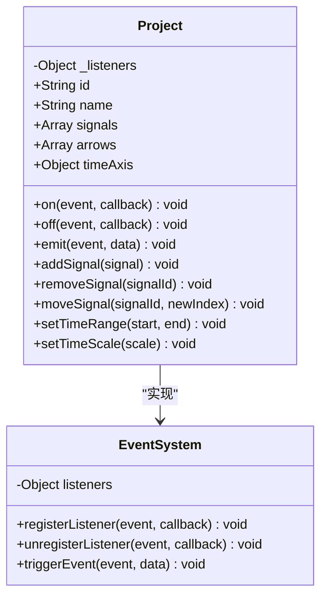
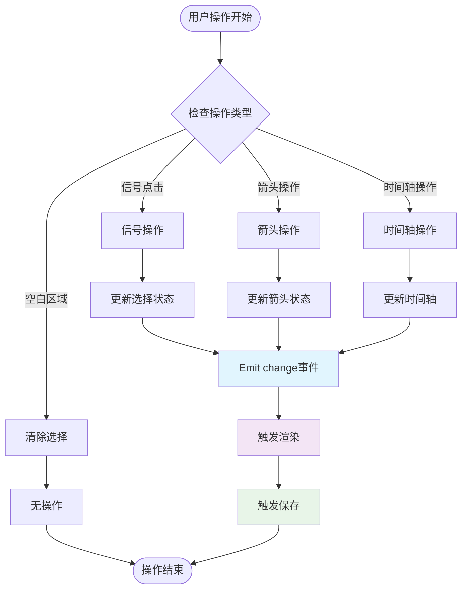
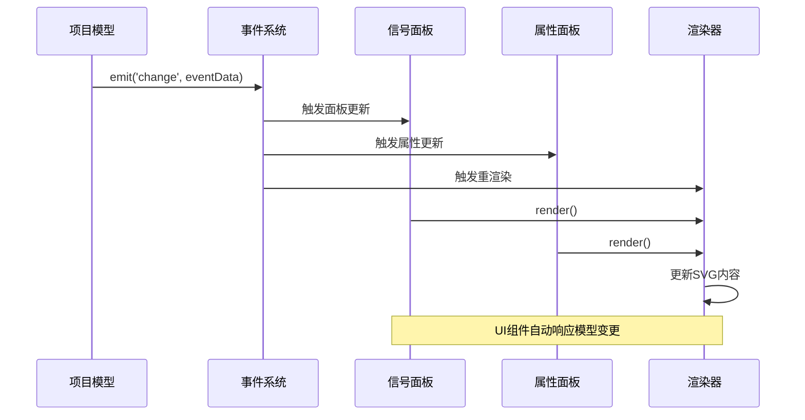
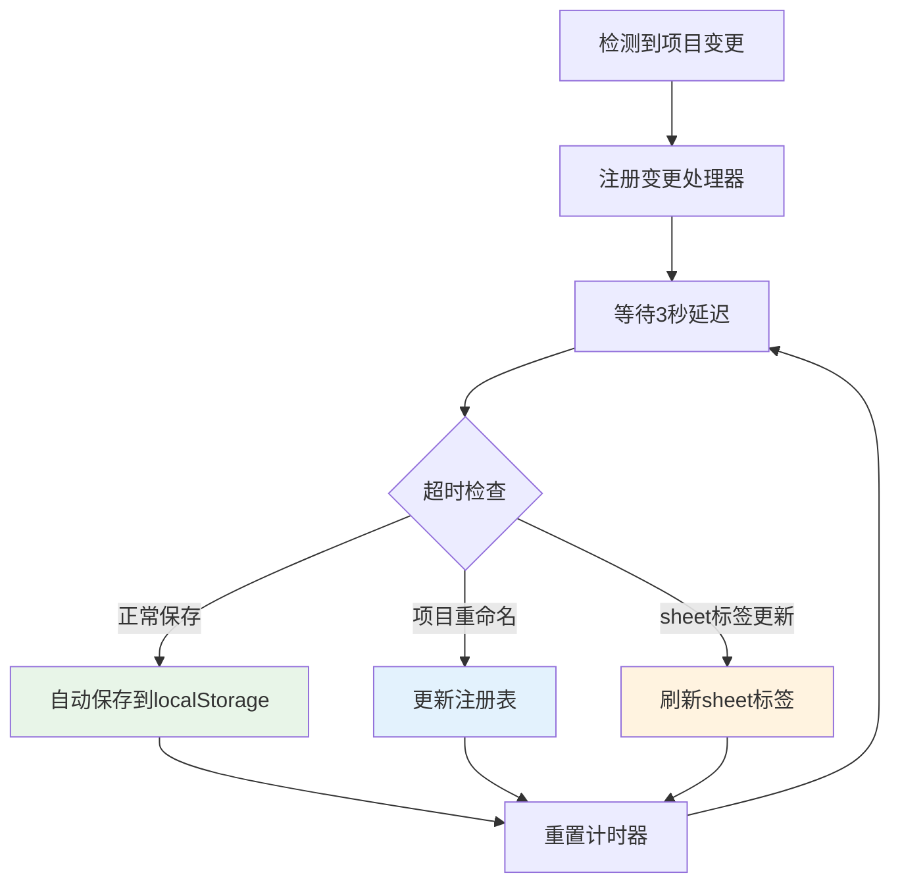
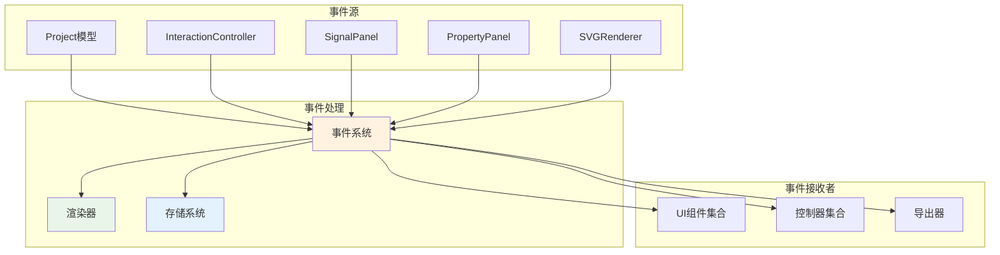

# 事件系统API

<cite>
**本文档引用的文件**
- [src/main.js](file://src/main.js)
- [src/models/Project.js](file://src/models/Project.js)
- [src/controllers/InteractionController.js](file://src/controllers/InteractionController.js)
- [src/ui/SignalPanel.js](file://src/ui/SignalPanel.js)
- [src/ui/PropertyPanel.js](file://src/ui/PropertyPanel.js)
- [src/renderers/SVGRenderer.js](file://src/renderers/SVGRenderer.js)
</cite>

## 目录
1. [简介](#简介)
2. [项目结构](#项目结构)
3. [核心组件](#核心组件)
4. [架构概览](#架构概览)
5. [详细组件分析](#详细组件分析)
6. [依赖关系分析](#依赖关系分析)
7. [性能考虑](#性能考虑)
8. [故障排除指南](#故障排除指南)
9. [结论](#结论)

## 简介

波形图编辑器采用事件驱动架构，通过统一的事件系统实现各模块间的解耦通信。该系统提供了完整的事件生命周期管理，包括事件监听器注册、注销和触发机制。

事件系统的核心设计原则：
- **松耦合**：各组件通过事件进行通信，无需直接依赖
- **可扩展性**：支持自定义事件类型和参数传递
- **响应式更新**：自动触发UI更新和数据持久化
- **类型安全**：标准化的事件参数结构

## 项目结构

事件系统在波形图编辑器中的组织结构如下：



**图表来源**
- [src/main.js:21-44](file://src/main.js#L21-L44)
- [src/models/Project.js:8-34](file://src/models/Project.js#L8-L34)

**章节来源**
- [src/main.js:21-132](file://src/main.js#L21-L132)
- [src/models/Project.js:8-34](file://src/models/Project.js#L8-L34)

## 核心组件

### 事件系统基础类

事件系统的核心是基于JavaScript原生对象的简单事件发射器模式。每个需要事件功能的对象都包含以下三个核心方法：

#### 事件监听器注册
- **方法**：`on(event, callback)`
- **功能**：注册指定事件的监听器
- **参数**：
  - `event`：事件名称（字符串）
  - `callback`：回调函数
- **返回值**：无

#### 事件监听器注销
- **方法**：`off(event, callback)`
- **功能**：移除指定事件的特定监听器
- **参数**：
  - `event`：事件名称
  - `callback`：要移除的回调函数
- **返回值**：无

#### 事件触发
- **方法**：`emit(event, data)`
- **功能**：触发指定事件并传递数据
- **参数**：
  - `event`：事件名称
  - `data`：可选的数据参数
- **返回值**：无

**章节来源**
- [src/models/Project.js:177-202](file://src/models/Project.js#L177-L202)

### 事件类型定义

系统支持多种预定义的事件类型，每种事件都有特定的用途和数据结构：

#### 项目级别事件
- **change**：项目发生任何变更时触发
- **参数**：事件对象，包含变更类型和相关信息
- **触发时机**：项目数据发生变化时

#### 信号操作事件
- **addSignal**：添加新信号时触发
- **removeSignal**：删除信号时触发
- **moveSignal**：移动信号位置时触发
- **参数**：包含信号ID和相关操作信息

#### 箭头操作事件
- **addArrow**：添加新箭头时触发
- **removeArrow**：删除箭头时触发
- **参数**：包含箭头ID和相关操作信息

#### 时间轴事件
- **timeRange**：时间轴范围改变时触发
- **timeScale**：时间轴缩放改变时触发
- **参数**：包含新的时间范围或缩放值

#### 箭头编辑事件
- **moveArrowEndpoint**：移动箭头端点时触发
- **参数**：包含箭头ID和端点信息

#### 信号级别事件
- **setLevel**：设置信号电平时触发
- **参数**：包含信号ID

**章节来源**
- [src/models/Project.js:47-144](file://src/models/Project.js#L47-L144)
- [src/controllers/InteractionController.js:361](file://src/controllers/InteractionController.js#L361)
- [src/controllers/InteractionController.js:1048](file://src/controllers/InteractionController.js#L1048)

## 架构概览

事件系统采用分层架构设计，确保事件在不同抽象层次间的正确传播：



**图表来源**
- [src/main.js:226-241](file://src/main.js#L226-L241)
- [src/models/Project.js:199-202](file://src/models/Project.js#L199-L202)

### 事件传播路径

事件在系统中的传播遵循以下路径：

1. **用户交互** → **UI组件** → **控制器** → **模型** → **事件系统** → **其他组件**

2. **模型变更** → **事件系统** → **渲染器** → **存储系统**

3. **存储变更** → **事件系统** → **UI组件** → **用户反馈**

**章节来源**
- [src/main.js:449-629](file://src/main.js#L449-L629)
- [src/models/Project.js:177-202](file://src/models/Project.js#L177-L202)

## 详细组件分析

### 项目模型事件系统

项目模型是事件系统的核心实现，提供了完整的事件生命周期管理：



**图表来源**
- [src/models/Project.js:8-34](file://src/models/Project.js#L8-L34)
- [src/models/Project.js:177-202](file://src/models/Project.js#L177-L202)

#### 事件监听器管理

项目模型使用内部的监听器映射表来管理事件：

- **数据结构**：`_listeners` 对象，键为事件名称，值为回调函数数组
- **内存管理**：自动清理无监听器的事件类型
- **执行顺序**：按注册顺序执行回调函数

#### 事件触发机制

事件触发采用同步广播模式：

1. **查找监听器**：根据事件名称获取回调函数数组
2. **遍历执行**：依次调用每个回调函数
3. **参数传递**：将事件数据作为唯一参数传递给回调函数
4. **异常处理**：单个回调函数异常不影响其他回调函数执行

**章节来源**
- [src/models/Project.js:177-202](file://src/models/Project.js#L177-L202)

### 交互控制器事件集成

交互控制器作为用户操作的主要入口，集成了丰富的事件处理逻辑：



**图表来源**
- [src/controllers/InteractionController.js:84-184](file://src/controllers/InteractionController.js#L84-L184)
- [src/controllers/InteractionController.js:295](file://src/controllers/InteractionController.js#L295)

#### 事件处理流程

交互控制器的事件处理遵循以下流程：

1. **事件捕获**：监听SVG画布上的鼠标和键盘事件
2. **操作识别**：根据鼠标位置和按键状态确定操作类型
3. **状态更新**：修改项目数据结构
4. **事件触发**：发送相应的事件通知
5. **UI更新**：触发渲染器更新界面

#### 特殊事件类型

交互控制器处理的特殊事件包括：

- **边缘滚动**：时间轴拖拽时的自动滚动
- **箭头创建**：Alt键辅助的依赖关系创建
- **信号选择**：点击信号名称区域的属性面板显示

**章节来源**
- [src/controllers/InteractionController.js:52-82](file://src/controllers/InteractionController.js#L52-L82)
- [src/controllers/InteractionController.js:177-184](file://src/controllers/InteractionController.js#L177-L184)

### UI组件事件集成

UI组件通过事件系统实现响应式更新：



**图表来源**
- [src/ui/SignalPanel.js:45-67](file://src/ui/SignalPanel.js#L45-L67)
- [src/ui/PropertyPanel.js:32-65](file://src/ui/PropertyPanel.js#L32-L65)

#### 信号面板事件处理

信号面板监听项目变更并自动更新：

- **信号添加**：动态添加新的信号项
- **信号删除**：移除对应的DOM元素
- **信号排序**：响应拖拽排序事件
- **选择同步**：与渲染器的选择状态保持一致

#### 属性面板事件处理

属性面板根据选择状态动态显示相应内容：

- **信号属性**：显示选中信号的详细信息
- **箭头属性**：显示依赖箭头的配置选项
- **项目设置**：显示项目级别的配置参数
- **实时更新**：属性变更立即反映到模型

**章节来源**
- [src/ui/SignalPanel.js:69-163](file://src/ui/SignalPanel.js#L69-L163)
- [src/ui/PropertyPanel.js:32-200](file://src/ui/PropertyPanel.js#L32-L200)

### 自动保存事件机制

编辑器实现了智能的自动保存机制：



**图表来源**
- [src/main.js:226-241](file://src/main.js#L226-L241)
- [src/main.js:373-416](file://src/main.js#L373-L416)

#### 保存策略

自动保存机制采用以下策略：

- **延迟保存**：3秒防抖，避免频繁保存
- **条件保存**：仅在项目实际变更时保存
- **智能更新**：项目重命名时同步更新注册表
- **UI同步**：保存成功后刷新sheet标签显示

**章节来源**
- [src/main.js:226-241](file://src/main.js#L226-L241)
- [src/main.js:373-416](file://src/main.js#L373-L416)

## 依赖关系分析

事件系统在整体架构中的依赖关系如下：



**图表来源**
- [src/models/Project.js:177-202](file://src/models/Project.js#L177-L202)
- [src/main.js:104-118](file://src/main.js#L104-L118)

### 事件传播链路

事件在系统中的传播遵循以下链路：

1. **事件源** → **事件系统** → **渲染器** → **UI组件**
2. **事件源** → **事件系统** → **存储系统** → **持久化**
3. **事件源** → **事件系统** → **导出器** → **文件生成**

### 循环依赖防护

系统通过以下机制防止循环依赖：

- **单向传播**：事件只能从模型层向UI层传播
- **异步处理**：事件处理采用异步模式避免阻塞
- **去重机制**：相同事件在短时间内不会重复触发
- **错误隔离**：单个监听器异常不影响其他监听器

**章节来源**
- [src/models/Project.js:177-202](file://src/models/Project.js#L177-L202)
- [src/main.js:104-118](file://src/main.js#L104-L118)

## 性能考虑

### 事件处理优化

事件系统在性能方面采用了多项优化措施：

#### 事件去抖机制
- **延迟触发**：自动保存采用3秒延迟，减少频繁触发
- **批量处理**：多个连续事件合并为一次处理
- **防抖间隔**：合理设置事件处理间隔，避免过度渲染

#### 内存管理
- **监听器清理**：及时移除不再使用的监听器
- **弱引用模式**：避免强引用导致的内存泄漏
- **垃圾回收**：定期清理无效的事件监听器

#### 渲染优化
- **增量更新**：仅更新受影响的UI部分
- **虚拟DOM**：使用高效的DOM更新策略
- **请求动画帧**：利用浏览器的优化机制

### 性能监控

建议在开发过程中监控以下性能指标：

- **事件处理时间**：单个事件的平均处理时间
- **内存使用量**：事件监听器数量和内存占用
- **渲染频率**：UI更新的频率和效率
- **CPU使用率**：事件处理对CPU的影响

## 故障排除指南

### 常见问题及解决方案

#### 事件监听器未触发
**症状**：注册的事件监听器没有响应
**可能原因**：
- 监听器函数不是实例方法
- 事件名称拼写错误
- 监听器被意外移除

**解决方法**：
1. 确认监听器函数的绑定上下文
2. 检查事件名称的一致性
3. 验证监听器的注册顺序

#### 事件循环异常
**症状**：事件处理出现无限循环
**可能原因**：
- 监听器内部再次触发相同事件
- 事件处理函数相互依赖
- 异常处理不当

**解决方法**：
1. 检查事件处理函数的逻辑
2. 避免在监听器中触发原始事件
3. 实现适当的异常处理机制

#### 内存泄漏问题
**症状**：应用运行时间越长内存占用越大
**可能原因**：
- 未正确移除事件监听器
- 闭包持有不必要的引用
- 大量临时对象未释放

**解决方法**：
1. 在组件销毁时移除所有监听器
2. 检查闭包中的引用关系
3. 使用弱引用避免循环引用

### 调试技巧

#### 事件追踪
```javascript
// 在关键位置添加事件日志
project.on('change', (data) => {
    console.log('事件触发:', { event: 'change', data, timestamp: Date.now() });
    // 原始事件处理逻辑
});
```

#### 监听器状态检查
```javascript
// 检查当前注册的监听器
console.log('注册的监听器:', project._listeners);
```

#### 性能分析
使用浏览器开发者工具的性能面板分析事件处理的性能影响。

**章节来源**
- [src/models/Project.js:177-202](file://src/models/Project.js#L177-L202)
- [src/main.js:226-241](file://src/main.js#L226-L241)

## 结论

波形图编辑器的事件系统通过简洁而强大的设计，实现了模块间的松耦合通信和响应式更新。该系统具有以下优势：

### 设计优势
- **简单易用**：基于标准JavaScript对象的事件模式，学习成本低
- **高度解耦**：各组件通过事件通信，降低耦合度
- **可扩展性强**：支持自定义事件类型和参数结构
- **性能优异**：采用异步处理和优化的事件传播机制

### 应用价值
- **维护性**：清晰的事件边界使得代码更易于维护
- **可测试性**：事件驱动的架构便于单元测试和集成测试
- **可扩展性**：新的功能模块可以轻松集成到事件系统中
- **用户体验**：即时的UI响应和流畅的操作体验

### 发展方向
未来可以在以下方面进一步改进：
- **事件优先级**：支持事件的优先级和调度机制
- **事件过滤**：提供事件过滤和条件触发功能
- **事件回放**：支持事件的录制和回放功能
- **分布式事件**：支持跨组件的分布式事件通信

通过持续优化和扩展，事件系统将继续为波形图编辑器提供稳定可靠的技术支撑。