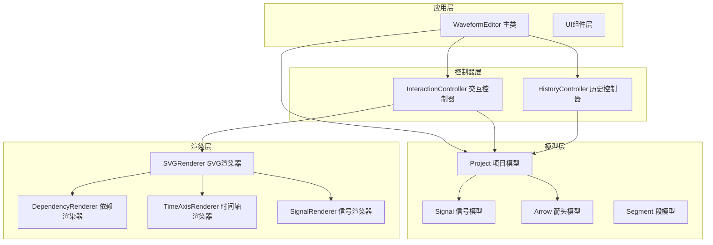
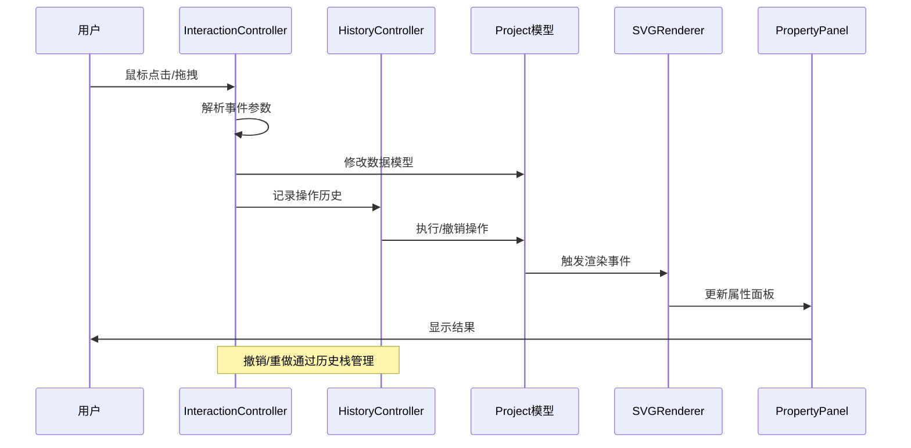
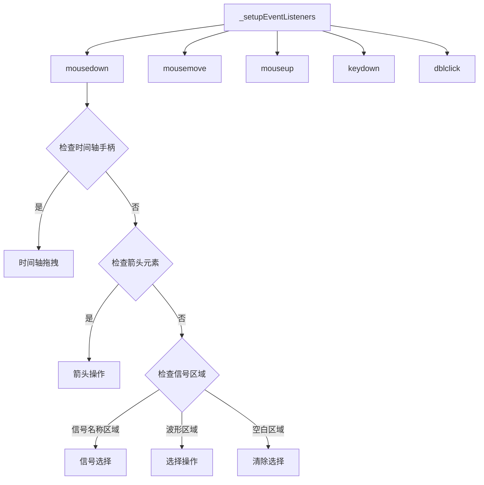
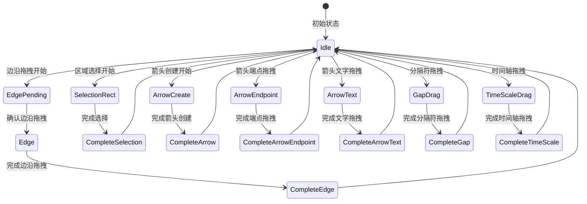
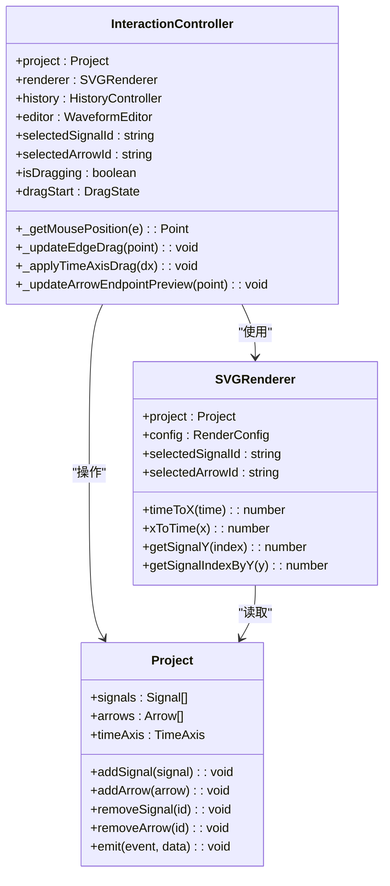
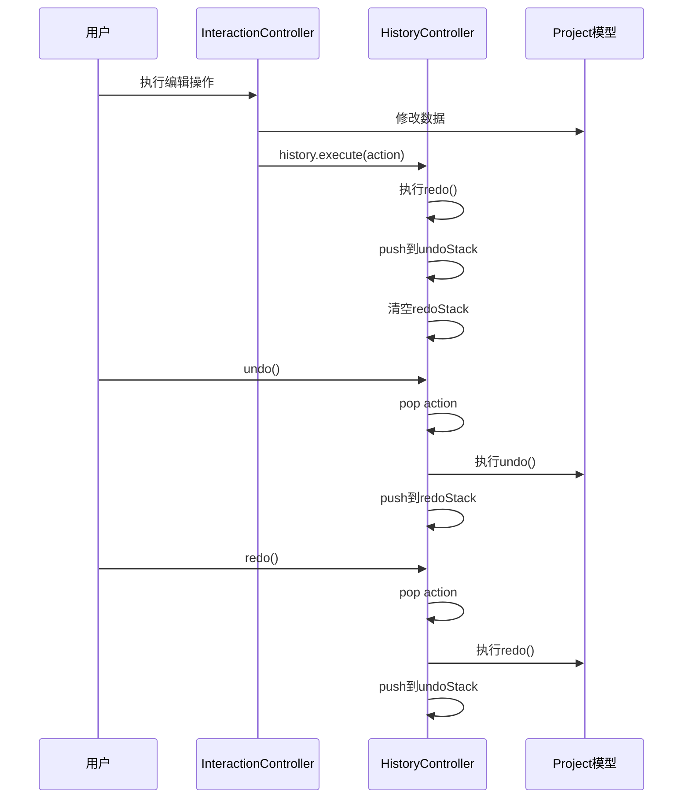
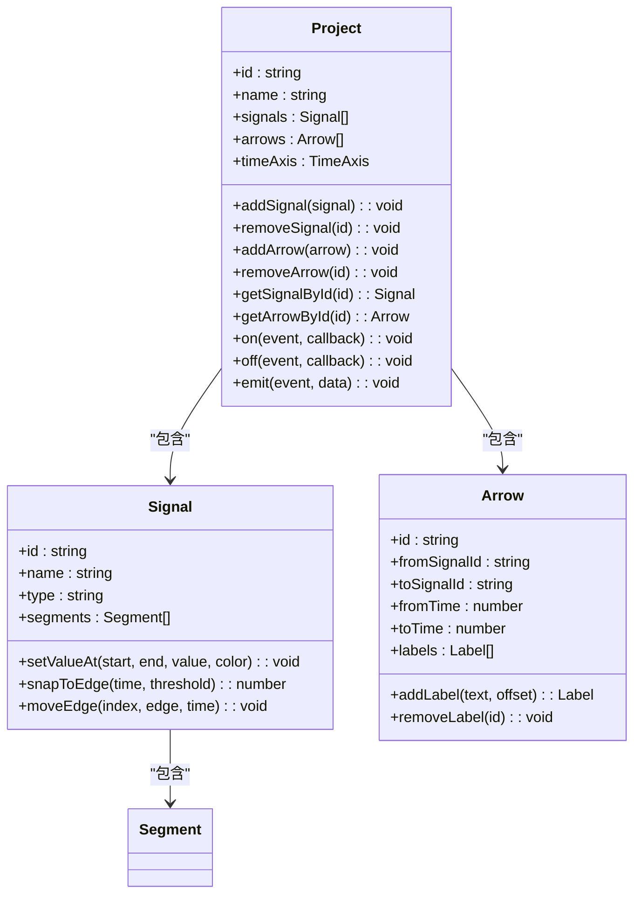
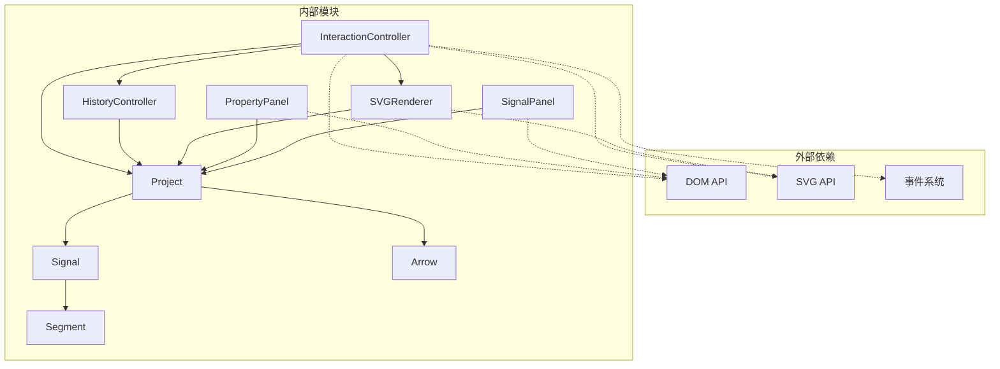

# 控制器API

<cite>
**本文档引用的文件**
- [InteractionController.js](file://src/controllers/InteractionController.js)
- [HistoryController.js](file://src/controllers/HistoryController.js)
- [Project.js](file://src/models/Project.js)
- [Signal.js](file://src/models/Signal.js)
- [Arrow.js](file://src/models/Arrow.js)
- [Segment.js](file://src/models/Segment.js)
- [SVGRenderer.js](file://src/renderers/SVGRenderer.js)
- [PropertyPanel.js](file://src/ui/PropertyPanel.js)
- [SignalPanel.js](file://src/ui/SignalPanel.js)
- [main.js](file://src/main.js)
</cite>

## 目录
1. [简介](#简介)
2. [项目结构](#项目结构)
3. [核心组件](#核心组件)
4. [架构概览](#架构概览)
5. [详细组件分析](#详细组件分析)
6. [依赖关系分析](#依赖关系分析)
7. [性能考虑](#性能考虑)
8. [故障排除指南](#故障排除指南)
9. [结论](#结论)

## 简介

本文档详细记录了波形图编辑器的控制器系统API，重点分析InteractionController交互控制器和HistoryController历史控制器的设计与实现。该系统采用MVVM架构模式，通过控制器层协调模型层和视图层的交互，提供完整的波形编辑功能，包括事件处理、状态管理、撤销重做等功能。

## 项目结构

项目采用模块化设计，主要分为以下层次：

**图表来源**
- [main.js:21-44](file://src/main.js#L21-L44)
- [InteractionController.js:6-27](file://src/controllers/InteractionController.js#L6-L27)
- [HistoryController.js:5-11](file://src/controllers/HistoryController.js#L5-L11)

**章节来源**
- [main.js:18-132](file://src/main.js#L18-L132)

## 核心组件

### InteractionController 交互控制器

InteractionController是整个编辑器的核心控制器，负责处理用户的所有交互操作。它维护着复杂的拖拽状态机，支持多种编辑模式：

#### 主要职责
- **事件处理**：处理鼠标、键盘事件
- **状态管理**：维护拖拽状态、选中状态
- **几何计算**：坐标转换、吸附计算
- **UI交互**：弹出菜单、属性面板集成

#### 核心状态变量
- `isDragging`: 拖拽状态标志
- `dragStart`: 拖拽起始状态
- `selectedSignalId`: 选中信号ID
- `selectedArrowId`: 选中箭头ID
- `arrowDragMode`: 箭头拖拽模式

**章节来源**
- [InteractionController.js:12-26](file://src/controllers/InteractionController.js#L12-L26)

### HistoryController 历史控制器

HistoryController实现了完整的撤销重做机制，支持最多50步的历史记录：

#### 核心功能
- **动作执行**：执行并记录用户操作
- **撤销操作**：回滚到上一步状态
- **重做操作**：恢复被撤销的操作
- **历史管理**：自动清理超出限制的历史记录

**章节来源**
- [HistoryController.js:6-56](file://src/controllers/HistoryController.js#L6-L56)

## 架构概览

系统采用分层架构，控制器层位于中间层，协调上层应用逻辑和下层数据模型：

**图表来源**
- [InteractionController.js:84-184](file://src/controllers/InteractionController.js#L84-L184)
- [HistoryController.js:13-42](file://src/controllers/HistoryController.js#L13-L42)

## 详细组件分析

### InteractionController 详细分析

#### 事件处理系统

InteractionController建立了完整的事件监听体系：

**图表来源**
- [InteractionController.js:52-82](file://src/controllers/InteractionController.js#L52-L82)
- [InteractionController.js:84-184](file://src/controllers/InteractionController.js#L84-L184)

#### 拖拽状态机

系统实现了复杂的拖拽状态管理：

**图表来源**
- [InteractionController.js:231-337](file://src/controllers/InteractionController.js#L231-L337)
- [InteractionController.js:1187-1286](file://src/controllers/InteractionController.js#L1187-L1286)

#### 几何计算与吸附系统

系统提供了精确的坐标转换和吸附功能：

**图表来源**
- [InteractionController.js:1409-1419](file://src/controllers/InteractionController.js#L1409-L1419)
- [SVGRenderer.js:15-54](file://src/renderers/SVGRenderer.js#L15-L54)
- [Project.js:8-34](file://src/models/Project.js#L8-L34)

**章节来源**
- [InteractionController.js:84-1420](file://src/controllers/InteractionController.js#L84-L1420)

### HistoryController 详细分析

#### 历史记录栈管理

HistoryController实现了双栈结构来支持撤销重做：

**图表来源**
- [HistoryController.js:13-42](file://src/controllers/HistoryController.js#L13-L42)

#### 动作封装机制

每个用户操作都被封装为可撤销的动作对象：

| 动作类型 | 描述 | 关键属性 |
|---------|------|----------|
| `moveEdge` | 移动波形边沿 | `signalId`, `oldSegments`, `newSegments` |
| `setLevel` | 设置信号电平 | `signalId`, `oldSegments`, `newSegments` |
| `moveArrowEndpoint` | 移动箭头端点 | `arrowId`, `endpoint`, `oldTime`, `newTime` |

**章节来源**
- [HistoryController.js:5-56](file://src/controllers/HistoryController.js#L5-L56)

### 模型层集成

#### Project 模型

Project模型作为数据中心，提供事件驱动的数据管理：

**图表来源**
- [Project.js:8-34](file://src/models/Project.js#L8-L34)
- [Signal.js:7-29](file://src/models/Signal.js#L7-L29)
- [Arrow.js:5-45](file://src/models/Arrow.js#L5-L45)

**章节来源**
- [Project.js:1-245](file://src/models/Project.js#L1-L245)

## 依赖关系分析

系统具有清晰的依赖层次结构：

**图表来源**
- [InteractionController.js:1-27](file://src/controllers/InteractionController.js#L1-L27)
- [HistoryController.js:1-11](file://src/controllers/HistoryController.js#L1-L11)
- [SVGRenderer.js:1-40](file://src/renderers/SVGRenderer.js#L1-L40)

**章节来源**
- [main.js:4-16](file://src/main.js#L4-L16)

## 性能考虑

### 事件处理优化

系统采用了多项性能优化策略：

1. **事件委托**：使用document级别的事件监听，减少DOM绑定数量
2. **RAF优化**：时间轴边缘滚动使用requestAnimationFrame
3. **选择器优化**：使用closest()方法进行精确元素匹配
4. **渲染节流**：窗口大小变化使用防抖机制

### 内存管理

- **事件监听器清理**：popup外部点击事件使用绑定方式便于清理
- **DOM元素复用**：SVG元素通过clearGroup方法统一管理
- **状态机简化**：复杂状态通过状态机避免重复计算

## 故障排除指南

### 常见问题诊断

#### 事件监听器失效
**症状**：点击信号列表无响应
**原因**：信号面板重建DOM导致事件丢失
**解决方案**：使用针对性更新而非重建DOM

#### 拖拽状态异常
**症状**：拖拽结束后状态未重置
**原因**：异常分支未正确清理状态
**解决方案**：确保所有拖拽路径都有状态清理

#### 历史记录不一致
**症状**：撤销后数据状态异常
**原因**：undo/redo函数实现不完整
**解决方案**：检查动作对象的undo/redo实现

**章节来源**
- [InteractionController.js:1369-1407](file://src/controllers/InteractionController.js#L1369-L1407)

## 结论

控制器系统展现了良好的软件工程实践：

1. **清晰的职责分离**：控制器、模型、视图各司其职
2. **完善的事件处理**：支持复杂的用户交互场景
3. **健壮的状态管理**：通过状态机保证操作一致性
4. **可扩展的架构**：易于添加新的交互模式和撤销动作

该系统为波形图编辑器提供了稳定可靠的基础，支持从简单信号编辑到复杂依赖关系建模的完整功能集。通过合理的抽象和模块化设计，为后续的功能扩展奠定了坚实基础。