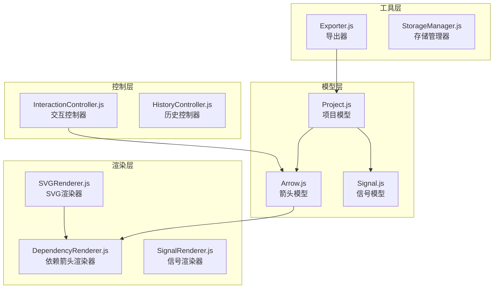
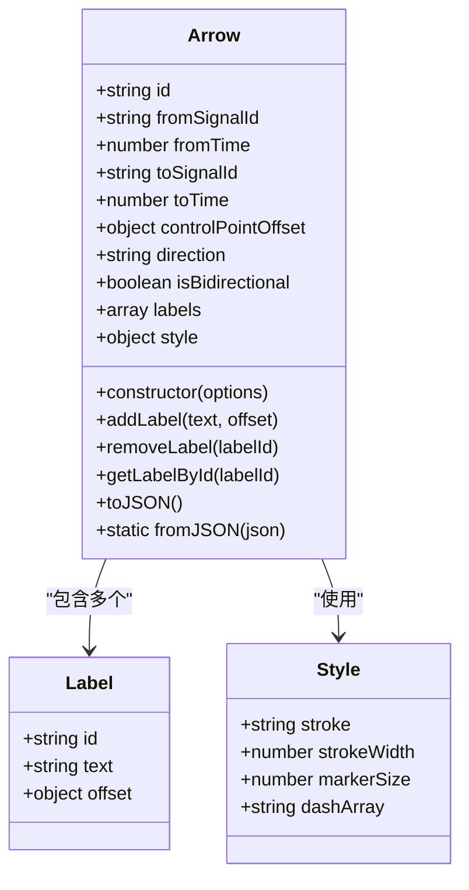
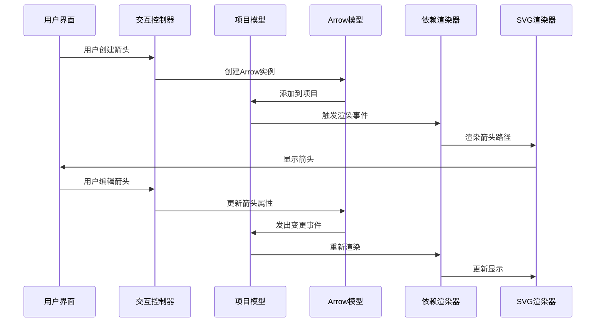
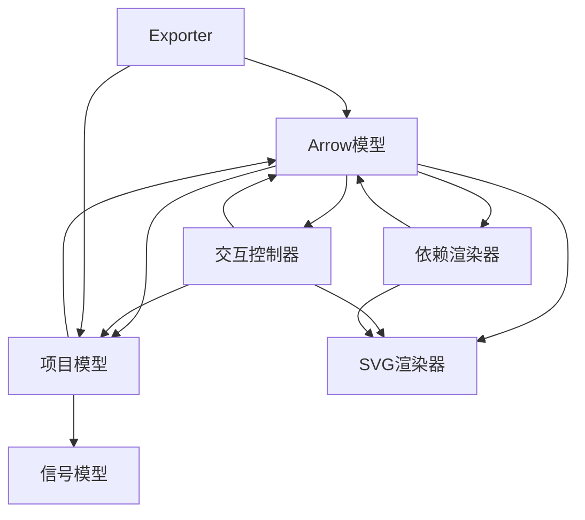

# Arrow箭头模型API

<cite>
**本文档引用的文件**
- [Arrow.js](file://src/models/Arrow.js)
- [DependencyRenderer.js](file://src/renderers/DependencyRenderer.js)
- [InteractionController.js](file://src/controllers/InteractionController.js)
- [SVGRenderer.js](file://src/renderers/SVGRenderer.js)
- [colors.js](file://src/config/colors.js)
- [Project.js](file://src/models/Project.js)
- [Exporter.js](file://src/io/Exporter.js)
- [main.js](file://src/main.js)
</cite>

## 目录
1. [简介](#简介)
2. [项目结构](#项目结构)
3. [核心组件](#核心组件)
4. [架构概览](#架构概览)
5. [详细组件分析](#详细组件分析)
6. [依赖关系分析](#依赖关系分析)
7. [性能考虑](#性能考虑)
8. [故障排除指南](#故障排除指南)
9. [结论](#结论)

## 简介

Arrow箭头模型是波形编辑器中用于表示信号间依赖关系的核心组件。它负责描述从一个信号到另一个信号的时间依赖关系，支持双向箭头、自连接箭头、多标签标注等功能。该模型采用贝塞尔曲线实现平滑的S形箭头路径，并提供了完整的序列化和反序列化机制。

## 项目结构

波形编辑器采用模块化架构，Arrow模型位于models目录下，与其他核心组件协同工作：

**图表来源**
- [Arrow.js:1-114](file://src/models/Arrow.js#L1-L114)
- [DependencyRenderer.js:1-290](file://src/renderers/DependencyRenderer.js#L1-L290)
- [SVGRenderer.js:1-547](file://src/renderers/SVGRenderer.js#L1-L547)

**章节来源**
- [Arrow.js:1-114](file://src/models/Arrow.js#L1-L114)
- [Project.js:1-245](file://src/models/Project.js#L1-L245)

## 核心组件

### Arrow类概述

Arrow类是依赖箭头的核心数据结构，负责存储和管理信号间的依赖关系信息。它支持多种配置选项和丰富的操作接口。

#### 主要特性
- **时间坐标系统**: 基于时间轴的精确坐标定位
- **双向箭头支持**: 支持正向和反向箭头
- **多标签标注**: 支持多个文本标签的添加和管理
- **样式配置**: 完整的视觉样式定制能力
- **序列化支持**: JSON格式的数据持久化

#### 数据结构设计

**图表来源**
- [Arrow.js:5-114](file://src/models/Arrow.js#L5-L114)

**章节来源**
- [Arrow.js:5-114](file://src/models/Arrow.js#L5-L114)

## 架构概览

Arrow模型在整个系统中的位置和交互关系如下：

**图表来源**
- [InteractionController.js:572-756](file://src/controllers/InteractionController.js#L572-L756)
- [DependencyRenderer.js:18-84](file://src/renderers/DependencyRenderer.js#L18-L84)
- [Project.js:86-110](file://src/models/Project.js#L86-L110)

## 详细组件分析

### 构造函数和初始化

Arrow类的构造函数接受一个options参数对象，支持以下配置选项：

#### 基础属性配置
- `id`: 箭头唯一标识符（自动生成）
- `fromSignalId`: 起始信号ID
- `fromTime`: 起始时间坐标
- `toSignalId`: 终点信号ID
- `toTime`: 终点时间坐标
- `controlPointOffset`: 控制点偏移量

#### 方向和类型配置
- `direction`: 箭头方向（'auto' | 'forward' | 'backward'）
- `isBidirectional`: 是否为双向箭头

#### 标签系统配置
- `labels`: 标签数组（支持多个标签）
- `text`: 兼容旧格式的单个标签文本
- `textOffset`: 兼容旧格式的标签偏移

#### 样式配置
- `style.stroke`: 箭头颜色
- `style.strokeWidth`: 线条宽度
- `style.markerSize`: 箭头标记大小
- `style.dashArray`: 虚线模式

**章节来源**
- [Arrow.js:6-45](file://src/models/Arrow.js#L6-L45)

### 箭头端点设置方法

Arrow类提供了灵活的端点设置接口：

#### setStartPoint方法
用于设置箭头的起始端点，支持时间对齐和信号吸附功能。

#### setEndPoint方法
用于设置箭头的终止端点，提供精确的时间坐标设置。

#### 端点坐标系统
箭头坐标采用基于时间轴的笛卡尔坐标系：
- X坐标：通过`project.timeToX(time)`转换
- Y坐标：通过`renderer.getSignalY(signalIndex)`计算
- 偏移系统：支持垂直偏移避免多箭头重叠

**章节来源**
- [InteractionController.js:625-800](file://src/controllers/InteractionController.js#L625-L800)
- [DependencyRenderer.js:99-109](file://src/renderers/DependencyRenderer.js#L99-L109)

### 标签管理系统

Arrow类支持多标签标注系统，提供完整的标签生命周期管理：

#### 标签数据结构
每个标签包含：
- `id`: 标签唯一标识符
- `text`: 标签文本内容
- `offset`: 二维偏移量（x, y）

#### 标签操作方法
- `addLabel(text, offset)`: 添加新标签
- `removeLabel(labelId)`: 删除指定标签
- `getLabelById(labelId)`: 获取标签对象

#### 兼容性处理
支持旧格式的`text`和`textOffset`属性，通过getter/setter映射到labels数组的第一个元素。

**章节来源**
- [Arrow.js:78-94](file://src/models/Arrow.js#L78-L94)
- [Arrow.js:55-76](file://src/models/Arrow.js#L55-L76)

### 样式配置系统

Arrow类提供全面的样式配置能力：

#### 样式属性
- `stroke`: 箭头颜色（默认'#0078D7'）
- `strokeWidth`: 线条宽度（默认1.5）
- `markerSize`: 箭头标记大小（默认4）
- `dashArray`: 虚线模式（空字符串表示实线）

#### 样式应用
样式配置通过CSS属性应用到SVG路径元素，支持实时更新和动态修改。

#### 颜色配置
使用全局颜色配置系统，支持主题化和自定义颜色方案。

**章节来源**
- [Arrow.js:39-44](file://src/models/Arrow.js#L39-L44)
- [colors.js:42-50](file://src/config/colors.js#L42-L50)

### 序列化和反序列化

Arrow类实现了完整的JSON序列化支持：

#### toJSON方法
返回包含所有箭头信息的对象：
- 基础属性：id, fromSignalId, fromTime, toSignalId, toTime
- 控制点：controlPointOffset
- 方向属性：direction, isBidirectional
- 标签数组：labels
- 样式配置：style

#### fromJSON静态方法
从JSON数据创建Arrow实例，支持数据恢复和导入功能。

#### 项目集成
Project类在序列化项目时调用Arrow的toJSON方法，确保箭头数据的完整保存。

**章节来源**
- [Arrow.js:96-114](file://src/models/Arrow.js#L96-L114)
- [Project.js:208-244](file://src/models/Project.js#L208-L244)

## 依赖关系分析

### 组件耦合关系

**图表来源**
- [InteractionController.js:1-800](file://src/controllers/InteractionController.js#L1-L800)
- [DependencyRenderer.js:1-290](file://src/renderers/DependencyRenderer.js#L1-L290)
- [Project.js:1-245](file://src/models/Project.js#L1-L245)

### 数据流分析

箭头数据在系统中的流转过程：

1. **用户交互**: 通过InteractionController接收用户操作
2. **数据更新**: 修改Arrow实例的属性
3. **事件通知**: 通过Project发出变更事件
4. **渲染更新**: DependencyRenderer重新渲染箭头
5. **持久化**: 通过Exporter进行数据保存

**章节来源**
- [InteractionController.js:403-432](file://src/controllers/InteractionController.js#L403-L432)
- [DependencyRenderer.js:18-84](file://src/renderers/DependencyRenderer.js#L18-L84)

## 性能考虑

### 渲染优化策略

1. **批量渲染**: 依赖渲染器按组处理箭头，减少DOM操作
2. **偏移计算**: 预计算同起点和同终点的箭头偏移量
3. **控制点缓存**: 重复使用贝塞尔曲线控制点
4. **命中区域**: 使用透明路径作为命中检测，不影响视觉效果

### 内存管理

- **对象池**: 复用SVG元素避免频繁创建销毁
- **事件监听**: 合理管理事件绑定和解绑
- **垃圾回收**: 及时清理不再使用的箭头实例

## 故障排除指南

### 常见问题和解决方案

#### 箭头不显示
- 检查信号ID是否存在于项目中
- 验证时间坐标是否在有效范围内
- 确认渲染器已正确初始化

#### 标签位置异常
- 检查标签偏移量设置
- 验证标签文本长度影响
- 确认箭头路径计算正确

#### 交互响应问题
- 检查事件监听器绑定
- 验证鼠标坐标转换
- 确认命中区域大小

**章节来源**
- [InteractionController.js:84-184](file://src/controllers/InteractionController.js#L84-L184)
- [DependencyRenderer.js:132-140](file://src/renderers/DependencyRenderer.js#L132-L140)

## 结论

Arrow箭头模型是一个功能完整、设计合理的依赖关系表示系统。它通过清晰的API设计、灵活的配置选项和高效的渲染机制，为波形编辑器提供了强大的依赖关系可视化能力。模型的模块化设计使其易于维护和扩展，同时保持了良好的性能表现。

该系统特别适用于：
- 数字电路设计中的信号时序分析
- 系统架构图中的组件依赖关系展示
- 时序逻辑验证和调试
- 教学和演示场景中的概念说明

通过本文档的详细说明，开发者可以充分利用Arrow模型的各项功能，创建专业级的波形编辑和依赖关系分析工具。