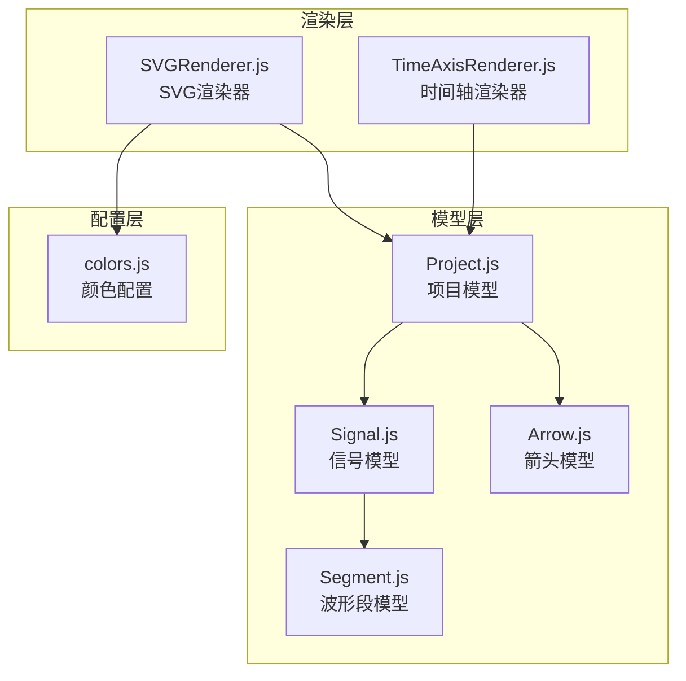
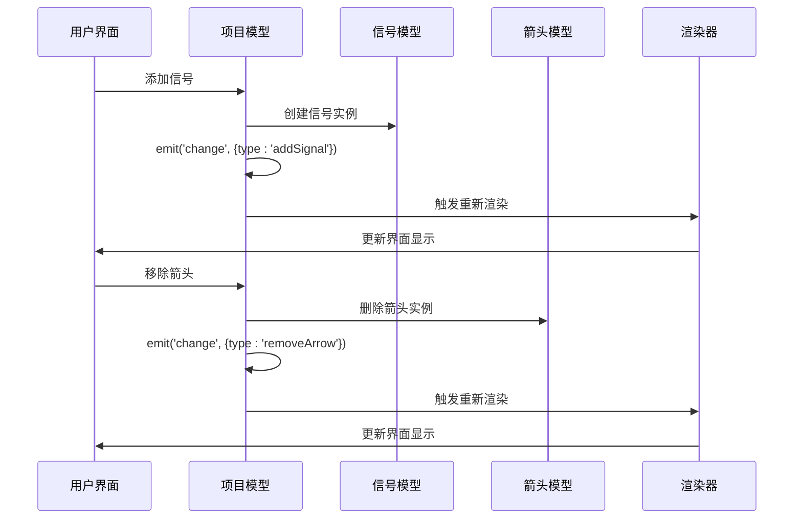
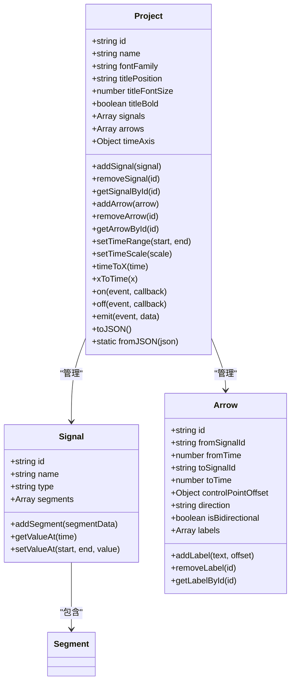

# Project项目模型API

<cite>
**本文档引用的文件**
- [Project.js](file://src/models/Project.js)
- [Signal.js](file://src/models/Signal.js)
- [Arrow.js](file://src/models/Arrow.js)
- [Segment.js](file://src/models/Segment.js)
- [TimeAxisRenderer.js](file://src/renderers/TimeAxisRenderer.js)
- [SVGRenderer.js](file://src/renderers/SVGRenderer.js)
- [default-template.json](file://default-template.json)
- [test-runner.html](file://tests/test-runner.html)
</cite>

## 目录
1. [简介](#简介)
2. [项目结构](#项目结构)
3. [核心组件](#核心组件)
4. [架构概览](#架构概览)
5. [详细组件分析](#详细组件分析)
6. [依赖关系分析](#依赖关系分析)
7. [性能考虑](#性能考虑)
8. [故障排除指南](#故障排除指南)
9. [结论](#结论)

## 简介

Project项目模型是波形编辑器的核心数据结构，负责管理整个波形图项目的所有元素。它作为项目的中央控制器，协调信号、箭头、时间轴和事件系统之间的交互。该模型提供了完整的信号管理、时间轴控制、事件系统和序列化功能，是构建复杂波形编辑界面的基础。

## 项目结构

Project模型位于src/models目录下，采用模块化设计，与其他核心组件协同工作：



**图表来源**
- [Project.js:1-245](file://src/models/Project.js#L1-L245)
- [Signal.js:1-343](file://src/models/Signal.js#L1-L343)
- [Arrow.js:1-114](file://src/models/Arrow.js#L1-L114)
- [TimeAxisRenderer.js:1-132](file://src/renderers/TimeAxisRenderer.js#L1-L132)

**章节来源**
- [Project.js:1-245](file://src/models/Project.js#L1-L245)
- [SVGRenderer.js:1-547](file://src/renderers/SVGRenderer.js#L1-L547)

## 核心组件

### 构造函数参数

Project构造函数接受一个options对象，包含以下可选参数：

| 参数名 | 类型 | 默认值 | 描述 |
|--------|------|--------|------|
| id | string | 自动生成的随机ID | 项目的唯一标识符 |
| name | string | '未命名项目' | 项目显示名称 |
| fontFamily | string | '-apple-system, BlinkMacSystemFont, sans-serif' | 项目字体族设置 |
| titlePosition | string | 'bottom' | 标题位置，'bottom'或'top' |
| titleFontSize | number | 14 | 标题字体大小 |
| titleBold | boolean | false | 标题是否加粗 |
| timeAxis | Object | 默认时间轴配置 | 时间轴配置对象 |

### 项目配置选项详解

**基础配置属性**：
- `id`: 自动生成的唯一标识符，确保项目在系统中的唯一性
- `name`: 用户可编辑的项目名称，默认显示为"未命名项目"
- `fontFamily`: 控制整个项目界面的字体样式
- `titlePosition`: 决定项目标题的显示位置（顶部或底部）
- `titleFontSize`: 标题文本的字体大小
- `titleBold`: 控制标题是否使用粗体显示

**时间轴配置**：
- `unit`: 时间单位，默认为'ns'（纳秒）
- `scale`: 缩放比例（像素/单位时间）
- `start`: 时间轴起始时间
- `end`: 时间轴结束时间

**章节来源**
- [Project.js:15-34](file://src/models/Project.js#L15-L34)
- [Project.js:25-30](file://src/models/Project.js#L25-L30)

## 架构概览

Project模型采用事件驱动的设计模式，通过统一的事件系统协调各个组件：



**图表来源**
- [Project.js:47-50](file://src/models/Project.js#L47-L50)
- [Project.js:86-89](file://src/models/Project.js#L86-L89)
- [Project.js:199-202](file://src/models/Project.js#L199-L202)

## 详细组件分析

### 信号管理方法

#### addSignal(signal)
添加新的信号到项目中。

**参数**：
- `signal` (Signal): 要添加的信号对象

**返回值**：无

**使用示例**：
```javascript
const project = new Project();
const signal = new Signal({ name: 'clk', type: 'clock' });
project.addSignal(signal);
```

**章节来源**
- [Project.js:47-50](file://src/models/Project.js#L47-L50)

#### removeSignal(signalId)
从项目中移除指定ID的信号。

**参数**：
- `signalId` (string): 要移除的信号ID

**返回值**：无

**使用示例**：
```javascript
const project = new Project();
const signal = new Signal({ name: 'clk' });
project.addSignal(signal);
project.removeSignal(signal.id);
```

**章节来源**
- [Project.js:56-62](file://src/models/Project.js#L56-L62)

#### getSignalById(signalId)
根据ID获取信号对象。

**参数**：
- `signalId` (string): 信号ID

**返回值**：Signal|null

**使用示例**：
```javascript
const project = new Project();
const signal = new Signal({ name: 'clk' });
project.addSignal(signal);
const foundSignal = project.getSignalById(signal.id);
```

**章节来源**
- [Project.js:69-71](file://src/models/Project.js#L69-L71)

#### getSignalIndex(signalId)
获取信号在数组中的索引位置。

**参数**：
- `signalId` (string): 信号ID

**返回值**：number

**使用示例**：
```javascript
const project = new Project();
const signal1 = new Signal({ name: 'sig1' });
const signal2 = new Signal({ name: 'sig2' });
project.addSignal(signal1);
project.addSignal(signal2);
const index = project.getSignalIndex(signal1.id); // 返回0
```

**章节来源**
- [Project.js:78-80](file://src/models/Project.js#L78-L80)

#### moveSignal(signalId, newIndex)
移动信号在列表中的位置。

**参数**：
- `signalId` (string): 信号ID
- `newIndex` (number): 新的索引位置

**返回值**：无

**使用示例**：
```javascript
const project = new Project();
const signal1 = new Signal({ name: 'sig1' });
const signal2 = new Signal({ name: 'sig2' });
const signal3 = new Signal({ name: 'sig3' });
project.addSignal(signal1);
project.addSignal(signal2);
project.addSignal(signal3);
project.moveSignal(signal1.id, 2); // 将sig1移动到末尾
```

**章节来源**
- [Project.js:117-124](file://src/models/Project.js#L117-L124)

### 箭头管理方法

#### addArrow(arrow)
添加依赖箭头到项目中。

**参数**：
- `arrow` (Arrow): 要添加的箭头对象

**返回值**：无

**使用示例**：
```javascript
const project = new Project();
const arrow = new Arrow({
    fromSignalId: 'sig1',
    fromTime: 10,
    toSignalId: 'sig2',
    toTime: 20
});
project.addArrow(arrow);
```

**章节来源**
- [Project.js:86-89](file://src/models/Project.js#L86-L89)

#### removeArrow(arrowId)
从项目中移除指定ID的箭头。

**参数**：
- `arrowId` (string): 箭头ID

**返回值**：无

**使用示例**：
```javascript
const project = new Project();
const arrow = new Arrow({ fromSignalId: 'sig1', toSignalId: 'sig2' });
project.addArrow(arrow);
project.removeArrow(arrow.id);
```

**章节来源**
- [Project.js:95-101](file://src/models/Project.js#L95-L101)

#### getArrowById(arrowId)
根据ID获取箭头对象。

**参数**：
- `arrowId` (string): 箭头ID

**返回值**：Arrow|null

**使用示例**：
```javascript
const project = new Project();
const arrow = new Arrow({ fromSignalId: 'sig1', toSignalId: 'sig2' });
project.addArrow(arrow);
const foundArrow = project.getArrowById(arrow.id);
```

**章节来源**
- [Project.js:108-110](file://src/models/Project.js#L108-L110)

### 时间轴控制方法

#### setTimeRange(start, end)
设置时间轴的开始和结束时间。

**参数**：
- `start` (number): 开始时间
- `end` (number): 结束时间

**返回值**：无

**使用示例**：
```javascript
const project = new Project();
project.setTimeRange(0, 1000); // 设置时间为0-1000单位
```

**章节来源**
- [Project.js:131-135](file://src/models/Project.js#L131-L135)

#### setTimeScale(scale)
设置时间轴的缩放比例。

**参数**：
- `scale` (number): 缩放比例（像素/单位时间）

**返回值**：无

**使用示例**：
```javascript
const project = new Project();
project.setTimeScale(10); // 10像素代表1个时间单位
```

**章节来源**
- [Project.js:141-144](file://src/models/Project.js#L141-L144)

#### getTimeAxisWidth()
计算时间轴的总宽度（像素）。

**参数**：无

**返回值**：number

**使用示例**：
```javascript
const project = new Project();
const width = project.getTimeAxisWidth(); // 返回时间轴宽度
```

**章节来源**
- [Project.js:150-152](file://src/models/Project.js#L150-L152)

#### timeToX(time)
将时间转换为X坐标。

**参数**：
- `time` (number): 时间值

**返回值**：number

**使用示例**：
```javascript
const project = new Project({ timeAxis: { scale: 10, start: 0 } });
const x = project.timeToX(50); // 返回500
```

**章节来源**
- [Project.js:159-161](file://src/models/Project.js#L159-L161)

#### xToTime(x)
将X坐标转换为时间。

**参数**：
- `x` (number): X坐标值

**返回值**：number

**使用示例**：
```javascript
const project = new Project({ timeAxis: { scale: 10, start: 0 } });
const time = project.xToTime(250); // 返回25
```

**章节来源**
- [Project.js:168-170](file://src/models/Project.js#L168-L170)

### 事件系统方法

#### on(event, callback)
注册事件监听器。

**参数**：
- `event` (string): 事件名称
- `callback` (Function): 回调函数

**返回值**：无

**使用示例**：
```javascript
const project = new Project();
project.on('change', (data) => {
    console.log('项目发生变更:', data);
});
```

**章节来源**
- [Project.js:177-182](file://src/models/Project.js#L177-L182)

#### off(event, callback)
移除事件监听器。

**参数**：
- `event` (string): 事件名称
- `callback` (Function): 回调函数

**返回值**：无

**使用示例**：
```javascript
const project = new Project();
const handler = (data) => console.log('变更:', data);
project.on('change', handler);
project.off('change', handler); // 移除监听器
```

**章节来源**
- [Project.js:189-192](file://src/models/Project.js#L189-L192)

#### emit(event, data)
触发指定事件。

**参数**：
- `event` (string): 事件名称
- `data` (*): 传递给回调的数据

**返回值**：无

**使用示例**：
```javascript
const project = new Project();
project.emit('customEvent', { message: 'Hello World' });
```

**章节来源**
- [Project.js:199-202](file://src/models/Project.js#L199-L202)

### 序列化方法

#### toJSON()
将项目序列化为JSON对象。

**参数**：无

**返回值**：Object

**使用示例**：
```javascript
const project = new Project({ name: 'test' });
const json = project.toJSON();
// 可以保存到localStorage或发送到服务器
```

**章节来源**
- [Project.js:208-221](file://src/models/Project.js#L208-L221)

#### static fromJSON(json)
从JSON对象创建项目实例。

**参数**：
- `json` (Object): JSON格式的项目数据

**返回值**：Project

**使用示例**：
```javascript
const project = Project.fromJSON(savedProjectJSON);
// 恢复之前的项目状态
```

**章节来源**
- [Project.js:228-244](file://src/models/Project.js#L228-L244)

### 内部方法

#### _generateId()
生成唯一的项目ID。

**参数**：无

**返回值**：string

**使用示例**：内部使用，无需手动调用

**章节来源**
- [Project.js:39-41](file://src/models/Project.js#L39-L41)

## 依赖关系分析

Project模型与Signal、Arrow模型之间存在紧密的依赖关系：



**图表来源**
- [Project.js:8-34](file://src/models/Project.js#L8-L34)
- [Signal.js:7-29](file://src/models/Signal.js#L7-L29)
- [Arrow.js:5-45](file://src/models/Arrow.js#L5-L45)

**章节来源**
- [Project.js:1-245](file://src/models/Project.js#L1-L245)
- [Signal.js:1-343](file://src/models/Signal.js#L1-L343)
- [Arrow.js:1-114](file://src/models/Arrow.js#L1-L114)

## 性能考虑

### 时间复杂度分析

1. **信号管理操作**：
   - `addSignal()`: O(1) - 数组尾部插入
   - `removeSignal()`: O(n) - 需要查找和删除
   - `getSignalById()`: O(n) - 线性搜索
   - `moveSignal()`: O(n) - 数组重排

2. **箭头管理操作**：
   - `addArrow()`: O(1) - 数组尾部插入
   - `removeArrow()`: O(n) - 需要查找和删除
   - `getArrowById()`: O(n) - 线性搜索

3. **时间轴转换**：
   - `timeToX()`: O(1) - 简单数学运算
   - `xToTime()`: O(1) - 简单数学运算

### 内存优化建议

1. **批量操作**：对于大量信号或箭头的操作，考虑使用批量处理以减少事件触发次数
2. **及时清理**：移除不再使用的信号和箭头，避免内存泄漏
3. **合理缩放**：根据实际需求调整时间轴缩放比例，避免过度渲染

## 故障排除指南

### 常见问题及解决方案

#### 1. 事件监听器无法触发
**问题**：注册的事件监听器不响应
**解决方案**：检查事件名称是否正确，确认回调函数引用一致

#### 2. 信号ID冲突
**问题**：添加信号时出现ID冲突
**解决方案**：让系统自动生成ID，或确保自定义ID的唯一性

#### 3. 时间转换错误
**问题**：timeToX和xToTime转换结果异常
**解决方案**：检查timeAxis配置，确保scale和start/end设置合理

#### 4. 序列化失败
**问题**：toJSON或fromJSON抛出异常
**解决方案**：验证数据结构完整性，确保所有必需字段都已正确设置

**章节来源**
- [Project.js:177-202](file://src/models/Project.js#L177-L202)
- [Project.js:208-244](file://src/models/Project.js#L208-L244)

## 结论

Project项目模型为波形编辑器提供了完整的数据管理和事件协调机制。其设计具有以下特点：

1. **模块化设计**：清晰的职责分离，便于维护和扩展
2. **事件驱动**：统一的事件系统确保组件间的松耦合
3. **序列化支持**：完整的JSON序列化能力便于数据持久化
4. **性能优化**：合理的数据结构和算法选择保证了良好的运行效率

该模型为构建复杂的波形编辑界面奠定了坚实的基础，通过灵活的API设计和完善的错误处理机制，为开发者提供了强大的工具来创建专业的波形可视化应用。