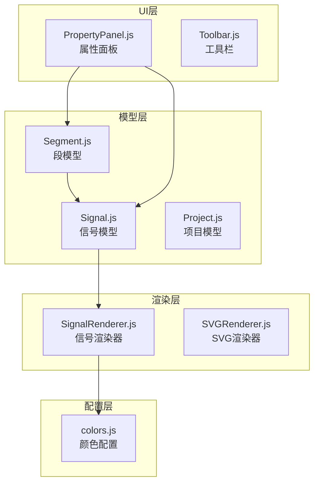
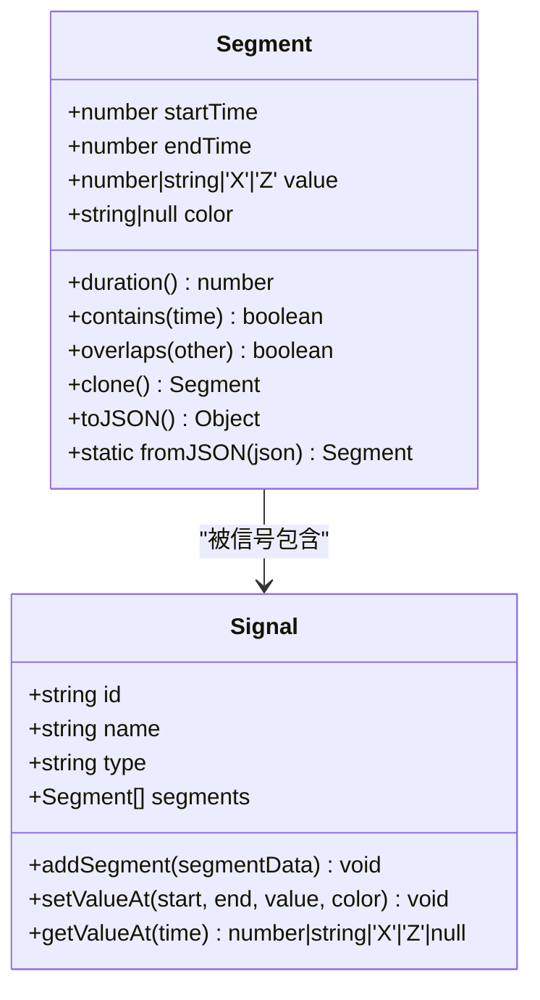
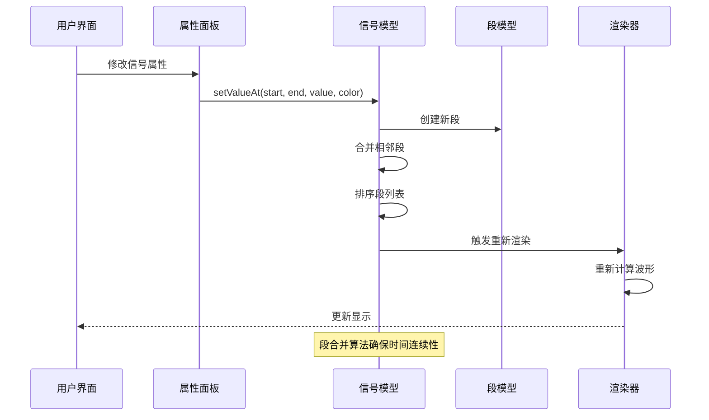
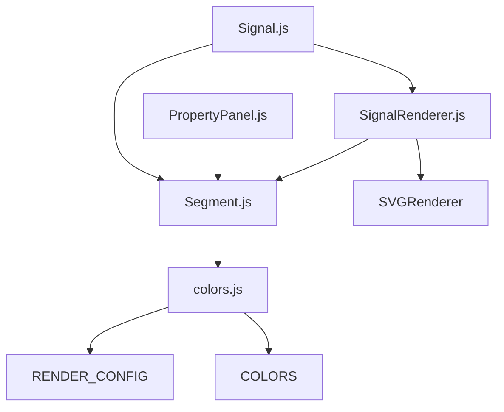

# Segment段模型API

<cite>
**本文档引用的文件**
- [Segment.js](file://src/models/Segment.js)
- [colors.js](file://src/config/colors.js)
- [Signal.js](file://src/models/Signal.js)
- [SignalRenderer.js](file://src/renderers/SignalRenderer.js)
- [PropertyPanel.js](file://src/ui/PropertyPanel.js)
- [test-runner.html](file://tests/test-runner.html)
</cite>

## 目录
1. [简介](#简介)
2. [项目结构](#项目结构)
3. [核心组件](#核心组件)
4. [架构概览](#架构概览)
5. [详细组件分析](#详细组件分析)
6. [依赖关系分析](#依赖关系分析)
7. [性能考虑](#性能考虑)
8. [故障排除指南](#故障排除指南)
9. [结论](#结论)
10. [附录](#附录)

## 简介

Segment段模型是波形编辑器的核心数据结构，用于表示信号的一个电平段。每个Segment代表信号在特定时间范围内保持恒定电平值的状态，是构建完整波形信号的基本组成单元。

本API文档详细记录了Segment类的所有构造参数、实例方法和静态方法，包括时间范围设置、电平值管理、颜色配置和序列化功能。Segment模型支持四种主要的电平状态：逻辑0、逻辑1、高阻态(Z)和不定态(X)，以及十六进制总线值。

## 项目结构

Segment模型位于项目的模型层，与信号模型、渲染器和UI组件协同工作：



**图表来源**
- [Segment.js:1-94](file://src/models/Segment.js#L1-L94)
- [Signal.js:1-343](file://src/models/Signal.js#L1-L343)
- [colors.js:1-83](file://src/config/colors.js#L1-L83)

**章节来源**
- [Segment.js:1-94](file://src/models/Segment.js#L1-L94)
- [Signal.js:1-343](file://src/models/Signal.js#L1-L343)

## 核心组件

### Segment类概述

Segment类是波形编辑器的基础数据结构，负责存储和管理单个电平段的信息。每个Segment包含以下核心属性：

- **时间范围**：开始时间和结束时间，定义段在时间轴上的位置
- **电平值**：表示该时间段内的信号电平状态
- **颜色配置**：可选的颜色信息，主要用于总线信号的段级别着色

### 数据结构定义



**图表来源**
- [Segment.js:5-94](file://src/models/Segment.js#L5-L94)
- [Signal.js:7-343](file://src/models/Signal.js#L7-L343)

**章节来源**
- [Segment.js:5-94](file://src/models/Segment.js#L5-L94)
- [colors.js:52-83](file://src/config/colors.js#L52-L83)

## 架构概览

Segment模型在整个波形编辑器架构中扮演着关键角色，它与多个组件紧密协作：



**图表来源**
- [PropertyPanel.js:146-159](file://src/ui/PropertyPanel.js#L146-L159)
- [Signal.js:62-133](file://src/models/Signal.js#L62-L133)
- [SignalRenderer.js:201-316](file://src/renderers/SignalRenderer.js#L201-L316)

**章节来源**
- [PropertyPanel.js:146-159](file://src/ui/PropertyPanel.js#L146-L159)
- [Signal.js:62-133](file://src/models/Signal.js#L62-L133)

## 详细组件分析

### 构造函数参数

Segment构造函数接受一个options对象，包含以下可选参数：

| 参数名 | 类型 | 默认值 | 描述 |
|--------|------|--------|------|
| startTime | number | 0 | 段的开始时间，必须小于endTime |
| endTime | number | 10 | 段的结束时间，必须大于startTime |
| value | number \| 'X' \| 'Z' \| string | 0 | 段的电平值，支持0、1、'X'、'Z'和十六进制字符串 |
| color | string \| null | null | 段级别的颜色配置，主要用于总线信号 |

**章节来源**
- [Segment.js:12-19](file://src/models/Segment.js#L12-L19)

### 实例方法详解

#### 时间范围管理

**duration属性**
- 返回值：number
- 功能：计算段的持续时间（endTime - startTime）
- 复杂度：O(1)

**contains方法**
- 参数：time (number) - 要检查的时间点
- 返回值：boolean
- 功能：检查指定时间点是否位于该段的半开区间[startTime, endTime)
- 复杂度：O(1)

**overlaps方法**
- 参数：other (Segment) - 另一个段对象
- 返回值：boolean
- 功能：检查两个段是否在时间轴上有重叠
- 复杂度：O(1)

#### 段操作

**clone方法**
- 返回值：Segment
- 功能：创建当前段的独立副本
- 复杂度：O(1)

**章节来源**
- [Segment.js:33-66](file://src/models/Segment.js#L33-L66)

### 序列化方法

#### toJSON方法
- 返回值：Object
- 功能：将段对象序列化为JSON格式
- 输出结构：
  ```javascript
  {
    startTime: number,
    endTime: number,
    value: number|string|'X'|'Z',
    color?: string  // 仅当存在时才包含
  }
  ```

#### fromJSON静态方法
- 参数：json (Object) - JSON格式的段数据
- 返回值：Segment
- 功能：从JSON数据创建Segment实例
- 特殊处理：如果color为null或不存在，则设置为null

**章节来源**
- [Segment.js:72-93](file://src/models/Segment.js#L72-L93)

### 电平值管理

Segment支持四种主要的电平状态：

1. **逻辑电平**：0 (低电平) 和 1 (高电平)
2. **高阻态**：'Z' - 表示信号处于高阻抗状态
3. **不定态**：'X' - 表示信号状态未知或不稳定
4. **总线值**：十六进制字符串如 '0x3F'

电平值在渲染时转换为相应的视觉表现：
- 0 → 低电平线
- 1 → 高电平线  
- 'Z' → 中间线 + 标识
- 'X' → 斜线填充矩形

**章节来源**
- [colors.js:58-83](file://src/config/colors.js#L58-L83)
- [SignalRenderer.js:222-312](file://src/renderers/SignalRenderer.js#L222-L312)

### 颜色配置

Segment支持两种级别的颜色配置：

1. **段级别颜色**：通过构造函数的color参数设置
2. **信号级别颜色**：通过Signal.color属性设置

颜色优先级规则：
- 段级别颜色优先于信号级别颜色
- 对于'X'和'Z'态，即使设置了段级别颜色也不生效
- 总线信号的段级别颜色用于填充色，线条颜色使用默认值

**章节来源**
- [colors.js:76-83](file://src/config/colors.js#L76-L83)
- [SignalRenderer.js:218-221](file://src/renderers/SignalRenderer.js#L218-L221)

## 依赖关系分析

### 内部依赖



**图表来源**
- [Segment.js:1-94](file://src/models/Segment.js#L1-L94)
- [Signal.js:5-6](file://src/models/Signal.js#L5-L6)
- [colors.js:4-5](file://src/config/colors.js#L4-L5)

### 外部依赖

- **SVG渲染**：依赖SVGRenderer进行可视化输出
- **颜色配置**：依赖colors.js中的颜色常量和配置
- **用户界面**：通过PropertyPanel.js与用户交互

**章节来源**
- [SignalRenderer.js:4-16](file://src/renderers/SignalRenderer.js#L4-L16)
- [PropertyPanel.js:1-2](file://src/ui/PropertyPanel.js#L1-L2)

## 性能考虑

### 时间复杂度分析

1. **基础操作**：构造函数、访问器、克隆等均为O(1)
2. **段合并**：在Signal.addSegment中，最坏情况下需要O(n)时间处理重叠段
3. **排序操作**：每次添加段后需要O(n log n)时间进行排序
4. **查找操作**：getValueAt采用线性搜索，时间复杂度O(n)

### 内存使用

- 每个Segment对象占用固定内存空间
- 段数组随信号复杂度线性增长
- 颜色信息按需存储，null值不占用额外空间

### 优化建议

1. **批量操作**：对于大量段的创建，考虑先收集再统一处理
2. **缓存机制**：对于频繁查询的段，可以考虑建立索引
3. **增量更新**：在UI层面实现增量渲染，避免全量重绘

## 故障排除指南

### 常见问题

**时间范围错误**
- 症状：抛出"startTime必须小于endTime"的错误
- 解决方案：确保startTime < endTime

**段重叠处理**
- 症状：添加重叠段时出现意外的段分割
- 解决方案：理解段合并算法的工作原理，合理设计时间轴

**颜色显示异常**
- 症状：'X'和'Z'态的颜色不符合预期
- 解决方案：了解颜色优先级规则，正确设置段级别颜色

**章节来源**
- [Segment.js:24-28](file://src/models/Segment.js#L24-L28)
- [Signal.js:72-133](file://src/models/Signal.js#L72-L133)

## 结论

Segment段模型作为波形编辑器的核心数据结构，提供了简洁而强大的接口来表示和操作信号的电平状态。其设计充分考虑了波形编辑的实际需求，支持多种电平状态、灵活的颜色配置和完整的序列化能力。

通过与其他组件的紧密协作，Segment模型能够高效地构建复杂的波形信号，并为用户提供直观的可视化体验。其模块化的架构设计使得系统的维护和扩展变得相对简单。

## 附录

### 使用示例

#### 创建基本段
```javascript
// 创建默认段 (0-10ns, 低电平)
const segment1 = new Segment();

// 创建指定参数的段
const segment2 = new Segment({
  startTime: 5,
  endTime: 15,
  value: 1,
  color: '#ff0000'
});
```

#### 操作段数据
```javascript
// 检查时间点
if (segment.contains(7)) {
  console.log('时间点在段内');
}

// 获取段持续时间
const duration = segment.duration;

// 克隆段
const clonedSegment = segment.clone();
```

#### 序列化和反序列化
```javascript
// 序列化
const json = segment.toJSON();

// 反序列化
const restoredSegment = Segment.fromJSON(json);
```

#### 在信号中使用
```javascript
// 添加到信号
signal.addSegment({
  startTime: 0,
  endTime: 50,
  value: 0
});

// 设置指定时间范围的值
signal.setValueAt(20, 40, 1, '#00ff00');
```

**章节来源**
- [Segment.js:72-93](file://src/models/Segment.js#L72-L93)
- [Signal.js:62-166](file://src/models/Signal.js#L62-L166)