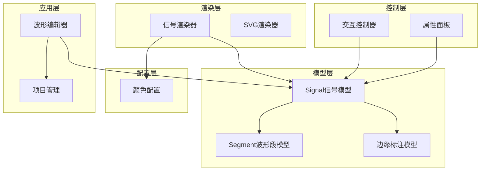
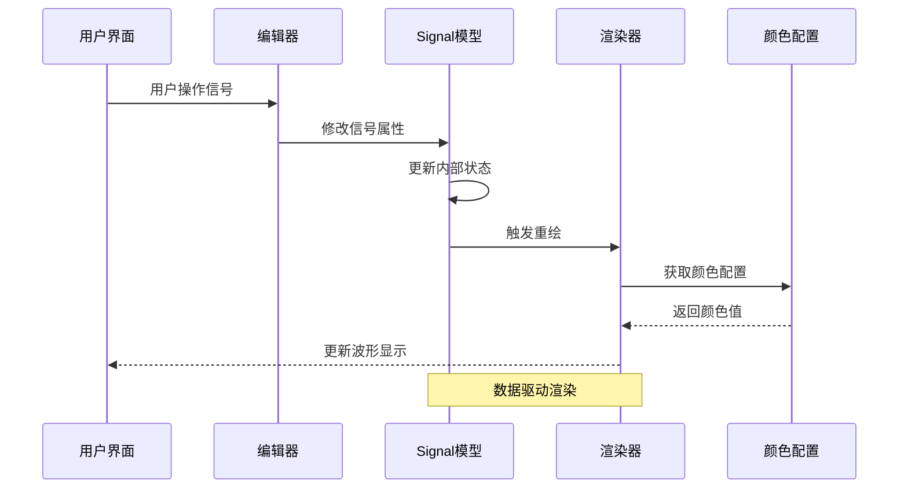
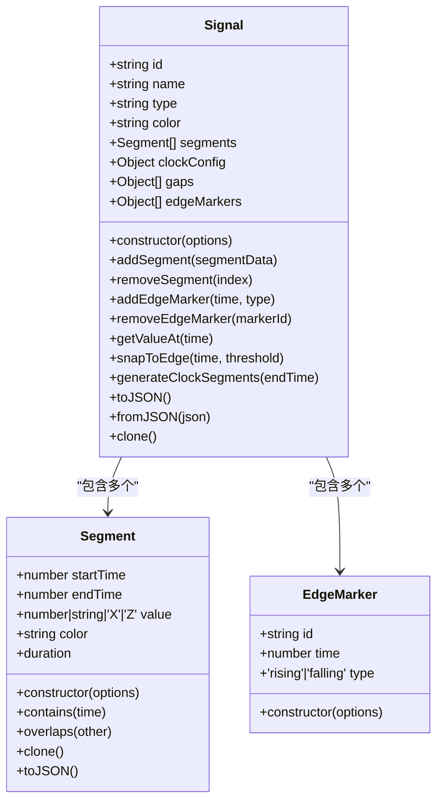
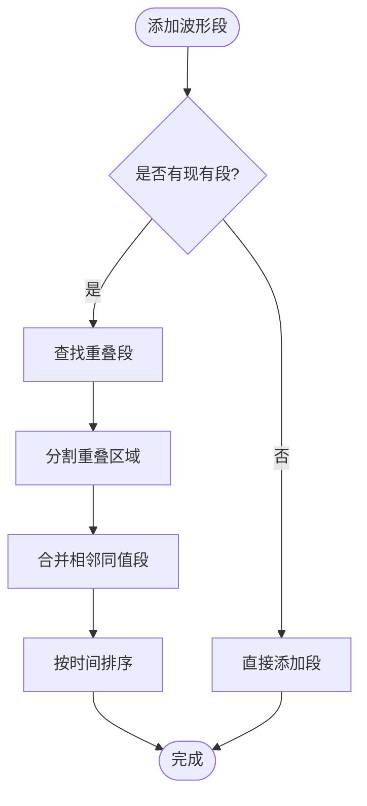
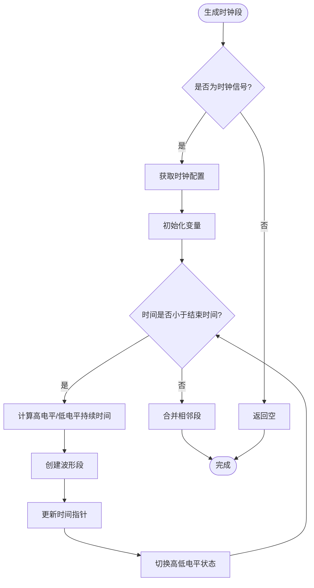
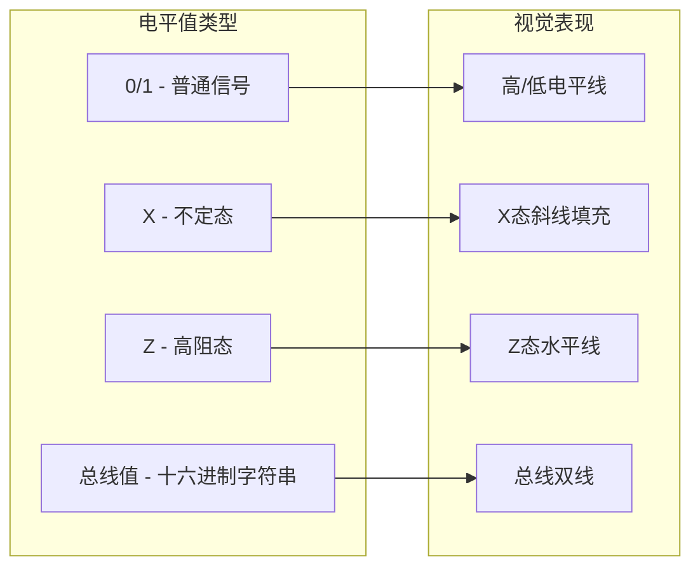
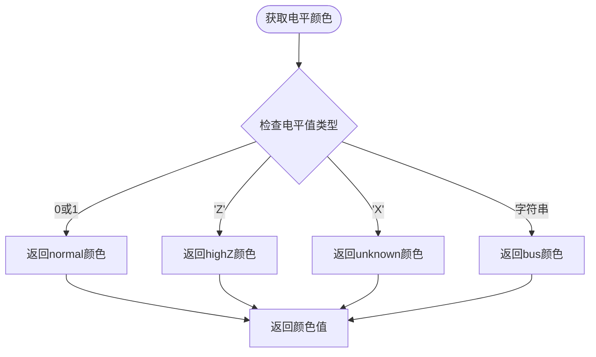
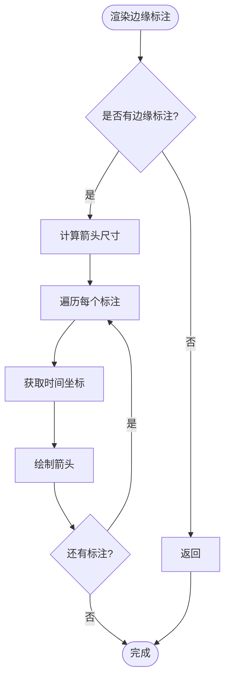
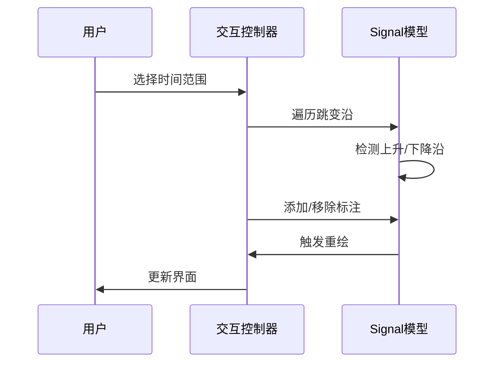
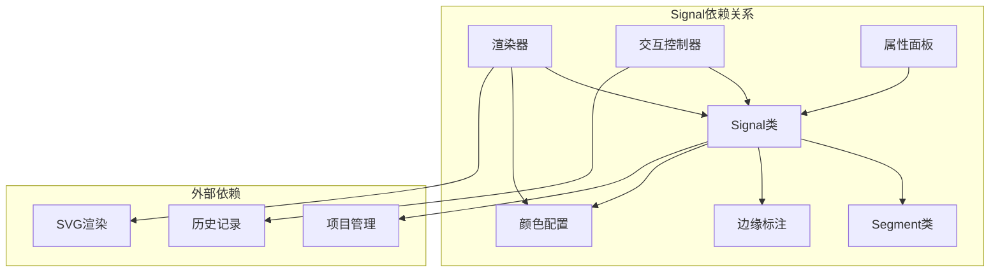

# Signal信号模型API

<cite>
**本文档引用的文件**
- [src/models/Signal.js](file://src/models/Signal.js)
- [src/models/Segment.js](file://src/models/Segment.js)
- [src/config/colors.js](file://src/config/colors.js)
- [src/ui/PropertyPanel.js](file://src/ui/PropertyPanel.js)
- [src/renderers/SignalRenderer.js](file://src/renderers/SignalRenderer.js)
- [src/controllers/InteractionController.js](file://src/controllers/InteractionController.js)
- [src/main.js](file://src/main.js)
</cite>

## 更新摘要
**变更内容**
- 新增edgeMarkers数组属性，用于存储边缘标注信息
- 添加addEdgeMarker和removeEdgeMarker方法，支持边缘标注的添加和删除
- 增强Signal类的序列化和克隆功能，包含edgeMarkers属性
- 完善SignalRenderer的边缘标注渲染功能
- 更新交互控制器的边缘标注处理逻辑

## 目录
1. [简介](#简介)
2. [项目结构](#项目结构)
3. [核心组件](#核心组件)
4. [架构概览](#架构概览)
5. [详细组件分析](#详细组件分析)
6. [边缘标注功能](#边缘标注功能)
7. [依赖关系分析](#依赖关系分析)
8. [性能考虑](#性能考虑)
9. [故障排除指南](#故障排除指南)
10. [结论](#结论)

## 简介

Signal信号模型是波形编辑器的核心数据结构，用于表示和管理数字电路中的信号波形。该模型支持三种信号类型：普通信号、时钟信号和总线信号，提供了完整的波形段管理、时钟配置、颜色管理和序列化功能。最新版本增强了边缘标注功能，支持在跳变沿位置添加上升沿和下降沿标注箭头。

## 项目结构

波形编辑器采用模块化架构设计，Signal类位于models目录中，作为核心数据模型与其他组件协同工作：



**图表来源**
- [src/models/Signal.js:1-367](file://src/models/Signal.js#L1-L367)
- [src/models/Segment.js:1-94](file://src/models/Segment.js#L1-L94)
- [src/config/colors.js:1-83](file://src/config/colors.js#L1-L83)

**章节来源**
- [src/models/Signal.js:1-367](file://src/models/Signal.js#L1-L367)
- [src/models/Segment.js:1-94](file://src/models/Segment.js#L1-L94)
- [src/config/colors.js:1-83](file://src/config/colors.js#L1-L83)

## 核心组件

### Signal类概述

Signal类是波形编辑器的核心数据模型，负责管理信号的所有属性和行为。它继承自Segment类，提供了丰富的信号操作功能。

#### 构造函数参数

| 参数名 | 类型 | 必需 | 默认值 | 描述 |
|--------|------|------|--------|------|
| id | string | 否 | 自动生成 | 信号的唯一标识符 |
| name | string | 否 | 'signal' | 信号名称 |
| type | string | 否 | 'signal' | 信号类型 ('signal' \| 'clock' \| 'bus') |
| color | string | 否 | null | 信号颜色，null表示使用默认颜色 |
| segments | Array | 否 | [] | 初始波形段数组 |
| gaps | Array | 否 | [] | 垂直分隔符数组 |
| edgeMarkers | Array | 否 | [] | 边缘标注数组 |

#### 实例方法

**波形段管理**
- `addSegment(segmentData)` - 添加波形段（自动合并相邻同值段）
- `removeSegment(index)` - 移除指定索引的波形段
- `getSegments()` - 获取所有波形段
- `setValueAt(startTime, endTime, value, color)` - 设置指定时间范围的电平值

**边缘标注管理** **更新**
- `addEdgeMarker(time, type)` - 添加边缘标注（上升沿/下降沿）
- `removeEdgeMarker(markerId)` - 移除指定ID的边缘标注

**信号类型判断**
- `isClock()` - 判断是否为时钟信号
- `isBus()` - 判断是否为总线信号
- `isNormal()` - 判断是否为普通信号

**时钟信号配置**
- `setClockHigh(value)` - 设置时钟高电平值
- `setClockLow(value)` - 设置时钟低电平值
- `generateClockSegments(endTime)` - 生成时钟波形段

**分隔符管理**
- `addGap(time)` - 添加分隔符
- `removeGap(gapId)` - 移除分隔符

**颜色配置**
- `setColor(color)` - 设置信号颜色
- `setDefaultColor()` - 重置为默认颜色

**序列化方法**
- `toJSON()` - 序列化为JSON格式
- `fromJSON(json)` - 从JSON创建信号对象
- `clone()` - 克隆信号对象

**章节来源**
- [src/models/Signal.js:14-367](file://src/models/Signal.js#L14-L367)

## 架构概览

Signal类在整个波形编辑器架构中扮演着核心角色，连接了数据层、渲染层和用户界面层：



**图表来源**
- [src/main.js:634-668](file://src/main.js#L634-L668)
- [src/renderers/SignalRenderer.js:39-144](file://src/renderers/SignalRenderer.js#L39-L144)
- [src/config/colors.js:58-83](file://src/config/colors.js#L58-L83)

## 详细组件分析

### Signal类详细分析

#### 数据结构设计

Signal类采用组合模式设计，将波形段和边缘标注作为基本构建单元：



**图表来源**
- [src/models/Signal.js:7-367](file://src/models/Signal.js#L7-L367)
- [src/models/Segment.js:5-94](file://src/models/Segment.js#L5-L94)

#### 波形段管理算法

Signal类实现了智能的波形段合并算法，确保相邻同值段的自动合并：



**图表来源**
- [src/models/Signal.js:83-154](file://src/models/Signal.js#L83-L154)

#### 时钟信号生成机制

时钟信号具有特殊的生成逻辑，支持可配置的周期、相位和占空比：



**图表来源**
- [src/models/Signal.js:247-273](file://src/models/Signal.js#L247-L273)

### Segment类详细分析

Segment类作为Signal的基本组成单元，提供了精确的波形段管理能力：

#### Segment数据结构

| 属性名 | 类型 | 描述 |
|--------|------|------|
| startTime | number | 段起始时间 |
| endTime | number | 段结束时间 |
| value | number/string/'X'/'Z' | 电平值（0, 1, 'X', 'Z', 或十六进制字符串） |
| color | string | 段级别颜色（主要用于总线信号） |

#### 电平值处理

不同类型的电平值对应不同的视觉表现：



**图表来源**
- [src/models/Segment.js:12-16](file://src/models/Segment.js#L12-L16)
- [src/config/colors.js:76-83](file://src/config/colors.js#L76-L83)

**章节来源**
- [src/models/Segment.js:1-94](file://src/models/Segment.js#L1-L94)
- [src/config/colors.js:1-83](file://src/config/colors.js#L1-L83)

### 颜色配置系统

颜色配置系统提供了统一的颜色管理机制，支持信号级别的颜色覆盖：

#### 颜色配置选项

| 颜色类别 | 默认值 | 用途 |
|----------|--------|------|
| normal | '#000000' | 普通信号（0/1） |
| highZ | '#B8860B' | 高阻态（Z） |
| unknown | '#E00000' | 不定态（X） |
| bus | '#000000' | 总线数据 |
| signalNameColor | '#1a365d' | 信号名称颜色 |

#### 颜色获取逻辑



**图表来源**
- [src/config/colors.js:76-83](file://src/config/colors.js#L76-L83)

**章节来源**
- [src/config/colors.js:5-83](file://src/config/colors.js#L5-L83)

## 边缘标注功能

### EdgeMarker数据结构

EdgeMarker是Signal类新增的重要功能，用于在波形图上标记跳变沿：

| 属性名 | 类型 | 描述 |
|--------|------|------|
| id | string | 标注的唯一标识符 |
| time | number | 跳变沿发生的时间点 |
| type | 'rising'\|'falling' | 标注类型：上升沿或下降沿 |

### 边缘标注管理方法

#### addEdgeMarker方法

添加新的边缘标注到指定时间点：

```javascript
/**
 * 添加沿标注
 * @param {number} time - 跳变沿时间
 * @param {'rising'|'falling'} type - 沿类型
 * @returns {Object} 添加的标注
 */
addEdgeMarker(time, type) {
  const marker = { id: 'em_' + Math.random().toString(36).substr(2, 9), time, type };
  this.edgeMarkers.push(marker);
  return marker;
}
```

#### removeEdgeMarker方法

移除指定ID的边缘标注：

```javascript
/**
 * 移除沿标注
 * @param {string} markerId - 标注 ID
 */
removeEdgeMarker(markerId) {
  this.edgeMarkers = this.edgeMarkers.filter(m => m.id !== markerId);
}
```

### 边缘标注渲染机制

SignalRenderer实现了边缘标注的可视化渲染：



**图表来源**
- [src/renderers/SignalRenderer.js:490-563](file://src/renderers/SignalRenderer.js#L490-L563)

### 交互控制逻辑

交互控制器实现了边缘标注的用户交互功能：



**图表来源**
- [src/controllers/InteractionController.js:1214-1255](file://src/controllers/InteractionController.js#L1214-L1255)

**章节来源**
- [src/models/Signal.js:60-77](file://src/models/Signal.js#L60-L77)
- [src/renderers/SignalRenderer.js:490-563](file://src/renderers/SignalRenderer.js#L490-L563)
- [src/controllers/InteractionController.js:1214-1255](file://src/controllers/InteractionController.js#L1214-L1255)

## 依赖关系分析

Signal类与系统其他组件的依赖关系如下：



**图表来源**
- [src/models/Signal.js:5](file://src/models/Signal.js#L5)
- [src/renderers/SignalRenderer.js:4](file://src/renderers/SignalRenderer.js#L4)
- [src/controllers/InteractionController.js:1](file://src/controllers/InteractionController.js#L1)

**章节来源**
- [src/models/Signal.js:1-367](file://src/models/Signal.js#L1-L367)
- [src/renderers/SignalRenderer.js:1-590](file://src/renderers/SignalRenderer.js#L1-L590)
- [src/controllers/InteractionController.js:1-1534](file://src/controllers/InteractionController.js#L1-L1534)

## 性能考虑

### 时间复杂度分析

- **波形段添加**: O(n) - 需要遍历现有段进行重叠检测和合并
- **时间查询**: O(n) - 线性搜索匹配的段
- **时钟段生成**: O(t/p) - t为时间段，p为周期
- **段合并**: O(n) - 合并相邻同值段
- **边缘标注管理**: O(m) - m为边缘标注数量

### 内存优化策略

1. **延迟生成**: 时钟信号采用延迟生成策略，只在需要时计算波形段
2. **段合并**: 自动合并相邻同值段，减少内存占用
3. **颜色缓存**: 颜色配置采用全局缓存，避免重复计算
4. **边缘标注优化**: 边缘标注按需渲染，不影响波形段性能

## 故障排除指南

### 常见问题及解决方案

**问题1: 信号段重叠导致显示异常**
- 检查段的起始时间和结束时间关系
- 确保段按时间顺序排列
- 使用`_mergeAdjacentSegments()`方法自动修复

**问题2: 时钟信号不正确**
- 验证时钟配置参数（period, phase, dutyCycle）
- 检查生成的波形段数量和时序
- 使用`generateClockSegments()`重新生成

**问题3: 颜色显示不正确**
- 检查信号级别的颜色设置
- 验证段级别的颜色覆盖
- 确认颜色配置文件的正确性

**问题4: 边缘标注不显示**
- 确认edgeMarkers数组中存在标注数据
- 检查标注的时间坐标是否在可视范围内
- 验证渲染器的边缘标注渲染逻辑

**问题5: 边缘标注交互失效**
- 检查交互控制器的标注处理逻辑
- 确认标注ID的唯一性和正确性
- 验证历史记录的撤销/重做功能

**章节来源**
- [src/models/Signal.js:138-155](file://src/models/Signal.js#L138-L155)
- [src/models/Signal.js:247-273](file://src/models/Signal.js#L247-L273)
- [src/config/colors.js:76-83](file://src/config/colors.js#L76-L83)
- [src/renderers/SignalRenderer.js:490-563](file://src/renderers/SignalRenderer.js#L490-L563)

## 结论

Signal信号模型通过精心设计的数据结构和算法，为波形编辑器提供了强大而灵活的信号管理能力。最新版本新增的边缘标注功能进一步增强了信号分析能力，使用户能够直观地标记和识别重要的跳变沿事件。

该模型的成功之处在于：
1. **数据完整性**: 通过严格的验证机制确保数据一致性
2. **算法效率**: 智能的段合并和重叠检测算法
3. **扩展性**: 支持多种信号类型和自定义配置
4. **用户体验**: 直观的颜色管理和交互设计
5. **功能完整性**: 新增边缘标注功能完善了信号分析工具集

未来可以考虑的改进方向包括：边缘标注的批量操作、更丰富的标注样式支持、以及更好的标注导出功能。