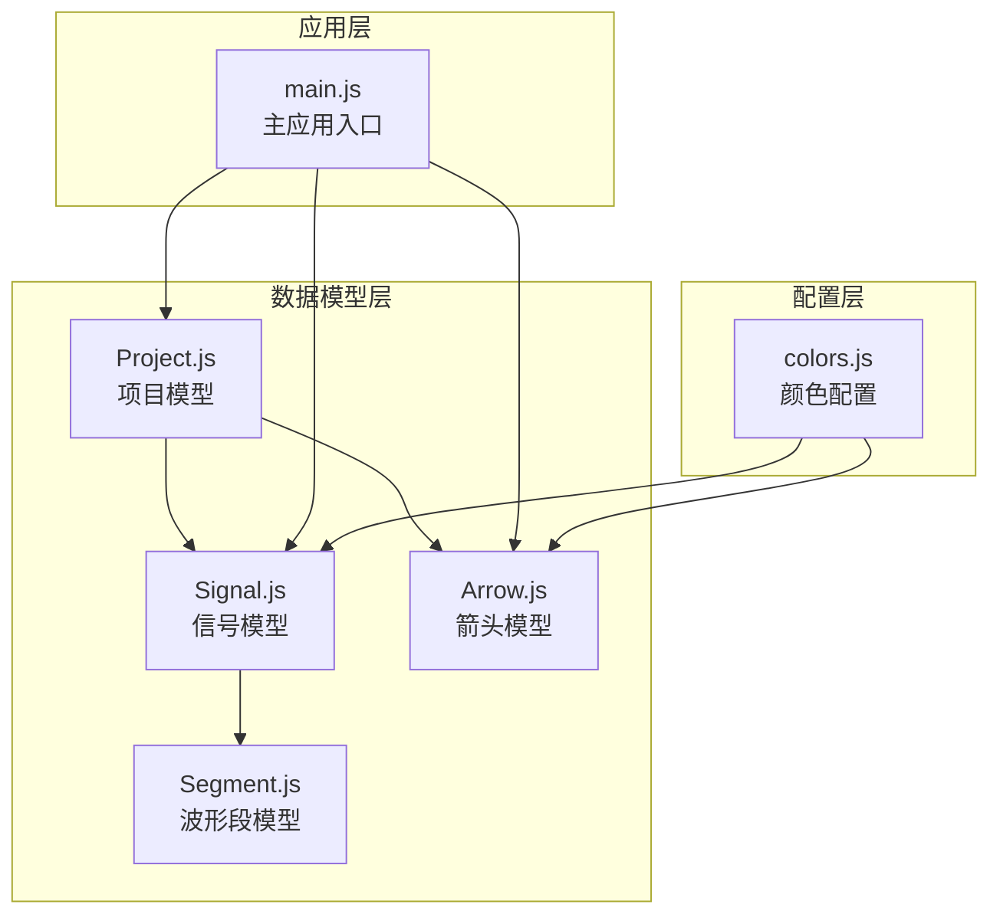
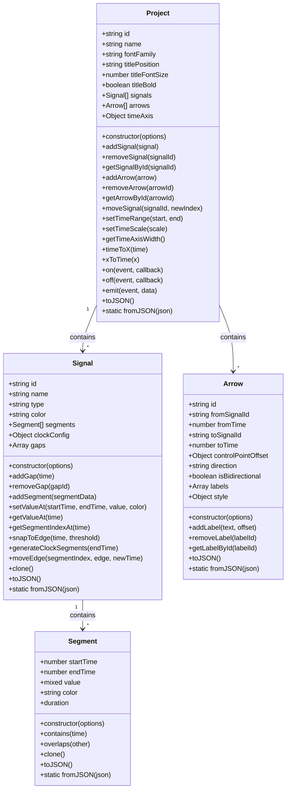
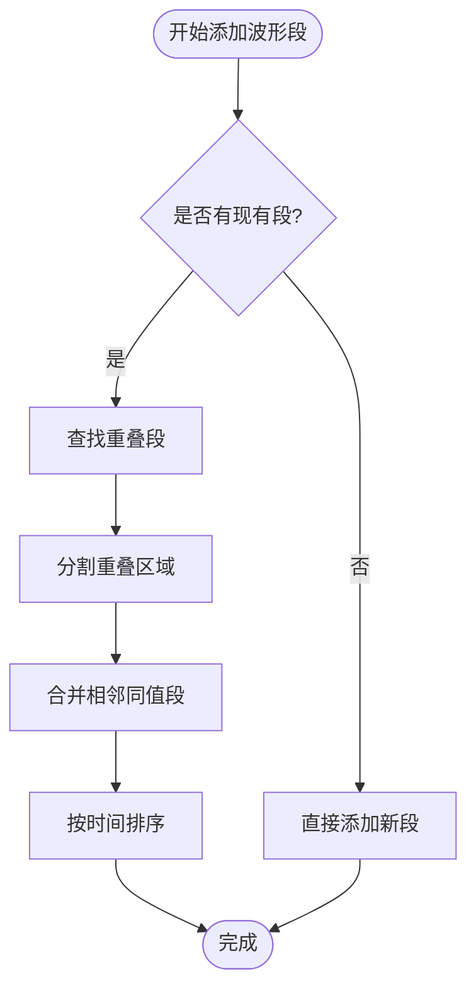
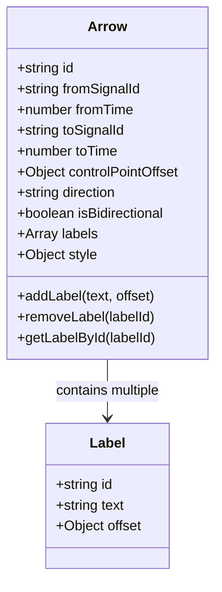
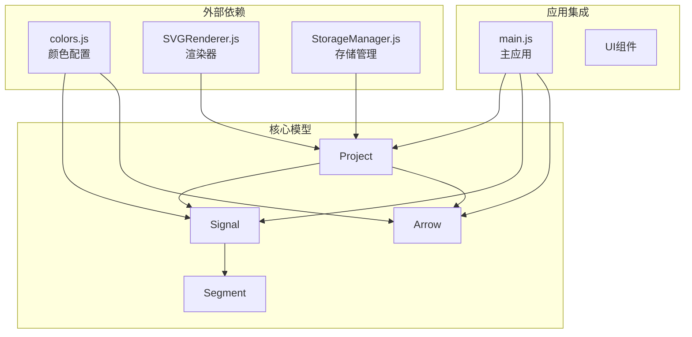
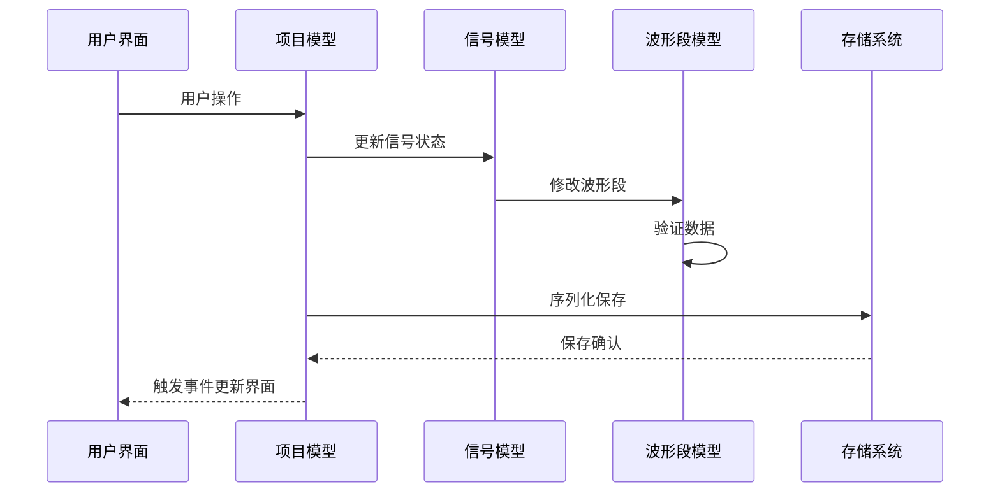

# 数据模型API

<cite>
**本文档引用的文件**
- [Project.js](file://src/models/Project.js)
- [Signal.js](file://src/models/Signal.js)
- [Arrow.js](file://src/models/Arrow.js)
- [Segment.js](file://src/models/Segment.js)
- [colors.js](file://src/config/colors.js)
- [main.js](file://src/main.js)
- [default-template.json](file://default-template.json)
- [test-runner.html](file://tests/test-runner.html)
</cite>

## 目录
1. [简介](#简介)
2. [项目结构](#项目结构)
3. [核心组件](#核心组件)
4. [架构概览](#架构概览)
5. [详细组件分析](#详细组件分析)
6. [依赖关系分析](#依赖关系分析)
7. [性能考虑](#性能考虑)
8. [故障排除指南](#故障排除指南)
9. [结论](#结论)

## 简介

波形图编辑器数据模型是整个应用程序的核心，负责表示和操作数字波形图的各种元素。该模型系统包含四个主要类：Project（项目）、Signal（信号）、Arrow（箭头）和Segment（波形段）。这些类相互协作，形成一个完整的波形图数据结构，支持复杂的波形编辑、可视化和持久化功能。

## 项目结构

数据模型位于 `src/models/` 目录下，采用模块化设计，每个模型类都是独立的JavaScript类，具有清晰的职责分离和接口定义。



**图表来源**
- [Project.js:1-245](file://src/models/Project.js#L1-L245)
- [Signal.js:1-343](file://src/models/Signal.js#L1-L343)
- [Arrow.js:1-114](file://src/models/Arrow.js#L1-L114)
- [Segment.js:1-94](file://src/models/Segment.js#L1-L94)

**章节来源**
- [Project.js:1-245](file://src/models/Project.js#L1-L245)
- [Signal.js:1-343](file://src/models/Signal.js#L1-L343)
- [Arrow.js:1-114](file://src/models/Arrow.js#L1-L114)
- [Segment.js:1-94](file://src/models/Segment.js#L1-L94)

## 核心组件

本节详细介绍四个核心数据模型类的设计和实现。

### Project 类（项目模型）

Project 类是波形图编辑器的顶层容器，管理整个波形图项目的所有元素。它负责信号集合、箭头关系、时间轴配置以及事件系统。

**主要特性：**
- 项目级别的数据管理和组织
- 信号和箭头的增删改查操作
- 时间轴转换和坐标计算
- 事件驱动的响应式更新
- 完整的序列化和反序列化支持

**关键属性：**
- `id`: 项目唯一标识符
- `name`: 项目名称，默认为"未命名项目"
- `fontFamily`: 字体设置
- `titlePosition`: 标题位置（顶部或底部）
- `titleFontSize`: 标题字体大小
- `titleBold`: 标题是否加粗
- `signals`: 信号数组
- `annotations`: 注释数组
- `arrows`: 箭头数组
- `timeAxis`: 时间轴配置对象

**章节来源**
- [Project.js:8-34](file://src/models/Project.js#L8-L34)

### Signal 类（信号模型）

Signal 类表示单个波形信号，包含信号的基本属性、波形段集合以及相关的操作方法。

**主要特性：**
- 支持多种信号类型（普通信号、时钟信号、总线信号）
- 动态波形段管理
- 时钟信号自动生成
- 信号值查询和编辑
- 分隔符管理

**关键属性：**
- `id`: 信号唯一标识符
- `name`: 信号名称
- `type`: 信号类型
- `color`: 信号颜色
- `segments`: 波形段数组
- `clockConfig`: 时钟配置（仅时钟信号）
- `gaps`: 垂直分隔符数组

**章节来源**
- [Signal.js:7-29](file://src/models/Signal.js#L7-L29)

### Arrow 类（箭头模型）

Arrow 类表示信号间的依赖关系箭头，用于可视化信号间的时序关系和数据流。

**主要特性：**
- 支持单向和双向箭头
- 多标签文本标注
- 自适应方向控制
- 样式定制（颜色、线宽、虚线模式）

**关键属性：**
- `id`: 箭头唯一标识符
- `fromSignalId`: 起始信号ID
- `fromTime`: 起始时间
- `toSignalId`: 目标信号ID
- `toTime`: 目标时间
- `controlPointOffset`: 控制点偏移量
- `direction`: 箭头方向
- `isBidirectional`: 是否双向
- `labels`: 标签数组
- `style`: 样式配置

**章节来源**
- [Arrow.js:5-45](file://src/models/Arrow.js#L5-L45)

### Segment 类（波形段模型）

Segment 类表示信号的一个连续电平段，是最基本的波形数据单元。

**主要特性：**
- 精确的时间区间定义
- 支持多种电平值（0、1、'X'、'Z'、十六进制字符串）
- 段间重叠检测和处理
- 自动合并相邻同值段
- 完整的序列化支持

**关键属性：**
- `startTime`: 开始时间
- `endTime`: 结束时间
- `value`: 电平值
- `color`: 段级别颜色（主要用于总线信号）

**章节来源**
- [Segment.js:5-19](file://src/models/Segment.js#L5-L19)

## 架构概览

波形图编辑器的数据模型采用分层架构设计，各层职责明确，耦合度低，易于维护和扩展。



**图表来源**
- [Project.js:8-245](file://src/models/Project.js#L8-L245)
- [Signal.js:7-343](file://src/models/Signal.js#L7-L343)
- [Arrow.js:5-114](file://src/models/Arrow.js#L5-L114)
- [Segment.js:5-94](file://src/models/Segment.js#L5-L94)

## 详细组件分析

### Project 类详细分析

Project 类作为顶层容器，提供了完整的项目管理功能。

#### 构造函数参数
- `options.id`: 项目唯一标识符（可选）
- `options.name`: 项目名称（可选）
- `options.timeAxis`: 时间轴配置对象（可选）

#### 核心方法

**信号管理方法：**
- `addSignal(signal)`: 添加信号到项目
- `removeSignal(signalId)`: 根据ID移除信号
- `getSignalById(signalId)`: 根据ID获取信号
- `getSignalIndex(signalId)`: 获取信号在数组中的索引
- `moveSignal(signalId, newIndex)`: 移动信号位置

**箭头管理方法：**
- `addArrow(arrow)`: 添加依赖箭头
- `removeArrow(arrowId)`: 移除依赖箭头
- `getArrowById(arrowId)`: 获取箭头对象

**时间轴操作：**
- `setTimeRange(start, end)`: 设置时间轴范围
- `setTimeScale(scale)`: 设置时间轴缩放
- `getTimeAxisWidth()`: 获取时间轴宽度
- `timeToX(time)`: 时间转X坐标
- `xToTime(x)`: X坐标转时间

**事件系统：**
- `on(event, callback)`: 注册事件监听
- `off(event, callback)`: 移除事件监听
- `emit(event, data)`: 触发事件

**序列化方法：**
- `toJSON()`: 序列化为JSON对象
- `static fromJSON(json)`: 从JSON创建项目实例

#### 使用示例

```javascript
// 创建新项目
const project = new Project({
    name: "My Waveform Project",
    timeAxis: {
        unit: "ns",
        scale: 10,
        start: 0,
        end: 100
    }
});

// 添加信号
const signal = new Signal({
    name: "clk",
    type: "clock"
});
project.addSignal(signal);

// 设置时间轴
project.setTimeRange(0, 200);
project.setTimeScale(5);
```

**章节来源**
- [Project.js:15-245](file://src/models/Project.js#L15-L245)

### Signal 类详细分析

Signal 类负责单个波形信号的完整生命周期管理。

#### 构造函数参数
- `options.id`: 信号唯一标识符（可选）
- `options.name`: 信号名称（可选）
- `options.type`: 信号类型（'signal' | 'clock' | 'bus'）

#### 核心方法

**分隔符管理：**
- `addGap(time)`: 添加垂直分隔符
- `removeGap(gapId)`: 移除分隔符

**波形段管理：**
- `addSegment(segmentData)`: 添加波形段（自动合并重叠段）
- `setValueAt(startTime, endTime, value, color)`: 设置指定时间范围的电平值
- `getValueAt(time)`: 获取指定时间点的电平值
- `getSegmentIndexAt(time)`: 获取指定时间点的段索引

**时钟信号特殊功能：**
- `generateClockSegments(endTime)`: 生成时钟波形段
- `moveEdge(segmentIndex, edge, newTime)`: 移动跳变沿位置

**克隆和序列化：**
- `clone()`: 克隆信号实例
- `toJSON()`: 序列化为JSON
- `static fromJSON(json)`: 从JSON创建信号

#### 波形段合并算法

Signal 类实现了智能的波形段合并算法，能够处理复杂的重叠情况：



**图表来源**
- [Signal.js:62-133](file://src/models/Signal.js#L62-L133)

#### 使用示例

```javascript
// 创建时钟信号
const clockSignal = new Signal({
    name: "clk",
    type: "clock"
});
clockSignal.clockConfig = {
    period: 20,
    phase: 0,
    dutyCycle: 0.5
};
clockSignal.generateClockSegments(100);

// 设置特定时间段的值
signal.setValueAt(20, 60, 1);
signal.setValueAt(60, 80, 0);

// 查询值
const value = signal.getValueAt(50); // 返回1
```

**章节来源**
- [Signal.js:14-343](file://src/models/Signal.js#L14-L343)

### Arrow 类详细分析

Arrow 类专门处理信号间的依赖关系和箭头可视化。

#### 构造函数参数
- `options.id`: 箭头唯一标识符（可选）
- `options.fromSignalId`: 起始信号ID（必需）
- `options.fromTime`: 起始时间（必需）
- `options.toSignalId`: 目标信号ID（必需）
- `options.toTime`: 目标时间（必需）
- `options.direction`: 箭头方向（'auto' | 'forward' | 'backward'）

#### 核心方法

**标签管理：**
- `addLabel(text, offset)`: 添加标签
- `removeLabel(labelId)`: 移除标签
- `getLabelById(labelId)`: 根据ID获取标签

**兼容性支持：**
- `text` getter/setter: 兼容旧格式的单标签访问
- `textOffset` getter/setter: 兼容旧格式的位置访问

**样式配置：**
- `style.stroke`: 箭头颜色
- `style.strokeWidth`: 线宽
- `style.markerSize`: 箭头大小
- `style.dashArray`: 虚线模式

#### 标签系统设计

Arrow 类支持多标签系统，每个标签都有独立的ID、文本内容和偏移量：



**图表来源**
- [Arrow.js:5-114](file://src/models/Arrow.js#L5-L114)

#### 使用示例

```javascript
// 创建依赖箭头
const arrow = new Arrow({
    fromSignalId: "sig_1",
    fromTime: 10,
    toSignalId: "sig_2", 
    toTime: 30,
    direction: "auto",
    labels: [
        {
            text: "信号传播延迟",
            offset: { x: 10, y: 5 }
        }
    ]
});

// 添加更多标签
arrow.addLabel("最大延迟", { x: 0, y: 15 });
arrow.addLabel("最小延迟", { x: 0, y: -15 });
```

**章节来源**
- [Arrow.js:6-114](file://src/models/Arrow.js#L6-L114)

### Segment 类详细分析

Segment 类是最基础的波形数据单元，提供了精确的时间区间和电平值表示。

#### 构造函数参数
- `options.startTime`: 开始时间（可选，默认0）
- `options.endTime`: 结束时间（可选，默认10）
- `options.value`: 电平值（可选，默认0）

#### 核心属性和方法

**计算属性：**
- `duration`: 获取段持续时间（只读）

**几何判断：**
- `contains(time)`: 检查时间点是否在段内
- `overlaps(other)`: 检查是否与另一个段重叠

**克隆和序列化：**
- `clone()`: 创建独立副本
- `toJSON()`: 序列化为JSON
- `static fromJSON(json)`: 从JSON创建段

#### 电平值支持

Segment 类支持多种电平值类型：
- 数字：`0`（低电平）、`1`（高电平）
- 字符：`'X'`（不定态）、`'Z'`（高阻态）
- 字符串：十六进制数据（如 `'0xFF'`）

#### 验证机制

Segment 类包含严格的数据验证：
- `startTime < endTime`：确保时间顺序正确
- 抛出异常：如果验证失败

**章节来源**
- [Segment.js:12-94](file://src/models/Segment.js#L12-L94)

## 依赖关系分析

数据模型之间的依赖关系体现了清晰的层次结构和职责分离。



**图表来源**
- [main.js:1-17](file://src/main.js#L1-L17)
- [Project.js:5-6](file://src/models/Project.js#L5-L6)
- [Signal.js:5-5](file://src/models/Signal.js#L5-L5)

### 模型间关系说明

1. **Project → Signal**: 一对多关系，项目包含多个信号
2. **Project → Arrow**: 一对多关系，项目包含多个箭头
3. **Signal → Segment**: 一对多关系，信号包含多个波形段
4. **External Dependencies**: 颜色配置和渲染器为模型提供视觉表现支持

### 数据流分析



**图表来源**
- [main.js:22-44](file://src/main.js#L22-L44)
- [Project.js:199-202](file://src/models/Project.js#L199-L202)

**章节来源**
- [main.js:1-819](file://src/main.js#L1-L819)

## 性能考虑

### 时间复杂度分析

1. **Segment 添加操作**: O(n)，其中n为现有段数量
   - 需要检查与所有现有段的重叠关系
   - 最坏情况下需要分割所有重叠段

2. **信号值查询**: O(n)，其中n为信号段数量
   - 需要遍历段列表找到包含目标时间的段

3. **波形段合并**: O(n log n)
   - 排序操作O(n log n)
   - 合并过程O(n)

### 内存优化策略

1. **延迟初始化**: 时钟信号的波形段在需要时才生成
2. **对象池**: 复用标签对象减少内存分配
3. **增量更新**: 事件系统只通知必要的变更

### 序列化性能

- JSON序列化采用深度遍历，时间复杂度O(N)，N为所有模型实例总数
- 反序列化过程中避免重复验证，提高加载速度

## 故障排除指南

### 常见问题和解决方案

**问题1：Segment 验证错误**
- 症状：创建Segment时抛出"startTime必须小于endTime"错误
- 解决方案：确保开始时间小于结束时间

**问题2：信号移动无效**
- 症状：调用moveSignal后信号位置不变
- 解决方案：确认信号ID存在且索引有效

**问题3：箭头标签丢失**
- 症状：从JSON恢复后箭头标签消失
- 解决方案：检查JSON格式中labels字段的完整性

**问题4：时钟信号不显示**
- 症状：时钟信号没有生成波形段
- 解决方案：确认clockConfig配置正确且调用了generateClockSegments

### 调试技巧

1. **使用浏览器开发者工具**：监控事件触发和数据变化
2. **检查JSON序列化结果**：验证数据结构完整性
3. **逐步执行测试用例**：定位具体问题发生点

**章节来源**
- [Segment.js:24-28](file://src/models/Segment.js#L24-L28)
- [test-runner.html:103-113](file://tests/test-runner.html#L103-L113)

## 结论

波形图编辑器的数据模型系统展现了优秀的软件工程实践，具有以下特点：

1. **清晰的层次结构**：从底层的Segment到顶层的Project，职责明确，耦合度低
2. **完善的序列化支持**：所有模型都支持toJSON()和fromJSON()方法，便于数据持久化
3. **强大的事件系统**：基于观察者模式的响应式更新机制
4. **灵活的扩展性**：模块化设计便于添加新功能和修改现有行为
5. **严格的验证机制**：确保数据完整性和一致性

该数据模型系统为波形图编辑器提供了坚实的基础，支持复杂的波形编辑、可视化和持久化需求，是整个应用程序的核心支柱。