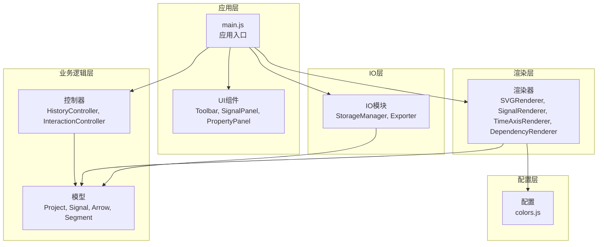
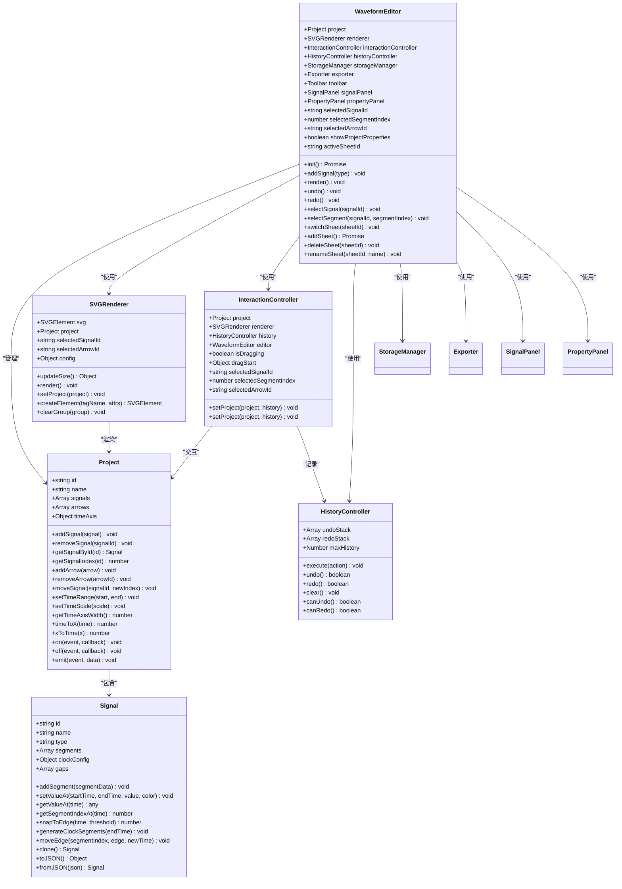
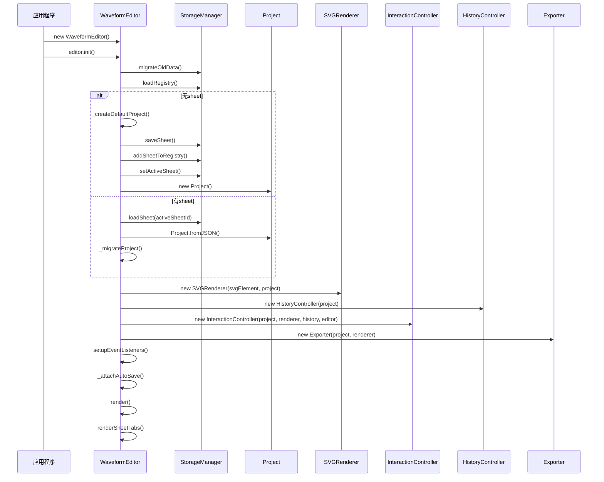
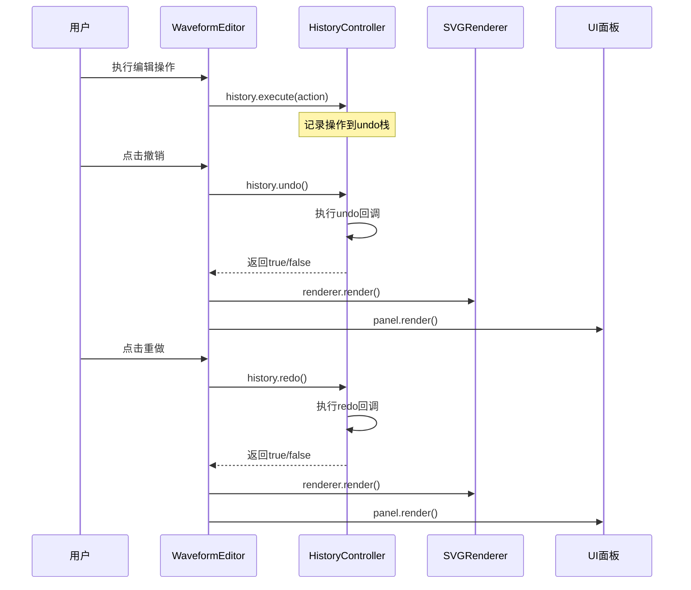
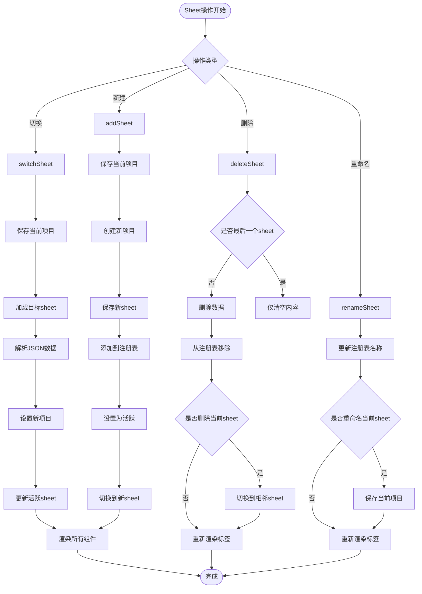
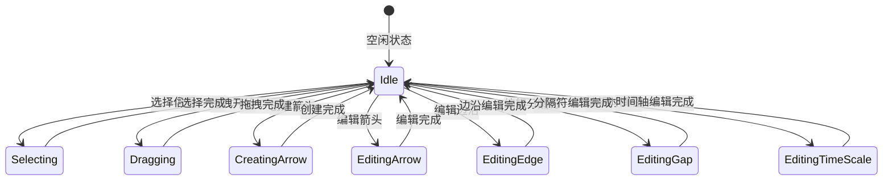
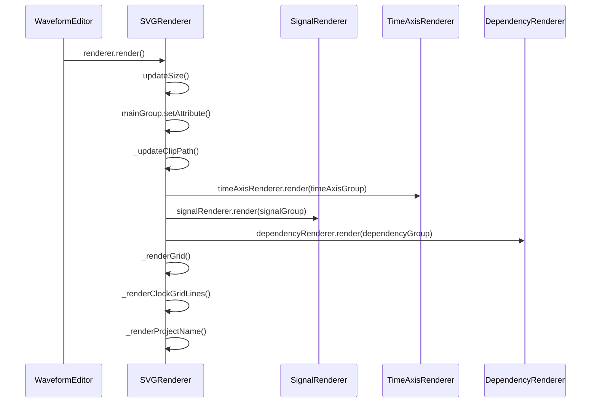
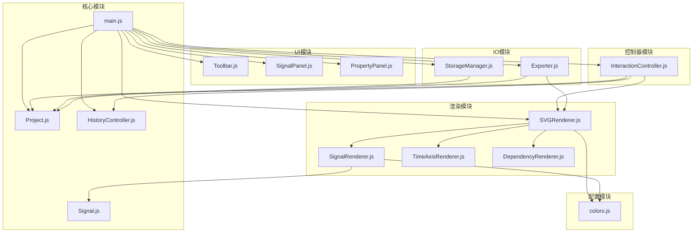
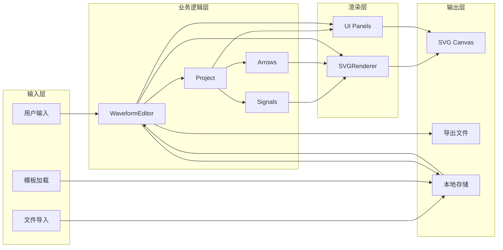

# 核心API接口

<cite>
**本文档引用的文件**
- [main.js](file://src/main.js)
- [Signal.js](file://src/models/Signal.js)
- [Project.js](file://src/models/Project.js)
- [HistoryController.js](file://src/controllers/HistoryController.js)
- [SVGRenderer.js](file://src/renderers/SVGRenderer.js)
- [InteractionController.js](file://src/controllers/InteractionController.js)
- [SignalPanel.js](file://src/ui/SignalPanel.js)
- [PropertyPanel.js](file://src/ui/PropertyPanel.js)
- [StorageManager.js](file://src/io/StorageManager.js)
- [Exporter.js](file://src/io/Exporter.js)
- [Toolbar.js](file://src/ui/Toolbar.js)
</cite>

## 目录
1. [简介](#简介)
2. [项目结构](#项目结构)
3. [核心组件](#核心组件)
4. [架构概览](#架构概览)
5. [详细组件分析](#详细组件分析)
6. [依赖关系分析](#依赖关系分析)
7. [性能考虑](#性能考虑)
8. [故障排除指南](#故障排除指南)
9. [结论](#结论)

## 简介

WaveformEditor 是一个基于 Web 技术的波形图编辑器，采用模块化架构设计。该编辑器提供了完整的波形图创建、编辑、渲染和导出功能，支持多信号类型、依赖箭头、时间轴操作和丰富的用户界面交互。

本项目的核心是 WaveformEditor 主类，它作为整个应用的控制中心，协调各个子系统的协作工作。编辑器支持多种信号类型（普通信号、时钟信号、总线信号），提供撤销/重做机制，支持多 sheet 管理，并具备强大的导出功能。

## 项目结构

项目采用模块化组织方式，主要分为以下层次：



**图表来源**
- [main.js:1-819](file://src/main.js#L1-L819)
- [Project.js:1-245](file://src/models/Project.js#L1-L245)
- [SVGRenderer.js:1-547](file://src/renderers/SVGRenderer.js#L1-L547)

**章节来源**
- [main.js:1-819](file://src/main.js#L1-L819)

## 核心组件

### WaveformEditor 主类

WaveformEditor 是整个应用的核心控制器类，负责协调各个子系统的初始化和运行。

#### 构造函数
```javascript
constructor()
```
- **功能**: 初始化编辑器实例，设置默认状态和依赖注入
- **属性初始化**:
  - `project`: 当前项目对象
  - `renderer`: SVG 渲染器实例
  - `interactionController`: 交互控制器
  - `historyController`: 历史记录控制器
  - `storageManager`: 存储管理器
  - `exporter`: 导出器
  - `selectedSignalId`: 当前选中信号ID
  - `selectedSegmentIndex`: 当前选中段索引
  - `selectedArrowId`: 当前选中箭头ID
  - `showProjectProperties`: 是否显示项目属性面板
  - `activeSheetId`: 当前活动sheet ID

#### 初始化方法
```javascript
async init()
```
- **功能**: 异步初始化编辑器
- **主要步骤**:
  1. 数据迁移和注册表加载
  2. 项目加载和默认项目创建
  3. 渲染器初始化
  4. 控制器和UI组件初始化
  5. 事件监听器设置
  6. 自动保存注册
  7. 初始渲染和sheet标签渲染

#### 核心API方法

##### 添加信号
```javascript
addSignal(type = 'signal')
```
- **参数**: `type` - 信号类型 ('signal' | 'clock' | 'bus')
- **返回值**: 无
- **功能**: 添加新信号到项目中，支持智能插入位置

##### 渲染方法
```javascript
render()
```
- **功能**: 执行完整渲染流程，包括波形图、信号面板和属性面板
- **返回值**: 无

##### 撤销方法
```javascript
undo()
```
- **功能**: 执行撤销操作
- **返回值**: 无

##### 重做方法
```javascript
redo()
```
- **功能**: 执行重做操作
- **返回值**: 无

##### 选择信号
```javascript
selectSignal(signalId)
```
- **参数**: `signalId` - 信号ID
- **返回值**: 无
- **功能**: 选中指定信号并更新UI

##### 选择段
```javascript
selectSegment(signalId, segmentIndex)
```
- **参数**: `signalId` - 信号ID, `segmentIndex` - 段索引
- **返回值**: 无
- **功能**: 选中指定信号的特定段

#### Sheet管理方法

##### 切换Sheet
```javascript
switchSheet(sheetId)
```
- **参数**: `sheetId` - 目标sheet ID
- **返回值**: 无

##### 添加Sheet
```javascript
async addSheet()
```
- **功能**: 创建新sheet并切换到新sheet
- **返回值**: 无

##### 删除Sheet
```javascript
deleteSheet(sheetId)
```
- **参数**: `sheetId` - 要删除的sheet ID
- **返回值**: 无

##### 重命名Sheet
```javascript
renameSheet(sheetId, name)
```
- **参数**: `sheetId` - sheet ID, `name` - 新名称
- **返回值**: 无

#### 属性说明

- **selectedSignalId**: 当前选中信号的ID，用于UI状态同步
- **selectedSegmentIndex**: 当前选中段的索引
- **selectedArrowId**: 当前选中箭头的ID
- **showProjectProperties**: 控制项目属性面板显示状态
- **activeSheetId**: 当前活动sheet的ID

**章节来源**
- [main.js:21-806](file://src/main.js#L21-L806)

## 架构概览

WaveformEditor 采用了典型的 MVC 架构模式，结合了观察者模式和命令模式：



**图表来源**
- [main.js:21-806](file://src/main.js#L21-L806)
- [Project.js:8-245](file://src/models/Project.js#L8-L245)
- [Signal.js:7-343](file://src/models/Signal.js#L7-L343)
- [HistoryController.js:5-56](file://src/controllers/HistoryController.js#L5-L56)
- [SVGRenderer.js:10-547](file://src/renderers/SVGRenderer.js#L10-L547)
- [InteractionController.js:6-1420](file://src/controllers/InteractionController.js#L6-L1420)

## 详细组件分析

### WaveformEditor 类详细分析

#### 初始化流程



**图表来源**
- [main.js:49-132](file://src/main.js#L49-L132)
- [main.js:138-210](file://src/main.js#L138-L210)

#### 添加信号流程

```mermaid
flowchart TD
Start([调用 addSignal]) --> CheckType{检查信号类型}
CheckType --> |clock| CreateClock[创建时钟信号]
CheckType --> |其他| CreateSignal[创建普通信号]
CreateClock --> SetConfig[设置时钟配置]
SetConfig --> GenSegments[生成时钟段]
CreateSignal --> SetSegments[设置初始段]
GenSegments --> InsertPos{检查选中信号}
SetSegments --> InsertPos
InsertPos --> |有选中| InsertAfter[插入到选中信号之后]
InsertPos --> |无选中| AppendEnd[添加到末尾]
InsertAfter --> EmitChange[发出change事件]
AppendEnd --> EmitChange
EmitChange --> Render[调用render()]
Render --> End([完成])
```

**图表来源**
- [main.js:634-668](file://src/main.js#L634-L668)

#### 撤销/重做机制



**图表来源**
- [main.js:747-758](file://src/main.js#L747-L758)
- [HistoryController.js:13-42](file://src/controllers/HistoryController.js#L13-L42)

#### Sheet管理流程



**图表来源**
- [main.js:246-346](file://src/main.js#L246-L346)

**章节来源**
- [main.js:49-806](file://src/main.js#L49-L806)

### 交互控制器详细分析

InteractionController 负责处理用户的所有交互操作：

#### 交互类型



#### 事件处理流程

```mermaid
flowchart TD
MouseDown[鼠标按下] --> CheckTarget{检查目标元素}
CheckTarget --> |时间轴手柄| TimeScaleDrag[时间轴拖拽]
CheckTarget --> |箭头端点| ArrowEndpointDrag[箭头端点拖拽]
CheckTarget --> |箭头文字| ArrowTextDrag[箭头文字拖拽]
CheckTarget --> |箭头主体| SelectArrow[选择箭头]
CheckTarget --> |信号边沿| EdgeDrag[边沿拖拽]
CheckTarget --> |分隔符| GapDrag[分隔符拖拽]
CheckTarget --> |信号行| SignalSelect[信号选择]
CheckTarget --> |空白区域| ClearSelection[清除选择]
MouseMove[鼠标移动] --> ProcessDrag{处理拖拽状态}
ProcessDrag --> |时间轴拖拽| ApplyTimeScale[应用时间轴缩放]
ProcessDrag --> |箭头端点拖拽| UpdateEndpointPreview[更新端点预览]
ProcessDrag --> |箭头文字拖拽| UpdateTextDrag[更新文字位置]
ProcessDrag --> |边沿拖拽| UpdateEdgeDrag[更新边沿位置]
ProcessDrag --> |分隔符拖拽| UpdateGapDrag[更新分隔符位置]
ProcessDrag --> |普通拖拽| UpdateSelectionRect[更新选择框]
MouseUp[鼠标抬起] --> CompleteDrag{完成拖拽}
CompleteDrag --> |时间轴拖拽| StopTimeScaleDrag[停止时间轴拖拽]
CompleteDrag --> |箭头端点拖拽| CompleteArrowEndpointDrag[完成箭头端点拖拽]
CompleteDrag --> |箭头文字拖拽| CompleteArrowTextDrag[完成箭头文字拖拽]
CompleteDrag --> |边沿拖拽| CompleteEdgeDrag[完成边沿拖拽]
CompleteDrag --> |分隔符拖拽| CompleteGapDrag[完成分隔符拖拽]
CompleteDrag --> |普通拖拽| CompleteSelection[完成选择]
```



**图表来源**
- [InteractionController.js:84-337](file://src/controllers/InteractionController.js#L84-L337)
- [InteractionController.js:1187-1286](file://src/controllers/InteractionController.js#L1187-L1286)

**章节来源**
- [InteractionController.js:6-1420](file://src/controllers/InteractionController.js#L6-L1420)

### 渲染器详细分析

SVGRenderer 是波形图的主要渲染组件，负责将项目数据转换为可视化的SVG图形。

#### 渲染流程



#### 渲染配置

SVGRenderer 提供了灵活的配置系统：

- **边距配置**: leftMargin(200), topMargin(30), rightMargin(40), bottomMargin(60)
- **信号配置**: signalHeight(50), signalGap(10)
- **波形配置**: waveformTopOffset(10), waveformHeight(30)
- **字体配置**: fontFamily, titleFontSize, titleBold

**章节来源**
- [SVGRenderer.js:10-547](file://src/renderers/SVGRenderer.js#L10-L547)

## 依赖关系分析

### 模块依赖图



**图表来源**
- [main.js:4-16](file://src/main.js#L4-L16)
- [SVGRenderer.js:5-8](file://src/renderers/SVGRenderer.js#L5-L8)

### 数据流分析



**图表来源**
- [main.js:49-132](file://src/main.js#L49-L132)
- [StorageManager.js:108-130](file://src/io/StorageManager.js#L108-L130)

**章节来源**
- [main.js:1-819](file://src/main.js#L1-L819)
- [StorageManager.js:1-368](file://src/io/StorageManager.js#L1-L368)

## 性能考虑

### 渲染优化策略

1. **增量渲染**: WaveformEditor 实现了选择性渲染，只更新必要的组件
2. **虚拟DOM**: 使用SVG元素的批量操作减少DOM重排
3. **事件节流**: 窗口大小变化和拖拽操作使用定时器节流
4. **内存管理**: 及时清理临时元素和事件监听器

### 存储优化

1. **增量保存**: 自动保存只在项目发生变化时触发
2. **数据压缩**: JSON序列化时去除不必要的字段
3. **缓存策略**: 模板和配置数据使用localStorage缓存

### 交互响应性

1. **异步操作**: 大文件导入和导出使用异步处理
2. **进度反馈**: 长时间操作显示进度指示器
3. **错误处理**: 完善的异常捕获和用户提示

## 故障排除指南

### 常见问题及解决方案

#### 初始化失败
- **症状**: 编辑器启动时报错
- **原因**: SVG元素缺失或localStorage权限问题
- **解决**: 确保HTML中存在`#waveformSvg`元素，检查浏览器安全设置

#### 数据加载失败
- **症状**: 项目无法加载或显示空白
- **原因**: localStorage损坏或文件格式错误
- **解决**: 使用`StorageManager.migrateOldData()`进行数据迁移

#### 渲染异常
- **症状**: 波形图显示不完整或布局错误
- **原因**: 容器尺寸变化或CSS样式冲突
- **解决**: 调用`editor.render()`重新渲染，检查CSS样式

#### 性能问题
- **症状**: 操作卡顿或响应缓慢
- **原因**: 信号数量过多或复杂度高
- **解决**: 减少同时显示的信号数量，优化信号复杂度

**章节来源**
- [main.js:809-819](file://src/main.js#L809-L819)
- [StorageManager.js:138-164](file://src/io/StorageManager.js#L138-L164)

## 结论

WaveformEditor 是一个功能完整、架构清晰的波形图编辑器。其核心优势包括：

1. **模块化设计**: 清晰的分层架构便于维护和扩展
2. **完整的功能集**: 支持多种信号类型、依赖箭头、时间轴操作
3. **良好的用户体验**: 直观的交互设计和丰富的视觉反馈
4. **强大的数据管理**: 支持多sheet管理、模板系统和多种导出格式
5. **可扩展性**: 基于模块化的设计便于添加新功能

该编辑器适合用于数字电路设计、系统调试和教学演示等多种场景。其开放的架构为后续的功能扩展和定制化开发提供了良好的基础。