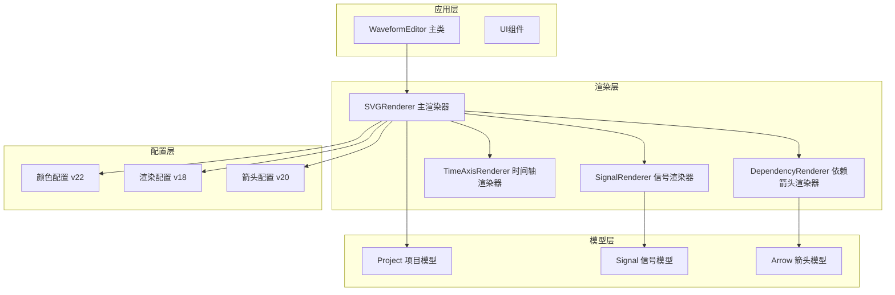
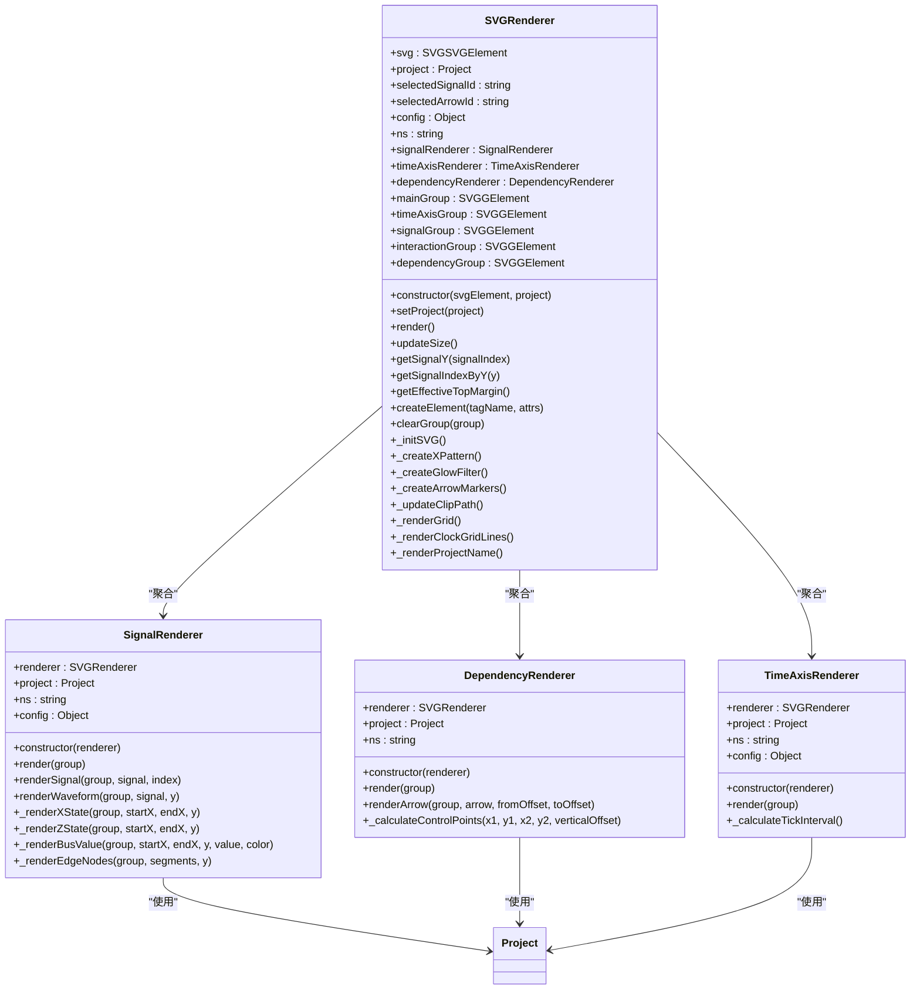
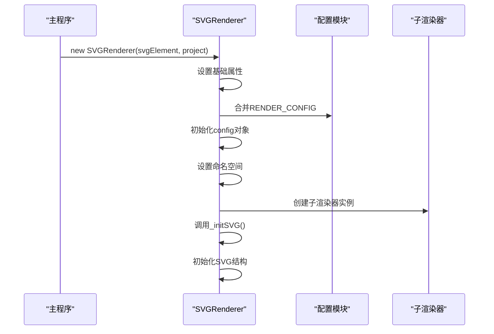
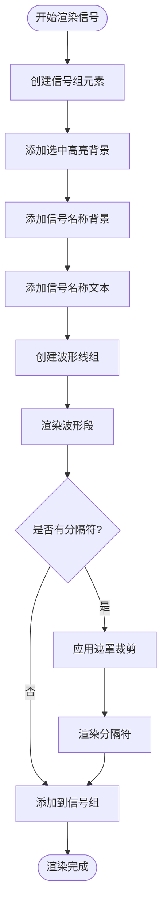
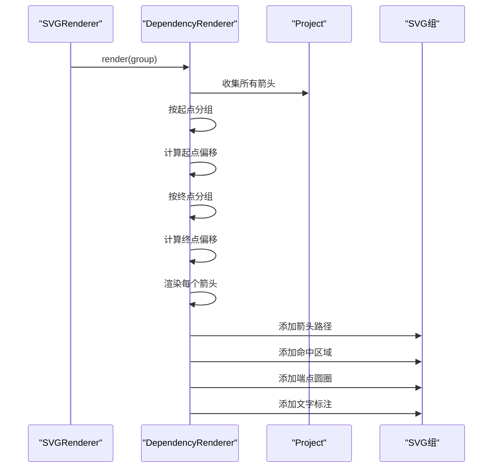
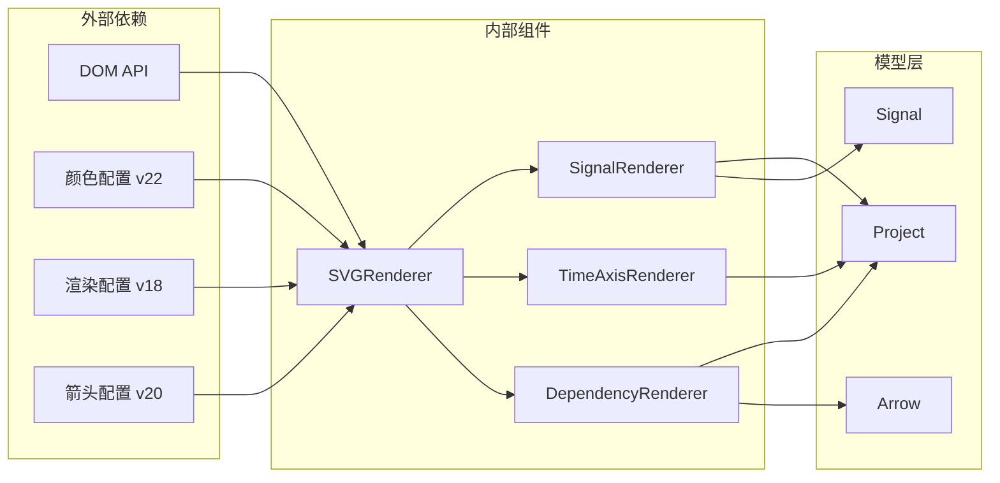

# SVG渲染器API

<cite>
**本文档引用的文件**
- [SVGRenderer.js](file://src/renderers/SVGRenderer.js)
- [SignalRenderer.js](file://src/renderers/SignalRenderer.js)
- [DependencyRenderer.js](file://src/renderers/DependencyRenderer.js)
- [TimeAxisRenderer.js](file://src/renderers/TimeAxisRenderer.js)
- [colors.js](file://src/config/colors.js)
- [Project.js](file://src/models/Project.js)
- [Signal.js](file://src/models/Signal.js)
- [Arrow.js](file://src/models/Arrow.js)
- [main.js](file://src/main.js)
- [index.html](file://index.html)
</cite>

## 更新摘要
**变更内容**
- 更新版本号信息以反映依赖箭头渲染改进
- 增强缓存行为说明，确保正确的渲染性能
- 优化依赖箭头渲染器的配置参数
- 完善SVG元素创建和命名空间处理细节

## 目录
1. [简介](#简介)
2. [项目结构](#项目结构)
3. [核心组件](#核心组件)
4. [架构概览](#架构概览)
5. [详细组件分析](#详细组件分析)
6. [依赖关系分析](#依赖关系分析)
7. [性能考虑](#性能考虑)
8. [故障排除指南](#故障排除指南)
9. [结论](#结论)
10. [附录](#附录)

## 简介
SVGRenderer是波形图编辑器的核心渲染器，负责管理SVG画布并协调各个子渲染器的工作。它提供了完整的波形图渲染功能，包括信号波形、时间轴、依赖箭头等元素的绘制，并实现了坐标转换、尺寸计算、事件处理等核心API。

**更新** 版本号同步更新以反映依赖箭头渲染改进，确保正确的缓存行为

## 项目结构
波形图编辑器采用模块化的架构设计，主要分为以下几个层次：



**图表来源**
- [SVGRenderer.js:5-8](file://src/renderers/SVGRenderer.js#L5-L8)
- [main.js:4-17](file://src/main.js#L4-L17)

**章节来源**
- [SVGRenderer.js:1-563](file://src/renderers/SVGRenderer.js#L1-L563)
- [main.js:1-1044](file://src/main.js#L1-L1044)

## 核心组件
SVGRenderer作为主渲染器，承担着以下核心职责：

### 构造函数参数
- **svgElement**: SVGSVGElement - SVG DOM元素实例
- **project**: Project - 项目数据对象，包含信号、箭头、时间轴等信息

### 初始化方法
- **setProject(project)**: 切换项目实例，用于多sheet场景
- **_initSVG()**: 初始化SVG结构，创建defs、主容器、各渲染组等

### 主渲染流程
- **render()**: 主渲染方法，协调各子渲染器执行渲染
- **updateSize()**: 计算并更新SVG尺寸，支持响应式布局

### 坐标转换方法
- **getSignalY(signalIndex)**: 获取信号的Y坐标
- **getSignalIndexByY(y)**: 根据Y坐标获取信号索引
- **getEffectiveTopMargin()**: 获取有效的上边距（考虑标题位置）

**章节来源**
- [SVGRenderer.js:15-40](file://src/renderers/SVGRenderer.js#L15-L40)
- [SVGRenderer.js:284-314](file://src/renderers/SVGRenderer.js#L284-L314)
- [SVGRenderer.js:194-243](file://src/renderers/SVGRenderer.js#L194-L243)
- [SVGRenderer.js:258-279](file://src/renderers/SVGRenderer.js#L258-L279)

## 架构概览
SVGRenderer采用组合模式，通过聚合多个专门的渲染器来完成复杂的渲染任务：



**图表来源**
- [SVGRenderer.js:10-40](file://src/renderers/SVGRenderer.js#L10-L40)
- [SignalRenderer.js:6-16](file://src/renderers/SignalRenderer.js#L6-L16)
- [TimeAxisRenderer.js:6-15](file://src/renderers/TimeAxisRenderer.js#L6-L15)
- [DependencyRenderer.js:7-12](file://src/renderers/DependencyRenderer.js#L7-L12)

## 详细组件分析

### SVGRenderer 主渲染器

#### 构造函数详解
SVGRenderer的构造函数负责初始化渲染器的核心组件：



**图表来源**
- [SVGRenderer.js:15-40](file://src/renderers/SVGRenderer.js#L15-L40)
- [SVGRenderer.js:59-100](file://src/renderers/SVGRenderer.js#L59-L100)

#### SVG元素创建与管理
SVGRenderer负责创建和管理所有SVG元素，包括：

- **defs区域**: 存储pattern、filter、marker等可复用元素
- **主容器组**: 包含所有渲染内容的根容器
- **专用渲染组**: 
  - timeAxisGroup: 时间轴渲染
  - signalGroup: 信号波形渲染  
  - interactionGroup: 交互层
  - dependencyGroup: 依赖箭头渲染

#### 命名空间处理
SVGRenderer使用标准的SVG命名空间：
- **命名空间**: `http://www.w3.org/2000/svg`
- **统一创建**: 所有SVG元素通过`createElementNS()`创建
- **一致性保证**: 确保与DOM API的兼容性

#### 配置参数设置
渲染器配置包含多个关键参数：

| 参数名 | 类型 | 默认值 | 说明 |
|--------|------|--------|------|
| leftMargin | number | 200 | 左边距（信号名称区域） |
| topMargin | number | 30 | 上边距（时间轴） |
| rightMargin | number | 40 | 右边距（含拖拽手柄） |
| bottomMargin | number | 60 | 下边距（含项目名称区域） |
| signalHeight | number | 40 | 信号行高度 |
| signalGap | number | 10 | 信号间距 |
| waveformHeight | number | 30 | 波形高度 |
| waveformTopOffset | number | 5 | 波形顶部偏移 |

**章节来源**
- [SVGRenderer.js:21-28](file://src/renderers/SVGRenderer.js#L21-L28)
- [SVGRenderer.js:33-36](file://src/renderers/SVGRenderer.js#L33-L36)
- [SVGRenderer.js:59-100](file://src/renderers/SVGRenderer.js#L59-L100)

### SignalRenderer 信号渲染器

#### 信号渲染流程
SignalRenderer负责渲染单个信号的所有波形元素：



**图表来源**
- [SignalRenderer.js:39-144](file://src/renderers/SignalRenderer.js#L39-L144)

#### 波形渲染算法
SignalRenderer实现了多种波形渲染策略：

- **普通信号**: 使用水平线段表示高低电平
- **总线信号**: 使用菱形区域填充，支持X态斜线
- **跳变沿处理**: 垂直线段连接相邻不同电平
- **特殊态处理**: X态斜线填充，Z态中间线标识

**章节来源**
- [SignalRenderer.js:201-316](file://src/renderers/SignalRenderer.js#L201-L316)
- [SignalRenderer.js:372-474](file://src/renderers/SignalRenderer.js#L372-L474)

### DependencyRenderer 依赖箭头渲染器

#### 箭头渲染策略
DependencyRenderer专注于渲染信号间的依赖关系：



**图表来源**
- [DependencyRenderer.js:18-84](file://src/renderers/DependencyRenderer.js#L18-L84)
- [DependencyRenderer.js:93-265](file://src/renderers/DependencyRenderer.js#L93-L265)

#### 控制点计算
依赖箭头使用贝塞尔曲线实现平滑的S形连接：

- **水平展开**: 控制点距离与水平距离成比例
- **垂直偏移**: 同起点/终点的多箭头防重叠
- **方向控制**: 根据箭头方向确定控制点位置

**更新** 依赖箭头渲染改进包括增强的缓存行为和更精确的控制点计算

**章节来源**
- [DependencyRenderer.js:267-289](file://src/renderers/DependencyRenderer.js#L267-L289)

### TimeAxisRenderer 时间轴渲染器

#### 时间轴渲染逻辑
TimeAxisRenderer负责渲染顶部时间轴：

- **刻度计算**: 自动计算合适的刻度间隔
- **标签生成**: 根据刻度生成时间标签
- **拖拽手柄**: 提供时间轴扩展的交互功能

**章节来源**
- [TimeAxisRenderer.js:21-108](file://src/renderers/TimeAxisRenderer.js#L21-L108)
- [TimeAxisRenderer.js:114-131](file://src/renderers/TimeAxisRenderer.js#L114-L131)

## 依赖关系分析

### 组件耦合度
SVGRenderer与各子渲染器采用松耦合设计：



**图表来源**
- [SVGRenderer.js:5-8](file://src/renderers/SVGRenderer.js#L5-L8)
- [SignalRenderer.js:4](file://src/renderers/SignalRenderer.js#L4)
- [DependencyRenderer.js:5](file://src/renderers/DependencyRenderer.js#L5)

### 事件处理机制
SVGRenderer通过事件系统实现组件间通信：

- **项目变更事件**: 通过Project的事件系统通知渲染器
- **用户交互事件**: 通过InteractionController处理
- **窗口大小变化**: 自动触发重新渲染

**章节来源**
- [Project.js:177-202](file://src/models/Project.js#L177-L202)
- [main.js:588-595](file://src/main.js#L588-L595)

## 性能考虑

### 渲染优化策略
SVGRenderer采用了多项性能优化措施：

1. **元素复用**: 使用defs区域存储可复用的pattern、filter、marker
2. **分组渲染**: 将相关元素组织在独立的g元素组中
3. **条件渲染**: 根据信号类型选择最优渲染路径
4. **裁剪优化**: 使用clipPath限制绘制区域

### 内存管理
- **元素清理**: 每次渲染前清理上一次的元素
- **缓存策略**: 对频繁使用的计算结果进行缓存
- **垃圾回收**: 及时移除不再使用的DOM元素

### 响应式设计
- **自适应尺寸**: 根据容器大小自动调整SVG尺寸
- **动态扩展**: 时间轴可根据内容自动扩展
- **实时更新**: 窗口大小变化时延迟重绘

**更新** 版本号同步确保依赖箭头渲染的缓存行为正确，提升渲染性能

## 故障排除指南

### 常见问题及解决方案

#### SVG元素创建失败
**症状**: 渲染器无法创建SVG元素
**原因**: 命名空间或DOM API问题
**解决**: 检查SVG元素的命名空间设置和DOM可用性

#### 坐标转换异常
**症状**: 信号位置或箭头位置不正确
**原因**: 时间轴配置或坐标计算错误
**解决**: 验证Project的timeAxis配置和坐标转换函数

#### 性能问题
**症状**: 大量信号渲染缓慢
**解决**: 
- 减少不必要的重绘
- 使用虚拟滚动技术
- 优化SVG元素数量

**章节来源**
- [SVGRenderer.js:530-536](file://src/renderers/SVGRenderer.js#L530-L536)
- [Project.js:159-170](file://src/models/Project.js#L159-L170)

## 结论
SVGRenderer作为波形图编辑器的核心组件，展现了优秀的架构设计和实现质量。其模块化的设计使得各个渲染器职责明确，易于维护和扩展。通过合理的配置管理和性能优化策略，SVGRenderer能够高效地处理复杂的波形图渲染需求。

**更新** 最新的版本号同步确保了依赖箭头渲染的改进得到正确实现，缓存行为更加稳定可靠。

## 附录

### API参考

#### SVGRenderer核心API

| 方法 | 参数 | 返回值 | 描述 |
|------|------|--------|------|
| constructor | svgElement: SVGSVGElement, project: Project | void | 构造函数 |
| setProject | project: Project | void | 切换项目 |
| render |  | void | 主渲染方法 |
| updateSize |  | Object | 更新尺寸并返回(width, height) |
| getSignalY | signalIndex: number | number | 获取信号Y坐标 |
| getSignalIndexByY | y: number | number | 根据Y坐标获取信号索引 |
| getEffectiveTopMargin |  | number | 获取有效上边距 |
| createElement | tagName: string, attrs: Object | SVGElement | 创建SVG元素 |
| clearGroup | group: SVGGElement | void | 清空组内元素 |

#### 使用示例

**基本初始化**
```javascript
// 在HTML中创建SVG元素
const svgElement = document.getElementById('waveformSvg');
const project = new Project();

// 创建渲染器实例
const renderer = new SVGRenderer(svgElement, project);

// 执行首次渲染
renderer.render();
```

**动态尺寸调整**
```javascript
// 监听窗口大小变化
window.addEventListener('resize', () => {
    renderer.updateSize();
    renderer.render();
});
```

**项目切换**
```javascript
// 切换到另一个项目
const newProject = loadProjectData();
renderer.setProject(newProject);
renderer.render();
```

**坐标转换使用**
```javascript
// 将信号索引转换为Y坐标
const signalY = renderer.getSignalY(signalIndex);

// 将Y坐标转换为信号索引
const signalIndex = renderer.getSignalIndexByY(mouseY);
```

**章节来源**
- [SVGRenderer.js:15-40](file://src/renderers/SVGRenderer.js#L15-L40)
- [SVGRenderer.js:284-314](file://src/renderers/SVGRenderer.js#L284-L314)
- [SVGRenderer.js:194-243](file://src/renderers/SVGRenderer.js#L194-L243)
- [SVGRenderer.js:258-279](file://src/renderers/SVGRenderer.js#L258-L279)
- [index.html:63-65](file://index.html#L63-L65)