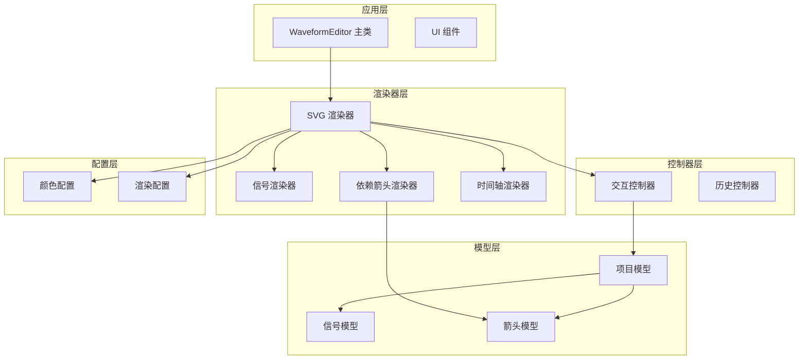
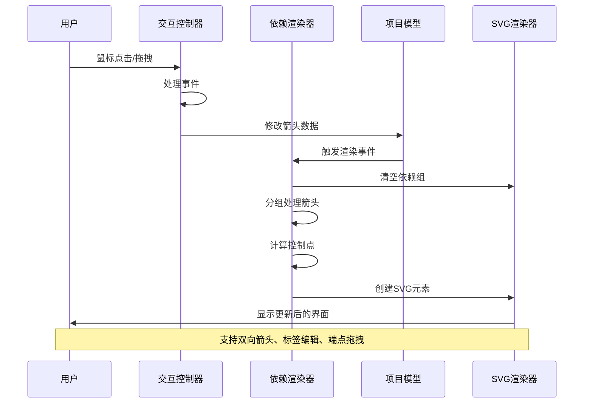
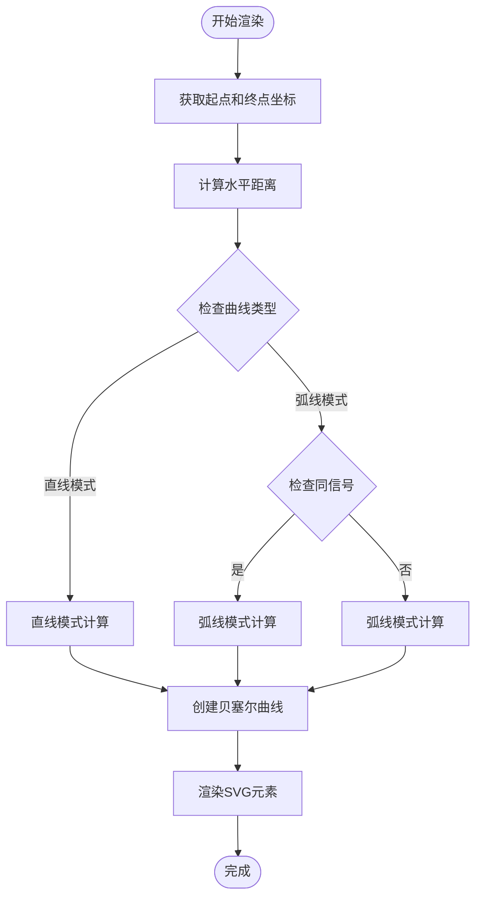
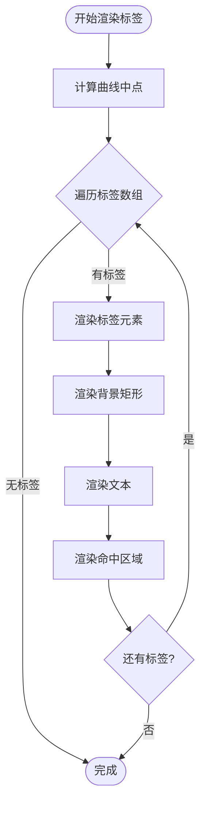
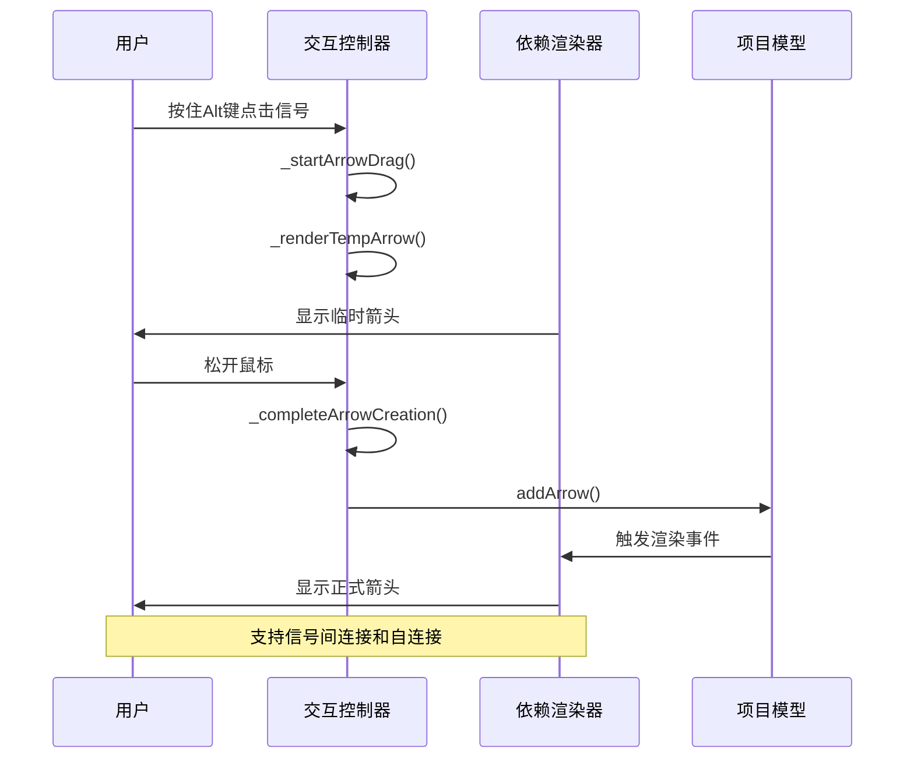
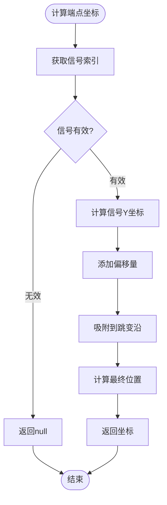
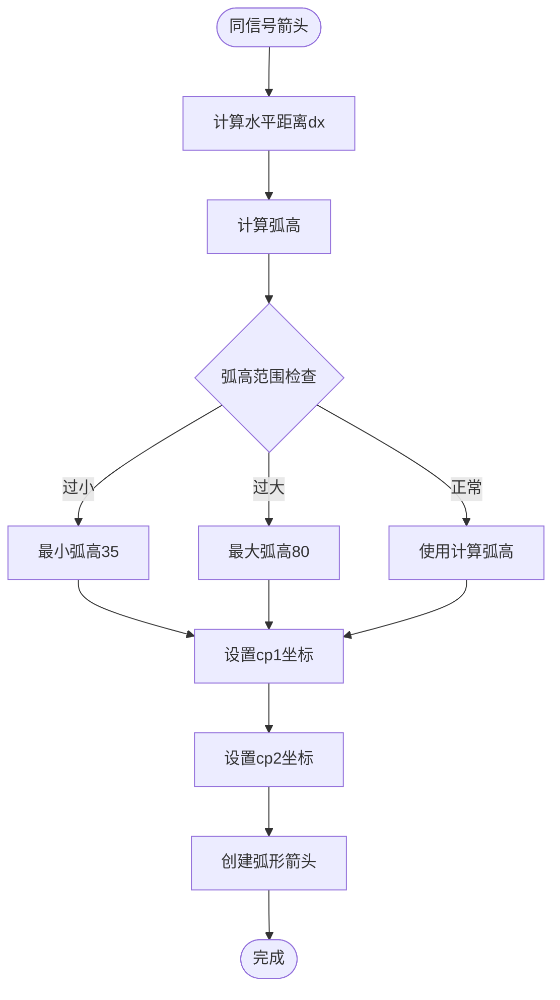
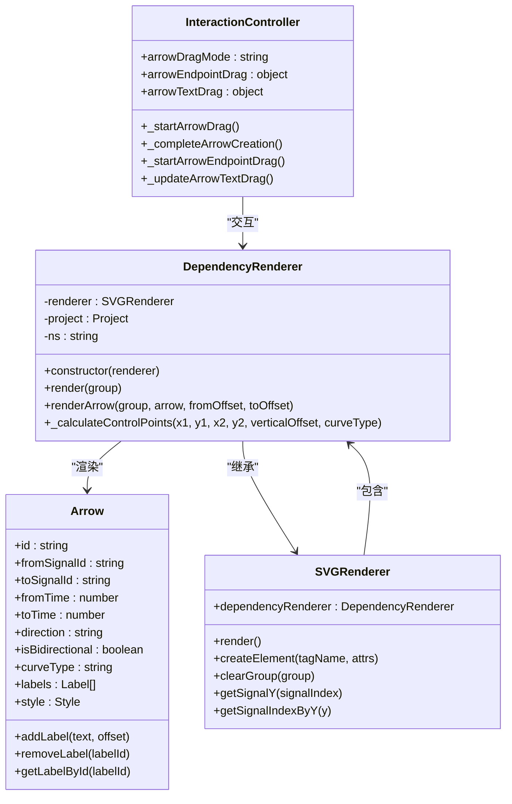

# 依赖渲染器API

<cite>
**本文档引用的文件**
- [DependencyRenderer.js](file://src/renderers/DependencyRenderer.js)
- [Arrow.js](file://src/models/Arrow.js)
- [InteractionController.js](file://src/controllers/InteractionController.js)
- [SVGRenderer.js](file://src/renderers/SVGRenderer.js)
- [colors.js](file://src/config/colors.js)
- [Project.js](file://src/models/Project.js)
- [main.js](file://src/main.js)
- [PropertyPanel.js](file://src/ui/PropertyPanel.js)
</cite>

## 更新摘要
**变更内容**
- 新增同信号弧形箭头渲染算法章节
- 更新控制点计算算法说明，包含直线和弧线两种模式
- 增强曲线类型配置系统的文档说明
- 补充同信号自连接箭头的特殊处理逻辑

## 目录
1. [简介](#简介)
2. [项目结构](#项目结构)
3. [核心组件](#核心组件)
4. [架构概览](#架构概览)
5. [详细组件分析](#详细组件分析)
6. [依赖关系分析](#依赖关系分析)
7. [性能考虑](#性能考虑)
8. [故障排除指南](#故障排除指南)
9. [结论](#结论)

## 简介

DependencyRenderer依赖箭头渲染器是波形图编辑器中的关键组件，负责渲染信号间的依赖关系箭头。该渲染器实现了复杂的箭头绘制算法、依赖关系标注逻辑、箭头样式配置和标签显示机制。它支持箭头创建、编辑、删除的完整交互流程，并提供了箭头端点定位算法、碰撞检测、层级管理和事件处理等高级功能。

**更新** 新增了同信号弧形箭头渲染算法，为自连接箭头提供优雅的弧形显示效果。

## 项目结构

波形图编辑器采用模块化架构设计，DependencyRenderer作为渲染器子系统的一部分，与其他核心组件协同工作：



**图表来源**
- [main.js:1-132](file://src/main.js#L1-L132)
- [SVGRenderer.js:1-100](file://src/renderers/SVGRenderer.js#L1-L100)
- [DependencyRenderer.js:1-290](file://src/renderers/DependencyRenderer.js#L1-L290)

**章节来源**
- [main.js:1-132](file://src/main.js#L1-L132)
- [SVGRenderer.js:1-100](file://src/renderers/SVGRenderer.js#L1-L100)

## 核心组件

### DependencyRenderer 类

DependencyRenderer是依赖箭头渲染的核心类，继承自SVGRenderer基类，专门负责箭头的渲染和管理。

**主要职责：**
- 渲染所有依赖箭头到SVG画布
- 处理箭头的创建、编辑、删除交互
- 实现箭头样式配置和标注显示
- 管理箭头的层级和碰撞检测

**关键特性：**
- 支持双向箭头和单向箭头
- 自动处理箭头重叠和偏移
- 提供实时的箭头端点吸附
- 支持多标签标注系统
- **新增** 支持直线和弧线两种曲线模式

**章节来源**
- [DependencyRenderer.js:7-12](file://src/renderers/DependencyRenderer.js#L7-L12)

### Arrow 模型

Arrow模型表示信号间的依赖关系，包含箭头的所有属性和行为。

**核心属性：**
- `fromSignalId`: 起始信号ID
- `toSignalId`: 终止信号ID
- `fromTime`: 起始时间
- `toTime`: 终止时间
- `direction`: 箭头方向（auto/forward/backward）
- `isBidirectional`: 是否为双向箭头
- `curveType`: 曲线类型（curved/straight）
- `labels`: 标注数组
- `style`: 样式配置对象

**新增** `curveType`属性支持直线和弧线两种箭头样式。

**章节来源**
- [Arrow.js:5-45](file://src/models/Arrow.js#L5-L45)

## 架构概览

DependencyRenderer在整个系统架构中扮演着重要的桥梁角色，连接了数据模型和用户界面：



**图表来源**
- [InteractionController.js:84-184](file://src/controllers/InteractionController.js#L84-L184)
- [DependencyRenderer.js:18-84](file://src/renderers/DependencyRenderer.js#L18-L84)
- [SVGRenderer.js:284-314](file://src/renderers/SVGRenderer.js#L284-L314)

## 详细组件分析

### 箭头渲染算法

DependencyRenderer实现了复杂的箭头渲染算法，确保视觉效果和用户体验的平衡。

#### 控制点计算算法

**更新** 新增了三种不同的控制点计算模式：



**图表来源**
- [DependencyRenderer.js:277-305](file://src/renderers/DependencyRenderer.js#L277-L305)

##### 直线模式算法

当`curveType`为'straight'时，控制点位于起终点连线上：
- `cp1 = (x1 + 0.33*dx, y1 + 0.33*dy)`
- `cp2 = (x1 + 0.67*dx, y1 + 0.67*dy)`

##### 弧线模式算法

当`curveType`为'curved'时，采用智能的弧形控制点计算：

**同信号自连接箭头（y坐标差异小于5）**：
- 弧高：`arcHeight = max(35, min(dx * 0.35, 80))`
- `cp1 = (x1 + 0.3*dx*direction, y1 - arcHeight)`
- `cp2 = (x2 - 0.3*dx*direction, y2 - arcHeight)`

**跨信号箭头**：
- 控制偏移：`controlOffset = min(dx * 0.7, 200)`
- `cp1 = (x1 + controlOffset*direction, y1 + verticalOffset)`
- `cp2 = (x2 - controlOffset*direction, y2 + verticalOffset)`

**章节来源**
- [DependencyRenderer.js:277-305](file://src/renderers/DependencyRenderer.js#L277-L305)

#### 箭头重叠处理机制

DependencyRenderer采用了智能的重叠处理策略，通过分组和偏移算法避免箭头相互遮挡：

**起点分组算法：**
- 按起始信号和起始时间分组
- 同一组内的箭头按目标信号索引排序
- 使用等间距偏移公式：`(i - (n - 1) / 2) * SPACING`

**终点分组算法：**
- 按终止信号和终止时间分组  
- 同一组内的箭头按源信号索引排序
- 使用较小的偏移系数：`(i - (n - 1) / 2) * SPACING * 0.5`

**章节来源**
- [DependencyRenderer.js:23-77](file://src/renderers/DependencyRenderer.js#L23-L77)

### 箭头样式配置系统

DependencyRenderer提供了丰富的样式配置选项，支持自定义箭头外观：

#### 样式配置参数

| 参数名 | 类型 | 默认值 | 描述 |
|--------|------|--------|------|
| `stroke` | string | '#0078D7' | 箭头颜色 |
| `strokeWidth` | number | 1.5 | 线条宽度 |
| `markerSize` | number | 4 | 箭头大小 |
| `dashArray` | string | '' | 虚线模式 |

#### 选中状态样式

当箭头被选中时，系统会自动应用特殊的视觉效果：
- 发光滤镜效果
- 增加的线条宽度
- 特殊的颜色方案

**章节来源**
- [Arrow.js:39-44](file://src/models/Arrow.js#L39-L44)
- [DependencyRenderer.js:148-162](file://src/renderers/DependencyRenderer.js#L148-L162)

### 标签显示机制

DependencyRenderer支持多标签标注系统，每个箭头可以包含多个文本标签：

#### 标签渲染流程



**图表来源**
- [DependencyRenderer.js:210-264](file://src/renderers/DependencyRenderer.js#L210-L264)

#### 标签交互功能

每个标签都支持以下交互操作：
- **拖拽移动**：通过透明的命中区域进行拖拽
- **双击编辑**：双击现有标签进入编辑模式
- **动态定位**：基于贝塞尔曲线计算精确位置

**章节来源**
- [InteractionController.js:437-462](file://src/controllers/InteractionController.js#L437-L462)

### 箭头创建、编辑、删除交互流程

DependencyRenderer与InteractionController协作，实现了完整的箭头生命周期管理：

#### 箭头创建流程



**图表来源**
- [InteractionController.js:572-756](file://src/controllers/InteractionController.js#L572-L756)
- [DependencyRenderer.js:18-84](file://src/renderers/DependencyRenderer.js#L18-L84)

#### 箭头编辑流程

**端点拖拽编辑：**
- 点击箭头端点圆形命中区域
- 显示预览圆圈和吸附效果
- 实时更新箭头位置和时间

**标签编辑：**
- 双击箭头主体添加新标签
- 双击现有标签选中箭头
- 拖拽标签进行位置调整

**章节来源**
- [InteractionController.js:625-800](file://src/controllers/InteractionController.js#L625-L800)

### 箭头端点定位算法

DependencyRenderer实现了精确的端点定位算法，确保箭头能够准确连接到信号波形：

#### 端点坐标计算



**图表来源**
- [DependencyRenderer.js:94-109](file://src/renderers/DependencyRenderer.js#L94-L109)
- [InteractionController.js:257-282](file://src/controllers/InteractionController.js#L257-L282)

#### 吸附算法实现

系统实现了智能的吸附算法，确保箭头端点能够精确对齐到信号的跳变沿：

- **信号吸附**：根据鼠标Y坐标确定目标信号
- **时间吸附**：使用信号的snapToEdge方法对齐到最近的跳变沿
- **视觉反馈**：实时显示预览圆圈指示吸附位置

**章节来源**
- [InteractionController.js:262-277](file://src/controllers/InteractionController.js#L262-L277)

### 碰撞检测与层级管理

DependencyRenderer实现了多层次的碰撞检测和层级管理机制：

#### 命中区域设计

系统为每个箭头元素创建了多重命中区域：
- **主路径命中区域**：透明的长路径，便于选择
- **端点命中区域**：6像素半径的圆形，用于端点拖拽
- **标签命中区域**：透明矩形，用于标签拖拽

#### 层级管理策略

```mermaid
graph TB
subgraph "SVG层级结构"
TimeAxis[时间轴层]
Signals[信号层]
Dependencies[依赖箭头层]
Interaction[交互层]
end
subgraph "依赖箭头层内部结构"
HitAreas[命中区域层]
Glow[发光效果层]
Arrows[箭头路径层]
Endpoints[端点层]
Labels[标签层]
end
Dependencies --> HitAreas
Dependencies --> Glow
Dependencies --> Arrows
Dependencies --> Endpoints
Dependencies --> Labels
Note over Dependencies: 确保标签可点击且不影响渲染顺序
```

**图表来源**
- [SVGRenderer.js:96-99](file://src/renderers/SVGRenderer.js#L96-L99)
- [DependencyRenderer.js:132-181](file://src/renderers/DependencyRenderer.js#L132-L181)

**章节来源**
- [DependencyRenderer.js:132-208](file://src/renderers/DependencyRenderer.js#L132-L208)

### 事件处理机制

DependencyRenderer集成了完整的事件处理系统，支持多种用户交互：

#### 事件监听器配置

| 事件类型 | 监听目标 | 处理方法 | 功能描述 |
|----------|----------|----------|----------|
| mousedown | SVG元素 | `_onMouseDown` | 处理箭头选择和创建 |
| mousemove | document | `_onMouseMove` | 处理拖拽操作 |
| mouseup | document | `_onMouseUp` | 完成拖拽操作 |
| dblclick | SVG元素 | `_onDblClick` | 双击添加/选中标签 |
| keydown | document | `_onKeyDown` | 处理删除键 |

#### 事件传播机制

系统实现了智能的事件传播机制，确保事件能够正确传递到相应的处理函数：

- **优先级处理**：箭头相关事件优先于信号选择
- **事件冒泡阻止**：防止事件传播到不需要的监听器
- **状态管理**：维护拖拽状态和选择状态

**章节来源**
- [InteractionController.js:52-82](file://src/controllers/InteractionController.js#L52-L82)

### 同信号弧形箭头渲染算法

**新增** DependencyRenderer引入了专门针对同信号自连接箭头的弧形渲染算法，提供优雅的视觉效果。

#### 同信号箭头识别

系统通过比较起终点Y坐标差异来识别同信号箭头：
- 当 `Math.abs(endY - startY) < 5` 时，判定为同信号箭头
- 这种设计避免了浮点数精度问题

#### 弧形控制点计算

同信号箭头采用独特的弧形控制点计算方式：



**图表来源**
- [DependencyRenderer.js:289-296](file://src/renderers/DependencyRenderer.js#L289-L296)

#### 弧高计算规则

弧高的计算遵循以下规则：
- `arcHeight = max(35, min(dx * 0.35, 80))`
- 最小弧高：35像素，确保视觉效果
- 最大弧高：80像素，防止过度弯曲
- 与水平距离成比例：dx越大，弧高越大

#### 控制点定位

同信号箭头的控制点定位：
- `cp1.x = startX + 0.3 * dx * direction`
- `cp2.x = endX - 0.3 * dx * direction`
- `cp1.y = cp2.y = startY - arcHeight`

这种设计确保了：
- 箭头始终向上弯曲
- 控制点位于水平方向的黄金分割点
- 弧形对称且美观

**章节来源**
- [DependencyRenderer.js:289-296](file://src/renderers/DependencyRenderer.js#L289-L296)

### 曲线类型配置系统

**新增** DependencyRenderer支持两种不同的曲线类型，通过`curveType`属性控制：

#### 曲线类型选项

| 类型 | 描述 | 控制点计算方式 | 适用场景 |
|------|------|----------------|----------|
| `curved` | 弧线模式 | 智能弧形控制点 | 跨信号箭头、自连接箭头 |
| `straight` | 直线模式 | 线性控制点 | 简洁风格、性能要求高 |

#### UI配置界面

PropertyPanel提供了直观的曲线类型选择界面：
- 下拉菜单选择曲线类型
- 实时预览不同样式的箭头
- 支持全局样式设置

**章节来源**
- [Arrow.js:18-19](file://src/models/Arrow.js#L18-L19)
- [PropertyPanel.js:328-331](file://src/ui/PropertyPanel.js#L328-L331)

## 依赖关系分析

DependencyRenderer与其他组件之间存在紧密的依赖关系：



**图表来源**
- [DependencyRenderer.js:7-12](file://src/renderers/DependencyRenderer.js#L7-L12)
- [Arrow.js:5-45](file://src/models/Arrow.js#L5-L45)
- [SVGRenderer.js:33-36](file://src/renderers/SVGRenderer.js#L33-L36)
- [InteractionController.js:6-26](file://src/controllers/InteractionController.js#L6-L26)

**章节来源**
- [DependencyRenderer.js:1-290](file://src/renderers/DependencyRenderer.js#L1-L290)
- [Arrow.js:1-114](file://src/models/Arrow.js#L1-L114)

## 性能考虑

DependencyRenderer在设计时充分考虑了性能优化：

### 渲染优化策略

1. **批量渲染**：通过分组算法减少重复计算
2. **缓存机制**：利用SVG命名空间和DOM元素缓存
3. **条件渲染**：只渲染有效的箭头（排除自连接箭头）
4. **增量更新**：通过clearGroup实现高效的DOM更新

### 内存管理

- **元素复用**：通过clearGroup清理不再使用的元素
- **事件监听器管理**：在组件销毁时清理事件监听器
- **状态最小化**：只存储必要的渲染状态信息

### 用户体验优化

- **实时预览**：拖拽过程中的即时反馈
- **智能吸附**：自动对齐到信号跳变沿
- **视觉反馈**：选中状态的发光效果

## 故障排除指南

### 常见问题及解决方案

**问题1：箭头不显示**
- 检查信号ID是否有效
- 确认时间轴范围设置正确
- 验证箭头方向配置

**问题2：箭头重叠显示异常**
- 检查起点和终点分组逻辑
- 验证偏移计算公式
- 确认SPACING常量设置

**问题3：标签无法拖拽**
- 检查命中区域的透明度设置
- 验证CSS类名是否正确
- 确认事件监听器绑定

**问题4：端点吸附不准确**
- 检查信号索引计算
- 验证时间转换函数
- 确认snapToEdge方法实现

**问题5：同信号箭头显示异常**
- 检查Y坐标差异阈值设置
- 验证弧高计算公式
- 确认控制点定位逻辑

**问题6：曲线类型切换无效**
- 检查curveType属性设置
- 验证控制点计算分支
- 确认UI配置同步

**章节来源**
- [DependencyRenderer.js:94-97](file://src/renderers/DependencyRenderer.js#L94-L97)
- [InteractionController.js:262-277](file://src/controllers/InteractionController.js#L262-L277)

## 结论

DependencyRenderer依赖箭头渲染器是一个功能完整、设计精良的组件，它成功地实现了复杂箭头渲染、交互处理和用户界面管理的统一。通过智能的重叠处理算法、灵活的样式配置系统和完善的事件处理机制，该渲染器为波形图编辑器提供了强大的依赖关系可视化能力。

**更新** 新增的同信号弧形箭头渲染算法进一步提升了自连接箭头的视觉效果，而曲线类型配置系统则为用户提供了更多样化的箭头样式选择。

该组件的主要优势包括：
- **算法先进性**：实现了精确的贝塞尔曲线计算和智能吸附算法
- **交互友好性**：提供了直观的创建、编辑、删除操作流程
- **可扩展性**：支持自定义样式和标签系统
- **性能优化**：通过分组和缓存机制确保高效渲染
- **视觉优雅性**：同信号自连接箭头采用独特的弧形设计

未来可以考虑的改进方向：
- 增加更多的箭头样式选项
- 实现箭头动画效果
- 支持批量操作功能
- 优化移动端触摸交互
- 扩展曲线类型支持（如正弦波形等）