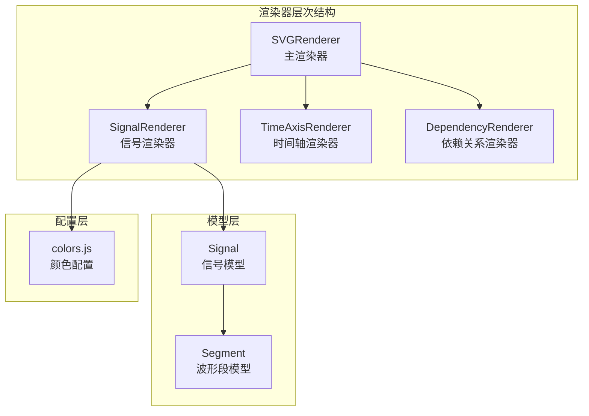
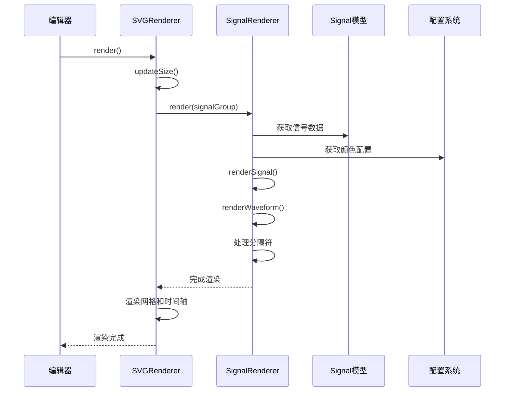
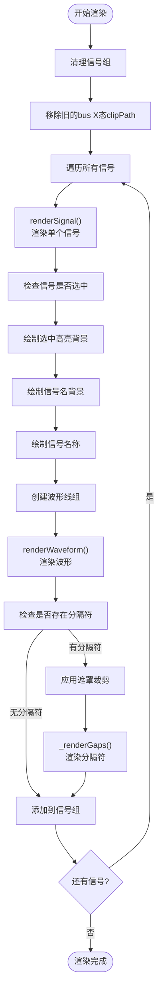
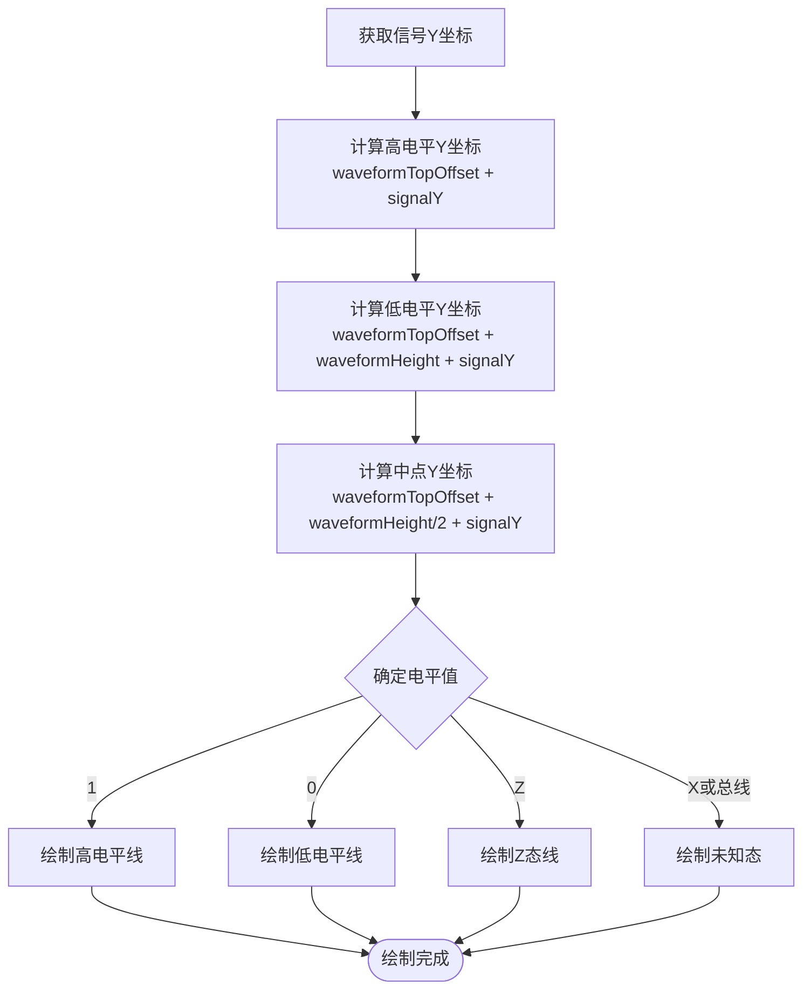
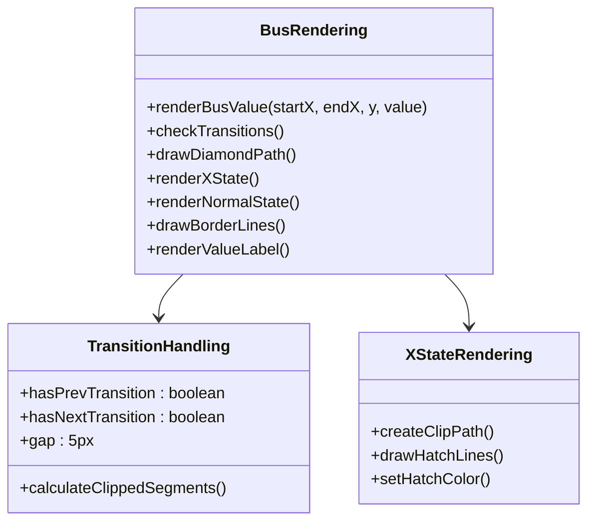
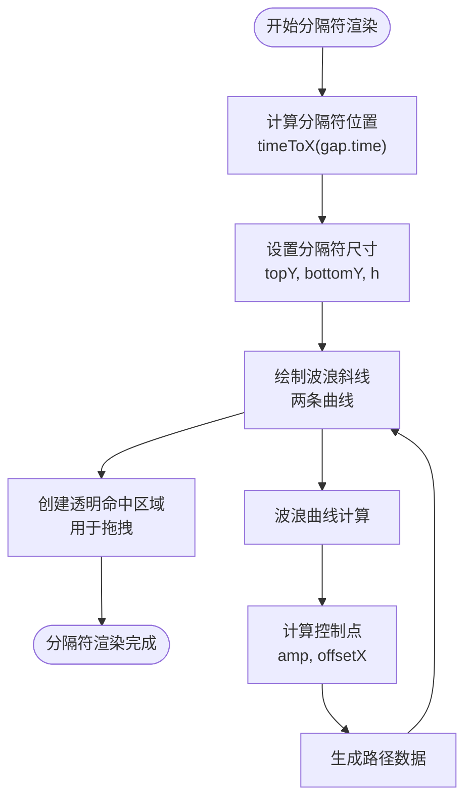
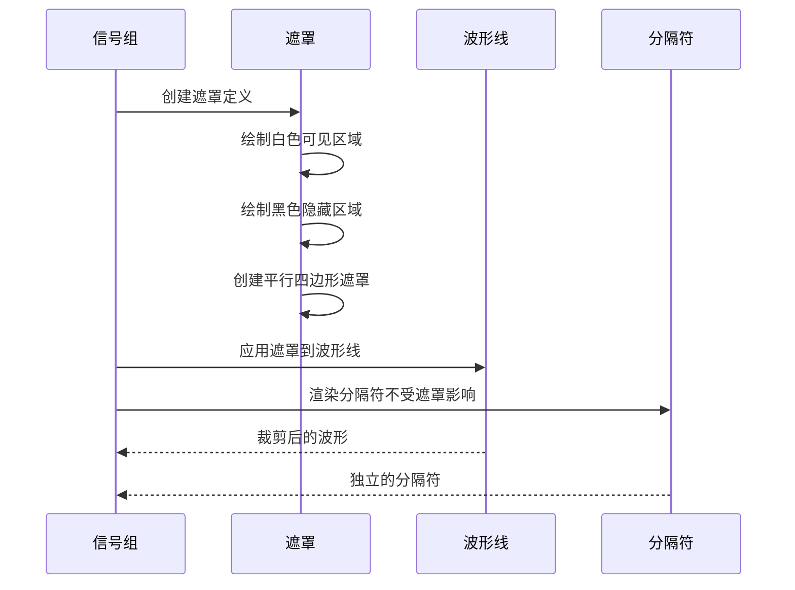
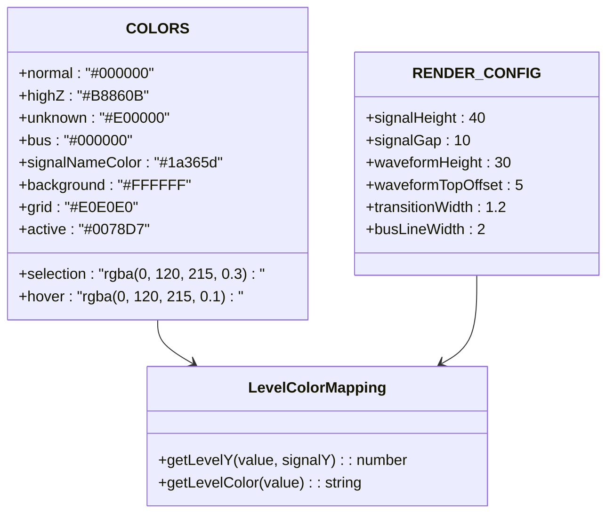
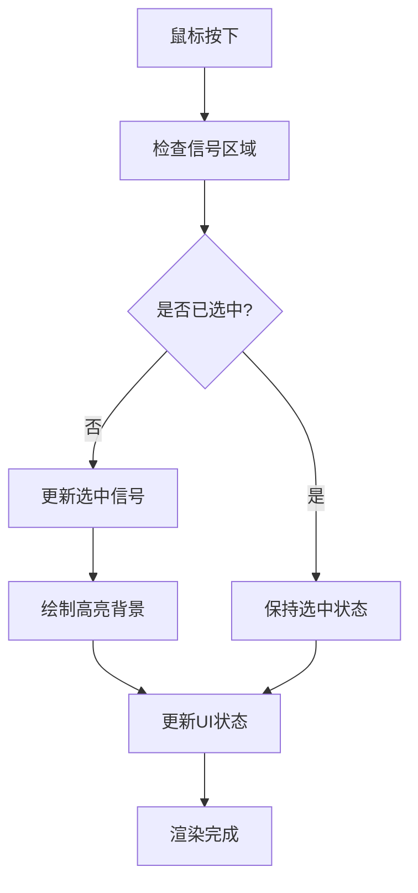
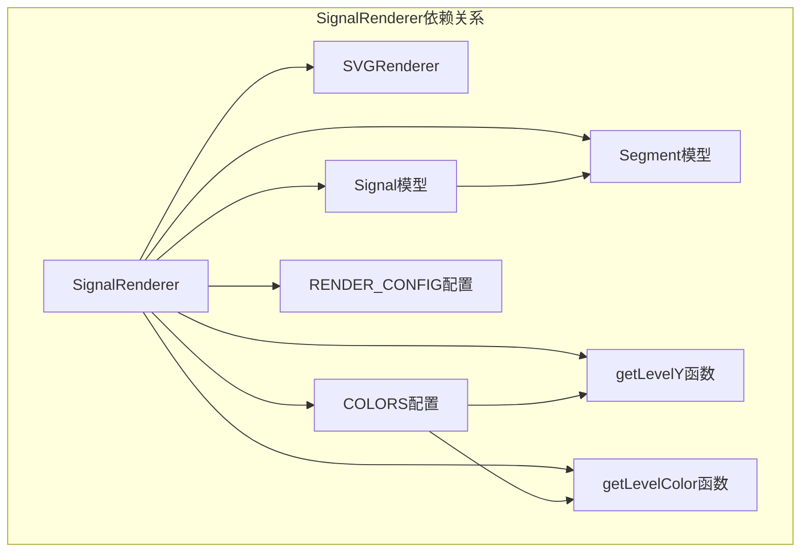

# 信号渲染器API

<cite>
**本文档引用的文件**
- [SignalRenderer.js](file://src/renderers/SignalRenderer.js)
- [SVGRenderer.js](file://src/renderers/SVGRenderer.js)
- [colors.js](file://src/config/colors.js)
- [Signal.js](file://src/models/Signal.js)
- [Segment.js](file://src/models/Segment.js)
- [InteractionController.js](file://src/controllers/InteractionController.js)
- [PropertyPanel.js](file://src/ui/PropertyPanel.js)
- [SignalPanel.js](file://src/ui/SignalPanel.js)
</cite>

## 目录
1. [简介](#简介)
2. [项目结构](#项目结构)
3. [核心组件](#核心组件)
4. [架构概览](#架构概览)
5. [详细组件分析](#详细组件分析)
6. [依赖关系分析](#依赖关系分析)
7. [性能考虑](#性能考虑)
8. [故障排除指南](#故障排除指南)
9. [结论](#结论)
10. [附录](#附录)

## 简介

SignalRenderer信号渲染器是波形编辑器的核心渲染组件，负责将信号模型数据转换为SVG格式的波形图。该渲染器实现了完整的信号波形渲染功能，包括高低电平显示、总线信号渲染、分隔符处理、交互支持等高级特性。

本API文档详细说明了信号渲染器的所有公共接口、内部实现机制、配置参数以及扩展开发指南，帮助开发者深入理解和使用这一核心组件。

## 项目结构

波形编辑器采用模块化架构设计，SignalRenderer作为渲染器层次结构中的关键组件，位于渲染器目录下，与其他渲染器协同工作：



**图表来源**
- [SVGRenderer.js:10-40](file://src/renderers/SVGRenderer.js#L10-L40)
- [SignalRenderer.js:6-16](file://src/renderers/SignalRenderer.js#L6-L16)

**章节来源**
- [SVGRenderer.js:10-40](file://src/renderers/SVGRenderer.js#L10-L40)
- [SignalRenderer.js:6-16](file://src/renderers/SignalRenderer.js#L6-L16)

## 核心组件

### SignalRenderer类概述

SignalRenderer是一个专门负责信号波形渲染的类，继承自SVGRenderer的基础功能，提供了完整的信号渲染能力：

- **构造函数**: 接受主渲染器实例，建立与项目数据的关联
- **渲染方法**: 提供完整的信号渲染流程控制
- **波形绘制**: 实现复杂的波形线绘制算法
- **交互支持**: 集成信号选择、悬停、编辑等交互功能

### 主要职责

1. **信号渲染**: 将每个信号转换为SVG图形元素
2. **波形绘制**: 绘制高低电平、跳变沿、特殊状态
3. **分隔符处理**: 管理信号间的垂直分隔符
4. **样式管理**: 控制颜色、字体、布局等视觉属性
5. **交互集成**: 支持信号选择、编辑、悬停效果

**章节来源**
- [SignalRenderer.js:6-31](file://src/renderers/SignalRenderer.js#L6-L31)

## 架构概览

SignalRenderer在整个波形编辑器架构中扮演着核心渲染器的角色，与多个组件协同工作：



**图表来源**
- [SVGRenderer.js:284-314](file://src/renderers/SVGRenderer.js#L284-L314)
- [SignalRenderer.js:22-31](file://src/renderers/SignalRenderer.js#L22-L31)

### 组件间关系

SignalRenderer通过以下方式与系统其他组件交互：

1. **继承关系**: 继承SVGRenderer的基础SVG操作能力
2. **数据访问**: 通过project属性访问信号数据
3. **配置依赖**: 使用colors.js中的颜色和样式配置
4. **事件集成**: 与InteractionController协作处理用户交互

**章节来源**
- [SignalRenderer.js:10-16](file://src/renderers/SignalRenderer.js#L10-L16)
- [SVGRenderer.js:34-36](file://src/renderers/SVGRenderer.js#L34-L36)

## 详细组件分析

### 渲染流程控制

SignalRenderer的渲染流程遵循严格的步骤顺序，确保波形图的正确性和一致性：



**图表来源**
- [SignalRenderer.js:22-144](file://src/renderers/SignalRenderer.js#L22-L144)

### 波形绘制算法

SignalRenderer实现了复杂的波形绘制算法，能够处理各种信号类型和状态：

#### 高低电平显示逻辑

波形的高低电平通过精确的Y坐标计算实现：



**图表来源**
- [SignalRenderer.js:206-230](file://src/renderers/SignalRenderer.js#L206-L230)
- [colors.js:58-69](file://src/config/colors.js#L58-L69)

#### 总线信号渲染

总线信号具有特殊的渲染逻辑，支持多种数据格式和状态：



**图表来源**
- [SignalRenderer.js:372-474](file://src/renderers/SignalRenderer.js#L372-L474)

**章节来源**
- [SignalRenderer.js:201-316](file://src/renderers/SignalRenderer.js#L201-L316)

### 分隔符处理机制

SignalRenderer实现了智能的分隔符处理机制，用于在信号之间创建垂直分隔：

#### 分隔符渲染算法



**图表来源**
- [SignalRenderer.js:152-193](file://src/renderers/SignalRenderer.js#L152-L193)

#### 分隔符遮罩系统

为了确保分隔符不影响波形线的连续性，SignalRenderer使用了复杂的遮罩技术：



**图表来源**
- [SignalRenderer.js:96-141](file://src/renderers/SignalRenderer.js#L96-L141)

**章节来源**
- [SignalRenderer.js:146-193](file://src/renderers/SignalRenderer.js#L146-L193)

### 配置参数与样式设置

SignalRenderer使用集中化的配置系统来管理所有样式参数：

#### 颜色管理系统



**图表来源**
- [colors.js:5-83](file://src/config/colors.js#L5-L83)

#### 信号渲染配置

| 参数名 | 类型 | 默认值 | 描述 |
|--------|------|--------|------|
| signalHeight | number | 40 | 信号行高度（像素） |
| signalGap | number | 10 | 信号间距（像素） |
| waveformHeight | number | 30 | 波形高度（像素） |
| waveformTopOffset | number | 5 | 波形顶部偏移（像素） |
| transitionWidth | number | 1.2 | 跳变沿宽度（像素） |
| busLineWidth | number | 2 | 总线双线间距（像素） |

**章节来源**
- [colors.js:30-37](file://src/config/colors.js#L30-L37)
- [colors.js:5-25](file://src/config/colors.js#L5-L25)

### 交互功能实现

SignalRenderer集成了丰富的交互功能，支持信号选择、悬停效果、编辑状态显示等：

#### 信号选择高亮



**图表来源**
- [SignalRenderer.js:49-61](file://src/renderers/SignalRenderer.js#L49-L61)

#### 悬停效果

悬停效果通过CSS类和事件监听器实现，提供流畅的用户体验：

- **信号名称悬停**: 改变文本颜色和描边
- **波形线悬停**: 增强线条可见度
- **分隔符悬停**: 显示拖拽光标

#### 编辑状态显示

编辑状态通过多种视觉反馈机制实现：

- **边沿节点**: 窄矩形区域，便于精确拖拽
- **临时箭头**: 拖拽创建依赖关系时的预览
- **选择框**: 区域选择时的临时高亮

**章节来源**
- [InteractionController.js:84-184](file://src/controllers/InteractionController.js#L84-L184)
- [SignalRenderer.js:479-500](file://src/renderers/SignalRenderer.js#L479-L500)

## 依赖关系分析

SignalRenderer的依赖关系体现了清晰的模块化设计：



**图表来源**
- [SignalRenderer.js:4-16](file://src/renderers/SignalRenderer.js#L4-L16)

### 外部依赖

SignalRenderer主要依赖以下外部组件：

1. **SVGRenderer基础功能**: 继承SVG操作能力
2. **Signal模型**: 提供信号数据结构
3. **Segment模型**: 提供波形段数据结构
4. **颜色配置**: 集中式颜色管理
5. **交互控制器**: 用户操作处理

**章节来源**
- [SignalRenderer.js:4-16](file://src/renderers/SignalRenderer.js#L4-L16)

## 性能考虑

SignalRenderer在设计时充分考虑了性能优化：

### 渲染优化策略

1. **DOM操作最小化**: 批量创建SVG元素，减少重排重绘
2. **缓存机制**: 复用SVG元素和遮罩定义
3. **条件渲染**: 仅在必要时更新特定信号
4. **遮罩复用**: 避免重复创建相同的遮罩定义

### 内存管理

- **元素清理**: 渲染前清理旧元素
- **事件解绑**: 避免内存泄漏
- **对象池**: 复用相似的SVG元素

## 故障排除指南

### 常见问题及解决方案

#### 波形线显示异常

**问题**: 波形线不完整或显示错误
**原因**: 
- 信号段数据不连续
- 时间轴缩放比例异常
- 遮罩定义冲突

**解决方案**:
1. 检查信号段的startTime和endTime
2. 验证时间轴配置
3. 清理旧的遮罩定义

#### 分隔符渲染问题

**问题**: 分隔符位置不正确或不可拖拽
**原因**:
- 分隔符时间计算错误
- 命中区域尺寸不匹配
- 事件绑定失败

**解决方案**:
1. 验证分隔符时间戳
2. 检查hit-area尺寸计算
3. 重新绑定事件监听器

#### 颜色显示异常

**问题**: 信号颜色不符合预期
**原因**:
- 信号级别颜色覆盖段级别颜色
- 特殊状态颜色映射错误
- 总线信号颜色处理异常

**解决方案**:
1. 检查信号颜色配置
2. 验证电平值到颜色的映射
3. 测试总线信号的X态处理

**章节来源**
- [SignalRenderer.js:213-312](file://src/renderers/SignalRenderer.js#L213-L312)
- [colors.js:76-83](file://src/config/colors.js#L76-L83)

## 结论

SignalRenderer信号渲染器是一个功能完整、设计精良的波形渲染组件。它不仅实现了基本的信号波形渲染功能，还提供了高级的交互支持、灵活的配置选项和良好的扩展性。

通过模块化的架构设计、完善的错误处理机制和性能优化策略，SignalRenderer为波形编辑器提供了稳定可靠的渲染基础。其清晰的API设计和详细的文档说明，使得开发者能够轻松地理解和扩展这一核心组件。

## 附录

### 扩展开发指南

#### 自定义渲染逻辑

要扩展SignalRenderer的功能，可以考虑以下方式：

1. **继承扩展**: 继承SignalRenderer类，重写特定方法
2. **插件模式**: 通过事件钩子扩展功能
3. **配置定制**: 通过配置系统调整渲染行为

#### 自定义颜色方案

可以通过修改colors.js文件来定制颜色方案：

```javascript
// 示例：添加自定义颜色
export const CUSTOM_COLORS = {
  ...COLORS,
  customSignal: '#FF6B6B',
  customBackground: '#F8F9FA'
};
```

#### 自定义渲染配置

通过修改RENDER_CONFIG来调整渲染参数：

```javascript
// 示例：调整波形尺寸
export const CUSTOM_RENDER_CONFIG = {
  ...RENDER_CONFIG,
  signalHeight: 50,
  waveformHeight: 40
};
```