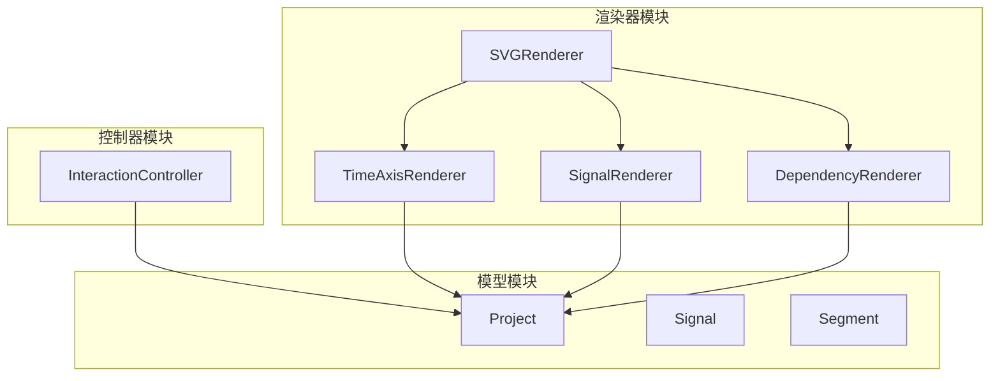
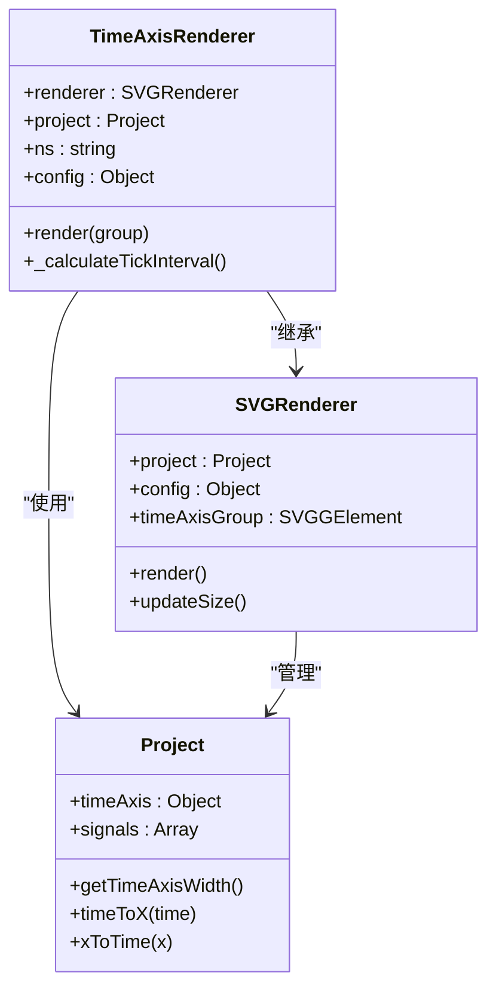
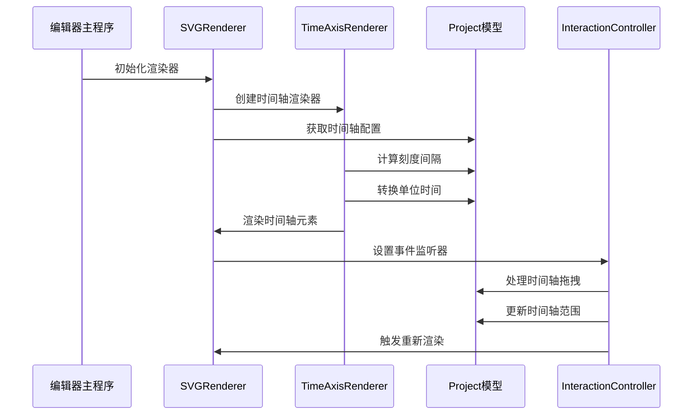
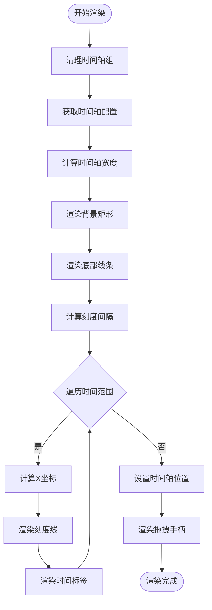
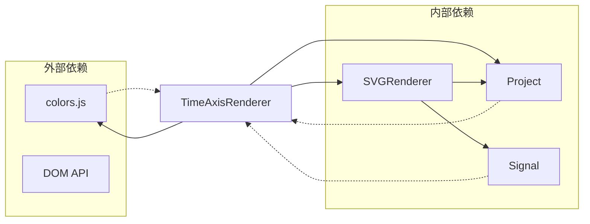

# 时间轴渲染器API

<cite>
**本文档引用的文件**
- [TimeAxisRenderer.js](file://src/renderers/TimeAxisRenderer.js)
- [SVGRenderer.js](file://src/renderers/SVGRenderer.js)
- [InteractionController.js](file://src/controllers/InteractionController.js)
- [Project.js](file://src/models/Project.js)
- [colors.js](file://src/config/colors.js)
- [main.js](file://src/main.js)
</cite>

## 目录
1. [简介](#简介)
2. [项目结构](#项目结构)
3. [核心组件](#核心组件)
4. [架构概览](#架构概览)
5. [详细组件分析](#详细组件分析)
6. [依赖关系分析](#依赖关系分析)
7. [性能考虑](#性能考虑)
8. [故障排除指南](#故障排除指南)
9. [结论](#结论)

## 简介

TimeAxisRenderer（时间轴渲染器）是波形编辑器中的关键组件，负责渲染时间轴界面元素，包括时间刻度、标签、网格线以及交互式的时间轴拖拽手柄。该渲染器采用SVG技术实现，提供了精确的时间单位转换、动态刻度生成和用户友好的交互体验。

## 项目结构

时间轴渲染器位于渲染器模块中，与其他渲染器组件协同工作：

**图表来源**
- [SVGRenderer.js:10-40](file://src/renderers/SVGRenderer.js#L10-L40)
- [TimeAxisRenderer.js:6-15](file://src/renderers/TimeAxisRenderer.js#L6-L15)

**章节来源**
- [SVGRenderer.js:10-40](file://src/renderers/SVGRenderer.js#L10-L40)
- [TimeAxisRenderer.js:6-15](file://src/renderers/TimeAxisRenderer.js#L6-L15)

## 核心组件

### TimeAxisRenderer 类

TimeAxisRenderer 是一个专门负责时间轴渲染的类，继承自 SVGRenderer 并扩展了时间轴特有的功能。

**主要职责：**
- 渲染时间轴背景和边框
- 生成和绘制时间刻度
- 显示时间标签
- 提供时间轴拖拽交互
- 管理时间轴样式和布局

**核心方法：**
- `constructor(renderer)` - 构造函数，接收主渲染器实例
- `render(group)` - 主渲染方法，负责完整的渲染流程
- `_calculateTickInterval()` - 计算合适的刻度间隔

**章节来源**
- [TimeAxisRenderer.js:6-132](file://src/renderers/TimeAxisRenderer.js#L6-L132)

### 项目集成

TimeAxisRenderer 通过以下方式与项目系统集成：

**图表来源**
- [TimeAxisRenderer.js:6-15](file://src/renderers/TimeAxisRenderer.js#L6-L15)
- [SVGRenderer.js:10-547](file://src/renderers/SVGRenderer.js#L10-L547)
- [Project.js:8-245](file://src/models/Project.js#L8-L245)

**章节来源**
- [TimeAxisRenderer.js:6-15](file://src/renderers/TimeAxisRenderer.js#L6-L15)
- [SVGRenderer.js:10-547](file://src/renderers/SVGRenderer.js#L10-L547)
- [Project.js:8-245](file://src/models/Project.js#L8-L245)

## 架构概览

时间轴渲染器在整个波形编辑器架构中扮演着重要的角色，作为UI层的一部分，它与控制器和模型层紧密协作：

**图表来源**
- [main.js:49-132](file://src/main.js#L49-L132)
- [SVGRenderer.js:284-314](file://src/renderers/SVGRenderer.js#L284-L314)
- [TimeAxisRenderer.js:21-108](file://src/renderers/TimeAxisRenderer.js#L21-L108)
- [InteractionController.js:84-365](file://src/controllers/InteractionController.js#L84-L365)

**章节来源**
- [main.js:49-132](file://src/main.js#L49-L132)
- [SVGRenderer.js:284-314](file://src/renderers/SVGRenderer.js#L284-L314)
- [TimeAxisRenderer.js:21-108](file://src/renderers/TimeAxisRenderer.js#L21-L108)
- [InteractionController.js:84-365](file://src/controllers/InteractionController.js#L84-L365)

## 详细组件分析

### 时间轴渲染方法

TimeAxisRenderer 的 `render` 方法实现了完整的时间轴渲染流程：

**图表来源**
- [TimeAxisRenderer.js:21-108](file://src/renderers/TimeAxisRenderer.js#L21-L108)

#### 背景和边框渲染

时间轴渲染器首先创建一个浅灰色背景矩形，高度固定为25像素，然后在底部绘制一条网格线，确保视觉一致性。

#### 刻度生成算法

刻度生成采用了智能的密度控制算法：

**算法特点：**
- 目标密度：每80像素一个刻度
- 动态间隔：基于当前缩放比例计算
- 整数间隔：使用预定义的间隔序列 [1, 2, 5, 10, 20, 50, 100, 200, 500, 1000]
- 自适应：根据时间轴宽度和缩放比例自动调整

**章节来源**
- [TimeAxisRenderer.js:21-108](file://src/renderers/TimeAxisRenderer.js#L21-L108)
- [TimeAxisRenderer.js:114-131](file://src/renderers/TimeAxisRenderer.js#L114-L131)

### 时间标签显示逻辑

时间轴上的时间标签具有以下特性：

**标签属性：**
- 文本锚定：居中对齐 (`text-anchor: middle`)
- 字体设置：11号字体，深灰色文本
- 坐标定位：基于计算的X坐标，距离底部5像素
- 单位显示：在时间数值后显示单位符号

**标签生成流程：**
1. 计算起始时间的倍数
2. 按刻度间隔递增
3. 转换为屏幕坐标
4. 创建SVG文本元素
5. 设置样式和内容

**章节来源**
- [TimeAxisRenderer.js:52-74](file://src/renderers/TimeAxisRenderer.js#L52-L74)

### 网格线渲染机制

时间轴渲染器支持多种网格线渲染模式：

**背景网格：**
- 由主渲染器统一管理
- 水平方向：信号行之间的分隔线
- 颜色：浅灰色 (#E0E0E0)
- 线宽：1像素

**时钟网格：**
- 专门针对时钟信号的周期性网格
- 虚线样式：4像素虚线
- 颜色：浅蓝色 (#cbd5e0)
- 跨越整个波形区域

**章节来源**
- [SVGRenderer.js:393-419](file://src/renderers/SVGRenderer.js#L393-L419)
- [SVGRenderer.js:349-388](file://src/renderers/SVGRenderer.js#L349-L388)

### 时间轴交互功能

时间轴渲染器支持以下交互功能：

#### 拖拽手柄

右侧的拖拽手柄提供了时间轴扩展功能：

**手柄特征：**
- 透明区域：20像素宽的拖拽区域
- 三条竖线：指示可拖拽区域
- 光标样式：ew-resize（东西方向拖拽）
- 数据属性：`data-drag="time-axis-end"`

**交互流程：**
1. 用户点击拖拽手柄
2. 控制器检测到手柄命中
3. 开始时间轴拖拽模式
4. 实时更新时间轴结束时间
5. 自动调整缩放比例

#### 边缘滚动

当用户将鼠标靠近屏幕右侧边缘时，系统会自动扩展时间轴：

**边缘滚动机制：**
- 距离阈值：距离右侧40像素以内
- 滚动速度：与距离成反比
- 平滑动画：使用requestAnimationFrame
- 持续更新：直到鼠标离开边缘

**章节来源**
- [TimeAxisRenderer.js:79-108](file://src/renderers/TimeAxisRenderer.js#L79-L108)
- [InteractionController.js:84-401](file://src/controllers/InteractionController.js#L84-L401)

### 时间单位转换和精度控制

时间轴渲染器实现了精确的时间单位转换机制：

**转换函数：**
- `timeToX(time)`: 时间转X坐标
- `xToTime(x)`: X坐标转时间
- 基于 `scale` 参数进行线性转换

**精度控制：**
- 缩放精度：像素/单位时间
- 时间精度：整数时间单位
- 自动舍入：确保时间轴结束时间为整数

**章节来源**
- [Project.js:159-170](file://src/models/Project.js#L159-L170)
- [SVGRenderer.js:194-243](file://src/renderers/SVGRenderer.js#L194-L243)

### 动态更新机制

时间轴渲染器支持多种动态更新场景：

**自动扩展：**
- 窗口大小变化时自动扩展
- 信号面板宽度调整时同步更新
- 时间轴拖拽时的实时响应

**事件驱动更新：**
- 项目变更事件触发重新渲染
- 用户交互完成后更新显示
- 响应式布局调整

**章节来源**
- [SVGRenderer.js:194-243](file://src/renderers/SVGRenderer.js#L194-L243)
- [InteractionController.js:342-365](file://src/controllers/InteractionController.js#L342-L365)

## 依赖关系分析

时间轴渲染器的依赖关系清晰明确：

**图表来源**
- [TimeAxisRenderer.js:4](file://src/renderers/TimeAxisRenderer.js#L4)
- [SVGRenderer.js:5](file://src/renderers/SVGRenderer.js#L5)
- [Project.js:5](file://src/models/Project.js#L5)

**章节来源**
- [TimeAxisRenderer.js:4](file://src/renderers/TimeAxisRenderer.js#L4)
- [SVGRenderer.js:5](file://src/renderers/SVGRenderer.js#L5)
- [Project.js:5](file://src/models/Project.js#L5)

## 性能考虑

时间轴渲染器在设计时充分考虑了性能优化：

**渲染优化：**
- 批量DOM操作：使用SVG组元素减少DOM节点数量
- 条件渲染：只在必要时更新刻度和标签
- 缓存计算结果：避免重复的时间转换计算

**内存管理：**
- 及时清理旧元素：每次渲染前清理时间轴组
- 避免内存泄漏：正确管理事件监听器
- 合理的数据结构：使用高效的数组和对象

**交互性能：**
- requestAnimationFrame：用于平滑的边缘滚动
- 防抖处理：窗口大小变化时的节流
- 最小化重排：批量更新DOM属性

## 故障排除指南

### 常见问题和解决方案

**时间轴不显示刻度：**
- 检查时间轴范围配置
- 验证缩放比例是否合理
- 确认时间轴宽度计算

**拖拽手柄无响应：**
- 检查CSS类名 `.time-axis-handle`
- 验证事件监听器是否正确绑定
- 确认SVG命名空间设置

**刻度密度异常：**
- 检查 `_calculateTickInterval` 方法
- 验证目标像素间隔设置
- 确认时间轴宽度和缩放比例

**章节来源**
- [TimeAxisRenderer.js:114-131](file://src/renderers/TimeAxisRenderer.js#L114-L131)
- [InteractionController.js:84-107](file://src/controllers/InteractionController.js#L84-L107)

## 结论

TimeAxisRenderer 时间轴渲染器是一个功能完整、设计合理的组件，它成功地实现了时间轴的渲染、交互和动态更新功能。通过智能的刻度生成算法、精确的时间转换机制和优雅的用户交互设计，该组件为波形编辑器提供了稳定可靠的时间轴基础。

该渲染器的主要优势包括：
- **模块化设计**：清晰的职责分离和依赖关系
- **性能优化**：高效的渲染算法和内存管理
- **用户体验**：直观的交互和响应式设计
- **扩展性**：良好的API设计便于功能扩展

未来可以考虑的功能增强包括：
- 更灵活的刻度密度控制
- 自定义时间格式支持
- 多种时间单位切换
- 高级时间轴样式定制