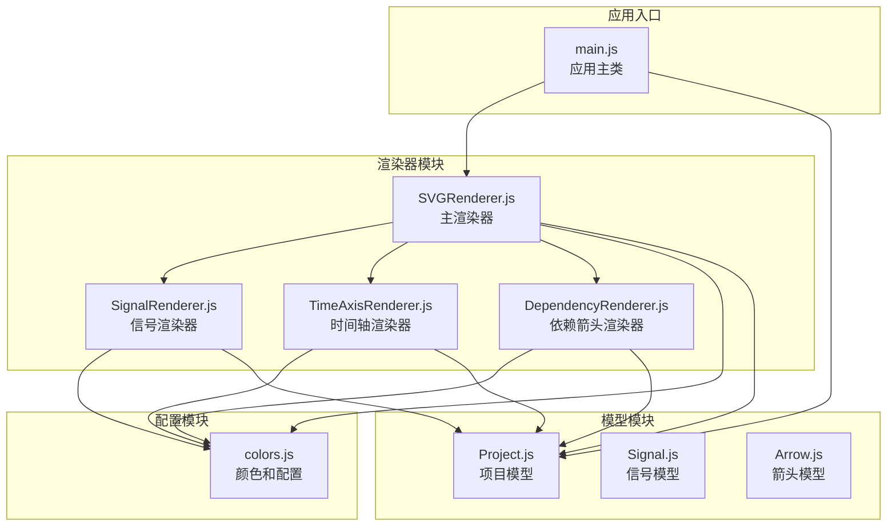
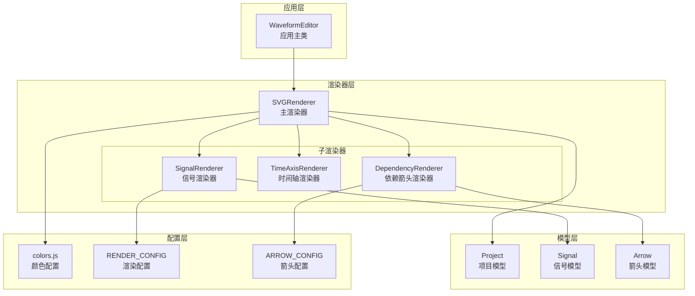
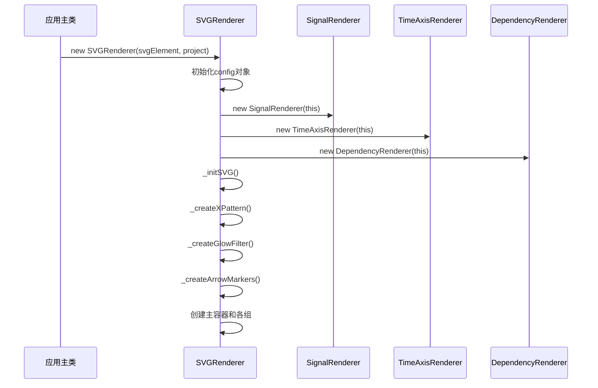
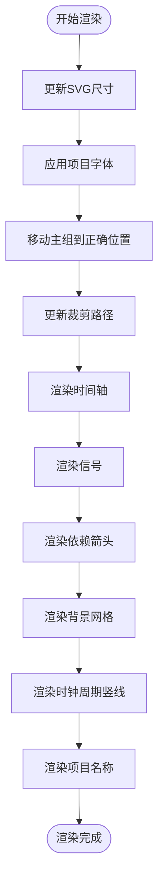
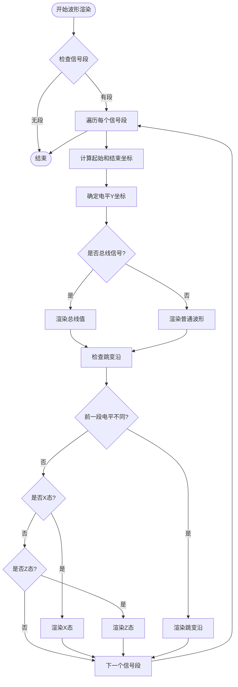
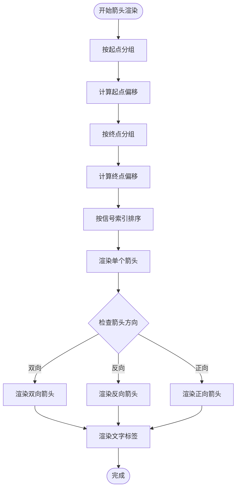
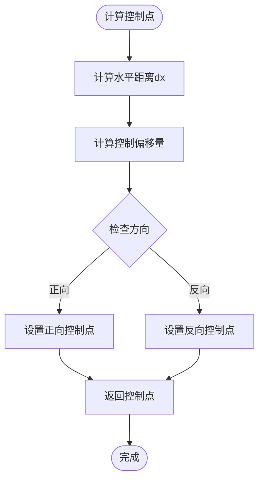
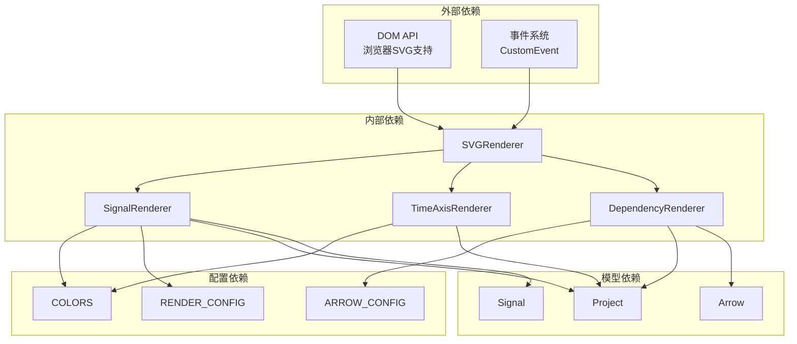
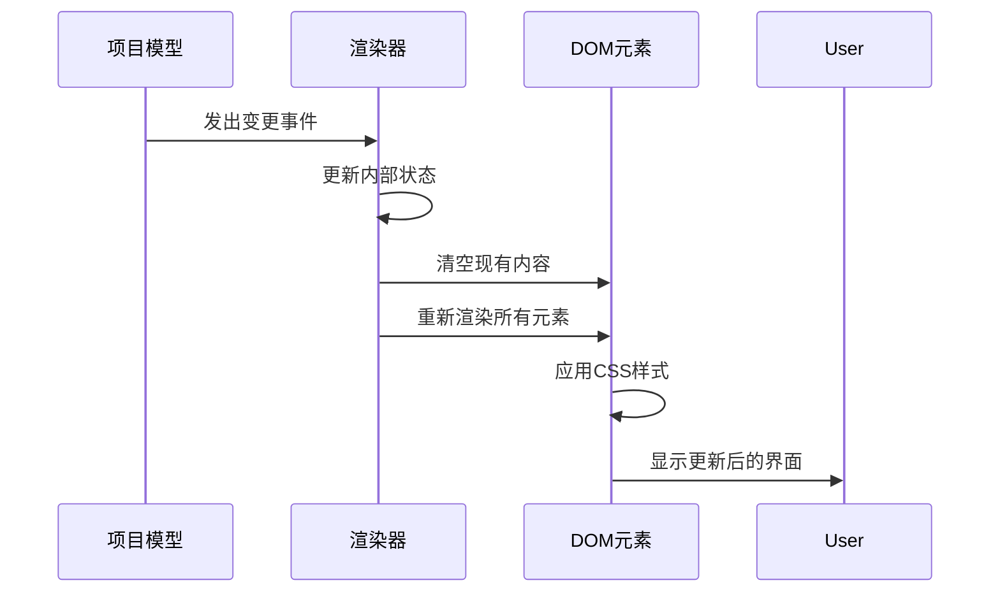

# 渲染器API

<cite>
**本文档引用的文件**
- [SVGRenderer.js](file://src/renderers/SVGRenderer.js)
- [SignalRenderer.js](file://src/renderers/SignalRenderer.js)
- [DependencyRenderer.js](file://src/renderers/DependencyRenderer.js)
- [TimeAxisRenderer.js](file://src/renderers/TimeAxisRenderer.js)
- [colors.js](file://src/config/colors.js)
- [Project.js](file://src/models/Project.js)
- [Signal.js](file://src/models/Signal.js)
- [Arrow.js](file://src/models/Arrow.js)
- [main.js](file://src/main.js)
</cite>

## 目录
1. [简介](#简介)
2. [项目结构](#项目结构)
3. [核心组件](#核心组件)
4. [架构概览](#架构概览)
5. [详细组件分析](#详细组件分析)
6. [依赖关系分析](#依赖关系分析)
7. [性能考虑](#性能考虑)
8. [故障排除指南](#故障排除指南)
9. [结论](#结论)

## 简介

本文件详细记录了波形图编辑器的渲染器系统API文档。该系统采用模块化的架构设计，包含一个主渲染器SVGRenderer和三个专门的子渲染器：SignalRenderer（信号波形渲染器）、TimeAxisRenderer（时间轴渲染器）和DependencyRenderer（依赖箭头渲染器）。每个渲染器都有明确的职责分工，通过统一的配置管理和数据传递机制实现高效的波形图渲染。

渲染器系统的核心特点包括：
- **模块化设计**：每个渲染器独立负责特定的渲染任务
- **配置驱动**：通过集中配置管理渲染参数
- **事件驱动**：基于项目模型的变更事件进行响应式更新
- **可扩展性**：提供清晰的扩展点和自定义接口

## 项目结构

渲染器系统位于`src/renderers/`目录下，采用文件按功能组织的方式：

**图表来源**
- [SVGRenderer.js:1-547](file://src/renderers/SVGRenderer.js#L1-L547)
- [SignalRenderer.js:1-501](file://src/renderers/SignalRenderer.js#L1-L501)
- [TimeAxisRenderer.js:1-132](file://src/renderers/TimeAxisRenderer.js#L1-L132)
- [DependencyRenderer.js:1-290](file://src/renderers/DependencyRenderer.js#L1-L290)

**章节来源**
- [SVGRenderer.js:1-50](file://src/renderers/SVGRenderer.js#L1-L50)
- [main.js:1-132](file://src/main.js#L1-L132)

## 核心组件

### SVGRenderer 主渲染器

SVGRenderer是整个渲染系统的核心，负责协调各个子渲染器的工作。它继承了所有渲染器的公共属性和方法，并提供了统一的渲染接口。

#### 主要职责
- 管理SVG画布和DOM结构
- 协调子渲染器的渲染顺序
- 提供全局配置和工具方法
- 处理项目切换和状态管理

#### 核心属性
- `svg`: SVG DOM元素实例
- `project`: 项目数据模型
- `config`: 渲染配置对象
- `ns`: SVG命名空间
- `selectedSignalId`: 当前选中的信号ID
- `selectedArrowId`: 当前选中的箭头ID

#### 核心方法
- `constructor(svgElement, project)`: 构造函数，初始化渲染器
- `render()`: 主渲染方法，协调所有子渲染器
- `setProject(project)`: 切换项目的方法
- `updateSize()`: 更新SVG尺寸的方法

**章节来源**
- [SVGRenderer.js:10-40](file://src/renderers/SVGRenderer.js#L10-L40)
- [SVGRenderer.js:284-314](file://src/renderers/SVGRenderer.js#L284-L314)

### SignalRenderer 信号渲染器

SignalRenderer专门负责渲染信号波形，包括波形线、跳变沿、特殊状态（X态、Z态）以及垂直分隔符。

#### 主要功能
- 渲染信号名称和背景
- 绘制波形段和跳变沿
- 处理X态和Z态的特殊渲染
- 支持总线信号的特殊渲染模式
- 实现垂直分隔符的渲染

#### 核心方法
- `render(group)`: 渲染所有信号
- `renderSignal(group, signal, index)`: 渲染单个信号
- `renderWaveform(group, signal, y)`: 渲染波形
- `_renderXState(group, startX, endX, y)`: 渲染X态
- `_renderZState(group, startX, endX, y)`: 渲染Z态

**章节来源**
- [SignalRenderer.js:6-31](file://src/renderers/SignalRenderer.js#L6-L31)
- [SignalRenderer.js:39-144](file://src/renderers/SignalRenderer.js#L39-L144)

### TimeAxisRenderer 时间轴渲染器

TimeAxisRenderer负责渲染顶部的时间轴，包括刻度线、时间标签和拖拽手柄。

#### 主要功能
- 绘制时间轴背景和边框
- 计算并渲染时间刻度
- 显示时间标签
- 提供时间轴拖拽功能

#### 核心方法
- `render(group)`: 渲染时间轴
- `_calculateTickInterval()`: 计算刻度间隔

**章节来源**
- [TimeAxisRenderer.js:6-15](file://src/renderers/TimeAxisRenderer.js#L6-L15)
- [TimeAxisRenderer.js:21-77](file://src/renderers/TimeAxisRenderer.js#L21-L77)

### DependencyRenderer 依赖箭头渲染器

DependencyRenderer专门处理信号间的依赖关系箭头渲染，支持复杂的箭头样式和交互功能。

#### 主要功能
- 渲染信号间的依赖箭头
- 处理箭头的方向和样式
- 支持双向箭头和自定义样式
- 实现箭头标签的渲染和交互

#### 核心方法
- `render(group)`: 渲染所有依赖箭头
- `renderArrow(group, arrow, fromOffset, toOffset)`: 渲染单个箭头
- `_calculateControlPoints(x1, y1, x2, y2, verticalOffset)`: 计算控制点

**章节来源**
- [DependencyRenderer.js:7-12](file://src/renderers/DependencyRenderer.js#L7-L12)
- [DependencyRenderer.js:18-84](file://src/renderers/DependencyRenderer.js#L18-L84)

## 架构概览

渲染器系统采用分层架构设计，实现了清晰的关注点分离：

**图表来源**
- [main.js:21-44](file://src/main.js#L21-L44)
- [SVGRenderer.js:34-36](file://src/renderers/SVGRenderer.js#L34-L36)
- [colors.js:5-50](file://src/config/colors.js#L5-L50)

## 详细组件分析

### SVGRenderer 类详细分析

SVGRenderer作为主渲染器，承担着协调整个渲染流程的重要职责：

#### 构造函数和初始化

**图表来源**
- [SVGRenderer.js:15-40](file://src/renderers/SVGRenderer.js#L15-L40)
- [SVGRenderer.js:59-100](file://src/renderers/SVGRenderer.js#L59-L100)

#### 渲染流程
SVGRenderer的render方法按照严格的顺序协调各个子渲染器：

**图表来源**
- [SVGRenderer.js:284-314](file://src/renderers/SVGRenderer.js#L284-L314)

#### 配置系统
SVGRenderer维护了一个完整的配置系统：

| 配置项 | 类型 | 默认值 | 描述 |
|--------|------|--------|------|
| leftMargin | number | 200 | 左边距（信号名称区域） |
| topMargin | number | 30 | 上边距（时间轴） |
| rightMargin | number | 40 | 右边距（含拖拽手柄空间） |
| bottomMargin | number | 60 | 下边距（含项目名称区域） |
| signalHeight | number | 40 | 信号行高度 |
| signalGap | number | 10 | 信号间距 |
| waveformHeight | number | 30 | 波形高度 |
| waveformTopOffset | number | 5 | 波形顶部偏移 |

**章节来源**
- [SVGRenderer.js:22-28](file://src/renderers/SVGRenderer.js#L22-L28)
- [colors.js:30-37](file://src/config/colors.js#L30-L37)

### SignalRenderer 类详细分析

SignalRenderer专注于信号波形的复杂渲染逻辑：

#### 波形渲染算法

**图表来源**
- [SignalRenderer.js:201-316](file://src/renderers/SignalRenderer.js#L201-L316)

#### 特殊状态处理
SignalRenderer实现了三种特殊状态的渲染：

1. **X态（不定态）**: 使用斜线填充模式，提供视觉上的不确定性
2. **Z态（高阻态）**: 在波形线上添加特殊的中间线标识
3. **总线信号**: 使用菱形填充和双线边框的特殊渲染模式

**章节来源**
- [SignalRenderer.js:318-367](file://src/renderers/SignalRenderer.js#L318-L367)
- [SignalRenderer.js:370-474](file://src/renderers/SignalRenderer.js#L370-L474)

### DependencyRenderer 类详细分析

DependencyRenderer处理复杂的箭头渲染逻辑：

#### 箭头布局算法

**图表来源**
- [DependencyRenderer.js:18-84](file://src/renderers/DependencyRenderer.js#L18-L84)
- [DependencyRenderer.js:93-265](file://src/renderers/DependencyRenderer.js#L93-L265)

#### 贝塞尔曲线控制点计算
DependencyRenderer使用数学算法计算箭头的平滑曲线：

**图表来源**
- [DependencyRenderer.js:277-289](file://src/renderers/DependencyRenderer.js#L277-L289)

**章节来源**
- [DependencyRenderer.js:112-128](file://src/renderers/DependencyRenderer.js#L112-L128)

## 依赖关系分析

渲染器系统具有清晰的依赖层次结构：

**图表来源**
- [SVGRenderer.js:5-8](file://src/renderers/SVGRenderer.js#L5-L8)
- [SignalRenderer.js:4](file://src/renderers/SignalRenderer.js#L4)
- [TimeAxisRenderer.js:4](file://src/renderers/TimeAxisRenderer.js#L4)
- [DependencyRenderer.js:5](file://src/renderers/DependencyRenderer.js#L5)

### 数据流分析

渲染器系统遵循单向数据流原则：

**图表来源**
- [Project.js:199-202](file://src/models/Project.js#L199-L202)
- [SVGRenderer.js:284-314](file://src/renderers/SVGRenderer.js#L284-L314)

**章节来源**
- [Project.js:32-34](file://src/models/Project.js#L32-L34)
- [SVGRenderer.js:39-40](file://src/renderers/SVGRenderer.js#L39-L40)

## 性能考虑

渲染器系统在设计时充分考虑了性能优化：

### 渲染优化策略
1. **增量更新**: 只更新发生变化的内容，而不是完全重建DOM
2. **批量操作**: 将多个DOM操作合并为单个批次执行
3. **缓存机制**: 缓存计算结果，避免重复计算
4. **虚拟滚动**: 对于大量信号的情况，考虑实现虚拟滚动

### 内存管理
- 合理使用DOM元素的创建和销毁
- 及时清理事件监听器
- 避免内存泄漏

### 渲染性能指标
- **渲染时间**: 单次渲染应在100ms以内
- **内存使用**: 大型项目应控制在合理范围内
- **响应性**: 用户交互应保持流畅

## 故障排除指南

### 常见问题及解决方案

#### SVG渲染问题
**问题**: SVG元素无法正确显示
**可能原因**:
- SVG命名空间未正确设置
- DOM元素不存在
- CSS样式冲突

**解决方案**:
1. 确认SVG元素存在且正确初始化
2. 检查命名空间设置
3. 验证CSS样式配置

#### 渲染性能问题
**问题**: 大型项目渲染缓慢
**可能原因**:
- DOM元素过多
- 重复渲染
- 样式计算复杂

**解决方案**:
1. 实施虚拟滚动
2. 优化DOM结构
3. 减少不必要的重绘

#### 交互功能异常
**问题**: 箭头拖拽或选择功能失效
**可能原因**:
- 事件监听器未正确绑定
- 命中区域计算错误
- 事件冒泡处理不当

**解决方案**:
1. 检查事件监听器绑定
2. 验证命中区域坐标计算
3. 确保事件处理逻辑正确

**章节来源**
- [SVGRenderer.js:59-100](file://src/renderers/SVGRenderer.js#L59-L100)
- [DependencyRenderer.js:132-141](file://src/renderers/DependencyRenderer.js#L132-L141)

## 结论

波形图渲染器系统展现了优秀的软件架构设计：

### 设计优势
1. **模块化程度高**: 每个渲染器职责单一，易于维护和扩展
2. **配置驱动**: 通过集中配置管理渲染参数，便于定制
3. **事件驱动**: 基于项目模型的变更事件实现响应式更新
4. **性能优化**: 采用多种优化策略确保渲染效率

### 扩展建议
1. **插件系统**: 可考虑引入插件机制支持第三方渲染器
2. **Web Workers**: 对于大型数据集，可考虑使用Web Workers进行后台渲染
3. **虚拟化**: 实现虚拟滚动支持超大数据集
4. **主题系统**: 提供可定制的主题和样式系统

### 最佳实践
1. **遵循单一职责原则**: 每个渲染器只负责特定的渲染任务
2. **保持配置一致性**: 所有渲染器共享统一的配置系统
3. **注重性能监控**: 建立性能监控机制及时发现性能问题
4. **文档和测试**: 完善API文档和单元测试

该渲染器系统为波形图编辑器提供了稳定、高效、可扩展的渲染基础，为后续的功能扩展和性能优化奠定了良好的技术基础。