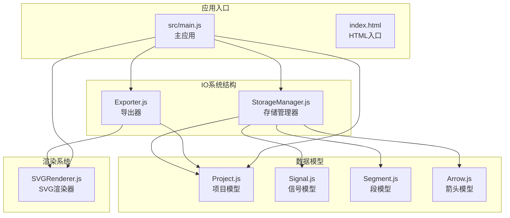
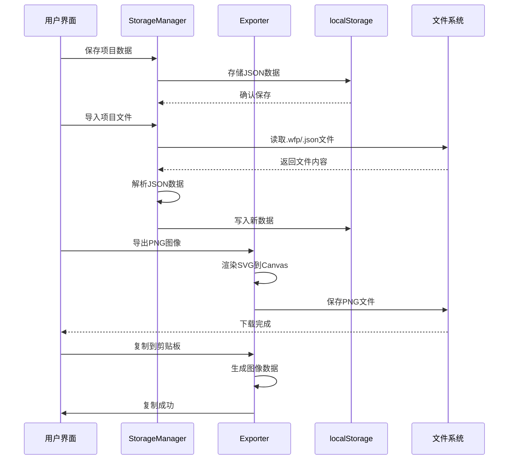
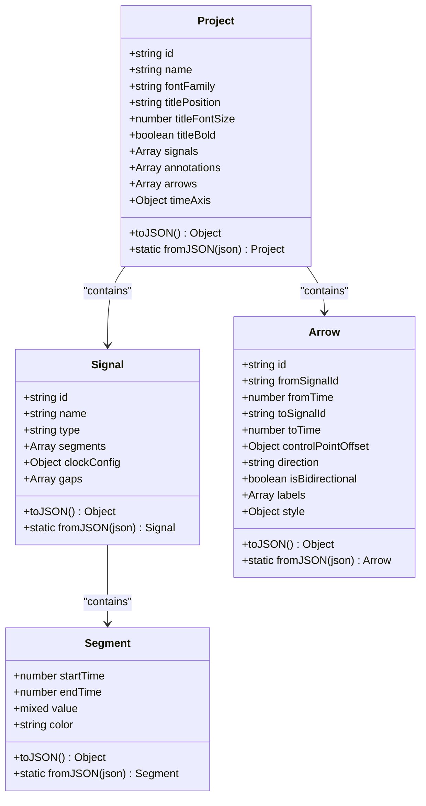
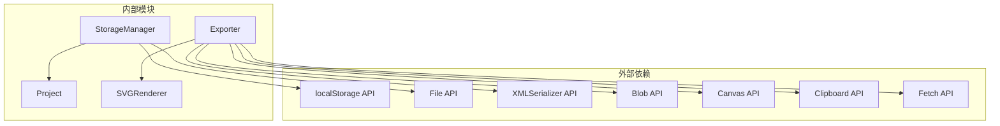

# 输入输出API

<cite>
**本文档引用的文件**
- [StorageManager.js](file://src/io/StorageManager.js)
- [Exporter.js](file://src/io/Exporter.js)
- [Project.js](file://src/models/Project.js)
- [Signal.js](file://src/models/Signal.js)
- [Segment.js](file://src/models/Segment.js)
- [Arrow.js](file://src/models/Arrow.js)
- [SVGRenderer.js](file://src/renderers/SVGRenderer.js)
- [main.js](file://src/main.js)
- [index.html](file://index.html)
- [default-template.json](file://default-template.json)
</cite>

## 目录
1. [简介](#简介)
2. [项目结构](#项目结构)
3. [核心组件](#核心组件)
4. [架构概览](#架构概览)
5. [详细组件分析](#详细组件分析)
6. [依赖分析](#依赖分析)
7. [性能考虑](#性能考虑)
8. [故障排除指南](#故障排除指南)
9. [结论](#结论)

## 简介

本文档详细介绍了波形图编辑器的输入输出系统API，重点涵盖StorageManager存储管理器和Exporter导出器两大核心组件。该系统提供了完整的数据持久化、文件导入导出、模板管理和多工作表支持功能。

系统采用模块化设计，通过localStorage实现本地数据存储，支持多种文件格式的导入导出，包括项目文件(.wfp)、JSON数据文件和独立HTML文件。所有操作均提供异步Promise接口，确保良好的用户体验和错误处理机制。

## 项目结构

输入输出系统位于src/io目录下，主要包含两个核心类：

**图表来源**
- [StorageManager.js:1-368](file://src/io/StorageManager.js#L1-L368)
- [Exporter.js:1-298](file://src/io/Exporter.js#L1-L298)
- [Project.js:1-245](file://src/models/Project.js#L1-L245)

**章节来源**
- [StorageManager.js:1-368](file://src/io/StorageManager.js#L1-L368)
- [Exporter.js:1-298](file://src/io/Exporter.js#L1-L298)
- [main.js:1-819](file://src/main.js#L1-L819)

## 核心组件

### StorageManager 存储管理器

StorageManager是系统的核心存储组件，负责：
- 多工作表注册表管理
- 项目数据的持久化存储
- 数据迁移和版本兼容性处理
- 模板管理功能

主要功能模块：
- **注册表管理**：维护工作表列表和活跃工作表状态
- **单个工作表数据**：保存和加载特定工作表的项目数据
- **项目导入导出**：支持.wfp和.json格式的完整项目导入导出
- **模板管理**：保存和加载项目模板

### Exporter 导出器

Exporter负责将项目数据转换为各种格式：
- **图像导出**：SVG和PNG格式的静态图像
- **数据导出**：JSON格式的项目数据
- **剪贴板复制**：支持多种复制策略的图像复制
- **独立HTML导出**：生成可独立运行的HTML文件

## 架构概览

**图表来源**
- [StorageManager.js:166-236](file://src/io/StorageManager.js#L166-L236)
- [Exporter.js:15-96](file://src/io/Exporter.js#L15-L96)

## 详细组件分析

### StorageManager API详解

#### 注册表管理方法

| 方法 | 参数 | 返回值 | 描述 |
|------|------|--------|------|
| loadRegistry | 无 | `{sheets: Array, activeSheetId: string|null}` | 加载工作表注册表 |
| saveRegistry | registry: Object | void | 保存工作表注册表 |
| listSheets | 无 | Array | 列出所有工作表 |
| addSheetToRegistry | sheetId: string, name: string | void | 添加工作表到注册表 |
| removeSheetFromRegistry | sheetId: string | void | 从注册表移除工作表 |
| renameSheetInRegistry | sheetId: string, name: string | void | 更新工作表名称 |
| setActiveSheet | sheetId: string | void | 设置活跃工作表 |

#### 单个工作表数据方法

| 方法 | 参数 | 返回值 | 描述 |
|------|------|--------|------|
| saveSheet | sheetId: string, data: Object | void | 保存工作表数据 |
| loadSheet | sheetId: string | Object|null | 加载工作表数据 |
| deleteSheetData | sheetId: string | void | 删除工作表数据 |

#### 数据迁移方法

| 方法 | 参数 | 返回值 | 描述 |
|------|------|--------|------|
| migrateOldData | 无 | boolean | 从旧格式迁移到新格式 |
| exportProject | filename: string | void | 导出整个项目为.wfp文件 |
| importProject | file: File | Promise | 从文件导入项目数据 |
| loadImportedProject | projectData: Object | void | 加载导入的项目数据 |
| loadLegacyProject | projectData: Object | void | 加载旧格式项目数据 |

#### 模板管理方法

| 方法 | 参数 | 返回值 | 描述 |
|------|------|--------|------|
| saveTemplate | projectJSON: Object | void | 保存当前项目为模板 |
| loadTemplate | 无 | Object|null | 加载模板 |
| clearTemplate | 无 | void | 清除模板 |

**章节来源**
- [StorageManager.js:8-131](file://src/io/StorageManager.js#L8-L131)
- [StorageManager.js:132-164](file://src/io/StorageManager.js#L132-L164)
- [StorageManager.js:166-273](file://src/io/StorageManager.js#L166-L273)
- [StorageManager.js:334-367](file://src/io/StorageManager.js#L334-L367)

### Exporter API详解

#### 图像导出方法

| 方法 | 参数 | 返回值 | 描述 |
|------|------|--------|------|
| exportSVG | 无 | void | 导出SVG格式图像 |
| exportPNG | scale: number=2 | void | 导出PNG格式图像 |
| exportJSON | 无 | void | 导出JSON格式项目数据 |
| copyToClipboard | scale: number=2 | Promise | 复制图像到剪贴板 |

#### 独立HTML导出方法

| 方法 | 参数 | 返回值 | 描述 |
|------|------|--------|------|
| exportStandaloneHTML | 无 | Promise | 导出包含模板的独立HTML文件 |

#### 内部辅助方法

| 方法 | 参数 | 返回值 | 描述 |
|------|------|--------|------|
| setProject | project: Project | void | 切换当前项目 |
| _getInlineStyles | 无 | string | 获取内联样式 |

**章节来源**
- [Exporter.js:1-194](file://src/io/Exporter.js#L1-L194)
- [Exporter.js:196-298](file://src/io/Exporter.js#L196-L298)

### 数据模型序列化

#### Project模型序列化

Project模型提供完整的JSON序列化支持：

**图表来源**
- [Project.js:208-244](file://src/models/Project.js#L208-L244)
- [Signal.js:312-342](file://src/models/Signal.js#L312-L342)
- [Segment.js:72-93](file://src/models/Segment.js#L72-L93)
- [Arrow.js:96-113](file://src/models/Arrow.js#L96-L113)

#### 支持的数据类型

系统支持以下数据类型：
- **数值类型**：整数、浮点数
- **字符串类型**：标识符、名称、描述
- **布尔类型**：开关状态
- **数组类型**：信号列表、箭头列表、分隔符列表
- **对象类型**：配置参数、样式设置

**章节来源**
- [Project.js:1-245](file://src/models/Project.js#L1-L245)
- [Signal.js:1-343](file://src/models/Signal.js#L1-L343)
- [Segment.js:1-94](file://src/models/Segment.js#L1-L94)
- [Arrow.js:1-114](file://src/models/Arrow.js#L1-L114)

## 依赖分析

**图表来源**
- [StorageManager.js:14-367](file://src/io/StorageManager.js#L14-L367)
- [Exporter.js:15-298](file://src/io/Exporter.js#L15-L298)

### 版本兼容性

系统实现了多层级的版本兼容性处理：

1. **工作表格式迁移**：从单项目格式迁移到多工作表格式
2. **项目数据迁移**：清理和修复历史数据格式问题
3. **模板兼容性**：支持不同版本模板的加载和转换

**章节来源**
- [StorageManager.js:132-164](file://src/io/StorageManager.js#L132-L164)
- [main.js:212-221](file://src/main.js#L212-L221)

## 性能考虑

### 异步操作优化

系统大量使用Promise和async/await模式：
- 文件读写操作异步进行
- 图像渲染过程异步处理
- 模板加载采用延迟策略

### 内存管理

- 及时释放Blob URL资源
- 合理使用Canvas内存
- 控制SVG渲染复杂度

### 缓存策略

- localStorage本地缓存
- 模板预加载机制
- 渲染结果缓存

## 故障排除指南

### 常见错误及解决方案

#### 存储相关错误

| 错误类型 | 可能原因 | 解决方案 |
|----------|----------|----------|
| localStorage不可用 | 浏览器隐私模式 | 使用其他存储方式或提示用户 |
| JSON解析失败 | 数据损坏 | 清除相关数据或检查文件完整性 |
| 空间不足 | 存储空间耗尽 | 清理旧项目或升级浏览器 |

#### 导出相关错误

| 错误类型 | 可能原因 | 解决方案 |
|----------|----------|----------|
| 导出失败 | 权限限制 | 允许弹窗或使用下载模式 |
| 图像质量差 | Canvas尺寸过大 | 调整缩放比例 |
| 剪贴板失败 | 浏览器不支持 | 提供备用复制方式 |

#### 模板相关错误

| 错误类型 | 可能原因 | 解决方案 |
|----------|----------|----------|
| 模板加载失败 | 文件不存在 | 使用默认模板 |
| 模板冲突 | ID重复 | 自动生成新ID |
| 模板损坏 | JSON格式错误 | 重置模板或修复文件 |

**章节来源**
- [StorageManager.js:14-34](file://src/io/StorageManager.js#L14-L34)
- [Exporter.js:118-186](file://src/io/Exporter.js#L118-L186)

## 结论

输入输出系统提供了完整、可靠的波形图数据管理解决方案。通过StorageManager和Exporter的协同工作，系统实现了：

- **完整的数据持久化**：支持多工作表、模板管理和版本迁移
- **多样化的导出格式**：SVG、PNG、JSON和独立HTML格式
- **强大的异步处理**：Promise接口确保良好的用户体验
- **完善的错误处理**：多层次的错误检测和恢复机制
- **向前兼容性**：支持历史数据格式的自动迁移

该系统的设计充分考虑了现代Web应用的需求，在保证功能完整性的同时，也注重了性能和用户体验的平衡。