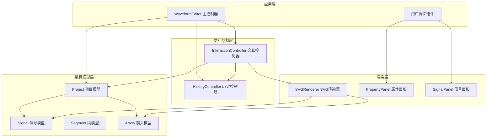
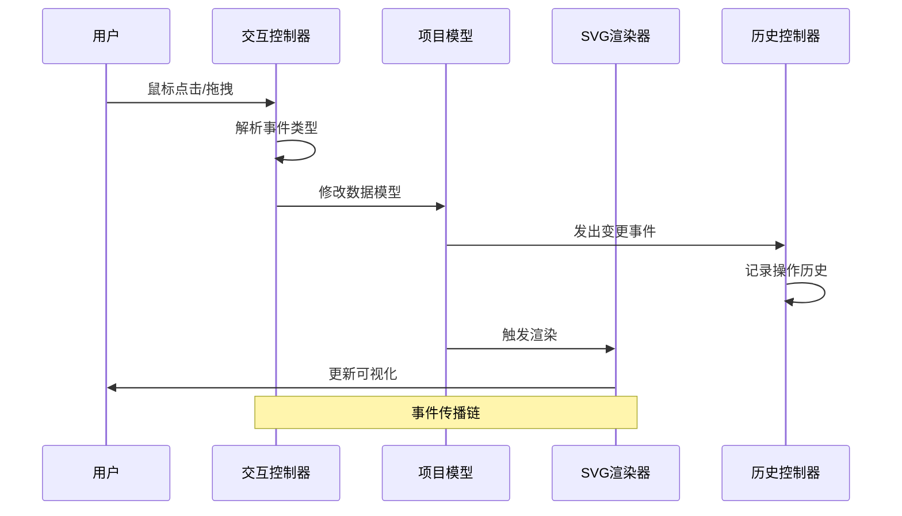
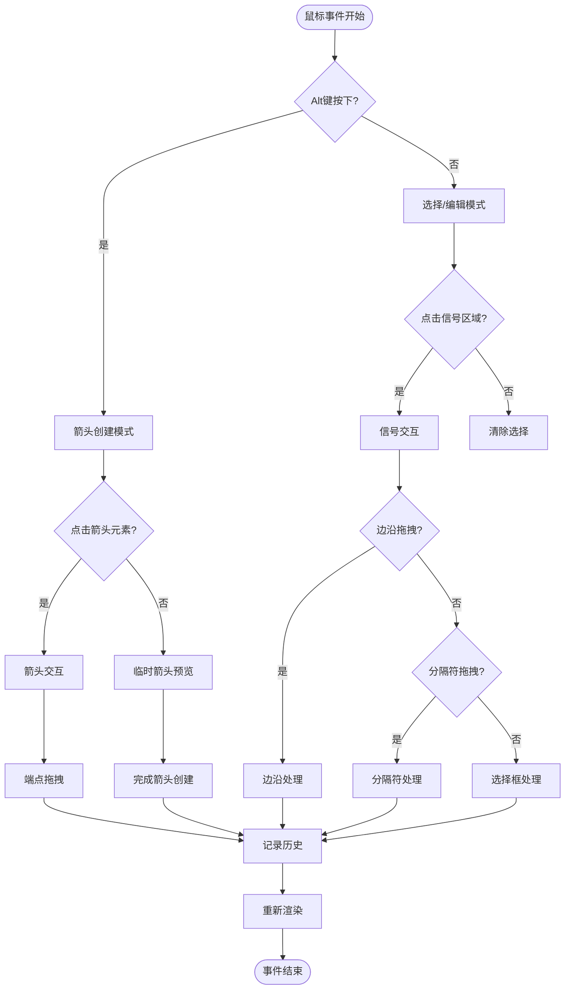
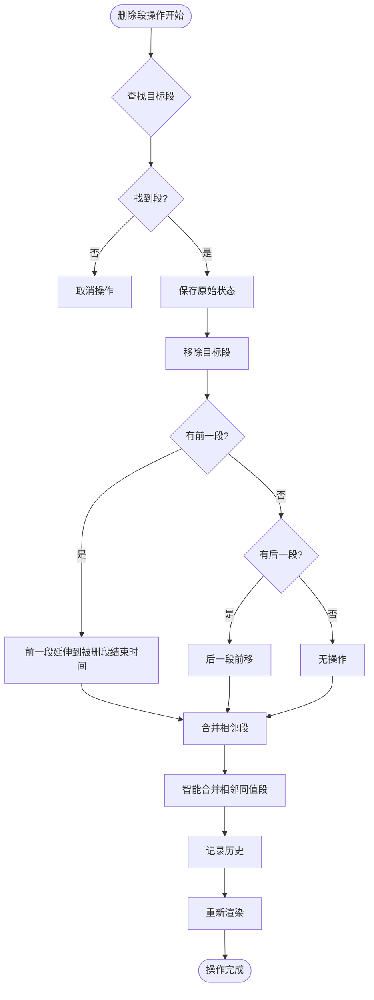
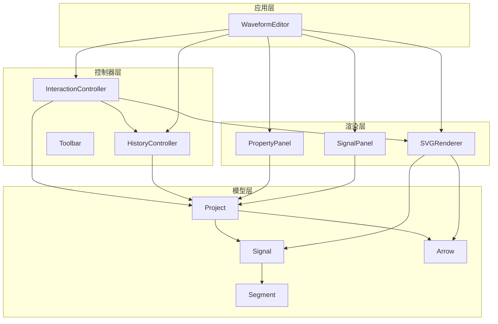

# 交互控制系统

<cite>
**本文档引用的文件**
- [InteractionController.js](file://src/controllers/InteractionController.js)
- [HistoryController.js](file://src/controllers/HistoryController.js)
- [Signal.js](file://src/models/Signal.js)
- [Segment.js](file://src/models/Segment.js)
- [Arrow.js](file://src/models/Arrow.js)
- [Project.js](file://src/models/Project.js)
- [SVGRenderer.js](file://src/renderers/SVGRenderer.js)
- [PropertyPanel.js](file://src/ui/PropertyPanel.js)
- [SignalPanel.js](file://src/ui/SignalPanel.js)
- [Toolbar.js](file://src/ui/Toolbar.js)
- [main.js](file://src/main.js)
</cite>

## 更新摘要
**变更内容**
- 新增总线信号段删除功能，支持智能合并相邻段
- 实现删除段操作的历史记录支持
- 增强总线信号编辑器的交互功能
- 完善撤销/重做系统对段删除操作的支持

## 目录
1. [简介](#简介)
2. [项目结构](#项目结构)
3. [核心组件](#核心组件)
4. [架构概览](#架构概览)
5. [详细组件分析](#详细组件分析)
6. [依赖关系分析](#依赖关系分析)
7. [性能考虑](#性能考虑)
8. [故障排除指南](#故障排除指南)
9. [结论](#结论)

## 简介

波形图编辑器的交互控制系统是一个复杂而精密的用户界面框架，负责处理各种用户输入和手势操作。该系统实现了完整的鼠标事件处理、键盘快捷键支持、拖拽操作机制，以及撤销/重做功能。系统采用模块化设计，通过控制器-模型-渲染器分离的架构，提供了流畅的用户体验和强大的编辑功能。

该交互控制系统的核心价值在于：
- **直观的波形编辑体验**：支持信号选择、波形段编辑、依赖箭头创建等核心功能
- **智能的拖拽机制**：提供精确的边沿拖拽、箭头端点拖拽、分隔符拖拽等操作
- **完善的撤销/重做系统**：基于命令模式的版本控制机制
- **响应式交互设计**：支持桌面和触摸设备的无缝切换
- **增强的总线信号支持**：新增段删除和智能合并功能

## 项目结构

波形图编辑器采用清晰的分层架构，将交互控制、数据模型、渲染逻辑和用户界面组件有效分离：



**图表来源**
- [main.js:21-44](file://src/main.js#L21-L44)
- [InteractionController.js:6-27](file://src/controllers/InteractionController.js#L6-L27)
- [HistoryController.js:5-11](file://src/controllers/HistoryController.js#L5-L11)

**章节来源**
- [main.js:49-132](file://src/main.js#L49-L132)
- [InteractionController.js:52-82](file://src/controllers/InteractionController.js#L52-L82)

## 核心组件

### 交互控制器 (InteractionController)

交互控制器是整个系统的核心，负责协调所有用户交互操作。它继承自控制器基类，实现了复杂的事件处理逻辑和状态管理。

**主要职责**：
- 处理鼠标和键盘事件
- 管理拖拽操作状态
- 协调信号选择和编辑
- 支持依赖箭头创建和编辑
- 集成撤销/重做功能
- **新增**：支持总线信号段删除和智能合并

**关键特性**：
- **多模式交互**：支持信号编辑、箭头创建、时间轴操作等多种交互模式
- **智能吸附**：提供边沿吸附、时钟信号对齐等智能功能
- **实时预览**：在拖拽过程中提供视觉反馈和预览效果
- **状态持久化**：维护复杂的交互状态并在适当时机清理
- **增强的总线编辑**：支持段级别的删除和颜色编辑

**章节来源**
- [InteractionController.js:6-27](file://src/controllers/InteractionController.js#L6-L27)
- [InteractionController.js:29-50](file://src/controllers/InteractionController.js#L29-L50)

### 历史控制器 (HistoryController)

历史控制器实现了基于命令模式的撤销/重做系统，为所有用户操作提供版本控制能力。

**核心机制**：
- **命令模式**：每个操作都被封装为可执行/可撤销的命令
- **栈式管理**：使用两个栈分别管理撤销和重做历史
- **内存优化**：限制历史记录数量，避免内存泄漏

**命令结构**：
```javascript
{
  type: 'moveEdge',
  signalId: 'sig_123',
  oldSegments: [...],
  undo: () => {...},
  redo: () => {...}
}
```

**新增支持的操作类型**：
- **deleteSegment**: 总线信号段删除操作
- **deleteGap**: 分隔符删除操作
- **addArrow**: 箭头创建操作

**章节来源**
- [HistoryController.js:5-56](file://src/controllers/HistoryController.js#L5-L56)

### 数据模型系统

系统包含完整的数据模型层次，为交互提供稳定的数据基础：

**信号模型 (Signal)**：
- 管理波形段集合
- 提供边沿吸附功能
- 支持时钟信号特殊处理
- **新增**：智能合并相邻同值段功能

**段模型 (Segment)**：
- 表示单一电平段
- 提供重叠检测和合并功能
- 支持时间范围查询
- 支持颜色属性（主要用于总线信号）

**箭头模型 (Arrow)**：
- 表示信号间的依赖关系
- 支持多标注标签
- 提供样式定制功能

**章节来源**
- [Signal.js:7-343](file://src/models/Signal.js#L7-L343)
- [Segment.js:5-94](file://src/models/Segment.js#L5-L94)
- [Arrow.js:5-114](file://src/models/Arrow.js#L5-L114)

## 架构概览

交互控制系统采用事件驱动的架构模式，通过清晰的职责分离实现了高度模块化的系统设计：



**图表来源**
- [InteractionController.js:84-184](file://src/controllers/InteractionController.js#L84-L184)
- [Project.js:199-202](file://src/models/Project.js#L199-L202)

**章节来源**
- [main.js:104-109](file://src/main.js#L104-L109)
- [SVGRenderer.js:284-314](file://src/renderers/SVGRenderer.js#L284-L314)

## 详细组件分析

### 鼠标事件处理机制

交互控制器实现了多层次的鼠标事件处理，能够精确识别不同类型的用户操作：

#### 事件分类与处理流程



**图表来源**
- [InteractionController.js:84-184](file://src/controllers/InteractionController.js#L84-L184)
- [InteractionController.js:465-567](file://src/controllers/InteractionController.js#L465-L567)

#### 特殊交互模式

**时间轴拖拽**：
- 支持边缘滚动功能
- 实现像素到时间的精确转换
- 提供视觉反馈和预览效果

**箭头端点拖拽**：
- 实现智能吸附到目标信号
- 提供实时预览和磁吸效果
- 支持双向箭头的特殊处理

**分隔符拖拽**：
- 限制在时间轴范围内
- 自动排序和去重
- 实时更新信号面板

**总线信号段删除**：
- **新增**：支持单个段的删除操作
- **智能合并**：删除后自动合并相邻同值段
- **历史记录**：完整的撤销/重做支持
- **边界处理**：正确处理删除段前后的边界连接

**章节来源**
- [InteractionController.js:186-337](file://src/controllers/InteractionController.js#L186-L337)
- [InteractionController.js:1187-1286](file://src/controllers/InteractionController.js#L1187-L1286)

### 键盘快捷键支持

系统提供了丰富的键盘快捷键支持，提升用户的操作效率：

#### 全局快捷键
- **Ctrl/Cmd + Z**: 撤销操作
- **Ctrl/Cmd + Y**: 重做操作
- **Delete**: 删除选中元素

#### 信号编辑快捷键
- **Alt + 鼠标拖拽**: 创建依赖箭头
- **双击箭头**: 添加标注
- **单击信号名称**: 弹出属性面板

#### 总线信号特殊处理
- **总线信号单击**: 弹出值编辑框
- **支持不定态 (X) 和高阻态 (Z)
- **颜色填充功能**
- **新增**：删除段按钮支持

**章节来源**
- [InteractionController.js:403-432](file://src/controllers/InteractionController.js#L403-L432)
- [InteractionController.js:904-927](file://src/controllers/InteractionController.js#L904-L927)

### 撤销/重做系统

历史控制器实现了完整的命令模式撤销/重做系统：

#### 命令结构设计
每个命令都包含以下关键信息：
- **type**: 操作类型标识
- **undo**: 撤销函数
- **redo**: 重做函数
- **状态快照**: 操作前后的数据状态

#### 历史管理策略
- **最大历史数量**: 默认限制为50条
- **内存优化**: 超限时自动清理最旧记录
- **实时同步**: 每次操作都会更新两个历史栈

#### 操作类型示例
- **moveEdge**: 边沿位置移动
- **setLevel**: 电平值设置
- **moveArrowEndpoint**: 箭头端点移动
- **addSignal**: 信号添加
- **deleteSegment**: **新增** 总线信号段删除
- **deleteGap**: 分隔符删除

**章节来源**
- [HistoryController.js:13-42](file://src/controllers/HistoryController.js#L13-L42)
- [InteractionController.js:809-841](file://src/controllers/InteractionController.js#L809-L841)

### 总线信号智能合并功能

**新增功能**：总线信号段删除后自动合并相邻同值段

#### 删除段操作流程



**图表来源**
- [InteractionController.js:1093-1130](file://src/controllers/InteractionController.js#L1093-L1130)

#### 智能合并算法

**合并条件**：
- 相邻段的结束时间等于下一段的开始时间
- 相邻段的电平值相同
- 相邻段的颜色属性相同

**合并过程**：
1. 检查相邻段的边界连接
2. 验证电平值和颜色的一致性
3. 合并满足条件的相邻段
4. 重复直到无法继续合并

**章节来源**
- [InteractionController.js:1093-1130](file://src/controllers/InteractionController.js#L1093-L1130)
- [Signal.js:159-176](file://src/models/Signal.js#L159-L176)

### 触摸设备支持

系统提供了完整的触摸设备支持，确保在移动设备上的良好体验：

#### 触摸交互特性
- **响应式布局**: 自适应不同屏幕尺寸
- **手势识别**: 支持基本的拖拽和点击手势
- **触觉反馈**: 提供适当的视觉和触觉反馈

#### 移动端优化
- **缩放适配**: 自动调整渲染尺寸
- **触摸友好的控件**: 增大点击区域
- **离线支持**: 支持本地存储和离线编辑

**章节来源**
- [main.js:588-595](file://src/main.js#L588-L595)
- [SVGRenderer.js:194-243](file://src/renderers/SVGRenderer.js#L194-L243)

## 依赖关系分析

交互控制系统中的组件依赖关系体现了清晰的分层架构：



**图表来源**
- [main.js:104-117](file://src/main.js#L104-L117)
- [InteractionController.js:6-11](file://src/controllers/InteractionController.js#L6-L11)

**章节来源**
- [Project.js:5-7](file://src/models/Project.js#L5-L7)
- [Signal.js:5-6](file://src/models/Signal.js#L5-L6)

## 性能考虑

系统在设计时充分考虑了性能优化，采用了多种策略确保流畅的用户体验：

### 渲染优化
- **增量渲染**: 只更新发生变化的部分
- **虚拟DOM**: 减少DOM操作次数
- **请求动画帧**: 使用requestAnimationFrame优化动画

### 内存管理
- **对象池**: 复用临时对象减少GC压力
- **事件委托**: 减少事件监听器数量
- **懒加载**: 按需加载资源和组件

### 交互响应
- **防抖处理**: 避免频繁的事件触发
- **节流机制**: 控制高频操作的执行频率
- **异步处理**: 将耗时操作放到后台线程

## 故障排除指南

### 常见问题及解决方案

**事件处理异常**
- 检查事件监听器是否正确绑定
- 确认事件冒泡和捕获的处理逻辑
- 验证事件参数的正确性

**渲染问题**
- 检查SVG元素的属性设置
- 验证坐标转换的准确性
- 确认CSS样式的正确应用

**历史记录异常**
- 检查命令的undo/redo函数实现
- 验证状态快照的完整性
- 确认历史栈的状态同步

**内存泄漏**
- 检查事件监听器的清理
- 验证定时器的正确释放
- 确认DOM元素的正确移除

**总线信号合并问题**
- **新增**：检查相邻段的边界连接是否正确
- **新增**：验证电平值和颜色属性的一致性
- **新增**：确认合并算法的执行顺序

**章节来源**
- [InteractionController.js:1409-1420](file://src/controllers/InteractionController.js#L1409-L1420)
- [HistoryController.js:44-47](file://src/controllers/HistoryController.js#L44-L47)

## 结论

波形图编辑器的交互控制系统展现了现代Web应用开发的最佳实践。通过精心设计的架构和实现，系统提供了：
- **直观易用的用户界面**：支持复杂的波形编辑操作
- **强大的功能特性**：涵盖信号编辑、箭头创建、时间轴操作等核心功能
- **可靠的稳定性**：完善的错误处理和性能优化
- **良好的扩展性**：模块化设计便于功能扩展和维护
- **增强的总线信号支持**：新增段删除和智能合并功能，提供更完整的总线编辑体验

该系统的设计理念和实现方式为类似的图形编辑器开发提供了宝贵的参考，展示了如何在保证功能完整性的同时，实现优秀的用户体验和系统性能。新增的总线信号智能合并功能进一步提升了系统的专业性和实用性，为复杂的数字电路设计提供了强有力的支持。