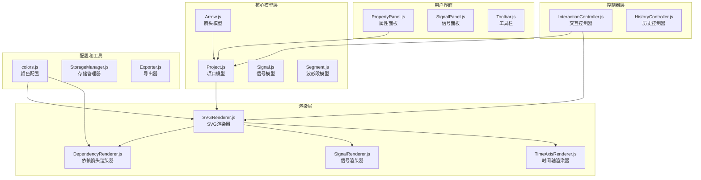
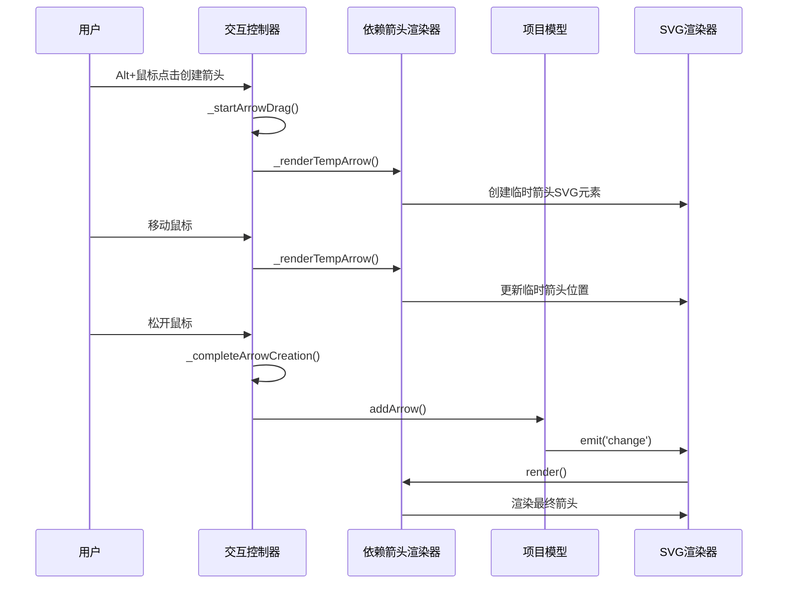
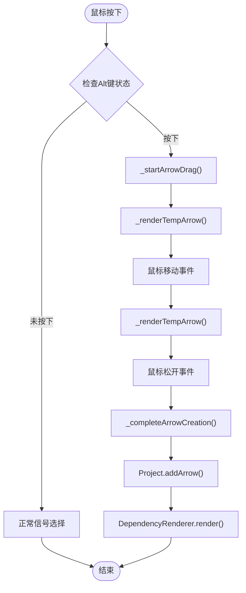
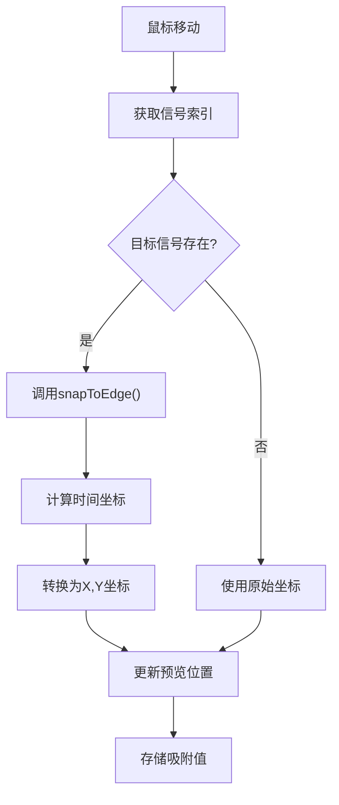
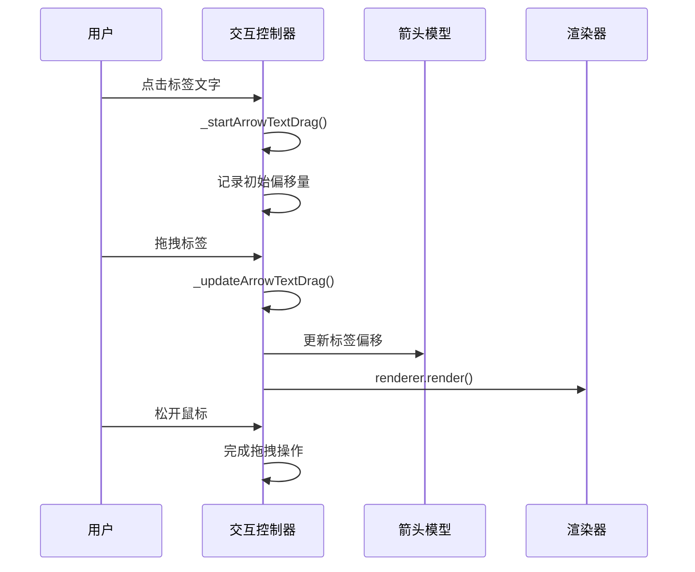
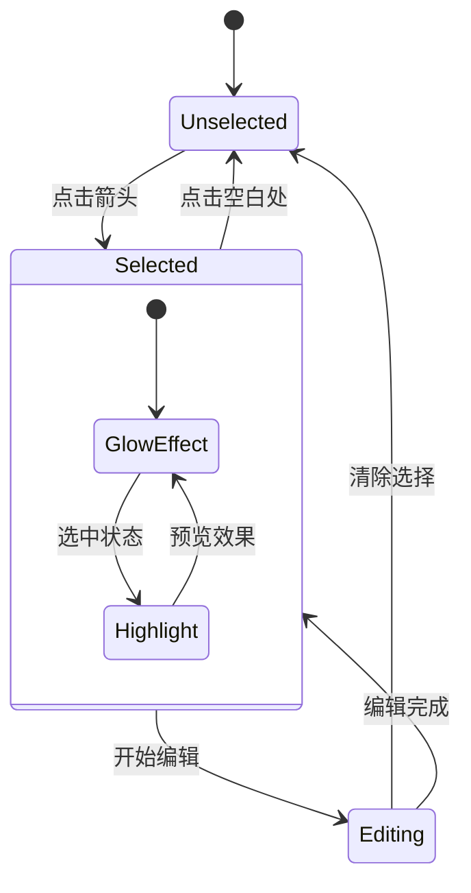
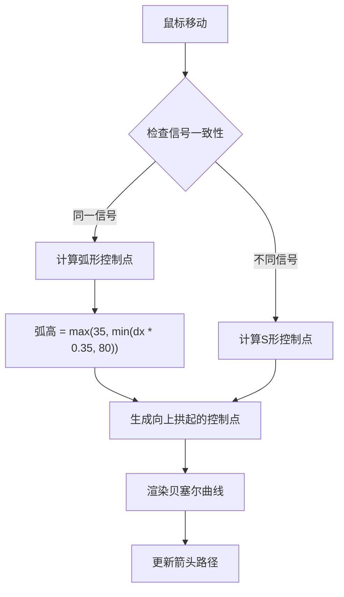
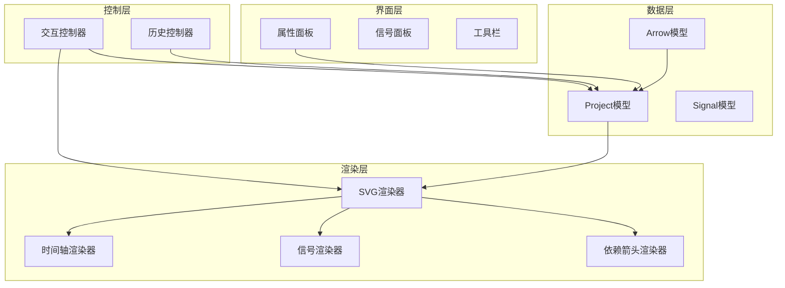

# 依赖箭头管理

<cite>
**本文档引用的文件**
- [src/models/Arrow.js](file://src/models/Arrow.js)
- [src/models/Project.js](file://src/models/Project.js)
- [src/renderers/DependencyRenderer.js](file://src/renderers/DependencyRenderer.js)
- [src/renderers/SVGRenderer.js](file://src/renderers/SVGRenderer.js)
- [src/controllers/InteractionController.js](file://src/controllers/InteractionController.js)
- [src/config/colors.js](file://src/config/colors.js)
- [src/main.js](file://src/main.js)
- [src/ui/PropertyPanel.js](file://src/ui/PropertyPanel.js)
</cite>

## 更新摘要
**变更内容**
- 新增同信号弧形箭头渲染功能，支持向上拱起的贝塞尔曲线
- 更新控制点计算算法，区分同信号和跨信号箭头的不同处理方式
- 增强箭头视觉效果和用户体验，改善同信号自连接箭头的显示质量

## 目录
1. [简介](#简介)
2. [项目结构](#项目结构)
3. [核心组件](#核心组件)
4. [架构概览](#架构概览)
5. [详细组件分析](#详细组件分析)
6. [依赖关系分析](#依赖关系分析)
7. [性能考虑](#性能考虑)
8. [故障排除指南](#故障排除指南)
9. [结论](#结论)

## 简介

依赖箭头管理系统是波形图编辑器的核心功能模块之一，负责管理信号之间的依赖关系。该系统提供了完整的箭头创建、编辑、渲染和交互功能，包括Alt键触发机制、临时箭头渲染、箭头吸附功能、端点拖拽、文字标签拖拽和箭头删除操作。

**更新** 新增了同信号弧形箭头渲染功能，支持向上拱起的贝塞尔曲线，显著改善了同信号自连接箭头的视觉效果和用户体验。

## 项目结构

该项目采用模块化架构设计，主要包含以下核心目录和文件：

**图表来源**
- [src/models/Arrow.js:1-114](file://src/models/Arrow.js#L1-L114)
- [src/renderers/DependencyRenderer.js:1-297](file://src/renderers/DependencyRenderer.js#L1-L297)
- [src/controllers/InteractionController.js:1-1534](file://src/controllers/InteractionController.js#L1-L1534)

**章节来源**
- [src/main.js:1-819](file://src/main.js#L1-L819)

## 核心组件

### 箭头模型 (Arrow)

Arrow类是依赖箭头的核心数据模型，负责表示信号之间的依赖关系。其主要特性包括：

- **唯一标识符**: 自动生成的唯一ID
- **端点信息**: 起点和终点的信号ID及时间坐标
- **控制点**: 用于贝塞尔曲线的控制点偏移
- **方向属性**: 支持自动、正向、反向三种模式
- **双向箭头**: 支持双向箭头显示
- **标签系统**: 支持多个文字标签，每个标签包含文本内容和偏移量
- **样式配置**: 支持颜色、线宽、箭头大小、虚线样式等

### 项目模型 (Project)

Project类管理整个波形图项目的数据结构，包含：

- **信号集合**: 管理所有信号对象
- **箭头集合**: 管理所有依赖箭头
- **时间轴配置**: 管理时间轴的起始、结束时间和缩放比例
- **事件系统**: 提供change事件通知机制

### 依赖箭头渲染器 (DependencyRenderer)

DependencyRenderer专门负责渲染依赖箭头，具有以下功能：

- **贝塞尔曲线计算**: 生成平滑的S形曲线连接两个信号
- **防重叠处理**: 同一起点或多箭头时的垂直偏移处理
- **双向箭头支持**: 根据配置显示正向或双向箭头
- **命中区域**: 透明的命中区域便于选择和拖拽
- **标签渲染**: 支持多个标签的渲染和交互
- **同信号弧形渲染**: 特殊处理同信号箭头的向上拱起弧线

**更新** 新增了同信号弧形箭头渲染功能，当起点和终点位于同一信号线上时，会生成向上拱起的贝塞尔曲线，而不是简单的直线或普通的S形曲线。

**章节来源**
- [src/models/Arrow.js:1-114](file://src/models/Arrow.js#L1-L114)
- [src/models/Project.js:1-245](file://src/models/Project.js#L1-L245)
- [src/renderers/DependencyRenderer.js:1-297](file://src/renderers/DependencyRenderer.js#L1-L297)

## 架构概览

依赖箭头管理系统采用分层架构设计，各层职责明确：

**图表来源**
- [src/controllers/InteractionController.js:581-779](file://src/controllers/InteractionController.js#L581-L779)
- [src/renderers/DependencyRenderer.js:18-84](file://src/renderers/DependencyRenderer.js#L18-L84)

系统的关键交互流程包括：

1. **Alt键触发机制**: 检测Alt键按下状态，切换到箭头创建模式
2. **临时箭头渲染**: 实时渲染跟随鼠标的临时箭头
3. **吸附功能**: 自动吸附到目标信号的最近跳变沿
4. **箭头创建完成**: 将临时箭头转换为永久箭头并添加到项目中

**更新** 新增了同信号弧形箭头的特殊处理逻辑，在控制点计算阶段区分同信号和跨信号箭头的不同渲染策略。

## 详细组件分析

### Alt键触发机制

Alt键触发机制是箭头创建流程的核心入口：

**图表来源**
- [src/controllers/InteractionController.js:177-181](file://src/controllers/InteractionController.js#L177-L181)
- [src/controllers/InteractionController.js:581-591](file://src/controllers/InteractionController.js#L581-L591)

### 临时箭头渲染系统

临时箭头渲染系统提供了实时的视觉反馈：

| 功能特性 | 实现方式 | 参数说明 |
|---------|----------|----------|
| 贝塞尔曲线控制点 | `Math.min(dx * 0.5, 150)` | 控制曲线弯曲程度 |
| 同信号弧形控制点 | `Math.max(35, Math.min(dx * 0.35, 80))` | 向上拱起的弧线高度 |
| 箭头吸附 | `snapToEdge()`方法 | 自动对齐到信号跳变沿 |
| 透明度效果 | `rgba(0, 120, 215, 0.6)` | 半透明显示临时箭头 |
| 虚线样式 | `stroke-dasharray: '5,3'` | 区分临时和永久箭头 |

**更新** 新增了同信号弧形箭头的特殊控制点计算，当起点和终点在同一信号线上时，会生成向上拱起的弧线，弧高范围为35-80像素之间。

### 箭头吸附功能

吸附功能确保箭头端点能够精确对齐到目标信号：

**图表来源**
- [src/controllers/InteractionController.js:698-714](file://src/controllers/InteractionController.js#L698-L714)
- [src/controllers/InteractionController.js:257-282](file://src/controllers/InteractionController.js#L257-L282)

### 箭头编辑功能

系统提供了完整的箭头编辑功能：

#### 端点拖拽编辑

端点拖拽功能允许用户重新定位箭头的起点或终点：

| 拖拽类型 | 触发条件 | 预览效果 | 数据更新 |
|---------|----------|----------|----------|
| 起点拖拽 | 点击起点圆圈 | 虚线预览圆圈 | 更新`fromTime`和`fromSignalId` |
| 终点拖拽 | 点击终点圆圈 | 虚线预览圆圈 | 更新`toTime`和`toSignalId` |
| 边界检查 | 拖拽过程 | 防止起点终点相同 | 验证数据有效性 |

#### 文字标签拖拽

文字标签支持独立的拖拽编辑：

**图表来源**
- [src/controllers/InteractionController.js:596-629](file://src/controllers/InteractionController.js#L596-L629)

#### 箭头删除操作

删除操作通过键盘快捷键实现：

| 操作方式 | 触发条件 | 行为描述 |
|---------|----------|----------|
| Delete键 | 选中箭头时 | 删除当前选中的箭头 |
| 双击标签 | 双击箭头标签 | 选中箭头并打开属性面板 |
| 双击箭头 | 双击箭头主体 | 添加新的标签 |

### 箭头选择机制和视觉反馈

选择机制提供了清晰的视觉反馈：

**图表来源**
- [src/renderers/DependencyRenderer.js:148-162](file://src/renderers/DependencyRenderer.js#L148-L162)
- [src/controllers/InteractionController.js:1348-1355](file://src/controllers/InteractionController.js#L1348-L1355)

### 箭头标签管理系统

标签系统支持多标签管理：

| 标签操作 | 方法 | 功能描述 |
|---------|------|----------|
| 添加标签 | `addLabel(text, offset)` | 添加新的标签到箭头 |
| 删除标签 | `removeLabel(labelId)` | 从箭头移除指定标签 |
| 查找标签 | `getLabelById(labelId)` | 根据ID获取标签对象 |
| 文本访问 | `text` getter/setter | 兼容旧版本的文本访问 |
| 偏移访问 | `textOffset` getter/setter | 标签位置偏移管理 |

**章节来源**
- [src/models/Arrow.js:78-94](file://src/models/Arrow.js#L78-L94)
- [src/controllers/InteractionController.js:437-463](file://src/controllers/InteractionController.js#L437-L463)

### 同信号弧形箭头渲染系统

**新增功能** 同信号弧形箭头渲染系统是本次更新的核心功能，专门处理同一信号线上的自连接箭头：

**图表来源**
- [src/renderers/DependencyRenderer.js:281-288](file://src/renderers/DependencyRenderer.js#L281-L288)
- [src/controllers/InteractionController.js:719-724](file://src/controllers/InteractionController.js#L719-L724)

#### 弧形控制点计算算法

同信号箭头的控制点计算遵循以下规则：

1. **弧高计算**: `arcHeight = Math.max(35, Math.min(dx * 0.35, 80))`
   - 最小弧高：35像素
   - 最大弧高：80像素
   - 动态弧高：根据水平距离的35%计算

2. **控制点位置**:
   - `cp1.x = fromX + dx * 0.3 * direction`
   - `cp1.y = fromY - arcHeight`
   - `cp2.x = toX - dx * 0.3 * direction`
   - `cp2.y = toY - arcHeight`

3. **方向处理**: 根据箭头方向调整控制点的水平位置

#### 视觉效果增强

同信号弧形箭头相比普通S形曲线具有以下优势：

- **更好的视觉层次**: 向上拱起的弧线更加突出
- **更强的识别度**: 自连接箭头更容易被识别
- **更佳的用户体验**: 符合用户对自连接关系的预期
- **统一的视觉风格**: 与其他UI元素保持一致的曲线风格

**章节来源**
- [src/renderers/DependencyRenderer.js:281-296](file://src/renderers/DependencyRenderer.js#L281-L296)
- [src/controllers/InteractionController.js:719-728](file://src/controllers/InteractionController.js#L719-L728)

## 依赖关系分析

依赖箭头管理系统的核心依赖关系如下：

**图表来源**
- [src/main.js:1-819](file://src/main.js#L1-L819)
- [src/renderers/SVGRenderer.js:1-200](file://src/renderers/SVGRenderer.js#L1-L200)

### 组件耦合度分析

系统采用松耦合设计，各组件间通过清晰的接口进行通信：

- **低耦合**: 渲染器与控制器分离，通过事件系统通信
- **高内聚**: 每个组件专注于特定功能领域
- **可扩展性**: 新增功能可通过扩展接口实现

### 外部依赖集成

系统集成了多种外部功能：

- **颜色配置**: 通过colors.js集中管理所有颜色
- **事件系统**: 基于标准DOM事件和自定义事件
- **本地存储**: 支持项目数据的持久化存储

**章节来源**
- [src/config/colors.js:1-83](file://src/config/colors.js#L1-L83)
- [src/renderers/SVGRenderer.js:1-200](file://src/renderers/SVGRenderer.js#L1-L200)

## 性能考虑

依赖箭头管理系统在性能方面采用了多项优化策略：

### 渲染优化

1. **分层渲染**: 将不同类型的元素渲染到不同的SVG组中
2. **增量更新**: 仅更新发生变化的部分，而非整幅画面
3. **虚拟DOM**: 使用createElement创建SVG元素，提高渲染效率
4. **弧形计算优化**: 同信号箭头使用快速的弧形计算算法

### 内存管理

1. **对象池**: 复用SVG元素，减少DOM操作
2. **事件清理**: 及时移除不再使用的事件监听器
3. **垃圾回收**: 合理管理临时对象的生命周期

### 交互响应

1. **请求动画帧**: 使用requestAnimationFrame优化动画性能
2. **节流处理**: 对频繁触发的事件进行节流处理
3. **延迟渲染**: 对复杂的渲染操作进行延迟执行

### 同信号弧形渲染性能

**新增优化** 同信号弧形箭头渲染在性能方面的优化：

- **快速判断**: 使用`Math.abs(y2 - y1) < 5`快速判断同信号情况
- **简单计算**: 弧形控制点计算比S形曲线更简单
- **缓存机制**: 弧高计算结果可根据距离动态缓存

## 故障排除指南

### 常见问题及解决方案

#### 箭头无法创建

**问题症状**: Alt+点击无反应

**可能原因**:
1. 事件监听器未正确绑定
2. 信号索引计算错误
3. 项目数据状态异常

**解决步骤**:
1. 检查`_setupEventListeners()`方法是否执行
2. 验证`getSignalIndexByY()`方法的返回值
3. 确认项目状态的完整性

#### 箭头吸附不准确

**问题症状**: 箭头端点无法吸附到目标信号

**可能原因**:
1. 信号跳变沿检测算法问题
2. 坐标转换计算错误
3. 信号索引映射异常

**解决步骤**:
1. 检查`snapToEdge()`方法的实现
2. 验证坐标转换函数的准确性
3. 确认信号索引的正确性

#### 同信号弧形渲染异常

**问题症状**: 同信号箭头没有显示为弧形

**可能原因**:
1. 同信号判断逻辑错误
2. 控制点计算公式异常
3. SVG路径生成错误

**解决步骤**:
1. 检查`Math.abs(y2 - y1) < 5`判断条件
2. 验证弧高计算公式：`Math.max(35, Math.min(dx * 0.35, 80))`
3. 确认控制点坐标计算的正确性

#### 渲染性能问题

**问题症状**: 箭头渲染卡顿或延迟

**可能原因**:
1. SVG元素过多导致的渲染压力
2. 事件处理函数执行时间过长
3. 重复渲染操作

**解决步骤**:
1. 优化SVG元素的创建和复用
2. 减少事件处理函数的计算量
3. 实施渲染缓存机制

**章节来源**
- [src/controllers/InteractionController.js:84-82](file://src/controllers/InteractionController.js#L84-L82)
- [src/renderers/DependencyRenderer.js:18-84](file://src/renderers/DependencyRenderer.js#L18-L84)

## 结论

依赖箭头管理系统是一个功能完整、架构清晰的模块化系统。它通过合理的分层设计、完善的事件处理机制和高效的渲染策略，为用户提供了一个流畅的箭头创建和编辑体验。

**更新** 本次更新新增的同信号弧形箭头渲染功能显著提升了系统的视觉效果和用户体验。该功能通过智能的弧形控制点计算，为同一信号线上的自连接箭头提供了更加美观和直观的显示方式。

系统的主要优势包括：

1. **直观的交互设计**: Alt键触发机制符合用户预期
2. **精确的吸附功能**: 确保箭头端点能够准确定位
3. **丰富的编辑能力**: 支持端点拖拽、标签编辑等多种操作
4. **优秀的视觉效果**: 同信号弧形箭头提供了更好的视觉层次
5. **良好的性能表现**: 通过多种优化策略保证系统响应速度
6. **可扩展的架构**: 清晰的模块划分便于功能扩展和维护

未来可以考虑的改进方向：
- 增加箭头样式自定义功能
- 实现箭头批量操作支持
- 优化大型项目的数据处理性能
- 添加箭头关系验证和约束检查
- 扩展弧形箭头的动画效果