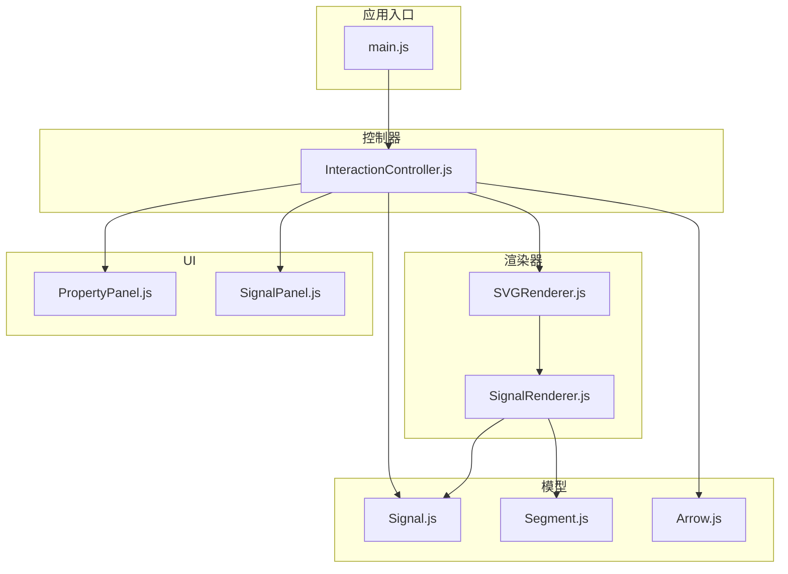
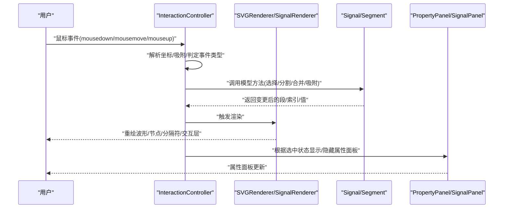
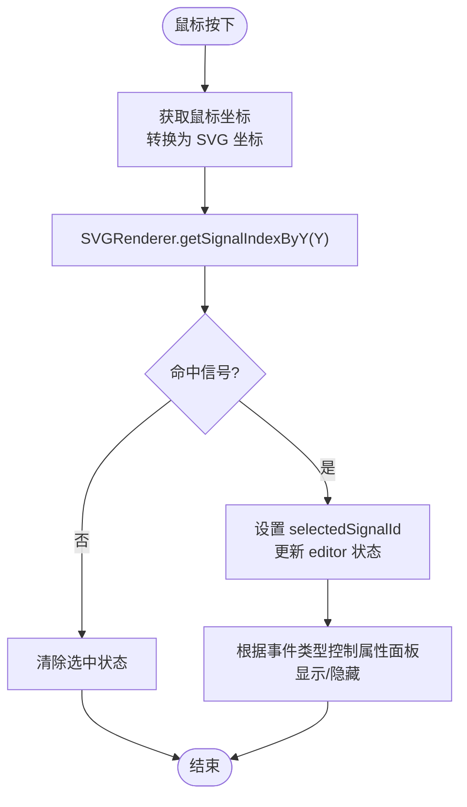
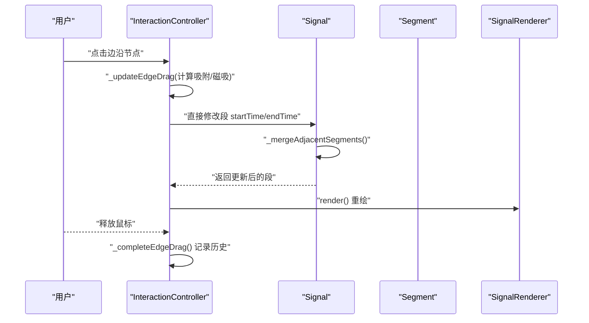
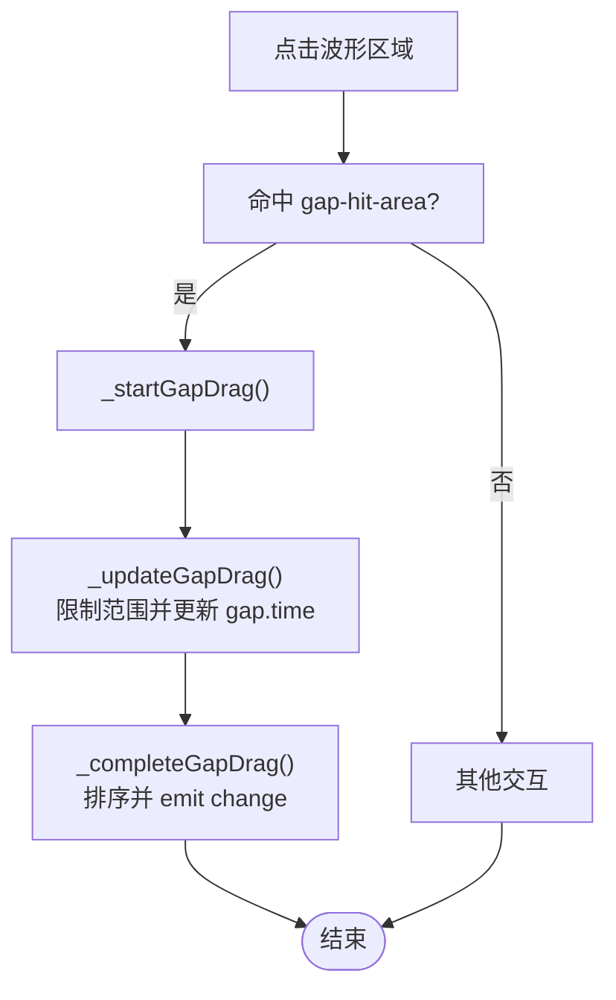
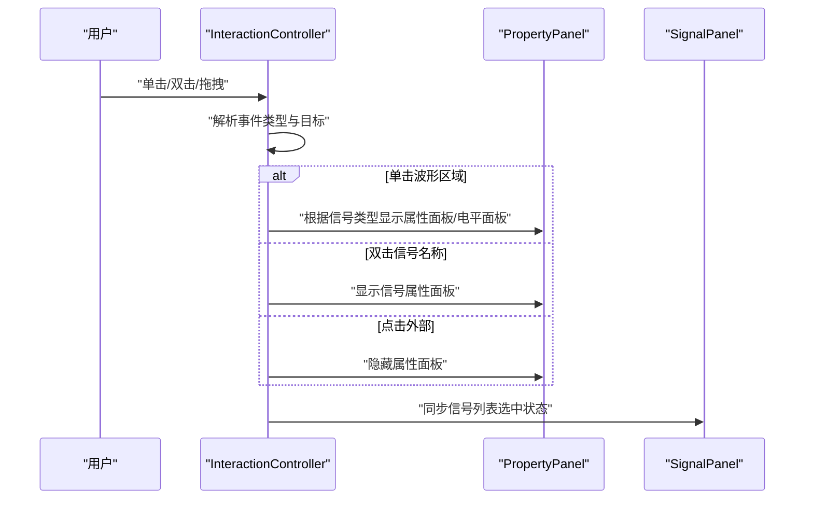
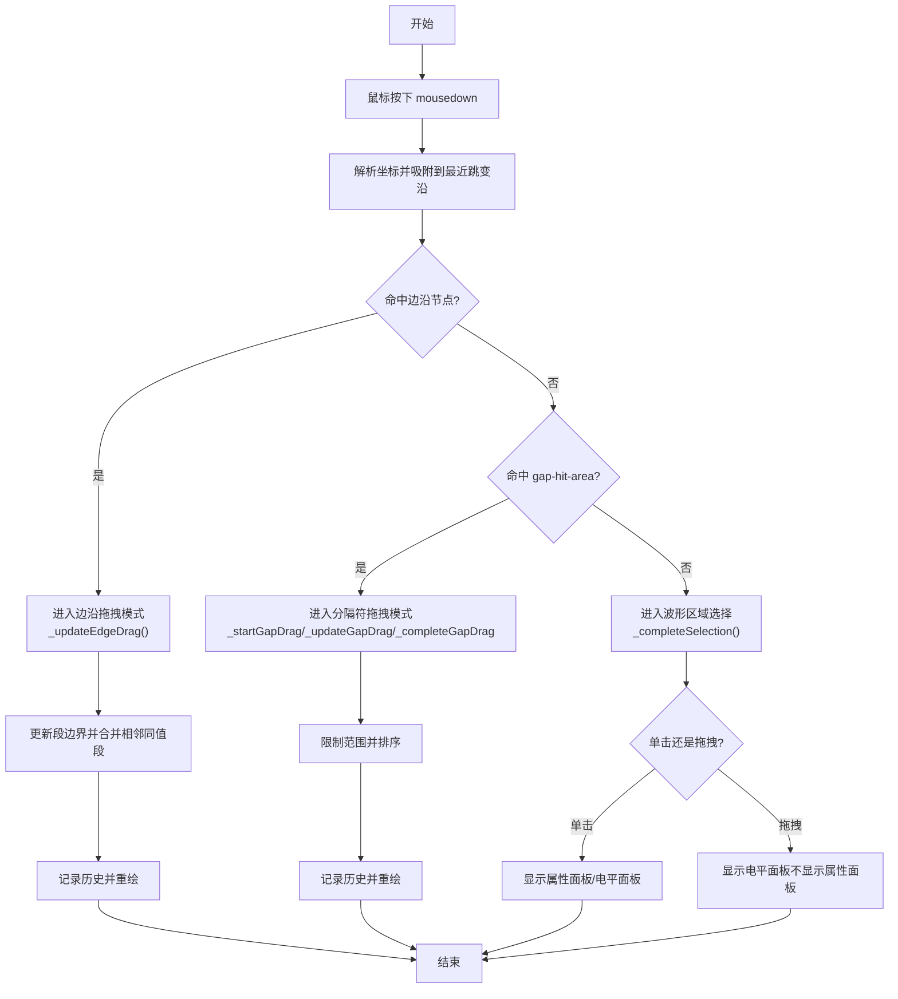
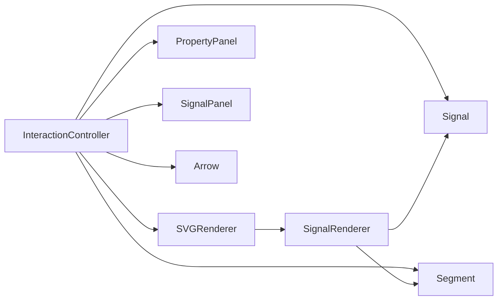

# 信号编辑操作

<cite>
**本文引用的文件**
- [Signal.js](file://src/models/Signal.js)
- [Segment.js](file://src/models/Segment.js)
- [InteractionController.js](file://src/controllers/InteractionController.js)
- [SignalRenderer.js](file://src/renderers/SignalRenderer.js)
- [SVGRenderer.js](file://src/renderers/SVGRenderer.js)
- [PropertyPanel.js](file://src/ui/PropertyPanel.js)
- [SignalPanel.js](file://src/ui/SignalPanel.js)
- [Arrow.js](file://src/models/Arrow.js)
- [main.js](file://src/main.js)
</cite>

## 目录
1. [简介](#简介)
2. [项目结构](#项目结构)
3. [核心组件](#核心组件)
4. [架构总览](#架构总览)
5. [详细组件分析](#详细组件分析)
6. [依赖分析](#依赖分析)
7. [性能考虑](#性能考虑)
8. [故障排查指南](#故障排查指南)
9. [结论](#结论)
10. [附录](#附录)

## 简介
本文件围绕“信号编辑操作”进行系统化技术文档编写，重点覆盖以下方面：
- 信号选择机制：信号行点击检测、信号索引获取、信号状态管理
- 波形段编辑：边沿节点拖拽、波形段分割与合并
- 分隔符（gap）拖拽：创建、编辑、删除
- 信号属性面板的自动弹出与隐藏机制
- 提供完整的信号编辑流程图与代码示例路径，帮助开发者理解核心算法与状态转换

## 项目结构
该项目采用模块化架构，主要目录与职责如下：
- models：信号与波形段等数据模型
- renderers：SVG 渲染器与子渲染器（信号、时间轴、依赖箭头）
- controllers：交互控制器，负责事件处理与状态机
- ui：用户界面组件（属性面板、信号面板、工具栏）
- io：导入导出与本地存储
- main：应用入口与生命周期管理

图表来源
- [main.js:1-132](file://src/main.js#L1-L132)
- [InteractionController.js:1-82](file://src/controllers/InteractionController.js#L1-L82)
- [Signal.js:1-343](file://src/models/Signal.js#L1-L343)
- [Segment.js:1-94](file://src/models/Segment.js#L1-L94)
- [Arrow.js:1-114](file://src/models/Arrow.js#L1-L114)
- [SVGRenderer.js:1-100](file://src/renderers/SVGRenderer.js#L1-L100)
- [SignalRenderer.js:1-501](file://src/renderers/SignalRenderer.js#L1-L501)
- [PropertyPanel.js:1-507](file://src/ui/PropertyPanel.js#L1-L507)
- [SignalPanel.js:1-164](file://src/ui/SignalPanel.js#L1-L164)

章节来源
- [main.js:1-132](file://src/main.js#L1-L132)

## 核心组件
- Signal/Segment：信号与波形段的数据模型，提供吸附、分割、合并、查询等能力
- InteractionController：交互控制中枢，处理鼠标事件、拖拽、吸附、历史记录等
- SignalRenderer/SVGRenderer：渲染器，负责信号波形、跳变沿节点、分隔符、网格等绘制
- PropertyPanel/SignalPanel：属性面板与信号列表面板，负责属性编辑与信号管理
- Arrow：依赖箭头模型，支持端点拖拽、样式与标注编辑

章节来源
- [Signal.js:1-343](file://src/models/Signal.js#L1-L343)
- [Segment.js:1-94](file://src/models/Segment.js#L1-L94)
- [InteractionController.js:1-1420](file://src/controllers/InteractionController.js#L1-L1420)
- [SignalRenderer.js:1-501](file://src/renderers/SignalRenderer.js#L1-L501)
- [SVGRenderer.js:1-547](file://src/renderers/SVGRenderer.js#L1-L547)
- [PropertyPanel.js:1-507](file://src/ui/PropertyPanel.js#L1-L507)
- [SignalPanel.js:1-164](file://src/ui/SignalPanel.js#L1-L164)
- [Arrow.js:1-114](file://src/models/Arrow.js#L1-L114)

## 架构总览
信号编辑的交互流大致如下：
- 用户在波形区域点击/拖拽，由 InteractionController 解析事件并定位信号与时间
- 根据事件类型执行不同操作：选择信号、弹出电平面板、拖拽边沿、拖拽分隔符、创建/移动箭头等
- Signal/Segment 模型负责数据变更与一致性（合并、分割、吸附）
- 渲染器根据模型状态重绘波形、节点、分隔符与交互层
- PropertyPanel/SignalPanel 根据选中状态动态显示/隐藏

图表来源
- [InteractionController.js:84-337](file://src/controllers/InteractionController.js#L84-L337)
- [Signal.js:164-288](file://src/models/Signal.js#L164-L288)
- [SignalRenderer.js:22-144](file://src/renderers/SignalRenderer.js#L22-L144)
- [PropertyPanel.js:32-237](file://src/ui/PropertyPanel.js#L32-L237)

## 详细组件分析

### 信号选择机制
- 信号行点击检测：通过 SVGRenderer 的坐标系与信号布局计算，使用 getSignalIndexByY 将 Y 坐标映射到信号索引
- 信号索引获取：SVGRenderer.getSignalIndexByY 返回 -1 表示未命中，否则返回对应信号索引
- 信号状态管理：InteractionController 维护 selectedSignalId、selectedSegmentIndex，并在 editor 中同步渲染与面板状态

图表来源
- [SVGRenderer.js:268-279](file://src/renderers/SVGRenderer.js#L268-L279)
- [InteractionController.js:134-184](file://src/controllers/InteractionController.js#L134-L184)
- [InteractionController.js:1370-1407](file://src/controllers/InteractionController.js#L1370-L1407)

章节来源
- [SVGRenderer.js:268-279](file://src/renderers/SVGRenderer.js#L268-L279)
- [InteractionController.js:134-184](file://src/controllers/InteractionController.js#L134-L184)
- [InteractionController.js:1370-1407](file://src/controllers/InteractionController.js#L1370-L1407)

### 波形段编辑：边沿节点拖拽、分割与合并
- 边沿节点拖拽：识别 edge-node 命中，进入 _updateEdgeDrag/_completeEdgeDrag 流程
- 分割与合并：Signal.addSegment 基于时间重叠进行分割，随后 _mergeAdjacentSegments 合并相邻同值段
- 吸附与磁吸：snapToEdge 提供边界吸附；边沿拖拽时对时钟信号进行磁吸

图表来源
- [InteractionController.js:497-526](file://src/controllers/InteractionController.js#L497-L526)
- [InteractionController.js:1187-1286](file://src/controllers/InteractionController.js#L1187-L1286)
- [Signal.js:62-133](file://src/models/Signal.js#L62-L133)
- [Signal.js:138-155](file://src/models/Signal.js#L138-L155)
- [Signal.js:202-220](file://src/models/Signal.js#L202-L220)

章节来源
- [InteractionController.js:497-526](file://src/controllers/InteractionController.js#L497-L526)
- [InteractionController.js:1187-1286](file://src/controllers/InteractionController.js#L1187-L1286)
- [Signal.js:62-133](file://src/models/Signal.js#L62-L133)
- [Signal.js:138-155](file://src/models/Signal.js#L138-L155)
- [Signal.js:202-220](file://src/models/Signal.js#L202-L220)

### 分隔符（gap）拖拽：创建、编辑、删除
- 创建：在电平面板中选择“分隔符”，或在总线值编辑中添加分隔符，写入 signal.gaps 并排序
- 编辑：命中 gap-hit-area，进入 _startGapDrag/_updateGapDrag/_completeGapDrag，限制在时间轴范围内并排序
- 删除：Delete 键删除选中的分隔符

图表来源
- [InteractionController.js:535-544](file://src/controllers/InteractionController.js#L535-L544)
- [InteractionController.js:1291-1343](file://src/controllers/InteractionController.js#L1291-L1343)
- [SignalRenderer.js:180-192](file://src/renderers/SignalRenderer.js#L180-L192)
- [InteractionController.js:411-424](file://src/controllers/InteractionController.js#L411-L424)

章节来源
- [InteractionController.js:535-544](file://src/controllers/InteractionController.js#L535-L544)
- [InteractionController.js:1291-1343](file://src/controllers/InteractionController.js#L1291-L1343)
- [SignalRenderer.js:180-192](file://src/renderers/SignalRenderer.js#L180-L192)
- [InteractionController.js:411-424](file://src/controllers/InteractionController.js#L411-L424)

### 信号属性面板的自动弹出与隐藏机制
- 自动弹出：
  - 单击波形区域：若选中信号非总线，显示属性面板；若为总线，弹出电平面板
  - 双击信号名称区域：选中信号并弹出属性面板
  - 双击箭头/标注：选中箭头并弹出属性面板
- 自动隐藏：
  - 点击外部区域（除属性面板、信号列表、箭头等）清除选中状态
  - 拖拽开始时隐藏属性面板，mouseup 后根据单击/拖拽结果决定是否显示

图表来源
- [InteractionController.js:136-153](file://src/controllers/InteractionController.js#L136-L153)
- [InteractionController.js:892-941](file://src/controllers/InteractionController.js#L892-L941)
- [InteractionController.js:1369-1407](file://src/controllers/InteractionController.js#L1369-L1407)
- [PropertyPanel.js:32-63](file://src/ui/PropertyPanel.js#L32-L63)

章节来源
- [InteractionController.js:136-153](file://src/controllers/InteractionController.js#L136-L153)
- [InteractionController.js:892-941](file://src/controllers/InteractionController.js#L892-L941)
- [InteractionController.js:1369-1407](file://src/controllers/InteractionController.js#L1369-L1407)
- [PropertyPanel.js:32-63](file://src/ui/PropertyPanel.js#L32-L63)

### 信号编辑完整流程图（核心算法与状态转换）
该流程图整合了信号选择、边沿拖拽、分隔符编辑与属性面板控制的关键步骤。

图表来源
- [InteractionController.js:84-337](file://src/controllers/InteractionController.js#L84-L337)
- [InteractionController.js:1187-1286](file://src/controllers/InteractionController.js#L1187-L1286)
- [InteractionController.js:1291-1343](file://src/controllers/InteractionController.js#L1291-L1343)
- [InteractionController.js:892-941](file://src/controllers/InteractionController.js#L892-L941)

## 依赖分析
- 控制器依赖模型与渲染器：InteractionController 调用 Signal/Segment 方法并驱动 SVGRenderer 重绘
- 渲染器依赖模型：SignalRenderer 读取 Signal.segments/gaps 并绘制节点与分隔符
- UI 依赖控制器与渲染器：PropertyPanel/SignalPanel 根据 editor 状态与渲染器选中状态更新显示
- 事件耦合：InteractionController 通过 SVGRenderer 的坐标转换与命中检测实现精确交互

图表来源
- [InteractionController.js:1-82](file://src/controllers/InteractionController.js#L1-L82)
- [SignalRenderer.js:1-501](file://src/renderers/SignalRenderer.js#L1-L501)
- [PropertyPanel.js:1-507](file://src/ui/PropertyPanel.js#L1-L507)
- [SignalPanel.js:1-164](file://src/ui/SignalPanel.js#L1-L164)
- [Arrow.js:1-114](file://src/models/Arrow.js#L1-L114)

章节来源
- [InteractionController.js:1-82](file://src/controllers/InteractionController.js#L1-L82)
- [SignalRenderer.js:1-501](file://src/renderers/SignalRenderer.js#L1-L501)
- [PropertyPanel.js:1-507](file://src/ui/PropertyPanel.js#L1-L507)
- [SignalPanel.js:1-164](file://src/ui/SignalPanel.js#L1-L164)
- [Arrow.js:1-114](file://src/models/Arrow.js#L1-L114)

## 性能考虑
- 合并相邻同值段：在边沿拖拽与批量修改后调用 _mergeAdjacentSegments，减少段数量，提升渲染效率
- 吸附与磁吸：限制吸附阈值与磁吸范围，避免频繁重绘
- 选择框与交互层：仅在必要时创建临时元素，mouseup 后清理，降低 DOM 负担
- 自动扩展时间轴：在窗口 resize 时延迟重绘，避免频繁重排

## 故障排查指南
- 无法选中信号：检查 SVGRenderer.getSignalIndexByY 的边界条件与坐标转换
- 边沿拖拽无效：确认命中 edge-node，检查 _updateEdgeDrag 的时间边界限制
- 分隔符拖拽异常：确认 gap-hit-area 命中与 _updateGapDrag 的时间范围限制
- 属性面板不显示：检查 InteractionController 的单击/双击分支与 editor.selectedSignalId 状态
- 删除分隔符无效：确认 Delete 键事件与 selectedGapId 的设置

章节来源
- [SVGRenderer.js:268-279](file://src/renderers/SVGRenderer.js#L268-L279)
- [InteractionController.js:1187-1286](file://src/controllers/InteractionController.js#L1187-L1286)
- [InteractionController.js:1291-1343](file://src/controllers/InteractionController.js#L1291-L1343)
- [InteractionController.js:411-424](file://src/controllers/InteractionController.js#L411-L424)

## 结论
本项目通过清晰的模型-渲染-控制器分层，实现了高效的信号编辑体验。信号选择、波形段编辑、分隔符管理与属性面板联动均以事件驱动与状态机为核心，配合吸附与磁吸算法，保证了交互的准确性与流畅性。开发者可基于本文档提供的流程图与代码示例路径快速定位实现细节并进行扩展。

## 附录
- 代码示例路径（不含具体代码内容，仅提供定位）：
  - 信号选择与索引获取：[SVGRenderer.js:getSignalIndexByY:268-279](file://src/renderers/SVGRenderer.js#L268-L279)
  - 边沿拖拽更新与合并：[InteractionController.js:_updateEdgeDrag:1187-1239](file://src/controllers/InteractionController.js#L1187-L1239), [InteractionController.js:_completeEdgeDrag:1244-1286](file://src/controllers/InteractionController.js#L1244-L1286), [Signal.js:_mergeAdjacentSegments:138-155](file://src/models/Signal.js#L138-L155)
  - 分隔符拖拽流程：[InteractionController.js:_startGapDrag:1291-1310](file://src/controllers/InteractionController.js#L1291-L1310), [InteractionController.js:_updateGapDrag:1315-1327](file://src/controllers/InteractionController.js#L1315-L1327), [InteractionController.js:_completeGapDrag:1332-1343](file://src/controllers/InteractionController.js#L1332-L1343)
  - 属性面板显示/隐藏：[InteractionController.js:_completeSelection:892-941](file://src/controllers/InteractionController.js#L892-L941), [InteractionController.js:_clearSelection:1369-1407](file://src/controllers/InteractionController.js#L1369-L1407), [PropertyPanel.js:render:32-237](file://src/ui/PropertyPanel.js#L32-L237)