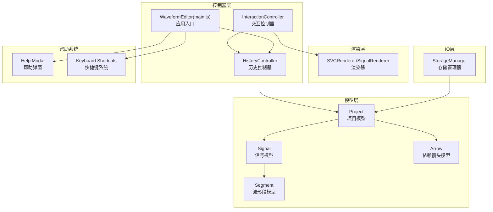
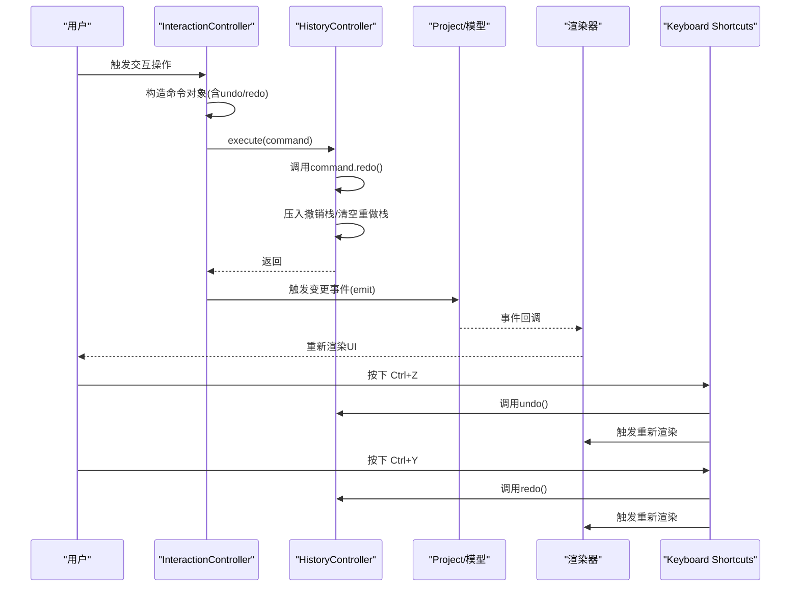
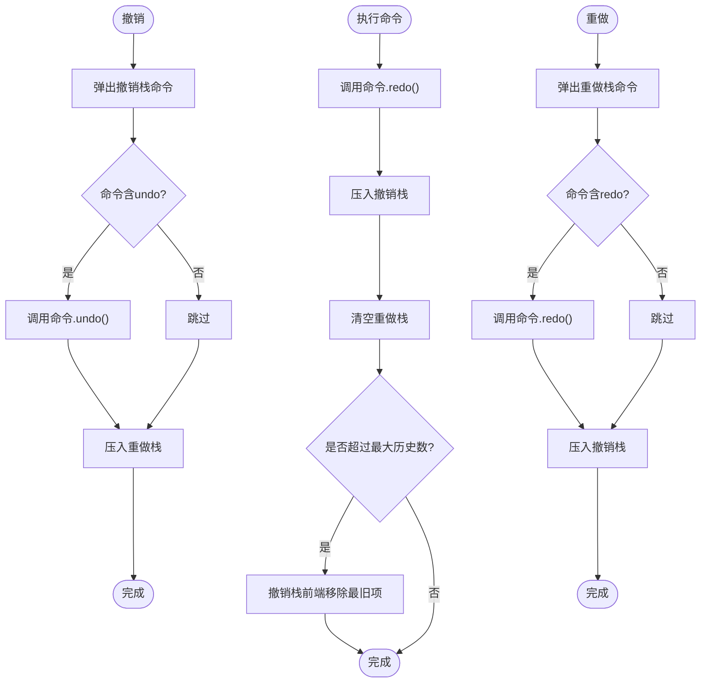
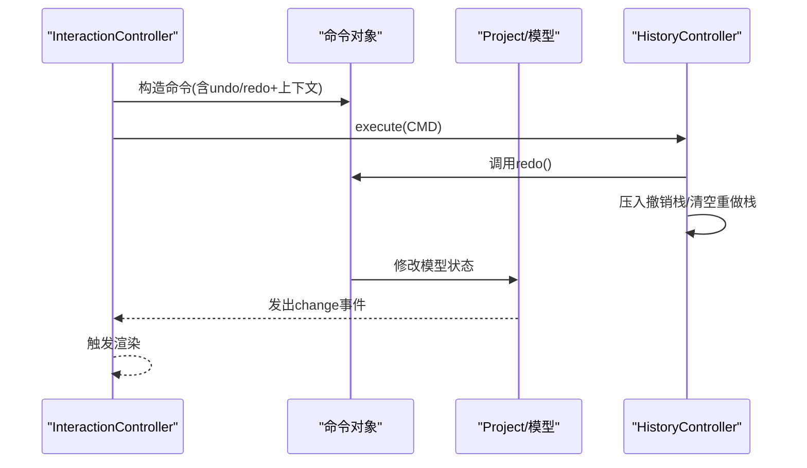
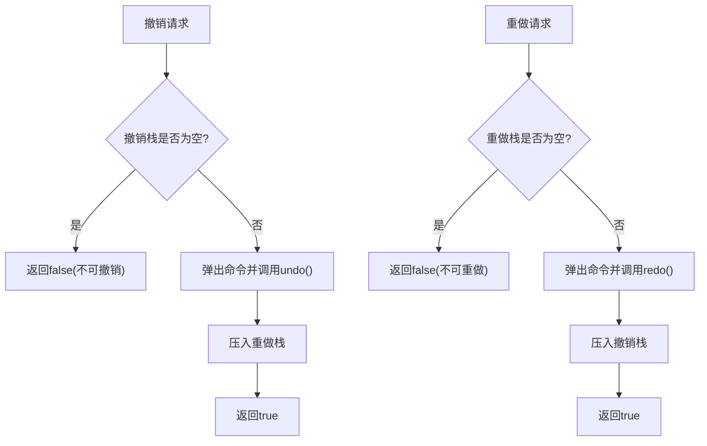
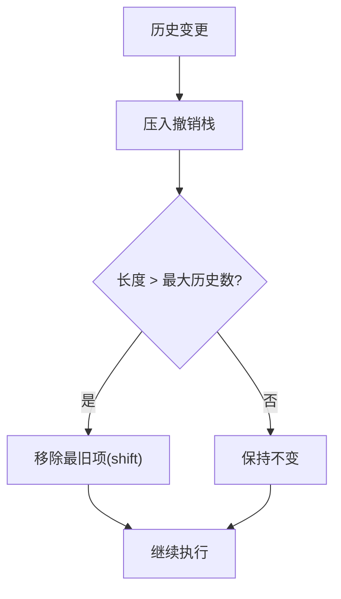
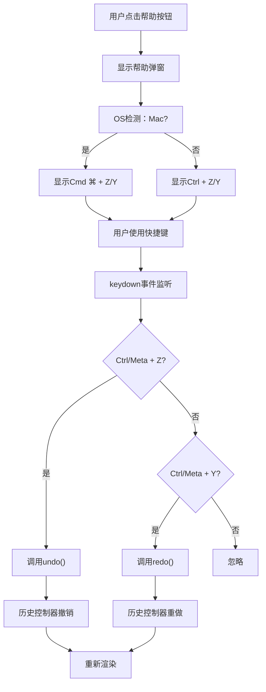
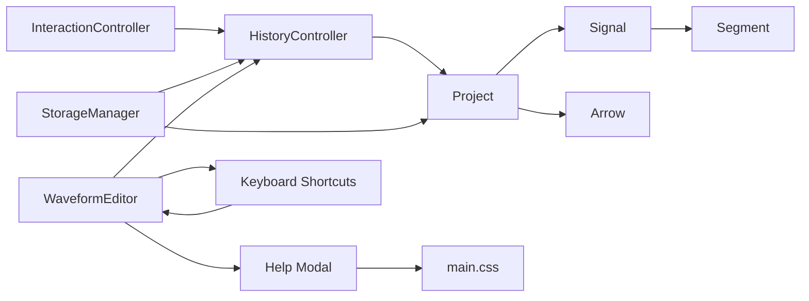

# 历史撤销重做

<cite>
**本文档引用的文件**
- [HistoryController.js](file://src/controllers/HistoryController.js)
- [InteractionController.js](file://src/controllers/InteractionController.js)
- [Project.js](file://src/models/Project.js)
- [Signal.js](file://src/models/Signal.js)
- [Segment.js](file://src/models/Segment.js)
- [Arrow.js](file://src/models/Arrow.js)
- [SignalRenderer.js](file://src/renderers/SignalRenderer.js)
- [main.js](file://src/main.js)
- [StorageManager.js](file://src/io/StorageManager.js)
- [index.html](file://index.html)
- [main.css](file://styles/main.css)
</cite>

## 目录
1. [简介](#简介)
2. [项目结构](#项目结构)
3. [核心组件](#核心组件)
4. [架构总览](#架构总览)
5. [详细组件分析](#详细组件分析)
6. [依赖关系分析](#依赖关系分析)
7. [性能考量](#性能考量)
8. [故障排查指南](#故障排查指南)
9. [结论](#结论)
10. [附录](#附录)

## 简介
本文件系统性阐述波形图编辑器中的"历史撤销重做"子系统，重点围绕 HistoryController 的设计模式、命令模式应用、历史栈管理、状态快照机制、撤销/重做实现原理、UI 同步与内存管理策略，并提供架构图与扩展建议，帮助开发者快速理解与定制该功能。

**更新** 本次更新反映了新增的 edgeMarkers 历史记录类型，以及增强的 deleteGap、addArrow、deleteArrow 等操作的历史跟踪功能，完善了撤销重做系统的功能覆盖。同时，帮助系统已集成撤销/重做快捷键说明，包括 Ctrl+Z/Ctrl+Y 的键盘快捷键支持。

## 项目结构
历史系统位于控制器层，与模型层（Project/Signal/Segment/Arrow）和渲染层（SVGRenderer）协同工作：
- 控制器层：HistoryController 负责历史栈管理；InteractionController 在用户交互时构造并执行动作。
- 模型层：Project/Signal/Segment/Arrow 提供可序列化的数据结构与事件通知。
- 渲染层：SVGRenderer/SignalRenderer 等负责 UI 同步。
- IO 层：StorageManager 负责持久化与模板管理。
- **新增** 帮助系统：提供快捷键说明弹窗，包含撤销/重做快捷键（Ctrl+Z/Ctrl+Y）和操作系统适配的快捷键显示。

**图表来源**
- [HistoryController.js:1-56](file://src/controllers/HistoryController.js#L1-L56)
- [InteractionController.js:1-80](file://src/controllers/InteractionController.js#L1-L80)
- [Project.js:1-245](file://src/models/Project.js#L1-L245)
- [Signal.js:1-343](file://src/models/Signal.js#L1-L343)
- [Segment.js:1-94](file://src/models/Segment.js#L1-L94)
- [Arrow.js:1-114](file://src/models/Arrow.js#L1-L114)
- [SignalRenderer.js:140-150](file://src/renderers/SignalRenderer.js#L140-L150)
- [StorageManager.js:1-368](file://src/io/StorageManager.js#L1-L368)
- [main.js:576-587](file://src/main.js#L576-L587)
- [index.html:85-112](file://index.html#L85-L112)
- [main.css:284-412](file://styles/main.css#L284-L412)

**章节来源**
- [HistoryController.js:1-56](file://src/controllers/HistoryController.js#L1-L56)
- [InteractionController.js:1-80](file://src/controllers/InteractionController.js#L1-L80)
- [Project.js:1-245](file://src/models/Project.js#L1-L245)
- [index.html:85-112](file://index.html#L85-L112)
- [main.js:576-587](file://src/main.js#L576-L587)

## 核心组件
- HistoryController：基于命令模式的历史控制器，维护两个栈（撤销/重做），限制最大历史数量，提供执行、撤销、重做、清空与可用性查询。
- InteractionController：在用户交互时构造动作对象（包含 undo/redo 函数与上下文数据），调用 HistoryController.execute 记录历史。
- Project/Signal/Segment/Arrow：提供 toJSON/fromJSON 序列化能力，支持快照与回滚；Project 提供事件通知（on/off/emit）。
- StorageManager：负责项目持久化、模板管理与多 sheet 支持，间接影响历史系统的生命周期与数据一致性。
- WaveformEditor（main.js）：应用入口，初始化各子系统，绑定撤销/重做 UI 事件，统一触发渲染。
- **新增** Help Modal：提供快捷键说明弹窗，包含撤销/重做快捷键（Ctrl+Z/Ctrl+Y）和操作系统适配的快捷键显示。
- **新增** Keyboard Shortcuts：全局键盘事件处理器，支持 Ctrl+Z 撤销和 Ctrl+Y 重做。

**更新** 新增 edgeMarkers 历史记录类型，支持跳变沿标注的撤销重做；增强的 deleteGap、addArrow、deleteArrow 操作提供了更完整的历史跟踪；帮助系统集成了撤销/重做快捷键说明。

**章节来源**
- [HistoryController.js:5-56](file://src/controllers/HistoryController.js#L5-L56)
- [InteractionController.js:808-841](file://src/controllers/InteractionController.js#L808-L841)
- [Project.js:199-244](file://src/models/Project.js#L199-L244)
- [Signal.js:21-22](file://src/models/Signal.js#L21-L22)
- [StorageManager.js:138-164](file://src/io/StorageManager.js#L138-L164)
- [main.js:462-586](file://src/main.js#L462-L586)
- [index.html:85-112](file://index.html#L85-L112)
- [main.js:576-587](file://src/main.js#L576-L587)

## 架构总览
历史系统采用"命令模式 + 事件驱动"的架构：
- 命令对象：由 InteractionController 构造，包含 type、上下文数据与 undo/redo 函数。
- 执行：HistoryController.execute 调用 redo 并压入撤销栈，清空重做栈，必要时裁剪撤销栈。
- 撤销/重做：HistoryController.undo/redo 弹出命令，调用其 undo/redo，维护两个栈的平衡。
- 快照：命令对象携带原始状态（如 Signal 的 segments JSON），用于回滚。
- UI 同步：每次历史变更后，通过 Project.emit('change') 通知渲染层，触发 re-render。
- **新增** 快捷键支持：全局键盘事件处理器支持 Ctrl+Z/Ctrl+Y 撤销/重做，帮助弹窗提供快捷键说明。

**图表来源**
- [InteractionController.js:808-841](file://src/controllers/InteractionController.js#L808-L841)
- [HistoryController.js:13-22](file://src/controllers/HistoryController.js#L13-L22)
- [Project.js:199-202](file://src/models/Project.js#L199-L202)
- [main.js:576-587](file://src/main.js#L576-L587)

## 详细组件分析

### HistoryController 设计与命令模式
- 设计要点
  - 双栈模型：撤销栈与重做栈，保证撤销/重做语义清晰。
  - 命令对象契约：必须包含 redo 函数；可选 undo 函数；可携带上下文数据（如 type、signalId、oldSegments 等）。
  - 最大历史数量：超出阈值时从撤销栈前端移除最旧项，控制内存占用。
  - 可用性查询：canUndo/canRedo 便于 UI 控制按钮状态。
- 命令模式体现
  - 将"操作"封装为对象，使操作请求者与执行者解耦。
  - undo/redo 作为命令对象的方法，确保状态恢复与前进的一致性。
- 历史栈管理
  - 执行新命令时，先调用 redo，再压入撤销栈，同时清空重做栈。
  - 撤销时弹出命令并调用 undo，压入重做栈；重做时弹出命令并调用 redo，压入撤销栈。
  - 超限裁剪：撤销栈长度超过上限时，移除最早项（shift）。

**图表来源**
- [HistoryController.js:13-42](file://src/controllers/HistoryController.js#L13-L42)

**章节来源**
- [HistoryController.js:5-56](file://src/controllers/HistoryController.js#L5-L56)

### 命令构造与状态快照
- 快照策略
  - 交互操作通常在开始时捕获"原始状态"，例如 Signal.segments 的 JSON 数组，作为 undo/redo 的参考。
  - 通过 JSON 序列化/反序列化实现快照，避免直接共享对象引用导致的副作用。
- 命令对象字段
  - type：操作类型，便于日志与调试。
  - 上下文数据：如 signalId、arrowId、oldSegments、newTime/newSignalId 等。
  - undo/redo：函数体直接对模型进行修改，确保状态可恢复。
- 示例场景
  - 设置电平（setLevel）：记录旧 segments JSON，redo 时重建并应用新值/颜色，再合并相邻段。
  - 移动箭头端点（moveArrowEndpoint）：记录起点/终点的旧时间与信号 ID，重做时更新至新值。
  - 边沿拖拽（moveEdge）：记录拖拽前后的 segments JSON，仅在实际变化时记录历史。
  - **新增** 边沿标注（edgeMarkers）：记录跳变沿标注数组的快照，支持上升沿和下降沿标注的撤销重做。

**图表来源**
- [InteractionController.js:1030-1048](file://src/controllers/InteractionController.js#L1030-L1048)
- [InteractionController.js:1160-1177](file://src/controllers/InteractionController.js#L1160-L1177)
- [InteractionController.js:808-841](file://src/controllers/InteractionController.js#L808-L841)
- [InteractionController.js:1245-1255](file://src/controllers/InteractionController.js#L1245-L1255)

**章节来源**
- [InteractionController.js:1030-1048](file://src/controllers/InteractionController.js#L1030-L1048)
- [InteractionController.js:1160-1177](file://src/controllers/InteractionController.js#L1160-L1177)
- [InteractionController.js:808-841](file://src/controllers/InteractionController.js#L808-L841)
- [InteractionController.js:1245-1255](file://src/controllers/InteractionController.js#L1245-L1255)

### 撤销与重做的实现原理
- 撤销流程
  - 若撤销栈为空则不可撤销；否则弹出命令，若存在 undo 则调用，然后将命令压入重做栈。
- 重做流程
  - 若重做栈为空则不可重做；否则弹出命令，若存在 redo 则调用，然后将命令压入撤销栈。
- 状态恢复
  - 通过命令对象携带的快照（如旧 segments JSON）与模型的 fromJSON 方法，重建历史状态。
- UI 同步
  - 每次历史变更后，模型发出 change 事件，渲染器响应并重新渲染，确保 UI 与模型一致。

**图表来源**
- [HistoryController.js:24-42](file://src/controllers/HistoryController.js#L24-L42)

**章节来源**
- [HistoryController.js:24-42](file://src/controllers/HistoryController.js#L24-L42)

### 历史记录的清理与内存管理
- 最大历史数量限制
  - HistoryController 构造时传入 maxHistory，默认 50；当撤销栈长度超过上限时，移除最旧项（shift）。
- 快照的内存优化
  - 仅在命令对象中保存必要的上下文与快照（如 segments JSON），避免冗余拷贝。
  - 重做/撤销时通过 JSON 反序列化重建状态，减少对深层对象的长期持有。
- Sheet 切换与历史生命周期
  - WaveformEditor 在切换 sheet 时会创建新的 HistoryController 实例，旧历史随之失效，避免跨 sheet 的历史污染。
- 事件驱动的自动保存
  - Project.on('change') 与 StorageManager.saveSheet 结合，确保历史变更与持久化同步，降低丢失风险。

**图表来源**
- [HistoryController.js:19-21](file://src/controllers/HistoryController.js#L19-L21)
- [main.js:359-360](file://src/main.js#L359-L360)

**章节来源**
- [HistoryController.js:19-21](file://src/controllers/HistoryController.js#L19-L21)
- [main.js:359-360](file://src/main.js#L359-L360)

### 与渲染层的集成与 UI 同步
- 事件通知
  - 模型通过 on/off/emit 提供事件机制；交互控制器在执行命令后触发 change，渲染器响应并更新视图。
- 渲染触发点
  - WaveformEditor.undo/redo 分别调用历史控制器并触发 render，确保撤销/重做后 UI 与模型一致。
- 选择状态同步
  - 交互控制器在撤销/重做过程中同步选中信号/箭头等状态，避免 UI 与模型脱节。

**章节来源**
- [Project.js:199-202](file://src/models/Project.js#L199-L202)
- [main.js:747-758](file://src/main.js#L747-L758)
- [InteractionController.js:1160-1177](file://src/controllers/InteractionController.js#L1160-L1177)

### 新增功能：edgeMarkers 历史记录类型
**新增** 系统现在支持跳变沿标注（edgeMarkers）的历史记录功能：

- 功能概述
  - 支持上升沿（rising）和下降沿（falling）标注的添加、删除和切换操作。
  - 通过历史记录追踪标注数组的完整状态变化。
  - 与 Signal 模型的 edgeMarkers 字段完全集成。

- 命令实现
  - 类型：`edgeMarkers`
  - 快照：记录标注数组的完整副本（oldMarkers/newMarkers）
  - 撤销/重做：通过直接赋值的方式恢复或应用新的标注状态
  - 适用场景：批量切换标注、范围内的标注操作

- 与渲染层集成
  - SignalRenderer 正确渲染 edgeMarkers 标注箭头
  - 支持不同类型的标注（上升沿/下降沿）和动态尺寸调整
  - 与波形渲染同步更新

**章节来源**
- [InteractionController.js:1218-1255](file://src/controllers/InteractionController.js#L1218-L1255)
- [Signal.js:21-22](file://src/models/Signal.js#L21-L22)
- [Signal.js:65-77](file://src/models/Signal.js#L65-L77)
- [SignalRenderer.js:144-150](file://src/renderers/SignalRenderer.js#L144-L150)
- [SignalRenderer.js:490-563](file://src/renderers/SignalRenderer.js#L490-L563)

### 增强功能：deleteGap、addArrow、deleteArrow 历史跟踪
**更新** 三个关键操作现在都具备完整的历史记录支持：

- deleteGap 增强
  - 类型：`deleteGap`
  - 快照：记录删除前的 gaps 数组副本
  - 撤销/重做：通过数组过滤和恢复实现精确的状态回滚
  - 适用场景：删除信号分隔符的撤销重做

- addArrow 增强
  - 类型：`addArrow`
  - 快照：记录箭头对象本身（通过 Project.addArrow/removeArrow 实现）
  - 撤销/重做：直接调用 Project 的箭头管理方法
  - 适用场景：创建依赖箭头的撤销重做

- deleteArrow 增强
  - 类型：`deleteArrow`
  - 忘记：记录删除前的箭头对象副本
  - 撤销/重做：通过 Project.addArrow 恢复箭头
  - 适用场景：删除依赖箭头的撤销重做

**章节来源**
- [InteractionController.js:419-435](file://src/controllers/InteractionController.js#L419-L435)
- [InteractionController.js:771-775](file://src/controllers/InteractionController.js#L771-L775)
- [InteractionController.js:1474-1478](file://src/controllers/InteractionController.js#L1474-L1478)
- [Project.js:86-101](file://src/models/Project.js#L86-L101)

### 帮助系统与撤销重做快捷键集成
**新增** 帮助系统已完全集成撤销/重做快捷键功能：

- 帮助弹窗结构
  - 包含完整的快捷键说明表格，明确列出 Ctrl+Z 撤销和 Ctrl+Y 重做快捷键
  - 支持操作系统适配：Mac 用户显示 Cmd ⌘，其他系统显示 Ctrl
  - 提供快捷键提示条，在应用启动时显示临时提示

- 快捷键样式系统
  - `.help-table kbd.alt-key` 和 `.help-table kbd.mod-key` 样式类用于区分不同类型的快捷键
  - 统一的键盘按键样式，支持斜体显示和颜色主题
  - 响应式布局，支持不同屏幕尺寸

- 全局键盘事件处理
  - 支持 Ctrl+Z 撤销操作（Windows/Linux）和 Cmd+Z 撤销操作（Mac）
  - 支持 Ctrl+Y 重做操作（Windows/Linux）和 Cmd+Y 重做操作（Mac）
  - 防止浏览器默认行为，确保快捷键正常工作

- UI 集成
  - 工具栏按钮包含快捷键提示：撤销按钮标题为 "撤销 (Ctrl+Z)"，重做按钮标题为 "重做 (Ctrl+Y)"
  - 帮助按钮 "?" 触发快捷键说明弹窗
  - Esc 键关闭帮助弹窗，支持键盘导航

**图表来源**
- [index.html:85-112](file://index.html#L85-L112)
- [main.js:576-587](file://src/main.js#L576-L587)
- [main.js:638-687](file://src/main.js#L638-L687)
- [main.css:284-412](file://styles/main.css#L284-L412)

**章节来源**
- [index.html:85-112](file://index.html#L85-L112)
- [main.js:576-587](file://src/main.js#L576-L587)
- [main.js:638-687](file://src/main.js#L638-L687)
- [main.css:284-412](file://styles/main.css#L284-L412)

## 依赖关系分析
- HistoryController 依赖 Project（通过命令对象对模型进行修改）。
- InteractionController 依赖 HistoryController（构造并执行命令）。
- Project 依赖 Signal/Segment/Arrow（提供序列化与事件通知）。
- StorageManager 与历史系统间接关联：sheet 切换时重建历史控制器，影响历史生命周期。
- **新增** WaveformEditor 依赖 Help Modal 和 Keyboard Shortcuts 提供完整的用户界面支持。

**图表来源**
- [InteractionController.js:1-80](file://src/controllers/InteractionController.js#L1-L80)
- [HistoryController.js:5-11](file://src/controllers/HistoryController.js#L5-L11)
- [Project.js:1-34](file://src/models/Project.js#L1-L34)
- [StorageManager.js:138-164](file://src/io/StorageManager.js#L138-L164)
- [main.js:576-587](file://src/main.js#L576-L587)
- [index.html:85-112](file://index.html#L85-L112)
- [main.css:284-412](file://styles/main.css#L284-L412)

**章节来源**
- [InteractionController.js:1-80](file://src/controllers/InteractionController.js#L1-L80)
- [HistoryController.js:5-11](file://src/controllers/HistoryController.js#L5-L11)
- [Project.js:1-34](file://src/models/Project.js#L1-L34)
- [StorageManager.js:138-164](file://src/io/StorageManager.js#L138-L164)
- [main.js:576-587](file://src/main.js#L576-L587)
- [index.html:85-112](file://index.html#L85-L112)

## 性能考量
- 时间复杂度
  - 历史栈操作为 O(1)（push/pop/shift）。
  - 快照序列化/反序列化成本与模型规模相关，建议仅保存必要字段。
- 空间复杂度
  - 撤销栈最多保存 N 个命令快照，空间与命令数量线性相关。
  - 建议在高频操作（如拖拽）中按需记录历史，避免每一步都产生快照。
- 优化建议
  - 合并连续小操作：将多次微小修改合并为一次历史记录。
  - 延迟序列化：在命令对象中延迟生成快照，仅在真正需要时序列化。
  - 限制最大历史数：根据设备性能动态调整 maxHistory。
  - 使用浅拷贝/深拷贝策略：对大对象采用浅拷贝快照，减少内存压力。
  - **新增** edgeMarkers 优化：由于标注数组通常较小，快照开销可忽略不计。
  - **新增** 快捷键性能：键盘事件监听器使用高效的条件判断，避免不必要的处理。

## 故障排查指南
- 撤销/重做无效
  - 检查命令对象是否包含 redo/undo 函数。
  - 确认撤销/重做栈是否为空。
- 快照不生效
  - 确认命令对象携带的快照数据完整且可反序列化。
  - 检查模型的 toJSON/fromJSON 是否正确实现。
- UI 不同步
  - 确认模型是否发出 change 事件。
  - 检查渲染器是否正确订阅事件并触发 re-render。
- Sheet 切换后历史丢失
  - 这是预期行为：WaveformEditor 在切换 sheet 时会创建新的 HistoryController 实例，旧历史随之失效。
- 性能问题
  - 检查历史数量是否过大，适当降低 maxHistory。
  - 评估命令对象快照大小，避免不必要的字段。
- **新增** 快捷键问题
  - 检查浏览器是否阻止了快捷键事件（某些浏览器可能阻止 Ctrl+Z/Y）。
  - 确认键盘事件监听器是否正确绑定到 document。
  - 验证工具栏按钮的 title 属性是否正确显示快捷键。
- **新增** 帮助弹窗问题
  - 检查 CSS 样式是否正确加载，确认 help-modal 类的样式定义。
  - 确认 OS 适配逻辑是否正确识别 Mac 系统。
  - 验证 Esc 键关闭功能是否正常工作。

**章节来源**
- [HistoryController.js:24-42](file://src/controllers/HistoryController.js#L24-L42)
- [InteractionController.js:1030-1048](file://src/controllers/InteractionController.js#L1030-L1048)
- [Project.js:199-202](file://src/models/Project.js#L199-L202)
- [main.js:359-360](file://src/main.js#L359-L360)
- [Signal.js:21-22](file://src/models/Signal.js#L21-L22)
- [SignalRenderer.js:490-563](file://src/renderers/SignalRenderer.js#L490-L563)
- [main.js:576-587](file://src/main.js#L576-L587)
- [index.html:85-112](file://index.html#L85-L112)

## 结论
历史撤销重做系统以命令模式为核心，结合双栈管理与事件驱动的 UI 同步，实现了稳定、可扩展的状态管理。通过合理的快照策略与内存控制，系统在保证用户体验的同时兼顾性能。

**更新** 本次更新显著增强了系统的功能覆盖，新增的 edgeMarkers 历史记录类型和增强的 deleteGap、addArrow、deleteArrow 操作历史跟踪，使得撤销重做功能更加完善和实用。同时，帮助系统与撤销重做功能的深度集成，包括 Ctrl+Z/Ctrl+Y 快捷键支持和完整的快捷键说明，大大提升了用户体验。开发者可在现有框架上扩展更多命令类型、优化快照策略，并根据业务需求调整历史数量上限与 UI 交互细节。

## 附录

### 使用示例（如何扩展历史功能）
- 新增命令类型
  - 在交互控制器中构造新的命令对象，包含 type、上下文数据与 undo/redo 函数。
  - 在命令对象中使用模型的 toJSON/fromJSON 生成/恢复快照。
- 自定义历史数量
  - 在创建 HistoryController 时传入自定义 maxHistory。
- 与 UI 集成
  - 在撤销/重做按钮事件中调用 WaveformEditor.undo/redo，确保渲染层响应。
- 与持久化集成
  - 通过 Project.on('change') 与 StorageManager.saveSheet 结合，实现自动保存。
- **新增** edgeMarkers 扩展
  - 在 Signal 模型中正确初始化 edgeMarkers 数组。
  - 确保 SignalRenderer 能够正确渲染 edgeMarkers 标注。
  - 通过 InteractionController 构造 edgeMarkers 类型的命令对象。
- **新增** 帮助系统扩展
  - 在 index.html 中添加新的快捷键说明行
  - 在 main.css 中添加相应的样式类
  - 在 main.js 中添加键盘事件监听器
  - 确保 OS 适配逻辑正确处理新的快捷键

**章节来源**
- [InteractionController.js:1030-1048](file://src/controllers/InteractionController.js#L1030-L1048)
- [InteractionController.js:1160-1177](file://src/controllers/InteractionController.js#L1160-L1177)
- [InteractionController.js:1245-1255](file://src/controllers/InteractionController.js#L1245-L1255)
- [main.js:462-586](file://src/main.js#L462-L586)
- [StorageManager.js:239-255](file://src/io/StorageManager.js#L239-L255)
- [Signal.js:21-22](file://src/models/Signal.js#L21-L22)
- [SignalRenderer.js:490-563](file://src/renderers/SignalRenderer.js#L490-L563)
- [index.html:85-112](file://index.html#L85-L112)
- [main.js:576-587](file://src/main.js#L576-L587)

### 历史记录类型参考表
**新增** 系统支持的历史记录类型一览：

| 类型 | 描述 | 快照内容 | 主要用途 |
|------|------|----------|----------|
| edgeMarkers | 跳变沿标注 | edgeMarkers 数组副本 | 上升沿/下降沿标注的撤销重做 |
| deleteGap | 删除分隔符 | gaps 数组副本 | 信号分隔符删除的撤销重做 |
| addArrow | 添加箭头 | 箭头对象 | 依赖箭头创建的撤销重做 |
| deleteArrow | 删除箭头 | 箭头对象副本 | 依赖箭头删除的撤销重做 |
| moveArrowEndpoint | 移动箭头端点 | 端点时间/信号ID | 箭头端点位置调整的撤销重做 |

**章节来源**
- [InteractionController.js:1245-1255](file://src/controllers/InteractionController.js#L1245-L1255)
- [InteractionController.js:419-435](file://src/controllers/InteractionController.js#L419-L435)
- [InteractionController.js:771-775](file://src/controllers/InteractionController.js#L771-L775)
- [InteractionController.js:1474-1478](file://src/controllers/InteractionController.js#L1474-L1478)
- [InteractionController.js:832-864](file://src/controllers/InteractionController.js#L832-L864)

### 快捷键系统参考表
**新增** 系统支持的快捷键一览：

| 快捷键 | 操作 | 说明 | 支持平台 |
|--------|------|------|----------|
| Ctrl+Z | 撤销 | 撤销上一个操作 | Windows/Linux |
| Ctrl+Y | 重做 | 重做上一个被撤销的操作 | Windows/Linux |
| Cmd+Z | 撤销 | 撤销上一个操作（Mac） | Mac |
| Cmd+Y | 重做 | 重做上一个被撤销的操作（Mac） | Mac |
| Esc | 关闭弹窗 | 关闭帮助弹窗 | 所有平台 |
| Alt+拖拽 | 创建箭头 | 在信号间创建依赖箭头 | 所有平台 |

**章节来源**
- [index.html:104-107](file://index.html#L104-L107)
- [main.js:576-587](file://src/main.js#L576-L587)
- [main.js:672-686](file://src/main.js#L672-L686)