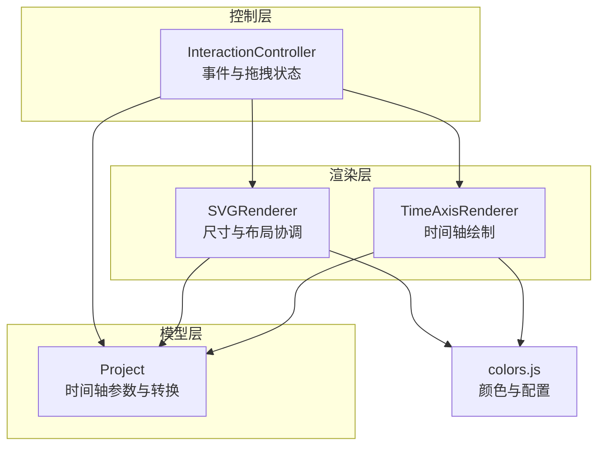
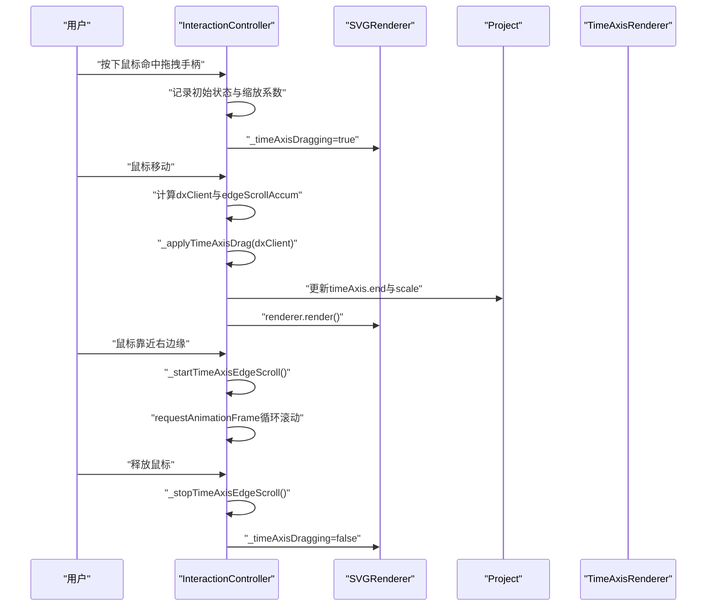
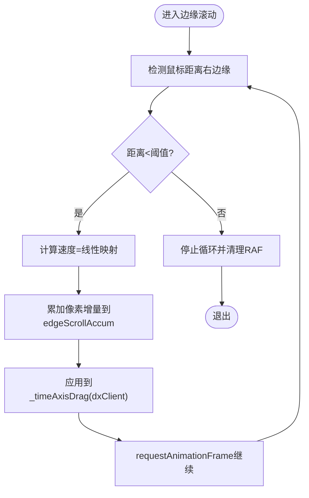
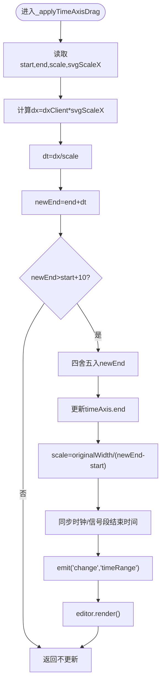
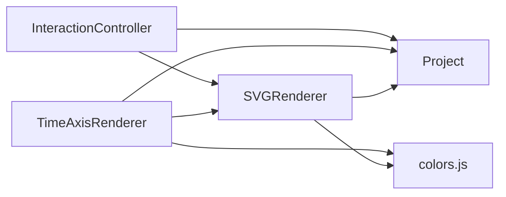

# 时间轴控制

<cite>
**本文引用的文件列表**
- [TimeAxisRenderer.js](file://src/renderers/TimeAxisRenderer.js)
- [InteractionController.js](file://src/controllers/InteractionController.js)
- [Project.js](file://src/models/Project.js)
- [SVGRenderer.js](file://src/renderers/SVGRenderer.js)
- [colors.js](file://src/config/colors.js)
- [main.js](file://src/main.js)
</cite>

## 目录
1. [简介](#简介)
2. [项目结构](#项目结构)
3. [核心组件](#核心组件)
4. [架构总览](#架构总览)
5. [详细组件分析](#详细组件分析)
6. [依赖关系分析](#依赖关系分析)
7. [性能考量](#性能考量)
8. [故障排查指南](#故障排查指南)
9. [结论](#结论)
10. [附录](#附录)

## 简介
本文件围绕“时间轴控制”功能进行系统化技术文档编写，重点涵盖：
- 时间轴拖拽手柄的检测与实现
- 边缘滚动机制与滚动速度计算
- 时间轴缩放的数学原理与边界约束
- 时间轴状态管理与渲染更新流程
- 完整算法说明与性能优化建议

目标读者包括需要理解或扩展时间轴功能的前端工程师与产品开发人员。

## 项目结构
时间轴控制涉及以下关键模块：
- 控制层：交互控制器负责事件捕获、状态机与拖拽逻辑
- 渲染层：时间轴渲染器负责绘制刻度、标签与拖拽手柄
- 模型层：项目模型提供时间轴参数与像素/时间转换
- 渲染协调：SVG 渲染器负责尺寸更新、自动扩展与裁剪

图表来源
- [InteractionController.js:1-800](file://src/controllers/InteractionController.js#L1-L800)
- [TimeAxisRenderer.js:1-132](file://src/renderers/TimeAxisRenderer.js#L1-L132)
- [SVGRenderer.js:1-547](file://src/renderers/SVGRenderer.js#L1-L547)
- [Project.js:1-245](file://src/models/Project.js#L1-L245)
- [colors.js:1-83](file://src/config/colors.js#L1-L83)

章节来源
- [InteractionController.js:1-800](file://src/controllers/InteractionController.js#L1-L800)
- [TimeAxisRenderer.js:1-132](file://src/renderers/TimeAxisRenderer.js#L1-L132)
- [SVGRenderer.js:1-547](file://src/renderers/SVGRenderer.js#L1-L547)
- [Project.js:1-245](file://src/models/Project.js#L1-L245)
- [colors.js:1-83](file://src/config/colors.js#L1-L83)

## 核心组件
- 时间轴渲染器：负责绘制时间轴背景、刻度线、标签与右侧拖拽手柄
- 交互控制器：负责鼠标事件捕获、拖拽状态管理、边缘滚动与时间轴缩放应用
- 项目模型：提供时间轴参数（起始、结束、缩放）、像素/时间转换方法
- SVG 渲染器：负责整体尺寸计算、自动扩展、裁剪与渲染顺序

章节来源
- [TimeAxisRenderer.js:1-132](file://src/renderers/TimeAxisRenderer.js#L1-L132)
- [InteractionController.js:1-800](file://src/controllers/InteractionController.js#L1-L800)
- [Project.js:146-170](file://src/models/Project.js#L146-L170)
- [SVGRenderer.js:191-243](file://src/renderers/SVGRenderer.js#L191-L243)

## 架构总览
时间轴控制的交互流程如下：
- 用户在时间轴右侧拖拽手柄触发拖拽状态
- 鼠标移动时计算像素偏移并应用到时间轴结束时间
- 鼠标靠近右边缘时启动边缘滚动，持续累加像素增量
- 缩放比例根据原始宽度与新的结束时间动态更新
- 信号段与时钟信号同步更新，触发渲染刷新

图表来源
- [InteractionController.js:84-365](file://src/controllers/InteractionController.js#L84-L365)
- [InteractionController.js:367-401](file://src/controllers/InteractionController.js#L367-L401)
- [SVGRenderer.js:46-54](file://src/renderers/SVGRenderer.js#L46-L54)
- [Project.js:127-144](file://src/models/Project.js#L127-L144)

## 详细组件分析

### 时间轴拖拽手柄实现
- 手柄定位与命中检测
  - 右侧拖拽手柄位于时间轴末端，通过类名与数据属性标识，便于命中检测
  - 鼠标按下时，若命中手柄则进入时间轴拖拽模式，记录初始状态与缩放系数
- 拖拽状态字段
  - 包含起始客户端 X、起始时间轴 start/end/scale、SVG 缩放系数、上次客户端 X、边缘滚动累加量与 RAF 引用
- 渲染更新
  - 拖拽过程中设置渲染器的拖拽标志位，阻止自动扩展逻辑干扰
  - 每次拖拽更新后触发渲染，确保 UI 即时反馈

章节来源
- [TimeAxisRenderer.js:79-108](file://src/renderers/TimeAxisRenderer.js#L79-L108)
- [InteractionController.js:84-107](file://src/controllers/InteractionController.js#L84-L107)
- [InteractionController.js:284-337](file://src/controllers/InteractionController.js#L284-L337)
- [SVGRenderer.js:46-54](file://src/renderers/SVGRenderer.js#L46-L54)

### 边缘滚动机制
- 触发条件
  - 鼠标靠近右边缘（阈值为固定像素范围）时启动边缘滚动
- 滚动速度计算
  - 速度与距离边缘的距离呈线性关系，越靠近边缘速度越大
  - 每帧累加像素增量，累积到一定阈值后应用到拖拽逻辑
- 循环与停止
  - 使用 requestAnimationFrame 循环执行滚动逻辑
  - 鼠标离开边缘或释放鼠标时停止循环并清理资源

图表来源
- [InteractionController.js:186-201](file://src/controllers/InteractionController.js#L186-L201)
- [InteractionController.js:367-401](file://src/controllers/InteractionController.js#L367-L401)

章节来源
- [InteractionController.js:186-201](file://src/controllers/InteractionController.js#L186-L201)
- [InteractionController.js:367-401](file://src/controllers/InteractionController.js#L367-L401)

### 时间轴缩放数学原理
- 像素到时间的转换
  - 由项目模型提供：时间转 X 坐标与 X 坐标转时间
  - 用于将鼠标像素偏移转换为时间增量
- 缩放计算
  - 原始宽度 = (end - start) × scale
  - 鼠标像素偏移转换为时间增量：dt = dx / scale
  - 新结束时间：newEnd = end + dt
  - 边界约束：保证新结束时间大于最小有效长度
  - 新缩放比例：scale = originalWidth / (newEnd - start)
- 时间范围验证
  - 通过四舍五入到整数值，确保时间轴结束时间保持合理粒度
  - 同步更新时钟信号与非时钟信号的段结束时间，维持一致性

图表来源
- [InteractionController.js:342-365](file://src/controllers/InteractionController.js#L342-L365)
- [Project.js:159-170](file://src/models/Project.js#L159-L170)

章节来源
- [InteractionController.js:342-365](file://src/controllers/InteractionController.js#L342-L365)
- [Project.js:159-170](file://src/models/Project.js#L159-L170)

### 时间轴状态管理与渲染更新
- 状态字段
  - 交互控制器维护拖拽状态对象，包含起始与当前状态、边缘滚动累加量与 RAF 引用
  - 渲染器维护拖拽标志位，用于在拖拽期间禁用自动扩展
- 渲染更新
  - 拖拽过程与边缘滚动均触发渲染，确保 UI 即时响应
  - 自动扩展逻辑在拖拽期间被跳过，避免与用户操作冲突
- 事件与生命周期
  - 鼠标按下进入拖拽，鼠标移动更新状态，鼠标释放结束拖拽并清理资源

章节来源
- [InteractionController.js:12-26](file://src/controllers/InteractionController.js#L12-L26)
- [InteractionController.js:284-337](file://src/controllers/InteractionController.js#L284-L337)
- [SVGRenderer.js:191-243](file://src/renderers/SVGRenderer.js#L191-L243)

### 时间轴渲染细节
- 刻度与标签
  - 根据缩放比例计算合适的刻度间隔，保证刻度密度适中
  - 每个刻度绘制竖直线与标签，标签内容包含时间值与单位
- 拖拽手柄
  - 透明背景矩形作为命中区域，三条竖线表示可拖拽
  - 鼠标样式设置为横向拉伸光标，提升交互提示

章节来源
- [TimeAxisRenderer.js:47-74](file://src/renderers/TimeAxisRenderer.js#L47-L74)
- [TimeAxisRenderer.js:79-108](file://src/renderers/TimeAxisRenderer.js#L79-L108)

## 依赖关系分析
- 控制器依赖渲染器与项目模型
  - 通过渲染器访问 SVG 缩放系数与拖拽标志位
  - 通过项目模型进行像素/时间转换与时间轴参数更新
- 渲染器依赖项目模型与颜色配置
  - 依据项目时间轴参数计算尺寸与裁剪区域
  - 使用颜色配置统一视觉风格
- 时间轴渲染器依赖渲染器与项目模型
  - 使用项目模型的转换方法绘制刻度与标签
  - 使用渲染器命名空间与配置进行 SVG 元素创建

图表来源
- [InteractionController.js:1-800](file://src/controllers/InteractionController.js#L1-L800)
- [TimeAxisRenderer.js:1-132](file://src/renderers/TimeAxisRenderer.js#L1-L132)
- [SVGRenderer.js:1-547](file://src/renderers/SVGRenderer.js#L1-L547)
- [Project.js:1-245](file://src/models/Project.js#L1-L245)
- [colors.js:1-83](file://src/config/colors.js#L1-L83)

章节来源
- [InteractionController.js:1-800](file://src/controllers/InteractionController.js#L1-L800)
- [TimeAxisRenderer.js:1-132](file://src/renderers/TimeAxisRenderer.js#L1-L132)
- [SVGRenderer.js:1-547](file://src/renderers/SVGRenderer.js#L1-L547)
- [Project.js:1-245](file://src/models/Project.js#L1-L245)
- [colors.js:1-83](file://src/config/colors.js#L1-L83)

## 性能考量
- 边缘滚动使用 requestAnimationFrame 循环，避免高频定时器带来的卡顿
- 拖拽过程仅在必要时触发渲染，减少不必要的重绘
- 自动扩展逻辑在拖拽期间被禁用，避免与用户操作相互干扰
- 刻度计算采用预设间隔集合，降低浮点运算复杂度
- 建议
  - 若需要更流畅的边缘滚动，可考虑对速度曲线进行指数或对数映射
  - 对于长时间轴场景，可考虑节流/防抖鼠标移动事件，进一步降低渲染压力
  - 在大规模信号场景下，尽量减少每次渲染的 DOM 操作数量

[本节为通用性能建议，无需特定文件来源]

## 故障排查指南
- 拖拽无效
  - 检查是否命中了时间轴拖拽手柄（类名与数据属性）
  - 确认渲染器的拖拽标志位是否被正确设置与清除
- 边缘滚动不生效
  - 检查鼠标距离右边缘的阈值与速度计算逻辑
  - 确认 RAF 循环是否被正确启动与停止
- 缩放异常
  - 检查像素到时间的转换是否正确
  - 确认时间轴结束时间的边界约束与四舍五入逻辑
- 渲染不同步
  - 确认渲染器在拖拽过程中的渲染调用时机
  - 检查自动扩展逻辑是否在拖拽期间被正确禁用

章节来源
- [InteractionController.js:84-107](file://src/controllers/InteractionController.js#L84-L107)
- [InteractionController.js:367-401](file://src/controllers/InteractionController.js#L367-L401)
- [SVGRenderer.js:191-243](file://src/renderers/SVGRenderer.js#L191-L243)

## 结论
时间轴控制功能通过“拖拽手柄 + 边缘滚动 + 缩放计算”的组合实现了直观而高效的可视化编辑体验。其核心在于：
- 明确的事件捕获与状态管理
- 精准的像素到时间转换与边界约束
- 平滑的边缘滚动与及时的渲染更新

该实现具备良好的可扩展性，可在保持交互一致性的前提下，进一步优化性能与用户体验。

[本节为总结性内容，无需特定文件来源]

## 附录
- 数学公式摘要
  - 像素到时间：dt = dx / scale
  - 新结束时间：newEnd = end + dt
  - 新缩放：scale = originalWidth / (newEnd - start)
- 关键配置参考
  - 刻度间隔策略：基于目标像素间距与缩放比例选择最近整数间隔
  - 边缘滚动阈值与速度映射：距离边缘越近速度越大

章节来源
- [InteractionController.js:342-365](file://src/controllers/InteractionController.js#L342-L365)
- [TimeAxisRenderer.js:114-131](file://src/renderers/TimeAxisRenderer.js#L114-L131)