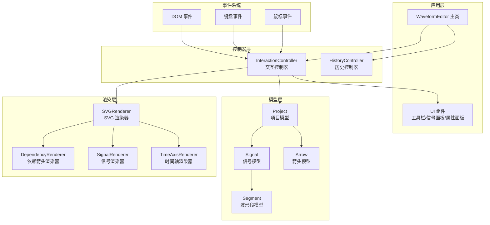
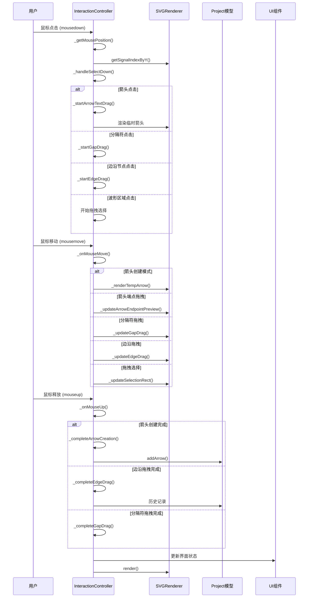
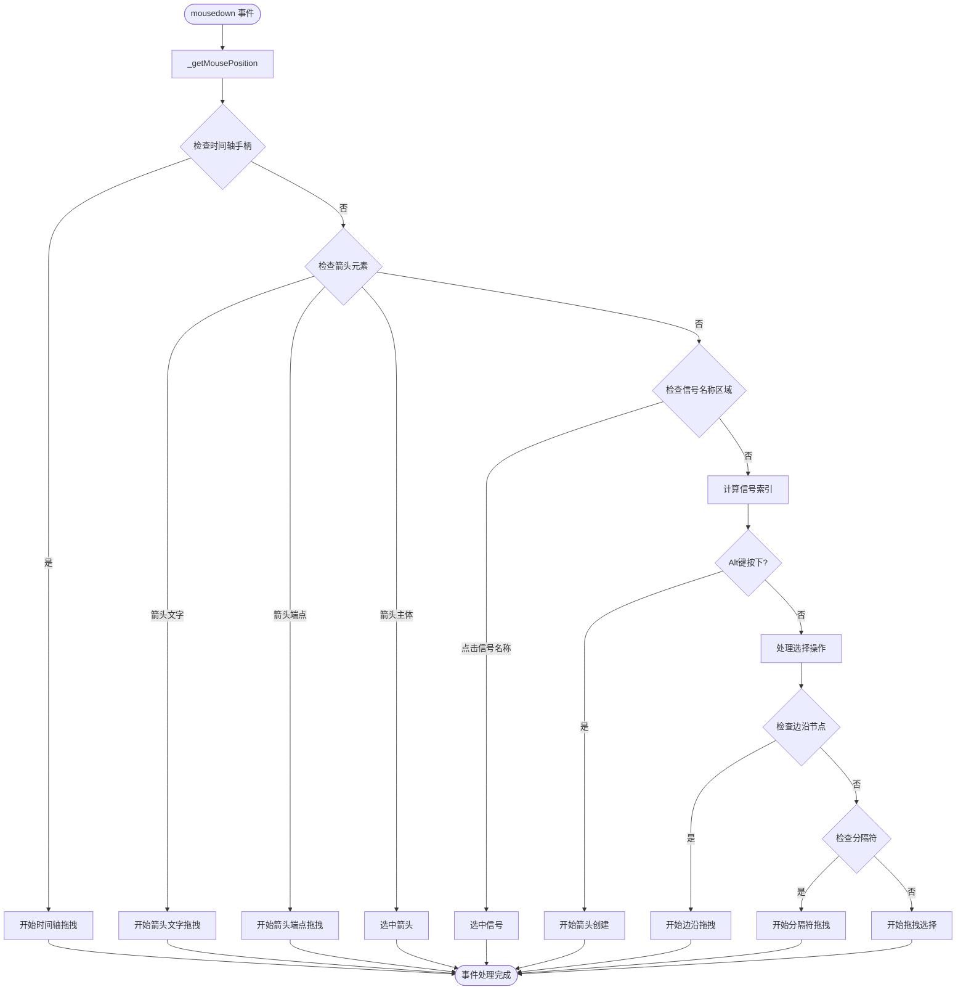
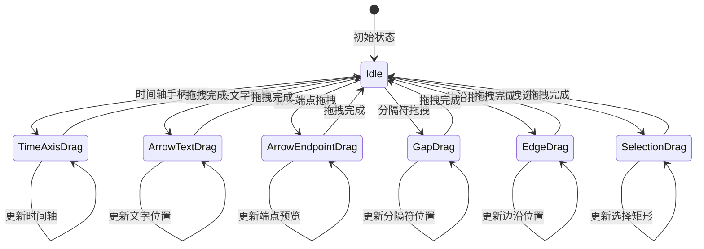
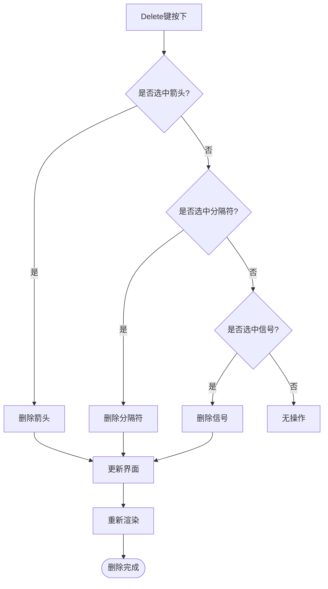
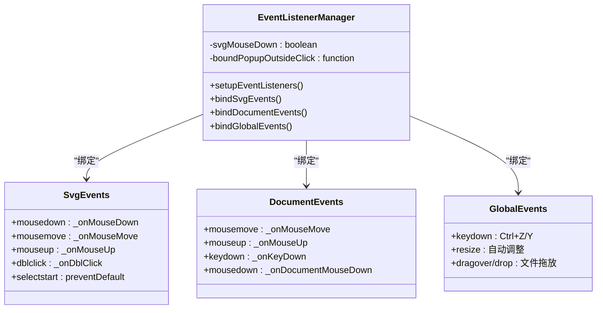
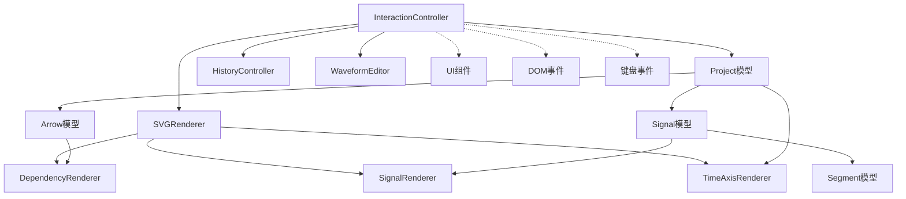

# 鼠标键盘交互处理

<cite>
**本文档引用的文件**
- [InteractionController.js](file://src/controllers/InteractionController.js)
- [main.js](file://src/main.js)
- [SVGRenderer.js](file://src/renderers/SVGRenderer.js)
- [DependencyRenderer.js](file://src/renderers/DependencyRenderer.js)
- [Arrow.js](file://src/models/Arrow.js)
- [Signal.js](file://src/models/Signal.js)
- [Segment.js](file://src/models/Segment.js)
- [index.html](file://index.html)
- [main.css](file://styles/main.css)
</cite>

## 更新摘要
**变更内容**
- 增强了选择边界约束机制，防止用户选择超出有效时间轴范围
- 改进了信号拖拽的边界处理，增加了时间轴范围限制
- 优化了分隔符拖拽的边界约束，确保在时间轴范围内移动
- 增强了边沿拖拽的边界限制，防止跨越相邻段边界

## 目录
1. [简介](#简介)
2. [项目结构](#项目结构)
3. [核心组件](#核心组件)
4. [架构概览](#架构概览)
5. [详细组件分析](#详细组件分析)
6. [依赖分析](#依赖分析)
7. [性能考虑](#性能考虑)
8. [故障排除指南](#故障排除指南)
9. [结论](#结论)
10. [附录](#附录)

## 简介

本文档深入解析波形图编辑器中的鼠标键盘交互处理系统，重点围绕InteractionController控制器的完整事件处理流程。该系统实现了复杂的图形编辑交互，包括鼠标事件的精确处理、键盘快捷键支持、事件监听器的智能绑定策略，以及针对触摸设备的兼容性处理。

系统采用模块化设计，通过清晰的职责分离实现了高效的用户交互体验。InteractionController作为核心控制器，协调SVG渲染器、模型层和用户界面组件，提供了完整的波形编辑功能。

**更新** 增强了边界约束机制，确保用户操作不会超出有效的时间轴范围，提升了系统的稳定性和用户体验。

## 项目结构

波形图编辑器采用分层架构设计，主要包含以下核心层次：



**图表来源**
- [main.js:1-819](file://src/main.js#L1-L819)
- [InteractionController.js:1-1534](file://src/controllers/InteractionController.js#L1-L1534)

**章节来源**
- [main.js:1-819](file://src/main.js#L1-L819)
- [index.html:1-87](file://index.html#L1-L87)

## 核心组件

### InteractionController - 交互控制器

InteractionController是整个交互系统的核心，负责处理所有用户输入事件并协调相应的业务逻辑。其主要职责包括：

- **事件监听器管理**：设置和管理DOM事件监听器
- **鼠标事件处理**：处理mousedown、mousemove、mouseup事件
- **键盘快捷键支持**：实现Delete键删除功能和其他快捷键
- **状态管理**：维护拖拽状态、选中状态等交互状态
- **坐标转换**：处理鼠标坐标到SVG坐标系的转换
- **边界约束管理**：实施时间轴范围限制和边界约束

**更新** 新增了边界约束管理功能，确保所有拖拽操作都在有效的时间轴范围内进行。

### SVGRenderer - SVG渲染器

SVG渲染器负责将项目数据渲染到SVG画布上，提供坐标转换和几何计算功能：

- **坐标系统**：提供时间到像素的转换函数
- **几何计算**：计算信号位置、边界检测等
- **元素创建**：创建SVG元素的统一接口
- **交互层管理**：管理交互层的SVG元素

### DependencyRenderer - 依赖箭头渲染器

专门负责渲染信号间的依赖关系箭头，提供复杂的箭头绘制和交互功能：

- **箭头绘制**：使用贝塞尔曲线绘制平滑箭头
- **碰撞检测**：提供透明命中区域进行精确选择
- **端点交互**：支持箭头端点的拖拽编辑
- **标签系统**：支持箭头上的文字标注

**章节来源**
- [InteractionController.js:6-27](file://src/controllers/InteractionController.js#L6-L27)
- [SVGRenderer.js:10-547](file://src/renderers/SVGRenderer.js#L10-L547)
- [DependencyRenderer.js:7-290](file://src/renderers/DependencyRenderer.js#L7-L290)

## 架构概览

系统采用事件驱动的架构模式，通过清晰的职责分离实现了高度解耦的设计：



**图表来源**
- [InteractionController.js:84-337](file://src/controllers/InteractionController.js#L84-L337)
- [SVGRenderer.js:268-279](file://src/renderers/SVGRenderer.js#L268-L279)

## 详细组件分析

### 鼠标事件处理流程

#### mousedown 事件处理

mousedown事件是所有交互的起点，系统通过精确的坐标计算和元素检测来确定用户的意图：



**图表来源**
- [InteractionController.js:84-184](file://src/controllers/InteractionController.js#L84-L184)
- [InteractionController.js:465-567](file://src/controllers/InteractionController.js#L465-L567)

#### mousemove 事件处理

mousemove事件在整个拖拽过程中持续触发，系统通过状态机管理不同的拖拽模式：



**图表来源**
- [InteractionController.js:186-252](file://src/controllers/InteractionController.js#L186-L252)
- [InteractionController.js:203-230](file://src/controllers/InteractionController.js#L203-L230)

#### mouseup 事件处理

mouseup事件标志着一次交互操作的结束，系统根据当前状态执行相应的完成逻辑：

**更新** 在mouseup事件处理中，系统会验证所有拖拽操作的边界约束，确保不会超出时间轴的有效范围。

**章节来源**
- [InteractionController.js:284-337](file://src/controllers/InteractionController.js#L284-L337)

### 键盘快捷键支持

系统实现了完善的键盘快捷键支持，特别是Delete键的删除功能：

#### Delete键删除功能

Delete键的删除逻辑遵循严格的优先级顺序：



**图表来源**
- [InteractionController.js:403-432](file://src/controllers/InteractionController.js#L403-L432)

#### 全局快捷键支持

除了Delete键外，系统还支持其他全局快捷键：

- **Ctrl+Z**: 撤销操作
- **Ctrl+Y**: 重做操作
- **项目名称编辑**: 防止与删除信号冲突

**章节来源**
- [InteractionController.js:403-432](file://src/controllers/InteractionController.js#L403-L432)
- [main.js:575-586](file://src/main.js#L575-L586)

### 事件监听器设置和绑定

#### 文档级事件监听

系统采用智能的事件监听策略，通过文档级监听器解决鼠标移出SVG时的事件丢失问题：



**图表来源**
- [InteractionController.js:52-82](file://src/controllers/InteractionController.js#L52-L82)
- [main.js:451-629](file://src/main.js#L451-L629)

#### 外部点击处理

系统实现了智能的外部点击检测机制，避免点击事件冒泡导致的状态混乱：

**章节来源**
- [InteractionController.js:66-82](file://src/controllers/InteractionController.js#L66-L82)
- [InteractionController.js:1147-1151](file://src/controllers/InteractionController.js#L1147-L1151)

### 鼠标位置计算和坐标转换

#### 坐标转换机制

系统实现了精确的坐标转换机制，将浏览器坐标转换为SVG坐标系：

```mermaid
flowchart TD
BrowserCoord[浏览器坐标<br/>clientX/clientY] --> GetRect[获取SVG边界<br/>getBoundingClientRect]
GetRect --> ScaleCalc[计算缩放比例<br/>width/rect.width]
ScaleCalc --> ConvertCoord[转换为SVG坐标<br/>x = (clientX - rect.left) * scaleX]
ConvertCoord --> OffsetApply[应用偏移<br/>减去leftMargin]
OffsetApply --> FinalCoord[最终SVG坐标]
FinalCoord --> SignalIndex[计算信号索引<br/>getSignalIndexByY]
SignalIndex --> TimeCalc[时间计算<br/>xToTime]
TimeCalc --> SnappedTime[时间吸附<br/>snapToEdge]
```

**图表来源**
- [InteractionController.js:1523-1534](file://src/controllers/InteractionController.js#L1523-L1534)
- [SVGRenderer.js:268-279](file://src/renderers/SVGRenderer.js#L268-L279)

#### 坐标转换算法

坐标转换涉及多个步骤的精确计算：

1. **边界检测**：获取SVG元素的边界信息
2. **缩放计算**：计算SVG属性宽度与实际显示宽度的比例
3. **坐标转换**：将浏览器坐标转换为SVG坐标
4. **偏移应用**：减去左侧边距得到实际坐标
5. **信号定位**：通过Y坐标计算对应的信号索引

**章节来源**
- [InteractionController.js:1523-1534](file://src/controllers/InteractionController.js#L1523-L1534)
- [SVGRenderer.js:268-279](file://src/renderers/SVGRenderer.js#L268-L279)

### 触摸设备兼容性处理

系统虽然主要面向桌面环境，但通过以下机制提供了基本的触摸设备兼容性：

- **事件监听策略**：使用document级监听器确保事件完整性
- **坐标系统**：统一的坐标转换机制适用于不同设备
- **响应式设计**：配合CSS媒体查询实现响应式布局

**章节来源**
- [InteractionController.js:52-59](file://src/controllers/InteractionController.js#L52-L59)

### 边界约束机制

**新增** 系统实现了全面的边界约束机制，确保所有用户操作都在有效的时间轴范围内进行：

#### 选择边界约束

拖拽选择操作受到严格的时间轴范围限制：

```mermaid
flowchart TD
StartSelection[开始拖拽选择] --> CalcTimes[计算起始和结束时间]
CalcTimes --> ClampStart[限制起始时间<br/>max(start, timeAxis.start)]
CalcTimes --> ClampEnd[限制结束时间<br/>min(end, timeAxis.end)]
ClampStart --> ValidateRange{验证时间范围}
ClampEnd --> ValidateRange
ValidateRange --> Valid{范围有效?}
Valid --> |是| CreateSelection[创建选择区域]
Valid --> |否| CancelSelection[取消选择]
CreateSelection --> CompleteSelection[完成选择操作]
CancelSelection --> End([操作结束])
CompleteSelection --> End
```

**图表来源**
- [InteractionController.js:913-918](file://src/controllers/InteractionController.js#L913-L918)

#### 信号拖拽边界处理

边沿拖拽操作具有严格的边界限制：

- **前一段限制**：不能拖过前一段的起始时间
- **当前段限制**：不能拖过当前段的结束时间
- **时间轴范围**：始终在时间轴有效范围内

**图表来源**
- [InteractionController.js:1308-1311](file://src/controllers/InteractionController.js#L1308-L1311)

#### 分隔符拖拽边界约束

分隔符拖拽操作严格限制在时间轴范围内：

```mermaid
flowchart TD
StartGapDrag[开始分隔符拖拽] --> CalcTime[计算鼠标时间]
CalcTime --> ClampTime[限制时间范围<br/>max(timeAxis.start, min(timeAxis.end, time))]
ClampTime --> UpdateGap[更新分隔符时间]
UpdateGap --> SortGaps[重新排序分隔符]
SortGaps --> CompleteGapDrag[完成分隔符拖拽]
CompleteGapDrag --> End([操作结束])
```

**图表来源**
- [InteractionController.js:1431-1433](file://src/controllers/InteractionController.js#L1431-L1433)

**章节来源**
- [InteractionController.js:913-918](file://src/controllers/InteractionController.js#L913-L918)
- [InteractionController.js:1308-1311](file://src/controllers/InteractionController.js#L1308-L1311)
- [InteractionController.js:1431-1433](file://src/controllers/InteractionController.js#L1431-L1433)

### 触摸设备兼容性处理

系统虽然主要面向桌面环境，但通过以下机制提供了基本的触摸设备兼容性：

- **事件监听策略**：使用document级监听器确保事件完整性
- **坐标系统**：统一的坐标转换机制适用于不同设备
- **响应式设计**：配合CSS媒体查询实现响应式布局

**章节来源**
- [InteractionController.js:52-59](file://src/controllers/InteractionController.js#L52-L59)

## 依赖分析

### 组件间依赖关系



**图表来源**
- [InteractionController.js:1-27](file://src/controllers/InteractionController.js#L1-L27)
- [SVGRenderer.js:34-36](file://src/renderers/SVGRenderer.js#L34-L36)

### 外部依赖

系统依赖于标准的Web API和浏览器特性：

- **SVG API**: 用于图形渲染和交互
- **DOM API**: 用于事件处理和元素操作
- **Canvas API**: 用于图像导出功能
- **File API**: 用于文件导入导出
- **Clipboard API**: 用于图像复制功能

**章节来源**
- [main.js:1-16](file://src/main.js#L1-L16)
- [InteractionController.js:1-5](file://src/controllers/InteractionController.js#L1-L5)

## 性能考虑

### 事件处理优化

系统采用了多项性能优化策略：

- **事件委托**: 使用document级监听器减少事件绑定数量
- **节流处理**: 对频繁触发的mousemove事件进行优化
- **增量渲染**: 只更新必要的SVG元素而非全量重绘
- **内存管理**: 及时清理临时元素和事件监听器

### 渲染性能

SVG渲染器通过以下方式优化渲染性能：

- **分层渲染**: 将不同类型的元素渲染到不同的SVG组中
- **条件渲染**: 只渲染可见的元素
- **缓存机制**: 缓存计算结果避免重复计算
- **批量更新**: 批量更新DOM元素提高效率

## 故障排除指南

### 常见问题及解决方案

#### 事件监听器失效

**问题描述**: 鼠标事件在某些情况下无法正常触发

**可能原因**:
- DOM元素重建导致事件监听器丢失
- 事件冒泡被意外阻止
- 坐标计算错误

**解决方案**:
- 确保使用document级事件监听器
- 检查事件冒泡和捕获阶段
- 验证坐标转换逻辑

#### 坐标计算错误

**问题描述**: 鼠标点击位置与实际元素位置不匹配

**可能原因**:
- SVG缩放比例计算错误
- 边界检测不准确
- 坐标偏移计算错误

**解决方案**:
- 重新计算SVG属性宽度与显示宽度的比例
- 验证getBoundingClientRect返回值
- 检查leftMargin的正确性

#### 拖拽功能异常

**问题描述**: 拖拽操作在移动到SVG边界时失效

**可能原因**:
- mousemove事件监听器绑定在错误的元素上
- 拖拽状态管理错误
- 边界检测逻辑问题

**解决方案**:
- 确保mousemove事件监听器绑定在document上
- 检查isDragging状态的正确设置
- 验证拖拽范围的边界条件

#### 边界约束失效

**问题描述**: 用户能够拖拽超出时间轴范围的内容

**可能原因**:
- 边界约束检查逻辑缺失
- 时间轴范围计算错误
- 边界处理函数未正确调用

**解决方案**:
- 检查边界约束检查逻辑
- 验证timeAxis.start和timeAxis.end的正确性
- 确保边界处理函数在所有拖拽场景中都被调用

**章节来源**
- [InteractionController.js:52-82](file://src/controllers/InteractionController.js#L52-L82)
- [InteractionController.js:1523-1534](file://src/controllers/InteractionController.js#L1523-L1534)
- [InteractionController.js:913-918](file://src/controllers/InteractionController.js#L913-L918)

## 结论

波形图编辑器的鼠标键盘交互系统展现了现代Web应用的复杂性和精密性。通过精心设计的事件处理机制、精确的坐标转换算法和智能的状态管理，系统实现了流畅而直观的用户体验。

InteractionController作为核心控制器，成功地将复杂的图形编辑功能封装在一个清晰的接口背后，为开发者提供了强大的扩展能力。系统的模块化设计使得每个组件都有明确的职责，便于维护和扩展。

**更新** 最新的边界约束机制显著提升了系统的稳定性和用户体验，确保所有用户操作都在有效的时间轴范围内进行，防止了意外的数据损坏和界面异常。

未来可以考虑的改进方向包括：
- 更完善的触摸设备支持
- 性能监控和优化
- 更丰富的键盘快捷键
- 支持更多图形编辑功能
- 增强边界约束的可视化反馈

## 附录

### 事件处理最佳实践

#### 事件监听器设置

1. **优先使用document级监听器**：确保事件完整性
2. **及时清理事件监听器**：避免内存泄漏
3. **使用事件委托**：减少事件绑定数量
4. **处理事件冒泡**：避免意外的事件传播

#### 坐标系统设计

1. **统一坐标转换**：建立一致的坐标转换机制
2. **边界检测**：确保坐标在有效范围内
3. **缩放适配**：支持不同分辨率和缩放级别
4. **精度控制**：合理处理浮点数精度问题

#### 用户体验优化

1. **即时反馈**：提供视觉反馈确认用户操作
2. **撤销机制**：支持撤销和重做功能
3. **错误处理**：优雅处理各种异常情况
4. **性能保证**：确保流畅的交互体验

#### 边界约束最佳实践

1. **全面检查**：在所有拖拽操作中实施边界约束
2. **时间轴范围**：始终确保操作在有效时间轴范围内
3. **相邻段限制**：防止跨越相邻段的边界
4. **实时验证**：在拖拽过程中实时验证边界约束
5. **用户提示**：提供边界约束的视觉反馈