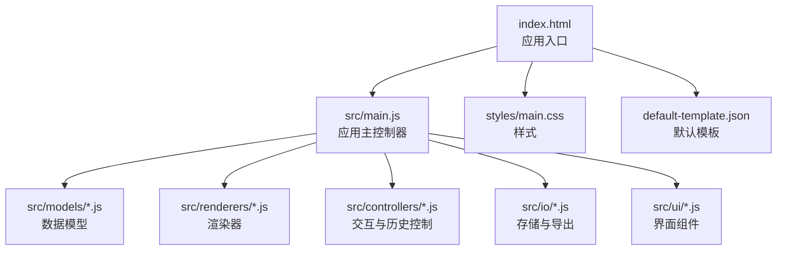
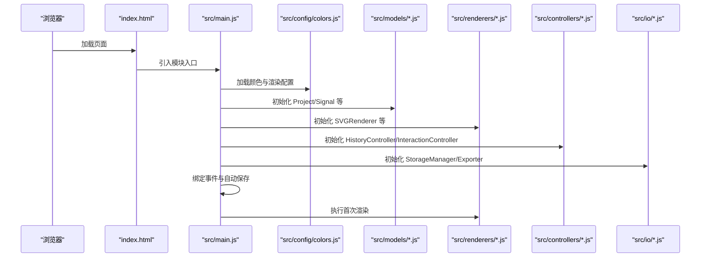
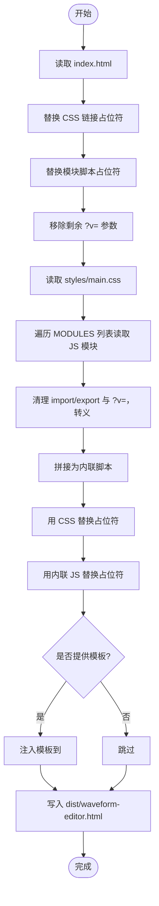
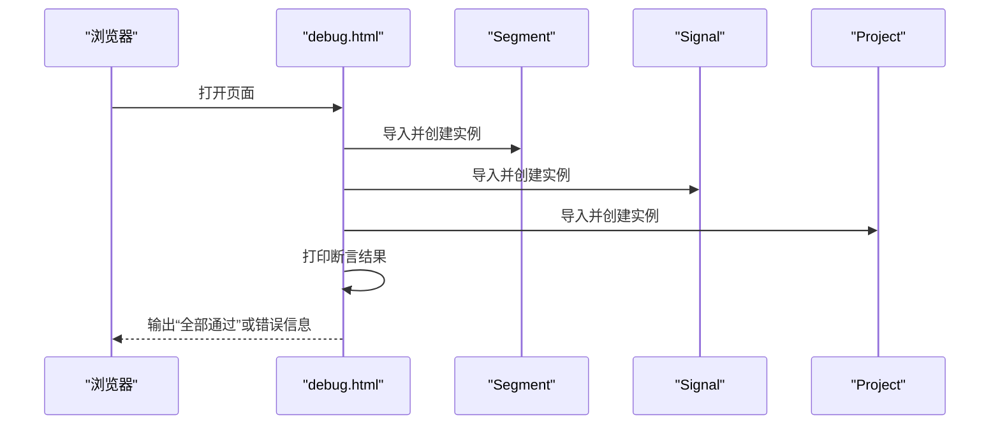
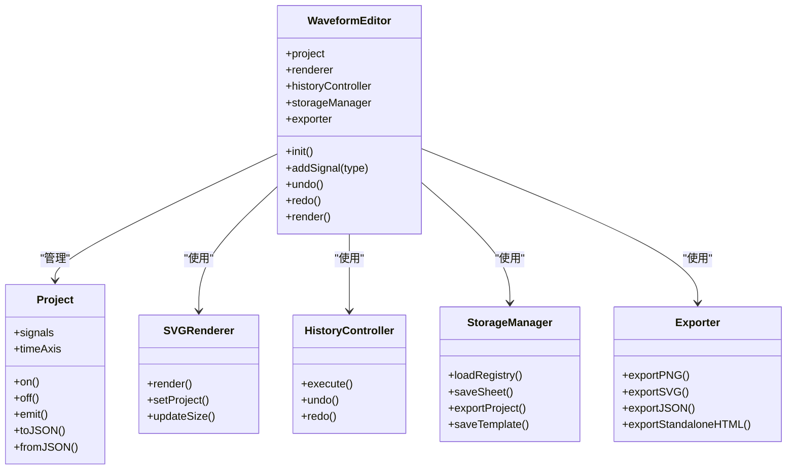
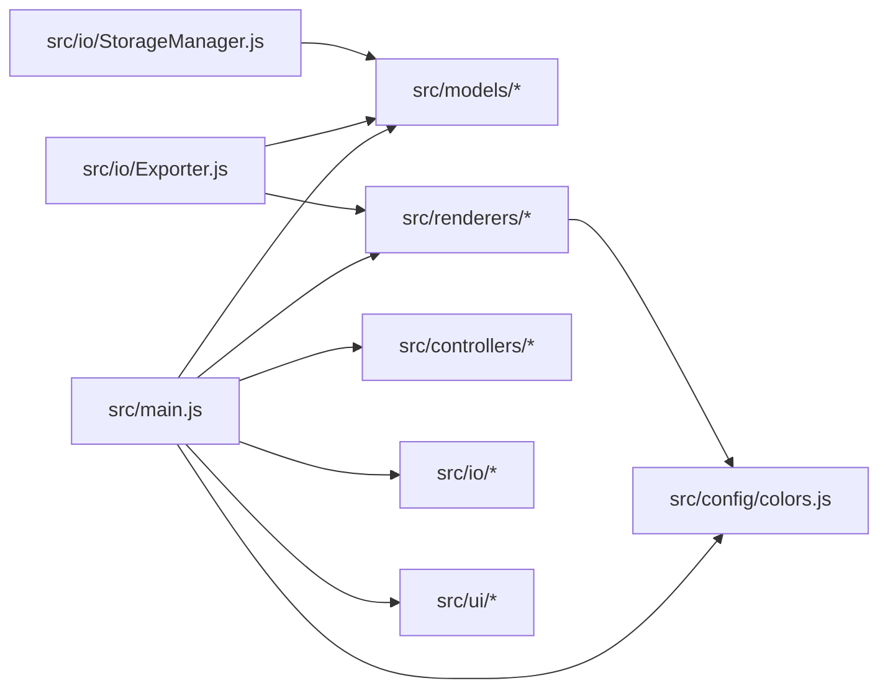

# 开发与构建

<cite>
**本文档引用的文件**
- [build.py](file://build.py)
- [debug.html](file://debug.html)
- [debug2.html](file://debug2.html)
- [index.html](file://index.html)
- [src/main.js](file://src/main.js)
- [src/config/colors.js](file://src/config/colors.js)
- [src/models/Project.js](file://src/models/Project.js)
- [src/renderers/SVGRenderer.js](file://src/renderers/SVGRenderer.js)
- [src/io/Exporter.js](file://src/io/Exporter.js)
- [src/io/StorageManager.js](file://src/io/StorageManager.js)
- [src/models/Signal.js](file://src/models/Signal.js)
- [src/controllers/HistoryController.js](file://src/controllers/HistoryController.js)
- [styles/main.css](file://styles/main.css)
- [tests/test-runner.html](file://tests/test-runner.html)
- [default-template.json](file://default-template.json)
</cite>

## 目录
1. [简介](#简介)
2. [项目结构](#项目结构)
3. [核心组件](#核心组件)
4. [架构总览](#架构总览)
5. [详细组件分析](#详细组件分析)
6. [依赖分析](#依赖分析)
7. [性能考虑](#性能考虑)
8. [故障排查指南](#故障排查指南)
9. [结论](#结论)
10. [附录](#附录)

## 简介
本指南面向波形图编辑器的开发者与贡献者，提供从开发环境搭建、构建脚本使用、调试工具到代码规范与质量保障的全流程说明。文档重点涵盖：
- 开发环境要求与工具链
- 构建脚本 build.py 的功能与使用
- 调试工具 debug.html 与 debug2.html 的使用场景
- 代码规范、最佳实践与质量保证
- 常见问题与性能优化建议
- 贡献流程与协作规范

## 项目结构
项目采用模块化的前端架构，核心由模型层、渲染层、控制器层、IO 层与 UI 组件构成，配合统一的样式与入口页面组织而成。

图表来源
- [index.html](file://index.html)
- [src/main.js](file://src/main.js)
- [styles/main.css](file://styles/main.css)
- [default-template.json](file://default-template.json)

章节来源
- [index.html](file://index.html)
- [src/main.js](file://src/main.js)
- [styles/main.css](file://styles/main.css)
- [default-template.json](file://default-template.json)

## 核心组件
- 应用入口与初始化：应用通过入口模块加载配置、模型、渲染器、控制器、UI 与 IO 组件，完成项目加载、渲染器初始化、事件绑定与自动保存等。
- 数据模型：包含项目、信号、片段与箭头等核心实体，支持序列化/反序列化与事件通知。
- 渲染器：负责 SVG 画布的尺寸计算、网格与时间轴绘制、信号与依赖箭头渲染。
- 控制器：处理用户交互、历史记录与撤销/重做。
- IO 与存储：提供本地存储、项目导入导出、模板管理与独立 HTML 导出能力。
- 调试与测试：提供专用调试页面与单元测试运行器，辅助验证模块导入与核心逻辑。

章节来源
- [src/main.js](file://src/main.js)
- [src/models/Project.js](file://src/models/Project.js)
- [src/renderers/SVGRenderer.js](file://src/renderers/SVGRenderer.js)
- [src/controllers/HistoryController.js](file://src/controllers/HistoryController.js)
- [src/io/Exporter.js](file://src/io/Exporter.js)
- [src/io/StorageManager.js](file://src/io/StorageManager.js)

## 架构总览
下图展示应用启动到渲染的关键流程，以及模块间的依赖关系。

图表来源
- [index.html](file://index.html)
- [src/main.js](file://src/main.js)
- [src/config/colors.js](file://src/config/colors.js)
- [src/renderers/SVGRenderer.js](file://src/renderers/SVGRenderer.js)
- [src/io/Exporter.js](file://src/io/Exporter.js)
- [src/io/StorageManager.js](file://src/io/StorageManager.js)

## 详细组件分析

### 构建脚本 build.py
- 功能概述
  - 将 HTML、CSS 与一组 JS 模块按顺序内联到单一 HTML 文件，便于离线部署与独立分发。
  - 支持可选模板注入，将模板 JSON 写入页面的全局变量，供运行时使用。
  - 移除模块导入语句、导出关键字与缓存查询参数，转义脚本终止符，避免解析异常。
- 使用方法
  - 基本用法：python3 build.py
  - 带模板：python3 build.py template.json
  - 输出：dist/waveform-editor.html
- 关键步骤
  - 读取 index.html 并替换 CSS 与模块脚本占位符
  - 读取 styles/main.css
  - 依序读取 MODULES 列表中的 JS 模块，清理导入/导出与缓存参数，拼接为内联脚本
  - 将 CSS 内联到 style 标签，JS 内联到自执行函数中
  - 如提供模板，注入到 <head>，仅替换首个 <head> 避免误伤
  - 写入 dist/waveform-editor.html 并输出文件大小

图表来源
- [build.py](file://build.py)

章节来源
- [build.py](file://build.py)

### 调试工具
- debug.html
  - 作用：验证模块导入与基础模型行为，逐项创建 Segment、Signal、Project 并打印结果，最后生成“全部通过”的日志。
  - 适用场景：快速确认模块可用性、基本数据结构与构造逻辑。
- debug2.html
  - 作用：按步骤导入并实例化颜色配置、Segment、Signal、Project、StorageManager、HistoryController、SVGRenderer、InteractionController、UI 组件与 Exporter，检查 DOM 元素创建与渲染器工作流。
  - 适用场景：端到端验证模块组合、渲染器初始化与交互链路。

图表来源
- [debug.html](file://debug.html)

章节来源
- [debug.html](file://debug.html)
- [debug2.html](file://debug2.html)

### 应用主控制器（src/main.js）
- 职责
  - 初始化项目、渲染器、控制器、UI 组件与导出器
  - 处理模板加载、旧数据迁移、sheet 管理与自动保存
  - 绑定事件、响应键盘快捷键、处理窗口尺寸变化
  - 提供添加信号、撤销/重做、打开/保存项目、导出 PNG/SVG/JSON/独立 HTML 等功能
- 关键流程
  - 项目加载与模板注入：优先使用页面注入的模板，其次使用本地模板，再回退至服务器模板或内置默认
  - sheet 生命周期：新增、切换、重命名、删除与注册表维护
  - 渲染协调：统一调度渲染器、信号面板与属性面板

图表来源
- [src/main.js](file://src/main.js)
- [src/models/Project.js](file://src/models/Project.js)
- [src/renderers/SVGRenderer.js](file://src/renderers/SVGRenderer.js)
- [src/controllers/HistoryController.js](file://src/controllers/HistoryController.js)
- [src/io/StorageManager.js](file://src/io/StorageManager.js)
- [src/io/Exporter.js](file://src/io/Exporter.js)

章节来源
- [src/main.js](file://src/main.js)
- [src/models/Project.js](file://src/models/Project.js)
- [src/renderers/SVGRenderer.js](file://src/renderers/SVGRenderer.js)
- [src/controllers/HistoryController.js](file://src/controllers/HistoryController.js)
- [src/io/StorageManager.js](file://src/io/StorageManager.js)
- [src/io/Exporter.js](file://src/io/Exporter.js)

### 数据模型与渲染器
- 颜色与渲染配置（src/config/colors.js）
  - 集中管理波形颜色、界面颜色、交互颜色与渲染配置，提供电平到坐标与颜色映射函数。
- 项目模型（src/models/Project.js）
  - 管理信号、箭头、注释与时间轴，提供事件系统与序列化/反序列化。
- 信号模型（src/models/Signal.js）
  - 支持分段波形、时钟生成、吸附与边界移动、分隔符与克隆。
- SVG 渲染器（src/renderers/SVGRenderer.js）
  - 负责尺寸计算、网格与时间轴绘制、信号与依赖箭头渲染、标题与输入框处理、裁剪区域与时钟竖线。

章节来源
- [src/config/colors.js](file://src/config/colors.js)
- [src/models/Project.js](file://src/models/Project.js)
- [src/models/Signal.js](file://src/models/Signal.js)
- [src/renderers/SVGRenderer.js](file://src/renderers/SVGRenderer.js)

### IO 与存储
- 存储管理（src/io/StorageManager.js）
  - 多 sheet 注册表、sheet 数据持久化、项目导入导出、模板保存与加载、旧数据迁移。
- 导出器（src/io/Exporter.js）
  - 支持 SVG/PNG/JSON 导出与剪贴板复制，提供独立 HTML 导出，内联样式与模块源码。

章节来源
- [src/io/StorageManager.js](file://src/io/StorageManager.js)
- [src/io/Exporter.js](file://src/io/Exporter.js)

### 测试与质量保障
- 单元测试运行器（tests/test-runner.html）
  - 覆盖 Segment、Signal、Project 的关键行为，包括构造、序列化/反序列化、事件系统、时间轴转换与移动信号等。
- 调试页面（debug.html、debug2.html）
  - 验证模块导入与端到端渲染链路，辅助定位问题。

章节来源
- [tests/test-runner.html](file://tests/test-runner.html)
- [debug.html](file://debug.html)
- [debug2.html](file://debug2.html)

## 依赖分析
- 模块依赖
  - src/main.js 作为中枢，依赖 config、models、renderers、controllers、io、ui 等模块。
  - 渲染器依赖颜色配置与子渲染器；导出器依赖渲染器与项目数据；存储管理提供跨模块的数据持久化。
- 外部依赖
  - 浏览器原生 API：fetch、XMLSerializer、Canvas、Clipboard API、localStorage 等。
  - 样式依赖：styles/main.css 提供布局与主题。

图表来源
- [src/main.js](file://src/main.js)
- [src/config/colors.js](file://src/config/colors.js)
- [src/renderers/SVGRenderer.js](file://src/renderers/SVGRenderer.js)
- [src/io/Exporter.js](file://src/io/Exporter.js)
- [src/io/StorageManager.js](file://src/io/StorageManager.js)

章节来源
- [src/main.js](file://src/main.js)
- [src/renderers/SVGRenderer.js](file://src/renderers/SVGRenderer.js)
- [src/io/Exporter.js](file://src/io/Exporter.js)
- [src/io/StorageManager.js](file://src/io/StorageManager.js)

## 性能考虑
- 渲染性能
  - 合理设置时间轴缩放与信号行高，避免过度密集的绘制。
  - 使用裁剪区域限制信号线绘制范围，减少溢出绘制。
  - 时钟竖线按周期生成，避免冗余。
- 导出性能
  - PNG 导出使用离屏 Canvas，注意缩放系数对内存与 CPU 的影响。
  - 剪贴板复制优先使用 Clipboard API，降级到 data URL 或新开窗口。
- 存储与模板
  - 模板与项目数据尽量精简，避免不必要的字段。
  - 多 sheet 场景下，批量导入导出时一次性写入，减少多次 I/O。
- 构建体积
  - build.py 将所有 JS/CSS 内联，减少请求数量，适合独立分发场景。

[本节为通用指导，无需列出具体文件来源]

## 故障排查指南
- 构建失败
  - 检查 Python 版本与依赖是否存在；确认 MODULES 列表中的模块路径正确。
  - 若模板注入失败，确认模板 JSON 格式有效且仅替换首个 <head>。
- 调试页面报错
  - 使用 debug.html 逐步定位模块导入与构造阶段的问题。
  - 使用 debug2.html 验证渲染器与交互链路。
- 运行时异常
  - 检查 localStorage 权限与容量；确认模板与项目数据格式正确。
  - 导出 PNG/剪贴板失败时，检查浏览器权限与 Clipboard API 支持情况。
- 样式问题
  - 确认 styles/main.css 已正确引入；检查容器尺寸与视口设置。

章节来源
- [build.py](file://build.py)
- [debug.html](file://debug.html)
- [debug2.html](file://debug2.html)
- [src/io/StorageManager.js](file://src/io/StorageManager.js)
- [src/io/Exporter.js](file://src/io/Exporter.js)
- [styles/main.css](file://styles/main.css)

## 结论
本指南提供了从开发环境、构建脚本、调试工具到质量保障与性能优化的完整参考。建议在开发过程中：
- 使用调试页面进行模块与端到端验证
- 通过 build.py 生成独立 HTML 以便分发
- 严格遵循模块化与事件驱动的设计原则
- 重视测试与本地存储的兼容性与稳定性

[本节为总结性内容，无需列出具体文件来源]

## 附录

### 开发环境搭建与工具链
- Node.js 与包管理器
  - 本项目主要使用浏览器原生 ES Module 与 Python 构建脚本，无需 Node.js 与 npm/yarn。
  - 若需扩展构建流程（如压缩、打包），可在本地安装 Node.js 与相应工具，但需自行评估与现有 build.py 的兼容性。
- 开发工具
  - 现代浏览器开发者工具用于断点调试与网络监控
  - 文本编辑器/IDE 配合语法高亮与 ESLint（如启用）

[本节为通用指导，无需列出具体文件来源]

### 代码规范与最佳实践
- 模块化
  - 严格按目录划分职责，避免循环依赖
- 命名与注释
  - 类型与方法命名清晰，关键逻辑提供注释
- 错误处理
  - 对外暴露的 API 应捕获并记录异常，必要时抛出明确错误
- 事件与状态
  - 使用事件系统解耦模块，避免直接耦合状态变更
- 性能
  - 避免频繁 DOM 操作，批量更新后再渲染
  - 合理使用缓存与裁剪区域

[本节为通用指导，无需列出具体文件来源]

### 质量保证措施
- 单元测试
  - 使用 tests/test-runner.html 覆盖核心模型与交互逻辑
- 集成测试
  - 使用 debug.html 与 debug2.html 验证端到端流程
- 构建校验
  - 通过 build.py 生成独立 HTML，验证内联资源与模板注入

章节来源
- [tests/test-runner.html](file://tests/test-runner.html)
- [debug.html](file://debug.html)
- [debug2.html](file://debug2.html)
- [build.py](file://build.py)

### 常见问题与解决方案
- 无法加载模板或默认模板
  - 检查 default-template.json 是否存在且格式正确
  - 确认页面注入模板的时机与作用域
- 导出 PNG 失败或空白
  - 检查 foreignObject 移除与样式内联逻辑
  - 确认 Canvas 尺寸与缩放系数
- 剪贴板复制失败
  - 检查浏览器权限与 Clipboard API 支持，必要时降级到 data URL 或新窗口方案
- 多 sheet 切换异常
  - 确认注册表与 sheet 数据一致性，检查事件监听与自动保存绑定

章节来源
- [src/io/Exporter.js](file://src/io/Exporter.js)
- [src/io/StorageManager.js](file://src/io/StorageManager.js)
- [default-template.json](file://default-template.json)

### 贡献流程
- 分支策略
  - 建议基于 main 分支创建特性分支，提交 PR 进行评审
- 提交流程
  - 修改代码后，先运行测试与调试页面验证
  - 更新相关文档与注释
  - 提交 PR 并关联问题或需求
- 代码审查
  - 关注模块职责、性能影响与兼容性

[本节为通用指导，无需列出具体文件来源]