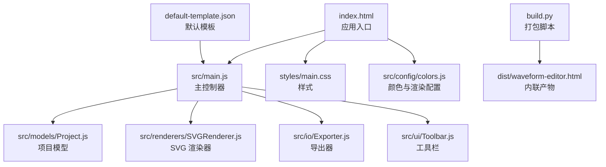
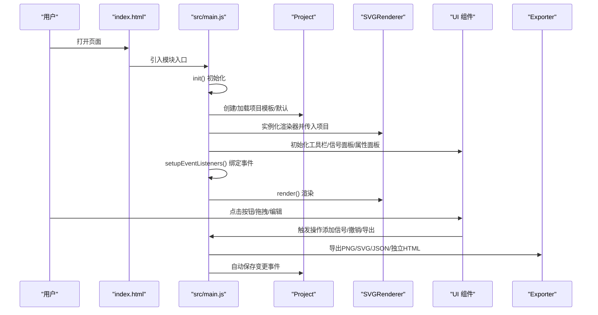
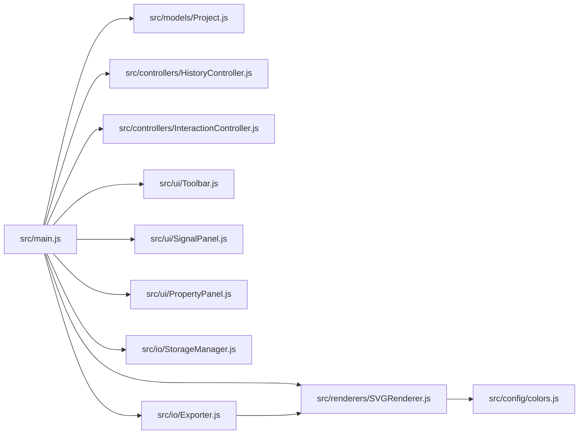

# 快速开始

<cite>
**本文引用的文件**
- [index.html](file://index.html)
- [src/main.js](file://src/main.js)
- [build.py](file://build.py)
- [default-template.json](file://default-template.json)
- [debug.html](file://debug.html)
- [src/models/Project.js](file://src/models/Project.js)
- [src/renderers/SVGRenderer.js](file://src/renderers/SVGRenderer.js)
- [src/io/Exporter.js](file://src/io/Exporter.js)
- [src/ui/Toolbar.js](file://src/ui/Toolbar.js)
- [styles/main.css](file://styles/main.css)
- [tests/test-runner.html](file://tests/test-runner.html)
- [src/config/colors.js](file://src/config/colors.js)
</cite>

## 目录
1. [简介](#简介)
2. [项目结构](#项目结构)
3. [核心组件](#核心组件)
4. [架构总览](#架构总览)
5. [详细组件解析](#详细组件解析)
6. [依赖关系分析](#依赖关系分析)
7. [性能与可用性建议](#性能与可用性建议)
8. [常见问题与故障排除](#常见问题与故障排除)
9. [结论](#结论)
10. [附录：安装与部署步骤](#附录安装与部署步骤)

## 简介
本指南面向初学者，帮助你快速搭建并使用波形图编辑器。你将了解：
- 环境要求与浏览器支持
- 如何下载、配置与启动
- 如何进行开发调试、构建与部署
- 基本操作：创建第一个波形图、添加信号、编辑波形段、导出结果
- 常见初始配置项与故障排除提示

## 项目结构
该项目采用模块化的前端架构，核心由 HTML 页面、样式、模块化 JS 以及构建脚本组成。主要目录与文件如下：
- index.html：应用入口页面，包含工具栏、信号面板、波形画布与属性面板等 UI 结构
- src/main.js：应用入口与主控制器，负责初始化项目、渲染器、交互与导出
- src/models/：数据模型（项目、信号、段、箭头）
- src/renderers/：渲染器（SVG、信号、时间轴、依赖箭头）
- src/io/：导入导出与本地存储
- src/ui/：UI 控件（工具栏、信号面板、属性面板）
- src/config/colors.js：颜色与渲染配置
- styles/main.css：全局样式
- build.py：打包脚本，将模块内联到单个 HTML 文件
- default-template.json：默认模板（可作为初始波形模板）
- debug.html：模块导入与基础功能的调试页面
- tests/test-runner.html：单元测试运行器

图表来源
- [index.html](file://index.html)
- [src/main.js](file://src/main.js)
- [src/models/Project.js](file://src/models/Project.js)
- [src/renderers/SVGRenderer.js](file://src/renderers/SVGRenderer.js)
- [src/io/Exporter.js](file://src/io/Exporter.js)
- [src/ui/Toolbar.js](file://src/ui/Toolbar.js)
- [styles/main.css](file://styles/main.css)
- [src/config/colors.js](file://src/config/colors.js)
- [build.py](file://build.py)
- [default-template.json](file://default-template.json)

章节来源
- [index.html](file://index.html)
- [src/main.js](file://src/main.js)
- [styles/main.css](file://styles/main.css)
- [src/config/colors.js](file://src/config/colors.js)
- [build.py](file://build.py)
- [default-template.json](file://default-template.json)

## 核心组件
- 应用入口与主控制器：负责初始化项目、渲染器、交互控制器、历史记录、导出器与 UI 组件，并设置事件监听与自动保存
- 项目模型：封装波形图项目的数据结构、时间轴、信号集合、依赖箭头与事件机制
- 渲染器：基于 SVG 的渲染器，协调信号渲染、时间轴渲染与依赖箭头渲染，并处理网格、标题、时钟周期竖线等
- 导出器：支持导出 SVG/PNG/JSON，以及复制到剪贴板与导出独立 HTML
- UI 组件：工具栏、信号面板、属性面板
- 配置：集中管理颜色、渲染参数与电平映射

章节来源
- [src/main.js](file://src/main.js)
- [src/models/Project.js](file://src/models/Project.js)
- [src/renderers/SVGRenderer.js](file://src/renderers/SVGRenderer.js)
- [src/io/Exporter.js](file://src/io/Exporter.js)
- [src/ui/Toolbar.js](file://src/ui/Toolbar.js)
- [src/config/colors.js](file://src/config/colors.js)

## 架构总览
下图展示了应用启动与渲染的关键流程：页面加载 -> 初始化编辑器 -> 加载模板/默认项目 -> 创建渲染器 -> 渲染 UI -> 用户交互 -> 导出与保存。

图表来源
- [index.html](file://index.html)
- [src/main.js](file://src/main.js)
- [src/models/Project.js](file://src/models/Project.js)
- [src/renderers/SVGRenderer.js](file://src/renderers/SVGRenderer.js)
- [src/io/Exporter.js](file://src/io/Exporter.js)

## 详细组件解析

### 应用入口与初始化（src/main.js）
- 初始化流程要点
  - 迁移旧数据与加载 sheet 注册表
  - 若无 sheet，创建默认项目并写入注册表与本地存储
  - 加载活跃 sheet 并迁移项目数据
  - 初始化渲染器、历史控制器、交互控制器、导出器与 UI 组件
  - 绑定事件监听（工具栏按钮、键盘快捷键、拖拽调整面板宽度、窗口 resize）
  - 注册自动保存（项目变更时保存）
  - 初始渲染与渲染 sheet 标签
- 默认项目创建策略
  - 优先使用内嵌模板（window.__WAVEFORM_TEMPLATE__），否则加载本地模板，再尝试加载服务器模板，最后回退到内置默认项目（包含时钟信号）

章节来源
- [src/main.js](file://src/main.js)

### 项目模型（src/models/Project.js）
- 职责：管理波形图项目的核心数据与行为
- 关键能力
  - 信号增删改查、移动信号顺序
  - 依赖箭头增删改查
  - 时间轴范围与缩放设置、时间与坐标互转
  - 事件系统（on/off/emit），用于通知渲染与 UI 更新
  - 序列化/反序列化（toJSON/fromJSON）

章节来源
- [src/models/Project.js](file://src/models/Project.js)

### SVG 渲染器（src/renderers/SVGRenderer.js）
- 职责：统一管理 SVG 画布、子渲染器与布局
- 关键能力
  - 计算并更新 SVG 尺寸，自动扩展时间轴以填满容器宽度
  - 渲染时间轴、信号、依赖箭头、网格、时钟周期竖线、项目名称
  - 提供信号索引与 Y 坐标映射、坐标转换
  - 创建 X 态填充图案、箭头发光滤镜与箭头标记

章节来源
- [src/renderers/SVGRenderer.js](file://src/renderers/SVGRenderer.js)
- [src/config/colors.js](file://src/config/colors.js)

### 导出器（src/io/Exporter.js）
- 职责：提供多种导出能力与独立 HTML 导出
- 支持能力
  - 导出 SVG/PNG/JSON
  - 复制到剪贴板（优先 Clipboard API，回退到 data URL 或新窗口）
  - 导出独立 HTML（内联所有 JS/CSS，无需服务器）

章节来源
- [src/io/Exporter.js](file://src/io/Exporter.js)

### 工具栏与 UI 组件（src/ui/Toolbar.js）
- 工具栏：承载“添加信号/时钟”、“撤销/重做”、“打开/保存/导出/复制/保存模板/重置模板/导出独立版”等按钮
- UI 组件：与主控制器交互，驱动渲染与导出

章节来源
- [src/ui/Toolbar.js](file://src/ui/Toolbar.js)
- [index.html](file://index.html)

### 样式与颜色配置（styles/main.css、src/config/colors.js）
- 样式：定义工具栏、信号面板、拖拽分隔条、信号项、网格与交互态等 UI 样式
- 颜色与渲染配置：集中管理波形颜色、界面颜色、渲染参数与电平映射

章节来源
- [styles/main.css](file://styles/main.css)
- [src/config/colors.js](file://src/config/colors.js)

## 依赖关系分析
- 模块依赖
  - src/main.js 依赖模型、渲染器、控制器、UI 与 IO 模块
  - 渲染器依赖颜色与渲染配置
  - 导出器依赖项目与渲染器
  - UI 组件依赖主控制器
- 构建依赖
  - build.py 按固定顺序读取模块源码，移除 import/export，内联到单个 HTML

图表来源
- [src/main.js](file://src/main.js)
- [src/models/Project.js](file://src/models/Project.js)
- [src/renderers/SVGRenderer.js](file://src/renderers/SVGRenderer.js)
- [src/io/Exporter.js](file://src/io/Exporter.js)
- [src/config/colors.js](file://src/config/colors.js)

章节来源
- [src/main.js](file://src/main.js)
- [build.py](file://build.py)

## 性能与可用性建议
- 自动扩展时间轴：在窗口 resize 时自动扩展时间轴以填满容器宽度，避免手动拖拽
- 信号面板宽度拖拽：可拖动面板分隔条调整信号面板宽度，渲染器同步左边界
- 事件驱动渲染：通过项目事件系统触发渲染，避免全量重绘
- 导出优化：PNG 导出支持缩放参数，独立 HTML 导出内联资源，便于离线使用

章节来源
- [src/renderers/SVGRenderer.js](file://src/renderers/SVGRenderer.js)
- [src/main.js](file://src/main.js)
- [src/io/Exporter.js](file://src/io/Exporter.js)

## 常见问题与故障排除
- 无法打开项目文件
  - 确认文件格式为 .wfp 或 .json
  - 检查文件是否损坏或为空
  - 查看控制台错误信息
- 导出失败或空白图片
  - 确保通过 HTTP 服务器访问（导出独立 HTML 需要从源文件读取）
  - 检查浏览器是否阻止了弹窗（复制到剪贴板可能需要新窗口）
- 模板未生效
  - 确认模板 JSON 结构正确
  - 若使用内嵌模板，确保在页面加载前设置 window.__WAVEFORM_TEMPLATE__
- 时钟信号未显示周期竖线
  - 确保存在类型为 clock 的信号且具有有效周期配置
- 信号面板宽度调整无效
  - 检查拖拽事件绑定是否正常，确认鼠标释放事件已触发

章节来源
- [src/main.js](file://src/main.js)
- [src/io/Exporter.js](file://src/io/Exporter.js)
- [src/renderers/SVGRenderer.js](file://src/renderers/SVGRenderer.js)

## 结论
本指南提供了从零开始使用波形图编辑器的完整路径：环境准备、安装与启动、基本操作、构建与部署、常见问题排查。通过模块化架构与清晰的职责划分，你可以轻松扩展功能、定制样式与导出策略。

## 附录：安装与部署步骤

### 环境要求
- 现代浏览器：支持 ES 模块与 SVG 的主流浏览器即可运行
- 开发环境：任意静态文件服务器（如 Python http.server、Live Server 等）
- 构建环境（可选）：Python 3（用于打包脚本）

章节来源
- [index.html](file://index.html)
- [build.py](file://build.py)

### 下载与配置
- 下载仓库后，确保以下文件存在：
  - index.html、styles/main.css、src/main.js、src/models/、src/renderers/、src/io/、src/ui/、src/config/colors.js、default-template.json
- 可选：准备自定义模板 JSON 文件，用于初始化项目

章节来源
- [index.html](file://index.html)
- [default-template.json](file://default-template.json)

### 启动开发服务器
- 推荐使用 Python 内置服务器（或其他静态服务器）
  - 进入项目根目录，执行命令启动服务
  - 在浏览器中访问 http://localhost:端口
- 也可使用 VS Code Live Server 等插件

章节来源
- [index.html](file://index.html)

### 构建项目
- 使用打包脚本将所有 JS/CSS 内联到单个 HTML 文件
  - 命令：python3 build.py
  - 输出：dist/waveform-editor.html
  - 可选：python3 build.py template.json（注入模板）

章节来源
- [build.py](file://build.py)

### 部署到生产环境
- 将 dist/waveform-editor.html 与 styles/main.css 放置于 Web 服务器根目录
- 通过 HTTP/HTTPS 访问，无需额外依赖
- 若需模板注入，可在构建时指定模板文件

章节来源
- [build.py](file://build.py)

### 基本使用示例
- 创建第一个波形图
  - 打开页面后，若无 sheet，系统会自动创建默认项目（包含时钟信号）
  - 你也可以通过“打开”按钮导入 .wfp/.json 文件
- 添加信号
  - 点击“+ 信号”或“+ 时钟”，系统会在当前选中信号之后插入，否则追加到末尾
- 编辑波形段
  - 在信号面板中选中信号，拖动时间轴上的段边缘或中间区域进行编辑
  - 使用“撤销/重做”按钮回退/前进操作
- 导出结果
  - 导出 PNG：适合截图分享
  - 导出 SVG：适合矢量编辑与二次处理
  - 导出 JSON：适合备份与迁移
  - 复制到剪贴板：优先使用 Clipboard API，失败时回退到 data URL 或新窗口
  - 导出独立 HTML：内联所有资源，便于直接分发给他人使用

章节来源
- [src/main.js](file://src/main.js)
- [src/io/Exporter.js](file://src/io/Exporter.js)
- [index.html](file://index.html)

### 常见初始配置选项
- 模板注入
  - 通过 window.__WAVEFORM_TEMPLATE__ 注入模板
  - 或使用构建脚本注入模板文件
- 项目标题与字体
  - 项目名称位于时间轴下方或上方（titlePosition）
  - 字体族、字号、粗细可通过项目属性面板设置
- 渲染参数
  - 信号高度、间距、波形高度、跳变沿宽度等由 RENDER_CONFIG 控制
- 颜色主题
  - 正常电平、高阻态、不定态、总线、信号名、网格、交互高亮等由 COLORS 控制

章节来源
- [src/main.js](file://src/main.js)
- [src/config/colors.js](file://src/config/colors.js)
- [src/renderers/SVGRenderer.js](file://src/renderers/SVGRenderer.js)

### 故障排除提示
- 页面空白或模块加载失败
  - 确保通过 HTTP/HTTPS 访问，避免 file:// 协议导致的跨域限制
  - 检查浏览器控制台是否有模块导入错误
- 导出独立 HTML 失败
  - 确保 index.html 与 styles/main.css 可被服务器访问
  - 检查网络请求是否成功
- 模板未生效
  - 确认模板 JSON 结构与字段与项目模型一致
  - 检查模板注入时机（页面加载前）

章节来源
- [src/io/Exporter.js](file://src/io/Exporter.js)
- [src/main.js](file://src/main.js)