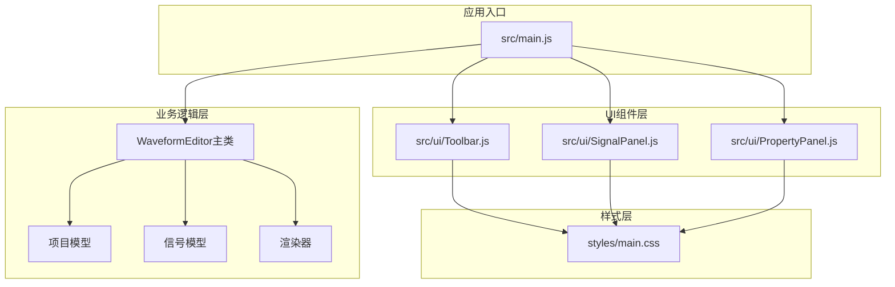
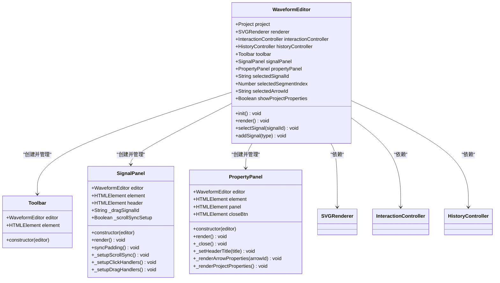
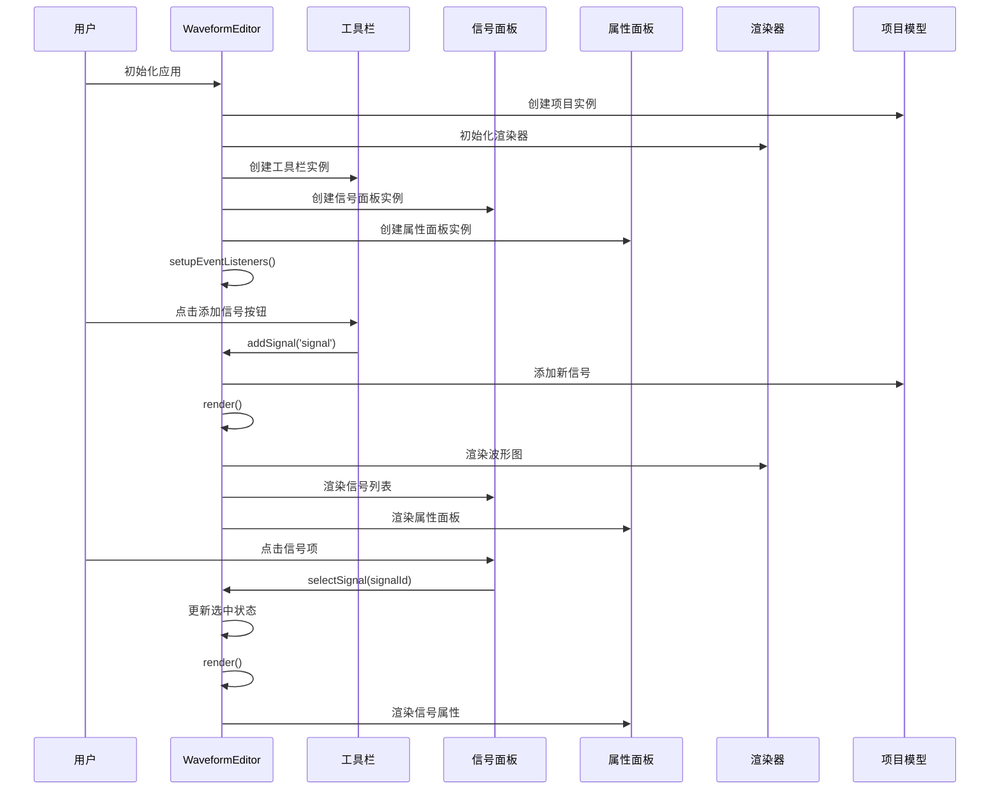
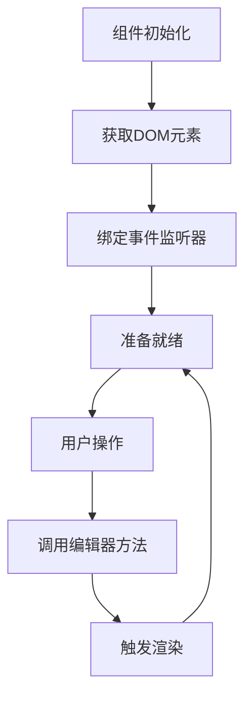
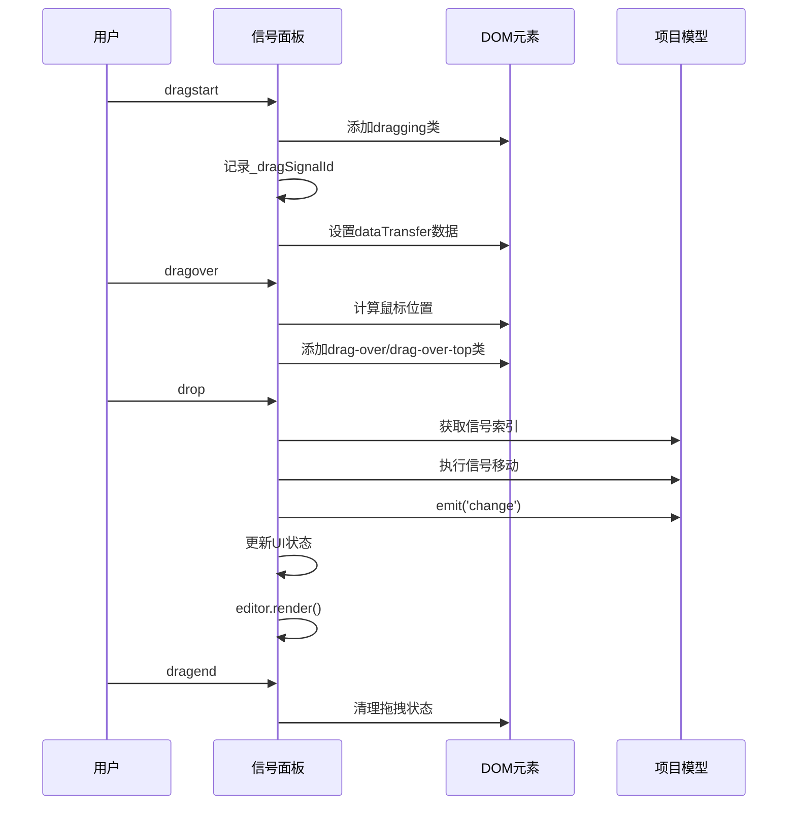
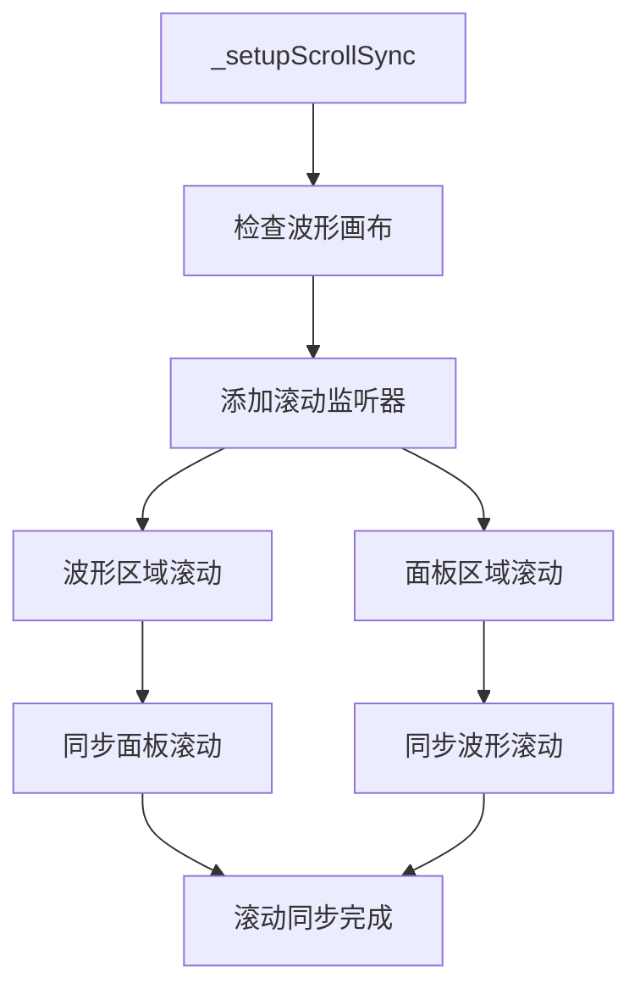
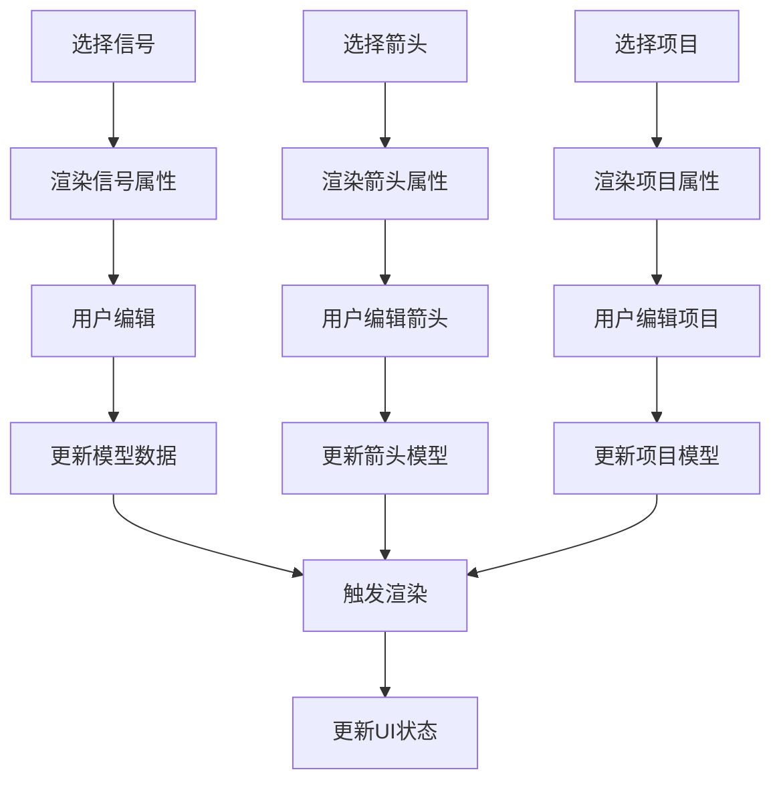
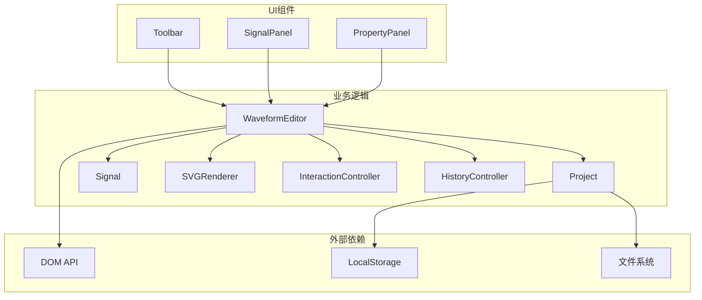

# UI组件扩展开发

<cite>
**本文档引用的文件**
- [src/ui/Toolbar.js](file://src/ui/Toolbar.js)
- [src/ui/SignalPanel.js](file://src/ui/SignalPanel.js)
- [src/ui/PropertyPanel.js](file://src/ui/PropertyPanel.js)
- [src/main.js](file://src/main.js)
- [styles/main.css](file://styles/main.css)
- [src/models/Signal.js](file://src/models/Signal.js)
- [src/renderers/SVGRenderer.js](file://src/renderers/SVGRenderer.js)
- [index.html](file://index.html)
</cite>

## 目录
1. [简介](#简介)
2. [项目结构](#项目结构)
3. [核心组件](#核心组件)
4. [架构概览](#架构概览)
5. [详细组件分析](#详细组件分析)
6. [依赖关系分析](#依赖关系分析)
7. [性能考虑](#性能考虑)
8. [故障排除指南](#故障排除指南)
9. [结论](#结论)
10. [附录](#附录)

## 简介

本指南面向波形图编辑器的UI组件扩展开发，详细说明如何继承现有UI组件类来创建自定义界面组件。文档涵盖了UI组件的设计模式，包括组件生命周期、事件处理和状态管理，并提供了完整的自定义UI组件开发示例，包括工具栏按钮、信号面板扩展和属性面板定制。

波形图编辑器采用模块化的UI架构，主要包含三个核心UI组件：工具栏（Toolbar）、信号面板（SignalPanel）和属性面板（PropertyPanel）。这些组件通过编辑器主类（WaveformEditor）进行协调，实现了数据驱动的界面更新和事件通信机制。

## 项目结构

波形图编辑器采用清晰的模块化组织方式，UI组件位于`src/ui/`目录下，每个组件都有明确的职责分工：



**图表来源**
- [src/main.js:1-132](file://src/main.js#L1-L132)
- [src/ui/Toolbar.js:1-6](file://src/ui/Toolbar.js#L1-L6)
- [src/ui/SignalPanel.js:1-164](file://src/ui/SignalPanel.js#L1-L164)
- [src/ui/PropertyPanel.js:1-507](file://src/ui/PropertyPanel.js#L1-L507)

**章节来源**
- [src/main.js:18-44](file://src/main.js#L18-L44)
- [index.html:10-83](file://index.html#L10-L83)

## 核心组件

### WaveformEditor 主类

WaveformEditor是整个应用的核心控制器，负责协调各个子系统的工作。它维护着应用的状态，包括当前选中的信号、段落和箭头，以及项目相关的各种配置。

主要职责：
- 管理应用生命周期和初始化流程
- 协调UI组件之间的数据同步
- 处理用户交互事件
- 管理项目数据的持久化
- 提供统一的渲染接口

### UI组件设计模式

所有UI组件都遵循相似的设计模式：



**图表来源**
- [src/main.js:21-44](file://src/main.js#L21-L44)
- [src/ui/Toolbar.js:1-6](file://src/ui/Toolbar.js#L1-L6)
- [src/ui/SignalPanel.js:1-164](file://src/ui/SignalPanel.js#L1-L164)
- [src/ui/PropertyPanel.js:1-507](file://src/ui/PropertyPanel.js#L1-L507)

**章节来源**
- [src/main.js:21-44](file://src/main.js#L21-L44)
- [src/ui/Toolbar.js:1-6](file://src/ui/Toolbar.js#L1-L6)
- [src/ui/SignalPanel.js:1-164](file://src/ui/SignalPanel.js#L1-L164)
- [src/ui/PropertyPanel.js:1-507](file://src/ui/PropertyPanel.js#L1-L507)

## 架构概览

波形图编辑器采用分层架构设计，实现了UI与业务逻辑的有效分离：



**图表来源**
- [src/main.js:49-132](file://src/main.js#L49-L132)
- [src/main.js:451-629](file://src/main.js#L451-L629)
- [src/ui/SignalPanel.js:69-87](file://src/ui/SignalPanel.js#L69-L87)

**章节来源**
- [src/main.js:49-132](file://src/main.js#L49-L132)
- [src/main.js:763-769](file://src/main.js#L763-L769)

## 详细组件分析

### 工具栏组件（Toolbar）

Toolbar组件负责提供应用的主要操作入口，包括信号添加、撤销重做、项目导入导出等功能。

#### 设计特点

- **轻量级设计**：只持有编辑器引用和DOM元素引用
- **事件绑定**：通过编辑器提供的方法处理用户交互
- **无状态管理**：不维护复杂的内部状态

#### 生命周期管理



**图表来源**
- [src/ui/Toolbar.js:1-6](file://src/ui/Toolbar.js#L1-L6)
- [src/main.js:451-561](file://src/main.js#L451-L561)

**章节来源**
- [src/ui/Toolbar.js:1-6](file://src/ui/Toolbar.js#L1-L6)
- [src/main.js:451-561](file://src/main.js#L451-L561)

### 信号面板组件（SignalPanel）

SignalPanel是波形图编辑器中最复杂的UI组件之一，负责信号列表的展示、交互和同步。

#### 核心功能

1. **信号列表渲染**：动态生成信号项，支持选中状态显示
2. **拖拽排序**：实现信号的拖拽重排功能
3. **滚动同步**：与波形区域保持垂直滚动同步
4. **信号管理**：提供信号删除等操作

#### 拖拽排序实现



**图表来源**
- [src/ui/SignalPanel.js:89-163](file://src/ui/SignalPanel.js#L89-L163)
- [src/ui/SignalPanel.js:134-161](file://src/ui/SignalPanel.js#L134-L161)

#### 滚动同步机制



**图表来源**
- [src/ui/SignalPanel.js:31-43](file://src/ui/SignalPanel.js#L31-L43)

**章节来源**
- [src/ui/SignalPanel.js:1-164](file://src/ui/SignalPanel.js#L1-L164)

### 属性面板组件（PropertyPanel）

PropertyPanel是最复杂的数据驱动UI组件，负责信号属性、箭头属性和项目设置的编辑。

#### 数据流设计



**图表来源**
- [src/ui/PropertyPanel.js:32-67](file://src/ui/PropertyPanel.js#L32-L67)
- [src/ui/PropertyPanel.js:242-377](file://src/ui/PropertyPanel.js#L242-L377)
- [src/ui/PropertyPanel.js:382-506](file://src/ui/PropertyPanel.js#L382-L506)

#### 属性面板渲染策略

属性面板采用了条件渲染的策略，根据不同的选中状态显示相应的属性编辑界面：

1. **箭头属性**：当存在选中的箭头时优先显示
2. **信号属性**：当选中信号且无箭头时显示
3. **项目属性**：当未选中任何对象且显示项目属性时显示

**章节来源**
- [src/ui/PropertyPanel.js:1-507](file://src/ui/PropertyPanel.js#L1-L507)

## 依赖关系分析

### 组件间依赖关系



**图表来源**
- [src/main.js:12-16](file://src/main.js#L12-L16)
- [src/main.js:21-44](file://src/main.js#L21-L44)

### 数据流依赖

波形图编辑器的数据流遵循单向数据流原则：

1. **用户操作** → **编辑器方法** → **模型更新** → **事件触发** → **UI重新渲染**
2. **模型变更** → **事件监听器** → **自动保存** → **状态同步**

**章节来源**
- [src/main.js:230-241](file://src/main.js#L230-L241)
- [src/main.js:763-769](file://src/main.js#L763-L769)

## 性能考虑

### 渲染优化策略

1. **增量渲染**：属性面板采用局部更新策略，避免重建整个面板
2. **事件节流**：窗口大小变化事件使用防抖机制
3. **虚拟滚动**：信号面板支持大量信号的高效渲染
4. **CSS动画**：使用硬件加速的CSS变换而非JavaScript动画

### 内存管理

1. **事件监听器清理**：组件销毁时及时移除事件监听器
2. **DOM引用管理**：避免循环引用导致的内存泄漏
3. **定时器清理**：及时清理setTimeout和setInterval

### 响应式设计

波形图编辑器采用以下响应式设计策略：

1. **Flexbox布局**：使用弹性布局适应不同屏幕尺寸
2. **CSS Grid**：在需要时使用网格布局
3. **媒体查询**：针对不同设备优化UI显示
4. **触摸友好的交互**：支持触摸设备的操作

**章节来源**
- [src/main.js:588-595](file://src/main.js#L588-L595)
- [styles/main.css:18-22](file://styles/main.css#L18-L22)

## 故障排除指南

### 常见问题及解决方案

#### UI组件初始化失败

**问题症状**：组件无法正常显示或功能异常

**可能原因**：
1. DOM元素未正确加载
2. 编辑器实例未正确传递
3. 依赖的样式文件缺失

**解决步骤**：
1. 检查DOM元素是否存在
2. 验证编辑器实例的完整性
3. 确认样式文件加载成功

#### 事件绑定失效

**问题症状**：用户交互无响应

**可能原因**：
1. 事件监听器重复绑定
2. DOM元素被重新渲染覆盖
3. 作用域问题导致this指向错误

**解决步骤**：
1. 检查事件监听器的绑定时机
2. 确保在正确的DOM状态下绑定事件
3. 使用箭头函数或bind方法固定this指向

#### 性能问题

**问题症状**：界面卡顿或渲染缓慢

**可能原因**：
1. 频繁的DOM操作
2. 未优化的事件处理
3. 过多的重排重绘

**解决步骤**：
1. 使用requestAnimationFrame优化动画
2. 实施事件委托减少监听器数量
3. 批量更新DOM而不是逐个更新

**章节来源**
- [src/ui/SignalPanel.js:31-43](file://src/ui/SignalPanel.js#L31-L43)
- [src/ui/PropertyPanel.js:126-132](file://src/ui/PropertyPanel.js#L126-L132)

## 结论

波形图编辑器的UI组件扩展开发遵循了清晰的模块化设计原则，通过继承现有的UI组件类可以快速创建功能丰富的自定义界面组件。关键的设计要点包括：

1. **单一职责原则**：每个UI组件专注于特定的功能领域
2. **数据驱动**：UI状态完全由应用状态驱动
3. **事件通信**：通过编辑器作为中介进行组件间通信
4. **响应式设计**：支持多种设备和屏幕尺寸
5. **性能优化**：采用增量渲染和事件优化策略

开发者在扩展UI组件时应该重点关注组件的生命周期管理、事件处理机制和状态同步，确保新组件能够无缝集成到现有的架构中。

## 附录

### 自定义UI组件开发最佳实践

#### 组件继承模式

```javascript
// 基于现有组件的扩展
class CustomToolbar extends Toolbar {
    constructor(editor) {
        super(editor);
        this.customElement = document.createElement('div');
        this.customElement.className = 'custom-toolbar';
        this.element.appendChild(this.customElement);
    }
    
    // 扩展功能
    addCustomButton() {
        const button = document.createElement('button');
        button.textContent = '自定义按钮';
        button.addEventListener('click', () => this.handleCustomAction());
        this.customElement.appendChild(button);
    }
    
    handleCustomAction() {
        // 自定义处理逻辑
        this.editor.customMethod();
    }
}
```

#### 状态管理建议

1. **集中式状态**：将组件状态存储在编辑器实例中
2. **事件驱动**：通过事件通知其他组件状态变化
3. **不可变更新**：使用不可变数据结构避免意外修改

#### 可访问性考虑

1. **键盘导航**：确保所有功能可通过键盘访问
2. **屏幕阅读器支持**：为重要元素提供适当的ARIA属性
3. **颜色对比度**：确保文本和背景有足够的对比度
4. **焦点管理**：合理管理键盘焦点的移动

#### 跨浏览器兼容性

1. **特性检测**：使用特性检测而非浏览器检测
2. **Polyfill使用**：为旧浏览器提供必要的polyfill
3. **渐进增强**：基础功能在所有浏览器中可用
4. **测试覆盖**：在目标浏览器版本中进行全面测试