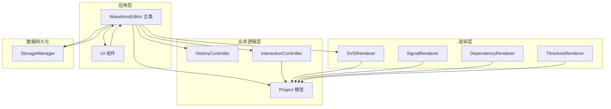
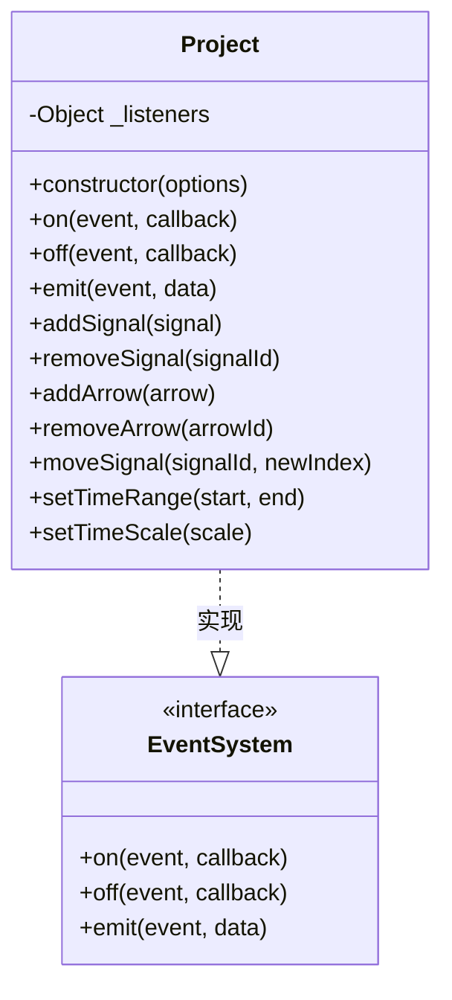
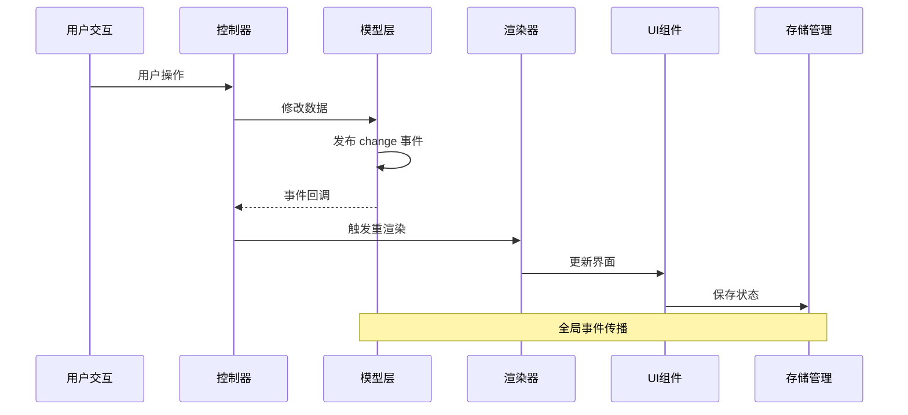
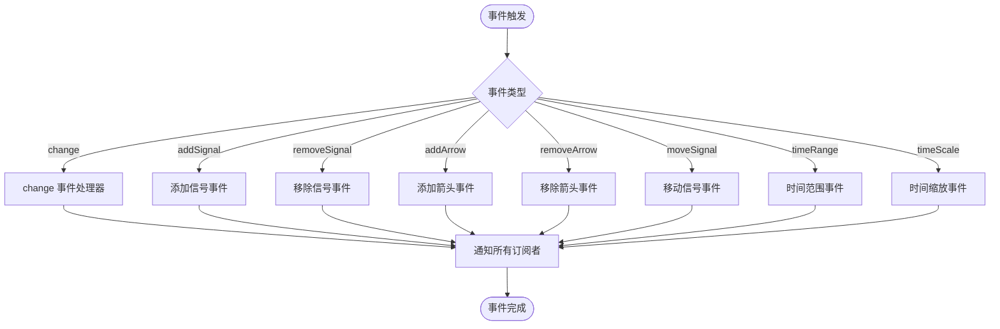
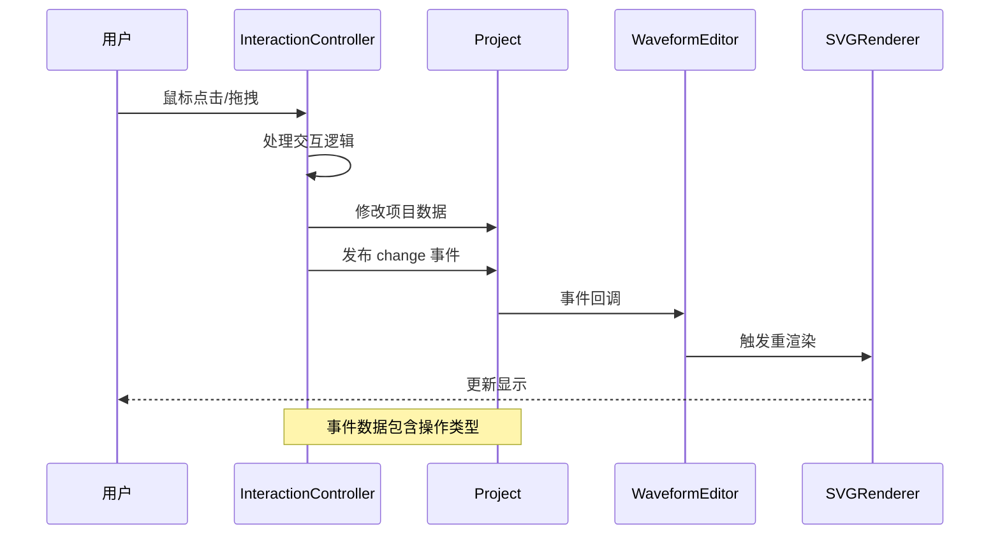
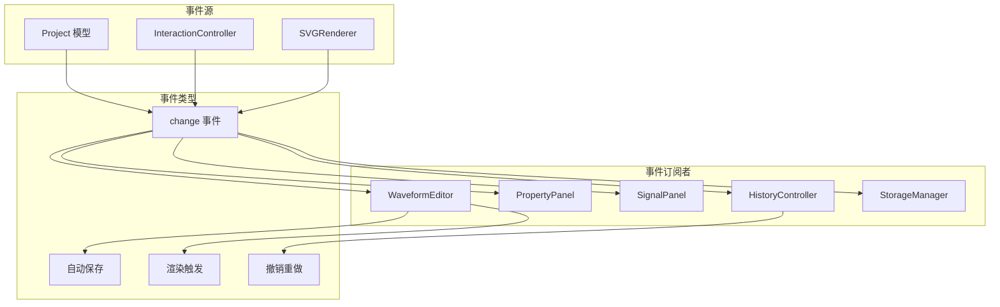

# 事件系统扩展

<cite>
**本文档引用的文件**
- [src/main.js](file://src/main.js)
- [src/models/Project.js](file://src/models/Project.js)
- [src/controllers/InteractionController.js](file://src/controllers/InteractionController.js)
- [src/renderers/SVGRenderer.js](file://src/renderers/SVGRenderer.js)
- [src/ui/PropertyPanel.js](file://src/ui/PropertyPanel.js)
- [src/ui/SignalPanel.js](file://src/ui/SignalPanel.js)
- [src/controllers/HistoryController.js](file://src/controllers/HistoryController.js)
- [src/io/StorageManager.js](file://src/io/StorageManager.js)
- [tests/test-runner.html](file://tests/test-runner.html)
</cite>

## 目录
1. [简介](#简介)
2. [项目结构](#项目结构)
3. [核心组件](#核心组件)
4. [架构概览](#架构概览)
5. [详细组件分析](#详细组件分析)
6. [依赖分析](#依赖分析)
7. [性能考虑](#性能考虑)
8. [故障排除指南](#故障排除指南)
9. [结论](#结论)
10. [附录](#附录)

## 简介

本指南面向波形图编辑器的事件系统扩展开发，详细说明如何使用和扩展项目的事件系统来实现自定义事件处理。文档基于项目现有的观察者模式实现，涵盖事件订阅、发布和取消订阅机制，并提供完整的自定义事件开发示例。

项目采用基于对象的事件系统，主要围绕 Project 模型实现，通过 on/off/emit 方法提供事件订阅和发布功能。事件系统广泛应用于用户交互、项目状态变更和渲染控制等场景。

## 项目结构

波形图编辑器采用模块化架构，事件系统贯穿于各个组件之间：



**图表来源**
- [src/main.js:21-44](file://src/main.js#L21-L44)
- [src/models/Project.js:8-34](file://src/models/Project.js#L8-L34)

**章节来源**
- [src/main.js:1-819](file://src/main.js#L1-L819)
- [src/models/Project.js:1-245](file://src/models/Project.js#L1-L245)

## 核心组件

### 事件系统基础

项目的核心事件系统基于 Project 模型实现，提供完整的观察者模式支持：



**图表来源**
- [src/models/Project.js:177-202](file://src/models/Project.js#L177-L202)

### 事件订阅机制

事件订阅通过 on 方法实现，支持为特定事件类型注册回调函数：

**章节来源**
- [src/models/Project.js:177-182](file://src/models/Project.js#L177-L182)

### 事件发布机制

事件发布通过 emit 方法实现，支持向所有订阅者广播事件并传递数据：

**章节来源**
- [src/models/Project.js:199-202](file://src/models/Project.js#L199-L202)

### 事件取消订阅机制

事件取消订阅通过 off 方法实现，支持移除特定的事件回调：

**章节来源**
- [src/models/Project.js:189-192](file://src/models/Project.js#L189-L192)

## 架构概览

事件系统在波形图编辑器中的整体架构如下：



**图表来源**
- [src/main.js:226-241](file://src/main.js#L226-L241)
- [src/controllers/InteractionController.js:284-337](file://src/controllers/InteractionController.js#L284-L337)

## 详细组件分析

### 项目模型事件系统

Project 模型实现了完整的事件系统，是整个应用的核心事件源：



**图表来源**
- [src/models/Project.js:47-144](file://src/models/Project.js#L47-L144)

#### 事件类型定义

项目支持多种事件类型，每种事件都有特定的数据结构：

**章节来源**
- [src/models/Project.js:47-144](file://src/models/Project.js#L47-L144)

### 交互控制器事件处理

InteractionController 作为用户交互的核心，负责处理各种用户操作并触发相应的事件：



**图表来源**
- [src/controllers/InteractionController.js:284-337](file://src/controllers/InteractionController.js#L284-L337)

#### 交互事件示例

**章节来源**
- [src/controllers/InteractionController.js:284-337](file://src/controllers/InteractionController.js#L284-L337)

### 渲染器事件集成

SVGRenderer 与事件系统的集成体现在多个方面：

**章节来源**
- [src/renderers/SVGRenderer.js:479-481](file://src/renderers/SVGRenderer.js#L479-L481)

### UI 组件事件响应

PropertyPanel 和 SignalPanel 作为 UI 组件，通过事件系统实现与模型层的数据同步：

**章节来源**
- [src/ui/PropertyPanel.js:130-132](file://src/ui/PropertyPanel.js#L130-L132)

## 依赖分析

事件系统在项目中的依赖关系如下：



**图表来源**
- [src/main.js:226-241](file://src/main.js#L226-L241)
- [src/models/Project.js:177-202](file://src/models/Project.js#L177-L202)

**章节来源**
- [src/main.js:226-241](file://src/main.js#L226-L241)
- [src/models/Project.js:177-202](file://src/models/Project.js#L177-L202)

## 性能考虑

### 事件处理性能优化

1. **事件去抖处理**：对于频繁触发的事件（如窗口大小变化），使用定时器进行去抖处理
2. **批量更新**：将多个相关的事件合并处理，减少重复渲染
3. **条件渲染**：只在必要时触发渲染更新

### 内存泄漏防护

1. **事件清理**：在组件销毁时及时移除事件监听器
2. **循环引用避免**：确保事件回调不持有对父对象的强引用
3. **自动保存清理**：切换项目时清理之前的自动保存监听器

**章节来源**
- [src/main.js:226-241](file://src/main.js#L226-L241)

## 故障排除指南

### 常见事件系统问题

1. **事件未触发**：检查事件监听器是否正确注册
2. **事件重复触发**：确认是否存在重复注册的情况
3. **内存泄漏**：定期检查事件监听器的生命周期管理

### 调试技巧

1. **事件日志**：在关键事件点添加日志输出
2. **事件追踪**：使用浏览器开发者工具监控事件流
3. **单元测试**：编写针对事件系统的测试用例

**章节来源**
- [tests/test-runner.html:267-282](file://tests/test-runner.html#L267-L282)

## 结论

波形图编辑器的事件系统为构建响应式的用户界面提供了强大的基础设施。通过观察者模式的实现，系统实现了组件间的松耦合通信，使得用户交互、数据变更和界面更新能够高效协同工作。

扩展事件系统的关键在于：
- 明确事件的语义和数据结构
- 合理的事件传播策略
- 适当的性能优化措施
- 完善的错误处理和调试机制

## 附录

### 自定义事件开发指南

#### 全局事件 vs 局部事件

**全局事件**：通过 Project 模型发布，影响整个应用状态
**局部事件**：通过特定组件发布，仅影响局部状态

#### 复杂数据结构传递

事件数据应包含足够的上下文信息，便于订阅者正确处理：

```javascript
// 示例事件数据结构
{
  type: 'customOperation',
  operationId: 'op_123',
  timestamp: Date.now(),
  payload: {
    // 具体操作数据
  },
  source: 'componentName'
}
```

#### 最佳实践

1. **事件命名规范**：使用清晰的事件名称描述操作意图
2. **数据最小化**：只传递必要的数据，避免大数据量传输
3. **异步处理**：对于耗时操作，考虑使用异步事件处理
4. **错误处理**：在事件回调中妥善处理异常情况