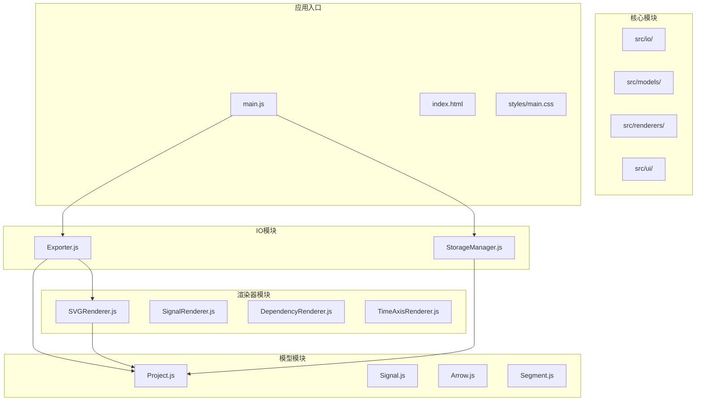
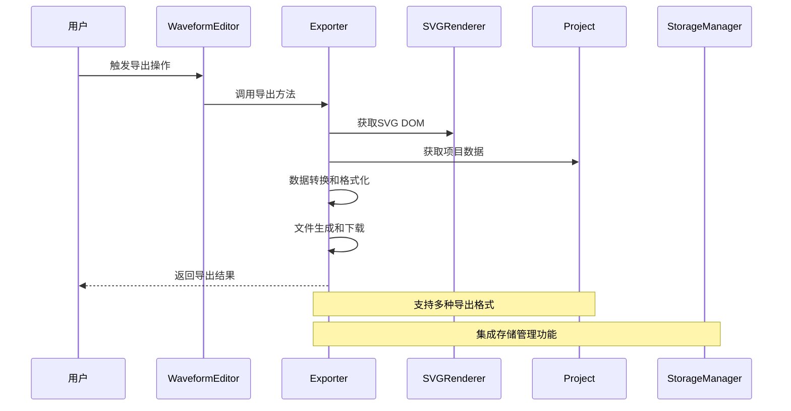
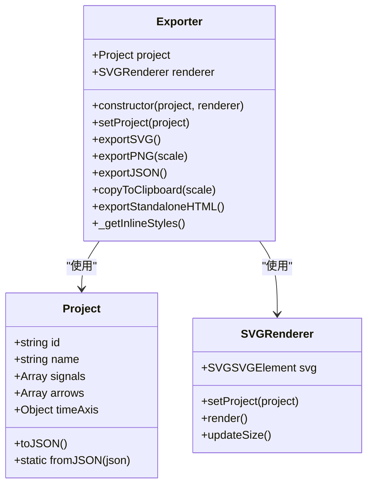
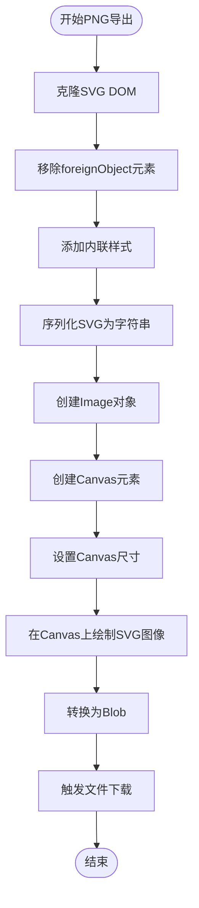
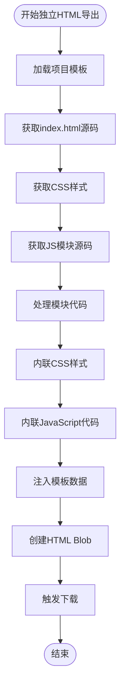
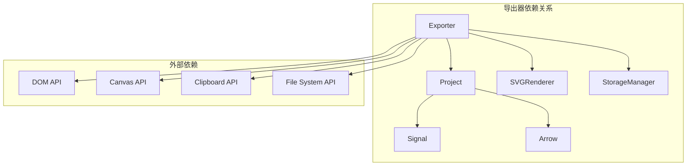

# 导出器扩展开发

<cite>
**本文档引用的文件**
- [Exporter.js](file://src/io/Exporter.js)
- [Project.js](file://src/models/Project.js)
- [Signal.js](file://src/models/Signal.js)
- [Arrow.js](file://src/models/Arrow.js)
- [SVGRenderer.js](file://src/renderers/SVGRenderer.js)
- [StorageManager.js](file://src/io/StorageManager.js)
- [main.js](file://src/main.js)
- [default-template.json](file://default-template.json)
</cite>

## 目录
1. [简介](#简介)
2. [项目结构](#项目结构)
3. [核心组件](#核心组件)
4. [架构概览](#架构概览)
5. [详细组件分析](#详细组件分析)
6. [依赖关系分析](#依赖关系分析)
7. [性能考虑](#性能考虑)
8. [故障排除指南](#故障排除指南)
9. [结论](#结论)
10. [附录](#附录)

## 简介

本文档为波形图编辑器的导出器扩展开发提供完整的技术指南。波形图编辑器是一个基于Web的交互式波形图绘制工具，支持多种导出格式，包括PNG图像、SVG矢量图、JSON数据和独立HTML文件。

导出器作为应用的核心组件之一，负责将项目数据转换为各种格式的输出文件。本文档将详细说明如何继承Exporter基类来支持新的导出格式，解释导出器的核心方法，包括导出配置、数据转换和文件生成流程，并提供完整的自定义导出格式开发示例。

## 项目结构

波形图编辑器采用模块化的JavaScript架构，主要目录结构如下：



**图表来源**
- [Exporter.js:1-298](file://src/io/Exporter.js#L1-L298)
- [main.js:1-819](file://src/main.js#L1-L819)

**章节来源**
- [Exporter.js:1-298](file://src/io/Exporter.js#L1-L298)
- [main.js:1-819](file://src/main.js#L1-L819)

## 核心组件

### Exporter基类

Exporter是所有导出功能的基础类，提供了统一的导出接口和通用功能。该类的核心特性包括：

- **项目管理**：维护当前项目实例和渲染器实例
- **多格式支持**：内置支持SVG、PNG、JSON、独立HTML等多种导出格式
- **剪贴板集成**：支持将导出内容复制到系统剪贴板
- **样式内联**：自动处理CSS样式内联，确保导出文件的完整性

### 项目数据模型

项目数据通过Project类进行管理，包含了波形图的所有信息：

- **信号数据**：Signal数组，表示各个波形信号
- **依赖关系**：Arrow数组，表示信号间的依赖关系
- **时间轴配置**：时间轴的起始、结束时间和缩放比例
- **样式配置**：字体、标题位置、颜色等视觉属性

**章节来源**
- [Exporter.js:1-298](file://src/io/Exporter.js#L1-L298)
- [Project.js:1-245](file://src/models/Project.js#L1-L245)

## 架构概览

波形图编辑器的导出架构采用了清晰的分层设计：



**图表来源**
- [Exporter.js:15-96](file://src/io/Exporter.js#L15-L96)
- [main.js:471-560](file://src/main.js#L471-L560)

### 导出流程

导出器的工作流程遵循以下模式：

1. **数据获取**：从Project实例获取完整的项目数据
2. **DOM克隆**：从SVGRenderer获取当前的SVG DOM结构
3. **样式处理**：内联必要的CSS样式到SVG元素
4. **格式转换**：将数据转换为目标格式
5. **文件生成**：创建Blob对象并触发下载

**章节来源**
- [Exporter.js:15-96](file://src/io/Exporter.js#L15-L96)
- [SVGRenderer.js:1-547](file://src/renderers/SVGRenderer.js#L1-L547)

## 详细组件分析

### Exporter类详解

Exporter类提供了完整的导出功能，以下是其核心方法的详细分析：

#### 基础构造和项目管理



**图表来源**
- [Exporter.js:1-298](file://src/io/Exporter.js#L1-L298)
- [Project.js:1-245](file://src/models/Project.js#L1-L245)
- [SVGRenderer.js:1-547](file://src/renderers/SVGRenderer.js#L1-L547)

#### SVG导出功能

SVG导出是最基础的导出格式，具有以下特点：

- **DOM克隆**：使用`cloneNode(true)`创建SVG的完整副本
- **样式内联**：通过`_getInlineStyles()`方法注入必要的CSS样式
- **XML序列化**：使用`XMLSerializer`将SVG DOM转换为字符串
- **文件下载**：创建Blob对象并触发浏览器下载

#### PNG导出功能

PNG导出涉及复杂的图像处理流程：



**图表来源**
- [Exporter.js:38-82](file://src/io/Exporter.js#L38-L82)

#### JSON数据导出

JSON导出是最简单的格式，直接使用Project的序列化功能：

- **数据序列化**：调用`project.toJSON()`获取项目数据
- **格式化输出**：使用`JSON.stringify()`生成格式化的JSON字符串
- **文件生成**：创建application/json类型的Blob对象

#### 剪贴板集成

导出器提供了强大的剪贴板集成功能：

- **Clipboard API**：优先使用现代的Clipboard API
- **回退机制**：当Clipboard API不可用时，使用data URL方式
- **图像窗口**：最后的回退方案是在新窗口中显示图像
- **异步处理**：完整的Promise链处理异步操作

#### 独立HTML导出

独立HTML导出是最复杂的功能，它能够创建完全自包含的HTML文件：



**图表来源**
- [Exporter.js:200-297](file://src/io/Exporter.js#L200-L297)

**章节来源**
- [Exporter.js:15-297](file://src/io/Exporter.js#L15-L297)

### 项目数据模型

#### Project类

Project类是波形图编辑器的核心数据模型：

- **唯一标识**：每个项目都有唯一的ID
- **信号管理**：支持添加、删除、移动信号
- **依赖关系**：管理信号间的依赖箭头
- **时间轴控制**：提供时间轴范围和缩放的管理
- **事件系统**：内置事件监听机制，支持变更通知

#### Signal类

Signal类表示单个波形信号：

- **类型系统**：支持普通信号、时钟信号和总线信号
- **波形段管理**：使用Segment数组表示波形的各个段
- **时钟生成**：自动生成时钟波形的段
- **分隔符支持**：支持在信号中添加垂直分隔符

#### Arrow类

Arrow类表示信号间的依赖关系：

- **双向支持**：支持单向和双向箭头
- **标签系统**：支持多个文字标签
- **样式定制**：支持颜色、线宽、虚线等样式定制
- **控制点偏移**：支持曲线控制点的位置调整

**章节来源**
- [Project.js:1-245](file://src/models/Project.js#L1-L245)
- [Signal.js:1-343](file://src/models/Signal.js#L1-L343)
- [Arrow.js:1-114](file://src/models/Arrow.js#L1-L114)

### 渲染器集成

#### SVGRenderer的作用

SVGRenderer负责将项目数据转换为SVG DOM结构：

- **DOM结构管理**：创建和管理SVG的各种元素组
- **样式应用**：应用项目配置到SVG元素
- **尺寸计算**：根据内容动态计算SVG的尺寸
- **事件处理**：处理用户交互事件

#### 导出器与渲染器的协作

导出器通过以下方式与渲染器协作：

- **DOM克隆**：使用`cloneNode(true)`获取完整的SVG DOM
- **样式内联**：通过`_getInlineStyles()`注入必要的样式
- **尺寸同步**：确保导出的SVG与屏幕显示一致

**章节来源**
- [SVGRenderer.js:1-547](file://src/renderers/SVGRenderer.js#L1-L547)
- [Exporter.js:15-194](file://src/io/Exporter.js#L15-L194)

## 依赖关系分析

导出器与其他组件的依赖关系如下：



**图表来源**
- [Exporter.js:1-298](file://src/io/Exporter.js#L1-L298)
- [Project.js:1-245](file://src/models/Project.js#L1-L245)
- [SVGRenderer.js:1-547](file://src/renderers/SVGRenderer.js#L1-L547)
- [StorageManager.js:1-368](file://src/io/StorageManager.js#L1-L368)

### 核心依赖链

1. **Exporter → Project**：导出器直接依赖项目数据模型
2. **Exporter → SVGRenderer**：导出器依赖渲染器提供的SVG DOM
3. **Project → Signal/Arrow**：项目依赖信号和箭头模型
4. **StorageManager → Project**：存储管理器与项目数据模型交互

**章节来源**
- [Exporter.js:1-298](file://src/io/Exporter.js#L1-L298)
- [StorageManager.js:1-368](file://src/io/StorageManager.js#L1-L368)

## 性能考虑

### 导出性能优化策略

#### 内存管理

- **及时释放资源**：导出完成后及时调用`URL.revokeObjectURL()`释放内存
- **异步处理**：使用Promise和async/await避免阻塞主线程
- **渐进式处理**：对于大型项目，考虑分批处理和进度反馈

#### 图像导出优化

- **Canvas尺寸控制**：合理设置缩放比例，平衡质量和性能
- **图像格式选择**：PNG适合高质量图像，JPEG适合大图像场景
- **缓存机制**：对于频繁导出的场景，考虑缓存中间结果

#### 独立HTML导出优化

- **代码压缩**：导出时可以考虑代码压缩和混淆
- **资源内联**：将CSS和JavaScript内联到HTML中，减少HTTP请求
- **模板预处理**：提前处理模板数据，避免运行时重复计算

### 错误处理最佳实践

#### 异常处理策略

- **全面的try-catch**：在关键操作周围添加异常处理
- **用户友好的错误消息**：提供清晰的错误描述和解决方案
- **降级处理**：当高级功能不可用时，提供基础功能作为替代

#### 性能监控

- **导出时间统计**：记录导出过程中的关键节点耗时
- **内存使用监控**：监控导出过程中的内存使用情况
- **用户反馈**：对于长时间操作，提供进度指示和取消选项

**章节来源**
- [Exporter.js:98-187](file://src/io/Exporter.js#L98-L187)
- [Exporter.js:200-297](file://src/io/Exporter.js#L200-L297)

## 故障排除指南

### 常见问题及解决方案

#### 导出文件损坏

**问题症状**：
- 导出的文件无法正常打开
- 图像显示不完整或样式丢失

**可能原因**：
- SVG DOM结构被意外修改
- 样式内联过程中出现错误
- Blob对象创建失败

**解决方案**：
1. 确保在导出前不要修改原始SVG DOM
2. 检查样式内联函数的输出
3. 验证Blob对象的创建和下载逻辑

#### 剪贴板功能失效

**问题症状**：
- 点击复制按钮无响应
- 浏览器提示权限不足

**可能原因**：
- 浏览器不支持Clipboard API
- 页面不是HTTPS协议
- 用户拒绝了剪贴板权限

**解决方案**：
1. 检查浏览器兼容性
2. 确保页面使用HTTPS协议
3. 提供清晰的权限提示和回退方案

#### 独立HTML导出失败

**问题症状**：
- 导出的HTML文件无法正常显示
- JavaScript代码执行错误

**可能原因**：
- 模块加载失败
- 代码处理过程中出现语法错误
- 模板数据注入失败

**解决方案**：
1. 检查所有模块的加载状态
2. 验证代码处理和转义逻辑
3. 确认模板数据的完整性和正确性

### 调试技巧

#### 开发者工具使用

- **Network面板**：监控导出过程中的网络请求
- **Console面板**：查看导出过程中的日志信息
- **Sources面板**：设置断点调试导出逻辑
- **Memory面板**：监控内存使用情况

#### 日志记录

在关键操作处添加详细的日志记录：

```javascript
console.log('导出开始:', new Date())
console.log('项目数据大小:', JSON.stringify(projectData).length)
console.log('SVG DOM克隆完成')
console.log('导出完成:', new Date())
```

**章节来源**
- [Exporter.js:98-187](file://src/io/Exporter.js#L98-L187)
- [Exporter.js:200-297](file://src/io/Exporter.js#L200-L297)

## 结论

波形图编辑器的导出器系统提供了一个强大而灵活的框架，支持多种导出格式和集成方式。通过深入理解Exporter基类的设计原理和实现细节，开发者可以轻松地扩展新的导出格式。

关键的设计原则包括：
- **模块化设计**：清晰的职责分离和依赖管理
- **扩展性**：基于基类的继承模式，易于添加新功能
- **用户体验**：完善的错误处理和用户反馈机制
- **性能优化**：合理的资源管理和异步处理策略

对于未来的开发工作，建议重点关注：
1. **格式标准化**：建立统一的导出格式规范
2. **性能监控**：持续监控和优化导出性能
3. **兼容性测试**：确保在不同浏览器和设备上的兼容性
4. **用户体验**：提供更好的导出进度反馈和错误处理

## 附录

### 自定义导出格式开发示例

#### PNG图像导出扩展

要创建自定义的PNG导出功能，可以参考现有的`exportPNG`方法：

1. **参数配置**：支持自定义缩放比例和质量参数
2. **图像处理**：处理SVG到Canvas的转换过程
3. **文件生成**：创建PNG格式的Blob对象
4. **下载触发**：提供用户友好的下载体验

#### JSON数据导出扩展

JSON导出相对简单，可以扩展支持：
1. **数据过滤**：允许用户选择导出的数据范围
2. **格式定制**：支持不同的JSON格式选项
3. **压缩功能**：提供GZIP压缩选项
4. **验证机制**：确保导出数据的完整性和有效性

#### 独立HTML导出扩展

独立HTML导出是最复杂的功能，可以扩展：
1. **模板系统**：支持自定义HTML模板
2. **资源管理**：管理外部CSS和JavaScript文件
3. **代码优化**：提供代码压缩和混淆选项
4. **兼容性**：确保在不同浏览器中的兼容性

### 集成第三方导出库

#### 常用导出库推荐

- **PDF生成**：使用PDF.js或jsPDF库
- **图像处理**：使用Fabric.js或Konva.js
- **数据格式**：使用D3.js或Chart.js
- **文件压缩**：使用Pako或JSZip

#### 集成步骤

1. **库选择**：根据需求选择合适的第三方库
2. **依赖管理**：通过npm或CDN引入库文件
3. **API封装**：创建适配器类封装第三方库API
4. **错误处理**：实现完整的错误处理和回退机制
5. **性能优化**：考虑库的性能影响和优化策略

### 最佳实践总结

#### 代码组织

- **模块化**：将导出功能拆分为独立的模块
- **接口设计**：定义清晰的导出接口和回调机制
- **配置管理**：提供灵活的配置选项和默认值
- **文档编写**：为每个导出格式编写详细的使用文档

#### 测试策略

- **单元测试**：为每个导出方法编写单元测试
- **集成测试**：测试导出流程的完整性和正确性
- **性能测试**：评估不同格式的导出性能
- **兼容性测试**：在不同浏览器和设备上测试导出功能

#### 用户体验

- **进度反馈**：提供导出进度和状态信息
- **错误处理**：友好的错误提示和解决方案
- **批量导出**：支持多项目或批量导出功能
- **自定义选项**：允许用户自定义导出参数和格式

通过遵循这些指导原则和最佳实践，开发者可以创建可靠、高效的导出功能，为波形图编辑器用户提供优质的导出体验。