# 扩展开发指南

<cite>
**本文档引用的文件**
- [src/main.js](file://src/main.js)
- [src/renderers/SVGRenderer.js](file://src/renderers/SVGRenderer.js)
- [src/renderers/SignalRenderer.js](file://src/renderers/SignalRenderer.js)
- [src/renderers/DependencyRenderer.js](file://src/renderers/DependencyRenderer.js)
- [src/renderers/TimeAxisRenderer.js](file://src/renderers/TimeAxisRenderer.js)
- [src/io/Exporter.js](file://src/io/Exporter.js)
- [src/ui/Toolbar.js](file://src/ui/Toolbar.js)
- [src/ui/SignalPanel.js](file://src/ui/SignalPanel.js)
- [src/ui/PropertyPanel.js](file://src/ui/PropertyPanel.js)
- [src/controllers/InteractionController.js](file://src/controllers/InteractionController.js)
- [src/controllers/HistoryController.js](file://src/controllers/HistoryController.js)
- [src/io/StorageManager.js](file://src/io/StorageManager.js)
- [src/models/Project.js](file://src/models/Project.js)
- [src/models/Signal.js](file://src/models/Signal.js)
- [src/models/Arrow.js](file://src/models/Arrow.js)
- [src/models/Segment.js](file://src/models/Segment.js)
- [src/config/colors.js](file://src/config/colors.js)
</cite>

## 目录
1. [简介](#简介)
2. [项目结构](#项目结构)
3. [核心组件](#核心组件)
4. [架构概览](#架构概览)
5. [详细组件分析](#详细组件分析)
6. [依赖分析](#依赖分析)
7. [性能考虑](#性能考虑)
8. [故障排除指南](#故障排除指南)
9. [结论](#结论)
10. [附录](#附录)

## 简介

波形图编辑器是一个基于Web的可视化工具，用于创建、编辑和导出数字波形图。该系统采用模块化架构设计，支持插件扩展机制，允许开发者通过继承核心类来扩展渲染器、导出器和UI组件的功能。

本指南旨在为开发者提供完整的扩展开发指导，涵盖以下关键领域：
- 插件系统的架构和扩展机制
- 渲染器扩展、导出器扩展和UI组件扩展的方法
- 如何继承和扩展核心类（SVGRenderer、Exporter和Toolbar组件）
- 自定义渲染器的开发示例
- 新导出格式支持和第三方集成方案
- 事件系统的扩展使用和自定义事件的创建
- 完整的扩展示例和最佳实践指南

## 项目结构

波形图编辑器采用清晰的模块化架构，按照功能层次组织代码结构：

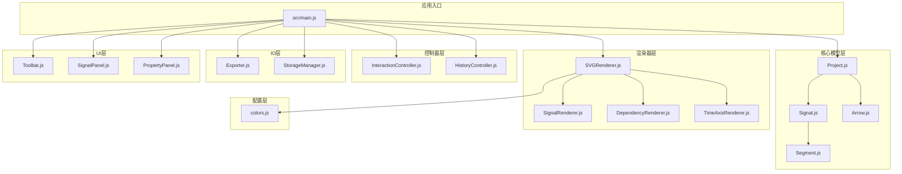

**图表来源**
- [src/main.js:1-819](file://src/main.js#L1-L819)
- [src/renderers/SVGRenderer.js:1-547](file://src/renderers/SVGRenderer.js#L1-L547)
- [src/models/Project.js:1-245](file://src/models/Project.js#L1-L245)

**章节来源**
- [src/main.js:1-819](file://src/main.js#L1-L819)
- [src/renderers/SVGRenderer.js:1-547](file://src/renderers/SVGRenderer.js#L1-L547)
- [src/models/Project.js:1-245](file://src/models/Project.js#L1-L245)

## 核心组件

### 应用主类 - WaveformEditor

WaveformEditor是应用的核心控制器，负责协调各个子系统的初始化和生命周期管理：

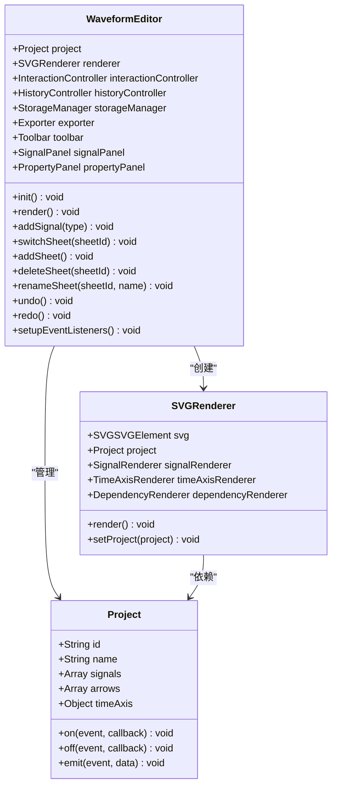

**图表来源**
- [src/main.js:21-132](file://src/main.js#L21-L132)
- [src/models/Project.js:8-34](file://src/models/Project.js#L8-L34)
- [src/renderers/SVGRenderer.js:10-54](file://src/renderers/SVGRenderer.js#L10-L54)

### 渲染器架构

渲染器系统采用分层设计，每个渲染器负责特定的渲染任务：

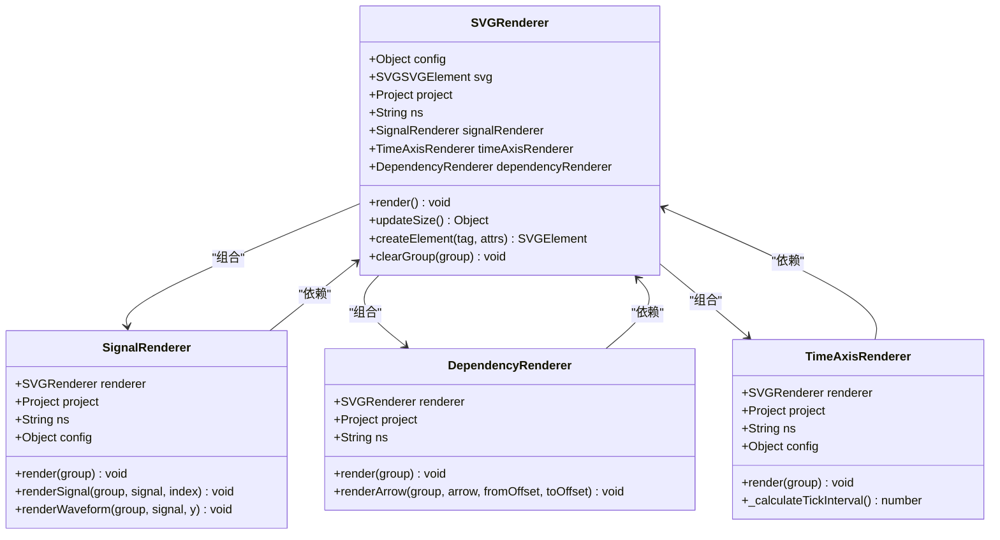

**图表来源**
- [src/renderers/SVGRenderer.js:10-100](file://src/renderers/SVGRenderer.js#L10-L100)
- [src/renderers/SignalRenderer.js:6-31](file://src/renderers/SignalRenderer.js#L6-L31)
- [src/renderers/DependencyRenderer.js:7-12](file://src/renderers/DependencyRenderer.js#L7-L12)
- [src/renderers/TimeAxisRenderer.js:6-15](file://src/renderers/TimeAxisRenderer.js#L6-L15)

**章节来源**
- [src/main.js:21-132](file://src/main.js#L21-L132)
- [src/renderers/SVGRenderer.js:10-100](file://src/renderers/SVGRenderer.js#L10-L100)
- [src/renderers/SignalRenderer.js:6-31](file://src/renderers/SignalRenderer.js#L6-L31)
- [src/renderers/DependencyRenderer.js:7-12](file://src/renderers/DependencyRenderer.js#L7-L12)
- [src/renderers/TimeAxisRenderer.js:6-15](file://src/renderers/TimeAxisRenderer.js#L6-L15)

## 架构概览

波形图编辑器采用MVVM（Model-View-ViewModel）架构模式，结合事件驱动的设计：

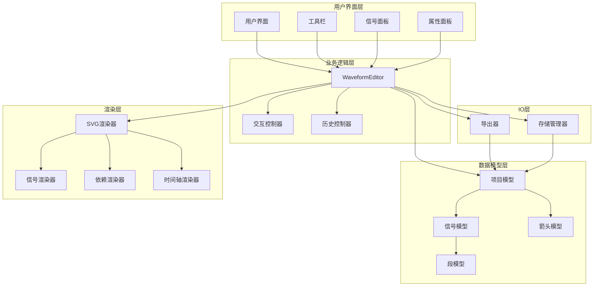

**图表来源**
- [src/main.js:1-819](file://src/main.js#L1-L819)
- [src/controllers/InteractionController.js:6-27](file://src/controllers/InteractionController.js#L6-L27)
- [src/controllers/HistoryController.js:5-11](file://src/controllers/HistoryController.js#L5-L11)
- [src/io/Exporter.js:1-5](file://src/io/Exporter.js#L1-L5)
- [src/io/StorageManager.js:1-6](file://src/io/StorageManager.js#L1-L6)

### 事件系统架构

系统采用发布-订阅模式的事件系统，支持自定义事件的创建和处理：

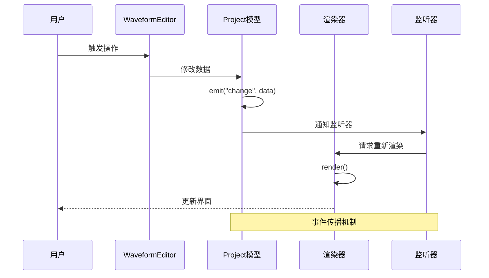

**图表来源**
- [src/models/Project.js:199-202](file://src/models/Project.js#L199-L202)
- [src/main.js:230-241](file://src/main.js#L230-L241)

**章节来源**
- [src/main.js:1-819](file://src/main.js#L1-L819)
- [src/models/Project.js:199-202](file://src/models/Project.js#L199-L202)

## 详细组件分析

### 渲染器扩展机制

#### SVGRenderer扩展

SVGRenderer作为核心渲染器，提供了丰富的扩展点：

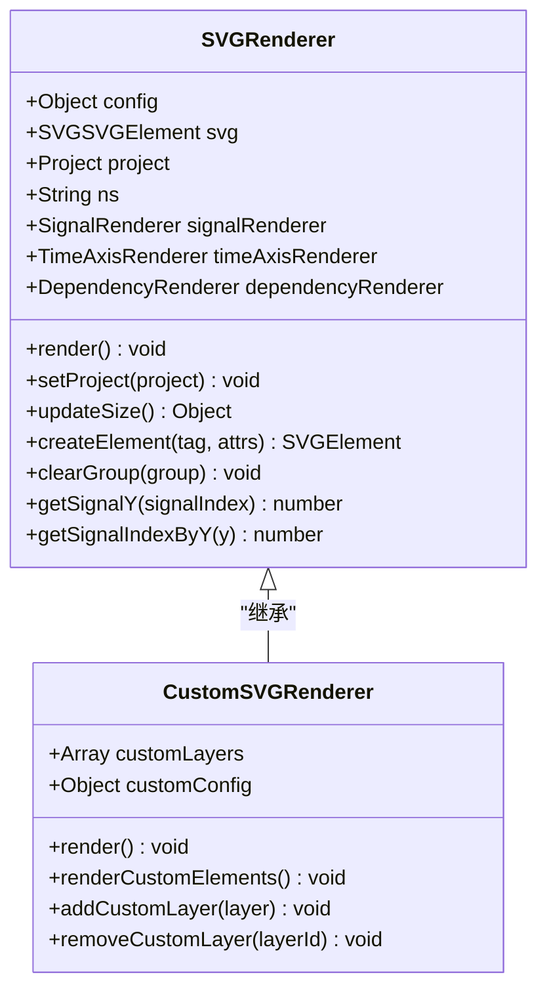

**图表来源**
- [src/renderers/SVGRenderer.js:10-547](file://src/renderers/SVGRenderer.js#L10-L547)

##### 自定义渲染器开发步骤

1. **继承SVGRenderer基类**
```javascript
class CustomSVGRenderer extends SVGRenderer {
    constructor(svgElement, project) {
        super(svgElement, project);
        this.customLayers = [];
        this.customConfig = {
            enableCustomFeatures: true,
            customColors: COLORS
        };
    }
}
```

2. **扩展渲染方法**
```javascript
render() {
    // 调用父类渲染
    super.render();
    
    // 添加自定义元素
    this.renderCustomElements();
}

renderCustomElements() {
    const customGroup = this.createElement('g', {
        class: 'custom-elements'
    });
    
    // 实现自定义渲染逻辑
    this.customLayers.forEach(layer => {
        layer.render(customGroup);
    });
    
    this.mainGroup.appendChild(customGroup);
}
```

3. **添加自定义图层**
```javascript
addCustomLayer(layer) {
    this.customLayers.push(layer);
    this.render();
}

removeCustomLayer(layerId) {
    this.customLayers = this.customLayers.filter(layer => layer.id !== layerId);
    this.render();
}
```

#### SignalRenderer扩展

SignalRenderer负责信号波形的渲染，支持自定义波形类型的扩展：

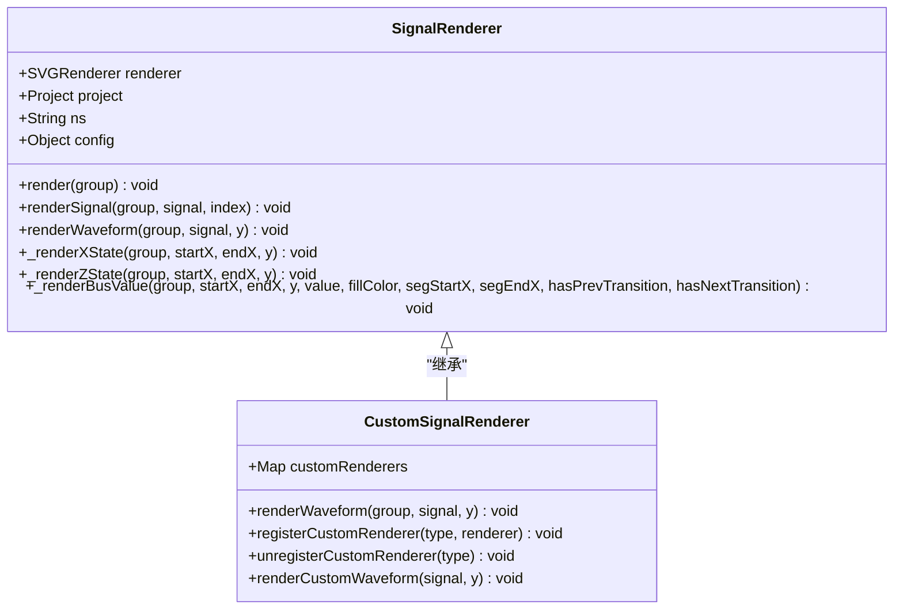

**图表来源**
- [src/renderers/SignalRenderer.js:6-501](file://src/renderers/SignalRenderer.js#L6-L501)

##### 自定义波形元素开发

1. **注册自定义渲染器**
```javascript
registerCustomRenderer(signalType, rendererFunction) {
    this.customRenderers.set(signalType, rendererFunction);
}

renderCustomWaveform(signal, y) {
    const renderer = this.customRenderers.get(signal.type);
    if (renderer) {
        renderer.call(this, signal, y);
    }
}
```

2. **实现自定义渲染逻辑**
```javascript
// 示例：添加自定义的三角波渲染
registerCustomRenderer('triangle', (signal, y) => {
    const { segments } = signal;
    const { waveformHeight, waveformTopOffset } = this.config;
    const topY = y + waveformTopOffset;
    const bottomY = y + waveformTopOffset + waveformHeight;
    
    segments.forEach((segment, index) => {
        const startX = this.project.timeToX(segment.startTime);
        const endX = this.project.timeToX(segment.endTime);
        
        // 绘制三角波形
        const path = this.renderer.createElement('path', {
            d: `M ${startX} ${bottomY} L ${(startX + endX) / 2} ${topY} L ${endX} ${bottomY}`,
            fill: 'none',
            stroke: signal.color || COLORS.normal,
            'stroke-width': '2'
        });
        
        this.currentGroup.appendChild(path);
    });
});
```

#### DependencyRenderer扩展

DependencyRenderer负责依赖箭头的渲染，支持自定义箭头样式的扩展：

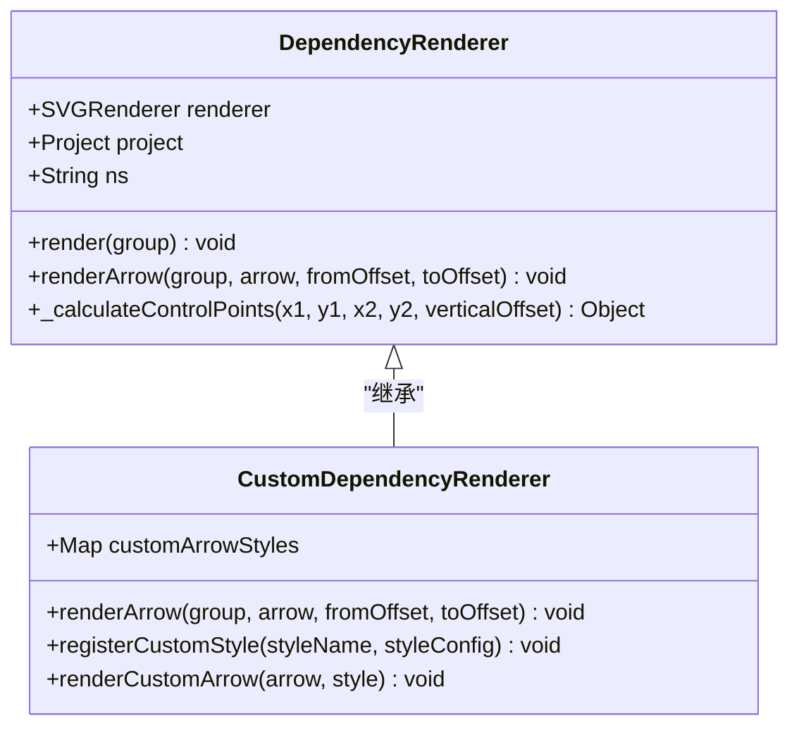

**图表来源**
- [src/renderers/DependencyRenderer.js:7-290](file://src/renderers/DependencyRenderer.js#L7-L290)

##### 自定义箭头样式开发

1. **定义自定义样式**
```javascript
registerCustomStyle('zigzag', {
    stroke: '#ff6b6b',
    strokeWidth: 2,
    markerSize: 6,
    animation: true
});

registerCustomStyle('glow', {
    stroke: '#00d4ff',
    strokeWidth: 3,
    filter: 'url(#glow-filter)'
});
```

2. **实现自定义渲染**
```javascript
renderCustomArrow(arrow, style) {
    const fromSignalIndex = this.project.getSignalIndex(arrow.fromSignalId);
    const toSignalIndex = this.project.getSignalIndex(arrow.toSignalId);
    
    const startX = this.project.timeToX(arrow.fromTime);
    const startY = this.renderer.getSignalY(fromSignalIndex) + 
                   this.renderer.config.waveformTopOffset + 
                   this.renderer.config.waveformHeight / 2;
    
    const endX = this.project.timeToX(arrow.toTime);
    const endY = this.renderer.getSignalY(toSignalIndex) + 
                 this.renderer.config.waveformTopOffset + 
                 this.renderer.config.waveformHeight / 2;
    
    // 根据样式类型生成不同的箭头路径
    let pathD;
    if (style.type === 'zigzag') {
        pathD = this._createZigzagPath(startX, startY, endX, endY);
    } else if (style.type === 'glow') {
        pathD = this._createGlowPath(startX, startY, endX, endY);
    }
    
    const path = this.renderer.createElement('path', {
        d: pathD,
        fill: 'none',
        stroke: style.stroke,
        'stroke-width': style.strokeWidth,
        filter: style.filter || 'none'
    });
    
    return path;
}
```

### 导出器扩展机制

Exporter类提供了多种导出格式的支持，开发者可以扩展新的导出格式：

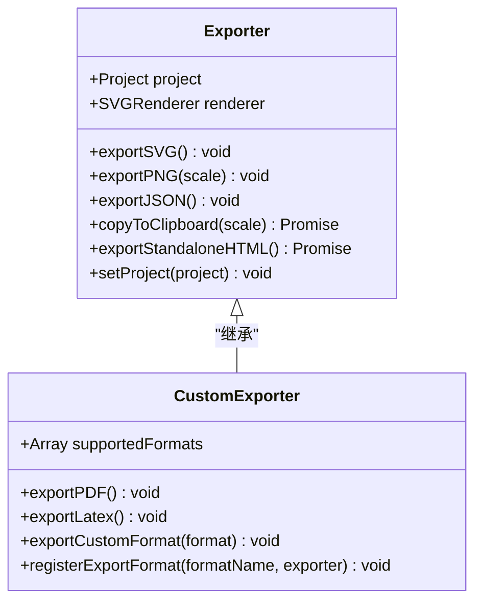

**图表来源**
- [src/io/Exporter.js:1-298](file://src/io/Exporter.js#L1-L298)

#### 新导出格式开发

1. **继承Exporter基类**
```javascript
class CustomExporter extends Exporter {
    constructor(project, renderer) {
        super(project, renderer);
        this.supportedFormats = ['pdf', 'latex', 'custom'];
    }
    
    exportPDF() {
        // 实现PDF导出逻辑
        const pdfDoc = this.createPDFDocument();
        const svgContent = this.renderer.svg.cloneNode(true);
        // 转换SVG为PDF内容
        this.convertSVGToPDF(svgContent, pdfDoc);
        return this.downloadPDF(pdfDoc);
    }
    
    exportLatex() {
        // 实现LaTeX导出逻辑
        const latexContent = this.generateLatexContent();
        return this.downloadLatex(latexContent);
    }
}
```

2. **注册自定义导出格式**
```javascript
registerExportFormat(formatName, exporterFunction) {
    this.supportedFormats.push(formatName);
    this[formatName] = exporterFunction;
}

// 使用示例
exporter.registerExportFormat('markdown', function() {
    const markdownContent = this.generateMarkdownContent();
    return this.downloadFile(markdownContent, 'waveform.md');
});
```

3. **实现第三方集成**
```javascript
async exportToThirdParty(service) {
    switch(service) {
        case 'github':
            return this.exportToGitHub();
        case 'figma':
            return this.exportToFigma();
        case 'sketch':
            return this.exportToSketch();
        default:
            throw new Error(`不支持的服务: ${service}`);
    }
}

async exportToGitHub() {
    const repo = await this.createGitHubRepo();
    const content = await this.exportJSON();
    return this.commitToRepo(repo, content);
}
```

### UI组件扩展机制

#### Toolbar组件扩展

Toolbar组件提供了基础的工具栏功能，支持自定义工具按钮的添加：

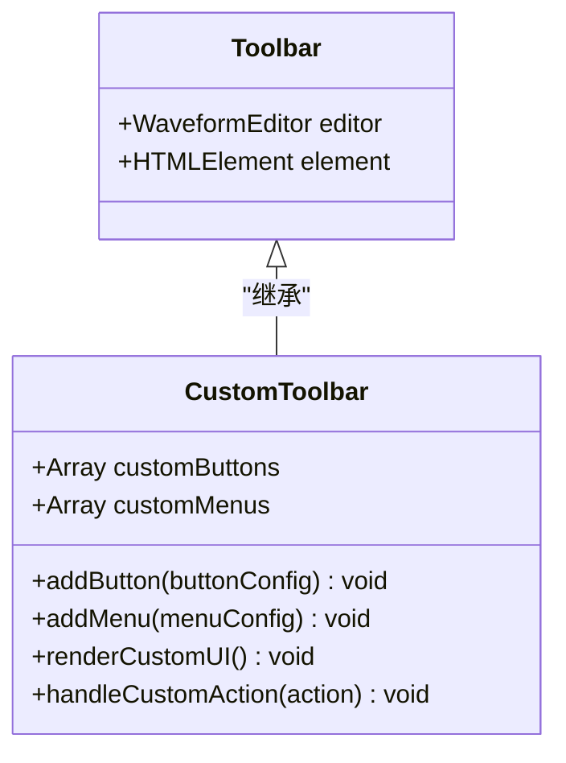

**图表来源**
- [src/ui/Toolbar.js:1-6](file://src/ui/Toolbar.js#L1-L6)

##### 自定义工具栏开发

1. **扩展工具栏功能**
```javascript
class CustomToolbar extends Toolbar {
    constructor(editor) {
        super(editor);
        this.customButtons = [];
        this.customMenus = [];
        this.initCustomComponents();
    }
    
    initCustomComponents() {
        this.addButton({
            id: 'custom-tool',
            icon: '🔧',
            title: '自定义工具',
            onClick: () => this.handleCustomAction()
        });
        
        this.addMenu({
            id: 'custom-menu',
            title: '自定义菜单',
            items: [
                { id: 'menu-item-1', text: '选项1', action: () => this.customAction1() },
                { id: 'menu-item-2', text: '选项2', action: () => this.customAction2() }
            ]
        });
    }
    
    addButton(buttonConfig) {
        this.customButtons.push(buttonConfig);
        this.renderCustomUI();
    }
    
    addMenu(menuConfig) {
        this.customMenus.push(menuConfig);
        this.renderCustomUI();
    }
    
    renderCustomUI() {
        const toolbarHTML = this.generateToolbarHTML();
        this.element.innerHTML = toolbarHTML;
    }
    
    generateToolbarHTML() {
        let html = '';
        
        this.customButtons.forEach(button => {
            html += `
                <button class="toolbar-btn custom-btn" data-action="${button.id}">
                    ${button.icon} ${button.title}
                </button>
            `;
        });
        
        this.customMenus.forEach(menu => {
            html += `
                <div class="toolbar-dropdown">
                    <button class="toolbar-btn dropdown-btn">${menu.title} ▼</button>
                    <div class="dropdown-content">
                        ${menu.items.map(item => `
                            <a href="#" class="dropdown-item" data-action="${item.id}">
                                ${item.text}
                            </a>
                        `).join('')}
                    </div>
                </div>
            `;
        });
        
        return html;
    }
}
```

2. **处理自定义事件**
```javascript
handleCustomAction() {
    // 触发自定义事件
    const customEvent = new CustomEvent('customToolClicked', {
        detail: {
            timestamp: Date.now(),
            editor: this.editor
        }
    });
    
    document.dispatchEvent(customEvent);
    
    // 或者使用项目事件系统
    this.editor.project.emit('customToolUsed', {
        tool: 'custom-tool',
        timestamp: Date.now()
    });
}
```

#### SignalPanel组件扩展

SignalPanel负责信号列表的显示和交互，支持自定义信号项的扩展：

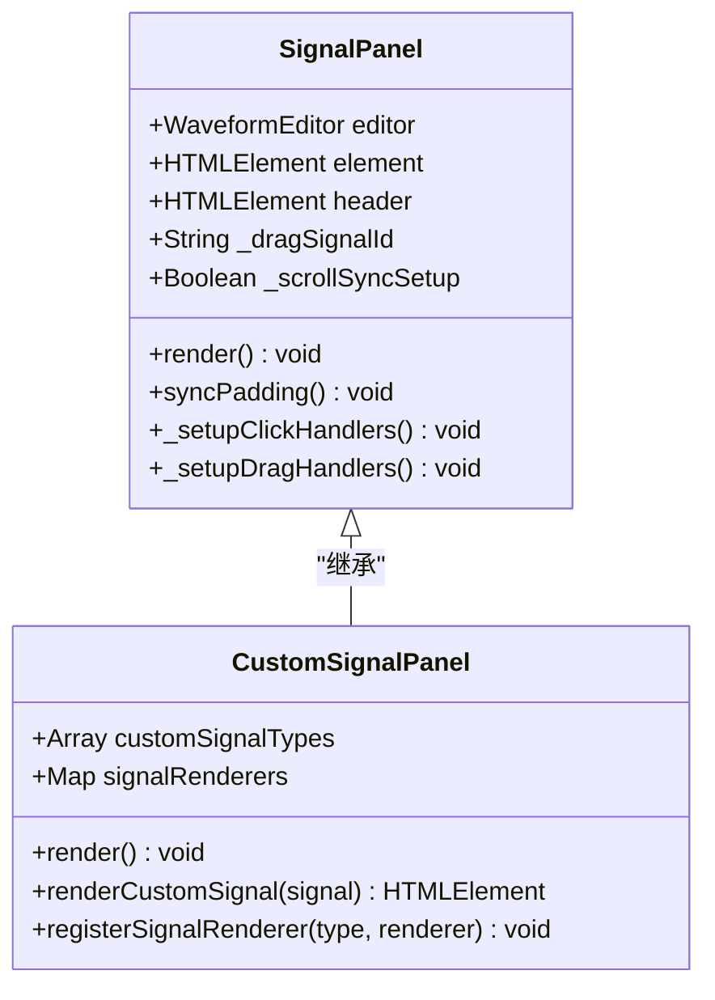

**图表来源**
- [src/ui/SignalPanel.js:1-164](file://src/ui/SignalPanel.js#L1-L164)

##### 自定义信号面板开发

1. **注册自定义信号渲染器**
```javascript
class CustomSignalPanel extends SignalPanel {
    constructor(editor) {
        super(editor);
        this.customSignalTypes = ['custom1', 'custom2'];
        this.signalRenderers = new Map();
        this.registerDefaultRenderers();
    }
    
    registerDefaultRenderers() {
        // 注册默认渲染器
        this.registerSignalRenderer('signal', this.renderDefaultSignal.bind(this));
        this.registerSignalRenderer('clock', this.renderClockSignal.bind(this));
        this.registerSignalRenderer('bus', this.renderBusSignal.bind(this));
        
        // 注册自定义渲染器
        this.registerSignalRenderer('custom1', this.renderCustomSignal1.bind(this));
        this.registerSignalRenderer('custom2', this.renderCustomSignal2.bind(this));
    }
    
    registerSignalRenderer(type, renderer) {
        this.signalRenderers.set(type, renderer);
    }
    
    renderCustomSignal(signal) {
        const renderer = this.signalRenderers.get(signal.type);
        if (renderer) {
            return renderer(signal);
        }
        return this.renderDefaultSignal(signal);
    }
    
    renderCustomSignal1(signal) {
        return `
            <div class="signal-item custom1 ${this.isSelected(signal.id) ? 'selected' : ''}"
                 data-signal-id="${signal.id}" draggable="true">
                <span class="drag-handle" title="拖拽排序">⠿</span>
                <span class="signal-item-icon">⚡</span>
                <span class="signal-item-name">${signal.name}</span>
                <div class="signal-item-actions">
                    <button class="signal-item-btn custom-btn" data-action="custom1">⚙️</button>
                    <button class="signal-item-btn" data-action="delete">🗑️</button>
                </div>
            </div>
        `;
    }
}
```

2. **实现自定义信号交互**
```javascript
_setupCustomSignalHandlers() {
    this.element.querySelectorAll('.custom-btn').forEach(button => {
        button.addEventListener('click', (e) => {
            e.stopPropagation();
            const signalId = e.target.closest('.signal-item').dataset.signalId;
            const signal = this.editor.project.getSignalById(signalId);
            
            if (signal) {
                this.handleCustomSignalAction(signal, e.target.dataset.action);
            }
        });
    });
}

handleCustomSignalAction(signal, action) {
    switch(action) {
        case 'custom1':
            this.openCustomDialog(signal);
            break;
        case 'custom2':
            this.performCustomOperation(signal);
            break;
    }
}

openCustomDialog(signal) {
    // 打开自定义对话框
    const dialog = document.createElement('div');
    dialog.className = 'custom-dialog';
    dialog.innerHTML = `
        <h3>自定义工具 - ${signal.name}</h3>
        <p>信号类型: ${signal.type}</p>
        <p>段数量: ${signal.segments.length}</p>
        <button onclick="this.closeDialog()">关闭</button>
    `;
    
    document.body.appendChild(dialog);
}
```

### 事件系统扩展

系统提供了强大的事件系统，支持自定义事件的创建和处理：

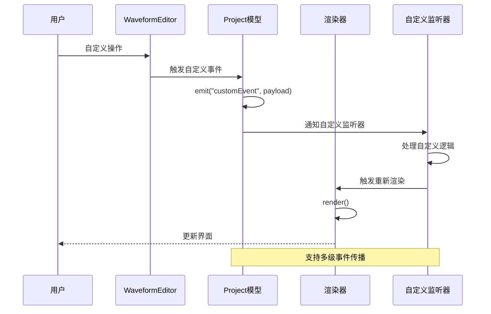

**图表来源**
- [src/models/Project.js:199-202](file://src/models/Project.js#L199-L202)

#### 自定义事件开发

1. **注册自定义事件监听器**
```javascript
// 在WaveformEditor中注册
setupCustomEventListeners() {
    // 监听自定义工具事件
    document.addEventListener('customToolClicked', (event) => {
        this.handleCustomToolEvent(event.detail);
    });
    
    // 监听自定义渲染事件
    this.project.on('customRenderTrigger', (payload) => {
        this.handleCustomRenderEvent(payload);
    });
    
    // 监听自定义导出事件
    this.exporter.on('customExportComplete', (payload) => {
        this.handleCustomExportEvent(payload);
    });
}

handleCustomToolEvent(detail) {
    console.log('自定义工具被点击:', detail);
    // 实现自定义处理逻辑
    this.showNotification(`工具使用: ${detail.tool}`);
}

handleCustomRenderEvent(payload) {
    console.log('自定义渲染触发:', payload);
    // 触发特定的渲染逻辑
    this.triggerSpecificRender(payload.component);
}
```

2. **触发自定义事件**
```javascript
triggerCustomEvent(eventName, payload) {
    const event = new CustomEvent(eventName, {
        detail: payload,
        bubbles: true,
        cancelable: true
    });
    
    document.dispatchEvent(event);
    
    // 同时触发项目级别的事件
    this.project.emit(eventName, payload);
}

// 使用示例
triggerCustomEvent('waveformModified', {
    modifiedSignals: this.getModifiedSignals(),
    timestamp: Date.now(),
    operation: 'customOperation'
});
```

3. **事件处理最佳实践**
```javascript
class EventManager {
    constructor() {
        this.listeners = new Map();
        this.eventQueue = [];
        this.maxQueueSize = 100;
    }
    
    // 安全地注册事件监听器
    safeOn(eventName, callback, context = null) {
        const boundCallback = context ? callback.bind(context) : callback;
        
        if (!this.listeners.has(eventName)) {
            this.listeners.set(eventName, []);
        }
        
        this.listeners.get(eventName).push({
            id: this.generateListenerId(),
            callback: boundCallback,
            context: context,
            registeredAt: Date.now()
        });
        
        return this.listeners.get(eventName).length - 1;
    }
    
    // 安全地触发事件
    safeEmit(eventName, payload) {
        if (!this.listeners.has(eventName)) {
            return;
        }
        
        const listeners = this.listeners.get(eventName);
        const listenersToRemove = [];
        
        listeners.forEach((listener, index) => {
            try {
                listener.callback(payload);
            } catch (error) {
                console.error(`事件监听器 ${listener.id} 执行失败:`, error);
                listenersToRemove.push(index);
            }
        });
        
        // 清理失败的监听器
        listenersToRemove.reverse().forEach(index => {
            listeners.splice(index, 1);
        });
    }
    
    // 移除事件监听器
    off(eventName, listenerId) {
        if (!this.listeners.has(eventName)) {
            return;
        }
        
        const listeners = this.listeners.get(eventName);
        const index = listeners.findIndex(listener => listener.id === listenerId);
        
        if (index !== -1) {
            listeners.splice(index, 1);
            return true;
        }
        
        return false;
    }
}
```

**章节来源**
- [src/ui/Toolbar.js:1-6](file://src/ui/Toolbar.js#L1-L6)
- [src/ui/SignalPanel.js:1-164](file://src/ui/SignalPanel.js#L1-L164)
- [src/models/Project.js:199-202](file://src/models/Project.js#L199-L202)

## 依赖分析

波形图编辑器的依赖关系呈现清晰的分层结构：

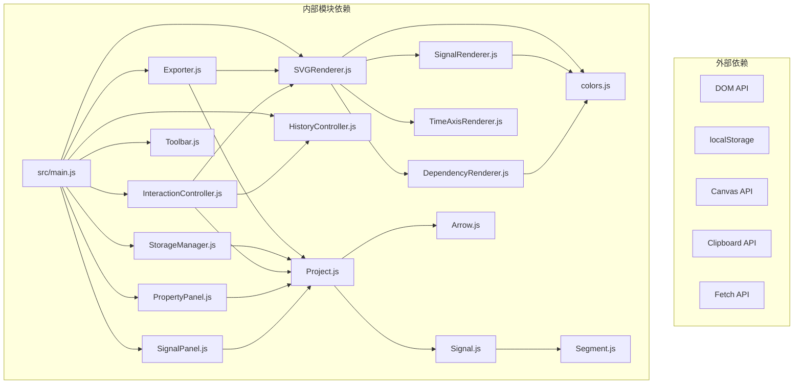

**图表来源**
- [src/main.js:1-17](file://src/main.js#L1-L17)
- [src/renderers/SVGRenderer.js:5-8](file://src/renderers/SVGRenderer.js#L5-L8)
- [src/io/Exporter.js:1-5](file://src/io/Exporter.js#L1-L5)
- [src/io/StorageManager.js:1-6](file://src/io/StorageManager.js#L1-L6)

### 模块间耦合分析

系统采用了松耦合的设计原则：

1. **低耦合设计**
   - 每个模块都有明确的职责边界
   - 通过接口和事件进行通信
   - 避免循环依赖

2. **依赖注入模式**
   - 渲染器通过构造函数接收依赖
   - 控制器管理业务逻辑和状态
   - 模型层专注于数据结构和行为

3. **扩展点设计**
   - 核心类提供虚拟方法供子类重写
   - 配置文件集中管理全局设置
   - 事件系统支持解耦的组件通信

**章节来源**
- [src/main.js:1-17](file://src/main.js#L1-L17)
- [src/renderers/SVGRenderer.js:5-8](file://src/renderers/SVGRenderer.js#L5-L8)
- [src/io/Exporter.js:1-5](file://src/io/Exporter.js#L1-L5)

## 性能考虑

### 渲染性能优化

1. **SVG渲染优化**
   - 使用分组元素减少DOM节点数量
   - 合理使用CSS类和样式属性
   - 避免频繁的DOM查询和修改

2. **事件处理优化**
   - 使用事件委托减少事件监听器数量
   - 实施节流和防抖机制
   - 及时清理不再使用的事件监听器

3. **内存管理**
   - 及时释放不再使用的DOM元素
   - 清理事件监听器和定时器
   - 避免内存泄漏

### 扩展性能建议

1. **渲染器扩展性能**
```javascript
// 使用requestAnimationFrame优化动画
class OptimizedRenderer extends SVGRenderer {
    constructor(svgElement, project) {
        super(svgElement, project);
        this.animationFrameId = null;
    }
    
    renderOptimized() {
        if (this.animationFrameId) {
            cancelAnimationFrame(this.animationFrameId);
        }
        
        this.animationFrameId = requestAnimationFrame(() => {
            this.render();
        });
    }
    
    // 实施增量渲染
    incrementalRender(changedSignals) {
        changedSignals.forEach(signalId => {
            const signalIndex = this.project.getSignalIndex(signalId);
            if (signalIndex !== -1) {
                this.renderSignal(this.signalGroup, 
                               this.project.signals[signalIndex], 
                               signalIndex);
            }
        });
    }
}
```

2. **导出性能优化**
```javascript
class OptimizedExporter extends Exporter {
    // 实施异步导出
    async exportLargeProject() {
        const progressCallback = (progress) => {
            this.updateProgress(progress);
        };
        
        return new Promise((resolve, reject) => {
            const worker = new Worker('/workers/export-worker.js');
            worker.postMessage({ project: this.project, options: this.options });
            worker.onmessage = (e) => {
                if (e.data.status === 'complete') {
                    resolve(e.data.result);
                } else if (e.data.status === 'error') {
                    reject(e.data.error);
                } else {
                    progressCallback(e.data.progress);
                }
            };
        });
    }
}
```

## 故障排除指南

### 常见问题及解决方案

1. **渲染器初始化失败**
```javascript
// 检查SVG元素是否存在
if (!svgElement) {
    throw new Error('找不到SVG元素 #waveformSvg');
}

// 验证项目数据完整性
if (!this.project || !this.project.signals) {
    console.error('项目数据不完整:', this.project);
    return;
}
```

2. **事件监听器内存泄漏**
```javascript
// 正确的事件监听器管理
class SafeEventManager {
    constructor() {
        this.listeners = new Map();
    }
    
    addListener(element, event, handler) {
        const listenerId = this.generateId();
        const boundHandler = handler.bind(this);
        
        element.addEventListener(event, boundHandler);
        
        if (!this.listeners.has(element)) {
            this.listeners.set(element, new Map());
        }
        
        this.listeners.get(element).set(listenerId, {
            element: element,
            event: event,
            handler: boundHandler
        });
        
        return listenerId;
    }
    
    removeListener(element, listenerId) {
        if (this.listeners.has(element) && 
            this.listeners.get(element).has(listenerId)) {
            const listener = this.listeners.get(element).get(listenerId);
            element.removeEventListener(listener.event, listener.handler);
            this.listeners.get(element).delete(listenerId);
            return true;
        }
        return false;
    }
}
```

3. **导出功能异常**
```javascript
// 实施导出错误处理
async exportWithErrorHandling() {
    try {
        // 验证导出条件
        await this.validateExportConditions();
        
        // 执行导出
        const result = await this.performExport();
        
        // 验证导出结果
        await this.verifyExportResult(result);
        
        return result;
    } catch (error) {
        this.handleExportError(error);
        throw error;
    }
}
```

### 调试技巧

1. **开发工具使用**
```javascript
// 启用调试模式
class DebuggableEditor extends WaveformEditor {
    constructor(debugMode = false) {
        super();
        this.debugMode = debugMode;
        this.debugLog = [];
    }
    
    log(message, ...args) {
        if (this.debugMode) {
            const timestamp = new Date().toISOString();
            const logEntry = { timestamp, message, args };
            this.debugLog.push(logEntry);
            console.log(`[${timestamp}] ${message}`, ...args);
        }
    }
    
    getDebugInfo() {
        return {
            logEntries: this.debugLog,
            memoryUsage: performance.memory,
            renderStats: this.getRenderStats()
        };
    }
}
```

2. **性能监控**
```javascript
class PerformanceMonitor {
    constructor() {
        this.metrics = {
            renderTime: [],
            memoryUsage: [],
            eventCount: 0
        };
    }
    
    startTiming(operation) {
        if (performance && performance.now) {
            const startTime = performance.now();
            return (endTime) => {
                const duration = endTime - startTime;
                this.metrics.renderTime.push(duration);
                return duration;
            };
        }
        return () => 0;
    }
    
    recordMemoryUsage() {
        if (performance && performance.memory) {
            this.metrics.memoryUsage.push(performance.memory.usedJSHeapSize);
        }
    }
}
```

**章节来源**
- [src/main.js:90-94](file://src/main.js#L90-L94)
- [src/controllers/InteractionController.js:52-82](file://src/controllers/InteractionController.js#L52-L82)
- [src/io/Exporter.js:189-194](file://src/io/Exporter.js#L189-L194)

## 结论

波形图编辑器提供了一个强大而灵活的扩展平台，支持开发者通过多种方式扩展系统功能：

1. **模块化架构优势**
   - 清晰的职责分离和依赖关系
   - 丰富的扩展点和插件机制
   - 良好的性能和可维护性

2. **扩展开发最佳实践**
   - 继承核心类时遵循开放封闭原则
   - 使用事件系统实现松耦合通信
   - 实施性能优化和错误处理机制
   - 提供完善的文档和示例代码

3. **未来发展方向**
   - 支持更多导出格式和第三方集成
   - 增强实时协作和云端同步功能
   - 优化移动端和触摸设备的用户体验
   - 扩展AI辅助的波形分析和验证功能

通过遵循本指南提供的架构原则和最佳实践，开发者可以创建高质量的扩展功能，为波形图编辑器生态系统做出贡献。

## 附录

### 扩展开发模板

#### 渲染器扩展模板
```javascript
// 自定义SVG渲染器
class CustomSVGRenderer extends SVGRenderer {
    constructor(svgElement, project) {
        super(svgElement, project);
        this.customFeatures = new Set();
    }
    
    // 重写渲染方法
    render() {
        super.render();
        this.renderCustomFeatures();
    }
    
    renderCustomFeatures() {
        // 实现自定义渲染逻辑
    }
    
    // 添加功能开关
    enableFeature(featureName) {
        this.customFeatures.add(featureName);
        this.render();
    }
    
    disableFeature(featureName) {
        this.customFeatures.delete(featureName);
        this.render();
    }
}
```

#### 导出器扩展模板
```javascript
// 自定义导出器
class CustomExporter extends Exporter {
    constructor(project, renderer) {
        super(project, renderer);
        this.customFormats = new Map();
    }
    
    // 注册自定义格式
    registerFormat(formatName, exportFunction) {
        this.customFormats.set(formatName, exportFunction);
    }
    
    // 实现自定义导出
    async exportCustomFormat(formatName, options = {}) {
        const exportFunction = this.customFormats.get(formatName);
        if (!exportFunction) {
            throw new Error(`不支持的格式: ${formatName}`);
        }
        
        return exportFunction.call(this, options);
    }
    
    // 实现PDF导出
    exportPDF(options = {}) {
        const defaultOptions = {
            pageSize: 'A4',
            orientation: 'portrait',
            margins: { top: 20, bottom: 20, left: 20, right: 20 }
        };
        
        const finalOptions = { ...defaultOptions, ...options };
        
        // 实现PDF导出逻辑
        return this.createPDFDocument(finalOptions);
    }
}
```

#### UI组件扩展模板
```javascript
// 自定义工具栏
class CustomToolbar extends Toolbar {
    constructor(editor) {
        super(editor);
        this.customTools = [];
        this.initCustomTools();
    }
    
    initCustomTools() {
        this.addButton({
            id: 'custom-tool-1',
            icon: '⚙️',
            title: '自定义工具1',
            onClick: () => this.executeCustomTool1()
        });
        
        this.addButton({
            id: 'custom-tool-2',
            icon: '⚡',
            title: '自定义工具2',
            onClick: () => this.executeCustomTool2()
        });
    }
    
    addButton(toolConfig) {
        this.customTools.push(toolConfig);
        this.render();
    }
    
    executeCustomTool1() {
        // 实现工具1逻辑
        this.editor.project.emit('customTool1Used', {
            timestamp: Date.now(),
            toolConfig: this.customTools.find(t => t.id === 'custom-tool-1')
        });
    }
    
    executeCustomTool2() {
        // 实现工具2逻辑
        this.editor.project.emit('customTool2Used', {
            timestamp: Date.now(),
            toolConfig: this.customTools.find(t => t.id === 'custom-tool-2')
        });
    }
}
```

### 配置和部署指南

#### 环境配置
```javascript
// 扩展配置文件
const extensionConfig = {
    // 渲染器配置
    renderer: {
        customColors: {
            custom1: '#ff6b6b',
            custom2: '#4ecdc4'
        },
        customFonts: ['Roboto', 'Open Sans'],
        animationDuration: 300
    },
    
    // 导出器配置
    exporter: {
        supportedFormats: ['svg', 'png', 'pdf', 'json', 'custom'],
        defaultOptions: {
            quality: 0.9,
            compression: true
        }
    },
    
    // UI配置
    ui: {
        customThemes: ['dark', 'light', 'blue'],
        layoutOptions: {
            sidebarWidth: 250,
            toolbarHeight: 40
        }
    }
};
```

#### 部署和打包
```javascript
// 扩展打包配置
const extensionBuildConfig = {
    entry: 'src/extensions/custom-extension.js',
    output: {
        path: 'dist/extensions/',
        filename: 'custom-extension.min.js',
        library: 'CustomExtension',
        libraryTarget: 'umd'
    },
    externals: {
        'waveform-editor': 'WaveformEditor'
    },
    plugins: [
        new webpack.optimize.UglifyJsPlugin({
            compress: {
                warnings: false
            }
        })
    ]
};
```

通过以上模板和配置，开发者可以快速创建符合波形图编辑器架构规范的扩展功能，为用户提供更加丰富和强大的波形图编辑体验。