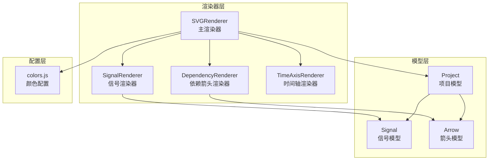
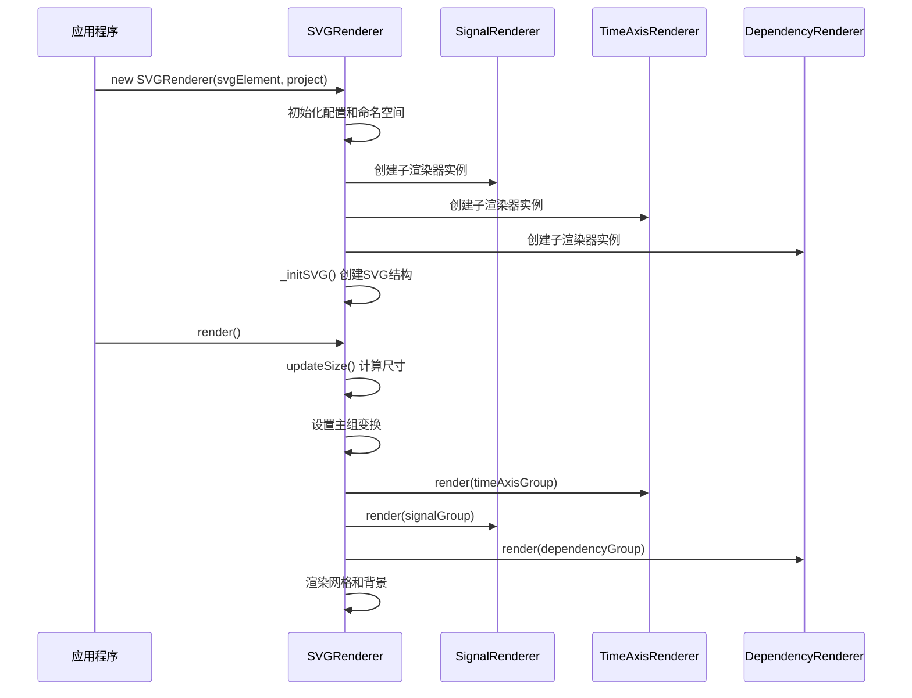
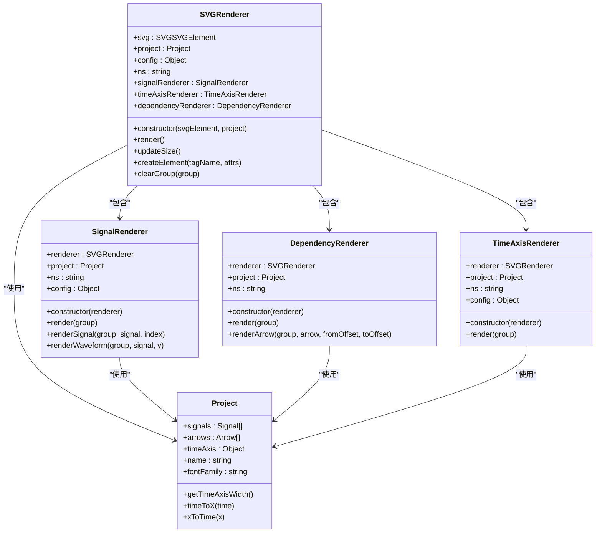

# 渲染器扩展开发

<cite>
**本文档引用的文件**
- [SVGRenderer.js](file://src/renderers/SVGRenderer.js)
- [SignalRenderer.js](file://src/renderers/SignalRenderer.js)
- [DependencyRenderer.js](file://src/renderers/DependencyRenderer.js)
- [TimeAxisRenderer.js](file://src/renderers/TimeAxisRenderer.js)
- [colors.js](file://src/config/colors.js)
- [Project.js](file://src/models/Project.js)
- [Signal.js](file://src/models/Signal.js)
- [Arrow.js](file://src/models/Arrow.js)
- [main.js](file://src/main.js)
</cite>

## 目录
1. [简介](#简介)
2. [项目结构](#项目结构)
3. [核心组件](#核心组件)
4. [架构概览](#架构概览)
5. [详细组件分析](#详细组件分析)
6. [依赖关系分析](#依赖关系分析)
7. [性能考虑](#性能考虑)
8. [故障排除指南](#故障排除指南)
9. [结论](#结论)
10. [附录](#附录)

## 简介
本指南面向希望为波形图编辑器创建自定义渲染器的开发者。文档基于现有的SVG渲染器架构，详细说明如何继承和扩展SVGRenderer基类来创建自定义渲染器，包括渲染器生命周期方法的重写、项目数据和配置参数的访问方式、与其他渲染器的协作机制，以及渲染性能优化的最佳实践。

## 项目结构
波形图编辑器采用模块化的渲染器架构，主要文件组织如下：
- 渲染器层：负责SVG元素的创建、管理和渲染
- 模型层：负责项目数据的存储和管理
- 配置层：集中管理颜色、渲染配置和箭头配置
- 控制器层：处理用户交互和历史记录
- UI层：提供工具栏、信号面板和属性面板



**图表来源**
- [SVGRenderer.js:1-547](file://src/renderers/SVGRenderer.js#L1-L547)
- [SignalRenderer.js:1-501](file://src/renderers/SignalRenderer.js#L1-L501)
- [DependencyRenderer.js:1-290](file://src/renderers/DependencyRenderer.js#L1-L290)
- [TimeAxisRenderer.js:1-132](file://src/renderers/TimeAxisRenderer.js#L1-L132)

**章节来源**
- [main.js:1-819](file://src/main.js#L1-L819)

## 核心组件
本节深入分析渲染器系统的核心组件及其职责分工。

### SVGRenderer - 主渲染器
SVGRenderer是整个渲染系统的核心，负责：
- 管理SVG画布和命名空间
- 协调各子渲染器的工作
- 维护渲染配置和项目数据
- 处理SVG元素的创建和清理

主要特性：
- 构造函数中初始化配置、命名空间和子渲染器
- 提供updateSize方法自动计算SVG尺寸
- 实现render方法协调各子渲染器渲染顺序
- 提供createElement和clearGroup等实用方法

### SignalRenderer - 信号渲染器
负责渲染波形信号，包括：
- 信号名称和背景的渲染
- 波形段的绘制和跳变沿处理
- 特殊状态（X态、Z态）的可视化
- 总线信号的特殊渲染逻辑

### DependencyRenderer - 依赖箭头渲染器
专门处理信号间依赖关系的箭头渲染：
- 支持双向箭头和单向箭头
- 自动处理箭头重叠和偏移
- 提供箭头标签的渲染和交互
- 实现贝塞尔曲线控制点计算

### TimeAxisRenderer - 时间轴渲染器
负责时间轴的渲染：
- 计算合适的刻度间隔
- 绘制时间刻度和标签
- 提供时间轴拖拽手柄
- 支持时间轴扩展功能

**章节来源**
- [SVGRenderer.js:10-40](file://src/renderers/SVGRenderer.js#L10-L40)
- [SignalRenderer.js:6-16](file://src/renderers/SignalRenderer.js#L6-L16)
- [DependencyRenderer.js:7-12](file://src/renderers/DependencyRenderer.js#L7-L12)
- [TimeAxisRenderer.js:6-15](file://src/renderers/TimeAxisRenderer.js#L6-L15)

## 架构概览
渲染器系统采用分层架构设计，主渲染器协调各个子渲染器工作：



**图表来源**
- [SVGRenderer.js:284-314](file://src/renderers/SVGRenderer.js#L284-L314)
- [main.js:763-769](file://src/main.js#L763-L769)

## 详细组件分析

### SVGRenderer 生命周期方法详解

#### 构造函数重写指南
当继承SVGRenderer时，建议遵循以下模式：

```javascript
// 基础构造函数重写模式
constructor(svgElement, project) {
    super(svgElement, project); // 调用父类构造函数
    
    // 1. 重写或扩展配置
    this.config = {
        ...this.config, // 继承基础配置
        customProperty: defaultValue // 添加自定义配置
    };
    
    // 2. 创建自定义子渲染器
    this.customRenderer = new CustomRenderer(this);
    
    // 3. 初始化自定义元素
    this._initCustomElements();
}
```

#### render方法重写模式
主渲染方法的重写应该保持原有渲染顺序：

```javascript
render() {
    // 1. 调用父类render以获得标准行为
    super.render();
    
    // 2. 在标准渲染完成后执行自定义渲染
    this._renderCustomElements();
    
    // 3. 可选：覆盖特定子渲染器的行为
    this._renderCustomSignals();
}
```

#### updateSize方法重写模式
尺寸更新方法的重写需要考虑项目数据：

```javascript
updateSize() {
    // 1. 调用父类方法获取基础尺寸
    const baseSize = super.updateSize();
    
    // 2. 根据自定义需求调整尺寸
    const customWidth = this._calculateCustomWidth();
    const customHeight = this._calculateCustomHeight();
    
    // 3. 返回最终尺寸
    return {
        width: Math.max(baseSize.width, customWidth),
        height: Math.max(baseSize.height, customHeight)
    };
}
```

### 自定义渲染器开发示例

#### 创建自定义渲染器类
```javascript
// 示例：创建一个自定义注释渲染器
class AnnotationRenderer {
    constructor(renderer) {
        this.renderer = renderer;
        this.project = renderer.project;
        this.ns = renderer.ns;
        this.config = renderer.config;
        this.annotationGroup = null;
    }
    
    render(group) {
        // 清空之前的注释
        this.renderer.clearGroup(group);
        
        // 创建注释组
        this.annotationGroup = this.renderer.createElement('g', {
            class: 'annotations'
        });
        group.appendChild(this.annotationGroup);
        
        // 渲染每个注释
        this.project.annotations.forEach(annotation => {
            this._renderAnnotation(this.annotationGroup, annotation);
        });
    }
    
    _renderAnnotation(group, annotation) {
        const x = this.project.timeToX(annotation.time);
        const y = this.renderer.getSignalY(annotation.signalIndex) + 20;
        
        const circle = this.renderer.createElement('circle', {
            cx: x,
            cy: y,
            r: 4,
            fill: annotation.color || '#ff6b6b',
            'data-annotation-id': annotation.id,
            class: 'annotation-point'
        });
        
        group.appendChild(circle);
    }
}
```

#### SVG元素创建和事件绑定
```javascript
// 创建自定义SVG元素
createElement(tagName, attrs = {}) {
    const element = document.createElementNS(this.ns, tagName);
    for (const [key, value] of Object.entries(attrs)) {
        element.setAttribute(key, value);
    }
    return element;
}

// 事件绑定示例
element.addEventListener('click', (e) => {
    const annotationId = e.target.getAttribute('data-annotation-id');
    if (annotationId) {
        this._handleAnnotationClick(annotationId);
    }
});

element.addEventListener('mouseover', (e) => {
    e.target.setAttribute('r', '6');
    e.target.setAttribute('opacity', '0.8');
});
```

### 项目数据和配置参数访问

#### 访问项目数据
```javascript
// 访问信号数据
this.project.signals.forEach(signal => {
    // 处理每个信号
});

// 访问箭头数据
this.project.arrows.forEach(arrow => {
    // 处理每个箭头
});

// 访问时间轴数据
const timeAxis = this.project.timeAxis;
const width = this.project.getTimeAxisWidth();
const startX = this.project.timeToX(timeAxis.start);
```

#### 配置参数访问
```javascript
// 访问渲染配置
const { signalHeight, signalGap, waveformHeight } = this.config;

// 访问颜色配置
const signalColor = COLORS.normal;
const backgroundColor = COLORS.background;

// 访问箭头配置
const defaultStroke = ARROW_CONFIG.defaultStroke;
const markerSize = ARROW_CONFIG.defaultMarkerSize;
```

### 与其他渲染器的协作

#### 子渲染器协作模式
```javascript
// 在主渲染器中协调多个子渲染器
render() {
    // 更新尺寸
    this.updateSize();
    
    // 渲染时间轴（底层）
    this.timeAxisRenderer.render(this.timeAxisGroup);
    
    // 渲染信号（中间层）
    this.signalRenderer.render(this.signalGroup);
    
    // 渲染依赖箭头（上层）
    this.dependencyRenderer.render(this.dependencyGroup);
    
    // 渲染自定义元素（最上层）
    this.customRenderer.render(this.customGroup);
}
```

#### 数据共享机制
```javascript
// 通过主渲染器共享数据
this.renderer.selectedSignalId = signalId;
this.renderer.selectedArrowId = arrowId;

// 子渲染器访问共享数据
const isSelected = this.renderer.selectedSignalId === signal.id;
```

**章节来源**
- [SVGRenderer.js:15-40](file://src/renderers/SVGRenderer.js#L15-L40)
- [SVGRenderer.js:284-314](file://src/renderers/SVGRenderer.js#L284-L314)
- [SVGRenderer.js:524-547](file://src/renderers/SVGRenderer.js#L524-L547)
- [SignalRenderer.js:22-31](file://src/renderers/SignalRenderer.js#L22-L31)
- [DependencyRenderer.js:18-84](file://src/renderers/DependencyRenderer.js#L18-L84)

## 依赖关系分析



**图表来源**
- [SVGRenderer.js:10-40](file://src/renderers/SVGRenderer.js#L10-L40)
- [SignalRenderer.js:6-16](file://src/renderers/SignalRenderer.js#L6-L16)
- [DependencyRenderer.js:7-12](file://src/renderers/DependencyRenderer.js#L7-L12)
- [TimeAxisRenderer.js:6-15](file://src/renderers/TimeAxisRenderer.js#L6-L15)
- [Project.js:8-34](file://src/models/Project.js#L8-L34)

**章节来源**
- [colors.js:1-83](file://src/config/colors.js#L1-L83)
- [Project.js:1-245](file://src/models/Project.js#L1-L245)

## 性能考虑

### 渲染性能优化技巧

#### 1. 元素复用和清理
- 使用`clearGroup`方法清理不再使用的元素
- 避免重复创建相同的SVG元素
- 合理使用SVG命名空间和属性设置

#### 2. 事件处理优化
- 使用事件委托减少事件监听器数量
- 避免在渲染过程中创建大量DOM元素
- 合理使用CSS类而不是内联样式

#### 3. 数据访问优化
- 缓存频繁访问的数据
- 使用索引而不是遍历查找
- 避免在渲染循环中进行复杂计算

#### 4. 渲染策略优化
- 分层渲染：将复杂的渲染任务分解为多个阶段
- 按需渲染：只渲染可见区域内的元素
- 批量更新：将多次小更新合并为一次大更新

### 最佳实践

#### 渲染器设计原则
```javascript
// 好的做法：清晰的职责分离
class CustomRenderer {
    constructor(renderer) {
        this.renderer = renderer;
        this.project = renderer.project;
        this.ns = renderer.ns;
        this.config = renderer.config;
    }
    
    // 单一职责：只负责自定义元素渲染
    render(group) {
        this._clearPreviousElements(group);
        this._renderCustomElements(group);
    }
    
    // 私有方法：内部实现细节
    _renderCustomElements(group) {
        // 具体的渲染逻辑
    }
}
```

#### 内存管理
- 及时清理事件监听器
- 避免循环引用
- 使用WeakMap存储DOM元素引用

**章节来源**
- [SVGRenderer.js:524-547](file://src/renderers/SVGRenderer.js#L524-L547)
- [SignalRenderer.js:22-31](file://src/renderers/SignalRenderer.js#L22-L31)

## 故障排除指南

### 常见问题和解决方案

#### 1. SVG元素无法显示
**问题症状**：自定义渲染器创建的元素不显示
**可能原因**：
- 命名空间使用错误
- 父容器未正确设置
- transform属性设置不当

**解决方案**：
```javascript
// 确保使用正确的命名空间
const element = document.createElementNS(this.ns, 'circle');

// 确保元素添加到正确的容器
group.appendChild(element);

// 检查transform设置
group.setAttribute('transform', 'translate(0, 0)');
```

#### 2. 渲染性能问题
**问题症状**：渲染卡顿或响应缓慢
**可能原因**：
- 渲染循环中创建过多DOM元素
- 缺少适当的清理步骤
- 事件处理不当导致内存泄漏

**解决方案**：
```javascript
// 使用clearGroup清理
this.renderer.clearGroup(group);

// 使用事件委托
group.addEventListener('click', (e) => {
    if (e.target.matches('.custom-element')) {
        // 处理事件
    }
});
```

#### 3. 数据不同步问题
**问题症状**：渲染结果与项目数据不一致
**可能原因**：
- 未正确访问项目数据
- 配置参数使用错误
- 子渲染器状态不同步

**解决方案**：
```javascript
// 确保使用正确的数据访问方法
const time = this.project.timeToX(timeValue);
const signalIndex = this.project.getSignalIndex(signalId);

// 同步子渲染器状态
this.signalRenderer.project = this.project;
```

### 调试技巧

#### 1. 日志调试
```javascript
// 添加调试日志
console.log('Rendering custom elements for signal:', signal.name);
console.log('Calculated position:', { x, y });
```

#### 2. 元素检查
```javascript
// 检查元素是否存在
if (!element) {
    console.error('Element not found:', selector);
    return;
}
```

#### 3. 性能监控
```javascript
// 性能计时
const startTime = performance.now();
this.render();
const endTime = performance.now();
console.log('Render took:', endTime - startTime, 'milliseconds');
```

**章节来源**
- [SVGRenderer.js:59-100](file://src/renderers/SVGRenderer.js#L59-L100)
- [SignalRenderer.js:22-31](file://src/renderers/SignalRenderer.js#L22-L31)

## 结论
通过本指南，开发者可以理解波形图编辑器渲染器系统的架构原理，并掌握如何继承和扩展SVGRenderer基类来创建自定义渲染器。关键要点包括：

1. **理解架构**：主渲染器协调各子渲染器，形成清晰的层次结构
2. **掌握生命周期**：正确重写构造函数、render方法和updateSize方法
3. **数据访问**：学会访问项目数据和配置参数
4. **协作机制**：理解与其他渲染器的协作方式
5. **性能优化**：应用最佳实践提升渲染性能
6. **故障排除**：具备常见问题的诊断和解决能力

遵循这些指导原则，开发者可以创建高质量、高性能的自定义渲染器，为波形图编辑器添加丰富的可视化功能。

## 附录

### 开发者资源清单

#### 必备知识
- JavaScript ES6+ 语法
- SVG DOM API
- 事件处理机制
- 模块化开发概念

#### 推荐工具
- 浏览器开发者工具
- SVG编辑器
- 性能分析工具

#### 学习资源
- MDN Web Docs - SVG教程
- W3C SVG规范
- 波形图编辑器源码注释