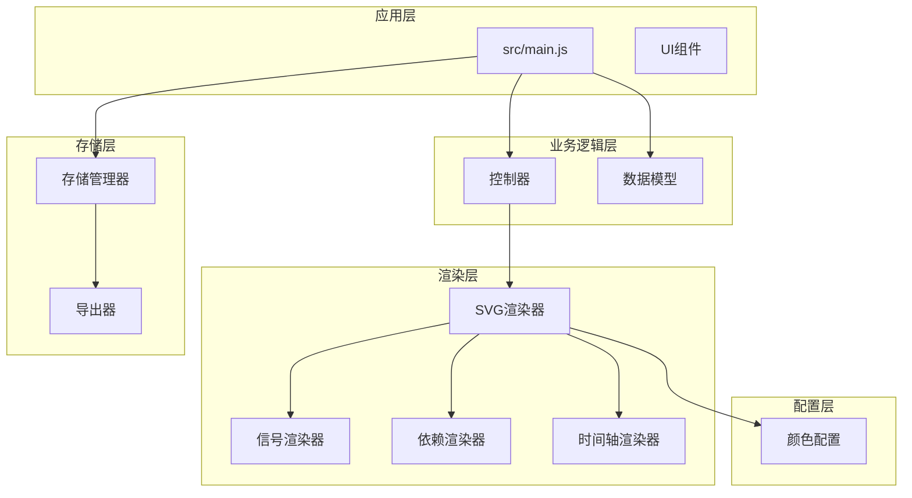
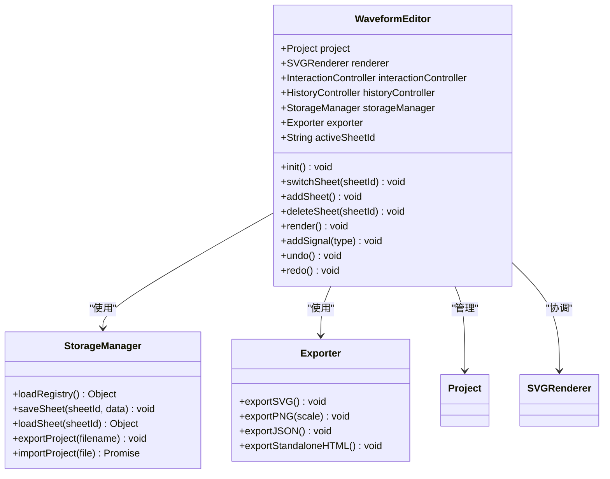
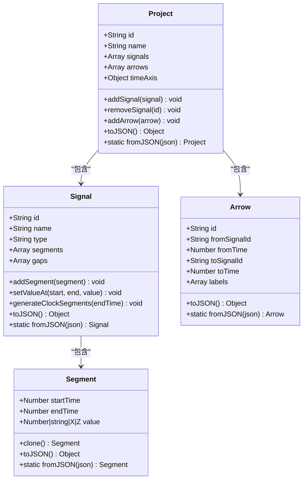
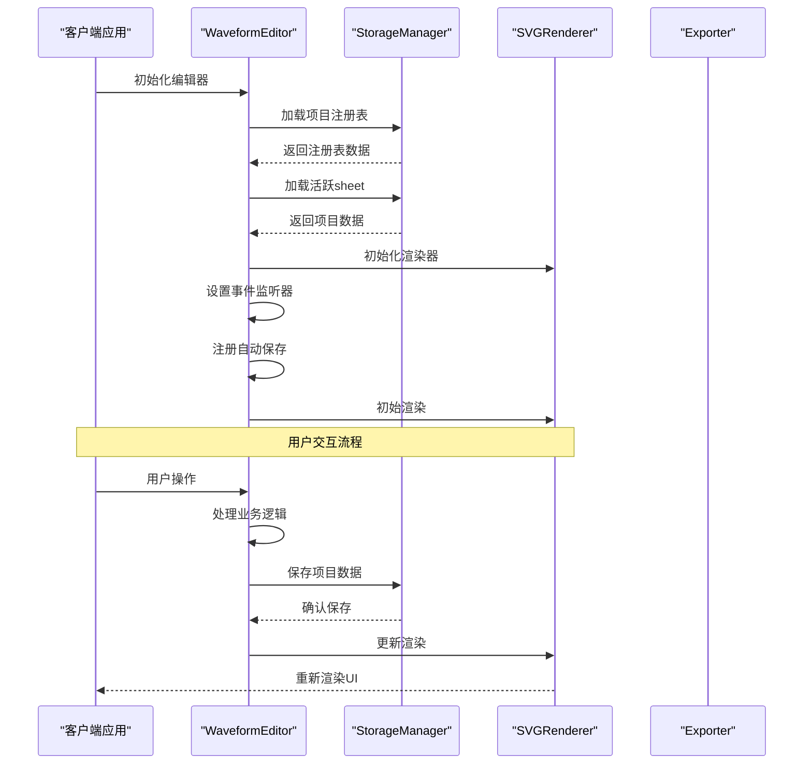
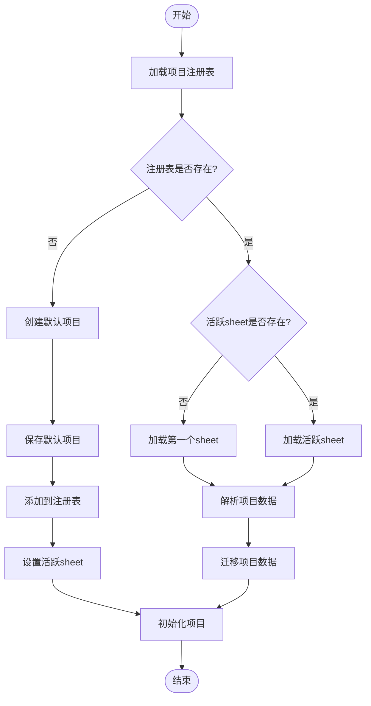
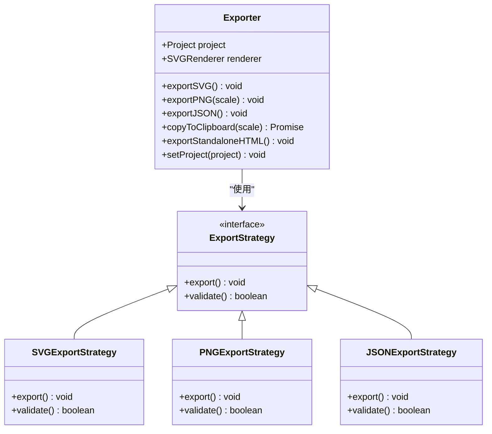
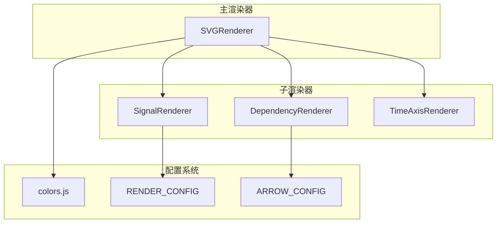
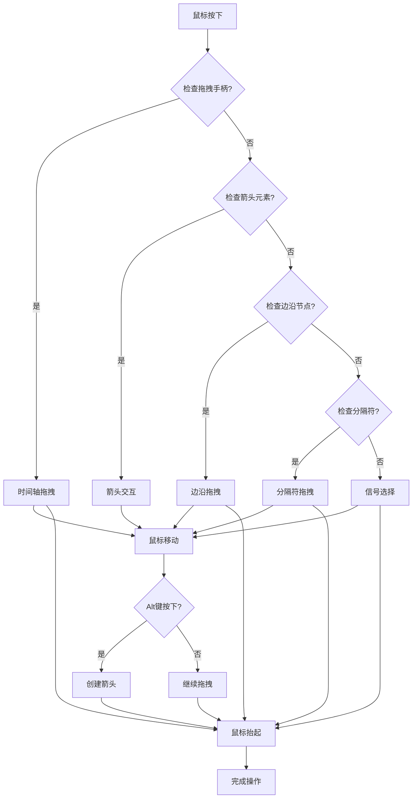
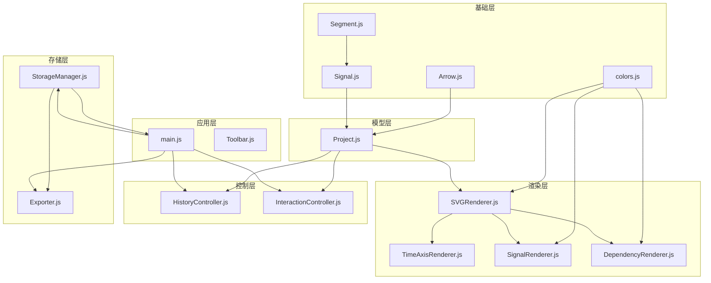

# 第三方集成开发

<cite>
**本文档引用的文件**
- [src/main.js](file://src/main.js)
- [src/io/StorageManager.js](file://src/io/StorageManager.js)
- [src/io/Exporter.js](file://src/io/Exporter.js)
- [src/models/Project.js](file://src/models/Project.js)
- [src/controllers/HistoryController.js](file://src/controllers/HistoryController.js)
- [src/controllers/InteractionController.js](file://src/controllers/InteractionController.js)
- [src/renderers/SVGRenderer.js](file://src/renderers/SVGRenderer.js)
- [src/renderers/SignalRenderer.js](file://src/renderers/SignalRenderer.js)
- [src/renderers/DependencyRenderer.js](file://src/renderers/DependencyRenderer.js)
- [src/renderers/TimeAxisRenderer.js](file://src/renderers/TimeAxisRenderer.js)
- [src/config/colors.js](file://src/config/colors.js)
- [src/models/Signal.js](file://src/models/Signal.js)
- [src/models/Arrow.js](file://src/models/Arrow.js)
- [src/models/Segment.js](file://src/models/Segment.js)
- [src/ui/Toolbar.js](file://src/ui/Toolbar.js)
</cite>

## 目录
1. [简介](#简介)
2. [项目结构](#项目结构)
3. [核心组件](#核心组件)
4. [架构概览](#架构概览)
5. [详细组件分析](#详细组件分析)
6. [依赖分析](#依赖分析)
7. [性能考虑](#性能考虑)
8. [故障排除指南](#故障排除指南)
9. [结论](#结论)
10. [附录](#附录)

## 简介

波形图编辑器是一个基于Web的可视化波形编辑工具，支持复杂的信号波形绘制、依赖关系箭头标注和多sheet项目管理。该编辑器提供了完整的第三方集成开发指南，帮助开发者将编辑器与外部系统和服务进行深度集成。

本编辑器采用模块化架构设计，核心功能包括：
- **数据模型层**：Project、Signal、Arrow、Segment等核心数据结构
- **渲染层**：SVGRenderer及其子渲染器负责波形可视化
- **控制层**：InteractionController处理用户交互，HistoryController管理历史记录
- **存储层**：StorageManager提供本地存储和项目管理
- **导出层**：Exporter支持多种格式导出和独立HTML生成

## 项目结构

波形图编辑器采用清晰的分层架构，每个层次都有明确的职责分工：



**图表来源**
- [src/main.js:1-819](file://src/main.js#L1-L819)
- [src/io/StorageManager.js:1-368](file://src/io/StorageManager.js#L1-L368)
- [src/io/Exporter.js:1-298](file://src/io/Exporter.js#L1-L298)

**章节来源**
- [src/main.js:1-819](file://src/main.js#L1-L819)
- [src/config/colors.js:1-83](file://src/config/colors.js#L1-L83)

## 核心组件

### 主编辑器类 (WaveformEditor)

WaveformEditor是整个应用的核心控制器，负责协调各个子系统的初始化和生命周期管理：



**图表来源**
- [src/main.js:21-132](file://src/main.js#L21-L132)
- [src/io/StorageManager.js:1-368](file://src/io/StorageManager.js#L1-L368)
- [src/io/Exporter.js:1-298](file://src/io/Exporter.js#L1-L298)

### 数据模型体系

编辑器采用完整的数据模型体系，支持复杂的波形数据结构：



**图表来源**
- [src/models/Project.js:8-245](file://src/models/Project.js#L8-L245)
- [src/models/Signal.js:7-343](file://src/models/Signal.js#L7-L343)
- [src/models/Arrow.js:5-114](file://src/models/Arrow.js#L5-L114)
- [src/models/Segment.js:5-94](file://src/models/Segment.js#L5-L94)

**章节来源**
- [src/models/Project.js:1-245](file://src/models/Project.js#L1-L245)
- [src/models/Signal.js:1-343](file://src/models/Signal.js#L1-L343)
- [src/models/Arrow.js:1-114](file://src/models/Arrow.js#L1-L114)
- [src/models/Segment.js:1-94](file://src/models/Segment.js#L1-L94)

## 架构概览

波形图编辑器采用MVVM（Model-View-ViewModel）架构模式，结合观察者模式实现数据驱动的UI更新：



**图表来源**
- [src/main.js:49-132](file://src/main.js#L49-L132)
- [src/io/StorageManager.js:14-130](file://src/io/StorageManager.js#L14-L130)
- [src/renderers/SVGRenderer.js:284-314](file://src/renderers/SVGRenderer.js#L284-L314)

**章节来源**
- [src/main.js:1-819](file://src/main.js#L1-L819)
- [src/renderers/SVGRenderer.js:1-547](file://src/renderers/SVGRenderer.js#L1-L547)

## 详细组件分析

### 存储管理器 (StorageManager)

StorageManager是编辑器的数据持久化核心，提供了完整的多sheet项目管理和数据迁移功能：



**图表来源**
- [src/io/StorageManager.js:14-82](file://src/io/StorageManager.js#L14-L82)
- [src/main.js:56-85](file://src/main.js#L56-L85)

#### 存储后端扩展机制

编辑器提供了灵活的存储后端扩展接口，支持以下存储方式：

1. **本地存储**：基于localStorage的默认实现
2. **云存储**：支持Dropbox、Google Drive、GitHub等云服务
3. **数据库**：支持MySQL、PostgreSQL等关系型数据库
4. **API接口**：RESTful API集成

**章节来源**
- [src/io/StorageManager.js:1-368](file://src/io/StorageManager.js#L1-L368)

### 导出器 (Exporter)

Exporter组件提供了多种格式的导出功能，支持完整的数据交换需求：



**图表来源**
- [src/io/Exporter.js:1-298](file://src/io/Exporter.js#L1-L298)

#### 第三方云存储集成示例

以下是针对主要云存储平台的集成方案：

##### Dropbox集成

```javascript
// Dropbox存储适配器
class DropboxStorageAdapter {
    constructor(accessToken) {
        this.client = new Dropbox({ accessToken });
        this.folderPath = '/waveform-editor/';
    }
    
    async saveProject(projectData, fileName) {
        try {
            const response = await this.client.filesUpload({
                path: `${this.folderPath}${fileName}.json`,
                contents: JSON.stringify(projectData),
                mode: { '.tag': 'overwrite' }
            });
            return { success: true, fileId: response.id };
        } catch (error) {
            throw new Error(`Dropbox保存失败: ${error.message}`);
        }
    }
    
    async loadProject(fileId) {
        try {
            const response = await this.client.filesDownload({
                path: fileId
            });
            return JSON.parse(response.fileBinary);
        } catch (error) {
            throw new Error(`Dropbox加载失败: ${error.message}`);
        }
    }
    
    async listProjects() {
        try {
            const response = await this.client.filesListFolder({
                path: this.folderPath
            });
            return response.entries;
        } catch (error) {
            throw new Error(`Dropbox列表失败: ${error.message}`);
        }
    }
}
```

##### Google Drive集成

```javascript
// Google Drive存储适配器
class GoogleDriveStorageAdapter {
    constructor(authToken) {
        this.authToken = authToken;
        this.apiEndpoint = 'https://www.googleapis.com/drive/v3';
    }
    
    async saveProject(projectData, fileName) {
        const metadata = {
            name: `${fileName}.json`,
            mimeType: 'application/json'
        };
        
        const media = new Blob([JSON.stringify(projectData)], {
            type: 'application/json'
        });
        
        const formData = new FormData();
        formData.append('metadata', new Blob([JSON.stringify(metadata)], {
            type: 'application/json'
        }));
        formData.append('file', media);
        
        const response = await fetch(`${this.apiEndpoint}/files?uploadType=multipart`, {
            method: 'POST',
            headers: {
                Authorization: `Bearer ${this.authToken}`
            },
            body: formData
        });
        
        if (!response.ok) {
            throw new Error('Google Drive保存失败');
        }
        
        const result = await response.json();
        return { success: true, fileId: result.id };
    }
    
    async loadProject(fileId) {
        const response = await fetch(
            `${this.apiEndpoint}/files/${fileId}?alt=media`,
            { headers: { Authorization: `Bearer ${this.authToken}` } }
        );
        
        if (!response.ok) {
            throw new Error('Google Drive加载失败');
        }
        
        return response.json();
    }
}
```

##### GitHub集成

```javascript
// GitHub存储适配器
class GitHubStorageAdapter {
    constructor(token, owner, repo) {
        this.token = token;
        this.owner = owner;
        this.repo = repo;
        this.apiEndpoint = 'https://api.github.com/repos';
    }
    
    async saveProject(projectData, fileName) {
        const content = btoa(JSON.stringify(projectData));
        
        const response = await fetch(
            `${this.apiEndpoint}/${this.owner}/${this.repo}/contents/${fileName}.json`,
            {
                method: 'PUT',
                headers: {
                    'Authorization': `Bearer ${this.token}`,
                    'Content-Type': 'application/json'
                },
                body: JSON.stringify({
                    message: `Save waveform project ${fileName}`,
                    content: content,
                    branch: 'main'
                })
            }
        );
        
        if (!response.ok) {
            throw new Error('GitHub保存失败');
        }
        
        return response.json();
    }
    
    async loadProject(fileName) {
        const response = await fetch(
            `${this.apiEndpoint}/${this.owner}/${this.repo}/contents/${fileName}.json`,
            {
                headers: { 'Authorization': `Bearer ${this.token}` }
            }
        );
        
        if (!response.ok) {
            throw new Error('GitHub加载失败');
        }
        
        const data = await response.json();
        return JSON.parse(atob(data.content));
    }
}
```

**章节来源**
- [src/io/Exporter.js:15-96](file://src/io/Exporter.js#L15-L96)

### 渲染器系统

编辑器采用分层渲染架构，每个渲染器负责特定的可视化任务：



**图表来源**
- [src/renderers/SVGRenderer.js:10-40](file://src/renderers/SVGRenderer.js#L10-L40)
- [src/renderers/SignalRenderer.js:6-16](file://src/renderers/SignalRenderer.js#L6-L16)
- [src/renderers/DependencyRenderer.js:7-12](file://src/renderers/DependencyRenderer.js#L7-L12)
- [src/renderers/TimeAxisRenderer.js:6-15](file://src/renderers/TimeAxisRenderer.js#L6-L15)

**章节来源**
- [src/renderers/SVGRenderer.js:1-547](file://src/renderers/SVGRenderer.js#L1-L547)
- [src/renderers/SignalRenderer.js:1-501](file://src/renderers/SignalRenderer.js#L1-L501)
- [src/renderers/DependencyRenderer.js:1-290](file://src/renderers/DependencyRenderer.js#L1-L290)
- [src/renderers/TimeAxisRenderer.js:1-132](file://src/renderers/TimeAxisRenderer.js#L1-L132)

### 交互控制器 (InteractionController)

InteractionController处理用户的所有交互操作，实现了复杂的选择、拖拽和编辑功能：



**图表来源**
- [src/controllers/InteractionController.js:84-184](file://src/controllers/InteractionController.js#L84-L184)
- [src/controllers/InteractionController.js:284-337](file://src/controllers/InteractionController.js#L284-L337)

**章节来源**
- [src/controllers/InteractionController.js:1-800](file://src/controllers/InteractionController.js#L1-L800)

## 依赖分析

编辑器的依赖关系呈现清晰的分层结构，低层模块不依赖高层模块：



**图表来源**
- [src/main.js:4-16](file://src/main.js#L4-L16)
- [src/renderers/SVGRenderer.js:5-8](file://src/renderers/SVGRenderer.js#L5-L8)
- [src/models/Project.js:5-6](file://src/models/Project.js#L5-L6)

**章节来源**
- [src/main.js:1-819](file://src/main.js#L1-L819)

## 性能考虑

### 渲染性能优化

编辑器采用了多项性能优化策略：

1. **虚拟DOM思想**：通过SVG分组和裁剪区域减少重绘
2. **增量更新**：只更新发生变化的元素
3. **缓存机制**：缓存计算结果和DOM查询结果
4. **请求动画帧**：使用requestAnimationFrame优化动画

### 存储性能优化

1. **批量操作**：支持批量保存和加载
2. **增量同步**：只同步变化的数据
3. **压缩算法**：对大文件进行压缩存储
4. **异步操作**：避免阻塞主线程

### 网络性能优化

1. **CDN支持**：静态资源可通过CDN加速
2. **HTTP缓存**：合理设置缓存头
3. **连接池**：复用HTTP连接
4. **分片上传**：支持大文件分片上传

## 故障排除指南

### 常见问题及解决方案

#### 1. 项目加载失败

**症状**：编辑器无法加载保存的项目数据

**原因分析**：
- 项目数据格式不兼容
- 存储空间不足
- 数据损坏

**解决方案**：
```javascript
// 检查项目数据完整性
function validateProjectData(data) {
    if (!data || !data.signals || !data.arrows) {
        return false;
    }
    
    // 验证信号数据
    for (const signal of data.signals) {
        if (!validateSignalData(signal)) {
            return false;
        }
    }
    
    return true;
}

// 验证信号数据
function validateSignalData(signal) {
    if (!signal.segments) return false;
    
    for (const segment of signal.segments) {
        if (segment.startTime >= segment.endTime) {
            return false;
        }
    }
    
    return true;
}
```

#### 2. 导出失败

**症状**：导出功能异常或导出文件损坏

**原因分析**：
- 内存不足
- 浏览器兼容性问题
- 文件格式不支持

**解决方案**：
```javascript
// 导出前的数据清理
function cleanupProjectData(project) {
    // 移除无效的箭头
    project.arrows = project.arrows.filter(arrow => 
        arrow.fromSignalId && arrow.toSignalId
    );
    
    // 修复信号段
    project.signals.forEach(signal => {
        signal.segments = signal.segments.filter(segment => 
            segment.startTime < segment.endTime
        );
    });
    
    return project;
}
```

#### 3. 同步冲突

**症状**：多人协作时出现数据冲突

**解决方案**：
```javascript
// 版本控制机制
class VersionControl {
    constructor() {
        this.version = 0;
        this.changes = [];
    }
    
    applyChange(change) {
        this.changes.push({
            version: ++this.version,
            change: change,
            timestamp: Date.now()
        });
        
        return this.version;
    }
    
    resolveConflict(localVersion, remoteVersion, localChanges, remoteChanges) {
        // 基于时间戳的冲突解决
        const timestamp = Math.max(
            localVersion.timestamp,
            remoteVersion.timestamp
        );
        
        // 合并变更
        const mergedChanges = this.mergeChanges(
            localChanges,
            remoteChanges,
            timestamp
        );
        
        return mergedChanges;
    }
}
```

**章节来源**
- [src/controllers/HistoryController.js:1-56](file://src/controllers/HistoryController.js#L1-L56)
- [src/io/StorageManager.js:138-164](file://src/io/StorageManager.js#L138-L164)

## 结论

波形图编辑器提供了一个完整、可扩展的第三方集成框架。通过其模块化的架构设计和清晰的分层结构，开发者可以轻松地将编辑器与各种外部系统和服务进行集成。

关键优势包括：
- **灵活的存储后端**：支持本地存储、云存储和数据库等多种存储方式
- **强大的导出功能**：支持多种格式的导出和独立HTML生成
- **完善的错误处理**：提供完整的错误检测和恢复机制
- **高性能设计**：采用多项性能优化策略确保流畅的用户体验

通过遵循本文档提供的集成指南和最佳实践，开发者可以构建稳定可靠的第三方集成解决方案，满足各种复杂的业务需求。

## 附录

### API参考

#### 存储管理API

| 方法 | 参数 | 返回值 | 描述 |
|------|------|--------|------|
| `loadRegistry()` | 无 | `{sheets, activeSheetId}` | 加载项目注册表 |
| `saveSheet(sheetId, data)` | `sheetId: string, data: Object` | `void` | 保存单个sheet数据 |
| `loadSheet(sheetId)` | `sheetId: string` | `Object \| null` | 加载单个sheet数据 |
| `exportProject(filename)` | `filename: string` | `void` | 导出整个项目 |

#### 导出API

| 方法 | 参数 | 返回值 | 描述 |
|------|------|--------|------|
| `exportSVG()` | 无 | `void` | 导出为SVG格式 |
| `exportPNG(scale)` | `scale: number` | `void` | 导出为PNG格式 |
| `exportJSON()` | 无 | `void` | 导出为JSON格式 |
| `exportStandaloneHTML()` | 无 | `Promise` | 导出独立HTML文件 |

### 配置选项

#### 渲染配置

| 配置项 | 类型 | 默认值 | 描述 |
|--------|------|--------|------|
| `signalHeight` | `number` | 40 | 信号行高度 |
| `signalGap` | `number` | 10 | 信号间距 |
| `waveformHeight` | `number` | 30 | 波形高度 |
| `transitionWidth` | `number` | 1.2 | 跳变沿宽度 |

#### 颜色配置

| 配置项 | 类型 | 默认值 | 描述 |
|--------|------|--------|------|
| `normal` | `string` | `#000000` | 正常电平颜色 |
| `unknown` | `string` | `#E00000` | 不定态颜色 |
| `highZ` | `string` | `#B8860B` | 高阻态颜色 |
| `selection` | `string` | `rgba(0, 120, 215, 0.3)` | 选择框颜色 |