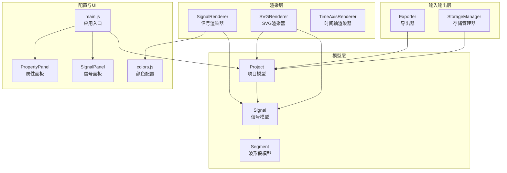
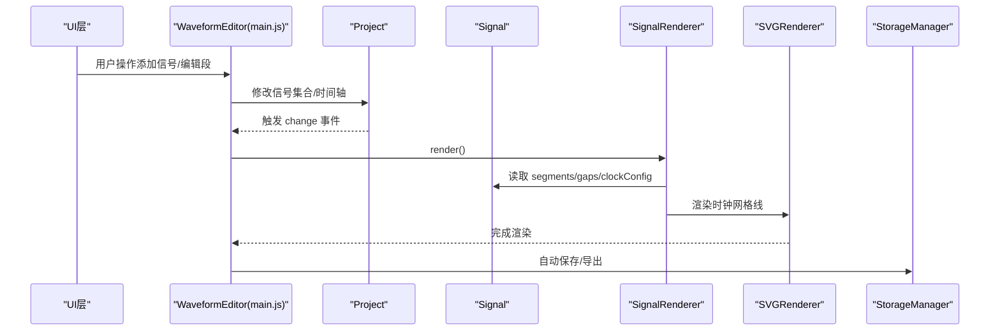
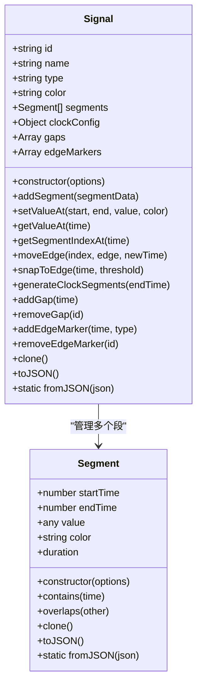
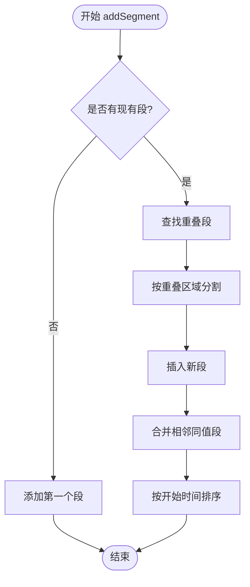
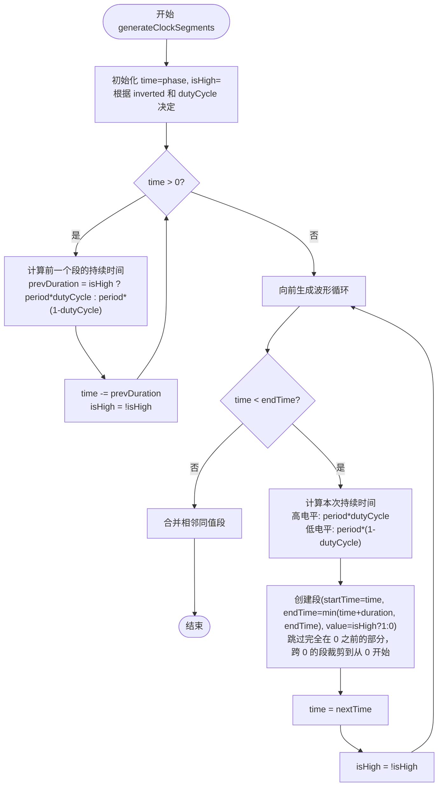
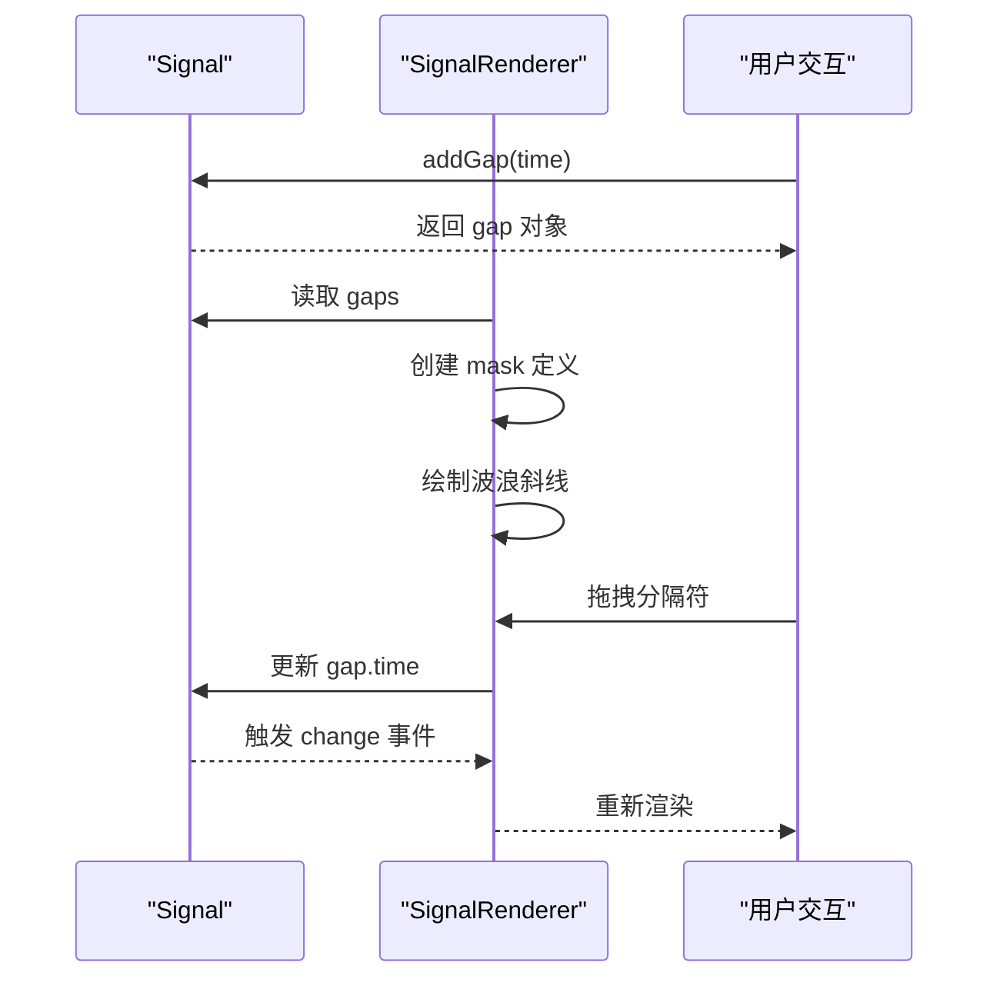
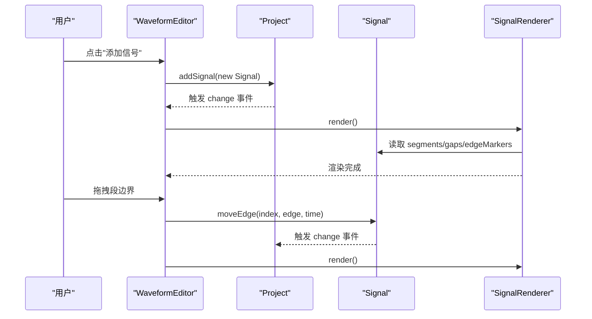
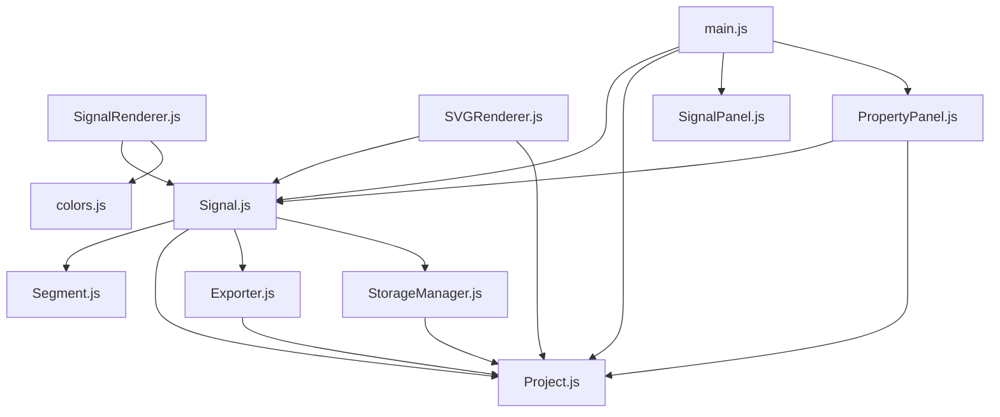

# 信号模型 (Signal)

<cite>
**本文档引用的文件**
- [Signal.js](file://src/models/Signal.js)
- [Segment.js](file://src/models/Segment.js)
- [Project.js](file://src/models/Project.js)
- [Exporter.js](file://src/io/Exporter.js)
- [StorageManager.js](file://src/io/StorageManager.js)
- [colors.js](file://src/config/colors.js)
- [SignalRenderer.js](file://src/renderers/SignalRenderer.js)
- [SignalPanel.js](file://src/ui/SignalPanel.js)
- [PropertyPanel.js](file://src/ui/PropertyPanel.js)
- [SVGRenderer.js](file://src/renderers/SVGRenderer.js)
- [main.js](file://src/main.js)
- [default-template.json](file://default-template.json)
- [test-runner.html](file://tests/test-runner.html)
</cite>

## 更新摘要
**变更内容**
- 更新了时钟信号渲染算法部分，反映了正相位偏移处理的增强和向后迭代逻辑的改进
- 添加了时钟信号极性翻转（inverted）配置的支持说明
- 更新了时钟网格线渲染的相关内容
- 增强了时钟信号生成算法的完整性和准确性描述

## 目录
1. [简介](#简介)
2. [项目结构](#项目结构)
3. [核心组件](#核心组件)
4. [架构概览](#架构概览)
5. [详细组件分析](#详细组件分析)
6. [依赖关系分析](#依赖关系分析)
7. [性能考虑](#性能考虑)
8. [故障排除指南](#故障排除指南)
9. [结论](#结论)
10. [附录](#附录)

## 简介
本文档深入解析波形图编辑器中的信号模型，重点涵盖 Signal 类的设计原理、实现细节以及与相关组件的协作关系。内容包括：
- 信号的基本属性（id、name、type、color、segments、gaps）
- 信号类型系统（普通信号、时钟信号、总线信号）
- 信号段（Segment）的管理机制（创建、编辑、删除、合并）
- 时钟信号的特殊属性（period、dutyCycle、phase、inverted）与时钟周期计算逻辑
- 分隔符（gap）功能的实现（自动分隔符生成与手动分隔符管理）
- 信号的序列化与反序列化过程（数据格式与版本兼容性）
- 信号创建、编辑与使用的完整示例

## 项目结构
信号模型位于 models 目录中，与渲染器、存储管理、颜色配置等模块协同工作，形成完整的波形图编辑器架构。

**图表来源**
- [Signal.js:1-378](file://src/models/Signal.js#L1-L378)
- [Segment.js:1-94](file://src/models/Segment.js#L1-L94)
- [Project.js:1-245](file://src/models/Project.js#L1-L245)
- [SignalRenderer.js:1-590](file://src/renderers/SignalRenderer.js#L1-L590)
- [SVGRenderer.js:1-563](file://src/renderers/SVGRenderer.js#L1-L563)
- [Exporter.js:1-298](file://src/io/Exporter.js#L1-L298)
- [StorageManager.js:1-368](file://src/io/StorageManager.js#L1-L368)
- [colors.js:1-83](file://src/config/colors.js#L1-L83)
- [SignalPanel.js:1-164](file://src/ui/SignalPanel.js#L1-L164)
- [PropertyPanel.js:1-583](file://src/ui/PropertyPanel.js#L1-L583)
- [main.js:1-819](file://src/main.js#L1-L819)

**章节来源**
- [Signal.js:1-378](file://src/models/Signal.js#L1-L378)
- [Segment.js:1-94](file://src/models/Segment.js#L1-L94)
- [Project.js:1-245](file://src/models/Project.js#L1-L245)
- [SignalRenderer.js:1-590](file://src/renderers/SignalRenderer.js#L1-L590)
- [SVGRenderer.js:1-563](file://src/renderers/SVGRenderer.js#L1-L563)
- [Exporter.js:1-298](file://src/io/Exporter.js#L1-L298)
- [StorageManager.js:1-368](file://src/io/StorageManager.js#L1-L368)
- [colors.js:1-83](file://src/config/colors.js#L1-L83)
- [SignalPanel.js:1-164](file://src/ui/SignalPanel.js#L1-L164)
- [PropertyPanel.js:1-583](file://src/ui/PropertyPanel.js#L1-L583)
- [main.js:1-819](file://src/main.js#L1-L819)

## 核心组件
本节概述信号模型的核心组成及其职责：
- Signal：表示单个波形信号，管理其段集合、时钟配置、分隔符以及序列化/反序列化。
- Segment：表示信号的一个电平段，包含起止时间、电平值及颜色信息，并提供重叠检测、包含判断等方法。
- Project：项目级容器，管理多个信号、时间轴配置、事件系统等。
- SignalRenderer：负责将信号渲染到SVG中，支持分隔符遮罩、跳变沿节点、X/Z态特殊渲染等。
- SVGRenderer：负责渲染SVG画布，包括时钟网格线、背景网格等辅助元素。
- StorageManager：提供多 sheet 存储、项目导入导出、版本兼容等功能。
- Exporter：支持导出SVG/PNG/JSON/独立HTML等格式。
- colors.js：集中管理颜色与渲染配置。
- SignalPanel：UI 层的信号列表面板，支持拖拽排序、删除等操作。
- PropertyPanel：UI 层的信号属性面板，支持时钟信号配置（周期、相位、占空比、极性翻转）。
- main.js：应用入口，负责初始化、事件绑定、默认项目创建等。

**章节来源**
- [Signal.js:1-378](file://src/models/Signal.js#L1-L378)
- [Segment.js:1-94](file://src/models/Segment.js#L1-L94)
- [Project.js:1-245](file://src/models/Project.js#L1-L245)
- [SignalRenderer.js:1-590](file://src/renderers/SignalRenderer.js#L1-L590)
- [SVGRenderer.js:1-563](file://src/renderers/SVGRenderer.js#L1-L563)
- [StorageManager.js:1-368](file://src/io/StorageManager.js#L1-L368)
- [Exporter.js:1-298](file://src/io/Exporter.js#L1-L298)
- [colors.js:1-83](file://src/config/colors.js#L1-L83)
- [SignalPanel.js:1-164](file://src/ui/SignalPanel.js#L1-L164)
- [PropertyPanel.js:1-583](file://src/ui/PropertyPanel.js#L1-L583)
- [main.js:1-819](file://src/main.js#L1-L819)

## 架构概览
信号模型在整体架构中的位置如下：
- 模型层：Signal/Segment/Project 提供数据结构与业务逻辑
- 渲染层：SignalRenderer/SVGRenderer 基于 Project 和 Segment 数据进行可视化
- 输入输出层：StorageManager/Exporter 负责持久化与导出
- UI 层：SignalPanel/PropertyPanel/Toolbar 等提供用户交互
- 配置层：colors.js 提供统一的颜色与渲染参数

**图表来源**
- [main.js:49-132](file://src/main.js#L49-L132)
- [Project.js:172-202](file://src/models/Project.js#L172-L202)
- [SignalRenderer.js:22-31](file://src/renderers/SignalRenderer.js#L22-L31)
- [SVGRenderer.js:365-404](file://src/renderers/SVGRenderer.js#L365-L404)
- [StorageManager.js:226-241](file://src/io/StorageManager.js#L226-L241)

**章节来源**
- [main.js:49-132](file://src/main.js#L49-L132)
- [Project.js:172-202](file://src/models/Project.js#L172-L202)
- [SignalRenderer.js:22-31](file://src/renderers/SignalRenderer.js#L22-L31)
- [SVGRenderer.js:365-404](file://src/renderers/SVGRenderer.js#L365-L404)
- [StorageManager.js:226-241](file://src/io/StorageManager.js#L226-L241)

## 详细组件分析

### Signal 类设计与实现
Signal 类是波形信号的核心模型，负责：
- 基本属性管理：id、name、type、color、segments、gaps、edgeMarkers、clockConfig
- 段管理：addSegment、setValueAt、getValueAt、getSegmentIndexAt、moveEdge
- 时钟信号：generateClockSegments、clockConfig（period、phase、dutyCycle、inverted）
- 分隔符：addGap、removeGap
- 沿标注：addEdgeMarker、removeEdgeMarker
- 序列化：toJSON、fromJSON、clone

关键实现要点：
- 段重叠处理：addSegment 会查找重叠段并进行分割，然后合并相邻同值段，保证数据结构简洁高效
- 边界吸附：snapToEdge 支持基于阈值的跳变沿吸附，提升交互体验
- 时钟周期计算：generateClockSegments 按照 period、phase、dutyCycle、inverted 生成交替高低电平段
- 分隔符渲染：gaps 通过 SignalRenderer 的遮罩机制在渲染时显示波浪斜线
- 极性翻转：inverted 配置允许时钟信号从低电平开始（下降沿启动）

**更新** 增强了正相位偏移处理，添加了向后迭代逻辑以生成完整的波形覆盖

**图表来源**
- [Signal.js:7-378](file://src/models/Signal.js#L7-L378)
- [Segment.js:5-94](file://src/models/Segment.js#L5-L94)

**章节来源**
- [Signal.js:7-378](file://src/models/Signal.js#L7-L378)
- [Segment.js:5-94](file://src/models/Segment.js#L5-L94)

### Segment 类设计与实现
Segment 是信号的最小单元，提供：
- 基本属性：startTime、endTime、value、color
- 验证：构造时检查 startTime < endTime
- 查询：duration、contains、overlaps
- 序列化：toJSON、fromJSON
- 克隆：clone

Segment 支持多种电平值：
- 二进制：0、1
- 高阻态：'Z'
- 不定态：'X'
- 总线值：十六进制字符串（如 '0x3F'）

**章节来源**
- [Segment.js:5-94](file://src/models/Segment.js#L5-L94)

### 信号类型系统
项目支持三种信号类型：
- signal：普通数字信号
- clock：时钟信号，具有周期性特性
- bus：总线信号，支持多比特数据与特殊渲染

类型影响：
- 渲染：总线信号采用双线边框与菱形填充，X 态使用斜线填充
- 时钟信号：通过 clockConfig 自动生成周期性段，支持相位偏移和极性翻转
- 分隔符：时钟信号不支持手动分隔符

**章节来源**
- [Signal.js:12-21](file://src/models/Signal.js#L12-L21)
- [SignalRenderer.js:224-243](file://src/renderers/SignalRenderer.js#L224-L243)

### 信号段管理机制
段管理涉及以下核心流程：

#### 段创建与合并
- addSegment：接收新段，查找重叠段，分割重叠区域，插入新段，合并相邻同值段，排序
- _mergeAdjacentSegments：合并相邻且值相同、颜色相同的段，减少段数量

**图表来源**
- [Signal.js:83-154](file://src/models/Signal.js#L83-L154)

**章节来源**
- [Signal.js:83-154](file://src/models/Signal.js#L83-L154)

#### 段编辑与移动
- setValueAt：设置指定时间范围的电平值（内部调用 addSegment）
- moveEdge：移动指定段的开始或结束边界，更新前后段的边界，删除零长度段，合并相邻段

**章节来源**
- [Signal.js:292-320](file://src/models/Signal.js#L292-L320)

### 时钟信号的特殊属性与周期计算
时钟信号通过 clockConfig 控制：
- period：时钟周期
- phase：相位偏移
- dutyCycle：占空比（0-1）
- inverted：极性翻转（true 表示从低电平开始，下降沿启动）

**更新** 增强了正相位偏移处理，添加了向后迭代逻辑以生成完整的波形覆盖

generateClockSegments 的计算逻辑：
- 从 phase 开始，使用向后迭代逻辑确保 [0, phase) 区间也有波形
- 交替生成高电平与低电平段，支持极性翻转
- 高电平持续时间为 period * dutyCycle
- 低电平持续时间为 period * (1 - dutyCycle)
- 循环直到超过 endTime
- 生成后进行合并与排序

**图表来源**
- [Signal.js:247-284](file://src/models/Signal.js#L247-L284)

**章节来源**
- [Signal.js:247-284](file://src/models/Signal.js#L247-L284)

### 分隔符（Gap）功能实现
分隔符用于在波形中创建视觉间隔，常用于长波形的分段显示：
- 手动添加：addGap 在指定时间插入分隔符，自动排序
- 渲染遮罩：SignalRenderer 使用 SVG mask 机制，在分隔符位置裁剪波形线
- 交互节点：分隔符两侧提供透明命中区域，支持拖拽调整位置
- 删除：removeGap 根据 id 移除分隔符

**图表来源**
- [Signal.js:44-57](file://src/models/Signal.js#L44-L57)
- [SignalRenderer.js:100-141](file://src/renderers/SignalRenderer.js#L100-L141)
- [SignalRenderer.js:152-193](file://src/renderers/SignalRenderer.js#L152-L193)

**章节来源**
- [Signal.js:44-57](file://src/models/Signal.js#L44-L57)
- [SignalRenderer.js:100-141](file://src/renderers/SignalRenderer.js#L100-L141)
- [SignalRenderer.js:152-193](file://src/renderers/SignalRenderer.js#L152-L193)

### 沿标注（Edge Marker）功能实现
沿标注用于标记跳变沿位置，支持上升沿和下降沿：
- 添加标注：addEdgeMarker 在指定时间添加标注，支持 'rising' 或 'falling' 类型
- 渲染：SignalRenderer 渲染跳变沿节点和标注箭头
- 删除：removeEdgeMarker 根据 id 移除标注

**章节来源**
- [Signal.js:65-77](file://src/models/Signal.js#L65-L77)
- [SignalRenderer.js:490-516](file://src/renderers/SignalRenderer.js#L490-L516)

### 序列化与反序列化
信号模型支持完整的 JSON 序列化与反序列化：
- Signal.toJSON：包含 id、name、type、color、segments、clockConfig、gaps、edgeMarkers
- Signal.fromJSON：从 JSON 创建 Signal 实例，重建 Segment 列表
- Project.toJSON/Project.fromJSON：项目级序列化，包含多个信号与时间轴配置
- Exporter.exportJSON：导出项目为 JSON 文件
- StorageManager：支持多 sheet 存储、版本兼容（version 2）、导入导出

版本兼容性：
- 版本 2：支持多 sheet 注册表与 sheets 对象
- 旧版单项目格式：自动迁移至新格式

**章节来源**
- [Signal.js:345-377](file://src/models/Signal.js#L345-L377)
- [Project.js:208-244](file://src/models/Project.js#L208-L244)
- [Exporter.js:84-96](file://src/io/Exporter.js#L84-L96)
- [StorageManager.js:167-236](file://src/io/StorageManager.js#L167-L236)
- [StorageManager.js:138-164](file://src/io/StorageManager.js#L138-L164)

### 颜色与渲染配置
颜色与渲染配置集中在 colors.js 中：
- COLORS：信号颜色、界面颜色、交互颜色
- RENDER_CONFIG：信号行高度、间距、波形高度、跳变沿宽度等
- getLevelY/getLevelColor：根据电平值计算 Y 坐标与颜色
- SignalRenderer：根据信号类型与电平值渲染波形线、跳变沿、X/Z 态、总线值
- SVGRenderer：渲染时钟网格线、背景网格等辅助元素

**章节来源**
- [colors.js:5-83](file://src/config/colors.js#L5-L83)
- [SignalRenderer.js:58-69](file://src/renderers/SignalRenderer.js#L58-L69)
- [SignalRenderer.js:212-316](file://src/renderers/SignalRenderer.js#L212-L316)
- [SVGRenderer.js:365-404](file://src/renderers/SVGRenderer.js#L365-L404)

### 信号创建、编辑与使用的完整示例
以下示例展示如何在应用中创建、编辑和使用信号：

- 创建普通信号：通过 WaveformEditor.addSignal(type='signal') 创建，默认初始段覆盖到时间轴结束
- 创建时钟信号：通过 WaveformEditor.addSignal(type='clock') 创建，设置 clockConfig 并自动生成周期性段
- 编辑段：通过 InteractionController 与 SignalRenderer 的交互节点移动段边界，或使用 setValueAt 设置特定范围的电平值
- 添加分隔符：通过 WaveformEditor.addGap() 在选中信号上添加分隔符，支持拖拽调整位置
- 添加沿标注：通过 Signal.addEdgeMarker() 添加跳变沿标注
- 删除信号：通过 SignalPanel 的删除按钮移除信号
- 导出与保存：通过 Exporter 与 StorageManager 进行 JSON 导出、多 sheet 保存与模板管理

**图表来源**
- [main.js:634-668](file://src/main.js#L634-L668)
- [main.js:789-795](file://src/main.js#L789-L795)
- [Signal.js:292-320](file://src/models/Signal.js#L292-L320)
- [SignalRenderer.js:479-500](file://src/renderers/SignalRenderer.js#L479-L500)

**章节来源**
- [main.js:634-668](file://src/main.js#L634-L668)
- [main.js:789-795](file://src/main.js#L789-L795)
- [Signal.js:292-320](file://src/models/Signal.js#L292-L320)
- [SignalRenderer.js:479-500](file://src/renderers/SignalRenderer.js#L479-L500)

## 依赖关系分析
Signal 与其他组件的依赖关系如下：

**图表来源**
- [Signal.js:5-29](file://src/models/Signal.js#L5-L29)
- [SignalRenderer.js:4-16](file://src/renderers/SignalRenderer.js#L4-L16)
- [SVGRenderer.js:1-6](file://src/renderers/SVGRenderer.js#L1-L6)
- [PropertyPanel.js:1-6](file://src/ui/PropertyPanel.js#L1-L6)
- [main.js:4-16](file://src/main.js#L4-L16)
- [StorageManager.js:1-6](file://src/io/StorageManager.js#L1-L6)
- [Exporter.js:1-5](file://src/io/Exporter.js#L1-L5)

**章节来源**
- [Signal.js:5-29](file://src/models/Signal.js#L5-L29)
- [SignalRenderer.js:4-16](file://src/renderers/SignalRenderer.js#L4-L16)
- [SVGRenderer.js:1-6](file://src/renderers/SVGRenderer.js#L1-L6)
- [PropertyPanel.js:1-6](file://src/ui/PropertyPanel.js#L1-L6)
- [main.js:4-16](file://src/main.js#L4-L16)
- [StorageManager.js:1-6](file://src/io/StorageManager.js#L1-L6)
- [Exporter.js:1-5](file://src/io/Exporter.js#L1-L5)

## 性能考虑
- 段合并策略：addSegment 后立即合并相邻同值段，减少渲染节点数量，提高渲染效率
- 边界吸附：snapToEdge 使用阈值限制吸附范围，避免不必要的重排
- 时钟信号生成：generateClockSegments 采用增量生成，避免一次性创建大量段
- 向后迭代优化：正相位偏移的向后迭代逻辑确保完整的波形覆盖，同时避免重复计算
- 渲染优化：SignalRenderer 使用 SVG mask 裁剪分隔符区域，减少路径复杂度
- 事件驱动：Project 的事件系统仅在必要时触发渲染，降低不必要的重绘

[本节为通用性能讨论，无需具体文件分析]

## 故障排除指南
常见问题与解决方案：
- 段验证错误：Segment 构造时若 startTime >= endTime 会抛出异常，需确保传入合法的时间范围
- 时钟信号不显示：确认 clockConfig 已设置且 generateClockSegments 已调用
- 正相位偏移异常：检查 phase 是否为正数，向后迭代逻辑会自动处理 [0, phase) 区间的波形生成
- 极性翻转问题：确认 inverted 配置正确，inverted=true 时从低电平开始
- 分隔符不生效：检查 gaps 数组是否正确添加，渲染时需确保 SignalRenderer 的遮罩逻辑正常
- 导入失败：StorageManager.importProject 会检查文件格式，确保 .wfp/.json 文件格式正确
- 项目迁移：StorageManager.migrateOldData 会自动将旧格式数据迁移至新格式

**章节来源**
- [Segment.js:24-28](file://src/models/Segment.js#L24-L28)
- [Signal.js:256-262](file://src/models/Signal.js#L256-L262)
- [StorageManager.js:208-236](file://src/io/StorageManager.js#L208-L236)
- [StorageManager.js:138-164](file://src/io/StorageManager.js#L138-L164)

## 结论
信号模型通过清晰的数据结构与完善的算法实现了高效的波形编辑能力。Signal 类提供了强大的段管理、时钟信号生成与分隔符支持；Segment 类保证了数据的有效性；Project 类提供了事件驱动的项目管理；SignalRenderer 与 colors.js 提供了高质量的可视化效果。配合 SVGRenderer 的时钟网格线渲染和 PropertyPanel 的时钟信号配置，实现了完整的时钟信号编辑体验。Exporter 与 StorageManager 实现了完整的序列化、版本兼容与多 sheet 管理。整体架构层次清晰、职责明确，易于扩展与维护。

[本节为总结性内容，无需具体文件分析]

## 附录

### 数据格式与版本兼容性
- 项目 JSON 结构：包含 id、name、signals、annotations、arrows、timeAxis 等字段
- 信号 JSON 结构：包含 id、name、type、color、segments、clockConfig、gaps、edgeMarkers
- 段 JSON 结构：包含 startTime、endTime、value、color（可选）
- 版本 2：支持多 sheet 注册表与 sheets 对象，自动迁移旧格式

**章节来源**
- [Project.js:208-244](file://src/models/Project.js#L208-L244)
- [Signal.js:345-377](file://src/models/Signal.js#L345-L377)
- [Segment.js:86-93](file://src/models/Segment.js#L86-L93)
- [StorageManager.js:167-236](file://src/io/StorageManager.js#L167-L236)
- [StorageManager.js:138-164](file://src/io/StorageManager.js#L138-L164)

### 示例模板
项目启动时可加载默认模板 default-template.json，其中包含预设的时钟信号与波形段，便于快速开始编辑。

**章节来源**
- [default-template.json:1-800](file://default-template.json#L1-L800)
- [main.js:138-210](file://src/main.js#L138-L210)

### 测试用例参考
单元测试覆盖了 Segment、Signal、Project 的核心功能，包括：
- Segment 的创建、克隆、序列化/反序列化、重叠检测
- Signal 的段合并、时钟信号生成、边界移动、分隔符管理、沿标注管理
- Project 的事件系统、时间轴转换、信号排序

**章节来源**
- [test-runner.html:57-309](file://tests/test-runner.html#L57-L309)

### 时钟信号配置界面
PropertyPanel 提供了完整的时钟信号配置界面，包括：
- 时钟周期设置
- 相位偏移设置
- 占空比设置
- 极性翻转选项
- 重新生成时钟按钮

**章节来源**
- [PropertyPanel.js:94-119](file://src/ui/PropertyPanel.js#L94-L119)
- [PropertyPanel.js:204-238](file://src/ui/PropertyPanel.js#L204-L238)