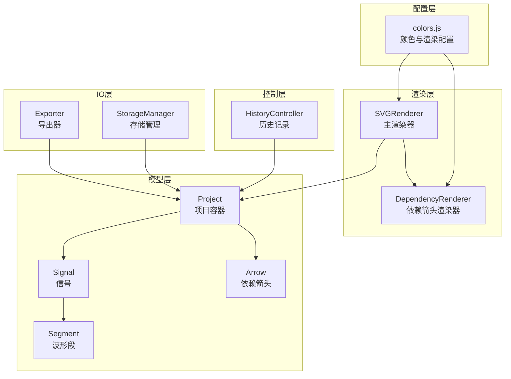
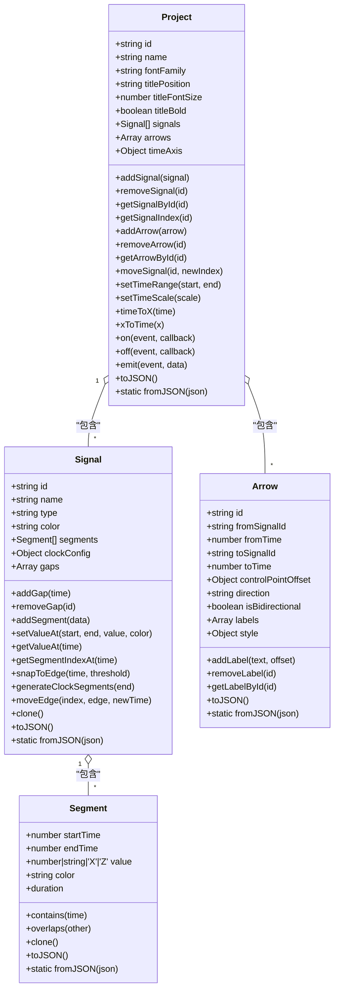
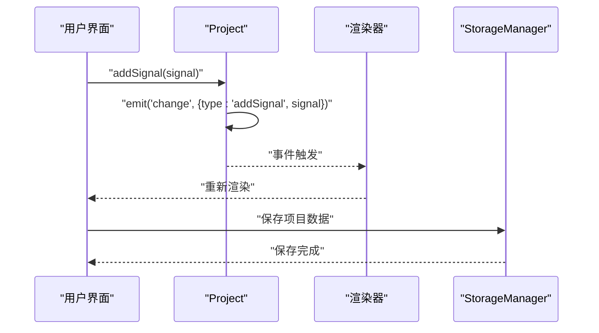
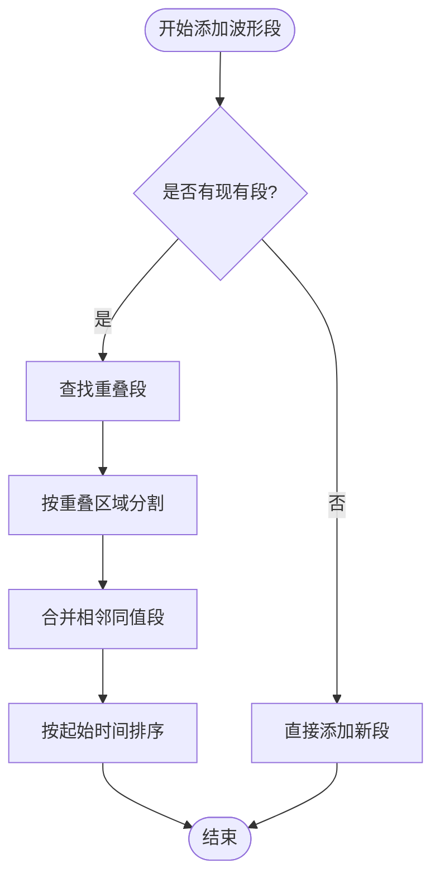
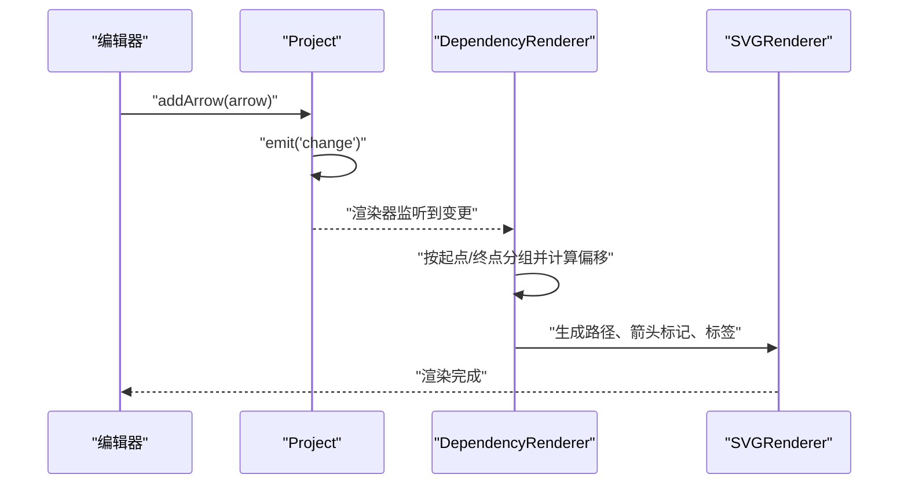
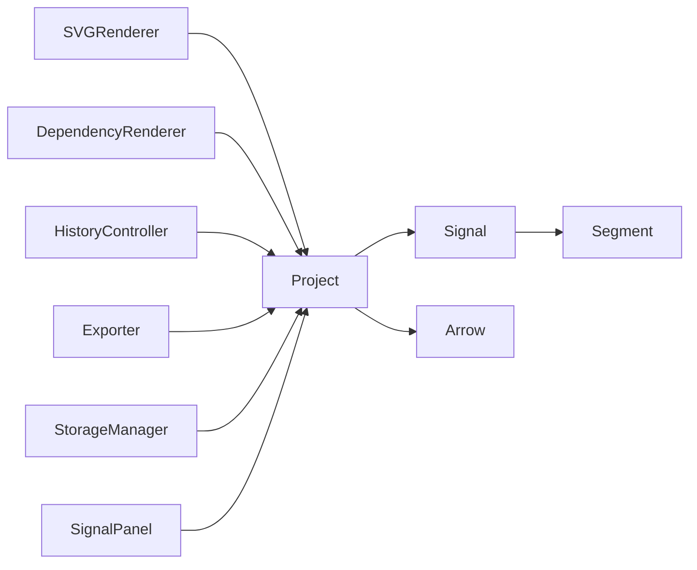

# 数据模型系统

<cite>
**本文档引用的文件**
- [Project.js](file://src/models/Project.js)
- [Signal.js](file://src/models/Signal.js)
- [Arrow.js](file://src/models/Arrow.js)
- [Segment.js](file://src/models/Segment.js)
- [DependencyRenderer.js](file://src/renderers/DependencyRenderer.js)
- [HistoryController.js](file://src/controllers/HistoryController.js)
- [Exporter.js](file://src/io/Exporter.js)
- [StorageManager.js](file://src/io/StorageManager.js)
- [colors.js](file://src/config/colors.js)
- [SVGRenderer.js](file://src/renderers/SVGRenderer.js)
- [SignalPanel.js](file://src/ui/SignalPanel.js)
- [main.js](file://src/main.js)
- [test-runner.html](file://tests/test-runner.html)
</cite>

## 目录
1. [简介](#简介)
2. [项目结构](#项目结构)
3. [核心组件](#核心组件)
4. [架构概览](#架构概览)
5. [详细组件分析](#详细组件分析)
6. [依赖关系分析](#依赖关系分析)
7. [性能考虑](#性能考虑)
8. [故障排除指南](#故障排除指南)
9. [结论](#结论)
10. [附录](#附录)

## 简介
本文件系统性地解析波形图编辑器的数据模型系统，重点涵盖以下核心模型：
- Project（项目）：顶层容器，管理信号、箭头、时间轴和事件系统
- Signal（信号）：表示单个波形信号，包含波形段集合、时钟配置和分隔符
- Arrow（依赖箭头）：表示信号间依赖关系，支持多标签、样式和方向控制
- Segment（波形段）：最小波形单元，描述时间区间内的电平值

文档还详细说明了数据序列化/反序列化机制（JSON）、版本兼容策略、信号类型系统（普通信号、时钟信号、总线信号），以及依赖关系模型的创建、编辑和验证流程。最后提供使用示例和最佳实践，帮助开发者正确使用这些核心数据结构。

## 项目结构
数据模型位于 src/models 目录，配合渲染器、控制器、IO 模块协同工作。整体采用“模型-渲染-交互-存储”的分层架构，模型层负责数据结构与业务逻辑，渲染层负责可视化，控制器负责交互与历史管理，IO 层负责持久化与导入导出。

图表来源
- [Project.js:1-245](file://src/models/Project.js#L1-L245)
- [Signal.js:1-343](file://src/models/Signal.js#L1-L343)
- [Arrow.js:1-114](file://src/models/Arrow.js#L1-L114)
- [Segment.js:1-94](file://src/models/Segment.js#L1-L94)
- [SVGRenderer.js:1-200](file://src/renderers/SVGRenderer.js#L1-L200)
- [DependencyRenderer.js:1-290](file://src/renderers/DependencyRenderer.js#L1-L290)
- [HistoryController.js:1-56](file://src/controllers/HistoryController.js#L1-L56)
- [Exporter.js:1-298](file://src/io/Exporter.js#L1-L298)
- [StorageManager.js:1-368](file://src/io/StorageManager.js#L1-L368)
- [colors.js:1-83](file://src/config/colors.js#L1-L83)

章节来源
- [Project.js:1-245](file://src/models/Project.js#L1-L245)
- [Signal.js:1-343](file://src/models/Signal.js#L1-L343)
- [Arrow.js:1-114](file://src/models/Arrow.js#L1-L114)
- [Segment.js:1-94](file://src/models/Segment.js#L1-L94)
- [SVGRenderer.js:1-200](file://src/renderers/SVGRenderer.js#L1-L200)
- [DependencyRenderer.js:1-290](file://src/renderers/DependencyRenderer.js#L1-L290)
- [HistoryController.js:1-56](file://src/controllers/HistoryController.js#L1-L56)
- [Exporter.js:1-298](file://src/io/Exporter.js#L1-L298)
- [StorageManager.js:1-368](file://src/io/StorageManager.js#L1-L368)
- [colors.js:1-83](file://src/config/colors.js#L1-L83)

## 核心组件
本节概述四个核心模型的职责、关键属性与方法，并说明它们之间的关系。

- Project（项目）
  - 职责：顶层容器，管理信号列表、箭头列表、时间轴配置、项目元信息（字体、标题位置、标题字号、标题粗细），并提供事件系统用于通知变更。
  - 关键属性：id、name、fontFamily、titlePosition、titleFontSize、titleBold、signals、annotations、arrows、timeAxis。
  - 关键方法：addSignal/removeSignal/getSignalById/getSignalIndex、addArrow/removeArrow/getArrowById、moveSignal、setTimeRange/setTimeScale、timeToX/xToTime、on/off/emit、toJSON/fromJSON。
  - 事件：change（携带类型 addSignal/removeSignal/moveSignal/timeRange/timeScale）。

- Signal（信号）
  - 职责：表示单个波形信号，维护波形段集合、时钟配置、分隔符（gaps），并提供波形段的增删改查、吸附、时钟波形生成、移动跳变沿等功能。
  - 关键属性：id、name、type（'signal' | 'clock' | 'bus'）、color、segments、clockConfig、gaps。
  - 关键方法：addGap/removeGap、addSegment（自动合并相邻同值段）、setValueAt、getValueAt、getSegmentIndexAt、snapToEdge、generateClockSegments、moveEdge、clone、toJSON/fromJSON。
  - 特殊行为：时钟信号需要 clockConfig（period、phase、dutyCycle）；普通信号的最后一个段会自动覆盖到时间轴结束时间以确保连续性。

- Arrow（依赖箭头）
  - 职责：表示从一个信号到另一个信号的依赖关系，支持多标签、样式（颜色、线宽、虚线）、方向（auto/forward/backward）、双向箭头、控制点偏移。
  - 关键属性：id、fromSignalId、fromTime、toSignalId、toTime、controlPointOffset、direction、isBidirectional、labels（数组，每个元素含 id、text、offset）、style（stroke、strokeWidth、markerSize、dashArray）。
  - 兼容性：提供 text/textOffset 的 getter/setter 映射到 labels[0]，以兼容旧格式。
  - 关键方法：addLabel/removeLabel/getLabelById、toJSON/fromJSON。

- Segment（波形段）
  - 职责：最小波形单元，描述时间区间内的电平值，支持值类型包括数值（0/1）、字符（'X'、'Z'）、十六进制字符串（总线数据）。
  - 关键属性：startTime、endTime、value、color。
  - 关键方法：duration、contains、overlaps、clone、toJSON/fromJSON。
  - 校验：构造时校验 startTime < endTime，否则抛出错误。

章节来源
- [Project.js:1-245](file://src/models/Project.js#L1-L245)
- [Signal.js:1-343](file://src/models/Signal.js#L1-L343)
- [Arrow.js:1-114](file://src/models/Arrow.js#L1-L114)
- [Segment.js:1-94](file://src/models/Segment.js#L1-L94)

## 架构概览
数据模型系统围绕 Project 作为根节点，Signal 作为波形实体，Arrow 作为依赖关系，Segment 作为原子单元。渲染器通过 Project 提供的数据进行可视化，控制器通过事件驱动数据变更，IO 层负责持久化与导入导出。

图表来源
- [Project.js:1-245](file://src/models/Project.js#L1-L245)
- [Signal.js:1-343](file://src/models/Signal.js#L1-L343)
- [Arrow.js:1-114](file://src/models/Arrow.js#L1-L114)
- [Segment.js:1-94](file://src/models/Segment.js#L1-L94)

## 详细组件分析

### Project 模型分析
- 事件系统：通过 _listeners 管理事件回调，支持 on/off/emit，用于通知渲染器和控制器数据变更。
- 时间轴转换：timeToX/xToTime 将时间与像素坐标互转，getTimeAxisWidth 计算宽度。
- 信号管理：addSignal/removeSignal/moveSignal 支持信号的增删改与排序；getSignalById/getSignalIndex 提供快速查找。
- 箭头管理：addArrow/removeArrow/getArrowById 管理依赖箭头集合。
- 序列化：toJSON 序列化项目、信号、箭头、时间轴；fromJSON 反序列化并重建 Signal/Arrow 对象。

图表来源
- [Project.js:47-62](file://src/models/Project.js#L47-L62)
- [Project.js:199-202](file://src/models/Project.js#L199-L202)
- [SVGRenderer.js:1-200](file://src/renderers/SVGRenderer.js#L1-L200)
- [StorageManager.js:51-57](file://src/io/StorageManager.js#L51-L57)

章节来源
- [Project.js:1-245](file://src/models/Project.js#L1-L245)
- [SVGRenderer.js:1-200](file://src/renderers/SVGRenderer.js#L1-L200)
- [StorageManager.js:1-368](file://src/io/StorageManager.js#L1-L368)

### Signal 模型分析
- 波形段管理：addSegment 自动处理重叠段的分割与合并，_mergeAdjacentSegments 合并相邻同值段，确保数据结构简洁高效。
- 时钟信号：generateClockSegments 根据 clockConfig 生成周期性波形，支持相位和占空比。
- 交互辅助：snapToEdge 将时间吸附到段边界，便于精确编辑；moveEdge 移动段边界并维护相邻段的连续性。
- 序列化：toJSON/fromJSON 支持完整波形数据的持久化与恢复。

图表来源
- [Signal.js:62-133](file://src/models/Signal.js#L62-L133)
- [Signal.js:138-155](file://src/models/Signal.js#L138-L155)

章节来源
- [Signal.js:1-343](file://src/models/Signal.js#L1-L343)

### Arrow 模型分析
- 多标签支持：labels 数组支持多个文本标注，每个标签包含 id、text、offset。
- 样式与方向：style 控制颜色、线宽、箭头大小、虚线模式；direction 支持 auto/forward/backward；isBidirectional 控制双向箭头。
- 兼容性：text/textOffset 的 getter/setter 映射到 labels[0]，保证旧代码可用性。
- 渲染：依赖渲染器根据 fromSignalId/toSignalId 与时间定位箭头端点，计算贝塞尔曲线控制点，绘制箭头与标签背景。

图表来源
- [Arrow.js:1-114](file://src/models/Arrow.js#L1-L114)
- [DependencyRenderer.js:18-84](file://src/renderers/DependencyRenderer.js#L18-L84)
- [DependencyRenderer.js:93-265](file://src/renderers/DependencyRenderer.js#L93-L265)

章节来源
- [Arrow.js:1-114](file://src/models/Arrow.js#L1-L114)
- [DependencyRenderer.js:1-290](file://src/renderers/DependencyRenderer.js#L1-L290)

### Segment 模型分析
- 值类型：支持数值（0/1）、字符（'X'、'Z'）、十六进制字符串（总线数据）。
- 校验：构造时强制 startTime < endTime，否则抛错。
- 几何判断：contains 判断时间点是否在段内；overlaps 判断两段是否重叠。
- 序列化：toJSON/fromJSON 支持值与颜色的持久化。

章节来源
- [Segment.js:1-94](file://src/models/Segment.js#L1-L94)

## 依赖关系分析
- 项目依赖：Project 依赖 Signal、Arrow；Signal 依赖 Segment。
- 渲染依赖：SVGRenderer 依赖 Project；DependencyRenderer 依赖 Project 与 SVGRenderer。
- 控制依赖：HistoryController 依赖 Project；UI 组件（如 SignalPanel）依赖 Project 进行信号管理。
- IO 依赖：Exporter 依赖 Project；StorageManager 依赖 Project 进行本地存储与导入导出。

图表来源
- [Project.js:1-245](file://src/models/Project.js#L1-L245)
- [Signal.js:1-343](file://src/models/Signal.js#L1-L343)
- [Arrow.js:1-114](file://src/models/Arrow.js#L1-L114)
- [Segment.js:1-94](file://src/models/Segment.js#L1-L94)
- [SVGRenderer.js:1-200](file://src/renderers/SVGRenderer.js#L1-L200)
- [DependencyRenderer.js:1-290](file://src/renderers/DependencyRenderer.js#L1-L290)
- [HistoryController.js:1-56](file://src/controllers/HistoryController.js#L1-L56)
- [Exporter.js:1-298](file://src/io/Exporter.js#L1-L298)
- [StorageManager.js:1-368](file://src/io/StorageManager.js#L1-L368)
- [SignalPanel.js:1-164](file://src/ui/SignalPanel.js#L1-L164)

章节来源
- [main.js:1-819](file://src/main.js#L1-L819)

## 性能考虑
- 数据结构优化
  - Segment 合并：addSegment 后自动合并相邻同值段，减少渲染节点数量，提高渲染效率。
  - 有序性：段按 startTime 排序，便于二分查找与几何判断。
- 渲染优化
  - 依赖箭头分组与偏移：按起点/终点分组并计算偏移，避免多箭头重叠导致的视觉混乱与交互冲突。
  - SVG 命名空间与标记复用：统一使用 defs 定义箭头标记与滤镜，减少重复定义。
- 事件驱动
  - Project 的事件系统仅在必要时触发渲染，避免全量重绘。
- 内存管理
  - fromJSON 不复制事件监听器，避免内存泄漏；模板加载后清理事件监听器。

[本节为通用性能建议，不直接分析具体文件]

## 故障排除指南
- Segment 校验错误
  - 现象：创建 Segment 时抛出 startTime 必须小于 endTime 的错误。
  - 原因：传入参数非法。
  - 处理：检查时间参数顺序，确保 startTime < endTime。

- 信号类型不匹配
  - 现象：模板加载后箭头信号 ID 与实际信号不一致。
  - 原因：模板中信号 ID 与项目中不同步。
  - 处理：main.js 中模板加载时会重新映射信号 ID 并验证箭头引用。

- 依赖箭头渲染异常
  - 现象：箭头重叠或不可点击。
  - 原因：起点/终点分组计算或偏移设置问题。
  - 处理：检查 fromSignalId/toSignalId 是否存在于项目中；确认时间轴范围与渲染配置。

- 导出失败
  - 现象：导出独立 HTML 或 PNG 失败。
  - 原因：资源加载失败或浏览器限制。
  - 处理：确保通过 HTTP 服务器访问；检查 Clipboard API 权限；尝试降级方案。

章节来源
- [Segment.js:24-28](file://src/models/Segment.js#L24-L28)
- [main.js:168-183](file://src/main.js#L168-L183)
- [DependencyRenderer.js:24-77](file://src/renderers/DependencyRenderer.js#L24-L77)
- [Exporter.js:200-297](file://src/io/Exporter.js#L200-L297)

## 结论
本数据模型系统以 Project 为核心，Signal/Arrow/Segment 作为基础单元，通过清晰的事件驱动与渲染协作，实现了高效的波形图编辑体验。序列化/反序列化机制与版本兼容策略确保了数据的持久化与迁移能力。依赖关系模型提供了灵活的箭头样式与方向控制，满足复杂时序逻辑表达。建议在开发中遵循本文的最佳实践，确保数据一致性与性能表现。

[本节为总结性内容，不直接分析具体文件]

## 附录

### 数据序列化与反序列化机制
- JSON 格式
  - Project.toJSON：包含 id、name、fontFamily、titlePosition、titleFontSize、titleBold、signals、annotations、arrows、timeAxis。
  - Signal.toJSON：包含 id、name、type、color、segments、clockConfig、gaps。
  - Arrow.toJSON：包含 id、fromSignalId、fromTime、toSignalId、toTime、controlPointOffset、direction、isBidirectional、labels、style。
  - Segment.toJSON：包含 startTime、endTime、value，若存在 color 则包含 color。
- 反序列化
  - Project.fromJSON：重建 Project 实例并调用 Signal.fromJSON/Arrow.fromJSON。
  - Signal.fromJSON：重建 Signal 实例并调用 Segment.fromJSON。
  - Arrow.fromJSON：直接构造 Arrow 实例（兼容旧格式）。
- 版本兼容
  - StorageManager 支持多 sheet 格式（version=2）与旧版单项目格式；提供迁移逻辑与导入导出功能。
  - Exporter.exportStandaloneHTML 将项目模板内联到独立 HTML 文件，便于离线使用。

章节来源
- [Project.js:208-244](file://src/models/Project.js#L208-L244)
- [Signal.js:312-342](file://src/models/Signal.js#L312-L342)
- [Arrow.js:96-113](file://src/models/Arrow.js#L96-L113)
- [Segment.js:72-93](file://src/models/Segment.js#L72-L93)
- [StorageManager.js:167-236](file://src/io/StorageManager.js#L167-L236)
- [Exporter.js:84-96](file://src/io/Exporter.js#L84-L96)
- [Exporter.js:200-297](file://src/io/Exporter.js#L200-L297)

### 信号类型系统与转换规则
- 类型定义
  - 'signal'：普通数字信号（0/1），支持分隔符与吸附编辑。
  - 'clock'：时钟信号，需要 clockConfig（period、phase、dutyCycle），通过 generateClockSegments 自动生成周期性波形。
  - 'bus'：总线信号，value 通常为十六进制字符串，支持段级别颜色。
- 转换规则
  - 时钟信号：由普通信号转换为时钟信号时，需设置 clockConfig 并调用 generateClockSegments。
  - 普通信号：最后一个段会自动覆盖到时间轴结束时间，确保波形连续。
  - 总线信号：value 支持十六进制字符串，渲染时使用总线颜色。

章节来源
- [Signal.js:14-29](file://src/models/Signal.js#L14-L29)
- [Signal.js:226-252](file://src/models/Signal.js#L226-L252)
- [colors.js:76-82](file://src/config/colors.js#L76-L82)

### 依赖关系模型的创建、编辑与验证
- 创建
  - 通过 Project.addArrow 添加 Arrow 实例，触发 change 事件。
- 编辑
  - 依赖渲染器根据 fromSignalId/toSignalId 与时间定位端点，计算贝塞尔曲线控制点，绘制箭头与标签。
  - 支持双向箭头、反向箭头、虚线样式与标签偏移。
- 验证
  - 渲染前检查信号索引有效性；模板加载后重新映射信号 ID 并验证箭头引用。
  - 事件系统确保渲染器及时响应数据变更。

章节来源
- [Arrow.js:1-114](file://src/models/Arrow.js#L1-L114)
- [DependencyRenderer.js:93-265](file://src/renderers/DependencyRenderer.js#L93-L265)
- [main.js:168-183](file://src/main.js#L168-L183)

### 使用示例与最佳实践
- 创建项目与信号
  - 使用 Project.fromJSON 加载模板或导入项目。
  - 通过 Project.addSignal 添加普通信号或时钟信号；时钟信号需设置 clockConfig 并调用 generateClockSegments。
- 编辑波形段
  - 使用 Signal.addSegment 或 setValueAt 设置时间范围内的电平值；系统自动合并相邻同值段。
  - 使用 moveEdge 精确调整段边界；使用 snapToEdge 将时间吸附到边界。
- 管理依赖箭头
  - 通过 Project.addArrow 添加箭头；设置 fromSignalId/toSignalId 与时间；配置方向、样式与标签。
  - 使用 DependencyRenderer 渲染箭头，注意起点/终点分组与偏移。
- 数据持久化
  - 使用 Exporter.exportJSON 导出项目；使用 StorageManager.saveSheet/saveTemplate 进行本地存储与模板保存。
  - 使用 Exporter.exportStandaloneHTML 导出独立 HTML 文件，便于分享与离线使用。
- 最佳实践
  - 保持段的有序性与无零长度段，避免渲染异常。
  - 使用事件系统驱动渲染，减少不必要的全量重绘。
  - 模板加载后清理事件监听器，避免内存泄漏。
  - 时钟信号的 clockConfig 参数应合理设置，确保波形连续性。

章节来源
- [main.js:138-210](file://src/main.js#L138-L210)
- [main.js:634-668](file://src/main.js#L634-L668)
- [Signal.js:62-133](file://src/models/Signal.js#L62-L133)
- [Signal.js:226-252](file://src/models/Signal.js#L226-L252)
- [Arrow.js:96-113](file://src/models/Arrow.js#L96-L113)
- [DependencyRenderer.js:18-84](file://src/renderers/DependencyRenderer.js#L18-L84)
- [Exporter.js:84-96](file://src/io/Exporter.js#L84-L96)
- [StorageManager.js:335-360](file://src/io/StorageManager.js#L335-L360)