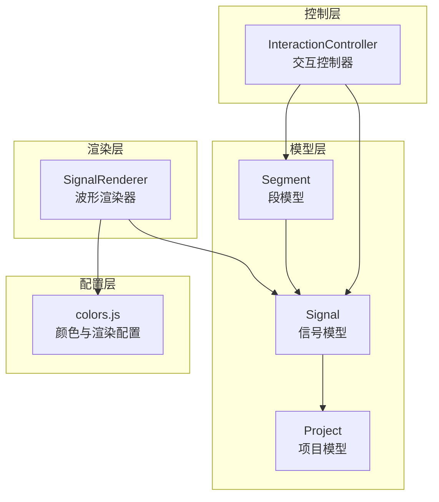
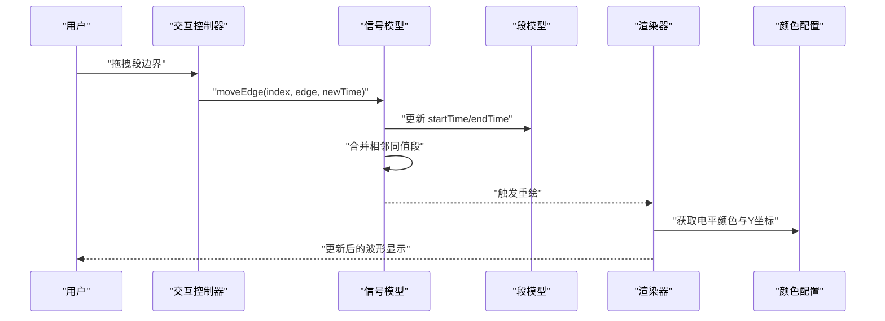
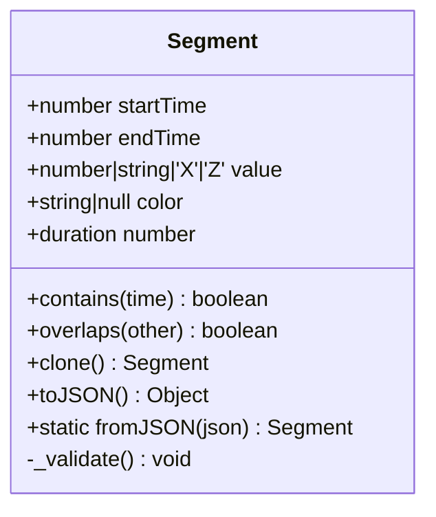
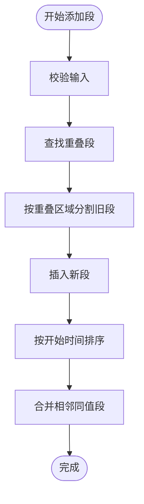
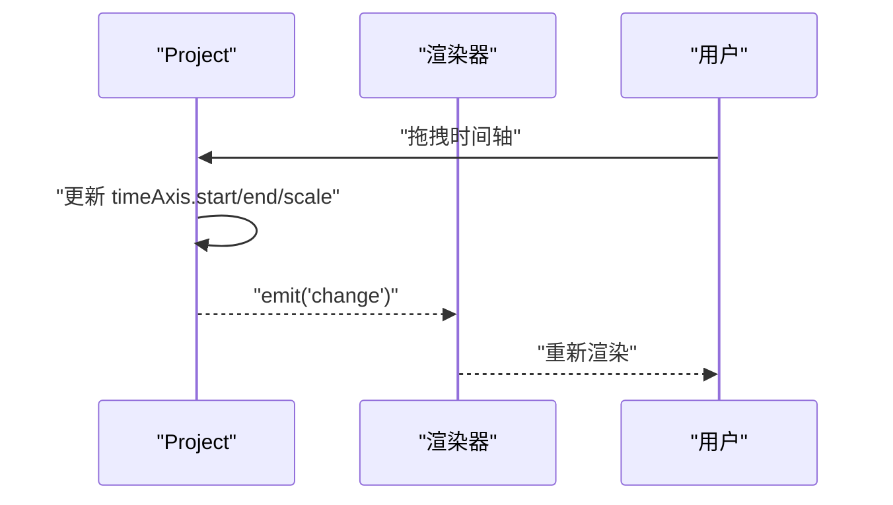
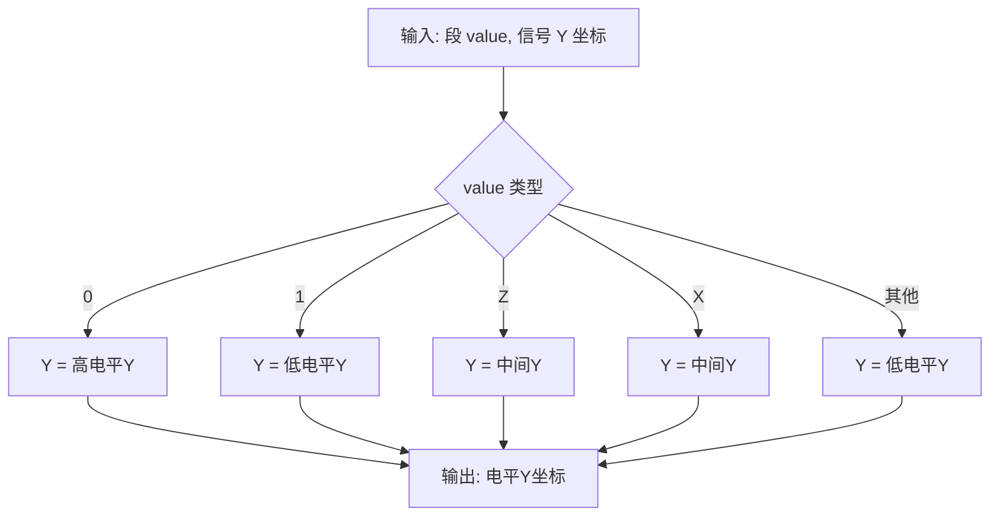
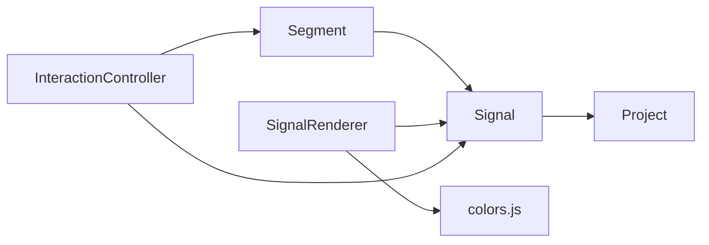

# 段模型 (Segment)

<cite>
**本文引用的文件列表**
- [Segment.js](file://src/models/Segment.js)
- [colors.js](file://src/config/colors.js)
- [Signal.js](file://src/models/Signal.js)
- [Project.js](file://src/models/Project.js)
- [SignalRenderer.js](file://src/renderers/SignalRenderer.js)
- [InteractionController.js](file://src/controllers/InteractionController.js)
- [default-template.json](file://default-template.json)
- [test-runner.html](file://tests/test-runner.html)
</cite>

## 目录
1. [简介](#简介)
2. [项目结构](#项目结构)
3. [核心组件](#核心组件)
4. [架构概览](#架构概览)
5. [详细组件分析](#详细组件分析)
6. [依赖关系分析](#依赖关系分析)
7. [性能考量](#性能考量)
8. [故障排查指南](#故障排查指南)
9. [结论](#结论)
10. [附录](#附录)

## 简介
本文件系统性地解析段模型（Segment）的设计与实现，涵盖其基本属性、时间范围管理、电平状态、颜色配置、几何计算、序列化与反序列化机制，并结合信号（Signal）、项目（Project）及渲染器（SignalRenderer）的协作关系，提供完整的使用示例与最佳实践，帮助开发者高效理解和使用波形编辑器中的段模型。

## 项目结构
段模型位于模型层，与信号模型、项目模型以及渲染层协同工作：
- 模型层：Segment、Signal、Project
- 配置层：颜色与渲染配置
- 渲染层：SignalRenderer
- 控制层：InteractionController（交互与编辑）
- 测试：单元测试验证段与信号行为

图表来源
- [Segment.js:1-94](file://src/models/Segment.js#L1-L94)
- [Signal.js:1-343](file://src/models/Signal.js#L1-L343)
- [Project.js:1-245](file://src/models/Project.js#L1-L245)
- [colors.js:1-83](file://src/config/colors.js#L1-L83)
- [SignalRenderer.js:1-501](file://src/renderers/SignalRenderer.js#L1-L501)
- [InteractionController.js:1-800](file://src/controllers/InteractionController.js#L1-L800)

章节来源
- [Segment.js:1-94](file://src/models/Segment.js#L1-L94)
- [Signal.js:1-343](file://src/models/Signal.js#L1-L343)
- [Project.js:1-245](file://src/models/Project.js#L1-L245)
- [colors.js:1-83](file://src/config/colors.js#L1-L83)
- [SignalRenderer.js:1-501](file://src/renderers/SignalRenderer.js#L1-L501)
- [InteractionController.js:1-800](file://src/controllers/InteractionController.js#L1-L800)

## 核心组件
- 段（Segment）：表示信号在时间轴上的一个电平区间，包含起止时间、电平值与可选颜色。
- 信号（Signal）：包含多个段，负责段的合并、分割、边界移动、吸附等高级操作。
- 项目（Project）：管理时间轴、信号集合与事件系统。
- 渲染器（SignalRenderer）：将段渲染为波形线、跳变沿、X/Z 态等视觉元素。
- 颜色配置（colors.js）：集中管理电平到颜色的映射与渲染参数。

章节来源
- [Segment.js:5-94](file://src/models/Segment.js#L5-L94)
- [Signal.js:7-343](file://src/models/Signal.js#L7-L343)
- [Project.js:8-245](file://src/models/Project.js#L8-L245)
- [colors.js:5-83](file://src/config/colors.js#L5-L83)
- [SignalRenderer.js:6-501](file://src/renderers/SignalRenderer.js#L6-L501)

## 架构概览
段模型通过 Signal 的高级操作实现时间范围的精确管理与重叠处理；通过 Project 的时间轴转换实现坐标系映射；通过 SignalRenderer 将段渲染为可视波形；通过 colors.js 提供颜色与几何参数。

图表来源
- [InteractionController.js:254-337](file://src/controllers/InteractionController.js#L254-L337)
- [Signal.js:255-288](file://src/models/Signal.js#L255-L288)
- [Segment.js:59-66](file://src/models/Segment.js#L59-L66)
- [SignalRenderer.js:201-316](file://src/renderers/SignalRenderer.js#L201-L316)
- [colors.js:58-83](file://src/config/colors.js#L58-L83)

## 详细组件分析

### 段（Segment）设计与实现
- 基本属性
  - startTime：段开始时间（数值）
  - endTime：段结束时间（数值）
  - value：电平值，支持 0、1、'X'、'Z' 与十六进制字符串（如 "0x3F"）
  - color：段级颜色（可选，主要用于总线信号）
- 时间范围管理
  - duration：持续时间 = endTime - startTime
  - contains(time)：判断时间点是否落在段内（左闭右开区间）
  - overlaps(other)：判断两个段是否重叠
  - _validate()：校验 startTime < endTime，否则抛出错误
- 几何表示与颜色
  - 电平到Y坐标的映射由颜色配置提供（高电平、低电平、Z/X 态）
  - 渲染时优先使用段级颜色，其次信号级颜色，最后使用默认电平颜色
- 序列化与反序列化
  - toJSON()：导出 startTime、endTime、value，若存在 color 则一并导出
  - static fromJSON(json)：从 JSON 恢复段实例
- 克隆与独立性
  - clone()：创建独立副本，确保修改不影响原段

图表来源
- [Segment.js:5-94](file://src/models/Segment.js#L5-L94)

章节来源
- [Segment.js:5-94](file://src/models/Segment.js#L5-L94)
- [colors.js:58-83](file://src/config/colors.js#L58-L83)

### 信号（Signal）中的段管理
- 添加段与重叠处理
  - addSegment(segmentData)：自动识别重叠段，分割并插入新段，随后合并相邻同值段并排序
  - _mergeAdjacentSegments()：合并相邻且值与颜色相同的段
- 边界移动与吸附
  - moveEdge(index, edge, newTime)：移动指定段的开始或结束边界，同步更新相邻段边界，删除零长度段并合并
  - snapToEdge(time, threshold)：将时间吸附到最近的跳变沿（边界时间）
- 电平查询与索引
  - getValueAt(time)：返回给定时间点的电平值
  - getSegmentIndexAt(time)：返回时间点所在的段索引
- 时钟信号生成
  - generateClockSegments(endTime)：根据周期、相位与占空比生成时钟段序列
- 序列化与克隆
  - toJSON()/fromJSON()：完整序列化信号及其段
  - clone()：深度复制信号（含段）

图表来源
- [Signal.js:62-133](file://src/models/Signal.js#L62-L133)
- [Signal.js:138-155](file://src/models/Signal.js#L138-L155)

章节来源
- [Signal.js:62-133](file://src/models/Signal.js#L62-L133)
- [Signal.js:138-155](file://src/models/Signal.js#L138-L155)
- [Signal.js:158-166](file://src/models/Signal.js#L158-L166)
- [Signal.js:168-194](file://src/models/Signal.js#L168-L194)
- [Signal.js:196-220](file://src/models/Signal.js#L196-L220)
- [Signal.js:222-252](file://src/models/Signal.js#L222-L252)
- [Signal.js:255-288](file://src/models/Signal.js#L255-L288)
- [Signal.js:294-306](file://src/models/Signal.js#L294-L306)
- [Signal.js:312-342](file://src/models/Signal.js#L312-L342)

### 项目（Project）与坐标转换
- 时间轴配置与转换
  - timeToX(time)：时间转 X 坐标
  - xToTime(x)：X 坐标转时间
  - setTimeRange(start, end)/setTimeScale(scale)：设置时间轴范围与缩放
- 事件系统
  - on/off/emit：注册与触发 change 事件，通知渲染器与 UI 更新

图表来源
- [Project.js:131-170](file://src/models/Project.js#L131-L170)
- [Project.js:177-202](file://src/models/Project.js#L177-L202)

章节来源
- [Project.js:131-170](file://src/models/Project.js#L131-L170)
- [Project.js:177-202](file://src/models/Project.js#L177-L202)

### 渲染器（SignalRenderer）与几何计算
- 电平到 Y 坐标映射
  - getLevelY(value, signalY)：根据 RENDER_CONFIG 计算高电平、低电平、Z/X 态的 Y 坐标
- 颜色策略
  - getLevelColor(value)：返回电平对应的颜色
  - 渲染时优先使用段级颜色，其次信号级颜色，最后使用默认电平颜色
- 波形渲染
  - 普通信号：水平线段 + 垂直线跳变沿
  - 总线信号：双线边框 + 可选填充与 X 态斜线填充
  - X/Z 态：特殊图形与标识
- 边界节点与交互
  - _renderEdgeNodes()：渲染可拖拽的边界节点，支持精确编辑

图表来源
- [colors.js:58-69](file://src/config/colors.js#L58-L69)
- [SignalRenderer.js:201-316](file://src/renderers/SignalRenderer.js#L201-L316)

章节来源
- [colors.js:58-83](file://src/config/colors.js#L58-L83)
- [SignalRenderer.js:201-316](file://src/renderers/SignalRenderer.js#L201-L316)

### 颜色配置系统
- 电平颜色映射
  - 0/1：normal（黑色）
  - 'Z'：highZ（深黄色）
  - 'X'：unknown（红色）
  - 总线字符串：bus（黑色）
- 渲染参数
  - RENDER_CONFIG：信号高度、跳变沿宽度、总线双线间距等
- 交互颜色
  - selection、hover、active：用于选择与悬停高亮

章节来源
- [colors.js:5-83](file://src/config/colors.js#L5-L83)

### 序列化与反序列化机制
- 段
  - toJSON()：导出 { startTime, endTime, value, color? }
  - static fromJSON(json)：恢复段实例
- 信号
  - toJSON()：导出 { id, name, type, color?, segments[], clockConfig?, gaps[] }
  - static fromJSON(json)：恢复信号实例
- 项目
  - toJSON()：导出 { signals[], arrows[], timeAxis, ... }
  - static fromJSON(json)：恢复项目实例
- 版本兼容性
  - 通过可选字段与默认值保证向前兼容（如 color 不存在时为 null）

章节来源
- [Segment.js:72-93](file://src/models/Segment.js#L72-L93)
- [Signal.js:312-342](file://src/models/Signal.js#L312-L342)
- [Project.js:208-244](file://src/models/Project.js#L208-L244)

### 使用示例与最佳实践
- 创建段
  - 使用构造函数传入 { startTime, endTime, value, color? }
  - 示例参考：[default-template.json:14-144](file://default-template.json#L14-L144)
- 查询与编辑
  - getValueAt(time)：获取时间点电平
  - getSegmentIndexAt(time)：定位段索引
  - moveEdge(index, 'start'|'end', newTime)：移动边界
  - setValueAt(start, end, value, color?)：批量设置时间范围内的电平
- 渲染与交互
  - 通过 SignalRenderer 渲染波形，X/Z 态与总线信号具有特殊样式
  - 通过 InteractionController 实现边界拖拽与吸附
- 序列化与加载
  - 使用 Signal.fromJSON()/Project.fromJSON() 加载模板或保存的数据
  - 使用 Signal.toJSON()/Project.toJSON() 导出项目

章节来源
- [Signal.js:168-194](file://src/models/Signal.js#L168-L194)
- [Signal.js:255-288](file://src/models/Signal.js#L255-L288)
- [Signal.js:158-166](file://src/models/Signal.js#L158-L166)
- [SignalRenderer.js:201-316](file://src/renderers/SignalRenderer.js#L201-L316)
- [InteractionController.js:465-567](file://src/controllers/InteractionController.js#L465-L567)
- [default-template.json:14-144](file://default-template.json#L14-L144)

## 依赖关系分析
- Segment 依赖于 Signal 的边界合并与分割逻辑
- Signal 依赖于 Project 的时间轴转换与事件系统
- SignalRenderer 依赖于 colors.js 的颜色与几何参数
- InteractionController 依赖于 Signal 的边界移动与吸附能力

图表来源
- [Segment.js:5-94](file://src/models/Segment.js#L5-L94)
- [Signal.js:7-343](file://src/models/Signal.js#L7-L343)
- [Project.js:8-245](file://src/models/Project.js#L8-L245)
- [colors.js:1-83](file://src/config/colors.js#L1-L83)
- [SignalRenderer.js:1-501](file://src/renderers/SignalRenderer.js#L1-L501)
- [InteractionController.js:1-800](file://src/controllers/InteractionController.js#L1-L800)

章节来源
- [Segment.js:5-94](file://src/models/Segment.js#L5-L94)
- [Signal.js:7-343](file://src/models/Signal.js#L7-L343)
- [Project.js:8-245](file://src/models/Project.js#L8-L245)
- [colors.js:1-83](file://src/config/colors.js#L1-L83)
- [SignalRenderer.js:1-501](file://src/renderers/SignalRenderer.js#L1-L501)
- [InteractionController.js:1-800](file://src/controllers/InteractionController.js#L1-L800)

## 性能考量
- 时间复杂度
  - addSegment()：查找重叠段 O(n)，分割与合并 O(n)，整体 O(n^2) 在最坏情况下
  - moveEdge()：更新相邻段边界 O(1)，合并 O(n)
  - getValueAt()：线性扫描 O(n)
- 优化建议
  - 对大段集使用二分查找或区间树优化查询
  - 合并阶段尽量批量执行，减少多次重排
  - 渲染时按需更新，避免全量重绘

## 故障排查指南
- 常见错误
  - startTime >= endTime：构造函数会抛出错误，检查时间参数顺序
  - 重叠段未正确分割：确认 addSegment() 是否被调用，以及边界是否正确吸附
  - 边界移动无效：检查 moveEdge() 参数与索引是否越界
- 调试技巧
  - 使用测试用例验证行为：参见 [test-runner.html](file://tests/test-runner.html)
  - 逐步断点：在 addSegment()、moveEdge()、getValueAt() 关键路径设置断点
  - 日志输出：Signal.addSegment() 中包含调试日志，便于观察合并过程

章节来源
- [Segment.js:24-28](file://src/models/Segment.js#L24-L28)
- [Signal.js:62-133](file://src/models/Signal.js#L62-L133)
- [Signal.js:255-288](file://src/models/Signal.js#L255-L288)
- [test-runner.html:57-137](file://tests/test-runner.html#L57-L137)

## 结论
段模型（Segment）以简洁的属性与严格的边界管理为核心，配合信号模型的重叠处理与边界移动能力，实现了对波形段的精确编辑与渲染。通过颜色配置与渲染器的解耦设计，段模型既支持标准电平（0/1），也支持高阻态（Z）与不定态（X），并通过总线信号的特殊渲染满足复杂数据总线场景。序列化与事件系统进一步保障了数据持久化与界面响应的一致性。

## 附录
- 单元测试覆盖要点
  - 段：默认值、duration、contains、clone、toJSON/fromJSON、重叠检测、Z/X 值、十六进制值
  - 信号：时钟生成、合并、setValueAt、getValueAt、索引查询、边界移动
  - 项目：事件系统、时间轴转换、序列化
- 模板示例
  - 参考 [default-template.json](file://default-template.json) 中的信号段定义

章节来源
- [test-runner.html:57-303](file://tests/test-runner.html#L57-L303)
- [default-template.json:14-144](file://default-template.json#L14-L144)