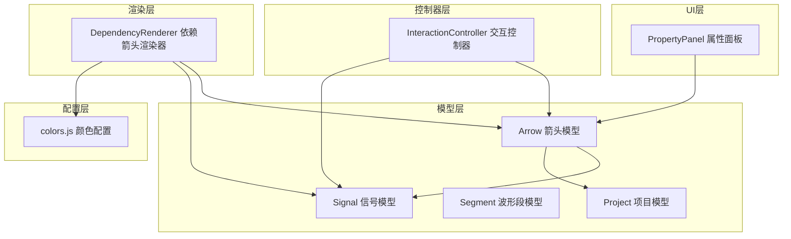
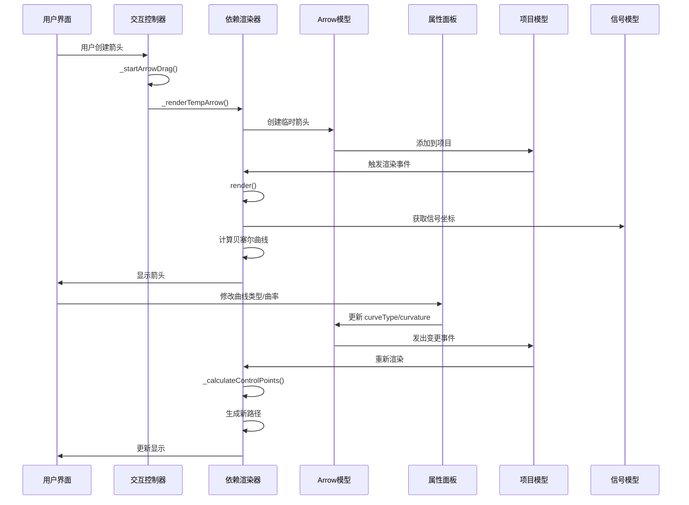
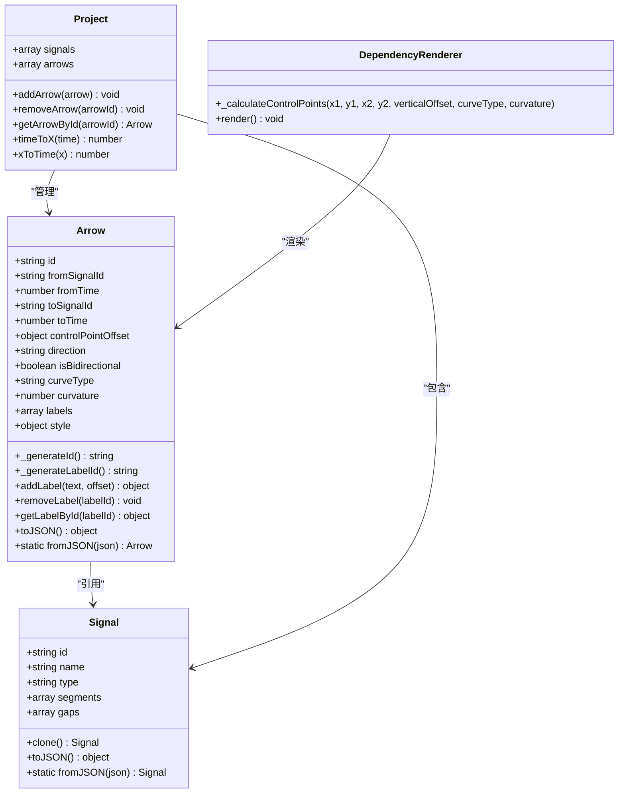
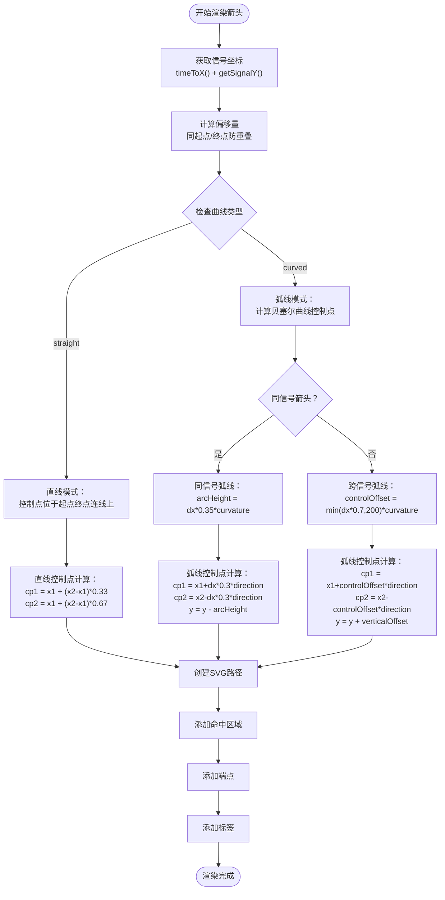
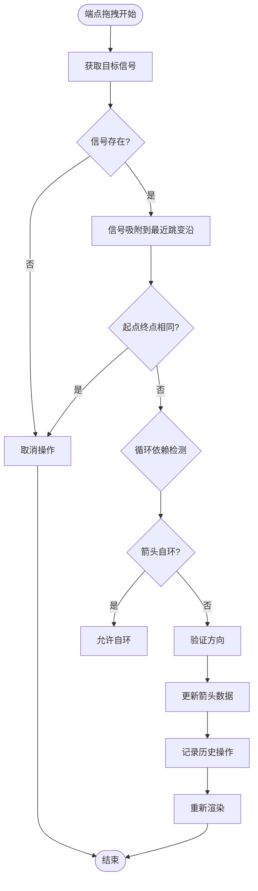
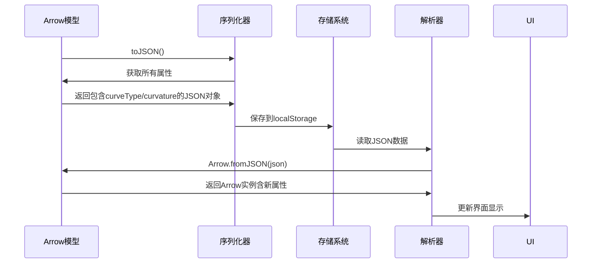
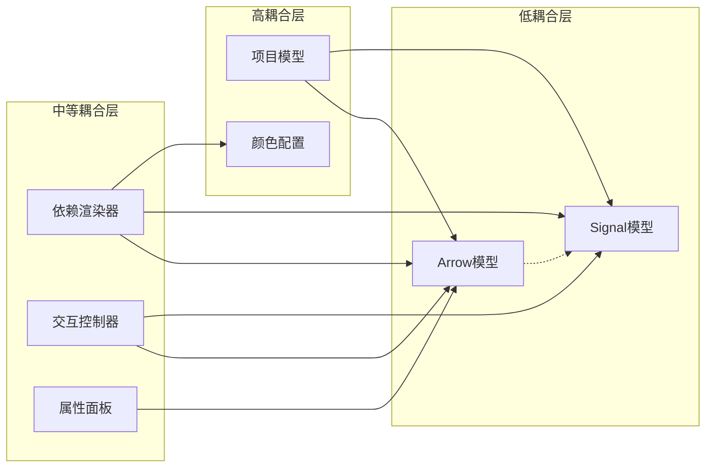
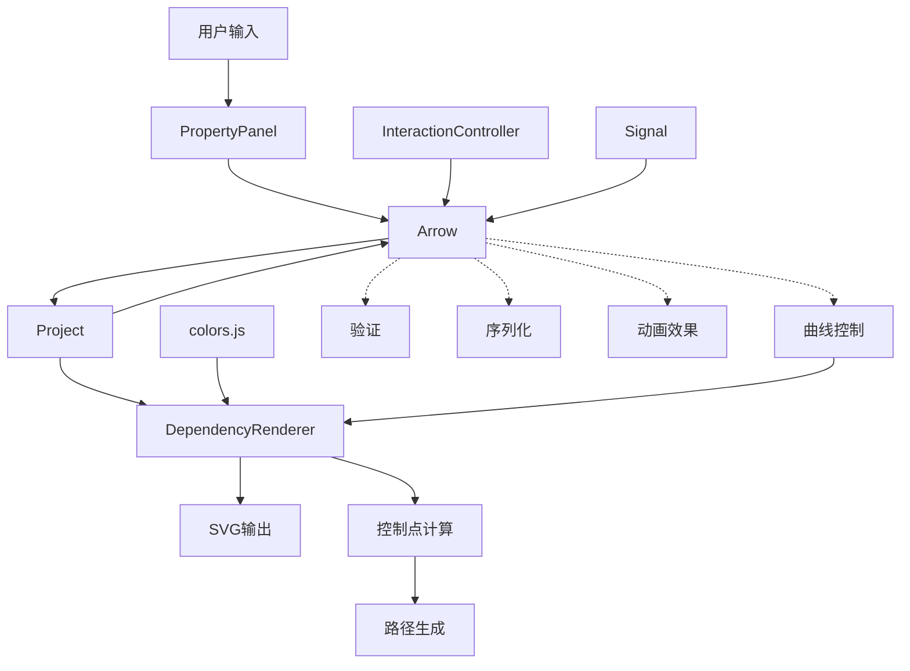

# 箭头模型 (Arrow)

<cite>
**本文档引用的文件**
- [src/models/Arrow.js](file://src/models/Arrow.js)
- [src/models/Signal.js](file://src/models/Signal.js)
- [src/models/Segment.js](file://src/models/Segment.js)
- [src/models/Project.js](file://src/models/Project.js)
- [src/renderers/DependencyRenderer.js](file://src/renderers/DependencyRenderer.js)
- [src/controllers/InteractionController.js](file://src/controllers/InteractionController.js)
- [src/ui/PropertyPanel.js](file://src/ui/PropertyPanel.js)
- [src/config/colors.js](file://src/config/colors.js)
</cite>

## 更新摘要
**变更内容**
- 新增箭头曲线类型和曲率控制功能
- 更新几何计算算法以支持直线和弧线模式
- 增强用户界面的可视化控制
- 完善 JSON 序列化支持

## 目录
1. [简介](#简介)
2. [项目结构](#项目结构)
3. [核心组件](#核心组件)
4. [架构概览](#架构概览)
5. [详细组件分析](#详细组件分析)
6. [依赖关系分析](#依赖关系分析)
7. [性能考虑](#性能考虑)
8. [故障排除指南](#故障排除指南)
9. [结论](#结论)
10. [附录](#附录)

## 简介
Arrow 类是波形编辑器中的核心依赖关系模型，用于表示信号之间的依赖关系。该模型实现了完整的箭头生命周期管理，包括创建、编辑、渲染和序列化等功能。**最新更新**增加了曲线类型和曲率控制功能，为用户提供更灵活的箭头样式定制能力。

## 项目结构
波形编辑器采用模块化架构，Arrow 模型位于 models 目录中，与其他核心组件协同工作：



**图表来源**
- [src/models/Arrow.js:1-122](file://src/models/Arrow.js#L1-L122)
- [src/models/Signal.js:1-343](file://src/models/Signal.js#L1-L343)
- [src/models/Project.js:1-245](file://src/models/Project.js#L1-L245)
- [src/renderers/DependencyRenderer.js:1-305](file://src/renderers/DependencyRenderer.js#L1-L305)
- [src/controllers/InteractionController.js:1-1579](file://src/controllers/InteractionController.js#L1-L1579)
- [src/ui/PropertyPanel.js:1-583](file://src/ui/PropertyPanel.js#L1-L583)
- [src/config/colors.js:1-83](file://src/config/colors.js#L1-L83)

**章节来源**
- [src/models/Arrow.js:1-122](file://src/models/Arrow.js#L1-L122)
- [src/models/Signal.js:1-343](file://src/models/Signal.js#L1-L343)
- [src/models/Project.js:1-245](file://src/models/Project.js#L1-L245)

## 核心组件
Arrow 类是依赖关系的核心数据结构，具有以下关键特性：

### 基本属性设计
- **唯一标识符**: 自动生成的唯一 ID，确保每个箭头实例的唯一性
- **信号引用**: fromSignalId 和 toSignalId 引用源信号和目标信号
- **时间定位**: fromTime 和 toTime 精确定义箭头在时间轴上的位置
- **几何控制**: controlPointOffset 控制贝塞尔曲线的控制点偏移
- **方向控制**: direction 属性支持自动、正向和反向三种模式
- **双向支持**: isBidirectional 属性启用双向箭头显示
- **曲线类型**: curveType 属性支持 'curved'（弧线）和 'straight'（直线）两种模式
- **曲率控制**: curvature 属性控制曲线弯曲程度，范围 0.2-3.0，默认 1.0

### 标签系统
Arrow 类支持多标签标注系统：
- **标签数组**: labels 数组存储多个文本标注
- **标签结构**: 每个标签包含 id、text 和 offset 属性
- **兼容性**: 支持旧版 text 和 textOffset 属性的向后兼容
- **动态管理**: 提供 addLabel、removeLabel 和 getLabelById 方法

### 样式配置
样式系统提供了丰富的视觉定制选项：
- **颜色配置**: stroke 属性控制箭头主色调
- **线宽设置**: strokeWidth 控制线条粗细
- **箭头大小**: markerSize 控制箭头末端标记尺寸
- **虚线模式**: dashArray 支持虚线和点划线效果

**章节来源**
- [src/models/Arrow.js:5-45](file://src/models/Arrow.js#L5-L45)
- [src/models/Arrow.js:78-94](file://src/models/Arrow.js#L78-L94)
- [src/models/Arrow.js:39-44](file://src/models/Arrow.js#L39-L44)

## 架构概览
Arrow 模型在整个系统中的作用和交互关系如下：



**图表来源**
- [src/controllers/InteractionController.js:572-756](file://src/controllers/InteractionController.js#L572-L756)
- [src/renderers/DependencyRenderer.js:18-84](file://src/renderers/DependencyRenderer.js#L18-L84)
- [src/models/Project.js:86-110](file://src/models/Project.js#L86-L110)
- [src/ui/PropertyPanel.js:403-417](file://src/ui/PropertyPanel.js#L403-L417)

## 详细组件分析

### Arrow 类设计分析



**图表来源**
- [src/models/Arrow.js:5-122](file://src/models/Arrow.js#L5-L122)
- [src/models/Signal.js:7-343](file://src/models/Signal.js#L7-L343)
- [src/models/Project.js:8-245](file://src/models/Project.js#L8-L245)
- [src/renderers/DependencyRenderer.js:276-305](file://src/renderers/DependencyRenderer.js#L276-L305)

### 几何计算算法

依赖渲染器实现了复杂的几何计算算法来生成平滑的箭头路径，**新增了曲线类型和曲率控制功能**：



**图表来源**
- [src/renderers/DependencyRenderer.js:93-130](file://src/renderers/DependencyRenderer.js#L93-L130)
- [src/renderers/DependencyRenderer.js:276-305](file://src/renderers/DependencyRenderer.js#L276-L305)
- [src/renderers/DependencyRenderer.js:281-305](file://src/renderers/DependencyRenderer.js#L281-L305)

### 箭头端点验证机制

交互控制器实现了严格的端点验证和循环依赖检测：



**图表来源**
- [src/controllers/InteractionController.js:625-854](file://src/controllers/InteractionController.js#L625-L854)

### 样式配置系统

Arrow 类支持灵活的样式配置，通过 style 对象统一管理视觉属性：

| 样式属性 | 默认值 | 描述 | 使用场景 |
|---------|--------|------|----------|
| stroke | '#0078D7' | 箭头主色调 | 主要颜色设置 |
| strokeWidth | 1.5 | 线条粗细 | 线宽调节 |
| markerSize | 4 | 箭头末端标记大小 | 箭头尺寸控制 |
| dashArray | '' | 虚线模式 | 特殊样式需求 |

**新增曲线控制属性**
| 曲线属性 | 默认值 | 范围 | 描述 |
|---------|--------|------|------|
| curveType | 'curved' | 'curved' \| 'straight' | 曲线类型选择 |
| curvature | 1.0 | 0.2-3.0 | 曲线弯曲程度控制 |

**章节来源**
- [src/models/Arrow.js:39-44](file://src/models/Arrow.js#L39-L44)
- [src/config/colors.js:42-50](file://src/config/colors.js#L42-L50)

### 序列化和反序列化实现

Arrow 类实现了完整的数据持久化机制，**新增了曲线类型和曲率属性的序列化支持**：



**新增序列化字段**
- `curveType`: 曲线类型（'curved' 或 'straight'）
- `curvature`: 曲率值（数值类型）

**图表来源**
- [src/models/Arrow.js:102-122](file://src/models/Arrow.js#L102-L122)
- [src/models/Project.js:208-245](file://src/models/Project.js#L208-L245)

**章节来源**
- [src/models/Arrow.js:102-122](file://src/models/Arrow.js#L102-L122)
- [src/models/Project.js:208-245](file://src/models/Project.js#L208-L245)

## 依赖关系分析

### 组件耦合度分析



**图表来源**
- [src/models/Arrow.js:1-122](file://src/models/Arrow.js#L1-L122)
- [src/renderers/DependencyRenderer.js:1-305](file://src/renderers/DependencyRenderer.js#L1-L305)
- [src/controllers/InteractionController.js:1-1579](file://src/controllers/InteractionController.js#L1-L1579)
- [src/models/Project.js:1-245](file://src/models/Project.js#L1-L245)

### 数据流分析

Arrow 模型的数据流遵循单向依赖原则，**新增了曲线控制的数据流**：



**图表来源**
- [src/controllers/InteractionController.js:84-184](file://src/controllers/InteractionController.js#L84-L184)
- [src/renderers/DependencyRenderer.js:18-84](file://src/renderers/DependencyRenderer.js#L18-L84)
- [src/ui/PropertyPanel.js:403-417](file://src/ui/PropertyPanel.js#L403-L417)

**章节来源**
- [src/models/Arrow.js:1-122](file://src/models/Arrow.js#L1-L122)
- [src/renderers/DependencyRenderer.js:1-305](file://src/renderers/DependencyRenderer.js#L1-L305)
- [src/controllers/InteractionController.js:1-1579](file://src/controllers/InteractionController.js#L1-L1579)

## 性能考虑

### 渲染优化策略

依赖渲染器采用了多种性能优化技术，**新增了曲线类型的条件渲染优化**：

1. **分组渲染**: 按起点和终点信号分组，减少重复计算
2. **偏移量缓存**: 预计算同组箭头的偏移量，避免重复计算
3. **条件渲染**: 自连接箭头特殊处理，提高渲染效率
4. **曲线类型优化**: 直线模式使用简化计算，弧线模式使用缓存机制
5. **命中区域优化**: 透明命中区域与可见箭头分离，减少重绘

### 内存管理

- **对象池模式**: 临时箭头和预览元素及时清理
- **事件监听**: 合理的事件绑定和解绑，防止内存泄漏
- **数据结构**: 使用 Map 和数组进行高效查找和遍历
- **曲线参数缓存**: 控制点计算结果缓存，避免重复计算

## 故障排除指南

### 常见问题诊断

#### 箭头创建失败
**症状**: Alt+拖拽无法创建箭头
**排查步骤**:
1. 检查目标信号是否存在
2. 验证时间坐标是否有效
3. 确认信号吸附功能正常

#### 箭头编辑异常
**症状**: 箭头端点拖拽无效或出现循环依赖
**排查步骤**:
1. 检查信号引用有效性
2. 验证时间顺序逻辑
3. 确认循环依赖检测机制

#### 渲染显示问题
**症状**: 箭头路径扭曲或标签位置错误
**排查步骤**:
1. 验证控制点计算公式
2. 检查坐标转换函数
3. 确认 SVG 路径生成逻辑
4. **新增**: 验证曲线类型和曲率参数的有效性

#### 曲线控制异常
**症状**: 曲线类型切换无效或曲率调整无响应
**排查步骤**:
1. 检查属性面板事件绑定
2. 验证 curveType 和 curvature 属性更新
3. 确认渲染器重新计算控制点
4. 验证 UI 控件的显示/隐藏逻辑

**章节来源**
- [src/controllers/InteractionController.js:800-854](file://src/controllers/InteractionController.js#L800-L854)
- [src/renderers/DependencyRenderer.js:276-305](file://src/renderers/DependencyRenderer.js#L276-L305)
- [src/ui/PropertyPanel.js:403-417](file://src/ui/PropertyPanel.js#L403-L417)

## 结论

Arrow 类作为波形编辑器的核心依赖关系模型，展现了优秀的软件工程实践，**最新更新进一步增强了其灵活性和用户体验**：

### 设计优势
- **模块化设计**: 清晰的职责分离和接口定义
- **扩展性**: 支持多标签、双向箭头等高级特性
- **曲线控制**: 新增的曲线类型和曲率控制功能
- **性能优化**: 有效的渲染和内存管理策略
- **用户体验**: 直观的交互和编辑功能

### 技术亮点
- **几何算法**: 基于贝塞尔曲线的平滑路径生成，支持直线和弧线模式
- **验证机制**: 完善的信号引用和循环依赖检测
- **样式系统**: 灵活的视觉定制能力，包括曲线控制
- **序列化**: 标准化的数据持久化方案，包含新属性
- **实时控制**: 用户界面提供即时的曲线参数调整反馈

### 最佳实践建议
1. **严格的数据验证**: 在创建和编辑过程中始终验证信号引用
2. **合理的样式配置**: 根据使用场景选择合适的箭头样式和曲线类型
3. **性能监控**: 定期检查渲染性能和内存使用情况
4. **用户反馈**: 提供清晰的视觉反馈和错误提示
5. **曲线参数调优**: 根据箭头长度和布局合理设置曲率值

## 附录

### 使用示例

#### 创建箭头
```javascript
// 基础箭头创建
const arrow = new Arrow({
  fromSignalId: 'signal1',
  fromTime: 10,
  toSignalId: 'signal2', 
  toTime: 50,
  isBidirectional: true
});

// 创建直线箭头
const straightArrow = new Arrow({
  fromSignalId: 'signal1',
  fromTime: 10,
  toSignalId: 'signal2',
  toTime: 50,
  curveType: 'straight'
});

// 创建高曲率弧线箭头
const curvedArrow = new Arrow({
  fromSignalId: 'signal1',
  fromTime: 10,
  toSignalId: 'signal2',
  toTime: 50,
  curveType: 'curved',
  curvature: 2.0
});
```

#### 编辑箭头
```javascript
// 移动端点
arrow.fromTime = 15;
arrow.toSignalId = 'signal3';

// 修改曲线类型
arrow.curveType = 'straight'; // 或 'curved'

// 调整曲率
arrow.curvature = 1.5; // 0.2-3.0 范围内

// 修改样式
arrow.style.stroke = '#FF0000';
arrow.style.dashArray = '5,5';
```

#### 删除箭头
```javascript
// 通过项目模型删除
project.removeArrow(arrowId);

// 或通过交互控制器删除
interactionController._deleteSelectedArrow();
```

### 实际应用场景

1. **时序依赖分析**: 显示信号之间的时序关系，使用弧线箭头表示复杂依赖
2. **状态机建模**: 表达状态转换和条件依赖，使用直线箭头表示简单转换
3. **协议分析**: 展示通信协议的消息传递关系，根据消息类型选择合适的曲线样式
4. **系统架构**: 描述模块间的依赖关系，使用不同曲率区分依赖强度
5. **数据流建模**: 表示数据处理流程，使用直线箭头表示同步处理，弧线箭头表示异步处理

### 版本兼容性

Arrow 类支持向后兼容的旧版属性：
- `text` 和 `textOffset` 属性映射到 `labels[0]`
- **新增**: `curveType` 和 `curvature` 属性提供新的曲线控制功能
- 保持与现有代码的无缝集成
- 渐进式迁移策略，不影响现有功能
- 新属性具有合理的默认值，确保向后兼容

### 曲线控制最佳实践

1. **直线箭头适用场景**:
   - 简单的直接依赖关系
   - 时间顺序明确的线性流程
   - 需要清晰视觉引导的场景

2. **弧线箭头适用场景**:
   - 复杂的多信号依赖关系
   - 需要避免路径交叉的布局
   - 表示间接或条件依赖关系

3. **曲率参数选择**:
   - 短距离箭头: 使用较低曲率 (0.5-1.0)
   - 中等距离箭头: 使用标准曲率 (1.0-1.5)
   - 长距离箭头: 使用较高曲率 (1.5-2.0)
   - 特殊强调: 使用最大曲率 (2.0-3.0)