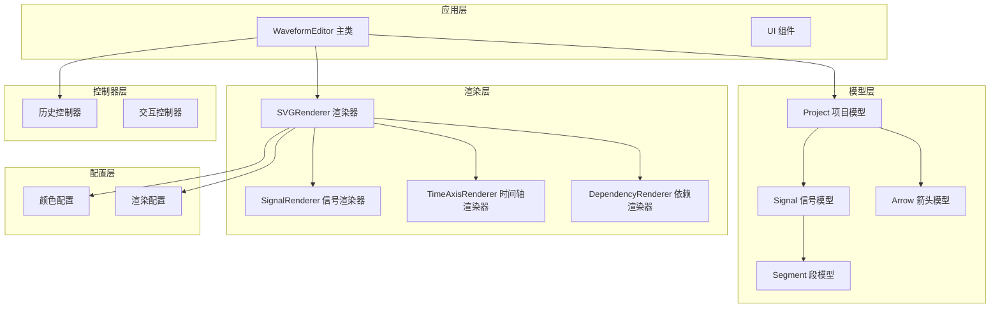
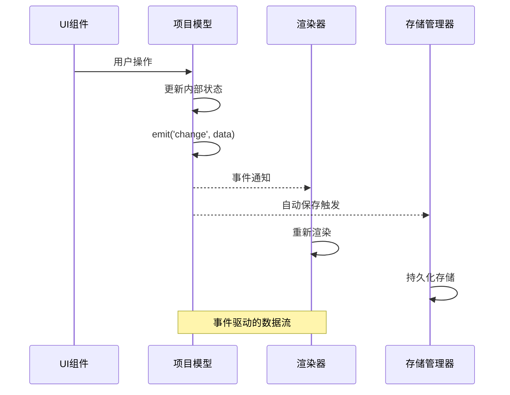
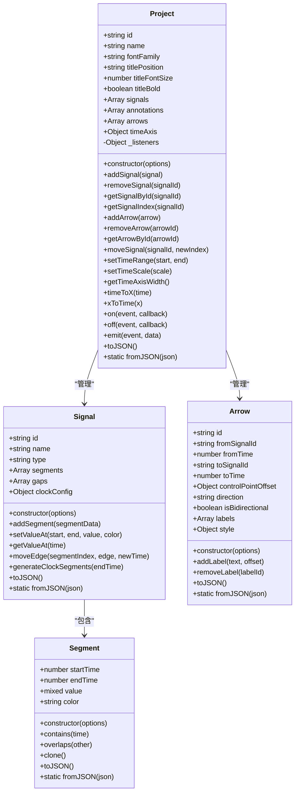
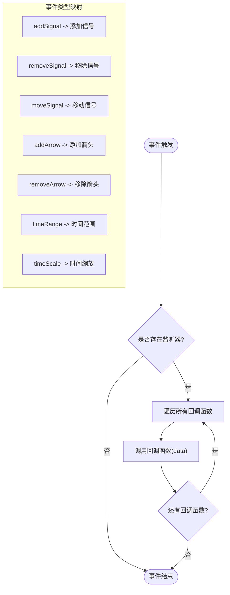
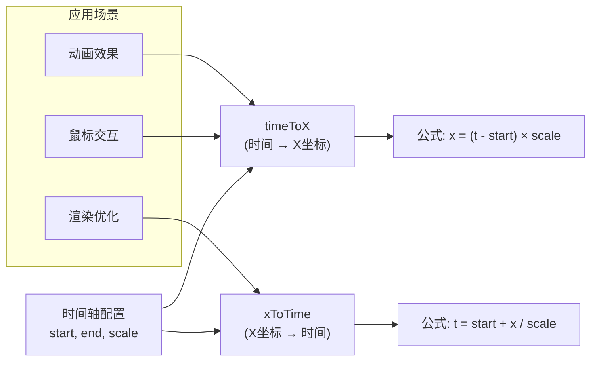
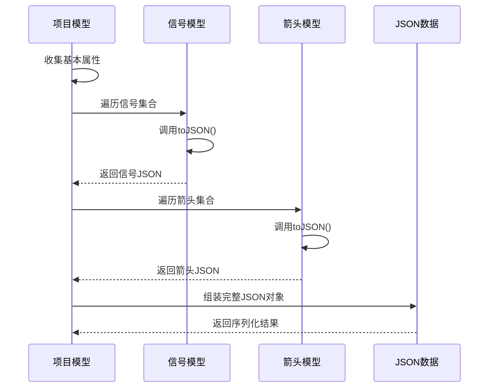
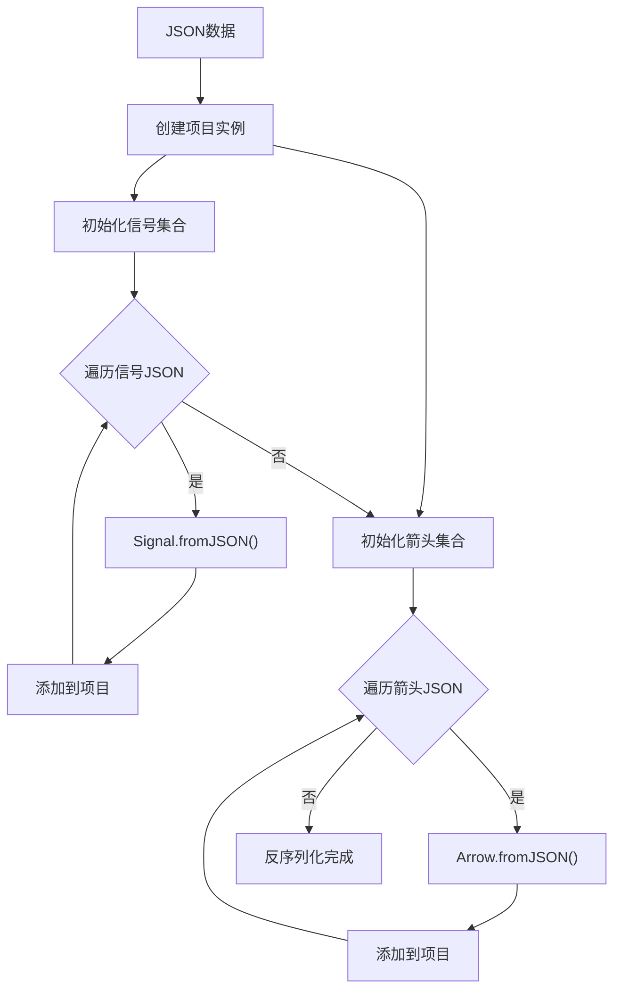
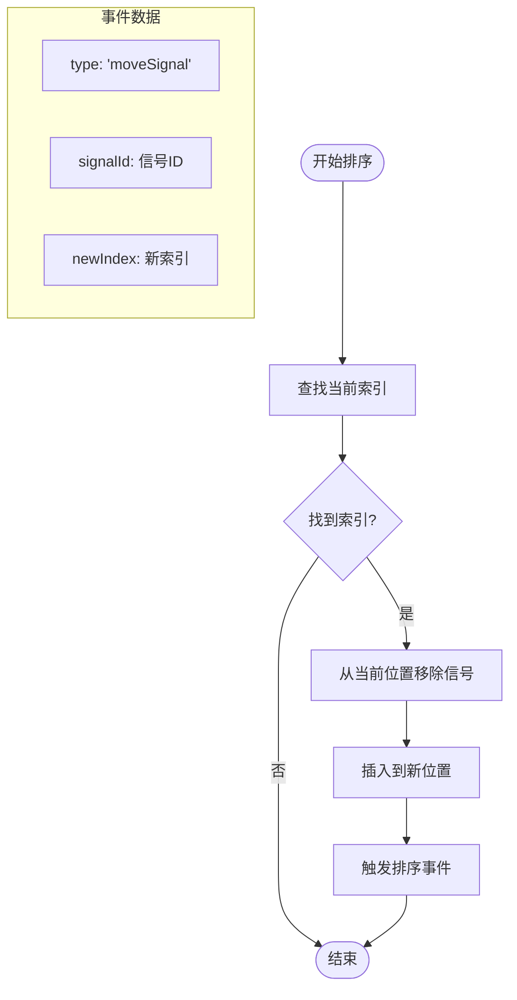
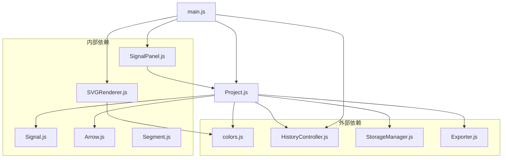

# 项目模型 (Project)

<cite>
**本文档引用的文件**
- [Project.js](file://src/models/Project.js)
- [Signal.js](file://src/models/Signal.js)
- [Arrow.js](file://src/models/Arrow.js)
- [Segment.js](file://src/models/Segment.js)
- [colors.js](file://src/config/colors.js)
- [HistoryController.js](file://src/controllers/HistoryController.js)
- [main.js](file://src/main.js)
- [SignalPanel.js](file://src/ui/SignalPanel.js)
- [SVGRenderer.js](file://src/renderers/SVGRenderer.js)
- [test-runner.html](file://tests/test-runner.html)
</cite>

## 目录
1. [简介](#简介)
2. [项目结构](#项目结构)
3. [核心组件](#核心组件)
4. [架构概览](#架构概览)
5. [详细组件分析](#详细组件分析)
6. [依赖分析](#依赖分析)
7. [性能考虑](#性能考虑)
8. [故障排除指南](#故障排除指南)
9. [结论](#结论)
10. [附录](#附录)

## 简介
项目模型（Project）是波形图编辑器的核心数据结构，负责管理整个波形图项目的状态、信号集合、依赖箭头以及时间轴配置。它提供了完整的事件系统、序列化/反序列化机制，并与渲染器、控制器和UI组件紧密协作。

## 项目结构
波形图编辑器采用模块化的架构设计，主要包含以下层次：



**图表来源**
- [main.js:21-44](file://src/main.js#L21-L44)
- [Project.js:8-34](file://src/models/Project.js#L8-L34)

**章节来源**
- [main.js:1-819](file://src/main.js#L1-L819)
- [Project.js:1-245](file://src/models/Project.js#L1-L245)

## 核心组件
项目模型包含以下核心功能模块：

### 基本属性管理
- **标识符管理**：自动生成唯一ID，确保项目和实体的唯一性
- **项目元数据**：名称、字体设置、标题位置和样式
- **时间轴配置**：单位、缩放比例、起始和结束时间
- **集合管理**：信号列表、注释、箭头列表

### 信号管理系统
- **信号增删改查**：添加信号、移除信号、按ID查找信号
- **信号排序**：支持拖拽排序和程序化移动
- **信号索引**：快速定位信号在列表中的位置

### 箭头管理系统
- **依赖箭头管理**：添加、移除、查找依赖箭头
- **箭头属性**：方向控制、双向箭头、标签系统
- **样式配置**：颜色、线宽、箭头大小、虚线模式

### 时间轴控制系统
- **范围设置**：动态调整时间轴起止时间
- **缩放控制**：像素/单位时间的比例设置
- **坐标转换**：时间与屏幕坐标的双向转换

**章节来源**
- [Project.js:15-34](file://src/models/Project.js#L15-L34)
- [Project.js:47-124](file://src/models/Project.js#L47-L124)
- [Project.js:86-110](file://src/models/Project.js#L86-L110)
- [Project.js:131-170](file://src/models/Project.js#L131-L170)

## 架构概览
项目模型采用事件驱动的设计模式，通过观察者模式实现组件间的松耦合通信：



**图表来源**
- [Project.js:177-202](file://src/models/Project.js#L177-L202)
- [main.js:230-241](file://src/main.js#L230-L241)

**章节来源**
- [Project.js:177-202](file://src/models/Project.js#L177-L202)
- [main.js:212-241](file://src/main.js#L212-L241)

## 详细组件分析

### 项目模型类结构
项目模型采用ES6类语法实现，具有清晰的职责分离和良好的封装性：



**图表来源**
- [Project.js:8-34](file://src/models/Project.js#L8-L34)
- [Signal.js:7-29](file://src/models/Signal.js#L7-L29)
- [Arrow.js:5-45](file://src/models/Arrow.js#L5-L45)
- [Segment.js:5-19](file://src/models/Segment.js#L5-L19)

**章节来源**
- [Project.js:8-245](file://src/models/Project.js#L8-L245)
- [Signal.js:7-343](file://src/models/Signal.js#L7-L343)
- [Arrow.js:5-114](file://src/models/Arrow.js#L5-L114)
- [Segment.js:5-94](file://src/models/Segment.js#L5-L94)

### 事件系统实现
项目模型实现了完整的事件系统，支持多种事件类型：

#### 事件类型定义
- **addSignal**：添加信号时触发
- **removeSignal**：移除信号时触发  
- **moveSignal**：信号排序变更时触发
- **addArrow**：添加箭头时触发
- **removeArrow**：移除箭头时触发
- **timeRange**：时间轴范围变更时触发
- **timeScale**：时间轴缩放变更时触发
- **change**：通用变更事件

#### 事件处理流程


**图表来源**
- [Project.js:177-202](file://src/models/Project.js#L177-L202)

**章节来源**
- [Project.js:177-202](file://src/models/Project.js#L177-L202)
- [test-runner.html:267-282](file://tests/test-runner.html#L267-L282)

### 时间轴转换机制
项目模型提供了精确的时间轴转换方法，支持时间与屏幕坐标的双向转换：

#### 数学原理
- **时间转X坐标**：`x = (time - startTime) × scale`
- **X坐标转时间**：`time = startTime + x / scale`

#### 应用场景
- **用户交互**：鼠标点击转换为时间戳
- **渲染优化**：屏幕坐标转换为时间范围
- **动画效果**：平滑的时间轴滚动



**图表来源**
- [Project.js:159-170](file://src/models/Project.js#L159-L170)

**章节来源**
- [Project.js:159-170](file://src/models/Project.js#L159-L170)
- [test-runner.html:284-288](file://tests/test-runner.html#L284-L288)

### 序列化和反序列化机制
项目模型实现了完整的JSON序列化支持，确保数据的持久化和传输：

#### 序列化流程


**图表来源**
- [Project.js:208-221](file://src/models/Project.js#L208-L221)
- [Signal.js:312-322](file://src/models/Signal.js#L312-L322)
- [Arrow.js:96-109](file://src/models/Arrow.js#L96-L109)

#### 反序列化流程


**图表来源**
- [Project.js:228-244](file://src/models/Project.js#L228-L244)
- [Signal.js:329-342](file://src/models/Signal.js#L329-L342)
- [Arrow.js:111-114](file://src/models/Arrow.js#L111-L114)

**章节来源**
- [Project.js:208-244](file://src/models/Project.js#L208-L244)
- [test-runner.html:257-265](file://tests/test-runner.html#L257-L265)

### 信号排序算法
项目模型实现了高效的信号排序功能，支持拖拽排序和程序化移动：

#### 排序实现逻辑


**图表来源**
- [Project.js:117-124](file://src/models/Project.js#L117-L124)

**章节来源**
- [Project.js:117-124](file://src/models/Project.js#L117-L124)
- [test-runner.html:290-303](file://tests/test-runner.html#L290-L303)

## 依赖分析
项目模型与其他组件的依赖关系如下：



**图表来源**
- [Project.js:5-6](file://src/models/Project.js#L5-L6)
- [main.js:4-16](file://src/main.js#L4-L16)

**章节来源**
- [Project.js:5-6](file://src/models/Project.js#L5-L6)
- [main.js:4-16](file://src/main.js#L4-L16)

## 性能考虑
项目模型在设计时充分考虑了性能优化：

### 时间复杂度分析
- **信号查找**：O(n) - 使用findIndex进行线性搜索
- **信号排序**：O(n) - 数组splice操作的线性复杂度
- **事件触发**：O(m) - m为监听器数量
- **序列化**：O(n+m+k) - n为信号数，m为箭头数，k为总段落数

### 内存管理
- **弱引用模式**：事件监听器使用数组存储，便于清理
- **延迟初始化**：渲染器和控制器按需创建
- **数据共享**：信号段数据在多个组件间共享引用

### 优化建议
- 对于大量信号的场景，考虑使用Map数据结构优化查找性能
- 实现信号索引缓存机制，避免重复计算
- 在批量操作时暂时禁用事件通知，操作完成后统一触发

## 故障排除指南
常见问题及解决方案：

### 事件系统问题
**问题**：事件监听器无法正常工作
**原因**：监听器未正确注册或作用域问题
**解决**：检查事件监听器的注册时机和回调函数的作用域

### 序列化问题
**问题**：JSON序列化后数据丢失
**原因**：某些属性未正确序列化或版本不兼容
**解决**：确保所有必要属性都包含在toJSON方法中

### 性能问题
**问题**：大量信号导致渲染缓慢
**原因**：频繁的DOM操作和重绘
**解决**：使用requestAnimationFrame优化渲染，实现虚拟滚动

**章节来源**
- [Project.js:177-202](file://src/models/Project.js#L177-L202)
- [main.js:230-241](file://src/main.js#L230-L241)

## 结论
项目模型作为波形图编辑器的核心组件，展现了优秀的架构设计和实现质量。其模块化的设计、完善的事件系统、精确的时间轴转换机制以及可靠的序列化支持，为整个系统的稳定运行奠定了坚实基础。通过合理的依赖管理和性能优化策略，项目模型能够有效支持大规模波形图的编辑和渲染需求。

## 附录

### 使用示例
以下是一些常见的使用模式：

#### 基本项目创建
```javascript
// 创建默认项目
const project = new Project({
  name: '我的波形图',
  timeAxis: {
    unit: 'ns',
    scale: 10,
    start: 0,
    end: 100
  }
});
```

#### 信号管理示例
```javascript
// 添加信号
const signal = new Signal({
  name: 'clk',
  type: 'clock'
});
signal.clockConfig = { period: 20, phase: 0, dutyCycle: 0.5 };
signal.generateClockSegments(project.timeAxis.end);
project.addSignal(signal);

// 移除信号
project.removeSignal(signal.id);
```

#### 时间轴控制示例
```javascript
// 设置时间轴范围
project.setTimeRange(0, 200);

// 设置时间轴缩放
project.setTimeScale(5);

// 坐标转换
const x = project.timeToX(50); // 500
const time = project.xToTime(250); // 25
```

#### 事件监听示例
```javascript
// 监听项目变更
project.on('change', (data) => {
  console.log('项目发生变更:', data.type);
});

// 监听信号添加
project.on('addSignal', (signal) => {
  console.log('新信号:', signal.name);
});
```

### 最佳实践
1. **事件处理**：始终在合适的时机注册和注销事件监听器
2. **数据一致性**：在批量操作前后保持数据的一致性
3. **内存管理**：及时清理不再使用的事件监听器和临时对象
4. **错误处理**：为关键操作添加适当的错误处理和回滚机制
5. **性能监控**：对高频操作进行性能监控和优化

**章节来源**
- [test-runner.html:227-303](file://tests/test-runner.html#L227-L303)
- [main.js:634-668](file://src/main.js#L634-L668)