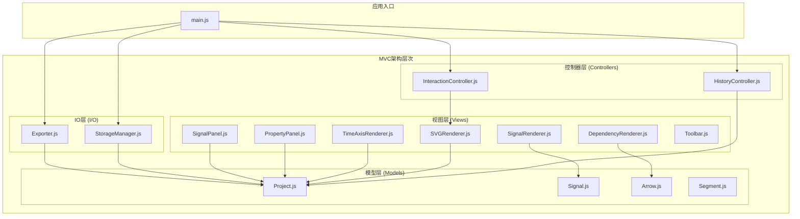
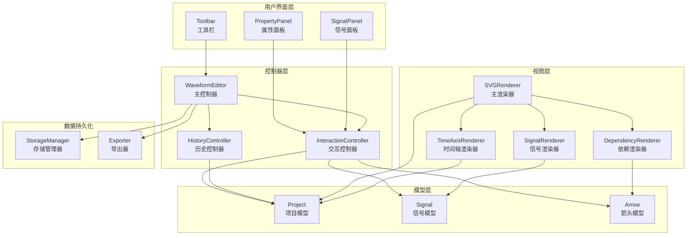
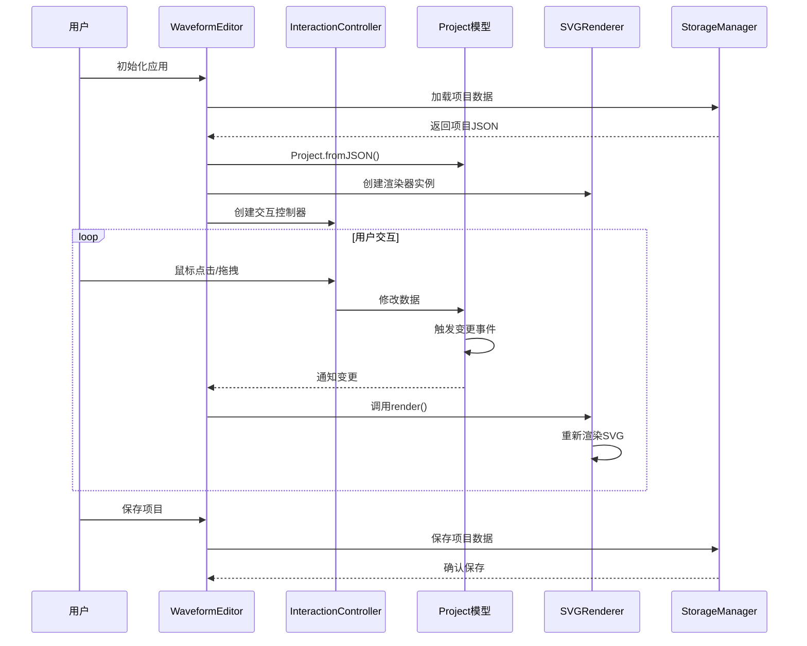
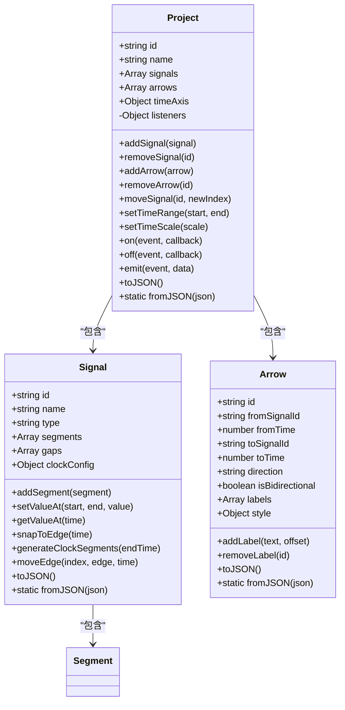
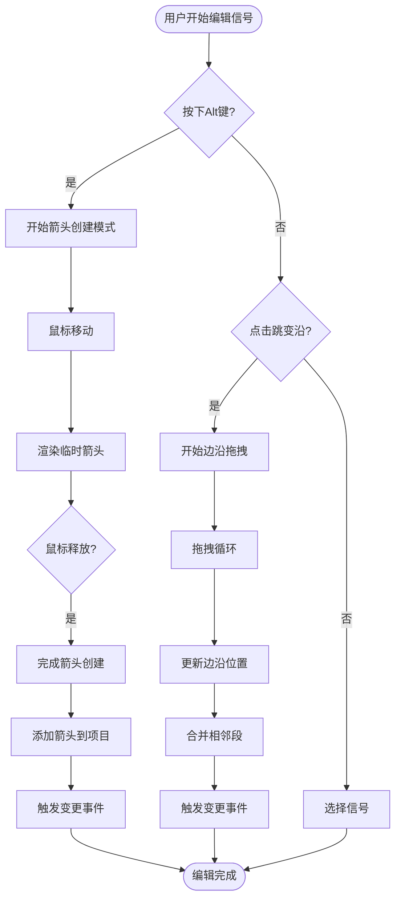
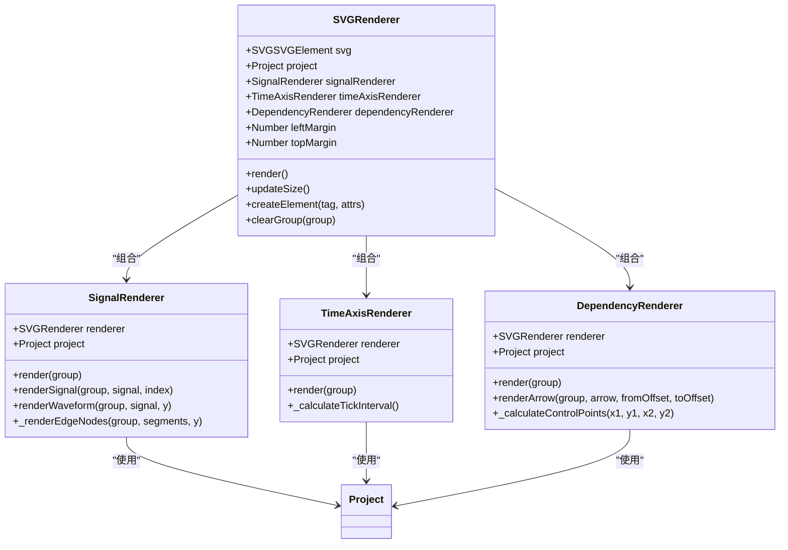
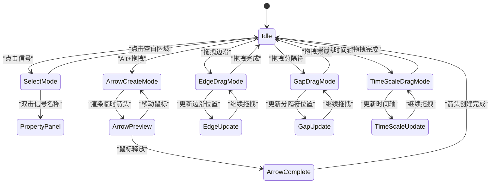
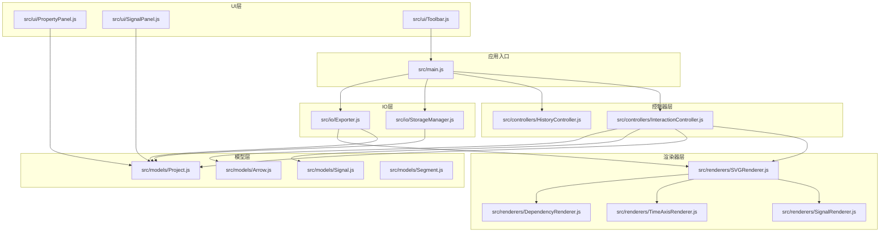

# MVC架构模式

<cite>
**本文档引用的文件**
- [main.js](file://src/main.js)
- [Project.js](file://src/models/Project.js)
- [Signal.js](file://src/models/Signal.js)
- [Arrow.js](file://src/models/Arrow.js)
- [InteractionController.js](file://src/controllers/InteractionController.js)
- [HistoryController.js](file://src/controllers/HistoryController.js)
- [SVGRenderer.js](file://src/renderers/SVGRenderer.js)
- [SignalRenderer.js](file://src/renderers/SignalRenderer.js)
- [TimeAxisRenderer.js](file://src/renderers/TimeAxisRenderer.js)
- [DependencyRenderer.js](file://src/renderers/DependencyRenderer.js)
- [PropertyPanel.js](file://src/ui/PropertyPanel.js)
- [SignalPanel.js](file://src/ui/SignalPanel.js)
- [Toolbar.js](file://src/ui/Toolbar.js)
- [StorageManager.js](file://src/io/StorageManager.js)
- [Exporter.js](file://src/io/Exporter.js)
</cite>

## 目录
1. [简介](#简介)
2. [项目结构](#项目结构)
3. [核心组件](#核心组件)
4. [架构概览](#架构概览)
5. [详细组件分析](#详细组件分析)
6. [依赖关系分析](#依赖关系分析)
7. [性能考虑](#性能考虑)
8. [故障排除指南](#故障排除指南)
9. [结论](#结论)

## 简介

波形图编辑器采用经典的MVC（Model-View-Controller）架构模式，实现了数据驱动的波形可视化编辑系统。该架构将应用程序分为三个核心层次：

- **模型层（Model）**：负责数据管理和业务逻辑，包括波形信号、箭头依赖关系、项目配置等
- **视图层（View）**：负责用户界面渲染和显示，包括SVG波形渲染、UI面板等
- **控制器层（Controller）**：负责业务逻辑处理和用户交互，包括事件处理、历史记录管理等

WaveformEditor主类作为整个应用的控制器核心，协调各个子系统的协作，实现了完整的波形编辑功能。

## 项目结构

项目采用模块化的文件组织方式，按照MVC架构进行清晰的层次划分：

**图表来源**
- [main.js:1-819](file://src/main.js#L1-L819)
- [Project.js:1-245](file://src/models/Project.js#L1-L245)
- [SVGRenderer.js:1-547](file://src/renderers/SVGRenderer.js#L1-L547)

**章节来源**
- [main.js:1-819](file://src/main.js#L1-L819)
- [Project.js:1-245](file://src/models/Project.js#L1-L245)

## 核心组件

### WaveformEditor主控制器

WaveformEditor类是整个应用的中央控制器，承担着以下核心职责：

- **应用生命周期管理**：初始化、渲染、事件监听
- **子系统协调**：管理渲染器、控制器、UI组件的生命周期
- **数据持久化**：集成存储管理器进行项目数据的保存和加载
- **多工作表支持**：管理多个波形图项目的切换和隔离

主要属性和方法包括：
- `project`: 当前活动的项目实例
- `renderer`: SVG渲染器实例
- `interactionController`: 交互控制器实例
- `historyController`: 历史记录控制器实例
- `storageManager`: 存储管理器实例
- `exporter`: 导出器实例

**章节来源**
- [main.js:21-132](file://src/main.js#L21-L132)

### 模型层组件

#### Project项目模型

Project类是模型层的核心，负责管理整个波形图项目的数据结构：

- **项目基本信息**：ID、名称、字体设置、标题位置等
- **信号集合管理**：添加、删除、移动信号
- **依赖关系管理**：箭头的增删改查
- **时间轴配置**：起始时间、结束时间、缩放比例
- **事件系统**：基于观察者模式的变更通知机制

关键特性：
- 实现了完整的JSON序列化/反序列化
- 提供时间轴坐标转换方法
- 支持信号覆盖率自动补全

**章节来源**
- [Project.js:8-245](file://src/models/Project.js#L8-L245)

#### Signal信号模型

Signal类表示单个波形信号，包含完整的波形数据：

- **信号属性**：ID、名称、类型（普通/时钟/总线）
- **波形段管理**：Segment集合的增删改查
- **时钟信号支持**：周期、相位、占空比配置
- **分隔符功能**：垂直分隔符的添加和管理
- **吸附算法**：跳变沿的智能吸附

**章节来源**
- [Signal.js:7-343](file://src/models/Signal.js#L7-L343)

#### Arrow箭头模型

Arrow类表示信号间的依赖关系箭头：

- **端点定位**：起始信号和结束信号的ID及时间
- **样式配置**：颜色、线宽、线型、箭头方向
- **标注系统**：支持多个文字标注及其偏移
- **双向支持**：自连接箭头的双向显示
- **兼容性处理**：向后兼容旧版属性访问

**章节来源**
- [Arrow.js:5-114](file://src/models/Arrow.js#L5-L114)

### 视图层组件

#### SVGRenderer主渲染器

SVGRenderer作为视图层的核心，负责协调所有渲染子系统：

- **SVG画布管理**：创建和维护SVG DOM结构
- **渲染器协调**：管理SignalRenderer、TimeAxisRenderer、DependencyRenderer
- **尺寸计算**：动态计算SVG画布尺寸和布局
- **交互层管理**：提供选择框、临时箭头等交互元素的渲染
- **主题配置**：集成颜色配置和渲染参数

**章节来源**
- [SVGRenderer.js:10-547](file://src/renderers/SVGRenderer.js#L10-L547)

#### SignalRenderer信号渲染器

专门负责波形信号的视觉呈现：

- **波形绘制**：根据信号段绘制高低电平连线
- **跳变沿处理**：垂直连线和X/Z态特殊处理
- **总线信号支持**：菱形填充和数值显示
- **分隔符渲染**：波浪斜线和命中区域
- **交互节点**：跳变沿的拖拽节点

**章节来源**
- [SignalRenderer.js:6-501](file://src/renderers/SignalRenderer.js#L6-L501)

#### TimeAxisRenderer时间轴渲染器

负责时间轴的绘制和交互：

- **刻度计算**：智能刻度间隔计算
- **标签渲染**：时间标签和单位显示
- **拖拽手柄**：时间轴扩展的交互控件
- **网格线绘制**：辅助网格线的渲染

**章节来源**
- [TimeAxisRenderer.js:6-132](file://src/renderers/TimeAxisRenderer.js#L6-L132)

#### DependencyRenderer依赖箭头渲染器

专门处理信号间依赖关系的可视化：

- **贝塞尔曲线**：平滑的S形箭头路径
- **防重叠算法**：同起点/同终点箭头的偏移处理
- **双向支持**：自连接箭头的双向显示
- **标注系统**：文字标注的位置计算和渲染

**章节来源**
- [DependencyRenderer.js:7-290](file://src/renderers/DependencyRenderer.js#L7-L290)

### 控制器层组件

#### InteractionController交互控制器

处理用户的所有交互操作：

- **鼠标事件处理**：点击、拖拽、双击等事件
- **信号编辑**：波形段的添加、删除、移动
- **箭头创建**：Alt键模式下的依赖箭头创建
- **分隔符管理**：垂直分隔符的拖拽编辑
- **时间轴操作**：时间范围的拖拽扩展

**章节来源**
- [InteractionController.js:6-800](file://src/controllers/InteractionController.js#L6-L800)

#### HistoryController历史控制器

管理撤销/重做的历史记录：

- **栈式管理**：撤销栈和重做栈的实现
- **动作封装**：统一的动作对象格式
- **内存限制**：最大历史记录数量控制
- **状态查询**：canUndo/canRedo状态检查

**章节来源**
- [HistoryController.js:5-56](file://src/controllers/HistoryController.js#L5-L56)

### UI层组件

#### PropertyPanel属性面板

提供信号和项目的属性编辑界面：

- **信号属性编辑**：名称、类型、颜色、时钟参数
- **项目设置**：字体、标题位置、时间轴配置
- **箭头属性**：方向、样式、标注管理
- **实时预览**：属性修改的即时反馈

**章节来源**
- [PropertyPanel.js:3-507](file://src/ui/PropertyPanel.js#L3-L507)

#### SignalPanel信号面板

管理信号列表的显示和操作：

- **信号列表渲染**：动态生成信号项
- **拖拽排序**：HTML5拖拽API实现的信号排序
- **删除操作**：信号的快速删除
- **滚动同步**：与波形区域的滚动同步

**章节来源**
- [SignalPanel.js:1-164](file://src/ui/SignalPanel.js#L1-L164)

#### Toolbar工具栏

提供应用级别的操作按钮：

- **添加信号**：普通信号和时钟信号
- **撤销重做**：历史记录操作
- **导出功能**：PNG、SVG、JSON导出
- **项目管理**：保存、打开、模板管理

**章节来源**
- [Toolbar.js:1-6](file://src/ui/Toolbar.js#L1-L6)

### IO层组件

#### StorageManager存储管理器

负责数据的持久化和项目管理：

- **多工作表支持**：注册表管理多个波形图项目
- **数据迁移**：从旧格式到新格式的自动迁移
- **模板管理**：项目模板的保存和加载
- **文件导入导出**：完整的项目打包和解包

**章节来源**
- [StorageManager.js:1-368](file://src/io/StorageManager.js#L1-L368)

#### Exporter导出器

提供多种格式的导出功能：

- **图像导出**：PNG和SVG格式的高质量导出
- **剪贴板支持**：直接复制到系统剪贴板
- **独立HTML**：包含完整模板的独立文件
- **JSON数据**：项目数据的纯文本格式

**章节来源**
- [Exporter.js:1-298](file://src/io/Exporter.js#L1-L298)

## 架构概览

波形图编辑器的MVC架构实现了清晰的关注点分离和模块化设计：

**图表来源**
- [main.js:21-132](file://src/main.js#L21-L132)
- [InteractionController.js:6-800](file://src/controllers/InteractionController.js#L6-L800)
- [SVGRenderer.js:10-547](file://src/renderers/SVGRenderer.js#L10-L547)

### 数据流和状态管理

波形图编辑器实现了完整的数据驱动架构，数据流向如下：

**图表来源**
- [main.js:49-132](file://src/main.js#L49-L132)
- [InteractionController.js:84-184](file://src/controllers/InteractionController.js#L84-L184)
- [SVGRenderer.js:284-314](file://src/renderers/SVGRenderer.js#L284-L314)

## 详细组件分析

### 模型层深度分析

#### Project模型的事件系统

Project模型实现了基于观察者模式的事件系统，提供了完整的数据变更通知机制：

**图表来源**
- [Project.js:8-245](file://src/models/Project.js#L8-L245)
- [Signal.js:7-343](file://src/models/Signal.js#L7-L343)
- [Arrow.js:5-114](file://src/models/Arrow.js#L5-L114)

#### 信号编辑的复杂逻辑

信号编辑功能展示了MVC架构中控制器如何处理复杂的业务逻辑：

**图表来源**
- [InteractionController.js:177-184](file://src/controllers/InteractionController.js#L177-L184)
- [InteractionController.js:231-252](file://src/controllers/InteractionController.js#L231-L252)

**章节来源**
- [InteractionController.js:84-800](file://src/controllers/InteractionController.js#L84-L800)

### 视图层渲染机制

#### SVG渲染器的层次结构

SVGRenderer实现了分层渲染架构，每个渲染器负责特定的可视化元素：

**图表来源**
- [SVGRenderer.js:10-547](file://src/renderers/SVGRenderer.js#L10-L547)
- [SignalRenderer.js:6-501](file://src/renderers/SignalRenderer.js#L6-L501)
- [TimeAxisRenderer.js:6-132](file://src/renderers/TimeAxisRenderer.js#L6-L132)
- [DependencyRenderer.js:7-290](file://src/renderers/DependencyRenderer.js#L7-L290)

#### 渲染性能优化策略

视图层采用了多项性能优化技术：

1. **增量渲染**：只重新渲染发生变化的部分
2. **DOM复用**：重用SVG元素而不是频繁创建销毁
3. **虚拟滚动**：大量信号时的性能优化
4. **防抖处理**：窗口大小变化时的延迟渲染

**章节来源**
- [SVGRenderer.js:284-314](file://src/renderers/SVGRenderer.js#L284-L314)
- [SignalRenderer.js:22-31](file://src/renderers/SignalRenderer.js#L22-L31)

### 控制器层业务逻辑

#### 交互控制器的状态管理

InteractionController实现了复杂的状态机来管理各种编辑模式：

**图表来源**
- [InteractionController.js:12-50](file://src/controllers/InteractionController.js#L12-L50)
- [InteractionController.js:84-337](file://src/controllers/InteractionController.js#L84-L337)

**章节来源**
- [InteractionController.js:6-800](file://src/controllers/InteractionController.js#L6-L800)

## 依赖关系分析

### 模块依赖图

波形图编辑器的模块依赖关系体现了清晰的分层架构：

**图表来源**
- [main.js:4-16](file://src/main.js#L4-L16)
- [SVGRenderer.js:5-8](file://src/renderers/SVGRenderer.js#L5-L8)

### 循环依赖检测

经过分析，项目中不存在循环依赖关系：

1. **模型层**：完全独立，不依赖其他层
2. **视图层**：依赖模型层，不依赖控制器层
3. **控制器层**：依赖模型层和视图层
4. **UI层**：依赖控制器层和模型层
5. **IO层**：依赖模型层，不依赖其他层

这种单向依赖关系确保了系统的稳定性和可维护性。

**章节来源**
- [main.js:4-16](file://src/main.js#L4-L16)
- [SVGRenderer.js:5-8](file://src/renderers/SVGRenderer.js#L5-L8)

## 性能考虑

### 渲染性能优化

波形图编辑器在渲染性能方面采用了多项优化策略：

1. **增量更新**：只重新渲染发生变化的元素，避免全量重绘
2. **SVG元素复用**：通过clearGroup方法清理后再添加，减少DOM操作
3. **批量操作**：将多个相关的DOM操作合并执行
4. **防抖机制**：窗口大小变化时使用setTimeout防抖

### 内存管理

1. **对象池模式**：复用SVG元素对象，减少垃圾回收压力
2. **事件监听器管理**：及时移除不需要的事件监听器
3. **定时器清理**：使用cancelAnimationFrame清理动画帧

### 数据结构优化

1. **信号段合并**：自动合并相邻的同值段，减少渲染元素数量
2. **索引缓存**：缓存信号索引和时间轴映射，提高查找效率
3. **事件系统优化**：使用数组存储回调函数，避免频繁的对象创建

## 故障排除指南

### 常见问题诊断

#### 渲染异常问题

**症状**：波形图显示异常或空白
**排查步骤**：
1. 检查SVG元素是否存在
2. 验证项目数据的完整性
3. 确认渲染器配置正确
4. 查看浏览器控制台错误信息

**解决方案**：
- 确保DOM元素加载完成后再初始化渲染器
- 验证项目JSON数据格式正确
- 检查CSS样式是否影响SVG显示

#### 交互响应问题

**症状**：鼠标点击无响应或拖拽异常
**排查步骤**：
1. 检查事件监听器绑定情况
2. 验证z-index层级关系
3. 确认事件冒泡和捕获处理

**解决方案**：
- 重新绑定事件监听器
- 调整SVG元素的pointer-events属性
- 检查CSS的cursor样式设置

#### 数据同步问题

**症状**：UI显示与数据状态不一致
**排查步骤**：
1. 检查事件系统是否正常工作
2. 验证数据变更通知机制
3. 确认渲染调用时机

**解决方案**：
- 确保每次数据修改后都触发变更事件
- 检查render方法的调用链
- 验证双向绑定的完整性

**章节来源**
- [main.js:451-629](file://src/main.js#L451-L629)
- [InteractionController.js:52-82](file://src/controllers/InteractionController.js#L52-L82)

## 结论

波形图编辑器的MVC架构设计展现了良好的软件工程实践：

### 架构优势

1. **清晰的职责分离**：模型、视图、控制器各司其职，降低耦合度
2. **可扩展性**：新增功能时只需扩展相应层次，不影响其他模块
3. **可测试性**：每个层次都可以独立测试，便于单元测试和集成测试
4. **可维护性**：模块化设计使得代码维护更加容易

### 技术亮点

1. **事件驱动架构**：基于观察者模式的松耦合通信机制
2. **增量渲染**：高效的SVG渲染策略
3. **状态管理模式**：完整的用户交互状态管理
4. **数据持久化**：灵活的多工作表支持

### 改进建议

1. **引入状态管理库**：可以考虑使用Redux或类似的库来管理复杂状态
2. **添加单元测试**：为关键业务逻辑添加自动化测试
3. **性能监控**：集成性能监控工具来跟踪渲染性能
4. **文档完善**：为公共API添加详细的文档注释

该架构为波形图编辑器提供了坚实的技术基础，使其能够支持复杂的波形编辑功能，同时保持良好的可维护性和扩展性。