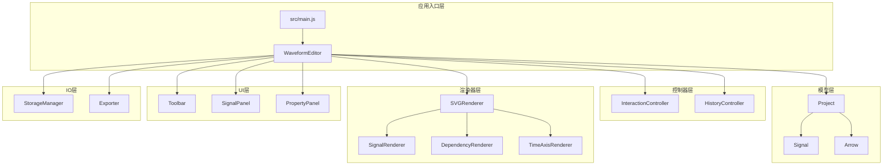
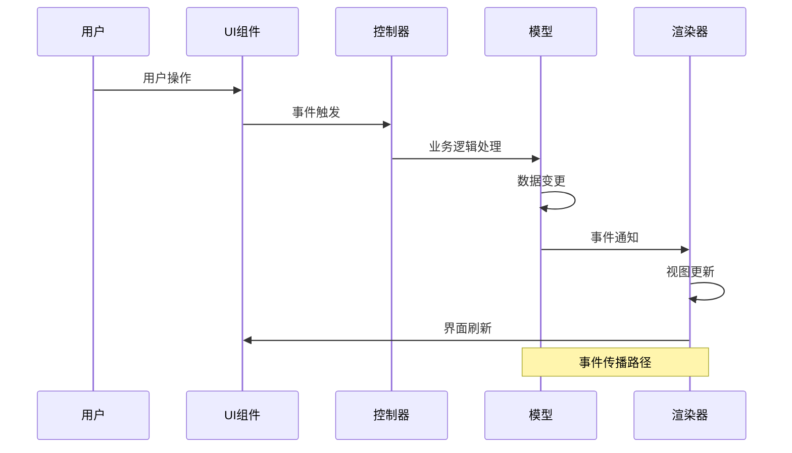
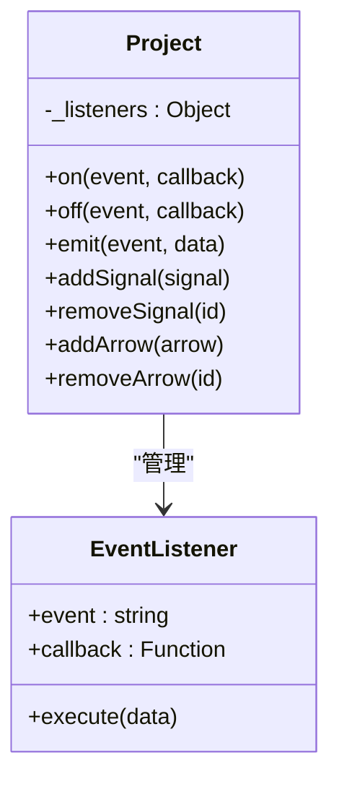
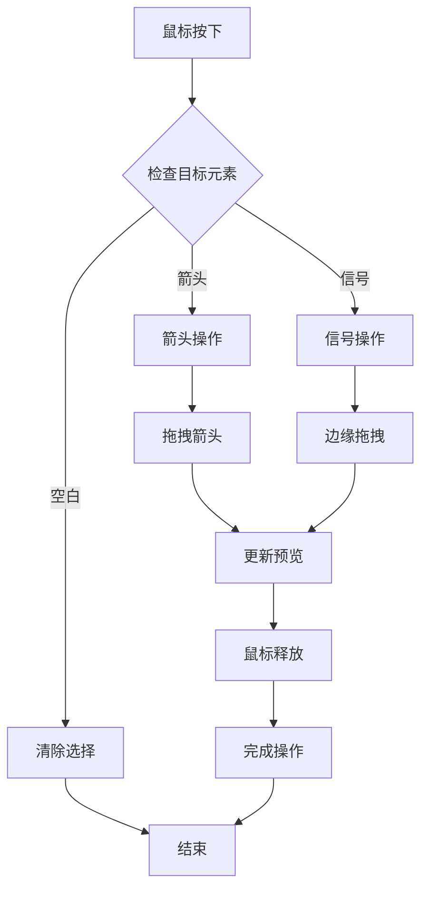
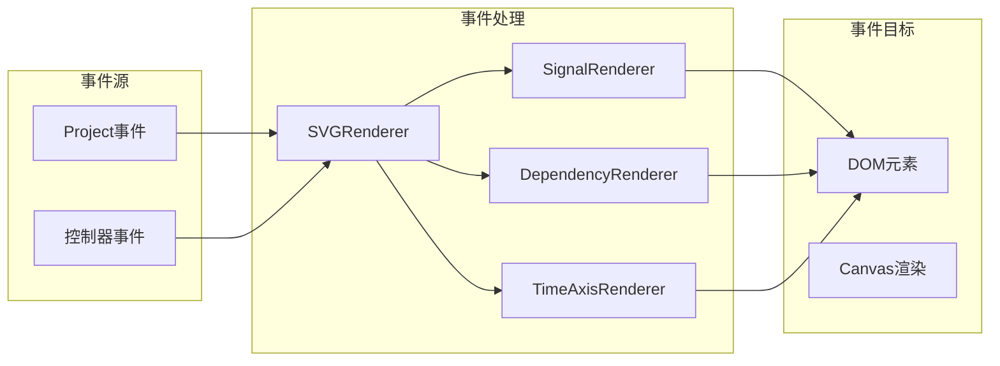
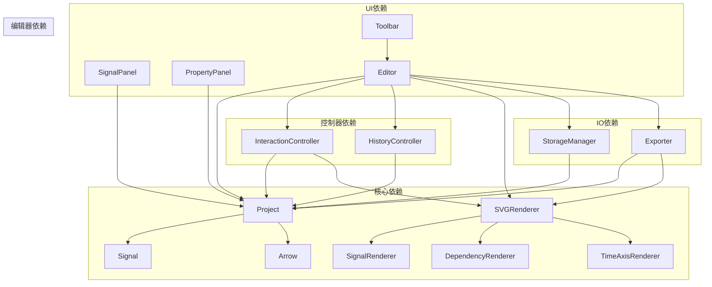
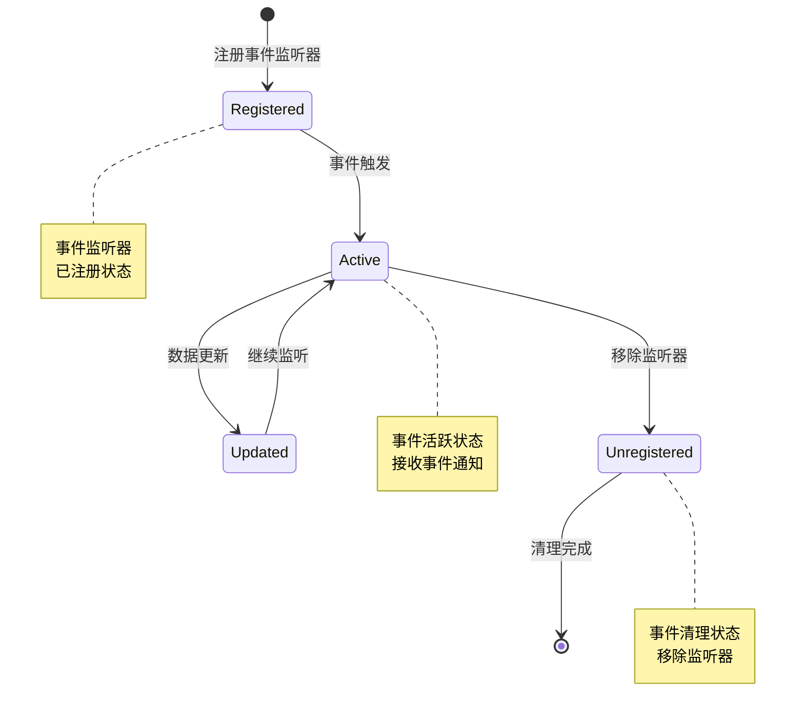

# 事件驱动架构

<cite>
**本文档引用的文件**
- [src/main.js](file://src/main.js)
- [src/controllers/InteractionController.js](file://src/controllers/InteractionController.js)
- [src/models/Project.js](file://src/models/Project.js)
- [src/renderers/SVGRenderer.js](file://src/renderers/SVGRenderer.js)
- [src/renderers/SignalRenderer.js](file://src/renderers/SignalRenderer.js)
- [src/renderers/DependencyRenderer.js](file://src/renderers/DependencyRenderer.js)
- [src/renderers/TimeAxisRenderer.js](file://src/renderers/TimeAxisRenderer.js)
- [src/controllers/HistoryController.js](file://src/controllers/HistoryController.js)
- [src/ui/Toolbar.js](file://src/ui/Toolbar.js)
- [src/ui/SignalPanel.js](file://src/ui/SignalPanel.js)
- [src/ui/PropertyPanel.js](file://src/ui/PropertyPanel.js)
- [src/io/StorageManager.js](file://src/io/StorageManager.js)
- [src/io/Exporter.js](file://src/io/Exporter.js)
</cite>

## 目录
1. [简介](#简介)
2. [项目结构](#项目结构)
3. [核心组件](#核心组件)
4. [架构概览](#架构概览)
5. [详细组件分析](#详细组件分析)
6. [依赖分析](#依赖分析)
7. [性能考虑](#性能考虑)
8. [故障排除指南](#故障排除指南)
9. [结论](#结论)

## 简介

波形图编辑器采用基于观察者模式的事件驱动架构，通过统一的事件发布订阅机制实现用户交互、业务逻辑和渲染系统的解耦。该架构以Project为核心事件源，通过事件传播路径将用户操作从UI层传递到业务逻辑层，最终驱动渲染器更新视图。

系统实现了完整的事件生命周期管理，包括事件注册、触发、传播和清理。事件类型涵盖用户交互事件（鼠标、键盘）、业务变更事件和渲染事件，形成了一个完整的事件生态系统。

## 项目结构

项目采用模块化设计，按照功能层次组织代码结构：

**图表来源**
- [src/main.js:1-819](file://src/main.js#L1-L819)
- [src/controllers/InteractionController.js:1-1420](file://src/controllers/InteractionController.js#L1-L1420)
- [src/models/Project.js:1-245](file://src/models/Project.js#L1-L245)

**章节来源**
- [src/main.js:1-819](file://src/main.js#L1-L819)

## 核心组件

### 事件系统基础

项目实现了完整的观察者模式事件系统，核心特性包括：

- **事件注册机制**：每个组件都可以注册事件监听器
- **事件触发机制**：通过emit方法触发事件，通知所有监听器
- **事件传播**：事件从源组件向所有监听器传播
- **事件清理**：支持移除特定事件监听器

### 事件类型分类

系统定义了多种事件类型，每种事件都有特定的用途和数据结构：

1. **用户交互事件**：鼠标点击、拖拽、键盘输入
2. **业务变更事件**：信号添加、删除、修改
3. **渲染事件**：视图更新、重渲染
4. **系统事件**：项目切换、保存、加载

### 事件处理器职责

- **Project事件处理器**：管理项目级别的事件监听
- **InteractionController事件处理器**：处理用户交互事件
- **SVGRenderer事件处理器**：负责渲染相关的事件
- **UI组件事件处理器**：处理界面交互事件

**章节来源**
- [src/models/Project.js:172-202](file://src/models/Project.js#L172-L202)
- [src/controllers/InteractionController.js:52-82](file://src/controllers/InteractionController.js#L52-L82)

## 架构概览

波形图编辑器采用分层架构设计，事件驱动贯穿整个系统：

**图表来源**
- [src/main.js:451-629](file://src/main.js#L451-L629)
- [src/controllers/InteractionController.js:84-337](file://src/controllers/InteractionController.js#L84-L337)

### 事件传播路径

系统建立了清晰的事件传播路径：

1. **用户层**：用户通过鼠标、键盘与界面交互
2. **UI层**：UI组件接收用户输入并转换为内部事件
3. **控制器层**：控制器处理业务逻辑并协调各组件
4. **模型层**：模型更新数据状态并触发相应事件
5. **渲染层**：渲染器根据数据变化更新视图

### 异步处理策略

系统采用多种异步处理策略：

- **事件队列**：将事件放入队列等待处理
- **请求动画帧**：使用requestAnimationFrame优化渲染
- **延迟执行**：对高频事件进行节流处理
- **批处理**：将多个相关事件合并处理

**章节来源**
- [src/controllers/InteractionController.js:370-401](file://src/controllers/InteractionController.js#L370-L401)
- [src/main.js:588-595](file://src/main.js#L588-L595)

## 详细组件分析

### 事件发布订阅机制

#### Project事件系统

Project作为核心事件源，实现了完整的事件发布订阅机制：

**图表来源**
- [src/models/Project.js:172-202](file://src/models/Project.js#L172-L202)

#### 事件注册与注销

事件注册采用弱引用机制，避免内存泄漏：

- **事件注册**：通过on方法注册事件监听器
- **事件注销**：通过off方法移除特定监听器
- **批量注销**：支持移除所有事件监听器

#### 事件触发机制

事件触发采用同步广播方式：

- **事件传播**：向所有注册的监听器发送事件
- **数据传递**：将事件数据传递给监听器
- **异常处理**：监听器抛出异常不影响其他监听器

**章节来源**
- [src/models/Project.js:172-202](file://src/models/Project.js#L172-L202)

### 用户交互事件处理

#### 鼠标事件处理

系统实现了完整的鼠标事件处理机制：

**图表来源**
- [src/controllers/InteractionController.js:84-184](file://src/controllers/InteractionController.js#L84-L184)

#### 键盘事件处理

键盘事件处理支持快捷键操作：

- **撤销/重做**：Ctrl+Z/Ctrl+Y
- **删除操作**：Delete键删除选中元素
- **导航操作**：方向键进行精确定位

#### 事件状态管理

系统维护复杂的事件状态：

- **拖拽状态**：跟踪拖拽操作的生命周期
- **选择状态**：管理当前选中的元素
- **编辑状态**：控制编辑模式的切换

**章节来源**
- [src/controllers/InteractionController.js:403-432](file://src/controllers/InteractionController.js#L403-L432)
- [src/main.js:575-586](file://src/main.js#L575-L586)

### 业务逻辑事件处理

#### 信号管理事件

信号管理涉及多种事件类型：

- **信号添加**：addSignal事件
- **信号删除**：removeSignal事件  
- **信号移动**：moveSignal事件
- **信号修改**：signalChange事件

#### 箭头依赖事件

箭头依赖关系的事件处理：

- **箭头创建**：addArrow事件
- **箭头删除**：removeArrow事件
- **箭头修改**：arrowChange事件
- **箭头选择**：arrowSelect事件

#### 时间轴事件

时间轴相关的事件处理：

- **时间范围变更**：timeRange事件
- **缩放操作**：zoom事件
- **拖拽操作**：drag事件

**章节来源**
- [src/models/Project.js:43-135](file://src/models/Project.js#L43-L135)

### 渲染事件处理

#### 渲染器事件架构

渲染器采用分层事件处理：

**图表来源**
- [src/renderers/SVGRenderer.js:284-314](file://src/renderers/SVGRenderer.js#L284-L314)

#### 渲染优化策略

系统实现了多种渲染优化技术：

- **增量渲染**：只更新发生变化的部分
- **虚拟DOM**：减少DOM操作次数
- **批处理渲染**：合并多个渲染请求
- **延迟渲染**：对高频更新进行节流

#### 事件驱动的渲染更新

渲染更新采用事件驱动的方式：

- **数据变更触发**：数据变化自动触发渲染
- **选择状态更新**：用户选择变化更新高亮
- **布局调整触发**：容器尺寸变化触发重排

**章节来源**
- [src/renderers/SVGRenderer.js:284-314](file://src/renderers/SVGRenderer.js#L284-L314)

### UI组件事件处理

#### 信号面板事件

信号面板的事件处理机制：

- **信号选择**：点击信号项进行选择
- **信号删除**：通过删除按钮移除信号
- **信号拖拽**：支持信号排序拖拽
- **滚动同步**：与波形区域滚动同步

#### 属性面板事件

属性面板的动态事件处理：

- **实时更新**：属性修改立即反映到波形
- **类型切换**：信号类型改变时更新界面
- **验证机制**：输入验证和错误提示
- **撤销支持**：支持撤销属性修改

#### 工具栏事件

工具栏的事件处理：

- **功能按钮**：添加信号、时钟等操作
- **导出功能**：PNG、SVG、JSON导出
- **模板管理**：模板保存和加载
- **项目管理**：新建、打开、保存项目

**章节来源**
- [src/ui/SignalPanel.js:45-164](file://src/ui/SignalPanel.js#L45-L164)
- [src/ui/PropertyPanel.js:32-237](file://src/ui/PropertyPanel.js#L32-L237)

## 依赖分析

### 组件间依赖关系

**图表来源**
- [src/main.js:10-16](file://src/main.js#L10-L16)
- [src/controllers/InteractionController.js:6-26](file://src/controllers/InteractionController.js#L6-L26)

### 事件依赖链

系统建立了清晰的事件依赖链：

1. **用户事件** → **UI事件** → **控制器事件** → **模型事件** → **渲染事件**
2. **模型事件** → **渲染事件** → **UI事件** → **用户反馈**
3. **系统事件** → **持久化事件** → **外部集成**

### 循环依赖检测

系统设计避免了循环依赖：

- **单向依赖**：事件从源组件流向目标组件
- **事件解耦**：组件通过事件接口通信
- **接口隔离**：每个组件只暴露必要的接口

**章节来源**
- [src/main.js:10-16](file://src/main.js#L10-L16)

## 性能考虑

### 事件性能优化

#### 事件节流与防抖

系统实现了多种事件优化技术：

- **鼠标移动事件节流**：使用requestAnimationFrame优化
- **窗口大小变化防抖**：200ms延迟处理
- **拖拽事件优化**：只在必要时更新预览
- **高频事件批处理**：合并多个事件请求

#### 内存管理优化

- **事件监听器清理**：及时移除不需要的监听器
- **DOM元素复用**：避免频繁创建和销毁DOM
- **对象池模式**：重用临时对象减少GC压力
- **弱引用机制**：防止循环引用导致的内存泄漏

#### 渲染性能优化

- **虚拟DOM**：最小化DOM操作
- **增量更新**：只更新变化的部分
- **渲染合并**：合并多个渲染请求
- **GPU加速**：利用CSS3 transform进行动画

### 事件生命周期管理

#### 事件注册生命周期

**图表来源**
- [src/models/Project.js:172-192](file://src/models/Project.js#L172-L192)

#### 内存泄漏防护措施

系统采用了多重内存泄漏防护：

- **自动清理机制**：组件销毁时自动清理事件监听器
- **弱引用模式**：使用WeakMap存储事件映射
- **定时清理任务**：定期检查和清理失效的事件监听器
- **调试模式**：开发环境下监控事件泄漏情况

**章节来源**
- [src/main.js:226-241](file://src/main.js#L226-L241)
- [src/controllers/InteractionController.js:29-50](file://src/controllers/InteractionController.js#L29-L50)

## 故障排除指南

### 常见事件问题

#### 事件不触发问题

**症状**：用户操作后没有响应

**排查步骤**：
1. 检查事件监听器是否正确注册
2. 验证事件冒泡是否被阻止
3. 确认事件目标元素是否存在
4. 检查事件处理函数是否有异常

#### 事件重复触发问题

**症状**：同一个操作触发多次事件

**排查步骤**：
1. 检查是否重复注册了事件监听器
2. 验证事件绑定是否在正确的生命周期
3. 确认事件解绑是否正确执行
4. 检查是否有事件委托导致的重复处理

#### 事件丢失问题

**症状**：某些事件没有被处理

**排查步骤**：
1. 检查事件传播路径是否正确
2. 验证事件目标元素的事件处理
3. 确认事件冒泡和捕获阶段的处理
4. 检查事件监听器的执行顺序

### 性能问题诊断

#### 事件处理缓慢

**症状**：界面响应迟缓

**诊断方法**：
1. 使用浏览器开发者工具分析事件处理时间
2. 检查是否有大量事件监听器
3. 验证事件处理函数的复杂度
4. 确认是否有不必要的DOM操作

#### 内存泄漏检测

**症状**：页面内存使用持续增长

**检测方法**：
1. 使用Chrome DevTools Memory面板
2. 检查事件监听器的引用关系
3. 验证组件销毁时的清理逻辑
4. 确认全局事件监听器的管理

**章节来源**
- [src/main.js:226-241](file://src/main.js#L226-L241)
- [src/controllers/InteractionController.js:370-401](file://src/controllers/InteractionController.js#L370-L401)

## 结论

波形图编辑器的事件驱动架构展现了现代前端应用的最佳实践。通过基于观察者模式的事件系统，实现了用户界面、业务逻辑和渲染系统的完全解耦。

### 架构优势

1. **模块化设计**：清晰的组件分离和职责划分
2. **事件驱动**：统一的事件传播机制
3. **性能优化**：多种优化策略确保流畅体验
4. **可维护性**：良好的代码结构便于维护和扩展

### 技术亮点

- **完整的事件生命周期管理**：从注册到清理的全生命周期
- **灵活的事件传播机制**：支持同步和异步事件处理
- **强大的内存管理**：多重防护措施防止内存泄漏
- **高效的渲染优化**：增量渲染和批处理技术

### 未来改进方向

1. **事件系统重构**：考虑引入更现代的事件管理库
2. **性能监控**：建立完善的性能监控和告警机制
3. **测试覆盖**：增加事件系统的单元测试和集成测试
4. **文档完善**：补充详细的API文档和使用指南

该事件驱动架构为波形图编辑器提供了坚实的技术基础，能够支持复杂的功能需求和良好的用户体验。