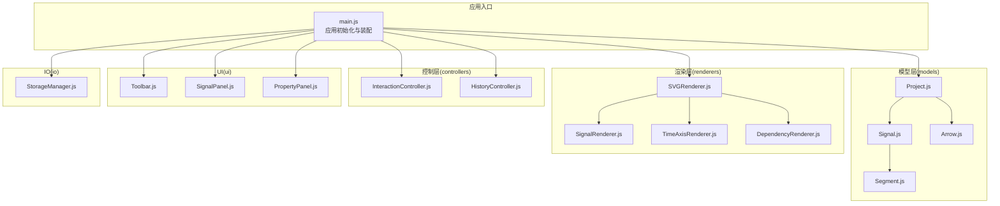
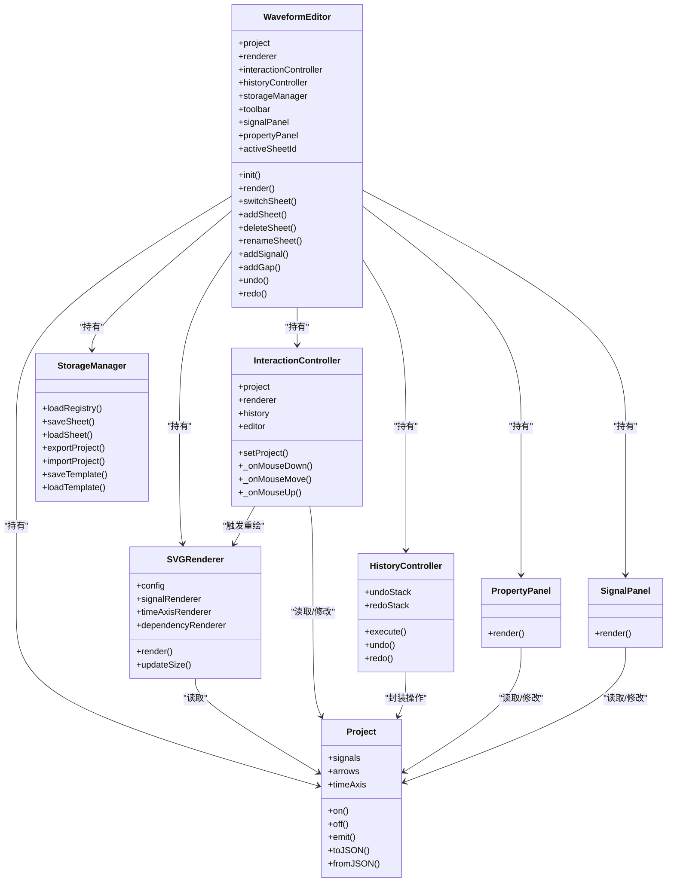
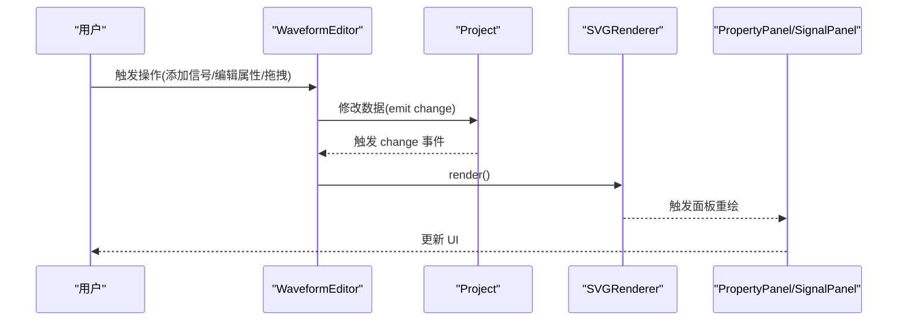
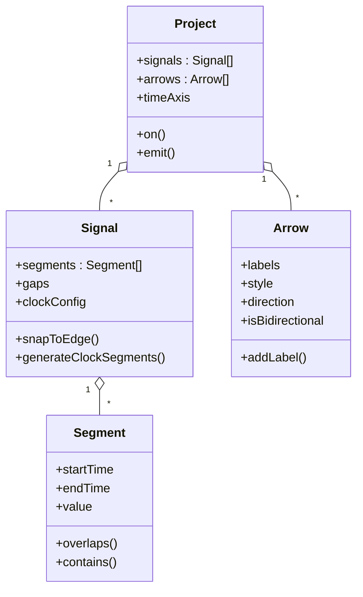
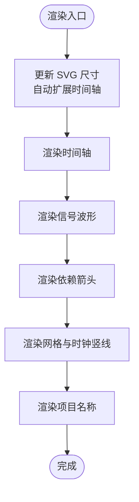
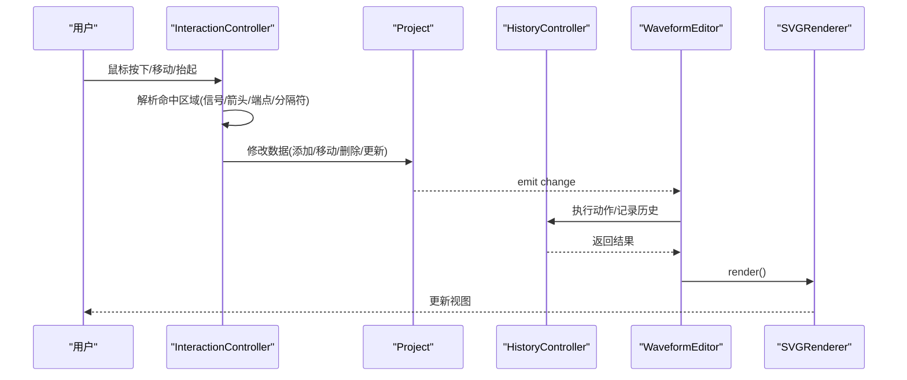
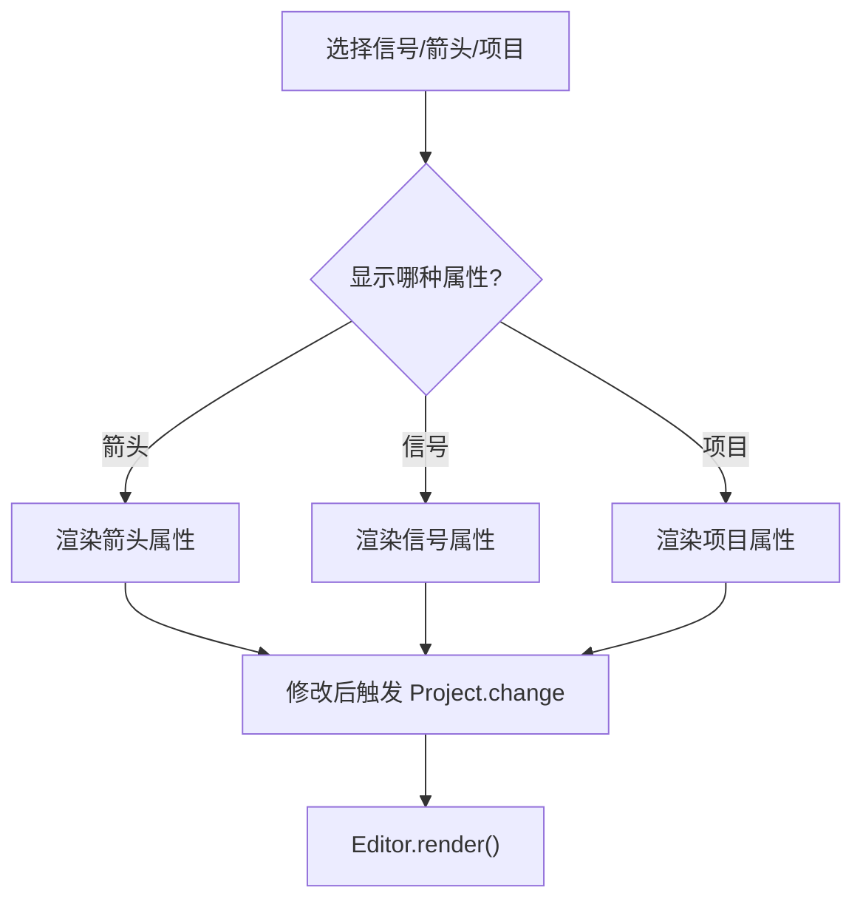
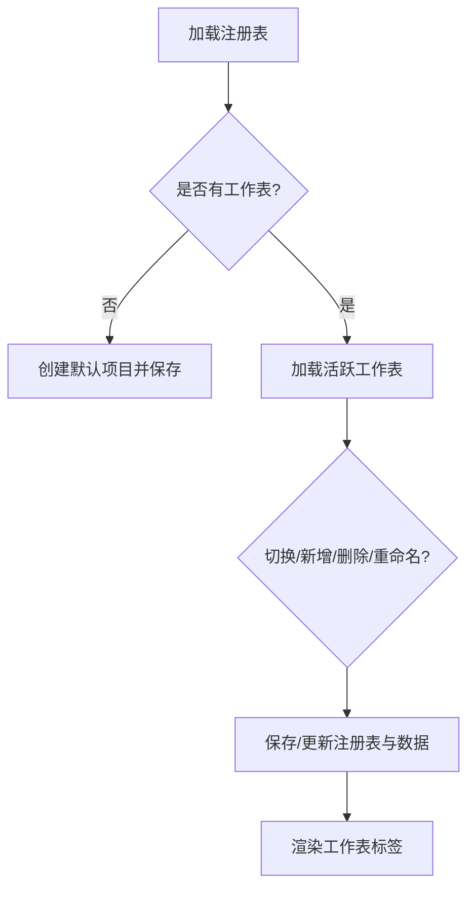
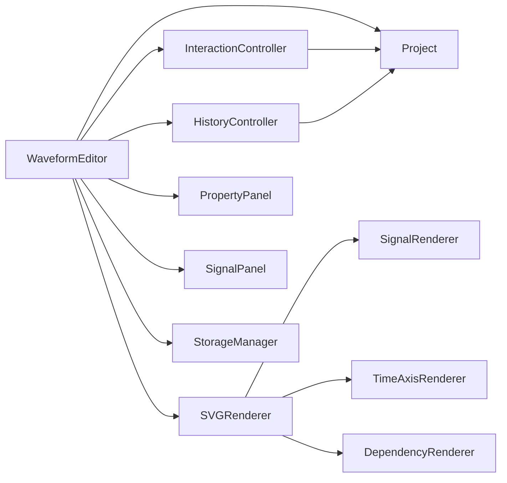

# 核心架构

<cite>
**本文档引用的文件**
- [src/main.js](file://src/main.js)
- [src/models/Project.js](file://src/models/Project.js)
- [src/models/Signal.js](file://src/models/Signal.js)
- [src/models/Segment.js](file://src/models/Segment.js)
- [src/models/Arrow.js](file://src/models/Arrow.js)
- [src/renderers/SVGRenderer.js](file://src/renderers/SVGRenderer.js)
- [src/renderers/SignalRenderer.js](file://src/renderers/SignalRenderer.js)
- [src/renderers/TimeAxisRenderer.js](file://src/renderers/TimeAxisRenderer.js)
- [src/renderers/DependencyRenderer.js](file://src/renderers/DependencyRenderer.js)
- [src/controllers/InteractionController.js](file://src/controllers/InteractionController.js)
- [src/controllers/HistoryController.js](file://src/controllers/HistoryController.js)
- [src/ui/PropertyPanel.js](file://src/ui/PropertyPanel.js)
- [src/ui/SignalPanel.js](file://src/ui/SignalPanel.js)
- [src/ui/Toolbar.js](file://src/ui/Toolbar.js)
- [src/io/StorageManager.js](file://src/io/StorageManager.js)
</cite>

## 目录
1. [简介](#简介)
2. [项目结构](#项目结构)
3. [核心组件](#核心组件)
4. [架构总览](#架构总览)
5. [详细组件分析](#详细组件分析)
6. [依赖分析](#依赖分析)
7. [性能考虑](#性能考虑)
8. [故障排查指南](#故障排查指南)
9. [结论](#结论)
10. [附录](#附录)

## 简介
本文件面向波形图编辑器的架构文档，围绕 MVC 模式、模块化设计与组件交互展开，重点阐释主类 WaveformEditor 的设计思想、模型层（数据模型）、渲染层（SVG 渲染器）、控制层（交互与历史）的职责分工，以及事件驱动与观察者模式的应用。文档还给出数据流与状态管理策略、扩展点与自定义指南，并辅以架构图与组件关系图，帮助开发者快速理解与高效扩展系统。

## 项目结构
项目采用按职责分层与按功能模块划分相结合的组织方式：
- models：数据模型层，封装信号、段、箭头与项目实体
- renderers：渲染层，负责 SVG 渲染与子渲染器协作
- controllers：控制层，处理用户交互与历史管理
- ui：UI 控件，提供属性面板、信号面板、工具栏等
- io：输入输出与持久化，负责多工作表注册表、模板与导入导出
- config：全局配置与渲染常量

**图表来源**
- [src/main.js:1-132](file://src/main.js#L1-L132)
- [src/models/Project.js:1-245](file://src/models/Project.js#L1-L245)
- [src/renderers/SVGRenderer.js:1-100](file://src/renderers/SVGRenderer.js#L1-L100)
- [src/controllers/InteractionController.js:1-82](file://src/controllers/InteractionController.js#L1-L82)
- [src/controllers/HistoryController.js:1-56](file://src/controllers/HistoryController.js#L1-L56)
- [src/ui/PropertyPanel.js:1-507](file://src/ui/PropertyPanel.js#L1-L507)
- [src/ui/SignalPanel.js:1-164](file://src/ui/SignalPanel.js#L1-L164)
- [src/ui/Toolbar.js:1-6](file://src/ui/Toolbar.js#L1-L6)
- [src/io/StorageManager.js:1-368](file://src/io/StorageManager.js#L1-L368)

**章节来源**
- [src/main.js:1-132](file://src/main.js#L1-L132)

## 核心组件
- WaveformEditor（主类）
  - 职责：应用入口与编排者，负责项目生命周期、渲染调度、多工作表管理、事件绑定与自动保存、UI 组件装配与状态同步。
  - 关键行为：初始化、加载/切换工作表、渲染、撤销/重做、添加信号/分隔符、打开项目文件、导出与模板管理。
- 模型层（Model）
  - Project：项目根实体，聚合信号、箭头、时间轴，提供事件通知与序列化。
  - Signal/Segment：信号与波形段，支持电平值、跳变沿、X/Z 态、总线值与分隔符。
  - Arrow：依赖箭头，支持多标签、方向与双向箭头、样式配置。
- 渲染层（Renderer）
  - SVGRenderer：主渲染器，协调时间轴、信号、依赖箭头与交互层，维护 SVG 结构与尺寸。
  - SignalRenderer/TimeAxisRenderer/DependencyRenderer：子渲染器，分别负责波形、时间轴与依赖箭头渲染。
- 控制层（Controller）
  - InteractionController：事件驱动的交互控制器，处理鼠标/键盘事件、拖拽、吸附、箭头创建与编辑、分隔符拖拽、时间轴缩放。
  - HistoryController：撤销/重做栈，封装动作执行与状态回滚。
- UI 层（UI）
  - PropertyPanel：属性面板，支持信号/箭头/项目属性编辑与联动渲染。
  - SignalPanel：信号列表面板，支持拖拽排序、删除与滚动同步。
  - Toolbar：工具栏占位，承载按钮事件绑定。
- IO 层（IO）
  - StorageManager：多工作表注册表、sheet 数据存取、导入导出、模板管理、旧数据迁移。

**章节来源**
- [src/main.js:21-132](file://src/main.js#L21-L132)
- [src/models/Project.js:8-245](file://src/models/Project.js#L8-L245)
- [src/models/Signal.js:7-343](file://src/models/Signal.js#L7-L343)
- [src/models/Segment.js:5-94](file://src/models/Segment.js#L5-L94)
- [src/models/Arrow.js:5-114](file://src/models/Arrow.js#L5-L114)
- [src/renderers/SVGRenderer.js:10-100](file://src/renderers/SVGRenderer.js#L10-L100)
- [src/renderers/SignalRenderer.js:6-501](file://src/renderers/SignalRenderer.js#L6-L501)
- [src/renderers/TimeAxisRenderer.js:6-132](file://src/renderers/TimeAxisRenderer.js#L6-L132)
- [src/renderers/DependencyRenderer.js:7-290](file://src/renderers/DependencyRenderer.js#L7-L290)
- [src/controllers/InteractionController.js:6-800](file://src/controllers/InteractionController.js#L6-L800)
- [src/controllers/HistoryController.js:5-56](file://src/controllers/HistoryController.js#L5-L56)
- [src/ui/PropertyPanel.js:3-507](file://src/ui/PropertyPanel.js#L3-L507)
- [src/ui/SignalPanel.js:1-164](file://src/ui/SignalPanel.js#L1-L164)
- [src/ui/Toolbar.js:1-6](file://src/ui/Toolbar.js#L1-L6)
- [src/io/StorageManager.js:1-368](file://src/io/StorageManager.js#L1-L368)

## 架构总览
系统遵循 MVC 与事件驱动架构：
- Model：Project/Signal/Segment/Arrow 提供数据与业务规则，内部通过事件通知变更。
- View：SVGRenderer 及其子渲染器负责将模型渲染为 SVG。
- Controller：InteractionController 处理用户交互，HistoryController 管理操作历史。
- 事件与观察者：Project.on/off/emit 实现观察者模式，驱动视图更新与状态同步。

**图表来源**
- [src/main.js:21-132](file://src/main.js#L21-L132)
- [src/models/Project.js:8-245](file://src/models/Project.js#L8-L245)
- [src/renderers/SVGRenderer.js:10-100](file://src/renderers/SVGRenderer.js#L10-L100)
- [src/controllers/InteractionController.js:6-82](file://src/controllers/InteractionController.js#L6-L82)
- [src/controllers/HistoryController.js:5-56](file://src/controllers/HistoryController.js#L5-L56)
- [src/ui/PropertyPanel.js:3-507](file://src/ui/PropertyPanel.js#L3-L507)
- [src/ui/SignalPanel.js:1-164](file://src/ui/SignalPanel.js#L1-L164)
- [src/io/StorageManager.js:1-368](file://src/io/StorageManager.js#L1-L368)

## 详细组件分析

### 主类 WaveformEditor 设计思路
- 单一职责：作为应用编排者，集中管理项目、渲染器、控制器、UI 与 IO 组件，统一事件与状态。
- 生命周期：init 中完成数据迁移、工作表加载/创建、渲染器与控制器初始化、UI 组件装配、事件监听与自动保存注册。
- 多工作表：通过 StorageManager 维护注册表与 sheet 数据，支持切换、新增、删除、重命名与标签渲染。
- 渲染协调：render 方法统一调度 SVGRenderer、SignalPanel、PropertyPanel，确保视图一致性。
- 事件驱动：通过 Project.emit('change') 与自动保存回调实现响应式更新。

**图表来源**
- [src/main.js:760-770](file://src/main.js#L760-L770)
- [src/models/Project.js:194-202](file://src/models/Project.js#L194-L202)
- [src/ui/PropertyPanel.js:32-237](file://src/ui/PropertyPanel.js#L32-L237)
- [src/ui/SignalPanel.js:45-67](file://src/ui/SignalPanel.js#L45-L67)

**章节来源**
- [src/main.js:21-132](file://src/main.js#L21-L132)
- [src/main.js:49-132](file://src/main.js#L49-L132)
- [src/main.js:226-241](file://src/main.js#L226-L241)
- [src/main.js:246-368](file://src/main.js#L246-L368)
- [src/main.js:760-770](file://src/main.js#L760-L770)

### 模型层（数据模型）
- Project
  - 聚合信号、箭头、时间轴，提供事件通知与序列化/反序列化。
  - 关键方法：add/remove/moveSignal、add/removeArrow、setTimeRange/setTimeScale、timeToX/xToTime、on/off/emit。
- Signal/Segment
  - Signal 支持普通、时钟、总线三种类型，提供跳变沿吸附、X/Z 态渲染、总线值与分隔符。
  - Segment 表示连续电平区间，支持重叠合并与边界对齐。
- Arrow
  - 支持多标签、方向与双向箭头、样式配置，兼容旧版 text/textOffset。

**图表来源**
- [src/models/Project.js:8-245](file://src/models/Project.js#L8-L245)
- [src/models/Signal.js:7-343](file://src/models/Signal.js#L7-L343)
- [src/models/Segment.js:5-94](file://src/models/Segment.js#L5-L94)
- [src/models/Arrow.js:5-114](file://src/models/Arrow.js#L5-L114)

**章节来源**
- [src/models/Project.js:8-245](file://src/models/Project.js#L8-L245)
- [src/models/Signal.js:7-343](file://src/models/Signal.js#L7-L343)
- [src/models/Segment.js:5-94](file://src/models/Segment.js#L5-L94)
- [src/models/Arrow.js:5-114](file://src/models/Arrow.js#L5-L114)

### 渲染层（SVGRenderer 与子渲染器）
- SVGRenderer
  - 负责 SVG 画布初始化、主容器与分层（时间轴、信号、依赖箭头、交互层）组织、尺寸计算与自动扩展、网格与时钟竖线、项目名称渲染。
  - 通过 setProject 切换项目时同步子渲染器。
- SignalRenderer
  - 渲染信号名称、波形线、跳变沿、X/Z 态、总线值与分隔符，支持 mask 裁剪与命中区域。
- TimeAxisRenderer
  - 渲染时间轴背景、刻度与标签，提供右侧拖拽手柄。
- DependencyRenderer
  - 渲染依赖箭头，计算控制点与偏移避免重叠，支持多标签与选中高亮。

**图表来源**
- [src/renderers/SVGRenderer.js:194-314](file://src/renderers/SVGRenderer.js#L194-L314)
- [src/renderers/SignalRenderer.js:22-316](file://src/renderers/SignalRenderer.js#L22-L316)
- [src/renderers/TimeAxisRenderer.js:21-108](file://src/renderers/TimeAxisRenderer.js#L21-L108)
- [src/renderers/DependencyRenderer.js:18-84](file://src/renderers/DependencyRenderer.js#L18-L84)

**章节来源**
- [src/renderers/SVGRenderer.js:10-100](file://src/renderers/SVGRenderer.js#L10-L100)
- [src/renderers/SVGRenderer.js:194-314](file://src/renderers/SVGRenderer.js#L194-L314)
- [src/renderers/SignalRenderer.js:22-501](file://src/renderers/SignalRenderer.js#L22-L501)
- [src/renderers/TimeAxisRenderer.js:21-132](file://src/renderers/TimeAxisRenderer.js#L21-L132)
- [src/renderers/DependencyRenderer.js:18-290](file://src/renderers/DependencyRenderer.js#L18-L290)

### 控制层（交互与历史）
- InteractionController
  - 事件监听：mousedown/mousemove/mouseup/keydown/dblclick，处理时间轴拖拽、箭头创建/编辑、分隔符拖拽、删除、选择与属性面板联动。
  - 吸附与预览：端点吸附到最近跳变沿，临时箭头跟随鼠标，端点拖拽预览。
  - 与编辑器状态同步：更新 selectedSignalId/selectedArrowId，触发渲染与面板更新。
- HistoryController
  - 维护撤销/重做栈，封装动作执行与回滚，限制最大历史数量。

**图表来源**
- [src/controllers/InteractionController.js:84-337](file://src/controllers/InteractionController.js#L84-L337)
- [src/controllers/HistoryController.js:13-42](file://src/controllers/HistoryController.js#L13-L42)
- [src/main.js:760-770](file://src/main.js#L760-L770)

**章节来源**
- [src/controllers/InteractionController.js:6-800](file://src/controllers/InteractionController.js#L6-L800)
- [src/controllers/HistoryController.js:5-56](file://src/controllers/HistoryController.js#L5-L56)

### UI 层（属性面板与信号面板）
- PropertyPanel
  - 根据选中状态优先显示箭头属性，否则显示信号属性或项目设置；支持信号类型切换、颜色重置、时钟参数与总线值、时间轴范围与缩放。
- SignalPanel
  - 渲染信号列表，支持拖拽排序、删除、滚动同步与对齐；动态计算 paddingTop 与 header 对齐。

**图表来源**
- [src/ui/PropertyPanel.js:32-377](file://src/ui/PropertyPanel.js#L32-L377)
- [src/ui/SignalPanel.js:45-163](file://src/ui/SignalPanel.js#L45-L163)

**章节来源**
- [src/ui/PropertyPanel.js:3-507](file://src/ui/PropertyPanel.js#L3-L507)
- [src/ui/SignalPanel.js:1-164](file://src/ui/SignalPanel.js#L1-L164)

### IO 层（多工作表与模板）
- StorageManager
  - 注册表：维护 sheets 与 activeSheetId，支持新增/删除/重命名/切换。
  - 数据存取：按 sheetId 存取项目 JSON，支持导入导出与旧数据迁移。
  - 模板：保存/加载/清除模板，支持默认模板回退。

**图表来源**
- [src/io/StorageManager.js:14-130](file://src/io/StorageManager.js#L14-L130)
- [src/main.js:246-368](file://src/main.js#L246-L368)

**章节来源**
- [src/io/StorageManager.js:1-368](file://src/io/StorageManager.js#L1-L368)
- [src/main.js:246-368](file://src/main.js#L246-L368)

## 依赖分析
- 组件耦合
  - WaveformEditor 作为编排者，与所有子系统强关联；通过 Project 事件解耦渲染与数据修改。
  - SVGRenderer 与子渲染器通过组合关系协作，彼此弱耦合。
  - InteractionController 与 HistoryController 通过 Project 间接耦合，便于替换与测试。
- 外部依赖
  - 浏览器 SVG/DOM API、localStorage、文件读写与拖拽事件。
- 循环依赖
  - 未发现循环依赖；Project 作为数据根，渲染与控制均单向依赖。

**图表来源**
- [src/main.js:21-132](file://src/main.js#L21-L132)
- [src/renderers/SVGRenderer.js:33-54](file://src/renderers/SVGRenderer.js#L33-L54)
- [src/controllers/InteractionController.js:6-82](file://src/controllers/InteractionController.js#L6-L82)
- [src/controllers/HistoryController.js:5-56](file://src/controllers/HistoryController.js#L5-L56)
- [src/ui/PropertyPanel.js:3-12](file://src/ui/PropertyPanel.js#L3-L12)
- [src/ui/SignalPanel.js:1-8](file://src/ui/SignalPanel.js#L1-L8)
- [src/io/StorageManager.js:1-6](file://src/io/StorageManager.js#L1-L6)

**章节来源**
- [src/main.js:21-132](file://src/main.js#L21-L132)
- [src/renderers/SVGRenderer.js:33-54](file://src/renderers/SVGRenderer.js#L33-L54)
- [src/controllers/InteractionController.js:6-82](file://src/controllers/InteractionController.js#L6-L82)
- [src/controllers/HistoryController.js:5-56](file://src/controllers/HistoryController.js#L5-L56)
- [src/ui/PropertyPanel.js:3-12](file://src/ui/PropertyPanel.js#L3-L12)
- [src/ui/SignalPanel.js:1-8](file://src/ui/SignalPanel.js#L1-L8)
- [src/io/StorageManager.js:1-6](file://src/io/StorageManager.js#L1-L6)

## 性能考虑
- 渲染优化
  - 自动扩展时间轴仅在窗口尺寸变化或拖拽时更新，避免频繁重算。
  - 信号波形按段渲染，跳变沿节点仅在需要时创建，减少 DOM 数量。
  - 总线 X 态使用 clipPath 与斜线填充，避免复杂路径。
- 事件与更新
  - 通过 Project.change 事件批量触发渲染，避免逐项更新。
  - 交互预览（临时箭头、端点预览）在交互层绘制，完成后一次性提交。
- 存储与导入
  - 多工作表分离存储，按需加载，避免大项目全量解析。
  - 模板与默认模板回退减少首次加载成本。

[本节为通用指导，无需特定文件引用]

## 故障排查指南
- 项目加载失败
  - 检查注册表与 sheet 数据是否存在；必要时迁移旧数据或创建默认项目。
  - 参考：[src/main.js:69-85](file://src/main.js#L69-L85)、[src/io/StorageManager.js:138-164](file://src/io/StorageManager.js#L138-L164)
- 渲染异常
  - 确认 SVG 元素存在与尺寸计算正常；检查时间轴范围与信号段覆盖。
  - 参考：[src/main.js:90-100](file://src/main.js#L90-L100)、[src/renderers/SVGRenderer.js:194-243](file://src/renderers/SVGRenderer.js#L194-L243)
- 交互无效
  - 检查事件监听是否绑定；确认命中区域与吸附逻辑。
  - 参考：[src/controllers/InteractionController.js:52-82](file://src/controllers/InteractionController.js#L52-L82)、[src/controllers/InteractionController.js:186-252](file://src/controllers/InteractionController.js#L186-L252)
- 撤销/重做不可用
  - 确认 HistoryController 栈状态与动作封装。
  - 参考：[src/controllers/HistoryController.js:24-42](file://src/controllers/HistoryController.js#L24-L42)

**章节来源**
- [src/main.js:69-85](file://src/main.js#L69-L85)
- [src/renderers/SVGRenderer.js:194-243](file://src/renderers/SVGRenderer.js#L194-L243)
- [src/controllers/InteractionController.js:52-82](file://src/controllers/InteractionController.js#L52-L82)
- [src/controllers/InteractionController.js:186-252](file://src/controllers/InteractionController.js#L186-L252)
- [src/controllers/HistoryController.js:24-42](file://src/controllers/HistoryController.js#L24-L42)

## 结论
该架构以 WaveformEditor 为核心，结合 Project 的事件驱动与 SVGRenderer 的模块化渲染，形成清晰的 MVC 与事件驱动体系。交互控制与历史管理进一步增强了可用性与可维护性。通过多工作表与模板机制，系统具备良好的扩展性与持久化能力。建议在扩展新功能时遵循“模型变更 -> 事件通知 -> 渲染更新”的路径，尽量保持控制器与渲染器的职责边界，确保系统稳定演进。

[本节为总结，无需特定文件引用]

## 附录

### 数据流向与状态管理策略
- 数据流向
  - 用户操作 → InteractionController → Project（修改数据）→ Project.emit('change') → WaveformEditor（render）→ SVGRenderer/PropertyPanel/SignalPanel。
- 状态管理
  - 选中状态：selectedSignalId/selectedArrowId 在 WaveformEditor 与 InteractionController 之间同步。
  - 时间轴：Project.timeAxis.start/end/scale 与 SVGRenderer.updateSize 协同，确保自动扩展与网格一致。
  - 历史：HistoryController 包装动作，支持撤销/重做。

**章节来源**
- [src/main.js:760-770](file://src/main.js#L760-L770)
- [src/controllers/InteractionController.js:14-50](file://src/controllers/InteractionController.js#L14-L50)
- [src/renderers/SVGRenderer.js:194-243](file://src/renderers/SVGRenderer.js#L194-L243)

### 扩展点与自定义指南
- 新增渲染器
  - 在 SVGRenderer 中注册子渲染器并在 render 中调用；在 config 中补充所需参数。
  - 参考：[src/renderers/SVGRenderer.js:33-54](file://src/renderers/SVGRenderer.js#L33-L54)
- 新增交互
  - 在 InteractionController 中扩展事件处理与预览逻辑；确保最终提交到 Project 并触发 change。
  - 参考：[src/controllers/InteractionController.js:84-337](file://src/controllers/InteractionController.js#L84-L337)
- 新增模型
  - 在 models 目录新增类，提供 toJSON/fromJSON 与必要的验证；在 Project 中聚合并发出事件。
  - 参考：[src/models/Project.js:47-101](file://src/models/Project.js#L47-L101)
- 新增 UI 面板
  - 在 ui 目录新增面板类，实现 render 与事件绑定；在 WaveformEditor 中装配。
  - 参考：[src/ui/PropertyPanel.js:32-377](file://src/ui/PropertyPanel.js#L32-L377)
- 多工作表与模板
  - 通过 StorageManager 扩展注册表与模板逻辑；注意与现有命名规范保持一致。
  - 参考：[src/io/StorageManager.js:14-130](file://src/io/StorageManager.js#L14-L130)

**章节来源**
- [src/renderers/SVGRenderer.js:33-54](file://src/renderers/SVGRenderer.js#L33-L54)
- [src/controllers/InteractionController.js:84-337](file://src/controllers/InteractionController.js#L84-L337)
- [src/models/Project.js:47-101](file://src/models/Project.js#L47-L101)
- [src/ui/PropertyPanel.js:32-377](file://src/ui/PropertyPanel.js#L32-L377)
- [src/io/StorageManager.js:14-130](file://src/io/StorageManager.js#L14-L130)