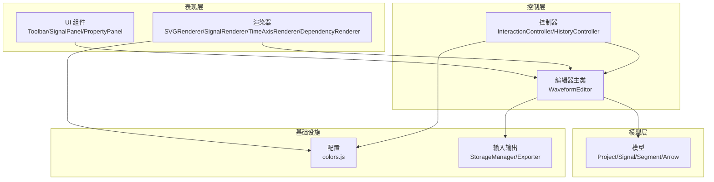
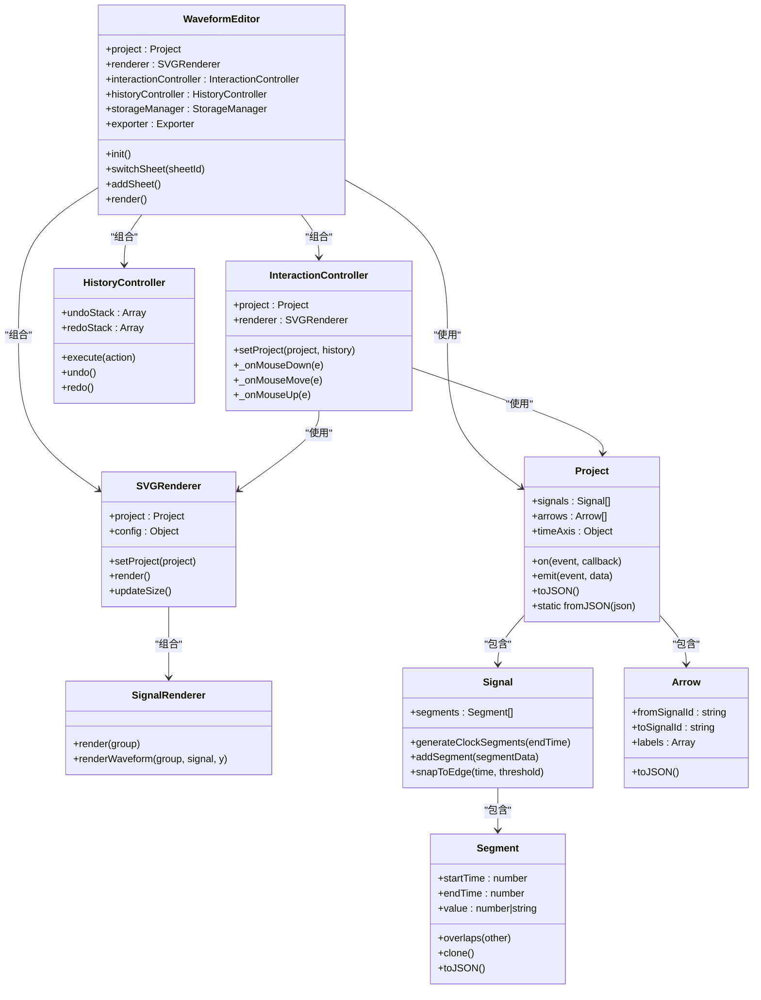
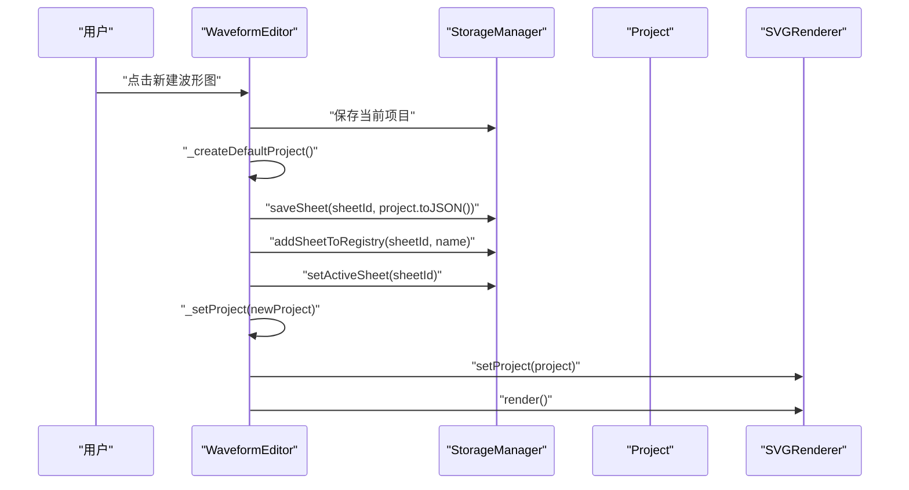
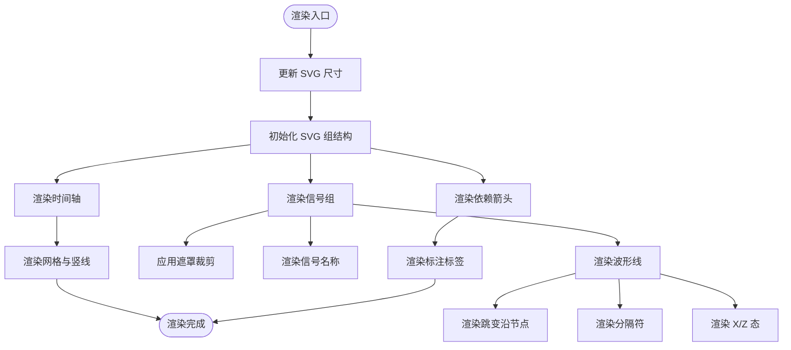
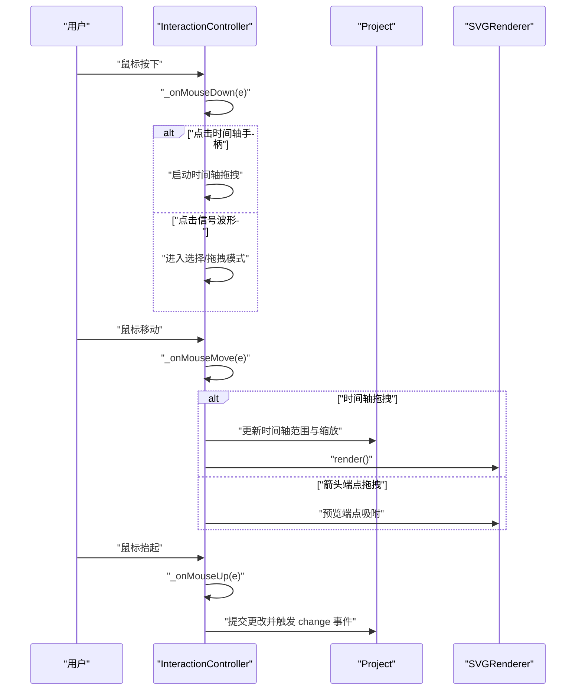
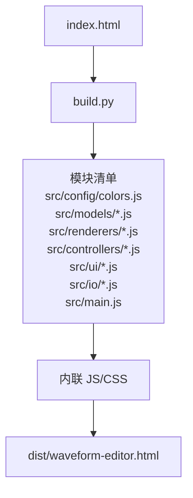

# 代码组织结构

<cite>
**本文档引用的文件**
- [src/main.js](file://src/main.js)
- [src/config/colors.js](file://src/config/colors.js)
- [src/models/Project.js](file://src/models/Project.js)
- [src/models/Signal.js](file://src/models/Signal.js)
- [src/models/Segment.js](file://src/models/Segment.js)
- [src/models/Arrow.js](file://src/models/Arrow.js)
- [src/renderers/SVGRenderer.js](file://src/renderers/SVGRenderer.js)
- [src/renderers/SignalRenderer.js](file://src/renderers/SignalRenderer.js)
- [src/controllers/InteractionController.js](file://src/controllers/InteractionController.js)
- [src/controllers/HistoryController.js](file://src/controllers/HistoryController.js)
- [src/ui/Toolbar.js](file://src/ui/Toolbar.js)
- [src/io/StorageManager.js](file://src/io/StorageManager.js)
- [build.py](file://build.py)
- [index.html](file://index.html)
- [tests/test-runner.html](file://tests/test-runner.html)
</cite>

## 目录
1. [简介](#简介)
2. [项目结构](#项目结构)
3. [核心组件](#核心组件)
4. [架构概览](#架构概览)
5. [详细组件分析](#详细组件分析)
6. [依赖分析](#依赖分析)
7. [性能考虑](#性能考虑)
8. [故障排除指南](#故障排除指南)
9. [结论](#结论)
10. [附录](#附录)

## 简介
本文件面向波形图编辑器的代码组织结构，系统阐述项目的目录设计原则、模块划分方式、分层架构以及职责分配。文档旨在帮助开发者理解大型前端项目的组织方式，掌握文件大小控制、类职责单一性、函数长度限制与注释规范等最佳实践，并提供重构指南与遗留代码迁移策略。

## 项目结构
项目采用按功能域划分的模块化组织方式，结合按层次结构的代码分层与按职责分工的组件分类，形成清晰、可维护的代码体系。

- 功能域划分
  - config：集中管理颜色、渲染配置与辅助函数，确保全局一致性与易维护性
  - models：数据模型层，封装信号、波形段、依赖箭头与项目对象
  - renderers：渲染层，负责 SVG 渲染、信号渲染、时间轴渲染与依赖箭头渲染
  - controllers：控制层，处理用户交互、历史记录与多 sheet 管理
  - io：输入输出层，负责本地存储、模板管理与项目导入导出
  - ui：界面组件层，提供工具栏、信号面板与属性面板
  - 根目录：入口文件、构建脚本与页面模板

- 层次结构
  - 表现层：UI 组件与渲染器
  - 控制层：控制器与事件处理
  - 模型层：数据模型与序列化
  - 基础设施：配置与存储

- 职责分工
  - 每个模块专注于单一职责，通过明确的接口进行协作
  - 渲染器之间解耦，通过共享的 Project 对象与配置进行通信
  - 控制器通过事件驱动与模型层交互，避免直接耦合

**图表来源**
- [src/main.js](file://src/main.js)
- [src/renderers/SVGRenderer.js](file://src/renderers/SVGRenderer.js)
- [src/controllers/InteractionController.js](file://src/controllers/InteractionController.js)
- [src/config/colors.js](file://src/config/colors.js)
- [src/io/StorageManager.js](file://src/io/StorageManager.js)

**章节来源**
- [src/main.js](file://src/main.js)
- [src/config/colors.js](file://src/config/colors.js)
- [index.html](file://index.html)

## 核心组件
本节深入分析核心组件的设计与实现，包括主编辑器类、渲染器、控制器与数据模型，解释其职责、交互关系与关键算法。

- 主编辑器类（WaveformEditor）
  - 职责：应用入口与协调者，负责初始化、生命周期管理、多 sheet 切换与事件绑定
  - 关键特性：模板加载、项目迁移、自动保存、sheet 标签渲染与交互
  - 设计要点：通过组合模式聚合渲染器、控制器与 UI 组件，统一事件源

- 渲染器体系
  - SVGRenderer：主渲染器，协调子渲染器、管理 SVG 结构与尺寸计算
  - SignalRenderer：信号波形渲染，处理跳变沿、X/Z 态、总线渲染与分隔符
  - TimeAxisRenderer：时间轴渲染与交互（由父类实现）
  - DependencyRenderer：依赖箭头渲染与交互（由父类实现）

- 控制器体系
  - InteractionController：处理鼠标与键盘交互、箭头创建与编辑、分隔符拖拽、时间轴缩放
  - HistoryController：撤销/重做栈管理，支持最大历史条目限制

- 数据模型
  - Project：项目容器，管理信号、箭头、注释与时间轴，提供事件系统
  - Signal：信号实体，支持时钟生成、段合并、吸附与分隔符
  - Segment：波形段，支持重叠检测、克隆与序列化
  - Arrow：依赖箭头，支持多标签、方向与样式配置

**章节来源**
- [src/main.js](file://src/main.js)
- [src/renderers/SVGRenderer.js](file://src/renderers/SVGRenderer.js)
- [src/renderers/SignalRenderer.js](file://src/renderers/SignalRenderer.js)
- [src/controllers/InteractionController.js](file://src/controllers/InteractionController.js)
- [src/controllers/HistoryController.js](file://src/controllers/HistoryController.js)
- [src/models/Project.js](file://src/models/Project.js)
- [src/models/Signal.js](file://src/models/Signal.js)
- [src/models/Segment.js](file://src/models/Segment.js)
- [src/models/Arrow.js](file://src/models/Arrow.js)

## 架构概览
整体架构遵循 MVC（Model-View-Controller）思想，结合事件驱动与模块化设计，确保高内聚、低耦合。

**图表来源**
- [src/main.js](file://src/main.js)
- [src/renderers/SVGRenderer.js](file://src/renderers/SVGRenderer.js)
- [src/renderers/SignalRenderer.js](file://src/renderers/SignalRenderer.js)
- [src/controllers/InteractionController.js](file://src/controllers/InteractionController.js)
- [src/controllers/HistoryController.js](file://src/controllers/HistoryController.js)
- [src/models/Project.js](file://src/models/Project.js)
- [src/models/Signal.js](file://src/models/Signal.js)
- [src/models/Segment.js](file://src/models/Segment.js)
- [src/models/Arrow.js](file://src/models/Arrow.js)

## 详细组件分析

### 主编辑器类（WaveformEditor）
- 初始化流程
  - 数据迁移与注册表加载
  - 默认项目创建与模板注入
  - 渲染器、控制器与 UI 组件初始化
  - 事件监听与自动保存注册
  - 初始渲染与 sheet 标签渲染

- 多 sheet 管理
  - 注册表结构：sheets 数组与 activeSheetId
  - sheet 切换、新增、删除与重命名
  - 项目变更监听与自动保存

- 关键交互
  - 信号添加、分隔符插入、撤销/重做
  - 项目文件导入导出与模板管理
  - 窗口大小变化响应与面板宽度同步

**图表来源**
- [src/main.js](file://src/main.js)
- [src/io/StorageManager.js](file://src/io/StorageManager.js)
- [src/renderers/SVGRenderer.js](file://src/renderers/SVGRenderer.js)

**章节来源**
- [src/main.js](file://src/main.js)
- [src/io/StorageManager.js](file://src/io/StorageManager.js)

### 渲染器（SVGRenderer 与 SignalRenderer）
- SVGRenderer
  - SVG 结构初始化：defs、主组、时间轴组、信号组、交互层、依赖组
  - 尺寸计算：根据信号数量、时间轴范围与边距动态计算 SVG 尺寸
  - 裁剪与网格：波形区域裁剪路径、水平网格线与时钟周期竖线
  - 项目名称渲染：SVG 文本与可编辑输入框

- SignalRenderer
  - 信号名称与背景渲染
  - 波形线渲染：跳变沿、X/Z 态、总线渲染与数值标签
  - 分隔符渲染：波浪斜线与命中区域
  - 边沿节点：用于交互拖拽的窄矩形命中区域

**图表来源**
- [src/renderers/SVGRenderer.js](file://src/renderers/SVGRenderer.js)
- [src/renderers/SignalRenderer.js](file://src/renderers/SignalRenderer.js)

**章节来源**
- [src/renderers/SVGRenderer.js](file://src/renderers/SVGRenderer.js)
- [src/renderers/SignalRenderer.js](file://src/renderers/SignalRenderer.js)

### 控制器（InteractionController 与 HistoryController）
- InteractionController
  - 事件监听：鼠标按下、移动、抬起与键盘事件
  - 交互模式：时间轴缩放拖拽、箭头创建与端点拖拽、分隔符拖拽、边沿节点拖拽
  - 选择与状态：信号选择、箭头选择与属性面板联动
  - 边界滚动：时间轴拖拽边缘滚动优化

- HistoryController
  - 撤销/重做栈：支持最大历史条目限制
  - 动作执行：统一的 execute/undo/redo 接口

**图表来源**
- [src/controllers/InteractionController.js](file://src/controllers/InteractionController.js)
- [src/controllers/HistoryController.js](file://src/controllers/HistoryController.js)

**章节来源**
- [src/controllers/InteractionController.js](file://src/controllers/InteractionController.js)
- [src/controllers/HistoryController.js](file://src/controllers/HistoryController.js)

### 数据模型（Project、Signal、Segment、Arrow）
- Project
  - 事件系统：on/off/emit 提供统一变更通知
  - 序列化：toJSON/fromJSON 支持持久化与导入导出
  - 时间轴转换：timeToX/xToTime 实现时间与像素互转

- Signal
  - 时钟生成：generateClockSegments 根据周期、相位与占空比生成段
  - 段合并：addSegment 自动合并相邻同值段
  - 吸附：snapToEdge 将时间吸附到最近跳变沿

- Segment
  - 重叠检测：overlaps 判断时间区间重叠
  - 克隆：clone 创建独立副本

- Arrow
  - 多标签：支持多个标注标签与偏移
  - 兼容性：向后兼容旧格式的 text/textOffset

**章节来源**
- [src/models/Project.js](file://src/models/Project.js)
- [src/models/Signal.js](file://src/models/Signal.js)
- [src/models/Segment.js](file://src/models/Segment.js)
- [src/models/Arrow.js](file://src/models/Arrow.js)

## 依赖分析
项目采用模块化导入与导出机制，通过集中配置与构建脚本实现依赖管理与打包优化。

- 模块导入
  - 主入口文件集中导入所有核心模块，确保依赖顺序与版本号缓存
  - 渲染器与控制器分别依赖配置模块与模型模块

- 构建脚本
  - build.py 读取 index.html，替换 CSS 与 JS 引用占位符
  - 移除模块导入语句与导出关键字，内联所有 JS/CSS
  - 支持模板注入，生成独立 HTML 文件

**图表来源**
- [build.py](file://build.py)
- [index.html](file://index.html)

**章节来源**
- [build.py](file://build.py)
- [index.html](file://index.html)

## 性能考虑
- 渲染性能
  - 裁剪与遮罩：通过 clipPath 限制波形绘制区域，减少不必要的重绘
  - 边缘滚动：时间轴拖拽时的边缘滚动优化，避免频繁重排
  - 事件节流：窗口大小变化时使用定时器防抖，降低渲染频率

- 数据结构与算法
  - Segment 重叠检测：O(n) 检测与分割，配合合并算法保持段数量可控
  - Signal 段合并：相邻同值段合并，减少渲染节点数量
  - 事件系统：轻量级发布订阅，避免深度嵌套回调

- 存储与模板
  - localStorage 批量读写，减少 I/O 次数
  - 模板缓存：模板 JSON 存储于 localStorage，避免重复加载

## 故障排除指南
- 初始化失败
  - 现象：找不到 SVG 元素或项目加载异常
  - 排查：确认 index.html 中 SVG 容器存在，检查模板加载与默认项目生成逻辑

- 渲染异常
  - 现象：波形线越界或网格不显示
  - 排查：检查 updateSize 与裁剪路径设置，确认时间轴范围与缩放比例

- 交互问题
  - 现象：箭头创建失败或端点拖拽无效
  - 排查：验证事件监听绑定、吸附逻辑与预览渲染

- 撤销/重做失效
  - 现象：无法撤销或重做
  - 排查：确认动作对象包含 undo/redo 方法，检查历史栈状态

**章节来源**
- [src/main.js](file://src/main.js)
- [src/renderers/SVGRenderer.js](file://src/renderers/SVGRenderer.js)
- [src/controllers/InteractionController.js](file://src/controllers/InteractionController.js)
- [src/controllers/HistoryController.js](file://src/controllers/HistoryController.js)

## 结论
本项目通过功能域划分、层次化架构与职责分离，实现了清晰的代码组织与良好的可维护性。配置集中化、模型数据化、渲染模块化与控制器事件化的设计，使得系统具备较强的扩展性与稳定性。建议在后续开发中继续坚持单一职责原则、保持模块间松耦合，并完善单元测试覆盖，以进一步提升代码质量与开发效率。

## 附录
- 测试框架
  - 单元测试：基于 test-runner.html 的简单测试框架，覆盖 Segment、Signal、Project 的核心行为
  - 建议：引入更完善的测试框架（如 Jest/Vitest）与覆盖率统计

- 最佳实践清单
  - 文件大小控制：单文件不超过 500 行，复杂逻辑拆分为子模块
  - 类职责单一性：每个类只负责一个核心功能域
  - 函数长度限制：单函数不超过 50 行，长流程拆分为私有方法
  - 注释规范：公共 API 使用 JSDoc，复杂算法添加步骤说明
  - 错误处理：统一异常抛出与捕获，提供有意义的错误信息

- 重构指南
  - 模块拆分：将大文件拆分为多个小文件，明确导出接口
  - 依赖抽象：通过接口或抽象基类降低具体实现耦合
  - 事件驱动：将同步调用改为事件通知，提升解耦程度
  - 性能优化：引入虚拟滚动、懒加载与缓存策略

**章节来源**
- [tests/test-runner.html](file://tests/test-runner.html)