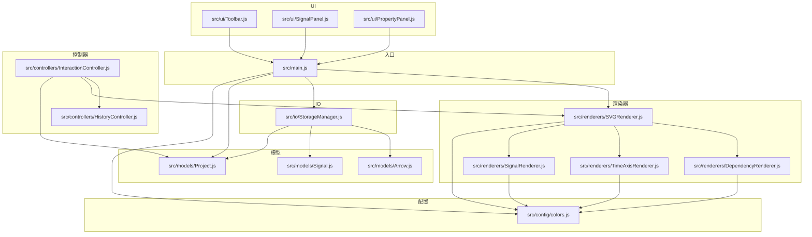
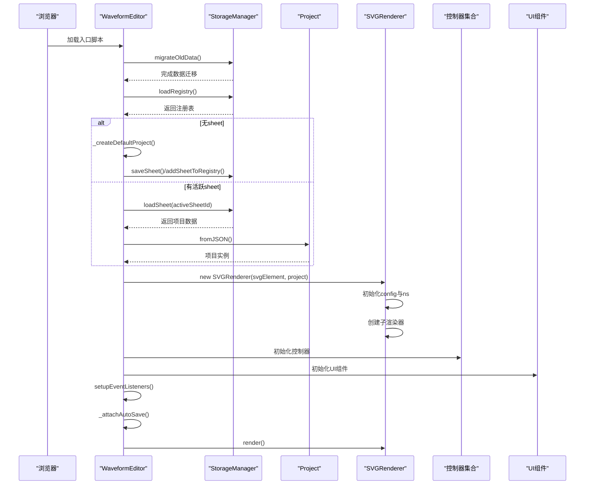
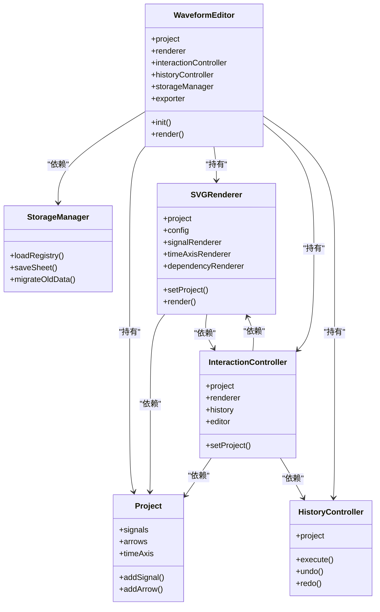
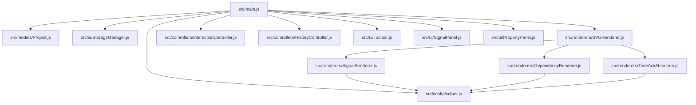
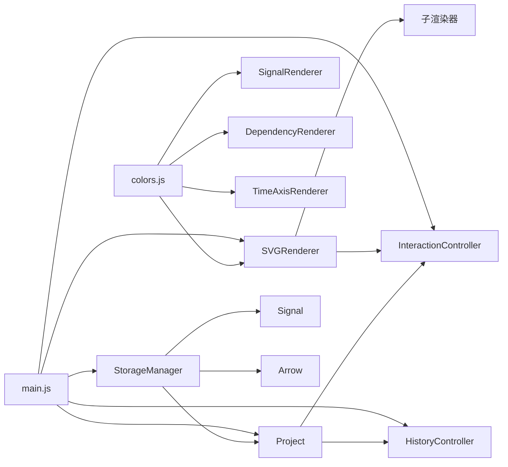

# 依赖管理策略

<cite>
**本文档引用的文件**
- [src/main.js](file://src/main.js)
- [src/config/colors.js](file://src/config/colors.js)
- [src/renderers/SVGRenderer.js](file://src/renderers/SVGRenderer.js)
- [src/renderers/DependencyRenderer.js](file://src/renderers/DependencyRenderer.js)
- [src/renderers/SignalRenderer.js](file://src/renderers/SignalRenderer.js)
- [src/renderers/TimeAxisRenderer.js](file://src/renderers/TimeAxisRenderer.js)
- [src/controllers/InteractionController.js](file://src/controllers/InteractionController.js)
- [src/controllers/HistoryController.js](file://src/controllers/HistoryController.js)
- [src/models/Project.js](file://src/models/Project.js)
- [src/models/Signal.js](file://src/models/Signal.js)
- [src/models/Arrow.js](file://src/models/Arrow.js)
- [src/io/StorageManager.js](file://src/io/StorageManager.js)
- [src/ui/Toolbar.js](file://src/ui/Toolbar.js)
- [src/ui/SignalPanel.js](file://src/ui/SignalPanel.js)
- [src/ui/PropertyPanel.js](file://src/ui/PropertyPanel.js)
</cite>

## 目录
1. [简介](#简介)
2. [项目结构](#项目结构)
3. [核心组件](#核心组件)
4. [架构概览](#架构概览)
5. [详细组件分析](#详细组件分析)
6. [依赖分析](#依赖分析)
7. [性能考虑](#性能考虑)
8. [故障排除指南](#故障排除指南)
9. [结论](#结论)

## 简介

本文件针对波形图编辑器的依赖管理策略进行全面分析，重点阐述以下方面：

- 依赖注入机制：模块间的依赖声明、初始化顺序控制以及循环依赖避免策略
- ES6 模块系统使用：命名导入导出、默认导入导出和动态导入等技术
- 依赖图谱与模块加载流程：应用启动时的依赖解析过程
- 依赖管理最佳实践：延迟加载、按需导入和依赖缓存等优化策略
- 第三方依赖引入原则与零依赖设计理念的实现

## 项目结构

波形图编辑器采用基于功能域的模块组织方式，主要目录结构如下：
- config：集中管理颜色、渲染配置等全局配置
- controllers：业务控制层，负责用户交互与历史记录
- io：数据持久化与导入导出
- models：领域模型，描述项目、信号、箭头等核心实体
- renderers：渲染器，负责 SVG 渲染与子渲染器协调
- ui：用户界面组件
- main.js：应用入口，负责模块装配与初始化

**图表来源**
- [src/main.js:1-132](file://src/main.js#L1-L132)
- [src/config/colors.js:1-83](file://src/config/colors.js#L1-L83)
- [src/renderers/SVGRenderer.js:1-100](file://src/renderers/SVGRenderer.js#L1-L100)
- [src/renderers/SignalRenderer.js:1-50](file://src/renderers/SignalRenderer.js#L1-L50)
- [src/renderers/TimeAxisRenderer.js:1-78](file://src/renderers/TimeAxisRenderer.js#L1-L78)
- [src/renderers/DependencyRenderer.js:1-84](file://src/renderers/DependencyRenderer.js#L1-L84)
- [src/controllers/InteractionController.js:1-50](file://src/controllers/InteractionController.js#L1-L50)
- [src/controllers/HistoryController.js:1-56](file://src/controllers/HistoryController.js#L1-L56)
- [src/models/Project.js:1-35](file://src/models/Project.js#L1-L35)
- [src/models/Signal.js:1-30](file://src/models/Signal.js#L1-L30)
- [src/models/Arrow.js:1-45](file://src/models/Arrow.js#L1-L45)
- [src/io/StorageManager.js:1-368](file://src/io/StorageManager.js#L1-L368)
- [src/ui/Toolbar.js:1-6](file://src/ui/Toolbar.js#L1-L6)
- [src/ui/SignalPanel.js:1-43](file://src/ui/SignalPanel.js#L1-L43)
- [src/ui/PropertyPanel.js:1-30](file://src/ui/PropertyPanel.js#L1-L30)

**章节来源**
- [src/main.js:1-132](file://src/main.js#L1-L132)
- [src/config/colors.js:1-83](file://src/config/colors.js#L1-L83)

## 核心组件

本节深入分析关键组件及其依赖关系，重点说明依赖注入与初始化顺序。

- WaveformEditor（应用主类）
  - 依赖：Project、SVGRenderer、InteractionController、HistoryController、StorageManager、Exporter、UI 组件
  - 初始化顺序：StorageManager → Project → SVGRenderer → 控制器 → UI → 导出器
  - 关键职责：项目生命周期管理、事件绑定、渲染调度

- SVGRenderer（主渲染器）
  - 依赖：SignalRenderer、TimeAxisRenderer、DependencyRenderer、COLORS、RENDER_CONFIG、ARROW_CONFIG
  - 初始化顺序：必须在子渲染器创建前完成 config 与 ns 的初始化
  - 关键职责：协调各子渲染器、管理 SVG 结构、尺寸计算

- InteractionController（交互控制器）
  - 依赖：Project、SVGRenderer、HistoryController、Editor
  - 关键职责：鼠标事件处理、拖拽交互、箭头创建与编辑、分隔符处理

- StorageManager（存储管理）
  - 依赖：localStorage（浏览器 API）
  - 关键职责：多 sheet 注册表管理、项目数据持久化、模板管理、导入导出

**章节来源**
- [src/main.js:21-132](file://src/main.js#L21-L132)
- [src/renderers/SVGRenderer.js:10-54](file://src/renderers/SVGRenderer.js#L10-L54)
- [src/controllers/InteractionController.js:6-50](file://src/controllers/InteractionController.js#L6-L50)
- [src/io/StorageManager.js:1-131](file://src/io/StorageManager.js#L1-L131)

## 架构概览

应用启动时的依赖解析与初始化流程如下：

**图表来源**
- [src/main.js:49-132](file://src/main.js#L49-L132)
- [src/renderers/SVGRenderer.js:15-40](file://src/renderers/SVGRenderer.js#L15-L40)
- [src/io/StorageManager.js:138-164](file://src/io/StorageManager.js#L138-L164)

**章节来源**
- [src/main.js:49-132](file://src/main.js#L49-L132)

## 详细组件分析

### 依赖注入与初始化顺序控制

- 模块间依赖声明
  - main.js 作为装配中心，统一导入并实例化各模块
  - 渲染器之间通过组合关系协作，不形成循环依赖
  - 控制器依赖于模型与渲染器，形成清晰的单向依赖链

- 初始化顺序控制
  - SVGRenderer 的 config 与命名空间必须在子渲染器创建前完成
  - WaveformEditor 的渲染器依赖于项目数据，必须在控制器与 UI 之前创建
  - StorageManager 的数据迁移与注册表加载应在项目实例化之前完成

- 循环依赖避免策略
  - 通过构造函数参数传递依赖，避免模块内部相互导入
  - 使用弱耦合接口（如 Editor 作为回调载体），减少直接引用
  - 将共享配置集中到 config/colors.js，避免跨模块重复导入

**图表来源**
- [src/main.js:21-132](file://src/main.js#L21-L132)
- [src/renderers/SVGRenderer.js:10-54](file://src/renderers/SVGRenderer.js#L10-L54)
- [src/controllers/InteractionController.js:6-50](file://src/controllers/InteractionController.js#L6-L50)
- [src/controllers/HistoryController.js:5-56](file://src/controllers/HistoryController.js#L5-L56)
- [src/models/Project.js:8-35](file://src/models/Project.js#L8-L35)
- [src/io/StorageManager.js:1-368](file://src/io/StorageManager.js#L1-L368)

**章节来源**
- [src/main.js:21-132](file://src/main.js#L21-L132)
- [src/renderers/SVGRenderer.js:10-54](file://src/renderers/SVGRenderer.js#L10-L54)
- [src/controllers/InteractionController.js:6-50](file://src/controllers/InteractionController.js#L6-L50)

### ES6 模块系统使用

- 命名导入导出
  - config/colors.js 提供 COLORS、RENDER_CONFIG、ARROW_CONFIG 等命名导出
  - 各渲染器通过 import { COLORS, RENDER_CONFIG } from '../config/colors.js' 使用

- 默认导入导出
  - 模型类（Project、Signal、Arrow）采用默认导出，便于简洁导入
  - 控制器与渲染器采用命名导出，支持按需导入

- 动态导入
  - main.js 中使用动态导入版本查询参数（?v=xx）实现缓存失效控制
  - 适用于需要强制刷新缓存的场景

- 模块加载策略
  - 入口模块集中导入，便于统一管理依赖版本
  - 子模块按需使用，避免不必要的加载

**章节来源**
- [src/config/colors.js:5-50](file://src/config/colors.js#L5-L50)
- [src/main.js:4-16](file://src/main.js#L4-L16)

### 依赖图谱与模块加载流程

应用启动时的完整依赖图谱如下：

**图表来源**
- [src/main.js:4-16](file://src/main.js#L4-L16)
- [src/renderers/SVGRenderer.js:5-8](file://src/renderers/SVGRenderer.js#L5-L8)
- [src/renderers/SignalRenderer.js:4](file://src/renderers/SignalRenderer.js#L4)
- [src/renderers/DependencyRenderer.js:5](file://src/renderers/DependencyRenderer.js#L5)
- [src/renderers/TimeAxisRenderer.js:4](file://src/renderers/TimeAxisRenderer.js#L4)

**章节来源**
- [src/main.js:4-16](file://src/main.js#L4-L16)

### 依赖管理最佳实践

- 延迟加载
  - UI 组件在首次需要时才进行 DOM 查询与初始化
  - 通过 render 方法按需渲染，避免不必要的 DOM 操作

- 按需导入
  - 使用动态导入版本参数（?v=xx）控制缓存失效
  - 对于大型模块，考虑在运行时按需加载

- 依赖缓存
  - 配置信息集中管理，避免重复计算
  - 渲染器内部维护必要的缓存（如裁剪路径）

- 循环依赖避免
  - 通过构造函数参数传递依赖，避免模块间直接相互导入
  - 使用弱耦合接口（如 Editor 作为回调载体）

**章节来源**
- [src/main.js:49-132](file://src/main.js#L49-L132)
- [src/renderers/SVGRenderer.js:194-243](file://src/renderers/SVGRenderer.js#L194-L243)

## 依赖分析

模块间的依赖关系与耦合度分析：

- 低耦合设计
  - 渲染器之间通过 SVGRenderer 协调，避免直接相互依赖
  - 控制器与渲染器通过接口解耦，便于替换与测试

- 依赖方向
  - 单向依赖链：main.js → models → renderers → controllers → ui
  - 配置层（colors.js）被上层模块依赖，但不依赖任何模块

- 循环依赖风险
  - 通过参数注入避免循环引用
  - 渲染器之间通过主渲染器协调，不直接相互引用

**图表来源**
- [src/config/colors.js:1-83](file://src/config/colors.js#L1-L83)
- [src/renderers/SVGRenderer.js:5-36](file://src/renderers/SVGRenderer.js#L5-L36)
- [src/controllers/InteractionController.js:1-50](file://src/controllers/InteractionController.js#L1-L50)
- [src/controllers/HistoryController.js:1-56](file://src/controllers/HistoryController.js#L1-L56)
- [src/io/StorageManager.js:1-368](file://src/io/StorageManager.js#L1-L368)
- [src/main.js:4-16](file://src/main.js#L4-L16)

**章节来源**
- [src/config/colors.js:1-83](file://src/config/colors.js#L1-L83)
- [src/renderers/SVGRenderer.js:5-36](file://src/renderers/SVGRenderer.js#L5-L36)
- [src/controllers/InteractionController.js:1-50](file://src/controllers/InteractionController.js#L1-L50)

## 性能考虑

- 渲染性能优化
  - 通过裁剪路径限制波形绘制范围，避免超出时间轴边界
  - 使用 requestAnimationFrame 进行边缘滚动，提升交互流畅度
  - 合并相邻同值段，减少 SVG 路径数量

- 内存管理
  - 使用 WeakMap/Map 缓存计算结果（如偏移映射）
  - 及时清理事件监听器与 DOM 引用

- 加载性能
  - 配置信息集中管理，避免重复计算
  - 按需渲染 UI 组件，减少初始 DOM 操作

## 故障排除指南

常见问题与解决方案：

- 项目加载失败
  - 检查 StorageManager 的 loadSheet 返回值
  - 确认 Project.fromJSON 的数据格式正确性

- 渲染异常
  - 验证 SVGRenderer 的 config 初始化顺序
  - 检查子渲染器的 clearGroup 调用时机

- 交互失效
  - 确认 InteractionController 的事件监听器绑定
  - 检查鼠标坐标转换与吸附逻辑

**章节来源**
- [src/main.js:73-84](file://src/main.js#L73-L84)
- [src/renderers/SVGRenderer.js:59-100](file://src/renderers/SVGRenderer.js#L59-L100)
- [src/controllers/InteractionController.js:52-82](file://src/controllers/InteractionController.js#L52-L82)

## 结论

本项目在依赖管理方面体现了以下特点：

- 清晰的模块边界与单向依赖链，避免了复杂的循环依赖
- 通过构造函数参数注入实现松耦合，便于测试与维护
- 集中式配置管理与按需渲染策略提升了性能与可维护性
- ES6 模块系统的规范使用确保了依赖关系的明确性

建议在后续开发中继续保持这种模块化设计，并考虑引入依赖注入容器以进一步简化复杂依赖的管理。