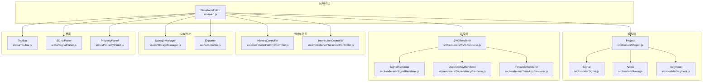
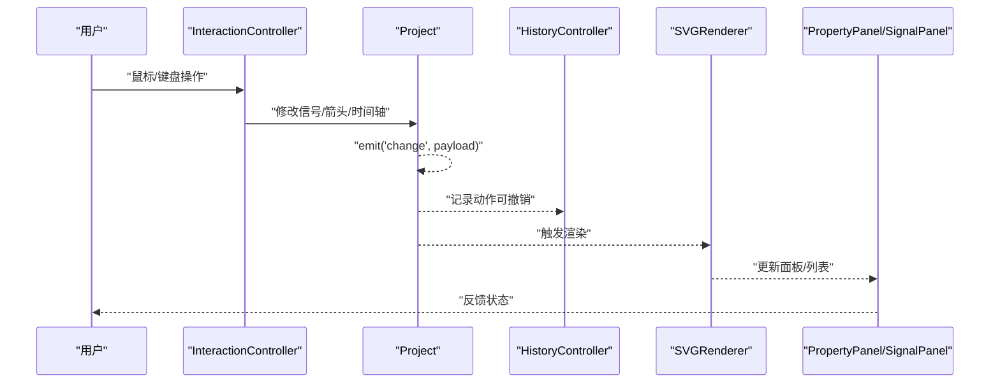
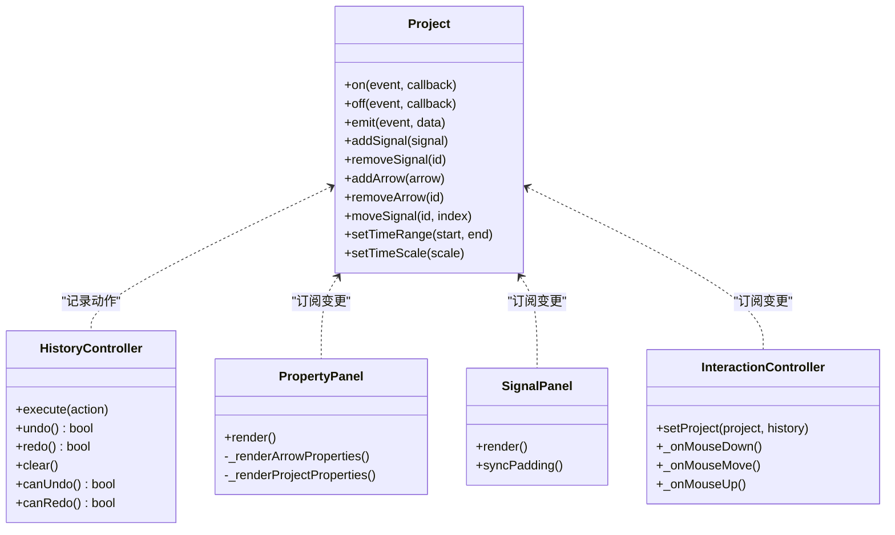
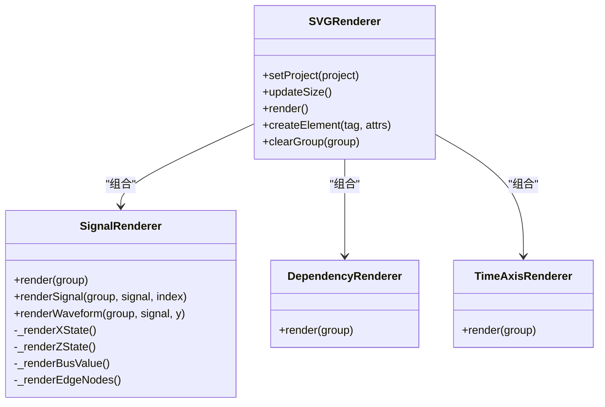
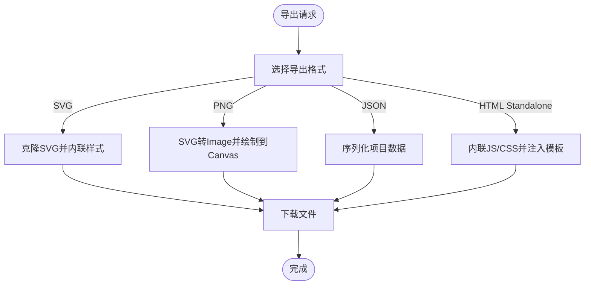
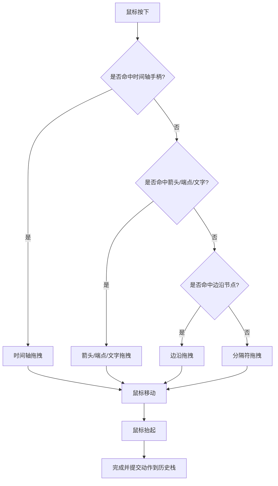
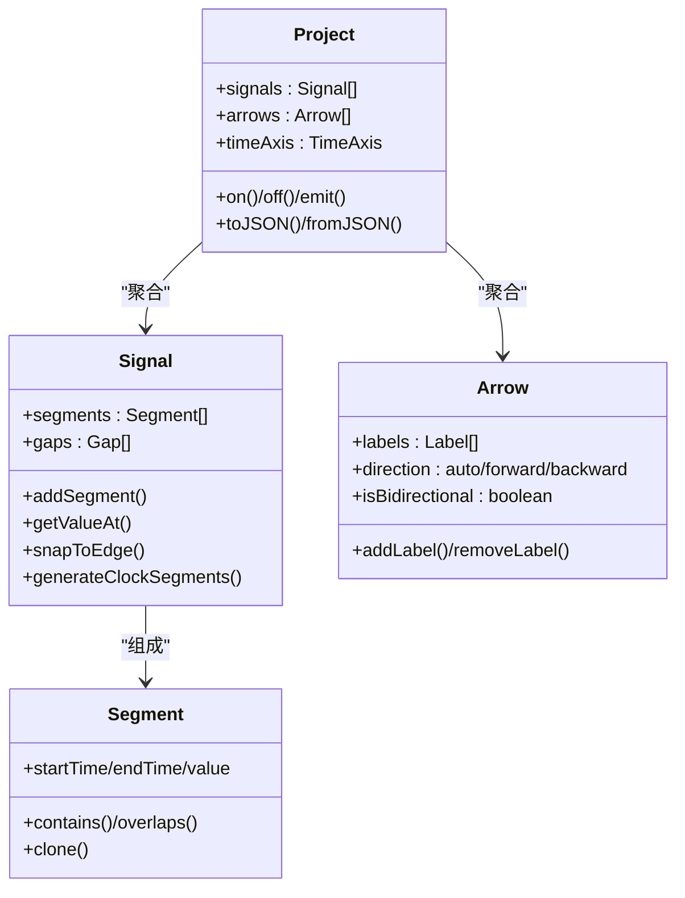
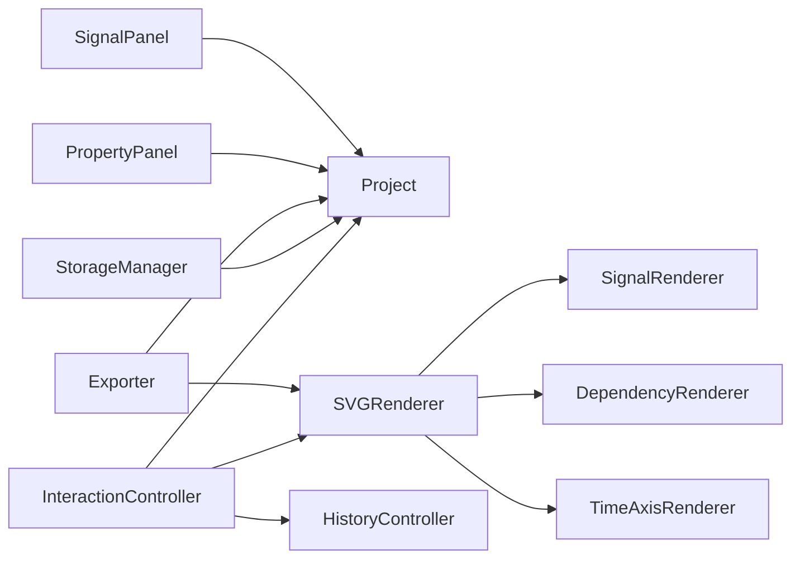

# 接口设计规范

<cite>
**本文档引用的文件**
- [src/main.js](file://src/main.js)
- [src/controllers/HistoryController.js](file://src/controllers/HistoryController.js)
- [src/controllers/InteractionController.js](file://src/controllers/InteractionController.js)
- [src/models/Project.js](file://src/models/Project.js)
- [src/models/Signal.js](file://src/models/Signal.js)
- [src/models/Arrow.js](file://src/models/Arrow.js)
- [src/models/Segment.js](file://src/models/Segment.js)
- [src/renderers/SVGRenderer.js](file://src/renderers/SVGRenderer.js)
- [src/renderers/SignalRenderer.js](file://src/renderers/SignalRenderer.js)
- [src/renderers/DependencyRenderer.js](file://src/renderers/DependencyRenderer.js)
- [src/renderers/TimeAxisRenderer.js](file://src/renderers/TimeAxisRenderer.js)
- [src/io/StorageManager.js](file://src/io/StorageManager.js)
- [src/io/Exporter.js](file://src/io/Exporter.js)
- [src/ui/Toolbar.js](file://src/ui/Toolbar.js)
- [src/ui/SignalPanel.js](file://src/ui/SignalPanel.js)
- [src/ui/PropertyPanel.js](file://src/ui/PropertyPanel.js)
- [src/config/colors.js](file://src/config/colors.js)
</cite>

## 目录
1. [简介](#简介)
2. [项目结构](#项目结构)
3. [核心组件](#核心组件)
4. [架构总览](#架构总览)
5. [详细组件分析](#详细组件分析)
6. [依赖分析](#依赖分析)
7. [性能考量](#性能考量)
8. [故障排查指南](#故障排查指南)
9. [结论](#结论)
10. [附录](#附录)

## 简介
本规范面向波形图编辑器的接口设计，旨在建立统一的API命名、参数传递与返回值约定，明确核心设计模式（观察者事件系统、工厂/策略思想在渲染与导出中的体现），并提供接口文档模板、安全与错误处理建议以及版本管理与兼容策略。文档以代码为依据，结合可视化图示，帮助开发者设计清晰、易用且稳定的公共接口。

## 项目结构
项目采用“模型-渲染器-控制器-IO-UI”分层组织，核心对象围绕 Project、Signal、Arrow、Segment 构建，渲染器负责SVG输出，控制器协调交互，IO负责持久化与导出，UI负责面板与工具条。

图表来源
- [src/main.js:1-132](file://src/main.js#L1-L132)
- [src/models/Project.js:1-245](file://src/models/Project.js#L1-L245)
- [src/renderers/SVGRenderer.js:1-100](file://src/renderers/SVGRenderer.js#L1-L100)
- [src/controllers/HistoryController.js:1-56](file://src/controllers/HistoryController.js#L1-L56)
- [src/controllers/InteractionController.js:1-80](file://src/controllers/InteractionController.js#L1-L80)
- [src/io/StorageManager.js:1-130](file://src/io/StorageManager.js#L1-L130)
- [src/io/Exporter.js:1-60](file://src/io/Exporter.js#L1-L60)
- [src/ui/Toolbar.js:1-6](file://src/ui/Toolbar.js#L1-L6)
- [src/ui/SignalPanel.js:1-67](file://src/ui/SignalPanel.js#L1-L67)
- [src/ui/PropertyPanel.js:1-50](file://src/ui/PropertyPanel.js#L1-L50)

章节来源
- [src/main.js:1-132](file://src/main.js#L1-L132)
- [src/models/Project.js:1-245](file://src/models/Project.js#L1-L245)
- [src/renderers/SVGRenderer.js:1-100](file://src/renderers/SVGRenderer.js#L1-L100)

## 核心组件
- 事件系统（观察者模式）：Project 提供 on/off/emit 事件接口，HistoryController 提供撤销/重做动作栈，UI与控制器通过事件驱动渲染与状态同步。
- 工厂/策略思想：渲染器通过配置集中管理渲染行为（颜色、布局、箭头样式），导出器根据目标格式（PNG/SVG/JSON/HTML Standalone）选择不同策略。
- 参数与返回值约定：多数方法采用“选项对象”传参，返回值遵循“无返回值/布尔/对象/Promise”的统一风格，便于链式调用与错误处理。

章节来源
- [src/models/Project.js:172-202](file://src/models/Project.js#L172-L202)
- [src/controllers/HistoryController.js:13-56](file://src/controllers/HistoryController.js#L13-L56)
- [src/renderers/SVGRenderer.js:284-314](file://src/renderers/SVGRenderer.js#L284-L314)
- [src/io/Exporter.js:15-96](file://src/io/Exporter.js#L15-L96)

## 架构总览
编辑器以 WaveformEditor 为中心，协调 Project、渲染器、控制器、IO与UI。事件驱动贯穿全局：模型变更通过 Project.emit('change', payload) 通知订阅者，渲染器与UI响应更新。

图表来源
- [src/controllers/InteractionController.js:465-567](file://src/controllers/InteractionController.js#L465-L567)
- [src/models/Project.js:199-202](file://src/models/Project.js#L199-L202)
- [src/controllers/HistoryController.js:13-42](file://src/controllers/HistoryController.js#L13-L42)
- [src/renderers/SVGRenderer.js:284-314](file://src/renderers/SVGRenderer.js#L284-L314)
- [src/ui/PropertyPanel.js:32-67](file://src/ui/PropertyPanel.js#L32-L67)

## 详细组件分析

### 事件系统与观察者模式
- Project.on/off/emit：提供轻量事件总线，支持多回调订阅；事件负载包含操作类型与上下文，便于精确更新。
- HistoryController.execute/undo/redo：封装可撤销动作，维护两个栈，支持清理与查询能力。
- UI与控制器订阅事件：PropertyPanel/SignalPanel/InteractionController/Exporter 响应 Project.change 事件进行局部更新。

图表来源
- [src/models/Project.js:172-202](file://src/models/Project.js#L172-L202)
- [src/controllers/HistoryController.js:13-56](file://src/controllers/HistoryController.js#L13-L56)
- [src/ui/PropertyPanel.js:32-237](file://src/ui/PropertyPanel.js#L32-L237)
- [src/ui/SignalPanel.js:45-164](file://src/ui/SignalPanel.js#L45-L164)
- [src/controllers/InteractionController.js:29-50](file://src/controllers/InteractionController.js#L29-L50)

章节来源
- [src/models/Project.js:172-202](file://src/models/Project.js#L172-L202)
- [src/controllers/HistoryController.js:13-56](file://src/controllers/HistoryController.js#L13-L56)
- [src/ui/PropertyPanel.js:32-237](file://src/ui/PropertyPanel.js#L32-L237)
- [src/ui/SignalPanel.js:45-164](file://src/ui/SignalPanel.js#L45-L164)
- [src/controllers/InteractionController.js:29-50](file://src/controllers/InteractionController.js#L29-L50)

### 渲染器与策略模式
- SVGRenderer：协调 SignalRenderer/DependencyRenderer/TimeAxisRenderer，统一尺寸、裁剪与视口，提供主渲染入口。
- SignalRenderer：按信号类型（普通/时钟/总线）与电平值（0/1/X/Z）渲染波形，支持跳变沿、X/Z态、总线填充与边框。
- DependencyRenderer/TimeAxisRenderer：分别负责依赖箭头与时间轴渲染，解耦职责。
- 配置集中化：colors.js 提供 COLORS、RENDER_CONFIG、ARROW_CONFIG，便于主题与布局定制。

图表来源
- [src/renderers/SVGRenderer.js:42-314](file://src/renderers/SVGRenderer.js#L42-L314)
- [src/renderers/SignalRenderer.js:22-501](file://src/renderers/SignalRenderer.js#L22-L501)
- [src/renderers/DependencyRenderer.js](file://src/renderers/DependencyRenderer.js)
- [src/renderers/TimeAxisRenderer.js](file://src/renderers/TimeAxisRenderer.js)
- [src/config/colors.js:1-83](file://src/config/colors.js#L1-L83)

章节来源
- [src/renderers/SVGRenderer.js:42-314](file://src/renderers/SVGRenderer.js#L42-L314)
- [src/renderers/SignalRenderer.js:22-501](file://src/renderers/SignalRenderer.js#L22-L501)
- [src/config/colors.js:1-83](file://src/config/colors.js#L1-L83)

### IO与导出：工厂/策略思想
- StorageManager：多 sheet 注册表管理、导入导出、模板保存与迁移，提供兼容旧格式的能力。
- Exporter：根据目标格式（SVG/PNG/JSON/HTML Standalone）选择不同策略，内联样式与资源，保证独立可运行。

图表来源
- [src/io/Exporter.js:15-96](file://src/io/Exporter.js#L15-L96)
- [src/io/Exporter.js:98-298](file://src/io/Exporter.js#L98-L298)
- [src/io/StorageManager.js:168-273](file://src/io/StorageManager.js#L168-L273)

章节来源
- [src/io/Exporter.js:15-96](file://src/io/Exporter.js#L15-L96)
- [src/io/Exporter.js:98-298](file://src/io/Exporter.js#L98-L298)
- [src/io/StorageManager.js:168-273](file://src/io/StorageManager.js#L168-L273)

### 交互控制器：复杂逻辑与状态机
- InteractionController：处理鼠标/键盘事件，支持时间轴拖拽、信号边沿拖拽、箭头创建/端点/文字拖拽、分隔符拖拽、删除等。
- 状态机：内部维护多种拖拽状态（timeAxisDrag、arrowEndpointDrag、arrowTextDrag、gapDrag 等），通过状态切换与预览实现流畅交互。

图表来源
- [src/controllers/InteractionController.js:84-337](file://src/controllers/InteractionController.js#L84-L337)
- [src/controllers/InteractionController.js:342-401](file://src/controllers/InteractionController.js#L342-L401)
- [src/controllers/HistoryController.js:13-42](file://src/controllers/HistoryController.js#L13-L42)

章节来源
- [src/controllers/InteractionController.js:84-337](file://src/controllers/InteractionController.js#L84-L337)
- [src/controllers/InteractionController.js:342-401](file://src/controllers/InteractionController.js#L342-L401)
- [src/controllers/HistoryController.js:13-42](file://src/controllers/HistoryController.js#L13-L42)

### 模型层：数据结构与算法
- Project：聚合信号、箭头、时间轴，提供事件发布与序列化。
- Signal：波形段集合，支持合并相邻同值段、吸附跳变沿、时钟段生成。
- Arrow：依赖箭头，支持多标签、方向与双向配置。
- Segment：波形段，验证区间合法性，支持重叠检测与克隆。

图表来源
- [src/models/Project.js:8-34](file://src/models/Project.js#L8-L34)
- [src/models/Signal.js:14-36](file://src/models/Signal.js#L14-L36)
- [src/models/Arrow.js:6-45](file://src/models/Arrow.js#L6-L45)
- [src/models/Segment.js:12-19](file://src/models/Segment.js#L12-L19)

章节来源
- [src/models/Project.js:8-34](file://src/models/Project.js#L8-L34)
- [src/models/Signal.js:14-36](file://src/models/Signal.js#L14-L36)
- [src/models/Arrow.js:6-45](file://src/models/Arrow.js#L6-L45)
- [src/models/Segment.js:12-19](file://src/models/Segment.js#L12-L19)

## 依赖分析
- 松耦合：控制器通过 Project 事件与渲染器解耦；渲染器通过配置集中化降低硬编码。
- 循环依赖：未发现循环依赖；若新增模块需谨慎引入双向依赖。
- 外部依赖：依赖浏览器DOM与Canvas API；导出HTML时依赖静态资源内联。

图表来源
- [src/controllers/InteractionController.js:6-27](file://src/controllers/InteractionController.js#L6-L27)
- [src/renderers/SVGRenderer.js:33-54](file://src/renderers/SVGRenderer.js#L33-L54)
- [src/io/StorageManager.js](file://src/io/StorageManager.js)
- [src/io/Exporter.js](file://src/io/Exporter.js)
- [src/ui/PropertyPanel.js](file://src/ui/PropertyPanel.js)
- [src/ui/SignalPanel.js](file://src/ui/SignalPanel.js)

章节来源
- [src/controllers/InteractionController.js:6-27](file://src/controllers/InteractionController.js#L6-L27)
- [src/renderers/SVGRenderer.js:33-54](file://src/renderers/SVGRenderer.js#L33-L54)
- [src/io/StorageManager.js](file://src/io/StorageManager.js)
- [src/io/Exporter.js](file://src/io/Exporter.js)
- [src/ui/PropertyPanel.js](file://src/ui/PropertyPanel.js)
- [src/ui/SignalPanel.js](file://src/ui/SignalPanel.js)

## 性能考量
- 渲染优化：SVGRenderer 自动扩展时间轴以填满容器宽度，减少频繁重排；使用裁剪路径限制波形绘制区域；总线X态采用斜线填充与clipPath，避免重复绘制。
- 事件节流：窗口resize使用定时器去抖；信号面板与波形滚动同步使用一次性事件绑定。
- 导出优化：PNG导出先绘制到Canvas再转Blob，避免多次DOM操作；HTML导出按依赖顺序内联脚本，减少HTTP请求数。
- 数据结构：Segment合并相邻同值段，降低渲染节点数量；Signal.gaps使用命中区域矩形，提高交互命中效率。

[本节为通用指导，不直接分析具体文件]

## 故障排查指南
- 事件未触发：检查 Project.emit('change', payload) 是否在关键操作后调用；确认订阅者是否在初始化后注册。
- 渲染异常：确认 SVGRenderer.updateSize() 是否在尺寸变化后调用；检查裁剪路径与视口设置。
- 导出失败：检查导出HTML时静态资源是否可访问；PNG导出时Image加载失败的回退逻辑。
- 交互异常：检查 InteractionController 的拖拽状态机，确认鼠标事件冒泡与阻止默认行为的时机。

章节来源
- [src/models/Project.js:199-202](file://src/models/Project.js#L199-L202)
- [src/renderers/SVGRenderer.js:194-243](file://src/renderers/SVGRenderer.js#L194-L243)
- [src/io/Exporter.js:118-187](file://src/io/Exporter.js#L118-L187)
- [src/controllers/InteractionController.js:52-82](file://src/controllers/InteractionController.js#L52-L82)

## 结论
本规范总结了波形图编辑器的接口设计原则与实现要点：以事件驱动为核心，以配置集中化与策略模式提升可扩展性，以严格的参数与返回值约定保障稳定性，并提供版本管理与兼容策略。遵循这些原则可帮助团队在保持一致性的同时快速迭代功能。

[本节为总结性内容，不直接分析具体文件]

## 附录

### 接口文档模板
- 接口名称：命名采用动词短语，如 addSignal、removeSignal、exportPNG、setProject。
- 参数说明：使用“选项对象”传参，字段包含必填/可选、类型、默认值与约束。
- 返回值说明：明确返回值类型与含义；异步接口使用Promise并说明拒绝原因。
- 错误处理：列出可能抛出的异常与错误码；提供重试或降级建议。
- 版本与兼容：标注引入版本、废弃版本与替代方案；提供迁移步骤。

示例参考路径
- [src/models/Project.js:47-62](file://src/models/Project.js#L47-L62)
- [src/renderers/SVGRenderer.js:46-54](file://src/renderers/SVGRenderer.js#L46-L54)
- [src/io/Exporter.js:15-96](file://src/io/Exporter.js#L15-L96)

### 接口版本管理与兼容
- 版本号：采用语义化版本，主要版本升级时进行破坏性变更；次要版本新增功能；补丁版本修复问题。
- 兼容策略：保留旧接口一段时间并提供警告；通过迁移工具自动转换旧数据格式。
- 废弃接口迁移：提供迁移指南与自动化脚本，逐步引导用户切换至新接口。

章节来源
- [src/io/StorageManager.js:138-164](file://src/io/StorageManager.js#L138-L164)
- [src/io/StorageManager.js:208-236](file://src/io/StorageManager.js#L208-L236)