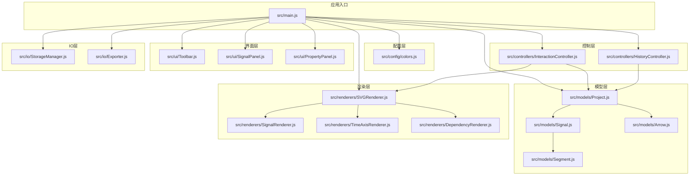
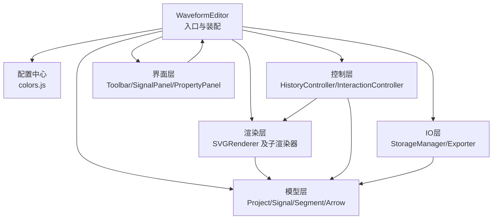
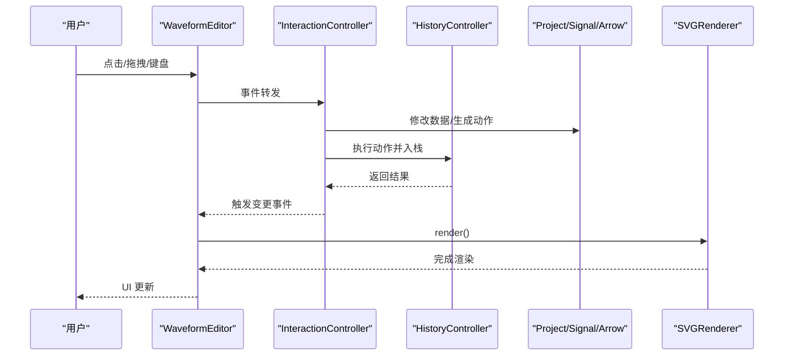
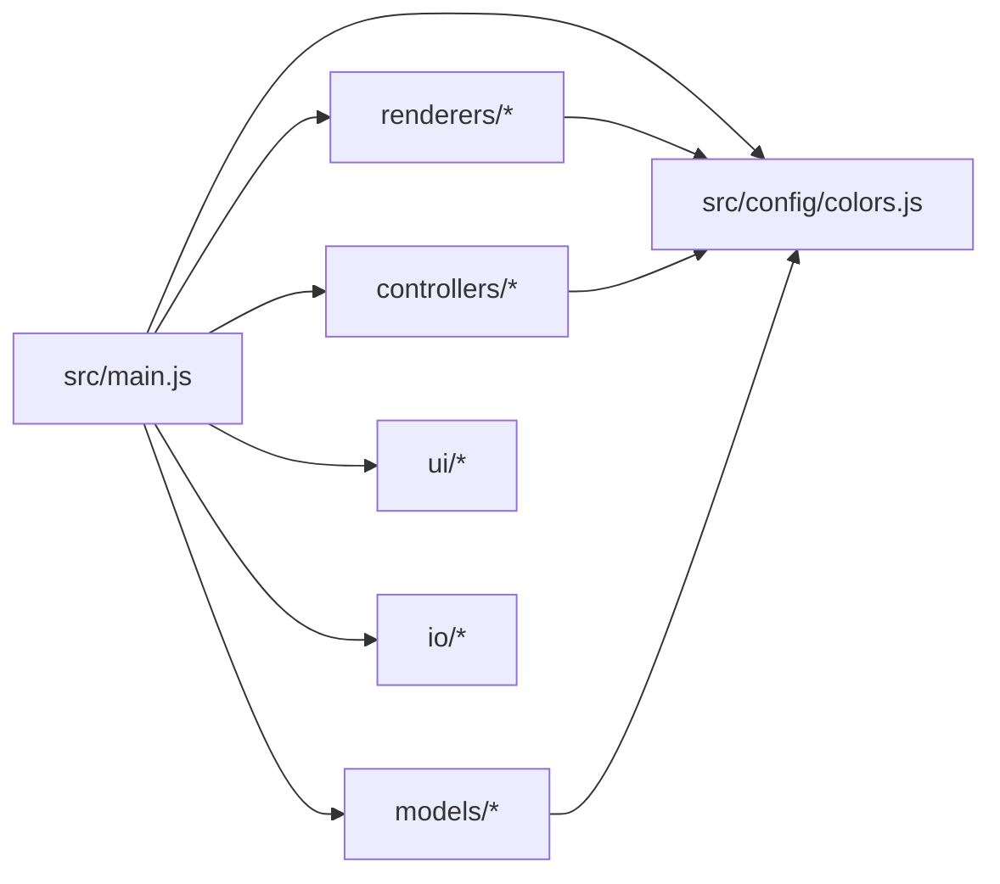

# 模块化设计原则

<cite>
**本文档引用的文件**
- [src/main.js](file://src/main.js)
- [src/models/Project.js](file://src/models/Project.js)
- [src/models/Signal.js](file://src/models/Signal.js)
- [src/models/Segment.js](file://src/models/Segment.js)
- [src/models/Arrow.js](file://src/models/Arrow.js)
- [src/controllers/InteractionController.js](file://src/controllers/InteractionController.js)
- [src/controllers/HistoryController.js](file://src/controllers/HistoryController.js)
- [src/renderers/SVGRenderer.js](file://src/renderers/SVGRenderer.js)
- [src/renderers/SignalRenderer.js](file://src/renderers/SignalRenderer.js)
- [src/renderers/TimeAxisRenderer.js](file://src/renderers/TimeAxisRenderer.js)
- [src/renderers/DependencyRenderer.js](file://src/renderers/DependencyRenderer.js)
- [src/ui/Toolbar.js](file://src/ui/Toolbar.js)
- [src/ui/SignalPanel.js](file://src/ui/SignalPanel.js)
- [src/ui/PropertyPanel.js](file://src/ui/PropertyPanel.js)
- [src/io/StorageManager.js](file://src/io/StorageManager.js)
- [src/io/Exporter.js](file://src/io/Exporter.js)
- [src/config/colors.js](file://src/config/colors.js)
</cite>

## 目录
1. [简介](#简介)
2. [项目结构](#项目结构)
3. [核心组件](#核心组件)
4. [架构概览](#架构概览)
5. [详细组件分析](#详细组件分析)
6. [依赖分析](#依赖分析)
7. [性能考虑](#性能考虑)
8. [故障排除指南](#故障排除指南)
9. [结论](#结论)
10. [附录](#附录)

## 简介
本文件系统性阐述波形图编辑器的模块化设计原则，围绕模块划分原则、依赖管理策略、接口设计规范展开，解释各功能模块的职责边界与协作方式，说明模块间的解耦机制与通信协议，并提供模块依赖图与包结构图，展示模块间的层次关系。同时给出模块扩展指南与最佳实践，帮助开发者在现有架构基础上安全地添加新功能模块。

## 项目结构
项目采用按职责分层的模块化组织方式，主要目录与职责如下：
- config：集中管理颜色、渲染配置与工具函数，作为全局配置中心
- models：领域模型层，封装信号、段、箭头与项目数据结构
- controllers：控制层，负责用户交互与历史记录管理
- renderers：渲染层，负责 SVG 渲染与子渲染器协调
- ui：界面层，负责工具栏、信号面板与属性面板
- io：输入输出层，负责本地存储、导入导出与独立 HTML 导出
- 根目录入口：应用初始化与模块装配

**图表来源**
- [src/main.js:1-819](file://src/main.js#L1-L819)
- [src/config/colors.js:1-83](file://src/config/colors.js#L1-L83)
- [src/models/Project.js:1-245](file://src/models/Project.js#L1-L245)
- [src/models/Signal.js:1-343](file://src/models/Signal.js#L1-L343)
- [src/models/Segment.js:1-94](file://src/models/Segment.js#L1-L94)
- [src/models/Arrow.js:1-114](file://src/models/Arrow.js#L1-L114)
- [src/controllers/InteractionController.js:1-800](file://src/controllers/InteractionController.js#L1-L800)
- [src/controllers/HistoryController.js:1-56](file://src/controllers/HistoryController.js#L1-L56)
- [src/renderers/SVGRenderer.js:1-547](file://src/renderers/SVGRenderer.js#L1-L547)
- [src/renderers/SignalRenderer.js:1-501](file://src/renderers/SignalRenderer.js#L1-L501)
- [src/renderers/TimeAxisRenderer.js:1-132](file://src/renderers/TimeAxisRenderer.js#L1-L132)
- [src/renderers/DependencyRenderer.js:1-290](file://src/renderers/DependencyRenderer.js#L1-L290)
- [src/ui/Toolbar.js:1-6](file://src/ui/Toolbar.js#L1-L6)
- [src/ui/SignalPanel.js:1-164](file://src/ui/SignalPanel.js#L1-L164)
- [src/ui/PropertyPanel.js:1-507](file://src/ui/PropertyPanel.js#L1-L507)
- [src/io/StorageManager.js:1-368](file://src/io/StorageManager.js#L1-L368)
- [src/io/Exporter.js:1-298](file://src/io/Exporter.js#L1-L298)

**章节来源**
- [src/main.js:1-819](file://src/main.js#L1-L819)
- [src/config/colors.js:1-83](file://src/config/colors.js#L1-L83)

## 核心组件
本节深入分析核心模块的职责、接口与协作关系，重点说明模块边界与解耦策略。

- 应用入口与装配
  - WaveformEditor 类负责模块初始化、事件绑定、多 sheet 管理与渲染调度
  - 通过构造函数注入各子系统，实现松耦合装配
  - 提供统一的渲染入口与事件分发机制

- 配置中心
  - colors.js 集中管理颜色、渲染配置与辅助函数
  - 为渲染器与控制器提供一致的视觉与行为参数
  - 支持主题化与可扩展的配置项

- 模型层
  - Project：项目数据聚合与事件发布者，提供信号、箭头与时间轴管理
  - Signal：信号实体，包含段集合、时钟配置与分隔符
  - Segment：波形段，描述连续电平区间
  - Arrow：依赖箭头，支持多标签与样式配置

- 控制层
  - HistoryController：基于栈的撤销/重做机制，提供动作封装与历史上限
  - InteractionController：鼠标/键盘交互处理，负责选择、拖拽、创建与编辑

- 渲染层
  - SVGRenderer：主渲染器，协调时间轴、信号与依赖箭头渲染器
  - SignalRenderer：信号波形渲染，支持总线、X/Z 态与跳变沿节点
  - TimeAxisRenderer：时间轴刻度与拖拽手柄
  - DependencyRenderer：依赖箭头渲染，支持多箭头防重叠与标签

- 界面层
  - Toolbar：工具栏容器
  - SignalPanel：信号列表与拖拽排序、删除
  - PropertyPanel：信号/箭头/项目属性编辑

- IO 层
  - StorageManager：多 sheet 注册表、数据迁移与导入导出
  - Exporter：SVG/PNG/JSON 导出与独立 HTML 导出

**章节来源**
- [src/main.js:21-132](file://src/main.js#L21-L132)
- [src/config/colors.js:5-83](file://src/config/colors.js#L5-L83)
- [src/models/Project.js:8-245](file://src/models/Project.js#L8-L245)
- [src/models/Signal.js:7-343](file://src/models/Signal.js#L7-L343)
- [src/models/Segment.js:5-94](file://src/models/Segment.js#L5-L94)
- [src/models/Arrow.js:5-114](file://src/models/Arrow.js#L5-L114)
- [src/controllers/HistoryController.js:5-56](file://src/controllers/HistoryController.js#L5-L56)
- [src/controllers/InteractionController.js:6-82](file://src/controllers/InteractionController.js#L6-L82)
- [src/renderers/SVGRenderer.js:10-54](file://src/renderers/SVGRenderer.js#L10-L54)
- [src/renderers/SignalRenderer.js:6-16](file://src/renderers/SignalRenderer.js#L6-L16)
- [src/renderers/TimeAxisRenderer.js:6-15](file://src/renderers/TimeAxisRenderer.js#L6-L15)
- [src/renderers/DependencyRenderer.js:7-12](file://src/renderers/DependencyRenderer.js#L7-L12)
- [src/ui/Toolbar.js:1-6](file://src/ui/Toolbar.js#L1-L6)
- [src/ui/SignalPanel.js:1-8](file://src/ui/SignalPanel.js#L1-L8)
- [src/ui/PropertyPanel.js:3-12](file://src/ui/PropertyPanel.js#L3-L12)
- [src/io/StorageManager.js:1-6](file://src/io/StorageManager.js#L1-L6)
- [src/io/Exporter.js:1-5](file://src/io/Exporter.js#L1-L5)

## 架构概览
波形图编辑器采用“入口装配 + 分层职责 + 渲染协调”的架构模式。入口模块负责装配与编排，模型层提供数据与事件，控制层处理交互与历史，渲染层负责可视化输出，IO 层负责持久化与导出，UI 层提供用户交互界面。

**图表来源**
- [src/main.js:21-132](file://src/main.js#L21-L132)
- [src/renderers/SVGRenderer.js:33-54](file://src/renderers/SVGRenderer.js#L33-L54)
- [src/controllers/InteractionController.js:7-27](file://src/controllers/InteractionController.js#L7-L27)
- [src/controllers/HistoryController.js:6-11](file://src/controllers/HistoryController.js#L6-L11)
- [src/io/StorageManager.js:14-130](file://src/io/StorageManager.js#L14-L130)
- [src/io/Exporter.js:2-5](file://src/io/Exporter.js#L2-L5)

## 详细组件分析

### 模块划分原则
- 职责单一：每个模块专注于单一职责，如渲染器只负责可视化，控制器只负责交互与历史，模型只负责数据与事件
- 层次清晰：自顶向下分为入口、配置、模型、控制、渲染、界面、IO 七个层次
- 接口稳定：通过明确的构造函数参数与公共方法暴露能力，降低耦合
- 可替换性：渲染器与控制器均支持 setProject 切换项目，便于多 sheet 场景

**章节来源**
- [src/main.js:49-132](file://src/main.js#L49-L132)
- [src/renderers/SVGRenderer.js:42-54](file://src/renderers/SVGRenderer.js#L42-L54)
- [src/controllers/InteractionController.js:34-50](file://src/controllers/InteractionController.js#L34-L50)

### 依赖管理策略
- 显式依赖声明：入口文件集中导入各模块，便于追踪依赖关系
- 配置共享：渲染器与控制器通过 colors.js 获取统一配置，避免重复定义
- 事件驱动：模型层通过 on/off/emit 发布变更事件，渲染器与 UI 通过事件驱动更新
- 无循环依赖：模块间遵循自顶向下依赖，未发现循环引用

**章节来源**
- [src/main.js:4-16](file://src/main.js#L4-L16)
- [src/config/colors.js:5-83](file://src/config/colors.js#L5-L83)
- [src/models/Project.js:177-202](file://src/models/Project.js#L177-L202)

### 接口设计规范
- 构造函数参数：所有模块通过构造函数接收依赖，如 SVGRenderer 接收 SVG 元素与 Project
- setProject 方法：渲染器与控制器提供 setProject 切换项目的能力
- 事件接口：模型层提供 on/off/emit 事件接口，便于订阅与解绑
- 渲染接口：渲染器提供 render 方法，统一渲染入口

**章节来源**
- [src/renderers/SVGRenderer.js:15-54](file://src/renderers/SVGRenderer.js#L15-L54)
- [src/controllers/InteractionController.js:34-50](file://src/controllers/InteractionController.js#L34-L50)
- [src/models/Project.js:177-202](file://src/models/Project.js#L177-L202)

### 模块协作方式与解耦机制
- 事件总线：Project 作为事件源，渲染器与 UI 订阅变更事件，实现解耦更新
- 命令模式：HistoryController 封装具体操作为可撤销的动作对象
- 渲染协调：SVGRenderer 统一管理子渲染器，按层级顺序渲染，避免相互干扰
- 选择与状态：InteractionController 维护选中状态，通过 editor 与渲染器同步

**图表来源**
- [src/controllers/InteractionController.js:84-184](file://src/controllers/InteractionController.js#L84-L184)
- [src/controllers/HistoryController.js:13-42](file://src/controllers/HistoryController.js#L13-L42)
- [src/models/Project.js:177-202](file://src/models/Project.js#L177-L202)
- [src/renderers/SVGRenderer.js:284-314](file://src/renderers/SVGRenderer.js#L284-L314)

**章节来源**
- [src/controllers/InteractionController.js:84-337](file://src/controllers/InteractionController.js#L84-L337)
- [src/controllers/HistoryController.js:13-42](file://src/controllers/HistoryController.js#L13-L42)
- [src/renderers/SVGRenderer.js:284-314](file://src/renderers/SVGRenderer.js#L284-L314)

### 通信协议
- 事件协议：模型层通过事件发布变更，渲染器与 UI 订阅更新
- 命令协议：HistoryController 期望动作对象包含 redo/undo 方法
- 渲染协议：渲染器统一提供 render 方法，按组渲染并应用裁剪与变换

**章节来源**
- [src/models/Project.js:177-202](file://src/models/Project.js#L177-L202)
- [src/controllers/HistoryController.js:13-22](file://src/controllers/HistoryController.js#L13-L22)
- [src/renderers/SVGRenderer.js:284-314](file://src/renderers/SVGRenderer.js#L284-L314)

### 代码组织与命名规范
- 目录结构：按职责分层，文件名采用 PascalCase，模块名与文件名一致
- 导入规范：统一使用相对路径导入，避免循环依赖
- 命名约定：类名大写开头，方法小写开头，常量全大写

**章节来源**
- [src/main.js:4-16](file://src/main.js#L4-L16)
- [src/config/colors.js:5-83](file://src/config/colors.js#L5-L83)

### 文档标准
- 模块头部注释：说明模块用途与职责
- 类与方法注释：描述参数、返回值与异常
- 复杂逻辑：通过流程图与序列图辅助说明

**章节来源**
- [src/models/Project.js:1-8](file://src/models/Project.js#L1-L8)
- [src/renderers/SVGRenderer.js:1-10](file://src/renderers/SVGRenderer.js#L1-L10)

## 依赖分析
模块间依赖关系呈现自顶向下、单向依赖的特点，未发现循环依赖。入口模块集中导入各子模块，渲染器与控制器通过配置中心共享参数。

**图表来源**
- [src/main.js:4-16](file://src/main.js#L4-L16)
- [src/renderers/SVGRenderer.js:5-8](file://src/renderers/SVGRenderer.js#L5-L8)
- [src/controllers/InteractionController.js:1-4](file://src/controllers/InteractionController.js#L1-L4)
- [src/models/Project.js:5-6](file://src/models/Project.js#L5-L6)

**章节来源**
- [src/main.js:4-16](file://src/main.js#L4-L16)
- [src/renderers/SVGRenderer.js:5-8](file://src/renderers/SVGRenderer.js#L5-L8)
- [src/controllers/InteractionController.js:1-4](file://src/controllers/InteractionController.js#L1-L4)
- [src/models/Project.js:5-6](file://src/models/Project.js#L5-L6)

## 性能考虑
- 渲染优化
  - SVGRenderer 自动扩展时间轴以填满容器宽度，避免多余重绘
  - 通过裁剪路径限制波形区域，减少超出边界绘制
  - 时钟周期竖线按周期批量绘制，避免逐像素计算
- 交互优化
  - 边缘滚动在时间轴拖拽时自动扩展，提升用户体验
  - 选择框与命中区域分离，提高交互精度
- 数据结构优化
  - Segment 合并相邻同值段，减少渲染节点数量
  - 信号分隔符使用 mask 与裁剪，避免重复绘制

**章节来源**
- [src/renderers/SVGRenderer.js:194-243](file://src/renderers/SVGRenderer.js#L194-L243)
- [src/renderers/SVGRenderer.js:319-344](file://src/renderers/SVGRenderer.js#L319-L344)
- [src/renderers/SignalRenderer.js:146-193](file://src/renderers/SignalRenderer.js#L146-L193)
- [src/renderers/SignalRenderer.js:138-141](file://src/renderers/SignalRenderer.js#L138-L141)
- [src/models/Signal.js:138-155](file://src/models/Signal.js#L138-L155)

## 故障排除指南
- 初始化失败
  - 现象：找不到 SVG 元素或项目加载异常
  - 排查：确认入口元素存在，检查模板加载与迁移逻辑
- 渲染异常
  - 现象：波形不显示或布局错乱
  - 排查：检查时间轴范围、信号数量与渲染配置
- 交互失效
  - 现象：无法拖拽、选择或创建箭头
  - 排查：确认事件监听是否绑定，检查命中区域与吸附逻辑
- 导出失败
  - 现象：导出 PNG/SVG 失败或剪贴板复制异常
  - 排查：检查浏览器权限与资源加载，确认独立 HTML 导出的模块内联

**章节来源**
- [src/main.js:90-93](file://src/main.js#L90-L93)
- [src/main.js:138-210](file://src/main.js#L138-L210)
- [src/controllers/InteractionController.js:52-82](file://src/controllers/InteractionController.js#L52-L82)
- [src/io/Exporter.js:98-187](file://src/io/Exporter.js#L98-L187)

## 结论
该波形图编辑器通过清晰的模块划分、稳定的接口设计与事件驱动的解耦机制，实现了良好的可维护性与扩展性。入口装配、配置共享、事件总线与命令模式共同构成了稳健的架构基础。建议在新增模块时遵循现有规范，保持职责单一与接口稳定，确保整体架构的一致性与可演进性。

## 附录

### 模块扩展指南
- 新增渲染器
  - 在 renderers 目录创建新类，实现 render 方法
  - 在 SVGRenderer 中注册并调用
  - 通过 config 与 colors.js 获取统一参数
- 新增控制器
  - 在 controllers 目录创建新类，接收依赖并在构造函数中初始化
  - 提供 setProject 方法以适配多 sheet
  - 通过事件与渲染器/模型层交互
- 新增模型
  - 在 models 目录创建新类，提供 toJSON/fromJSON
  - 在 Project 中注册并提供 CRUD 接口
  - 发布变更事件以驱动渲染
- 新增 UI 组件
  - 在 ui 目录创建新类，提供 render 方法
  - 通过 editor 引用与渲染器/模型层交互
- 新增 IO 功能
  - 在 io 目录扩展 StorageManager/Exporter
  - 保持与现有事件与数据结构的兼容

**章节来源**
- [src/renderers/SVGRenderer.js:33-54](file://src/renderers/SVGRenderer.js#L33-L54)
- [src/controllers/InteractionController.js:34-50](file://src/controllers/InteractionController.js#L34-L50)
- [src/models/Project.js:47-124](file://src/models/Project.js#L47-L124)
- [src/ui/SignalPanel.js:45-67](file://src/ui/SignalPanel.js#L45-L67)
- [src/io/StorageManager.js:167-273](file://src/io/StorageManager.js#L167-L273)
- [src/io/Exporter.js:200-297](file://src/io/Exporter.js#L200-L297)