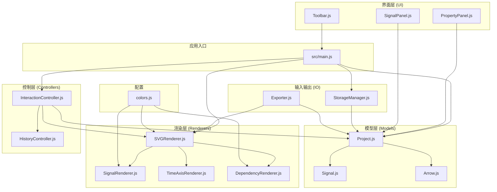
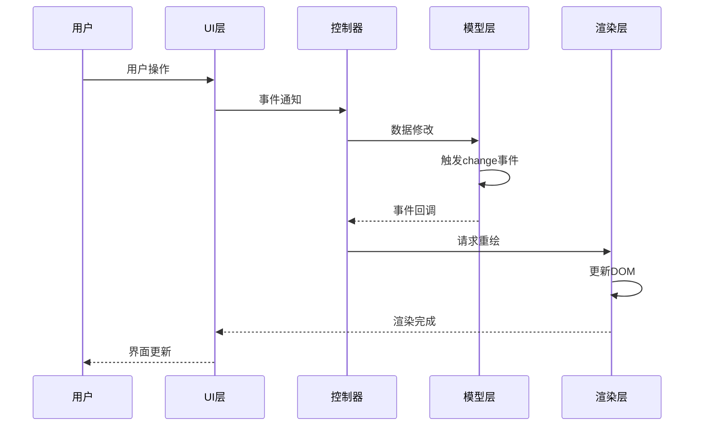
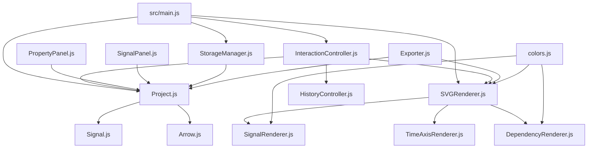
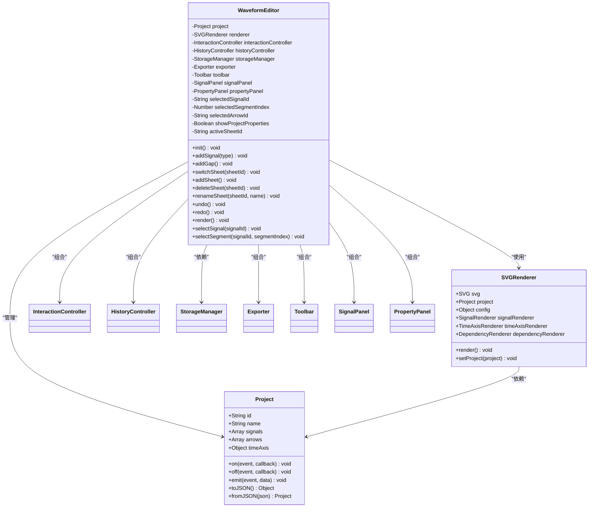
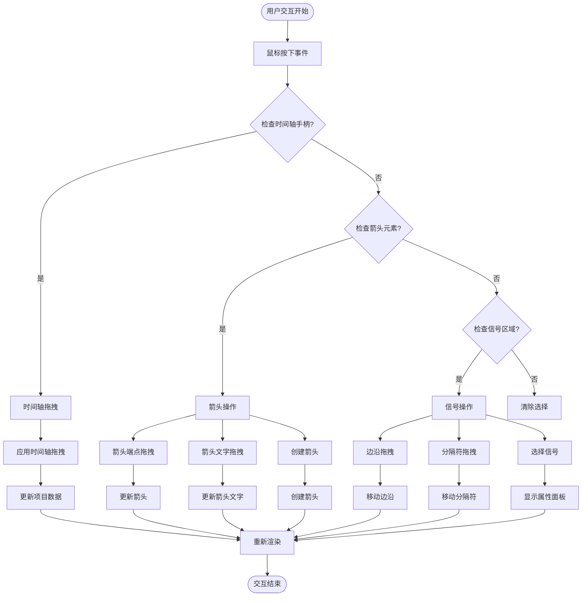
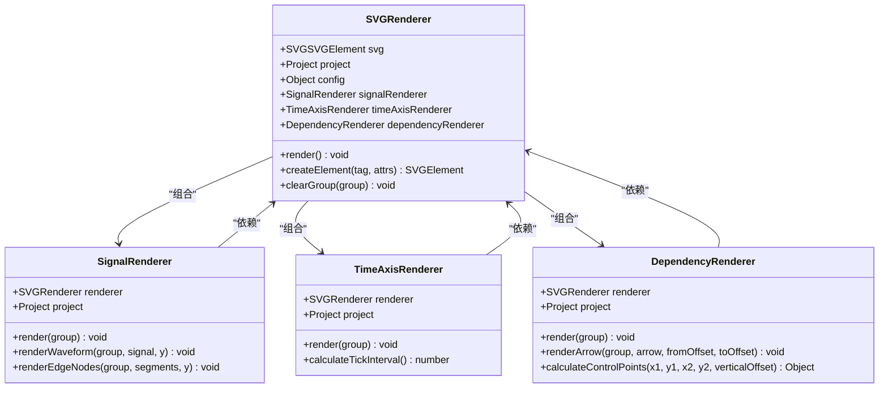

# 模块架构设计

<cite>
**本文档引用的文件**
- [src/main.js](file://src/main.js)
- [src/models/Project.js](file://src/models/Project.js)
- [src/models/Signal.js](file://src/models/Signal.js)
- [src/models/Arrow.js](file://src/models/Arrow.js)
- [src/controllers/InteractionController.js](file://src/controllers/InteractionController.js)
- [src/controllers/HistoryController.js](file://src/controllers/HistoryController.js)
- [src/renderers/SVGRenderer.js](file://src/renderers/SVGRenderer.js)
- [src/renderers/SignalRenderer.js](file://src/renderers/SignalRenderer.js)
- [src/renderers/TimeAxisRenderer.js](file://src/renderers/TimeAxisRenderer.js)
- [src/renderers/DependencyRenderer.js](file://src/renderers/DependencyRenderer.js)
- [src/ui/PropertyPanel.js](file://src/ui/PropertyPanel.js)
- [src/ui/SignalPanel.js](file://src/ui/SignalPanel.js)
- [src/ui/Toolbar.js](file://src/ui/Toolbar.js)
- [src/io/StorageManager.js](file://src/io/StorageManager.js)
- [src/io/Exporter.js](file://src/io/Exporter.js)
- [src/config/colors.js](file://src/config/colors.js)
</cite>

## 目录
1. [简介](#简介)
2. [项目结构](#项目结构)
3. [核心组件](#核心组件)
4. [架构概览](#架构概览)
5. [详细组件分析](#详细组件分析)
6. [依赖分析](#依赖分析)
7. [性能考虑](#性能考虑)
8. [故障排除指南](#故障排除指南)
9. [结论](#结论)

## 简介

波形图编辑器采用MVC（Model-View-Controller）架构模式，实现了清晰的职责分离和模块化设计。该系统通过四个主要层次协同工作：模型层负责数据管理、渲染层负责可视化呈现、控制层负责业务逻辑、UI层负责用户交互。

系统的核心设计理念是"关注点分离"，每个模块都有明确的职责边界，通过事件驱动的方式进行松耦合通信。这种架构设计确保了代码的可维护性、可扩展性和可测试性。

## 项目结构

项目采用基于功能域的模块组织方式，按照MVC模式进行分层：



**图表来源**
- [src/main.js:1-819](file://src/main.js#L1-L819)
- [src/models/Project.js:1-245](file://src/models/Project.js#L1-L245)
- [src/renderers/SVGRenderer.js:1-547](file://src/renderers/SVGRenderer.js#L1-L547)

**章节来源**
- [src/main.js:1-819](file://src/main.js#L1-L819)
- [src/config/colors.js:1-83](file://src/config/colors.js#L1-L83)

## 核心组件

### MVC架构模式实现

系统严格遵循MVC设计模式，实现了清晰的职责分离：

**模型层 (Model Layer)**
- 负责数据管理和业务规则
- 提供数据持久化和序列化能力
- 维护数据完整性约束

**视图层 (View Layer)**
- 负责数据的可视化呈现
- 管理SVG DOM元素的创建和更新
- 实现响应式布局和交互反馈

**控制器层 (Controller Layer)**
- 处理用户输入和业务逻辑
- 协调模型和视图之间的交互
- 实现撤销/重做机制

**章节来源**
- [src/models/Project.js:1-245](file://src/models/Project.js#L1-L245)
- [src/renderers/SVGRenderer.js:1-547](file://src/renderers/SVGRenderer.js#L1-L547)
- [src/controllers/InteractionController.js:1-800](file://src/controllers/InteractionController.js#L1-L800)

### 模块边界划分原则

系统采用"高内聚、低耦合"的设计原则：

**模型层边界**
- Project：项目级数据管理，包含信号、箭头、时间轴配置
- Signal：单个信号的数据结构和行为
- Arrow：依赖关系的数据结构和渲染

**渲染层边界**
- SVGRenderer：主渲染器，协调各子渲染器
- SignalRenderer：信号波形渲染
- TimeAxisRenderer：时间轴渲染
- DependencyRenderer：依赖箭头渲染

**控制层边界**
- InteractionController：用户交互处理
- HistoryController：撤销/重做管理

**UI层边界**
- PropertyPanel：属性编辑面板
- SignalPanel：信号列表面板
- Toolbar：工具栏

**章节来源**
- [src/models/Signal.js:1-343](file://src/models/Signal.js#L1-L343)
- [src/renderers/SignalRenderer.js:1-501](file://src/renderers/SignalRenderer.js#L1-L501)
- [src/ui/PropertyPanel.js:1-507](file://src/ui/PropertyPanel.js#L1-L507)

## 架构概览

系统采用事件驱动的架构模式，通过发布-订阅机制实现模块间通信：



**图表来源**
- [src/controllers/InteractionController.js:1-800](file://src/controllers/InteractionController.js#L1-L800)
- [src/models/Project.js:177-202](file://src/models/Project.js#L177-L202)
- [src/renderers/SVGRenderer.js:284-314](file://src/renderers/SVGRenderer.js#L284-L314)

### 模块依赖关系



**图表来源**
- [src/main.js:4-16](file://src/main.js#L4-L16)
- [src/renderers/SVGRenderer.js:5-8](file://src/renderers/SVGRenderer.js#L5-L8)

**章节来源**
- [src/main.js:1-819](file://src/main.js#L1-L819)
- [src/renderers/SVGRenderer.js:1-547](file://src/renderers/SVGRenderer.js#L1-L547)

## 详细组件分析

### 主应用类 (WaveformEditor)

WaveformEditor作为系统的主控制器，负责协调各个子系统的初始化和运行：



**图表来源**
- [src/main.js:21-44](file://src/main.js#L21-L44)
- [src/models/Project.js:8-34](file://src/models/Project.js#L8-L34)
- [src/renderers/SVGRenderer.js:10-54](file://src/renderers/SVGRenderer.js#L10-L54)

**章节来源**
- [src/main.js:21-800](file://src/main.js#L21-L800)

### 交互控制器 (InteractionController)

InteractionController实现了复杂的用户交互逻辑，处理各种编辑操作：



**图表来源**
- [src/controllers/InteractionController.js:84-337](file://src/controllers/InteractionController.js#L84-L337)
- [src/controllers/InteractionController.js:569-766](file://src/controllers/InteractionController.js#L569-L766)

**章节来源**
- [src/controllers/InteractionController.js:1-800](file://src/controllers/InteractionController.js#L1-L800)

### 渲染器架构

系统采用分层渲染器设计，每个渲染器专注于特定的渲染任务：



**图表来源**
- [src/renderers/SVGRenderer.js:10-54](file://src/renderers/SVGRenderer.js#L10-L54)
- [src/renderers/SignalRenderer.js:6-16](file://src/renderers/SignalRenderer.js#L6-L16)
- [src/renderers/TimeAxisRenderer.js:6-15](file://src/renderers/TimeAxisRenderer.js#L6-L15)
- [src/renderers/DependencyRenderer.js:7-12](file://src/renderers/DependencyRenderer.js#L7-L12)

**章节来源**
- [src/renderers/SVGRenderer.js:1-547](file://src/renderers/SVGRenderer.js#L1-L547)
- [src/renderers/SignalRenderer.js:1-501](file://src/renderers/SignalRenderer.js#L1-L501)
- [src/renderers/TimeAxisRenderer.js:1-132](file://src/renderers/TimeAxisRenderer.js#L1-L132)
- [src/renderers/DependencyRenderer.js:1-290](file://src/renderers/DependencyRenderer.js#L1-L290)

### 数据模型设计

系统采用简洁而强大的数据模型设计：

```mermaid
erDiagram
PROJECT {
string id PK
string name
string fontFamily
string titlePosition
number titleFontSize
boolean titleBold
array signals
array annotations
array arrows
object timeAxis
}
SIGNAL {
string id PK
string name
string type
string color
array segments
object clockConfig
array gaps
}
SEGMENT {
number startTime
number endTime
number|string value
string color
}
ARROW {
string id PK
string fromSignalId
number fromTime
string toSignalId
number toTime
object controlPointOffset
string direction
boolean isBidirectional
array labels
object style
}
LABEL {
string id PK
string text
object offset
}
PROJECT ||--o{ SIGNAL : contains
PROJECT ||--o{ ARROW : contains
SIGNAL ||--o{ SEGMENT : composedOf
ARROW ||--o{ LABEL : contains
```

**图表来源**
- [src/models/Project.js:8-34](file://src/models/Project.js#L8-L34)
- [src/models/Signal.js:7-29](file://src/models/Signal.js#L7-L29)
- [src/models/Arrow.js:5-45](file://src/models/Arrow.js#L5-L45)

**章节来源**
- [src/models/Project.js:1-245](file://src/models/Project.js#L1-L245)
- [src/models/Signal.js:1-343](file://src/models/Signal.js#L1-L343)
- [src/models/Arrow.js:1-114](file://src/models/Arrow.js#L1-L114)

## 依赖分析

### 模块耦合度控制

系统通过以下策略控制模块间的耦合度：

**依赖注入模式**
- 所有子组件通过构造函数接收依赖，避免全局状态
- 渲染器通过主渲染器传递共享配置和命名空间

**事件驱动通信**
- 模型层使用发布-订阅模式进行解耦
- 控制器通过事件监听器响应用户操作

**接口抽象**
- 渲染器接口统一，便于替换和扩展
- 配置集中管理，便于维护

### 循环依赖检测

系统避免了循环依赖：
- 控制器依赖模型和渲染器，但渲染器不依赖控制器
- UI组件只依赖控制器，不反向依赖
- IO层独立于业务逻辑层

**章节来源**
- [src/controllers/InteractionController.js:7-27](file://src/controllers/InteractionController.js#L7-L27)
- [src/renderers/SVGRenderer.js:34-54](file://src/renderers/SVGRenderer.js#L34-L54)
- [src/ui/PropertyPanel.js:4-12](file://src/ui/PropertyPanel.js#L4-L12)

## 性能考虑

### 渲染优化策略

**增量更新**
- 仅在数据变更时触发重新渲染
- 使用事件监听器精确控制渲染时机

**DOM操作优化**
- 批量DOM操作，减少重排重绘
- 使用SVG元素的高效特性

**内存管理**
- 及时清理事件监听器
- 合理使用对象池模式

### 数据结构优化

**信号段合并**
- 自动合并相邻同值段，减少渲染节点
- 优化总线信号的渲染算法

**索引优化**
- 信号索引缓存，快速定位信号
- 时间轴查询优化

## 故障排除指南

### 常见问题诊断

**渲染异常**
- 检查SVG元素是否存在
- 验证项目数据的完整性
- 确认配置参数的有效性

**交互失效**
- 检查事件监听器的绑定状态
- 验证鼠标事件的传播链
- 确认CSS样式的冲突

**数据丢失**
- 检查localStorage的可用性
- 验证数据序列化的正确性
- 确认版本兼容性

### 调试技巧

**开发工具使用**
- 利用浏览器开发者工具监控DOM变化
- 使用性能分析工具识别瓶颈
- 通过日志追踪事件流

**单元测试策略**
- 为关键模块编写单元测试
- 使用模拟对象隔离依赖
- 测试边界条件和异常情况

**章节来源**
- [src/main.js:49-132](file://src/main.js#L49-L132)
- [src/controllers/InteractionController.js:52-82](file://src/controllers/InteractionController.js#L52-L82)

## 结论

波形图编辑器的模块架构设计充分体现了现代前端应用的最佳实践。通过清晰的MVC分层、严格的模块边界划分和优雅的依赖管理，系统实现了高度的可维护性和可扩展性。

**架构优势总结：**

1. **代码复用性**：模块化设计使得组件可以在不同场景下重复使用
2. **可维护性**：清晰的职责分离便于代码维护和bug修复
3. **可扩展性**：插件化的架构支持功能扩展和定制开发
4. **可测试性**：依赖注入和接口抽象便于单元测试和集成测试

该架构为波形图编辑器提供了坚实的技术基础，能够支持复杂的功能需求和良好的用户体验。通过持续的重构和优化，系统将继续保持其架构优势，适应未来的发展需求。