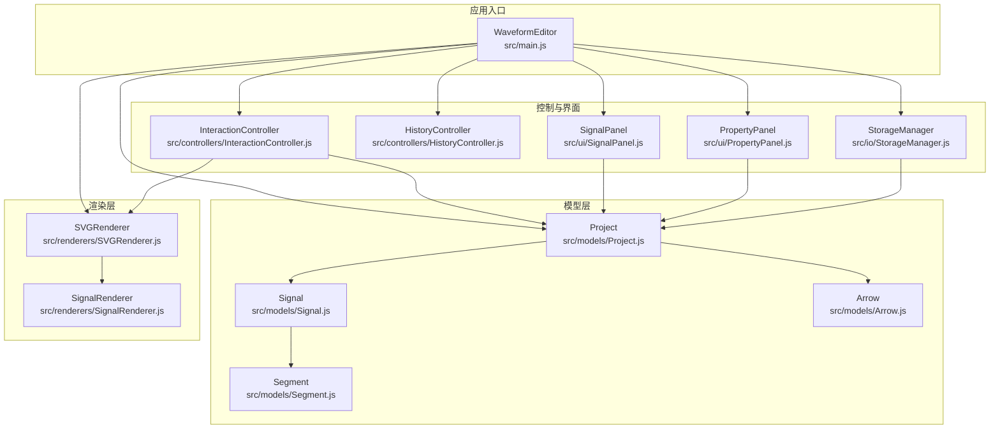
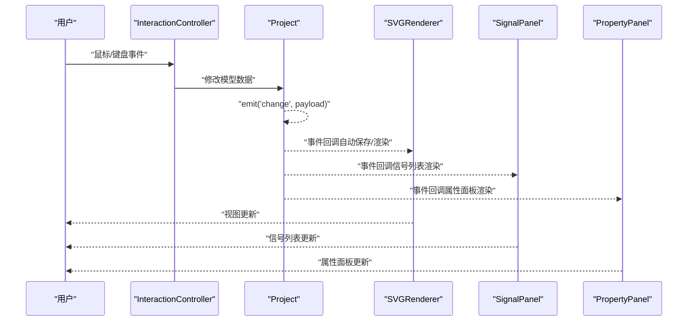
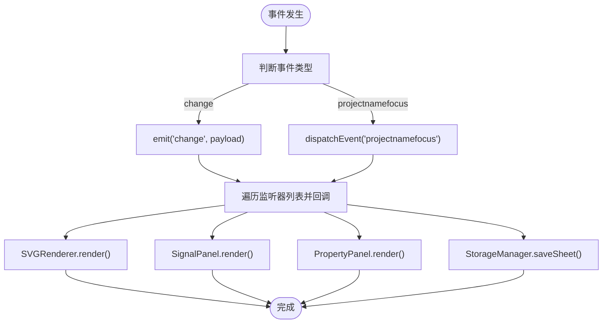
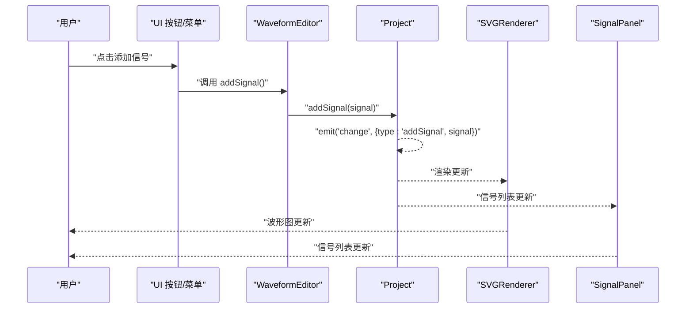
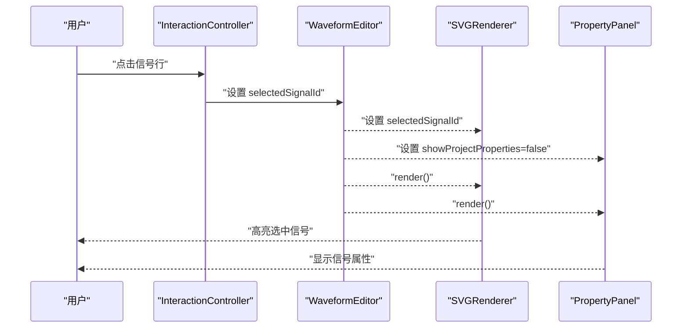
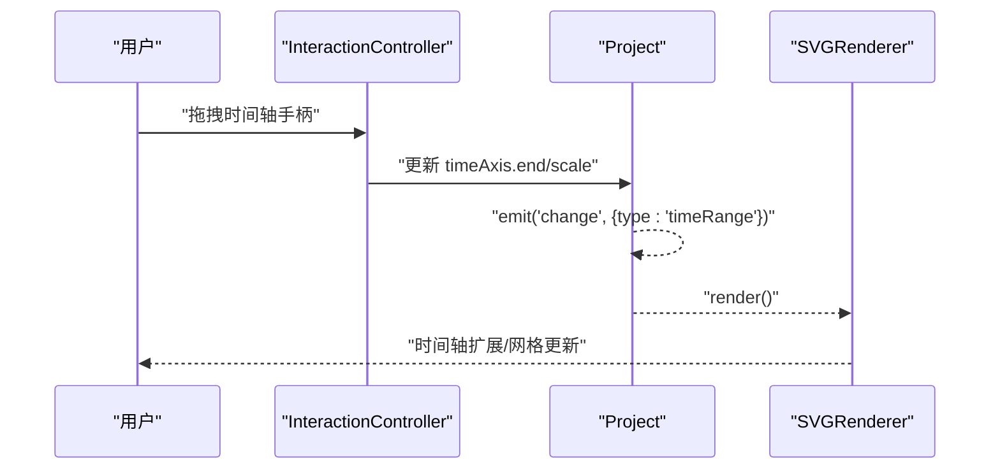
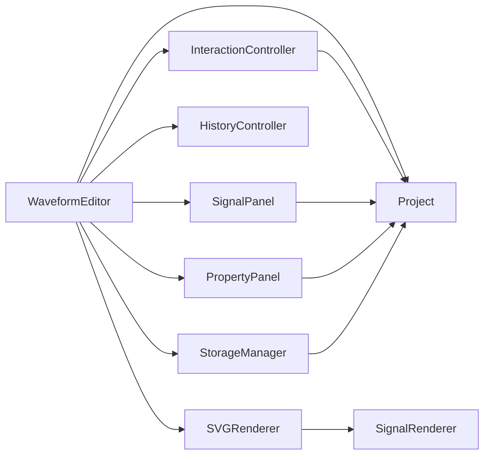

# 事件系统与通信协议

<cite>
**本文档引用的文件**
- [src/main.js](file://src/main.js)
- [src/models/Project.js](file://src/models/Project.js)
- [src/models/Signal.js](file://src/models/Signal.js)
- [src/models/Arrow.js](file://src/models/Arrow.js)
- [src/models/Segment.js](file://src/models/Segment.js)
- [src/controllers/InteractionController.js](file://src/controllers/InteractionController.js)
- [src/controllers/HistoryController.js](file://src/controllers/HistoryController.js)
- [src/renderers/SVGRenderer.js](file://src/renderers/SVGRenderer.js)
- [src/renderers/SignalRenderer.js](file://src/renderers/SignalRenderer.js)
- [src/ui/SignalPanel.js](file://src/ui/SignalPanel.js)
- [src/ui/PropertyPanel.js](file://src/ui/PropertyPanel.js)
- [src/io/StorageManager.js](file://src/io/StorageManager.js)
</cite>

## 目录
1. [简介](#简介)
2. [项目结构](#项目结构)
3. [核心组件](#核心组件)
4. [架构总览](#架构总览)
5. [详细组件分析](#详细组件分析)
6. [依赖分析](#依赖分析)
7. [性能考虑](#性能考虑)
8. [故障排查指南](#故障排查指南)
9. [结论](#结论)

## 简介
本文件系统性梳理波形图编辑器的事件系统与通信协议，重点围绕“观察者模式”的发布/订阅机制展开，涵盖以下方面：
- 事件类型与负载结构：项目变更、信号选择、渲染触发、时间轴拖拽、箭头编辑、属性修改等
- 发布/订阅实现：Project 模型内置事件总线，UI 控件与控制器通过 on/off/emit 进行松耦合通信
- 事件传播路径：从用户交互到模型变更再到渲染刷新的完整链路
- 监听器注册/注销：生命周期管理与内存安全
- 典型事件流示例与错误处理策略

## 项目结构
编辑器采用“模型-渲染器-控制器-界面”分层架构，事件系统贯穿各层，形成以 Project 为中心的观察者网络。

图表来源
- [src/main.js:49-132](file://src/main.js#L49-L132)
- [src/models/Project.js:15-34](file://src/models/Project.js#L15-L34)
- [src/renderers/SVGRenderer.js:10-40](file://src/renderers/SVGRenderer.js#L10-L40)
- [src/controllers/InteractionController.js:6-27](file://src/controllers/InteractionController.js#L6-L27)
- [src/ui/SignalPanel.js:1-8](file://src/ui/SignalPanel.js#L1-L8)
- [src/ui/PropertyPanel.js:3-12](file://src/ui/PropertyPanel.js#L3-L12)
- [src/io/StorageManager.js:1-6](file://src/io/StorageManager.js#L1-L6)

章节来源
- [src/main.js:49-132](file://src/main.js#L49-L132)
- [src/models/Project.js:15-34](file://src/models/Project.js#L15-L34)
- [src/renderers/SVGRenderer.js:10-40](file://src/renderers/SVGRenderer.js#L10-L40)
- [src/controllers/InteractionController.js:6-27](file://src/controllers/InteractionController.js#L6-L27)
- [src/ui/SignalPanel.js:1-8](file://src/ui/SignalPanel.js#L1-L8)
- [src/ui/PropertyPanel.js:3-12](file://src/ui/PropertyPanel.js#L3-L12)
- [src/io/StorageManager.js:1-6](file://src/io/StorageManager.js#L1-L6)

## 核心组件
- 事件总线与发布/订阅
  - Project 提供 on/off/emit 事件接口，作为应用的核心事件源
  - 所有对模型的结构性修改均通过 emit('change', payload) 通知订阅者
- 用户交互控制器
  - InteractionController 负责鼠标/键盘事件，驱动模型变更并触发渲染
- 渲染器
  - SVGRenderer/SignalRenderer 响应模型变化，负责视图更新
- 界面面板
  - SignalPanel/PropertyPanel 通过事件驱动的渲染与模型联动
- 历史控制器
  - HistoryController 以动作栈形式封装可撤销/重做的变更，间接参与事件传播
- 存储管理
  - StorageManager 通过事件驱动的自动保存与模板管理

章节来源
- [src/models/Project.js:172-202](file://src/models/Project.js#L172-L202)
- [src/controllers/InteractionController.js:52-82](file://src/controllers/InteractionController.js#L52-L82)
- [src/renderers/SVGRenderer.js:284-314](file://src/renderers/SVGRenderer.js#L284-L314)
- [src/ui/SignalPanel.js:45-67](file://src/ui/SignalPanel.js#L45-L67)
- [src/ui/PropertyPanel.js:32-67](file://src/ui/PropertyPanel.js#L32-L67)
- [src/controllers/HistoryController.js:5-56](file://src/controllers/HistoryController.js#L5-L56)
- [src/io/StorageManager.js:138-164](file://src/io/StorageManager.js#L138-L164)

## 架构总览
事件系统遵循“观察者模式”，以 Project 为核心，围绕其构建事件发布/订阅网络。用户交互通过控制器转换为模型变更，模型变更通过事件广播给渲染器与面板，最终驱动 UI 更新。

图表来源
- [src/controllers/InteractionController.js:52-82](file://src/controllers/InteractionController.js#L52-L82)
- [src/models/Project.js:172-202](file://src/models/Project.js#L172-L202)
- [src/renderers/SVGRenderer.js:284-314](file://src/renderers/SVGRenderer.js#L284-L314)
- [src/ui/SignalPanel.js:45-67](file://src/ui/SignalPanel.js#L45-L67)
- [src/ui/PropertyPanel.js:32-67](file://src/ui/PropertyPanel.js#L32-L67)

## 详细组件分析

### 事件类型与负载结构
- 通用事件
  - change：通用变更事件，负载包含变更类型与上下文信息
    - 示例负载字段：type、signal、signalId、newIndex、start/end/scale、arrow 等
- 项目级事件
  - add/remove/moveSignal：信号新增/删除/移动
  - add/removeArrow：箭头新增/删除
  - timeRange/timeScale：时间轴范围/缩放变更
- 渲染触发事件
  - change：触发渲染器与面板的重绘
- UI 交互事件
  - 项目名称编辑焦点事件：用于打开项目属性面板
  - 键盘快捷键：撤销/重做
  - 鼠标拖拽：时间轴缩放、箭头端点/文字拖拽、分隔符拖拽、信号拖拽排序

章节来源
- [src/models/Project.js:47-135](file://src/models/Project.js#L47-L135)
- [src/models/Project.js:172-202](file://src/models/Project.js#L172-L202)
- [src/renderers/SVGRenderer.js:477-522](file://src/renderers/SVGRenderer.js#L477-L522)
- [src/controllers/InteractionController.js:403-432](file://src/controllers/InteractionController.js#L403-L432)
- [src/ui/SignalPanel.js:134-162](file://src/ui/SignalPanel.js#L134-L162)

### 发布/订阅实现与生命周期
- 发布方
  - Project：在 add/remove/moveSignal、add/removeArrow、setTimeRange、setTimeScale 等方法中 emit('change', payload)
  - SVGRenderer：在项目名称输入框焦点事件中触发自定义事件（projectnamefocus）
  - SignalPanel：在信号拖拽排序完成后 emit('change', payload)
  - PropertyPanel：在属性修改时 emit('change', payload)
- 订阅方
  - WaveformEditor：注册项目 change 事件处理器，触发自动保存与 UI 同步
  - SVGRenderer/SignalRenderer：接收 change 事件，执行 render
  - SignalPanel/PropertyPanel：接收 change 事件，执行 render
  - StorageManager：监听 change 事件，触发自动保存
- 注册/注销
  - WaveformEditor 在初始化与切换项目时动态注册/注销项目 change 事件处理器
  - UI 组件在 render 时绑定事件，避免重复绑定

图表来源
- [src/models/Project.js:172-202](file://src/models/Project.js#L172-L202)
- [src/renderers/SVGRenderer.js:477-522](file://src/renderers/SVGRenderer.js#L477-L522)
- [src/main.js:226-241](file://src/main.js#L226-L241)
- [src/ui/SignalPanel.js:157](file://src/ui/SignalPanel.js#L157)
- [src/ui/PropertyPanel.js:131](file://src/ui/PropertyPanel.js#L131)

章节来源
- [src/models/Project.js:172-202](file://src/models/Project.js#L172-L202)
- [src/renderers/SVGRenderer.js:477-522](file://src/renderers/SVGRenderer.js#L477-L522)
- [src/main.js:226-241](file://src/main.js#L226-L241)
- [src/ui/SignalPanel.js:157](file://src/ui/SignalPanel.js#L157)
- [src/ui/PropertyPanel.js:131](file://src/ui/PropertyPanel.js#L131)

### 事件传播与处理流程

#### 项目变更事件（典型：添加信号）

图表来源
- [src/main.js:634-668](file://src/main.js#L634-L668)
- [src/models/Project.js:47-50](file://src/models/Project.js#L47-L50)
- [src/models/Project.js:172-202](file://src/models/Project.js#L172-L202)
- [src/renderers/SVGRenderer.js:284-314](file://src/renderers/SVGRenderer.js#L284-L314)
- [src/ui/SignalPanel.js:45-67](file://src/ui/SignalPanel.js#L45-L67)

章节来源
- [src/main.js:634-668](file://src/main.js#L634-L668)
- [src/models/Project.js:47-50](file://src/models/Project.js#L47-L50)
- [src/models/Project.js:172-202](file://src/models/Project.js#L172-L202)
- [src/renderers/SVGRenderer.js:284-314](file://src/renderers/SVGRenderer.js#L284-L314)
- [src/ui/SignalPanel.js:45-67](file://src/ui/SignalPanel.js#L45-L67)

#### 信号选择事件（典型：点击信号行）

图表来源
- [src/controllers/InteractionController.js:134-153](file://src/controllers/InteractionController.js#L134-L153)
- [src/main.js:790-795](file://src/main.js#L790-L795)
- [src/renderers/SVGRenderer.js:284-314](file://src/renderers/SVGRenderer.js#L284-L314)
- [src/ui/PropertyPanel.js:32-67](file://src/ui/PropertyPanel.js#L32-L67)

章节来源
- [src/controllers/InteractionController.js:134-153](file://src/controllers/InteractionController.js#L134-L153)
- [src/main.js:790-795](file://src/main.js#L790-L795)
- [src/renderers/SVGRenderer.js:284-314](file://src/renderers/SVGRenderer.js#L284-L314)
- [src/ui/PropertyPanel.js:32-67](file://src/ui/PropertyPanel.js#L32-L67)

#### 渲染触发事件（典型：时间轴拖拽）

图表来源
- [src/controllers/InteractionController.js:342-365](file://src/controllers/InteractionController.js#L342-L365)
- [src/models/Project.js:131-135](file://src/models/Project.js#L131-L135)
- [src/models/Project.js:172-202](file://src/models/Project.js#L172-L202)
- [src/renderers/SVGRenderer.js:284-314](file://src/renderers/SVGRenderer.js#L284-L314)

章节来源
- [src/controllers/InteractionController.js:342-365](file://src/controllers/InteractionController.js#L342-L365)
- [src/models/Project.js:131-135](file://src/models/Project.js#L131-L135)
- [src/models/Project.js:172-202](file://src/models/Project.js#L172-L202)
- [src/renderers/SVGRenderer.js:284-314](file://src/renderers/SVGRenderer.js#L284-L314)

### 监听器注册与注销机制
- 注册
  - WaveformEditor.init 中设置事件监听器（按钮点击、快捷键、窗口 resize、面板拖拽等）
  - WaveformEditor._attachAutoSave 中为项目注册 change 事件处理器
  - UI 组件 render 中绑定自身事件（点击、拖拽、输入等）
- 注销
  - 切换 sheet 时，先 off('change') 移除旧处理器，再 on('change') 注册新处理器
  - UI 组件在每次 render 前清理旧事件，避免重复绑定
- 最佳实践
  - 事件处理器应尽量轻量，避免阻塞渲染
  - 对高频事件（如 resize）使用节流/防抖
  - 在组件销毁或切换时显式移除监听器，防止内存泄漏

章节来源
- [src/main.js:451-629](file://src/main.js#L451-L629)
- [src/main.js:226-241](file://src/main.js#L226-L241)
- [src/ui/SignalPanel.js:69-87](file://src/ui/SignalPanel.js#L69-L87)
- [src/ui/PropertyPanel.js:14-25](file://src/ui/PropertyPanel.js#L14-L25)

### 自定义事件与跨组件通信
- 自定义事件
  - SVGRenderer 在项目名称输入框获得焦点时派发自定义事件（projectnamefocus），WaveformEditor 监听该事件以打开项目属性面板
- 跨组件通信
  - 通过 Project 作为单一事实来源，所有 UI 与控制器订阅同一事件源，实现松耦合通信
  - 事件负载携带最小必要信息，避免传递大型对象

章节来源
- [src/renderers/SVGRenderer.js:502](file://src/renderers/SVGRenderer.js#L502)
- [src/main.js:563-573](file://src/main.js#L563-L573)

## 依赖分析
- 组件耦合
  - 低耦合：UI 与控制器通过事件解耦；渲染器与模型通过事件解耦
  - 高内聚：Project 聚合事件发布能力，集中管理变更
- 直接依赖
  - WaveformEditor 依赖 Project、SVGRenderer、InteractionController、HistoryController、StorageManager、UI 组件
  - SVGRenderer 依赖 SignalRenderer、Project
  - UI 组件依赖 Project 与 WaveformEditor
- 事件依赖
  - 所有变更最终汇聚到 Project.change 事件，统一驱动渲染与持久化

图表来源
- [src/main.js:10-16](file://src/main.js#L10-L16)
- [src/renderers/SVGRenderer.js:34-36](file://src/renderers/SVGRenderer.js#L34-L36)
- [src/ui/SignalPanel.js:2-4](file://src/ui/SignalPanel.js#L2-L4)
- [src/ui/PropertyPanel.js:3-7](file://src/ui/PropertyPanel.js#L3-L7)
- [src/io/StorageManager.js:1-6](file://src/io/StorageManager.js#L1-L6)

章节来源
- [src/main.js:10-16](file://src/main.js#L10-L16)
- [src/renderers/SVGRenderer.js:34-36](file://src/renderers/SVGRenderer.js#L34-L36)
- [src/ui/SignalPanel.js:2-4](file://src/ui/SignalPanel.js#L2-L4)
- [src/ui/PropertyPanel.js:3-7](file://src/ui/PropertyPanel.js#L3-L7)
- [src/io/StorageManager.js:1-6](file://src/io/StorageManager.js#L1-L6)

## 性能考虑
- 事件风暴防护
  - 对高频事件（如窗口 resize）进行节流/防抖，避免频繁触发渲染
- 渲染粒度优化
  - 仅在必要时触发完整渲染；对属性面板与信号列表采用局部更新
- 事件负载最小化
  - 事件负载仅包含变更类型与关键字段，减少序列化与传输成本
- 内存管理
  - 切换项目时及时注销旧事件处理器，避免累积监听器导致内存泄漏

## 故障排查指南
- 事件未触发
  - 检查事件是否在正确的生命周期注册（如 init 与 render 之间）
  - 确认事件处理器是否被正确移除与重建
- 渲染异常
  - 确认 Project.change 是否正常发出
  - 检查 SVGRenderer.render 是否被调用
- 自动保存失效
  - 确认 _attachAutoSave 是否在切换项目后重新注册
  - 检查 StorageManager.saveSheet 是否抛出异常
- 交互无响应
  - 检查 InteractionController 的事件绑定与状态机（dragStart、isDragging 等）

章节来源
- [src/main.js:226-241](file://src/main.js#L226-L241)
- [src/renderers/SVGRenderer.js:284-314](file://src/renderers/SVGRenderer.js#L284-L314)
- [src/io/StorageManager.js:51-57](file://src/io/StorageManager.js#L51-L57)

## 结论
本事件系统以 Project 为核心，采用观察者模式实现松耦合通信，覆盖用户交互、模型变更、渲染更新与持久化的完整链路。通过规范的事件类型与负载结构、严格的注册/注销机制以及清晰的传播路径，系统具备良好的可维护性与扩展性。建议在后续迭代中进一步引入事件去抖与批量更新策略，以提升复杂场景下的性能表现。