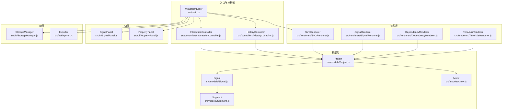
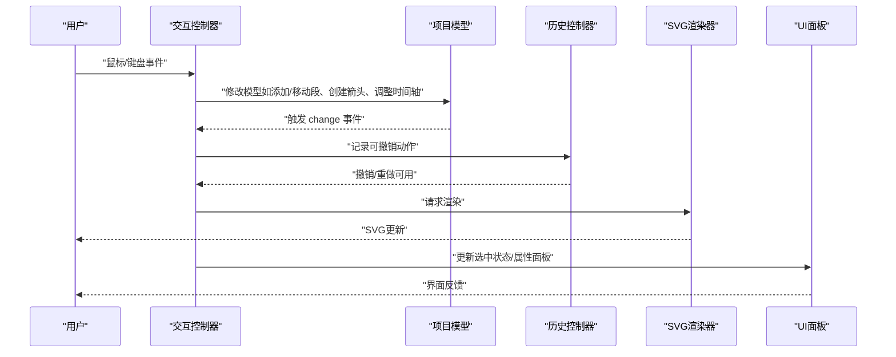
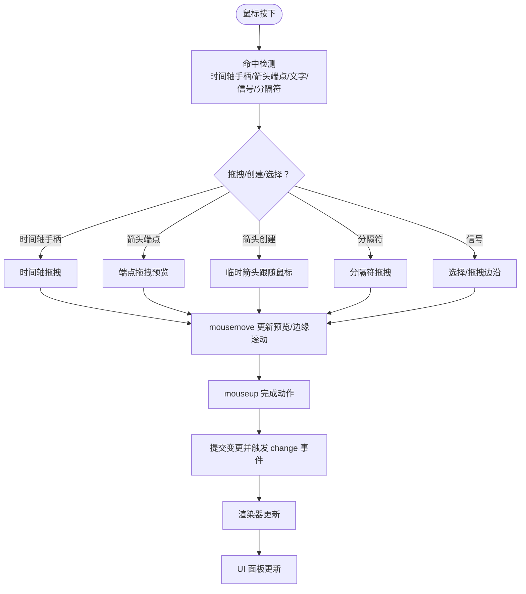
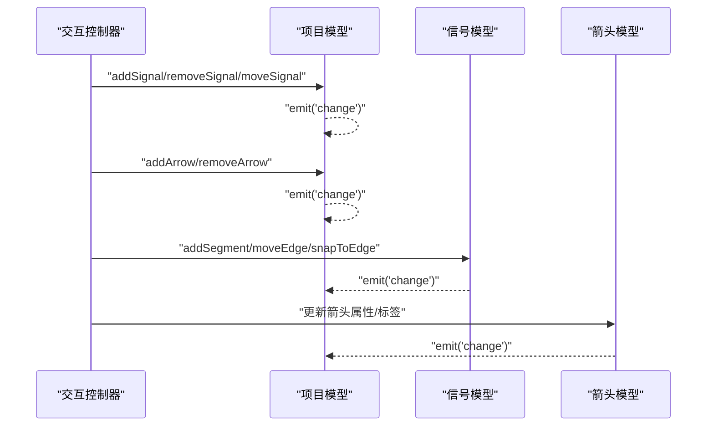
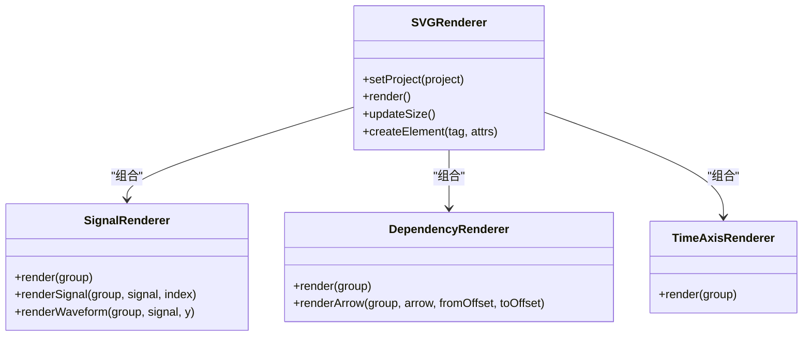
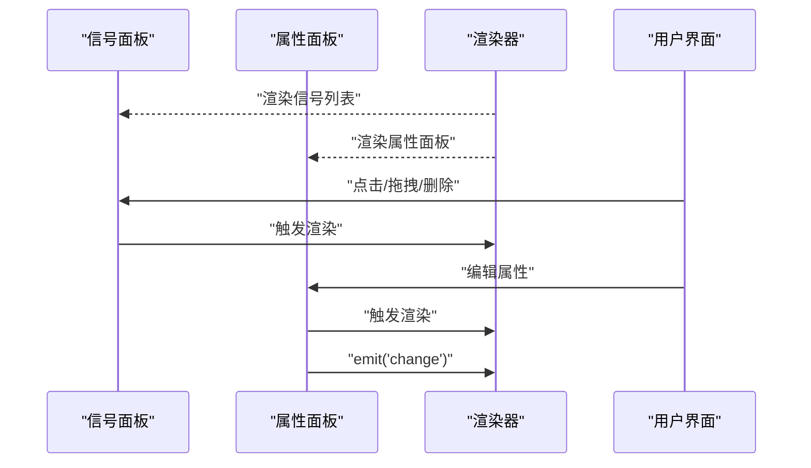
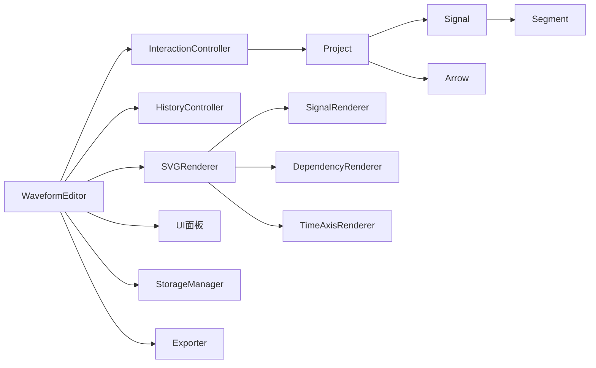
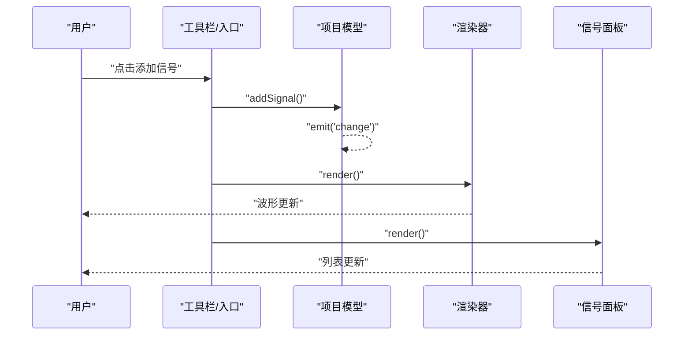

# 数据流与消息传递

<cite>
**本文引用的文件**
- [src/main.js](file://src/main.js)
- [src/controllers/InteractionController.js](file://src/controllers/InteractionController.js)
- [src/controllers/HistoryController.js](file://src/controllers/HistoryController.js)
- [src/models/Project.js](file://src/models/Project.js)
- [src/models/Signal.js](file://src/models/Signal.js)
- [src/models/Segment.js](file://src/models/Segment.js)
- [src/models/Arrow.js](file://src/models/Arrow.js)
- [src/renderers/SVGRenderer.js](file://src/renderers/SVGRenderer.js)
- [src/renderers/SignalRenderer.js](file://src/renderers/SignalRenderer.js)
- [src/renderers/DependencyRenderer.js](file://src/renderers/DependencyRenderer.js)
- [src/renderers/TimeAxisRenderer.js](file://src/renderers/TimeAxisRenderer.js)
- [src/ui/SignalPanel.js](file://src/ui/SignalPanel.js)
- [src/ui/PropertyPanel.js](file://src/ui/PropertyPanel.js)
- [src/io/StorageManager.js](file://src/io/StorageManager.js)
- [src/io/Exporter.js](file://src/io/Exporter.js)
</cite>

## 目录
1. [简介](#简介)
2. [项目结构](#项目结构)
3. [核心组件](#核心组件)
4. [架构总览](#架构总览)
5. [详细组件分析](#详细组件分析)
6. [依赖分析](#依赖分析)
7. [性能考虑](#性能考虑)
8. [故障排查指南](#故障排查指南)
9. [结论](#结论)
10. [附录](#附录)

## 简介
本文件围绕波形图编辑器的“数据流与消息传递”主题，系统性梳理从用户输入（鼠标/键盘）到界面更新的完整数据路径，解释模型层数据更新、渲染层数据消费、UI 层数据展示三者之间的协调关系；阐述异步处理与批处理优化策略；给出数据验证与转换规则及错误传播与恢复机制；并通过多种图示展示典型操作的数据流向。

## 项目结构
该编辑器采用分层架构：
- 控制层：负责事件解析与业务动作编排（交互控制器、历史控制器）
- 模型层：承载项目、信号、段、箭头等核心数据与行为
- 渲染层：负责 SVG 渲染与子渲染器协作
- UI 层：信号面板、属性面板等用户界面
- IO 层：本地存储与导出功能
- 入口：主编辑器类统一调度上述组件

图表来源
- [src/main.js:1-132](file://src/main.js#L1-L132)
- [src/controllers/InteractionController.js:1-50](file://src/controllers/InteractionController.js#L1-L50)
- [src/controllers/HistoryController.js:1-56](file://src/controllers/HistoryController.js#L1-L56)
- [src/models/Project.js:1-34](file://src/models/Project.js#L1-L34)
- [src/models/Signal.js:1-29](file://src/models/Signal.js#L1-L29)
- [src/models/Segment.js:1-19](file://src/models/Segment.js#L1-L19)
- [src/models/Arrow.js:1-45](file://src/models/Arrow.js#L1-L45)
- [src/renderers/SVGRenderer.js:1-54](file://src/renderers/SVGRenderer.js#L1-L54)
- [src/renderers/SignalRenderer.js:1-16](file://src/renderers/SignalRenderer.js#L1-L16)
- [src/renderers/DependencyRenderer.js:1-12](file://src/renderers/DependencyRenderer.js#L1-L12)
- [src/renderers/TimeAxisRenderer.js:1-15](file://src/renderers/TimeAxisRenderer.js#L1-L15)
- [src/ui/SignalPanel.js:1-8](file://src/ui/SignalPanel.js#L1-L8)
- [src/ui/PropertyPanel.js:1-12](file://src/ui/PropertyPanel.js#L1-L12)
- [src/io/StorageManager.js:1-6](file://src/io/StorageManager.js#L1-L6)
- [src/io/Exporter.js:1-5](file://src/io/Exporter.js#L1-L5)

章节来源
- [src/main.js:1-132](file://src/main.js#L1-L132)

## 核心组件
- WaveformEditor：应用入口，负责初始化、事件绑定、渲染调度、多 sheet 管理、自动保存、导出与模板管理
- InteractionController：解析鼠标/键盘事件，驱动模型层变更，协调渲染层与 UI 层
- HistoryController：维护撤销/重做栈，封装可回滚的动作
- Project/Signal/Segment/Arrow：数据模型，提供事件通知与序列化
- SVGRenderer/SignalRenderer/DependencyRenderer/TimeAxisRenderer：渲染器，负责 SVG 输出与布局
- SignalPanel/PropertyPanel：UI 面板，负责展示与编辑
- StorageManager/Exporter：持久化与导出

章节来源
- [src/main.js:21-132](file://src/main.js#L21-L132)
- [src/controllers/InteractionController.js:6-50](file://src/controllers/InteractionController.js#L6-L50)
- [src/controllers/HistoryController.js:5-56](file://src/controllers/HistoryController.js#L5-L56)
- [src/models/Project.js:8-34](file://src/models/Project.js#L8-L34)
- [src/models/Signal.js:7-29](file://src/models/Signal.js#L7-L29)
- [src/models/Segment.js:5-19](file://src/models/Segment.js#L5-L19)
- [src/models/Arrow.js:5-45](file://src/models/Arrow.js#L5-L45)
- [src/renderers/SVGRenderer.js:10-54](file://src/renderers/SVGRenderer.js#L10-L54)
- [src/renderers/SignalRenderer.js:6-16](file://src/renderers/SignalRenderer.js#L6-L16)
- [src/renderers/DependencyRenderer.js:7-12](file://src/renderers/DependencyRenderer.js#L7-L12)
- [src/renderers/TimeAxisRenderer.js:6-15](file://src/renderers/TimeAxisRenderer.js#L6-L15)
- [src/ui/SignalPanel.js:1-8](file://src/ui/SignalPanel.js#L1-L8)
- [src/ui/PropertyPanel.js:3-12](file://src/ui/PropertyPanel.js#L3-L12)
- [src/io/StorageManager.js:1-6](file://src/io/StorageManager.js#L1-L6)
- [src/io/Exporter.js:1-5](file://src/io/Exporter.js#L1-L5)

## 架构总览
整体数据流遵循“事件驱动 -> 模型变更 -> 事件广播 -> 渲染层消费 -> UI 展示”的闭环。入口类负责装配与调度，控制器负责事件解析与动作编排，模型层提供数据与事件，渲染层负责输出，UI 层负责交互与反馈。

图表来源
- [src/controllers/InteractionController.js:84-337](file://src/controllers/InteractionController.js#L84-L337)
- [src/controllers/HistoryController.js:13-42](file://src/controllers/HistoryController.js#L13-L42)
- [src/models/Project.js:199-202](file://src/models/Project.js#L199-L202)
- [src/renderers/SVGRenderer.js:284-314](file://src/renderers/SVGRenderer.js#L284-L314)
- [src/ui/PropertyPanel.js:32-237](file://src/ui/PropertyPanel.js#L32-L237)

## 详细组件分析

### 1) 用户输入到状态变更：鼠标与键盘事件
- 鼠标事件
  - mousedown：判定时间轴手柄、箭头端点/文字、信号行、分隔符等命中区域，进入拖拽/创建/选择流程
  - mousemove：根据拖拽模式更新预览（临时箭头、端点吸附、时间轴拖拽、边缘滚动）、更新选择框
  - mouseup：完成拖拽（时间轴缩放、箭头创建/端点/文字/分隔符），提交变更并触发渲染
- 键盘事件
  - Delete：删除选中箭头/分隔符/信号
  - Ctrl/Cmd+Z/Y：撤销/重做

图表来源
- [src/controllers/InteractionController.js:84-337](file://src/controllers/InteractionController.js#L84-L337)
- [src/controllers/InteractionController.js:342-401](file://src/controllers/InteractionController.js#L342-L401)
- [src/controllers/InteractionController.js:403-432](file://src/controllers/InteractionController.js#L403-L432)

章节来源
- [src/controllers/InteractionController.js:52-82](file://src/controllers/InteractionController.js#L52-L82)
- [src/controllers/InteractionController.js:84-337](file://src/controllers/InteractionController.js#L84-L337)
- [src/controllers/InteractionController.js:403-432](file://src/controllers/InteractionController.js#L403-L432)

### 2) 模型层数据更新与事件广播
- Project 提供 add/remove/move/timeRange/timeScale 等变更，并通过 emit('change', payload) 广播
- Signal/Arrow/Segment 提供 addSegment/addArrow 等方法，内部进行合并/吸附/校验
- 事件监听器在入口类中注册，实现自动保存与 UI 同步

图表来源
- [src/models/Project.js:47-135](file://src/models/Project.js#L47-L135)
- [src/models/Project.js:199-202](file://src/models/Project.js#L199-L202)
- [src/models/Signal.js:62-133](file://src/models/Signal.js#L62-L133)
- [src/models/Signal.js:202-220](file://src/models/Signal.js#L202-L220)
- [src/models/Arrow.js:78-94](file://src/models/Arrow.js#L78-L94)

章节来源
- [src/models/Project.js:47-135](file://src/models/Project.js#L47-L135)
- [src/models/Signal.js:62-133](file://src/models/Signal.js#L62-L133)
- [src/models/Arrow.js:78-94](file://src/models/Arrow.js#L78-L94)

### 3) 渲染层数据消费与输出
- SVGRenderer 负责尺寸计算、分组组织、子渲染器调度
- SignalRenderer/DependencyRenderer/TimeAxisRenderer 分别渲染波形、依赖箭头、时间轴
- 渲染完成后，UI 面板同步选中状态与属性

图表来源
- [src/renderers/SVGRenderer.js:46-54](file://src/renderers/SVGRenderer.js#L46-L54)
- [src/renderers/SVGRenderer.js:284-314](file://src/renderers/SVGRenderer.js#L284-L314)
- [src/renderers/SignalRenderer.js:22-31](file://src/renderers/SignalRenderer.js#L22-L31)
- [src/renderers/DependencyRenderer.js:18-84](file://src/renderers/DependencyRenderer.js#L18-L84)
- [src/renderers/TimeAxisRenderer.js:21-78](file://src/renderers/TimeAxisRenderer.js#L21-L78)

章节来源
- [src/renderers/SVGRenderer.js:194-243](file://src/renderers/SVGRenderer.js#L194-L243)
- [src/renderers/SignalRenderer.js:22-31](file://src/renderers/SignalRenderer.js#L22-L31)
- [src/renderers/DependencyRenderer.js:18-84](file://src/renderers/DependencyRenderer.js#L18-L84)
- [src/renderers/TimeAxisRenderer.js:21-78](file://src/renderers/TimeAxisRenderer.js#L21-L78)

### 4) UI 层数据展示与交互
- SignalPanel：信号列表、拖拽排序、删除、滚动同步
- PropertyPanel：信号/箭头/项目属性编辑，输入变更即时触发渲染与 change 事件
- 入口类在渲染时同步选中状态与面板显示

图表来源
- [src/ui/SignalPanel.js:45-67](file://src/ui/SignalPanel.js#L45-L67)
- [src/ui/SignalPanel.js:69-163](file://src/ui/SignalPanel.js#L69-L163)
- [src/ui/PropertyPanel.js:32-237](file://src/ui/PropertyPanel.js#L32-L237)
- [src/main.js:763-769](file://src/main.js#L763-L769)

章节来源
- [src/ui/SignalPanel.js:13-26](file://src/ui/SignalPanel.js#L13-L26)
- [src/ui/SignalPanel.js:69-163](file://src/ui/SignalPanel.js#L69-L163)
- [src/ui/PropertyPanel.js:32-237](file://src/ui/PropertyPanel.js#L32-L237)
- [src/main.js:763-769](file://src/main.js#L763-L769)

### 5) 异步数据处理与批处理优化
- 自动保存：监听项目 change 事件，延迟保存到 localStorage，避免频繁 I/O
- 窗口 resize：节流（setTimeout 200ms）批量触发渲染
- 时间轴边缘滚动：requestAnimationFrame 持续扩展时间轴，避免卡顿
- 导出：异步生成 PNG/SVG，Clipboard API/Fallback 流程，超时提示
- 模板与多 sheet：localStorage 批量读写，迁移逻辑一次性完成

章节来源
- [src/main.js:226-241](file://src/main.js#L226-L241)
- [src/main.js:589-595](file://src/main.js#L589-L595)
- [src/controllers/InteractionController.js:370-394](file://src/controllers/InteractionController.js#L370-L394)
- [src/io/Exporter.js:98-187](file://src/io/Exporter.js#L98-L187)
- [src/io/StorageManager.js:138-164](file://src/io/StorageManager.js#L138-L164)

### 6) 数据验证与转换规则
- Segment 校验：起始时间必须小于结束时间
- Signal.addSegment：合并重叠段、相邻同值段，保持有序
- Signal.snapToEdge：基于阈值吸附到段边界
- Project.timeToX/xToTime：时间与像素坐标互转
- Arrow 标签与样式：多标签支持、兼容旧字段 text/textOffset

章节来源
- [src/models/Segment.js:24-28](file://src/models/Segment.js#L24-L28)
- [src/models/Signal.js:62-133](file://src/models/Signal.js#L62-L133)
- [src/models/Signal.js:202-220](file://src/models/Signal.js#L202-L220)
- [src/models/Project.js:159-170](file://src/models/Project.js#L159-L170)
- [src/models/Arrow.js:55-76](file://src/models/Arrow.js#L55-L76)

### 7) 错误传播与恢复机制
- 事件广播：项目/信号/箭头变更通过 emit('change') 传播，订阅方响应
- 撤销/重做：HistoryController 维护动作栈，支持撤销/重做
- 入口类自动保存：异常时记录日志，不影响主流程
- 导出失败：提供多种回退方案（data URL、新窗口）

章节来源
- [src/models/Project.js:199-202](file://src/models/Project.js#L199-L202)
- [src/controllers/HistoryController.js:24-42](file://src/controllers/HistoryController.js#L24-L42)
- [src/main.js:226-241](file://src/main.js#L226-L241)
- [src/io/Exporter.js:142-178](file://src/io/Exporter.js#L142-L178)

## 依赖分析
- 组件耦合
  - WaveformEditor 依赖所有子系统，但通过 setter/事件解耦
  - InteractionController 依赖 Project/Renderer/HistoryController/Editor
  - SVGRenderer 组合三个子渲染器
- 外部依赖
  - localStorage：多 sheet 注册表与项目数据
  - Clipboard API：导出到剪贴板
  - fetch：加载模板与静态资源

图表来源
- [src/main.js:103-118](file://src/main.js#L103-L118)
- [src/controllers/InteractionController.js:7-11](file://src/controllers/InteractionController.js#L7-L11)
- [src/renderers/SVGRenderer.js:34-36](file://src/renderers/SVGRenderer.js#L34-L36)
- [src/models/Project.js:5-7](file://src/models/Project.js#L5-L7)

章节来源
- [src/main.js:103-118](file://src/main.js#L103-L118)
- [src/controllers/InteractionController.js:7-11](file://src/controllers/InteractionController.js#L7-L11)
- [src/renderers/SVGRenderer.js:34-36](file://src/renderers/SVGRenderer.js#L34-L36)

## 性能考虑
- 渲染批处理：入口类 render() 统一调度渲染器与面板，避免重复渲染
- 事件节流：resize 与时间轴边缘滚动使用定时器与 RAF
- 选择吸附：snapToEdge 使用阈值减少不必要的微调
- 导出优化：PNG 先绘制到 Canvas 再导出，避免复杂 DOM

## 故障排查指南
- 无法保存/加载：检查 localStorage 权限与容量；查看注册表与 sheet 数据是否存在
- 导出失败：确认浏览器支持 Clipboard API；若失败回退到 data URL 或新窗口
- 渲染异常：检查时间轴 end 是否小于等于 start；确认信号段是否有效
- 撤销/重做无效：确认动作是否被正确压栈与清空

章节来源
- [src/io/StorageManager.js:14-34](file://src/io/StorageManager.js#L14-L34)
- [src/io/Exporter.js:142-178](file://src/io/Exporter.js#L142-L178)
- [src/models/Segment.js:24-28](file://src/models/Segment.js#L24-L28)
- [src/controllers/HistoryController.js:44-55](file://src/controllers/HistoryController.js#L44-L55)

## 结论
该编辑器通过清晰的分层与事件驱动机制，实现了从用户输入到界面更新的高效数据流。模型层提供强健的数据结构与事件广播，渲染层专注输出与布局，UI 层负责交互与反馈，IO 层保障持久化与导出。异步与批处理策略提升了用户体验，完善的验证与错误处理增强了系统稳定性。

## 附录
- 典型操作时序图（添加信号）

图表来源
- [src/main.js:453-455](file://src/main.js#L453-L455)
- [src/main.js:634-668](file://src/main.js#L634-L668)
- [src/models/Project.js:47-50](file://src/models/Project.js#L47-L50)
- [src/main.js:763-769](file://src/main.js#L763-L769)