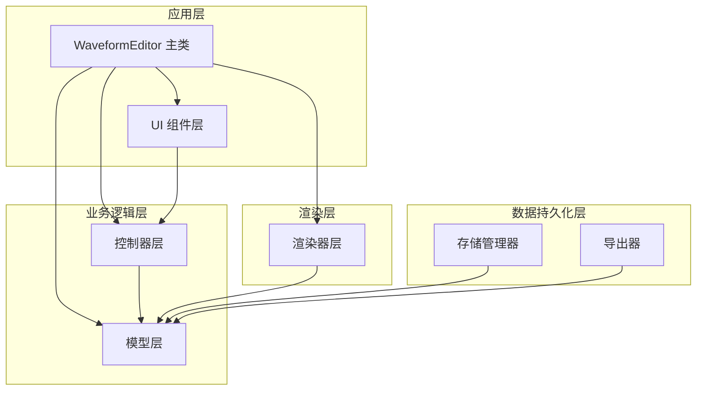
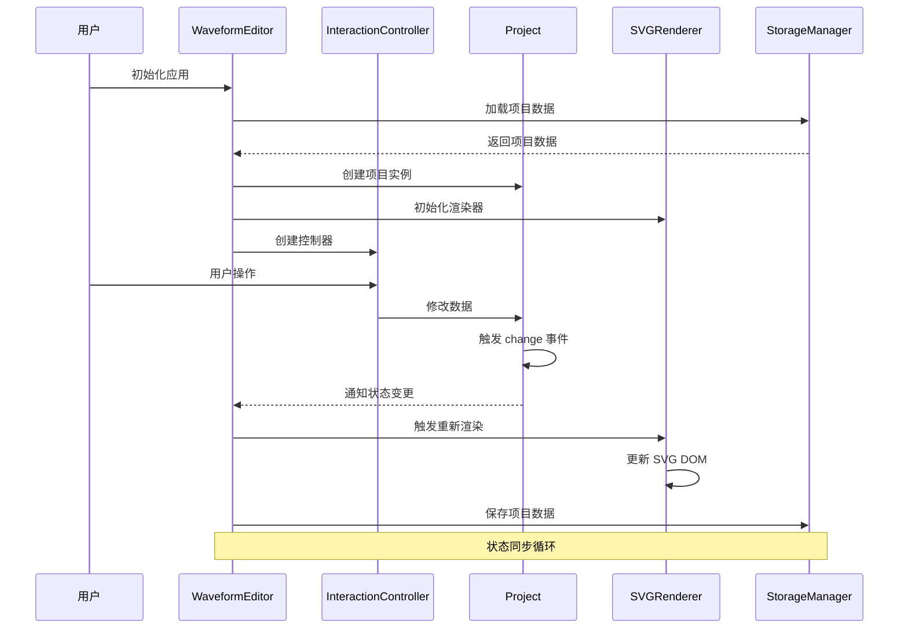
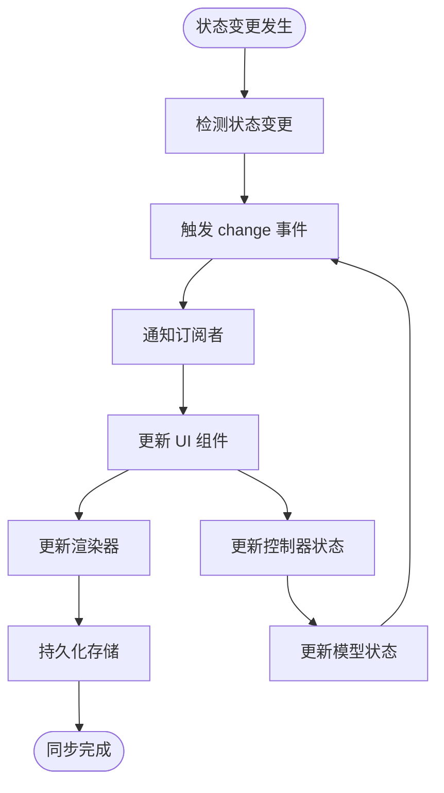
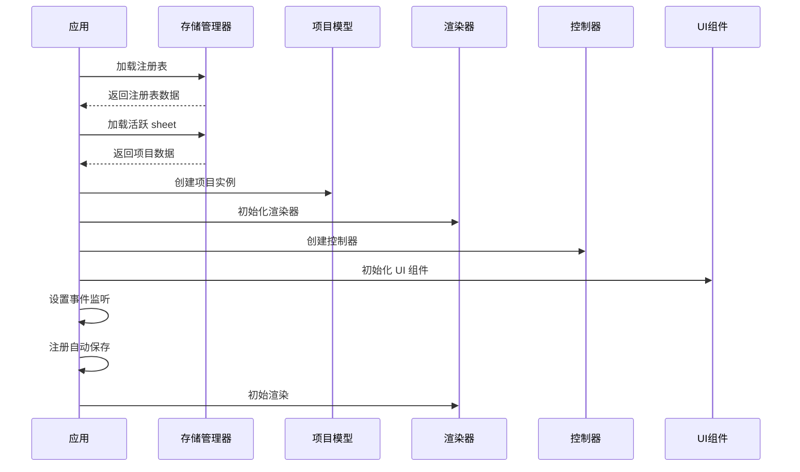
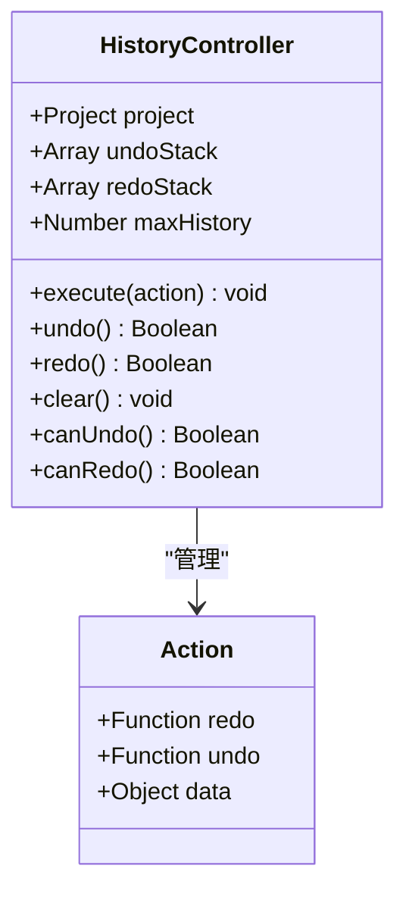
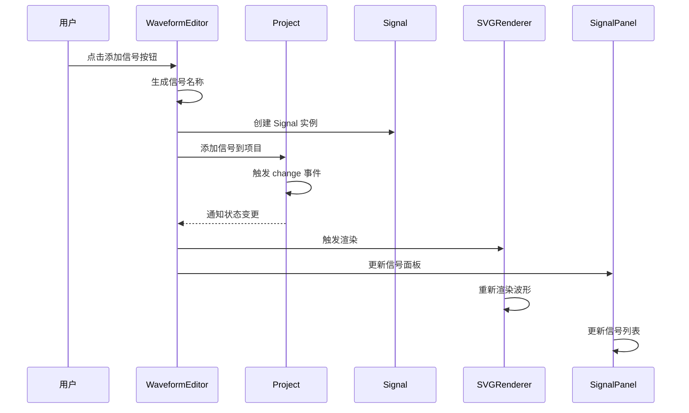
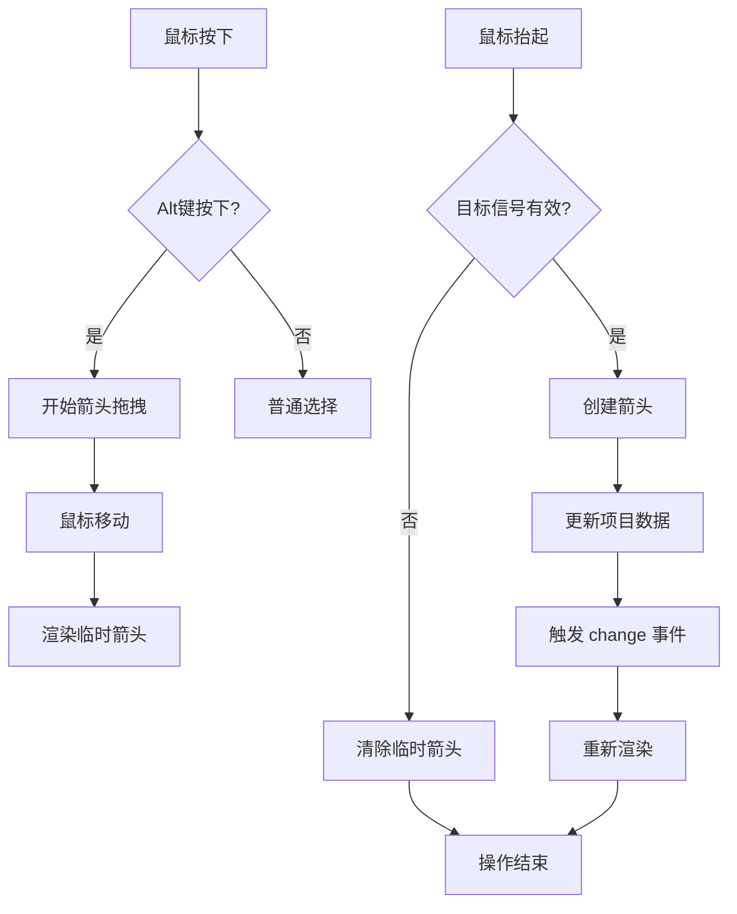
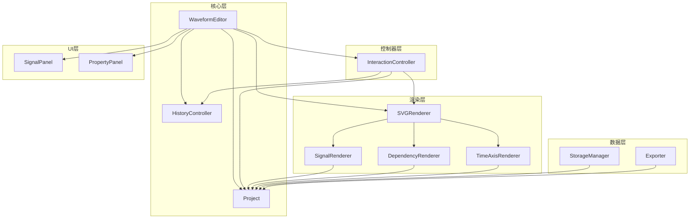

# 状态同步与生命周期管理

<cite>
**本文档引用的文件**
- [src/main.js](file://src/main.js)
- [src/models/Project.js](file://src/models/Project.js)
- [src/controllers/HistoryController.js](file://src/controllers/HistoryController.js)
- [src/controllers/InteractionController.js](file://src/controllers/InteractionController.js)
- [src/renderers/SVGRenderer.js](file://src/renderers/SVGRenderer.js)
- [src/renderers/SignalRenderer.js](file://src/renderers/SignalRenderer.js)
- [src/renderers/DependencyRenderer.js](file://src/renderers/DependencyRenderer.js)
- [src/renderers/TimeAxisRenderer.js](file://src/renderers/TimeAxisRenderer.js)
- [src/ui/SignalPanel.js](file://src/ui/SignalPanel.js)
- [src/ui/PropertyPanel.js](file://src/ui/PropertyPanel.js)
- [src/io/StorageManager.js](file://src/io/StorageManager.js)
- [src/io/Exporter.js](file://src/io/Exporter.js)
- [src/models/Signal.js](file://src/models/Signal.js)
- [src/models/Arrow.js](file://src/models/Arrow.js)
</cite>

## 目录
1. [简介](#简介)
2. [项目结构](#项目结构)
3. [核心组件](#核心组件)
4. [架构概览](#架构概览)
5. [详细组件分析](#详细组件分析)
6. [依赖关系分析](#依赖关系分析)
7. [性能考虑](#性能考虑)
8. [故障排除指南](#故障排除指南)
9. [结论](#结论)

## 简介

波形图编辑器是一个基于 Web 的可视化工具，用于创建和编辑数字电路波形图。该系统采用模块化架构设计，实现了完整的状态同步机制，包括项目状态、UI状态和渲染状态的协调管理。系统支持多组件状态同步、生命周期管理、状态变更传播、状态快照和恢复机制，以及状态一致性保证和并发控制策略。

## 项目结构

波形图编辑器采用清晰的分层架构，主要分为以下层次：

**图表来源**
- [src/main.js:21-44](file://src/main.js#L21-L44)
- [src/models/Project.js:8-34](file://src/models/Project.js#L8-L34)

**章节来源**
- [src/main.js:1-819](file://src/main.js#L1-L819)

## 核心组件

### 主编辑器类 (WaveformEditor)

WaveformEditor 是整个应用的核心控制器，负责协调各个子系统的初始化、状态管理和生命周期控制。

**主要职责：**
- 项目初始化和加载
- 多 sheet 管理
- UI 组件协调
- 状态同步和传播
- 事件监听和处理

**关键状态属性：**
- `project`: 当前项目实例
- `selectedSignalId`: 选中信号 ID
- `selectedSegmentIndex`: 选中段索引
- `selectedArrowId`: 选中箭头 ID
- `showProjectProperties`: 项目属性面板显示状态
- `activeSheetId`: 活跃 sheet ID

**章节来源**
- [src/main.js:21-44](file://src/main.js#L21-L44)
- [src/main.js:49-132](file://src/main.js#L49-L132)

### 项目模型 (Project)

Project 类是数据模型的核心，封装了波形图的所有数据和业务逻辑。

**核心功能：**
- 信号管理 (addSignal/removeSignal/moveSignal)
- 箭头管理 (addArrow/removeArrow)
- 时间轴管理 (setTimeRange/setTimeScale)
- 事件系统 (on/off/emit)
- 序列化和反序列化 (toJSON/fromJSON)

**状态特性：**
- 支持事件驱动的状态变更
- 提供完整的数据持久化能力
- 内置数据验证和迁移机制

**章节来源**
- [src/models/Project.js:8-245](file://src/models/Project.js#L8-L245)

### 控制器层

#### 历史控制器 (HistoryController)

实现撤销/重做功能的历史记录管理。

**核心机制：**
- 双栈设计 (undoStack/redoStack)
- 最大历史记录数量限制
- 动作执行和回滚机制

#### 交互控制器 (InteractionController)

处理用户交互和状态变更的核心控制器。

**主要功能：**
- 鼠标事件处理
- 信号选择和编辑
- 箭头创建和编辑
- 分隔符拖拽
- 时间轴缩放

**章节来源**
- [src/controllers/HistoryController.js:5-56](file://src/controllers/HistoryController.js#L5-L56)
- [src/controllers/InteractionController.js:6-50](file://src/controllers/InteractionController.js#L6-L50)

### 渲染器层

#### SVG 渲染器 (SVGRenderer)

主渲染器，协调各个子渲染器进行最终渲染。

**核心职责：**
- 渲染配置管理
- 子渲染器协调
- SVG DOM 管理
- 尺寸计算和更新

#### 信号渲染器 (SignalRenderer)

专门负责波形信号的渲染。

**渲染特性：**
- 支持多种信号类型 (普通信号、时钟、总线)
- 特殊状态渲染 (X 态、Z 态)
- 分隔符处理
- 跳变沿节点渲染

#### 依赖渲染器 (DependencyRenderer)

负责依赖箭头的渲染和布局。

**布局算法：**
- 同起点多箭头偏移避免重叠
- 同终点多箭头汇聚处理
- 贝塞尔曲线控制点计算

#### 时间轴渲染器 (TimeAxisRenderer)

时间轴的专门渲染器。

**功能特性：**
- 刻度间隔自动计算
- 拖拽手柄渲染
- 标签格式化

**章节来源**
- [src/renderers/SVGRenderer.js:10-547](file://src/renderers/SVGRenderer.js#L10-L547)
- [src/renderers/SignalRenderer.js:6-501](file://src/renderers/SignalRenderer.js#L6-L501)
- [src/renderers/DependencyRenderer.js:7-290](file://src/renderers/DependencyRenderer.js#L7-L290)
- [src/renderers/TimeAxisRenderer.js:6-132](file://src/renderers/TimeAxisRenderer.js#L6-L132)

### UI 组件层

#### 信号面板 (SignalPanel)

信号列表的 UI 组件。

**功能特性：**
- 信号拖拽排序
- 滚动同步
- 垂直对齐计算

#### 属性面板 (PropertyPanel)

属性编辑的 UI 组件。

**面板类型：**
- 信号属性面板
- 箭头属性面板
- 项目设置面板

**章节来源**
- [src/ui/SignalPanel.js:1-164](file://src/ui/SignalPanel.js#L1-L164)
- [src/ui/PropertyPanel.js:3-507](file://src/ui/PropertyPanel.js#L3-L507)

### 数据持久化层

#### 存储管理器 (StorageManager)

多 sheet 数据管理。

**核心功能：**
- sheet 注册表管理
- 数据迁移支持
- 模板管理
- 项目导入导出

#### 导出器 (Exporter)

项目导出功能。

**导出格式：**
- SVG 导出
- PNG 导出
- JSON 导出
- 独立 HTML 导出

**章节来源**
- [src/io/StorageManager.js:1-368](file://src/io/StorageManager.js#L1-L368)
- [src/io/Exporter.js:1-298](file://src/io/Exporter.js#L1-L298)

## 架构概览

波形图编辑器采用 MVC 架构模式，结合事件驱动的设计原则：

**图表来源**
- [src/main.js:49-132](file://src/main.js#L49-L132)
- [src/models/Project.js:199-202](file://src/models/Project.js#L199-L202)

## 详细组件分析

### 状态同步机制

#### 事件驱动的状态同步

系统采用事件驱动的方式实现多组件间的状态同步：

**图表来源**
- [src/models/Project.js:199-202](file://src/models/Project.js#L199-L202)
- [src/main.js:230-241](file://src/main.js#L230-L241)

#### 多组件状态协调

系统通过以下机制实现多组件状态协调：

1. **统一状态源**: Project 模型作为单一事实来源
2. **事件传播**: 通过 Project 的事件系统传播状态变更
3. **状态同步**: 各组件监听并响应状态变更
4. **循环控制**: 防止状态同步循环的死锁机制

**章节来源**
- [src/models/Project.js:177-202](file://src/models/Project.js#L177-L202)
- [src/main.js:763-769](file://src/main.js#L763-L769)

### 生命周期管理

#### 初始化流程

**图表来源**
- [src/main.js:49-132](file://src/main.js#L49-L132)

#### 销毁和清理流程

系统提供了完整的资源清理机制：

1. **事件监听器清理**: 移除所有注册的事件监听器
2. **DOM 元素清理**: 清理 SVG DOM 和 UI 元素
3. **定时器清理**: 取消所有活动的定时器
4. **内存清理**: 置空所有引用，释放内存

**章节来源**
- [src/main.js:351-368](file://src/main.js#L351-L368)

### 状态变更传播机制

#### 局部状态更新

局部状态更新通过以下步骤实现：

1. **状态变更检测**: 通过事件系统检测状态变更
2. **变更传播**: 将变更通知到所有订阅者
3. **组件更新**: 各组件根据变更类型更新自身状态
4. **渲染触发**: 触发相应的渲染更新

#### 全局状态同步

全局状态同步通过以下机制实现：

1. **状态聚合**: 将分散的状态聚合到统一的数据结构
2. **一致性检查**: 确保各组件状态的一致性
3. **冲突解决**: 处理状态同步过程中的冲突
4. **回滚机制**: 提供状态变更的回滚能力

**章节来源**
- [src/controllers/InteractionController.js:84-337](file://src/controllers/InteractionController.js#L84-L337)
- [src/renderers/SVGRenderer.js:284-314](file://src/renderers/SVGRenderer.js#L284-L314)

### 状态快照和恢复机制

#### 快照生成

系统通过 HistoryController 实现状态快照功能：

**图表来源**
- [src/controllers/HistoryController.js:5-56](file://src/controllers/HistoryController.js#L5-L56)

#### 恢复机制

状态恢复通过以下步骤实现：

1. **动作执行**: 执行 redo 函数恢复状态
2. **堆栈维护**: 将动作从 undo 栈移动到 redo 栈
3. **状态更新**: 更新当前应用状态
4. **界面刷新**: 触发界面重新渲染

**章节来源**
- [src/controllers/HistoryController.js:13-42](file://src/controllers/HistoryController.js#L13-L42)

### 状态一致性保证和并发控制

#### 并发控制策略

系统采用以下并发控制策略：

1. **单线程模型**: 所有状态变更在主线程中顺序执行
2. **事件队列**: 使用事件队列确保状态变更的有序性
3. **状态锁定**: 在复杂操作期间锁定状态变更
4. **事务性操作**: 将相关的状态变更包装在事务中

#### 一致性保证机制

1. **原子性**: 状态变更要么完全成功，要么完全失败
2. **一致性**: 系统始终处于一致的状态
3. **隔离性**: 并发操作不会相互干扰
4. **持久性**: 状态变更持久化到存储

**章节来源**
- [src/controllers/InteractionController.js:284-337](file://src/controllers/InteractionController.js#L284-L337)

### 典型操作场景下的状态流转

#### 添加信号操作

**图表来源**
- [src/main.js:634-668](file://src/main.js#L634-L668)
- [src/models/Project.js:47-50](file://src/models/Project.js#L47-L50)

#### 箭头创建操作

**图表来源**
- [src/controllers/InteractionController.js:572-756](file://src/controllers/InteractionController.js#L572-L756)

**章节来源**
- [src/main.js:634-668](file://src/main.js#L634-L668)
- [src/controllers/InteractionController.js:572-756](file://src/controllers/InteractionController.js#L572-L756)

## 依赖关系分析

### 组件依赖图

**图表来源**
- [src/main.js:4-16](file://src/main.js#L4-L16)
- [src/renderers/SVGRenderer.js:5-8](file://src/renderers/SVGRenderer.js#L5-L8)

### 数据流分析

系统中的数据流遵循以下模式：

1. **用户输入** → **控制器** → **模型** → **事件系统** → **渲染器/UI**
2. **模型状态** → **事件系统** → **所有订阅者** → **状态同步**
3. **存储系统** → **模型** → **渲染器** → **用户界面**

**章节来源**
- [src/main.js:451-629](file://src/main.js#L451-L629)

## 性能考虑

### 渲染优化

1. **增量渲染**: 只重新渲染发生变化的部分
2. **虚拟滚动**: 大信号集的虚拟化处理
3. **防抖处理**: 高频事件的防抖优化
4. **Web Workers**: 复杂计算的异步处理

### 内存管理

1. **对象池**: 重复使用的对象复用
2. **垃圾回收**: 及时释放不再使用的对象
3. **内存泄漏防护**: 严格的事件监听器清理
4. **大数据集处理**: 分页和懒加载机制

### 并发处理

1. **单线程模型**: 避免复杂的并发同步
2. **异步操作**: 长时间操作的异步化
3. **状态锁定**: 复杂操作期间的状态保护
4. **事务性操作**: 批量操作的原子性保证

## 故障排除指南

### 常见问题诊断

#### 状态不同步问题

**症状**: UI 状态与实际数据不一致

**排查步骤**:
1. 检查事件监听器是否正常工作
2. 验证 Project 模型的事件触发
3. 确认渲染器的更新机制
4. 检查存储系统的数据完整性

#### 性能问题

**症状**: 操作响应缓慢，界面卡顿

**解决方案**:
1. 实施增量渲染优化
2. 减少不必要的重渲染
3. 使用防抖和节流技术
4. 优化大型数据集的处理

#### 数据丢失问题

**症状**: 项目数据意外丢失

**预防措施**:
1. 实施自动保存机制
2. 建立数据备份策略
3. 实现撤销/重做功能
4. 添加数据完整性检查

**章节来源**
- [src/main.js:226-241](file://src/main.js#L226-L241)
- [src/io/StorageManager.js:138-164](file://src/io/StorageManager.js#L138-L164)

## 结论

波形图编辑器的状态同步机制展现了现代前端应用的最佳实践。通过事件驱动的设计、清晰的组件分离和完善的生命周期管理，系统实现了高效、可靠的状态同步。

**主要优势：**
1. **模块化设计**: 清晰的职责分离和依赖管理
2. **事件驱动**: 响应式的状态变更处理
3. **生命周期完整**: 从初始化到销毁的全生命周期管理
4. **状态一致性**: 强一致性的状态同步机制
5. **性能优化**: 多层次的性能优化策略

**技术特色：**
- 基于事件的松耦合架构
- 完善的撤销/重做机制
- 多 sheet 状态管理
- 实时数据持久化
- 丰富的导出功能

该系统为类似的复杂前端应用提供了优秀的参考架构，展示了如何在保持代码可维护性的同时实现高性能的状态管理。