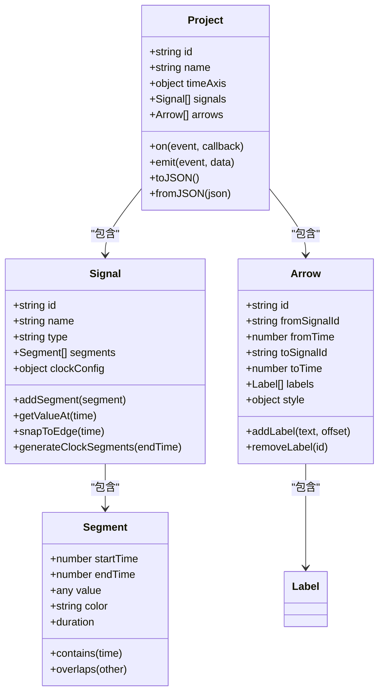
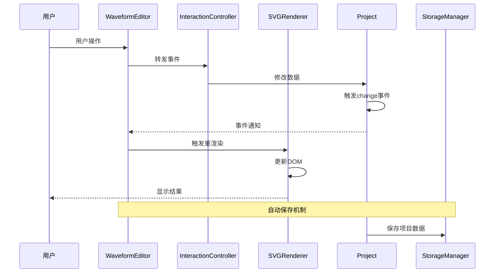
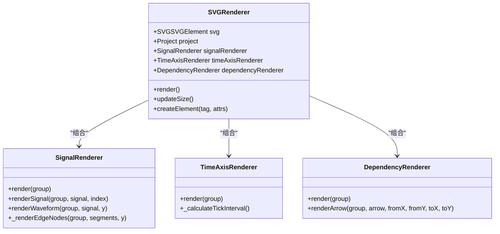
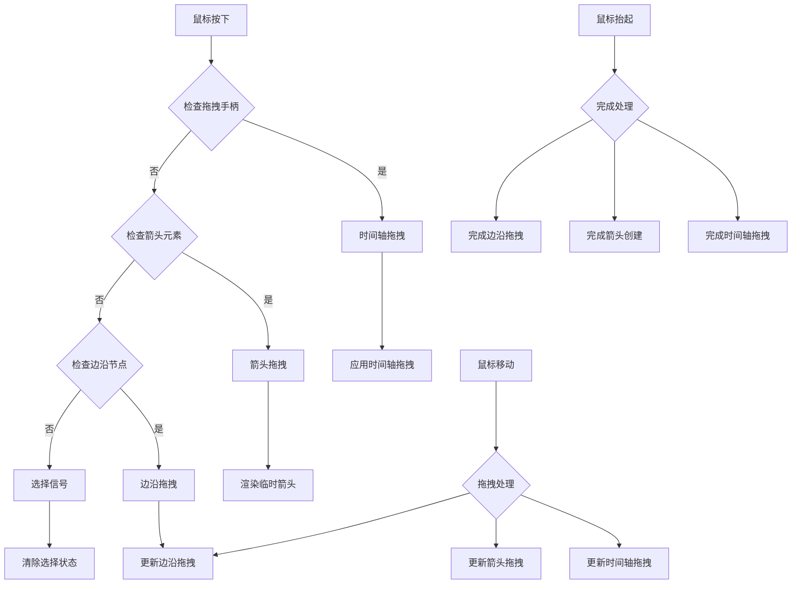
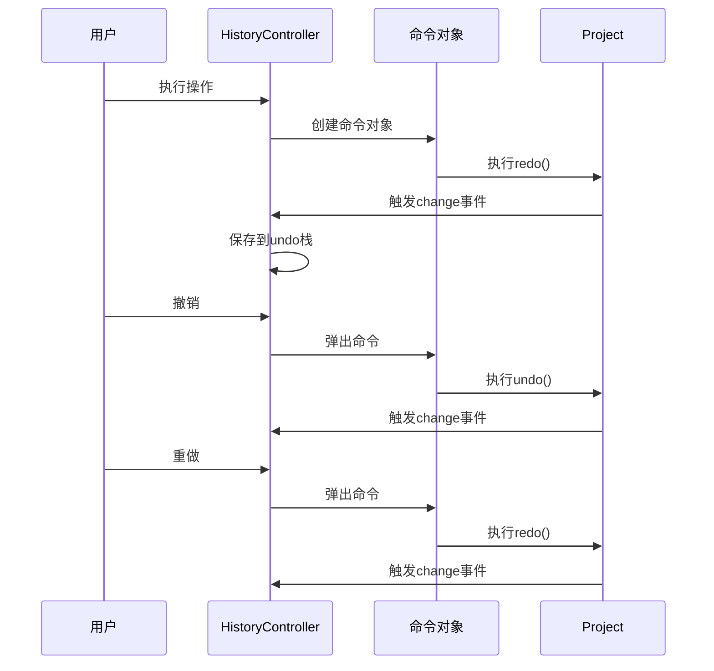
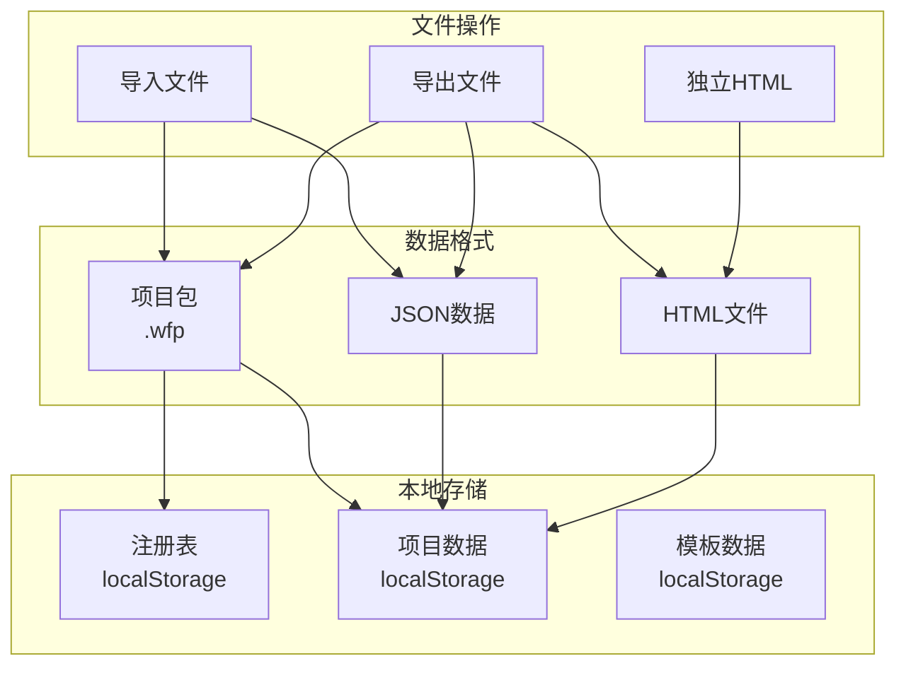
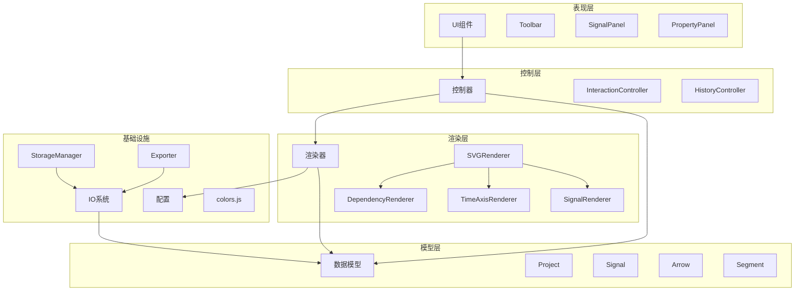

# 组件交互机制

<cite>
**本文档引用的文件**
- [src/main.js](file://src/main.js)
- [src/controllers/HistoryController.js](file://src/controllers/HistoryController.js)
- [src/controllers/InteractionController.js](file://src/controllers/InteractionController.js)
- [src/renderers/SVGRenderer.js](file://src/renderers/SVGRenderer.js)
- [src/renderers/SignalRenderer.js](file://src/renderers/SignalRenderer.js)
- [src/renderers/TimeAxisRenderer.js](file://src/renderers/TimeAxisRenderer.js)
- [src/renderers/DependencyRenderer.js](file://src/renderers/DependencyRenderer.js)
- [src/ui/Toolbar.js](file://src/ui/Toolbar.js)
- [src/ui/SignalPanel.js](file://src/ui/SignalPanel.js)
- [src/ui/PropertyPanel.js](file://src/ui/PropertyPanel.js)
- [src/io/StorageManager.js](file://src/io/StorageManager.js)
- [src/io/Exporter.js](file://src/io/Exporter.js)
- [src/models/Project.js](file://src/models/Project.js)
- [src/models/Signal.js](file://src/models/Signal.js)
- [src/models/Arrow.js](file://src/models/Arrow.js)
- [src/models/Segment.js](file://src/models/Segment.js)
- [src/config/colors.js](file://src/config/colors.js)
</cite>

## 目录
1. [简介](#简介)
2. [项目结构](#项目结构)
3. [核心组件](#核心组件)
4. [架构概览](#架构概览)
5. [详细组件分析](#详细组件分析)
6. [依赖分析](#依赖分析)
7. [性能考虑](#性能考虑)
8. [故障排除指南](#故障排除指南)
9. [结论](#结论)

## 简介

波形图编辑器是一个基于Web的可视化工具，允许用户创建、编辑和导出数字波形图。该系统采用模块化架构设计，通过清晰的组件分离和标准化的数据流实现复杂的交互功能。

本系统的核心设计理念是"数据驱动的渲染架构"，其中数据模型作为单一事实来源，所有UI组件和渲染器都围绕数据模型进行工作。系统支持多信号编辑、依赖箭头创建、历史记录管理、项目持久化和多种导出格式。

## 项目结构

项目采用功能模块化的组织方式，按照职责分离原则将代码划分为以下主要模块：

```mermaid
graph TB
subgraph "应用入口"
Main[src/main.js]
end
subgraph "核心模型"
Project[src/models/Project.js]
Signal[src/models/Signal.js]
Arrow[src/models/Arrow.js]
Segment[src/models/Segment.js]
end
subgraph "渲染系统"
SVGRenderer[src/renderers/SVGRenderer.js]
SignalRenderer[src/renderers/SignalRenderer.js]
TimeAxisRenderer[src/renderers/TimeAxisRenderer.js]
DependencyRenderer[src/renderers/DependencyRenderer.js]
end
subgraph "控制器"
HistoryController[src/controllers/HistoryController.js]
InteractionController[src/controllers/InteractionController.js]
end
subgraph "UI组件"
Toolbar[src/ui/Toolbar.js]
SignalPanel[src/ui/SignalPanel.js]
PropertyPanel[src/ui/PropertyPanel.js]
end
subgraph "IO系统"
StorageManager[src/io/StorageManager.js]
Exporter[src/io/Exporter.js]
end
Main --> Project
Project --> Signal
Project --> Arrow
Project --> Segment
SVGRenderer --> SignalRenderer
SVGRenderer --> TimeAxisRenderer
SVGRenderer --> DependencyRenderer
Main --> SVGRenderer
Main --> HistoryController
Main --> InteractionController
Main --> Toolbar
Main --> SignalPanel
Main --> PropertyPanel
Main --> StorageManager
Main --> Exporter
```

**图表来源**
- [src/main.js:1-819](file://src/main.js#L1-L819)
- [src/models/Project.js:1-245](file://src/models/Project.js#L1-L245)
- [src/renderers/SVGRenderer.js:1-547](file://src/renderers/SVGRenderer.js#L1-L547)

**章节来源**
- [src/main.js:1-819](file://src/main.js#L1-L819)
- [src/models/Project.js:1-245](file://src/models/Project.js#L1-L245)

## 核心组件

### 主控制器 WaveformEditor

WaveformEditor 是整个系统的中央协调者，负责管理所有子系统的生命周期和协调它们之间的交互。

**核心职责**：
- 项目初始化和生命周期管理
- 子系统协调和状态同步
- 事件路由和回调机制
- 多sheet管理
- 自动保存机制

**关键特性**：
- 单一真相源：所有状态变更通过Project模型传播
- 事件驱动架构：使用自定义事件系统实现松耦合
- 生命周期管理：统一管理各组件的创建、更新和销毁
- 状态同步：确保UI组件与数据模型保持一致

### 数据模型层

系统采用三层数据模型架构：

**图表来源**
- [src/models/Project.js:1-245](file://src/models/Project.js#L1-L245)
- [src/models/Signal.js:1-343](file://src/models/Signal.js#L1-L343)
- [src/models/Arrow.js:1-114](file://src/models/Arrow.js#L1-L114)
- [src/models/Segment.js:1-94](file://src/models/Segment.js#L1-L94)

**章节来源**
- [src/models/Project.js:1-245](file://src/models/Project.js#L1-L245)
- [src/models/Signal.js:1-343](file://src/models/Signal.js#L1-L343)
- [src/models/Arrow.js:1-114](file://src/models/Arrow.js#L1-L114)
- [src/models/Segment.js:1-94](file://src/models/Segment.js#L1-L94)

## 架构概览

系统采用"数据驱动渲染"架构模式，核心特点是数据模型作为单一事实来源，所有UI组件和渲染器都围绕数据模型进行工作。

**图表来源**
- [src/main.js:451-629](file://src/main.js#L451-L629)
- [src/controllers/InteractionController.js:1-800](file://src/controllers/InteractionController.js#L1-L800)
- [src/renderers/SVGRenderer.js:284-314](file://src/renderers/SVGRenderer.js#L284-L314)

**章节来源**
- [src/main.js:451-629](file://src/main.js#L451-L629)
- [src/controllers/InteractionController.js:1-800](file://src/controllers/InteractionController.js#L1-L800)

## 详细组件分析

### 渲染器系统

渲染器系统采用分层架构，每个渲染器负责特定的渲染任务：

**图表来源**
- [src/renderers/SVGRenderer.js:10-547](file://src/renderers/SVGRenderer.js#L10-L547)
- [src/renderers/SignalRenderer.js:6-501](file://src/renderers/SignalRenderer.js#L6-L501)
- [src/renderers/TimeAxisRenderer.js:6-132](file://src/renderers/TimeAxisRenderer.js#L6-L132)

**章节来源**
- [src/renderers/SVGRenderer.js:10-547](file://src/renderers/SVGRenderer.js#L10-L547)
- [src/renderers/SignalRenderer.js:6-501](file://src/renderers/SignalRenderer.js#L6-L501)
- [src/renderers/TimeAxisRenderer.js:6-132](file://src/renderers/TimeAxisRenderer.js#L6-L132)

### 交互控制系统

InteractionController负责处理用户的所有交互操作，是系统的人机接口中枢：

**图表来源**
- [src/controllers/InteractionController.js:84-337](file://src/controllers/InteractionController.js#L84-L337)
- [src/controllers/InteractionController.js:342-401](file://src/controllers/InteractionController.js#L342-L401)

**章节来源**
- [src/controllers/InteractionController.js:1-800](file://src/controllers/InteractionController.js#L1-L800)

### 历史记录管理

HistoryController实现了撤销/重做功能，采用命令模式设计：

**图表来源**
- [src/controllers/HistoryController.js:5-56](file://src/controllers/HistoryController.js#L5-L56)

**章节来源**
- [src/controllers/HistoryController.js:5-56](file://src/controllers/HistoryController.js#L5-L56)

### IO系统

IO系统提供了完整的数据持久化和导入导出功能：

**图表来源**
- [src/io/StorageManager.js:1-368](file://src/io/StorageManager.js#L1-L368)
- [src/io/Exporter.js:1-298](file://src/io/Exporter.js#L1-L298)

**章节来源**
- [src/io/StorageManager.js:1-368](file://src/io/StorageManager.js#L1-L368)
- [src/io/Exporter.js:1-298](file://src/io/Exporter.js#L1-L298)

## 依赖分析

系统采用清晰的依赖层次结构，遵循依赖倒置原则：

**图表来源**
- [src/main.js:1-819](file://src/main.js#L1-L819)
- [src/renderers/SVGRenderer.js:1-547](file://src/renderers/SVGRenderer.js#L1-L547)

**章节来源**
- [src/main.js:1-819](file://src/main.js#L1-L819)

## 性能考虑

系统在设计时充分考虑了性能优化：

### 渲染优化
- **增量更新**：只更新发生变化的DOM元素
- **虚拟滚动**：大量信号时的性能优化
- **CSS硬件加速**：利用GPU加速渲染
- **防抖处理**：窗口大小变化时的节流处理

### 内存管理
- **对象池**：重复使用的SVG元素复用
- **垃圾回收**：及时清理事件监听器
- **内存泄漏防护**：组件销毁时的资源清理

### 数据结构优化
- **二分查找**：信号和箭头的快速定位
- **索引缓存**：常用查询结果的缓存
- **懒加载**：按需加载渲染器

## 故障排除指南

### 常见问题及解决方案

**问题1：渲染异常**
- 检查SVG元素是否存在
- 验证数据模型完整性
- 确认CSS样式加载

**问题2：交互失效**
- 检查事件监听器绑定
- 验证鼠标坐标转换
- 确认拖拽状态管理

**问题3：数据不同步**
- 检查事件系统
- 验证状态更新流程
- 确认生命周期管理

**章节来源**
- [src/main.js:451-629](file://src/main.js#L451-L629)
- [src/controllers/InteractionController.js:1-800](file://src/controllers/InteractionController.js#L1-L800)

## 结论

波形图编辑器通过精心设计的组件交互机制，实现了复杂波形编辑功能的模块化和可维护性。系统的核心优势包括：

1. **清晰的架构分离**：各组件职责明确，耦合度低
2. **数据驱动设计**：单一真相源确保数据一致性
3. **事件驱动通信**：松耦合的组件间通信机制
4. **可扩展的插件系统**：为未来功能扩展预留接口
5. **完善的生命周期管理**：确保资源的有效管理和清理

该架构为波形图编辑器提供了良好的可维护性和扩展性，能够支持复杂的功能需求和性能要求。